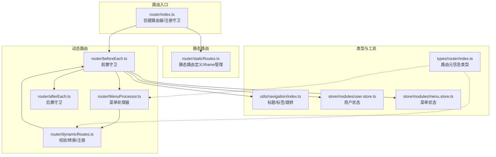
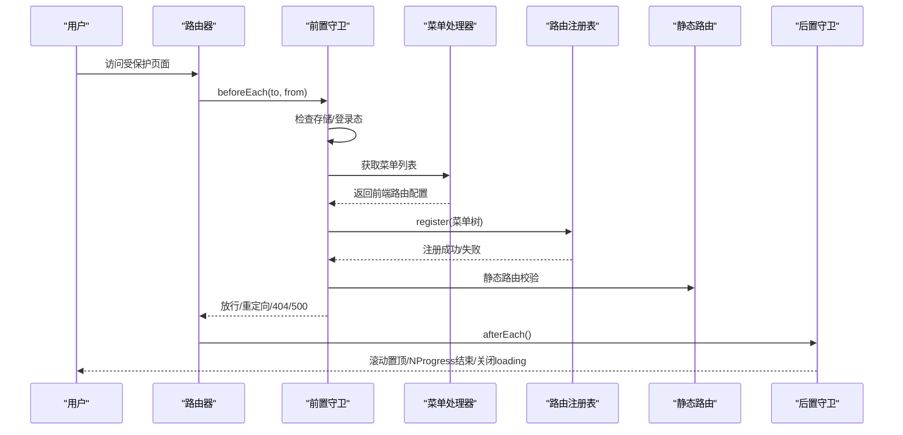
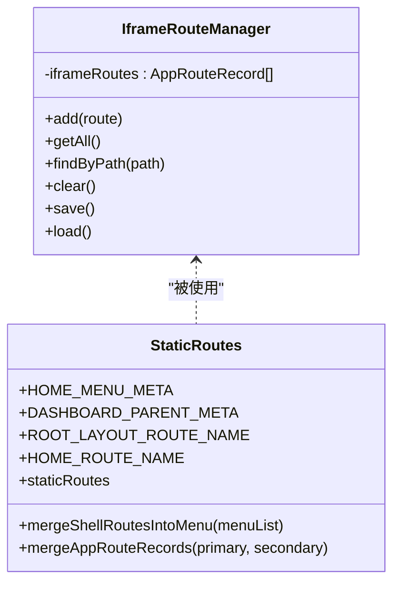
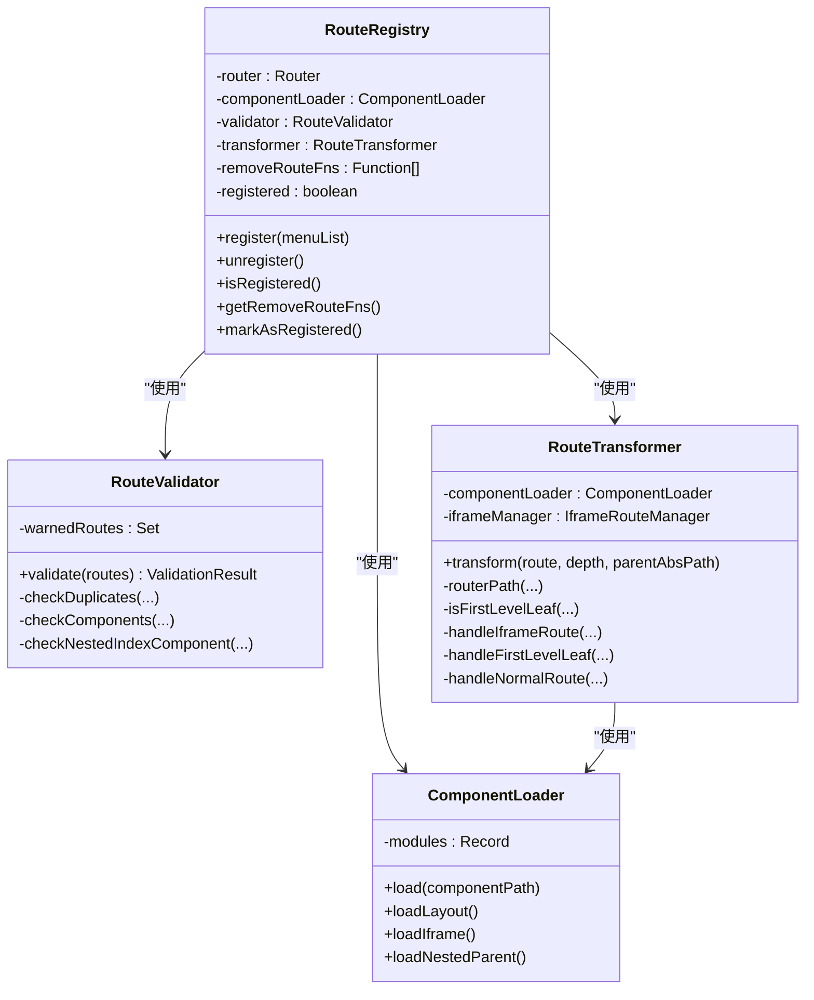
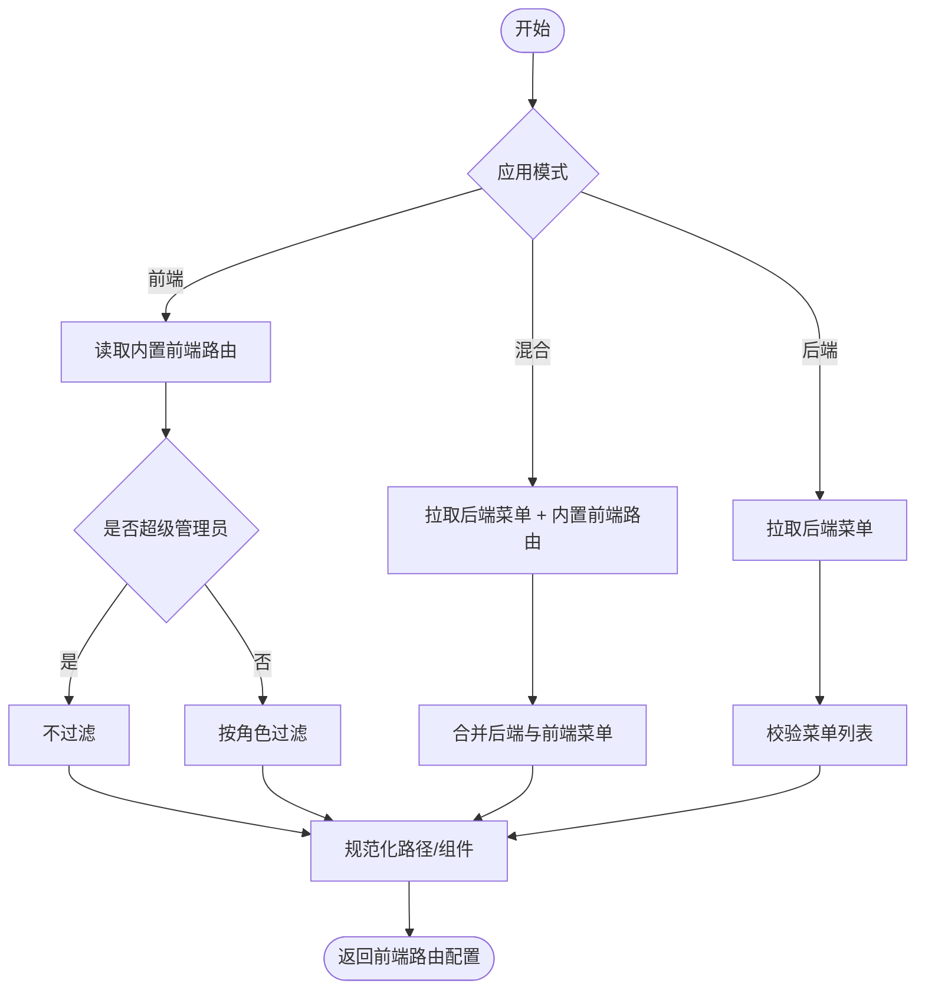
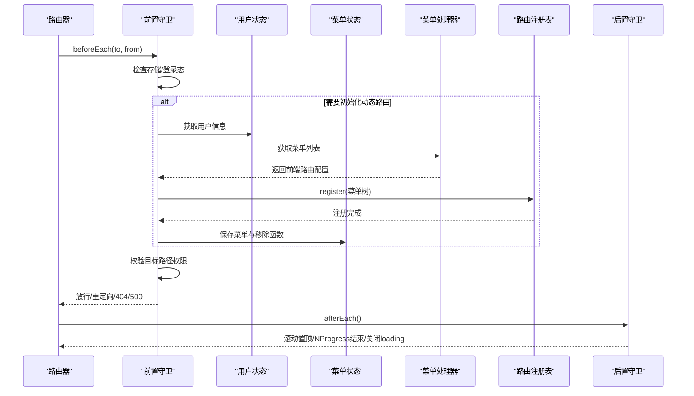
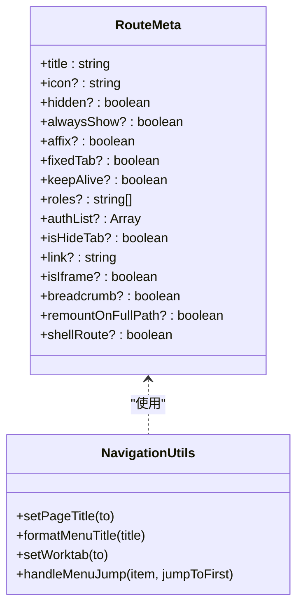
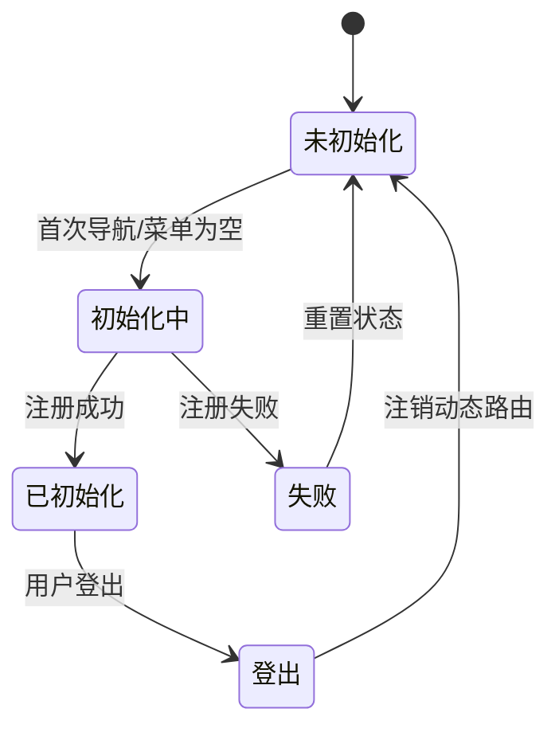
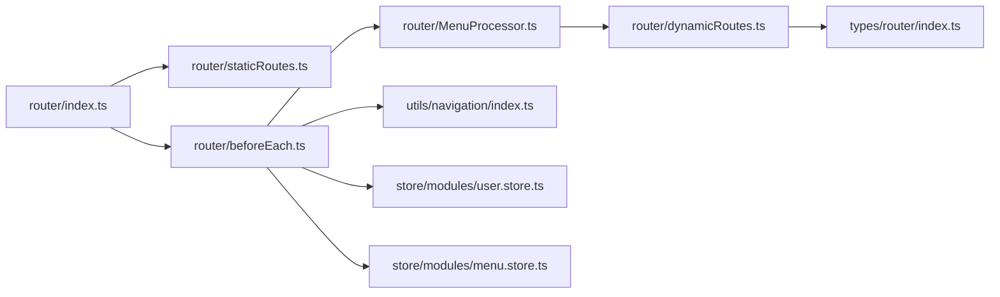

# 路由系统设计

<cite>
**本文档引用的文件**
- [router/index.ts](file://frontend/web/src/router/index.ts)
- [router/staticRoutes.ts](file://frontend/web/src/router/staticRoutes.ts)
- [router/dynamicRoutes.ts](file://frontend/web/src/router/dynamicRoutes.ts)
- [router/MenuProcessor.ts](file://frontend/web/src/router/MenuProcessor.ts)
- [router/beforeEach.ts](file://frontend/web/src/router/beforeEach.ts)
- [router/afterEach.ts](file://frontend/web/src/router/afterEach.ts)
- [types/router/index.ts](file://frontend/web/src/types/router/index.ts)
- [enums/system/menu.enum.ts](file://frontend/web/src/enums/system/menu.enum.ts)
- [utils/navigation/index.ts](file://frontend/web/src/utils/navigation/index.ts)
- [store/modules/user.store.ts](file://frontend/web/src/store/modules/user.store.ts)
- [store/modules/menu.store.ts](file://frontend/web/src/store/modules/menu.store.ts)
- [views/dashboard/home/index.vue](file://frontend/web/src/views/dashboard/home/index.vue)
- [components/layouts/index.vue](file://frontend/web/src/components/layouts/index.vue)
- [views/exception/404/index.vue](file://frontend/web/src/views/exception/404/index.vue)
- [views/module_system/auth/login/index.vue](file://frontend/web/src/views/module_system/auth/login/index.vue)
</cite>

## 目录
1. [简介](#简介)
2. [项目结构](#项目结构)
3. [核心组件](#核心组件)
4. [架构总览](#架构总览)
5. [详细组件分析](#详细组件分析)
6. [依赖关系分析](#依赖关系分析)
7. [性能考虑](#性能考虑)
8. [故障排查指南](#故障排查指南)
9. [结论](#结论)
10. [附录](#附录)

## 简介
本指南围绕基于 Vue Router 的路由系统设计，系统性阐述静态路由与动态路由的架构与实现，菜单处理器（MenuProcessor）如何将后端菜单数据转换为前端路由配置，路由元信息（meta）在权限控制、面包屑导航与页面标题设置中的使用方式，以及路由守卫的实现策略（登录验证、权限检查、页面访问控制）。同时提供路由懒加载、预加载与性能优化技巧，解释动态路由注册机制与菜单权限的联动更新，并给出新页面开发的路由配置规范与最佳实践。

## 项目结构
前端路由系统位于 `frontend/web/src/router/` 目录，采用“静态路由 + 动态路由”的混合架构：
- 静态路由：首屏即注册，无需登录即可访问，包含登录页、异常页、首页与仪表盘等。
- 动态路由：根据用户菜单权限在登录后按需注册，支持 iframe、目录占位、懒加载组件等特性。
- 菜单处理器：负责将后端菜单树转换为前端路由配置，并支持前端/混合模式。
- 路由守卫：在导航生命周期中完成登录态校验、动态路由初始化、权限校验与页面标题设置。

**图表来源**
- [router/index.ts:1-39](file://frontend/web/src/router/index.ts#L1-L39)
- [router/staticRoutes.ts:1-465](file://frontend/web/src/router/staticRoutes.ts#L1-L465)
- [router/MenuProcessor.ts:1-390](file://frontend/web/src/router/MenuProcessor.ts#L1-L390)
- [router/dynamicRoutes.ts:1-471](file://frontend/web/src/router/dynamicRoutes.ts#L1-L471)
- [router/beforeEach.ts:1-519](file://frontend/web/src/router/beforeEach.ts#L1-L519)
- [router/afterEach.ts:1-46](file://frontend/web/src/router/afterEach.ts#L1-L46)
- [types/router/index.ts:1-148](file://frontend/web/src/types/router/index.ts#L1-L148)
- [utils/navigation/index.ts:1-147](file://frontend/web/src/utils/navigation/index.ts#L1-L147)
- [store/modules/user.store.ts:1-423](file://frontend/web/src/store/modules/user.store.ts#L1-L423)
- [store/modules/menu.store.ts:1-120](file://frontend/web/src/store/modules/menu.store.ts#L1-L120)

**章节来源**
- [router/index.ts:1-39](file://frontend/web/src/router/index.ts#L1-L39)
- [router/staticRoutes.ts:1-465](file://frontend/web/src/router/staticRoutes.ts#L1-L465)

## 核心组件
- 路由器入口与初始化：创建 Hash 模式路由器，注册前置/后置守卫，导出动态路由注册与菜单转换能力。
- 静态路由：定义登录页、异常页、首页与仪表盘等无需权限即可访问的路由，并提供 iframe 路由管理器。
- 动态路由：包含校验器（RouteValidator）、组件加载器（ComponentLoader）、路由转换器（RouteTransformer）与注册表（RouteRegistry），负责将菜单树转换为路由并按需注册。
- 菜单处理器：将后端菜单树转换为前端路由配置，支持前端模式、混合模式与后端模式，过滤无效菜单并规范化路径。
- 路由守卫：在导航生命周期中完成存储有效性检查、登录态校验、动态路由初始化、权限校验、页面标题设置与工作标签同步。
- 类型与工具：定义路由元信息类型，提供页面标题设置、工作标签同步、菜单跳转等工具方法。
- 状态管理：用户状态与菜单状态分别管理用户信息、令牌、路由列表与菜单树、首页路径与动态路由移除函数。

**章节来源**
- [router/index.ts:1-39](file://frontend/web/src/router/index.ts#L1-L39)
- [router/staticRoutes.ts:1-465](file://frontend/web/src/router/staticRoutes.ts#L1-L465)
- [router/dynamicRoutes.ts:1-471](file://frontend/web/src/router/dynamicRoutes.ts#L1-L471)
- [router/MenuProcessor.ts:1-390](file://frontend/web/src/router/MenuProcessor.ts#L1-L390)
- [router/beforeEach.ts:1-519](file://frontend/web/src/router/beforeEach.ts#L1-L519)
- [types/router/index.ts:1-148](file://frontend/web/src/types/router/index.ts#L1-L148)
- [utils/navigation/index.ts:1-147](file://frontend/web/src/utils/navigation/index.ts#L1-L147)
- [store/modules/user.store.ts:1-423](file://frontend/web/src/store/modules/user.store.ts#L1-L423)
- [store/modules/menu.store.ts:1-120](file://frontend/web/src/store/modules/menu.store.ts#L1-L120)

## 架构总览
系统采用“静态路由先行 + 动态路由按需注册”的策略：
- 首屏注册静态路由，确保登录页、异常页与首页可用。
- 登录后通过前置守卫拉取用户信息与菜单，交由菜单处理器转换为前端路由配置。
- 动态路由注册表对菜单进行校验与转换，最终通过 addRoute 挂载到根布局下。
- 后置守卫负责滚动置顶、NProgress 结束与全局 loading 关闭。

**图表来源**
- [router/beforeEach.ts:134-182](file://frontend/web/src/router/beforeEach.ts#L134-L182)
- [router/MenuProcessor.ts:151-167](file://frontend/web/src/router/MenuProcessor.ts#L151-L167)
- [router/dynamicRoutes.ts:404-470](file://frontend/web/src/router/dynamicRoutes.ts#L404-L470)
- [router/staticRoutes.ts:306-464](file://frontend/web/src/router/staticRoutes.ts#L306-L464)
- [router/afterEach.ts:27-44](file://frontend/web/src/router/afterEach.ts#L27-L44)

## 详细组件分析

### 静态路由设计（staticRoutes）
- 设计原则：首屏即注册，无需登录即可访问；包含登录页、异常页、首页与仪表盘等。
- iframe 路由管理：提供单例管理器，支持添加、查询、保存与加载 iframe 路由，确保 iframe 场景下的路由一致性。
- 静态壳层合并：当后端未下发某些菜单时，通过静态壳层补全侧栏菜单，避免菜单缺失导致的导航异常。
- 路由去重与合并：提供合并函数，避免静态壳层与动态路由重复注册。

**图表来源**
- [router/staticRoutes.ts:31-79](file://frontend/web/src/router/staticRoutes.ts#L31-L79)
- [router/staticRoutes.ts:173-294](file://frontend/web/src/router/staticRoutes.ts#L173-L294)

**章节来源**
- [router/staticRoutes.ts:1-465](file://frontend/web/src/router/staticRoutes.ts#L1-L465)

### 动态路由注册（dynamicRoutes）
- 校验器（RouteValidator）：检查路由名称重复、组件缺失、深层误用布局占位等问题，输出错误与警告。
- 组件加载器（ComponentLoader）：基于 import.meta.glob 实现视图懒加载，支持布局占位、嵌套父级与 iframe 组件。
- 路由转换器（RouteTransformer）：将菜单树转换为路由记录，处理 iframe、一级叶子与普通路由的不同场景。
- 注册表（RouteRegistry）：批量注册动态路由，避免与静态壳层冲突，支持注销与状态跟踪。

**图表来源**
- [router/dynamicRoutes.ts:27-156](file://frontend/web/src/router/dynamicRoutes.ts#L27-L156)
- [router/dynamicRoutes.ts:159-255](file://frontend/web/src/router/dynamicRoutes.ts#L159-L255)
- [router/dynamicRoutes.ts:264-376](file://frontend/web/src/router/dynamicRoutes.ts#L264-L376)
- [router/dynamicRoutes.ts:404-470](file://frontend/web/src/router/dynamicRoutes.ts#L404-L470)

**章节来源**
- [router/dynamicRoutes.ts:1-471](file://frontend/web/src/router/dynamicRoutes.ts#L1-L471)

### 菜单处理器（MenuProcessor）
- 模式分支：前端模式、混合模式与后端模式，依据应用模式选择菜单来源。
- 菜单映射：将后端菜单树映射为前端路由记录，处理目录、菜单、按钮与外链类型，规范化路径与组件引用。
- 权限过滤：根据用户角色代码过滤菜单，支持超级管理员直通。
- 路径规范化：修复子菜单路径开头斜杠问题，构建绝对路径，设置默认重定向。

**图表来源**
- [router/MenuProcessor.ts:151-167](file://frontend/web/src/router/MenuProcessor.ts#L151-L167)
- [router/MenuProcessor.ts:169-211](file://frontend/web/src/router/MenuProcessor.ts#L169-L211)
- [router/MenuProcessor.ts:241-268](file://frontend/web/src/router/MenuProcessor.ts#L241-L268)
- [router/MenuProcessor.ts:274-291](file://frontend/web/src/router/MenuProcessor.ts#L274-L291)

**章节来源**
- [router/MenuProcessor.ts:1-390](file://frontend/web/src/router/MenuProcessor.ts#L1-L390)

### 路由守卫（beforeEach/afterEach）
- 前置守卫：检查存储有效性、登录态、动态路由初始化状态；按需拉取用户信息与菜单，注册动态路由，校验目标路径权限，设置页面标题与工作标签。
- 后置守卫：滚动置顶、结束 NProgress、关闭全局 loading。

**图表来源**
- [router/beforeEach.ts:134-182](file://frontend/web/src/router/beforeEach.ts#L134-L182)
- [router/beforeEach.ts:278-363](file://frontend/web/src/router/beforeEach.ts#L278-L363)
- [router/afterEach.ts:27-44](file://frontend/web/src/router/afterEach.ts#L27-L44)

**章节来源**
- [router/beforeEach.ts:1-519](file://frontend/web/src/router/beforeEach.ts#L1-L519)
- [router/afterEach.ts:1-46](file://frontend/web/src/router/afterEach.ts#L1-L46)

### 路由元信息（meta）与导航工具
- 元信息类型：定义标题、图标、隐藏、始终显示、固定标签、缓存、权限标识、角色权限等字段。
- 页面标题：根据路由元信息设置浏览器标题，支持国际化键解析。
- 工作标签：根据设置与路由元信息同步打开/同步标签页，支持 iframe 标签页特殊处理。
- 菜单跳转：支持外链、iframe 与子菜单递归跳转。

**图表来源**
- [types/router/index.ts:26-147](file://frontend/web/src/types/router/index.ts#L26-L147)
- [utils/navigation/index.ts:21-146](file://frontend/web/src/utils/navigation/index.ts#L21-L146)

**章节来源**
- [types/router/index.ts:1-148](file://frontend/web/src/types/router/index.ts#L1-L148)
- [utils/navigation/index.ts:1-147](file://frontend/web/src/utils/navigation/index.ts#L1-L147)

### 动态路由注册机制与菜单权限联动
- 注册时机：登录后首次导航或菜单为空时触发动态路由初始化。
- 注销与重建：登出或菜单清空时，路由注册表注销动态路由并清理 iframe 路由与菜单状态。
- 权限校验：在动态路由注册完成后，对目标路径进行权限校验，无权限则跳转首页。
- 状态同步：用户状态与菜单状态在登录、登出与动态路由变更时保持一致。

**图表来源**
- [router/beforeEach.ts:265-273](file://frontend/web/src/router/beforeEach.ts#L265-L273)
- [router/beforeEach.ts:380-389](file://frontend/web/src/router/beforeEach.ts#L380-L389)
- [store/modules/user.store.ts:269-312](file://frontend/web/src/store/modules/user.store.ts#L269-L312)
- [store/modules/menu.store.ts:89-93](file://frontend/web/src/store/modules/menu.store.ts#L89-L93)

**章节来源**
- [router/beforeEach.ts:265-389](file://frontend/web/src/router/beforeEach.ts#L265-L389)
- [store/modules/user.store.ts:269-312](file://frontend/web/src/store/modules/user.store.ts#L269-L312)
- [store/modules/menu.store.ts:89-93](file://frontend/web/src/store/modules/menu.store.ts#L89-L93)

## 依赖关系分析
- 路由器入口依赖静态路由与守卫模块，导出动态路由注册与菜单转换能力。
- 菜单处理器依赖应用模式钩子与菜单枚举，输出前端路由配置。
- 路由注册表依赖校验器、转换器与组件加载器，完成从菜单到路由的转换与注册。
- 路由守卫依赖用户状态、菜单状态、导航工具与 iframe 管理器，协调导航生命周期。
- 类型定义贯穿菜单处理器、动态路由与导航工具，确保元信息一致性。

**图表来源**
- [router/index.ts:1-39](file://frontend/web/src/router/index.ts#L1-L39)
- [router/staticRoutes.ts:1-465](file://frontend/web/src/router/staticRoutes.ts#L1-L465)
- [router/MenuProcessor.ts:1-390](file://frontend/web/src/router/MenuProcessor.ts#L1-L390)
- [router/dynamicRoutes.ts:1-471](file://frontend/web/src/router/dynamicRoutes.ts#L1-L471)
- [router/beforeEach.ts:1-519](file://frontend/web/src/router/beforeEach.ts#L1-L519)
- [types/router/index.ts:1-148](file://frontend/web/src/types/router/index.ts#L1-L148)
- [utils/navigation/index.ts:1-147](file://frontend/web/src/utils/navigation/index.ts#L1-L147)
- [store/modules/user.store.ts:1-423](file://frontend/web/src/store/modules/user.store.ts#L1-L423)
- [store/modules/menu.store.ts:1-120](file://frontend/web/src/store/modules/menu.store.ts#L1-L120)

**章节来源**
- [router/index.ts:1-39](file://frontend/web/src/router/index.ts#L1-L39)
- [router/beforeEach.ts:1-519](file://frontend/web/src/router/beforeEach.ts#L1-L519)

## 性能考虑
- 懒加载与按需注册：视图组件通过 import.meta.glob 懒加载，动态路由仅在登录后按需注册，减少首屏包体与初始化时间。
- 组件加载优化：布局占位与嵌套父级组件通过占位符实现，避免不必要的组件实例化。
- 路由校验与去重：注册前进行重复名称与组件路径校验，避免重复注册导致的性能与内存问题。
- 进度与加载：前置守卫开启全局 loading，后置守卫关闭，配合 NProgress 提升用户体验。
- KeepAlive 与标签页：通过元信息控制缓存与标签页行为，减少不必要的组件重建。

[本节为通用指导，无需特定文件分析]

## 故障排查指南
- 存储异常：前置守卫检测到存储失效时自动登出并重定向至登录页。
- 动态路由初始化失败：首次初始化失败后，后续导航将直接跳转 500，避免反复请求造成死循环。
- 路由路径错误：菜单处理器与校验器会输出路径与组件配置错误，定位问题并修正。
- 登录态异常：未登录访问受保护页面将被重定向至登录页并携带重定向参数。
- 404/500：静态路由中的通配 404 与异常页确保导航兜底。

**章节来源**
- [router/beforeEach.ts:147-153](file://frontend/web/src/router/beforeEach.ts#L147-L153)
- [router/beforeEach.ts:158-160](file://frontend/web/src/router/beforeEach.ts#L158-L160)
- [router/MenuProcessor.ts:351-368](file://frontend/web/src/router/MenuProcessor.ts#L351-L368)
- [router/dynamicRoutes.ts:135-151](file://frontend/web/src/router/dynamicRoutes.ts#L135-L151)
- [router/staticRoutes.ts:458-463](file://frontend/web/src/router/staticRoutes.ts#L458-L463)

## 结论
该路由系统通过“静态路由先行 + 动态路由按需注册”的架构，实现了登录态校验、权限控制、页面标题与工作标签同步、iframe 支持与懒加载优化。菜单处理器将后端菜单树转换为前端路由配置，路由守卫在导航生命周期中完成关键控制点，确保安全性与用户体验。结合本文提供的配置规范与最佳实践，可高效扩展新页面并维护路由系统的稳定性与可维护性。

[本节为总结，无需特定文件分析]

## 附录

### 路由元信息字段说明
- title：页面标题，支持国际化键。
- icon：菜单图标。
- hidden：是否隐藏菜单。
- alwaysShow：父级始终显示。
- affix/fixedTab：固定标签页。
- keepAlive：是否缓存页面。
- roles：角色权限列表。
- authList：操作权限列表。
- isHideTab：是否隐藏标签页。
- link/isIframe：外链与 iframe 标识。
- breadcrumb：是否在面包屑中隐藏。
- remountOnFullPath：按 fullPath 重挂载以触发整页刷新。
- shellRoute：静态壳层路由标识。

**章节来源**
- [types/router/index.ts:26-147](file://frontend/web/src/types/router/index.ts#L26-L147)

### 路由守卫关键流程
- 存储有效性检查 → 登录态校验 → 动态路由初始化（拉取用户信息与菜单）→ 注册动态路由 → 校验目标路径权限 → 设置页面标题与工作标签 → 放行或重定向。

**章节来源**
- [router/beforeEach.ts:134-182](file://frontend/web/src/router/beforeEach.ts#L134-L182)
- [router/beforeEach.ts:278-363](file://frontend/web/src/router/beforeEach.ts#L278-L363)

### 新页面开发路由配置规范与最佳实践
- 路由命名：使用语义化 name，避免与静态路由冲突。
- 路径规范：一级菜单使用绝对路径，子菜单使用相对路径；遵循菜单处理器路径规范化规则。
- 组件引用：目录菜单使用布局占位或嵌套父级占位，叶子菜单指向具体组件路径。
- 权限控制：在 meta 中配置 roles 与 authList，确保菜单与页面权限一致。
- 标题与图标：在 meta 中设置 title 与 icon，支持国际化键与图标库。
- 缓存策略：根据页面复杂度设置 keepAlive，必要时使用 remountOnFullPath。
- iframe 外链：使用 isIframe 与 link 字段，确保 iframe 路由正确注册与标签页处理。

**章节来源**
- [router/MenuProcessor.ts:101-142](file://frontend/web/src/router/MenuProcessor.ts#L101-L142)
- [router/dynamicRoutes.ts:159-255](file://frontend/web/src/router/dynamicRoutes.ts#L159-L255)
- [types/router/index.ts:94-147](file://frontend/web/src/types/router/index.ts#L94-L147)