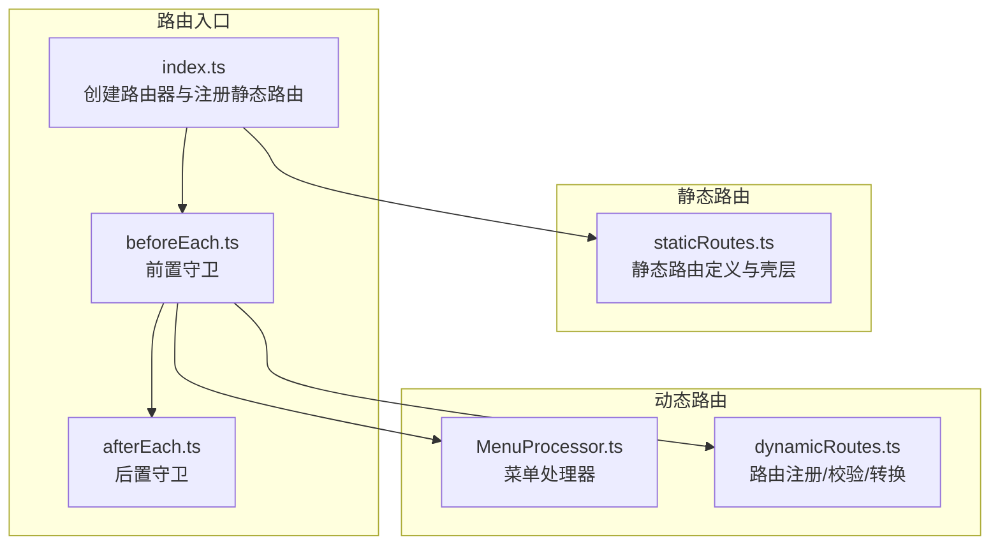
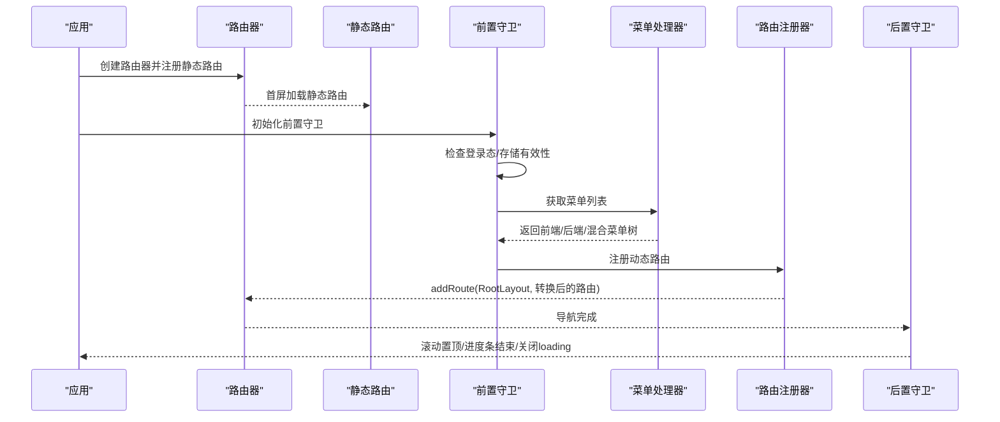
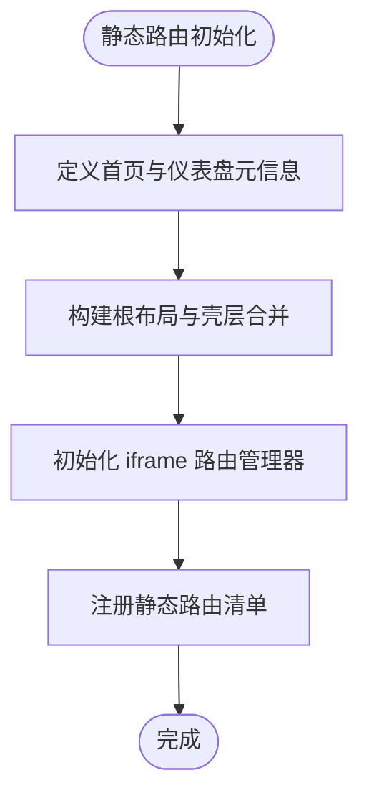
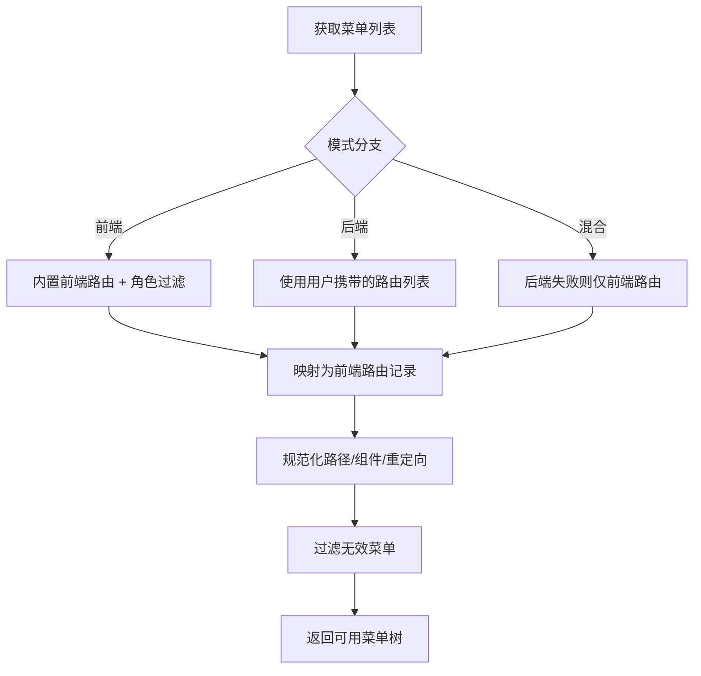
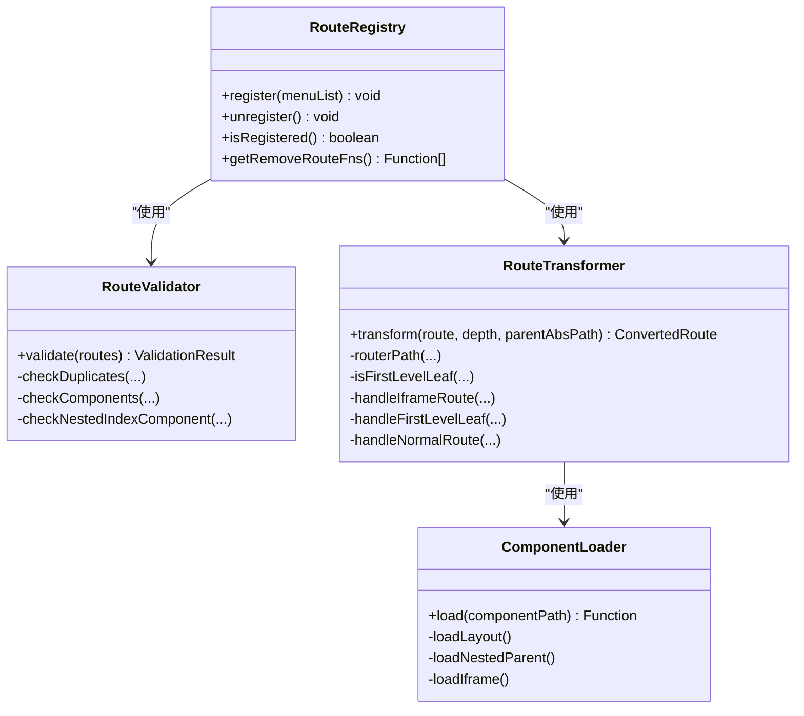
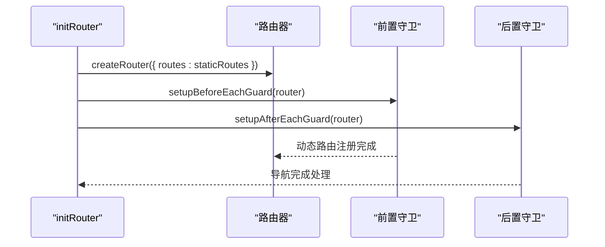
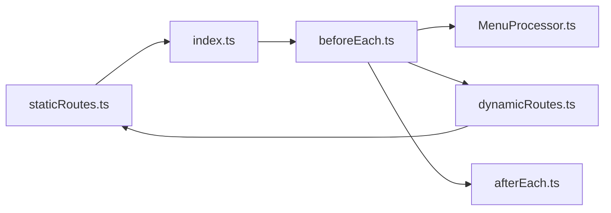

# 静态路由设计

<cite>
**本文档引用的文件**
- [staticRoutes.ts](file://frontend/web/src/router/staticRoutes.ts)
- [MenuProcessor.ts](file://frontend/web/src/router/MenuProcessor.ts)
- [dynamicRoutes.ts](file://frontend/web/src/router/dynamicRoutes.ts)
- [index.ts](file://frontend/web/src/router/index.ts)
- [beforeEach.ts](file://frontend/web/src/router/beforeEach.ts)
- [afterEach.ts](file://frontend/web/src/router/afterEach.ts)
- [index.ts](file://frontend/web/src/types/router/index.ts)
- [menu.enum.ts](file://frontend/web/src/enums/system/menu.enum.ts)
- [sys_menu.json](file://backend/app/scripts/data/sys_menu.json)
</cite>

## 目录
1. [简介](#简介)
2. [项目结构](#项目结构)
3. [核心组件](#核心组件)
4. [架构总览](#架构总览)
5. [详细组件分析](#详细组件分析)
6. [依赖关系分析](#依赖关系分析)
7. [性能考量](#性能考量)
8. [故障排查指南](#故障排查指南)
9. [结论](#结论)
10. [附录](#附录)

## 简介
本文件系统性阐述前端静态路由设计，涵盖静态路由的概念与作用、基础路由配置（首页路由、根布局路由等）、静态路由定义方式与命名规范、路径规则、菜单处理器如何将后端菜单数据转换为静态路由配置、路由元信息（meta）的配置要点（权限标识、面包屑设置、页面标题等）、静态路由扩展与新增路由的最佳实践，以及静态路由与动态路由的区别与协作关系。

## 项目结构
前端路由位于 `frontend/web/src/router/` 目录，采用“静态路由首屏注册 + 动态路由按需注册”的双轨设计：
- 静态路由：在应用启动时一次性注册，无需登录即可访问，包含根布局、登录页、异常页、首页与仪表盘等。
- 动态路由：在用户登录后，根据后端菜单数据与前端内置路由，经由菜单处理器与路由注册器动态挂载。

图表来源
- [index.ts:16-27](file://frontend/web/src/router/index.ts#L16-L27)
- [staticRoutes.ts:296-464](file://frontend/web/src/router/staticRoutes.ts#L296-L464)
- [MenuProcessor.ts:151-167](file://frontend/web/src/router/MenuProcessor.ts#L151-L167)
- [dynamicRoutes.ts:404-470](file://frontend/web/src/router/dynamicRoutes.ts#L404-L470)
- [beforeEach.ts:90-110](file://frontend/web/src/router/beforeEach.ts#L90-L110)
- [afterEach.ts:13-45](file://frontend/web/src/router/afterEach.ts#L13-L45)

章节来源
- [index.ts:16-27](file://frontend/web/src/router/index.ts#L16-L27)
- [staticRoutes.ts:296-464](file://frontend/web/src/router/staticRoutes.ts#L296-L464)

## 核心组件
- 静态路由定义与壳层：负责定义无需登录即可访问的基础路由、根布局、首页与仪表盘等，并提供壳层合并与 iframe 路由管理能力。
- 菜单处理器（MenuProcessor）：将后端菜单数据转换为前端路由结构，支持前端模式、后端模式与混合模式，负责路径规范化、组件映射与权限过滤。
- 动态路由注册器（RouteRegistry）：对菜单树进行校验、转换与批量注册，确保不与静态壳层冲突。
- 路由入口与守卫：创建路由器、注册静态路由、设置前置/后置守卫，完成登录态校验、动态路由初始化与页面标题设置等。

章节来源
- [staticRoutes.ts:1-14](file://frontend/web/src/router/staticRoutes.ts#L1-L14)
- [MenuProcessor.ts:151-167](file://frontend/web/src/router/MenuProcessor.ts#L151-L167)
- [dynamicRoutes.ts:404-470](file://frontend/web/src/router/dynamicRoutes.ts#L404-L470)
- [index.ts:16-27](file://frontend/web/src/router/index.ts#L16-L27)
- [beforeEach.ts:90-110](file://frontend/web/src/router/beforeEach.ts#L90-L110)
- [afterEach.ts:13-45](file://frontend/web/src/router/afterEach.ts#L13-L45)

## 架构总览
静态路由与动态路由协同工作：静态路由在首屏注册，保障基础导航与异常页可用；动态路由在登录后按菜单树注册，实现权限驱动的页面导航。菜单处理器负责将后端菜单映射为前端路由记录，并通过注册器安全地添加到根布局下。

图表来源
- [index.ts:16-27](file://frontend/web/src/router/index.ts#L16-L27)
- [beforeEach.ts:134-182](file://frontend/web/src/router/beforeEach.ts#L134-L182)
- [MenuProcessor.ts:151-167](file://frontend/web/src/router/MenuProcessor.ts#L151-L167)
- [dynamicRoutes.ts:404-470](file://frontend/web/src/router/dynamicRoutes.ts#L404-L470)
- [afterEach.ts:27-44](file://frontend/web/src/router/afterEach.ts#L27-L44)

## 详细组件分析

### 静态路由定义与壳层
- 首页与仪表盘：定义首页与仪表盘子路由，提供 keepAlive、fixedTab 等元信息，保证标签页与缓存策略。
- 根布局与壳层合并：通过壳层合并函数，将静态首页与仪表盘子路由补充到菜单树中，避免后端未下发时侧栏缺失。
- iframe 路由管理：提供 iframe 路由注册表，支持持久化与动态加载，统一 iframe 页面渲染。
- 静态路由清单：包含重定向、登录页、异常页、根布局与首页/仪表盘等，均无需登录即可访问。

图表来源
- [staticRoutes.ts:16-22](file://frontend/web/src/router/staticRoutes.ts#L16-L22)
- [staticRoutes.ts:173-197](file://frontend/web/src/router/staticRoutes.ts#L173-L197)
- [staticRoutes.ts:31-79](file://frontend/web/src/router/staticRoutes.ts#L31-L79)
- [staticRoutes.ts:296-464](file://frontend/web/src/router/staticRoutes.ts#L296-L464)

章节来源
- [staticRoutes.ts:16-22](file://frontend/web/src/router/staticRoutes.ts#L16-L22)
- [staticRoutes.ts:173-197](file://frontend/web/src/router/staticRoutes.ts#L173-L197)
- [staticRoutes.ts:31-79](file://frontend/web/src/router/staticRoutes.ts#L31-L79)
- [staticRoutes.ts:296-464](file://frontend/web/src/router/staticRoutes.ts#L296-L464)

### 菜单处理器（MenuProcessor）
- 模式分支：支持前端模式、后端模式与混合模式，依据应用模式决定菜单来源。
- 菜单映射：将后端菜单树映射为前端路由记录，自动规范化路径与组件路径，处理目录与叶子节点差异。
- 权限过滤：基于角色代码过滤菜单，确保仅注册有权限的路由。
- 路径规范化：处理相对路径、绝对路径与外链，确保最终路径合法且可导航。
- 空菜单过滤：过滤掉无效菜单，保留 iframe 与具备组件的路由。

图表来源
- [MenuProcessor.ts:151-167](file://frontend/web/src/router/MenuProcessor.ts#L151-L167)
- [MenuProcessor.ts:169-187](file://frontend/web/src/router/MenuProcessor.ts#L169-L187)
- [MenuProcessor.ts:201-211](file://frontend/web/src/router/MenuProcessor.ts#L201-L211)
- [MenuProcessor.ts:144-149](file://frontend/web/src/router/MenuProcessor.ts#L144-L149)
- [MenuProcessor.ts:241-268](file://frontend/web/src/router/MenuProcessor.ts#L241-L268)

章节来源
- [MenuProcessor.ts:151-167](file://frontend/web/src/router/MenuProcessor.ts#L151-L167)
- [MenuProcessor.ts:169-187](file://frontend/web/src/router/MenuProcessor.ts#L169-L187)
- [MenuProcessor.ts:201-211](file://frontend/web/src/router/MenuProcessor.ts#L201-L211)
- [MenuProcessor.ts:144-149](file://frontend/web/src/router/MenuProcessor.ts#L144-L149)
- [MenuProcessor.ts:241-268](file://frontend/web/src/router/MenuProcessor.ts#L241-L268)

### 动态路由注册与转换
- 校验器（RouteValidator）：检查重复名称、缺少组件、深层误用布局占位等问题，输出错误与警告。
- 组件加载器（ComponentLoader）：将字符串组件路径解析为懒加载函数，支持布局、嵌套父级与 iframe 视图。
- 路由转换器（RouteTransformer）：将菜单树转换为 vue-router 记录，处理 iframe、一级叶子与普通路由的不同分支。
- 注册器（RouteRegistry）：对校验通过的路由进行批量注册，避免与静态壳层冲突，支持注销与幂等注册。

图表来源
- [dynamicRoutes.ts:27-156](file://frontend/web/src/router/dynamicRoutes.ts#L27-L156)
- [dynamicRoutes.ts:159-255](file://frontend/web/src/router/dynamicRoutes.ts#L159-L255)
- [dynamicRoutes.ts:264-376](file://frontend/web/src/router/dynamicRoutes.ts#L264-L376)
- [dynamicRoutes.ts:404-470](file://frontend/web/src/router/dynamicRoutes.ts#L404-L470)

章节来源
- [dynamicRoutes.ts:27-156](file://frontend/web/src/router/dynamicRoutes.ts#L27-L156)
- [dynamicRoutes.ts:159-255](file://frontend/web/src/router/dynamicRoutes.ts#L159-L255)
- [dynamicRoutes.ts:264-376](file://frontend/web/src/router/dynamicRoutes.ts#L264-L376)
- [dynamicRoutes.ts:404-470](file://frontend/web/src/router/dynamicRoutes.ts#L404-L470)

### 路由入口与守卫
- 路由入口：创建路由器并以静态路由为初始 routes，随后在前置守卫中按需注册动态路由。
- 前置守卫：处理存储失效、登录态、动态路由初始化、根路径重定向、工作标签同步与页面标题设置，以及 404/500 降级。
- 后置守卫：滚动置顶、进度条结束与全局 loading 关闭。

图表来源
- [index.ts:16-27](file://frontend/web/src/router/index.ts#L16-L27)
- [beforeEach.ts:90-110](file://frontend/web/src/router/beforeEach.ts#L90-L110)
- [afterEach.ts:13-45](file://frontend/web/src/router/afterEach.ts#L13-L45)

章节来源
- [index.ts:16-27](file://frontend/web/src/router/index.ts#L16-L27)
- [beforeEach.ts:90-110](file://frontend/web/src/router/beforeEach.ts#L90-L110)
- [afterEach.ts:13-45](file://frontend/web/src/router/afterEach.ts#L13-L45)

## 依赖关系分析
- 静态路由依赖：静态路由定义文件提供根布局、首页、仪表盘与异常页等基础路由，是应用导航的基石。
- 菜单处理器依赖：菜单处理器依赖应用模式钩子、用户信息与菜单枚举，将后端菜单映射为前端路由记录。
- 动态路由依赖：动态路由依赖静态路由的壳层常量（如 ROOT_LAYOUT_ROUTE_NAME），确保动态路由挂载到正确的父级。
- 守卫依赖：前置守卫依赖菜单处理器与注册器，后置守卫依赖设置与工具模块。

图表来源
- [index.ts:3-38](file://frontend/web/src/router/index.ts#L3-L38)
- [staticRoutes.ts:81-82](file://frontend/web/src/router/staticRoutes.ts#L81-L82)
- [MenuProcessor.ts:1-14](file://frontend/web/src/router/MenuProcessor.ts#L1-L14)
- [dynamicRoutes.ts:9-15](file://frontend/web/src/router/dynamicRoutes.ts#L9-L15)
- [beforeEach.ts:26-40](file://frontend/web/src/router/beforeEach.ts#L26-L40)
- [afterEach.ts:4-8](file://frontend/web/src/router/afterEach.ts#L4-L8)

章节来源
- [index.ts:3-38](file://frontend/web/src/router/index.ts#L3-L38)
- [staticRoutes.ts:81-82](file://frontend/web/src/router/staticRoutes.ts#L81-L82)
- [MenuProcessor.ts:1-14](file://frontend/web/src/router/MenuProcessor.ts#L1-L14)
- [dynamicRoutes.ts:9-15](file://frontend/web/src/router/dynamicRoutes.ts#L9-L15)
- [beforeEach.ts:26-40](file://frontend/web/src/router/beforeEach.ts#L26-L40)
- [afterEach.ts:4-8](file://frontend/web/src/router/afterEach.ts#L4-L8)

## 性能考量
- 首屏加载：静态路由在首屏注册，减少首次导航等待时间。
- 懒加载：动态路由组件通过 import.meta.glob 懒加载，降低初始包体。
- 缓存策略：首页与仪表盘默认开启 keepAlive，提升切换体验。
- 路由校验：注册前严格校验重复名称与缺失组件，避免运行时错误与重复注册带来的性能损耗。

## 故障排查指南
- 动态路由注册失败：检查菜单处理器返回的菜单树是否为空或路径不合法，确认注册器校验是否通过。
- 静态路由被覆盖：确认动态路由的一级路径段未与静态壳层冲突（如 home、dashboard 等）。
- 组件未找到：检查 ComponentLoader 是否能正确解析组件路径，确认 views 目录结构与路径一致。
- 登录态异常：检查前置守卫中的存储有效性检测与登录态判断逻辑。

章节来源
- [beforeEach.ts:278-363](file://frontend/web/src/router/beforeEach.ts#L278-L363)
- [dynamicRoutes.ts:419-470](file://frontend/web/src/router/dynamicRoutes.ts#L419-L470)
- [dynamicRoutes.ts:159-255](file://frontend/web/src/router/dynamicRoutes.ts#L159-L255)
- [beforeEach.ts:147-202](file://frontend/web/src/router/beforeEach.ts#L147-L202)

## 结论
静态路由与动态路由在本项目中形成互补：静态路由保障基础导航与异常页可用，动态路由基于权限与菜单树实现灵活扩展。通过菜单处理器与注册器的严格校验与转换，系统实现了高可靠、可维护的路由体系。遵循本文的命名规范、路径规则与扩展实践，可确保新增路由与现有架构无缝集成。

## 附录

### 静态路由概念与作用
- 静态路由：无需登录即可访问的基础路由，包含根布局、登录页、异常页与首页/仪表盘等。
- 作用：提供首屏导航骨架，确保用户在未登录状态下也能访问必要的页面。

章节来源
- [staticRoutes.ts:1-8](file://frontend/web/src/router/staticRoutes.ts#L1-L8)

### 基础路由配置
- 根布局与首页：根布局作为动态路由挂载点，首页与仪表盘子路由提供默认导航。
- 异常页：401/403/404/500 等异常页独立于主布局，便于快速定位问题。
- 登录页：支持多入口登录路径，便于与静态路由白名单配合。

章节来源
- [staticRoutes.ts:296-464](file://frontend/web/src/router/staticRoutes.ts#L296-L464)

### 静态路由定义方式与命名规范
- 定义方式：在静态路由文件中声明 path、name、component、meta 与 children。
- 命名规范：name 必须唯一，建议使用层级拼接的驼峰命名；path 建议以斜杠开头的绝对路径。
- 路径规则：静态路由 path 与 name 不应与动态路由冲突，避免覆盖首页/仪表盘等壳层。

章节来源
- [staticRoutes.ts:296-464](file://frontend/web/src/router/staticRoutes.ts#L296-L464)
- [dynamicRoutes.ts:378-402](file://frontend/web/src/router/dynamicRoutes.ts#L378-L402)

### 路由元信息（meta）配置
- 标题与图标：title 与 icon 控制菜单显示与国际化键值。
- 隐藏与显示：hidden/alwaysShow 控制菜单可见性与父级显示策略。
- 缓存与标签：keepAlive/fixedTab 控制页面缓存与标签固定。
- 权限标识：authMark/roles 控制按钮级权限与角色过滤。
- 面包屑：breadcrumb 控制面包屑导航显示。

章节来源
- [index.ts:26-88](file://frontend/web/src/types/router/index.ts#L26-L88)
- [index.ts:94-136](file://frontend/web/src/types/router/index.ts#L94-L136)

### 菜单处理器（MenuProcessor）与静态路由的关系
- 菜单映射：将后端菜单树映射为前端路由记录，自动处理目录与叶子节点差异。
- 壳层合并：通过壳层合并函数，将静态首页与仪表盘子路由补充到菜单树中，避免后端未下发时侧栏缺失。
- 路径规范化：处理相对路径、绝对路径与外链，确保最终路径合法且可导航。

章节来源
- [MenuProcessor.ts:101-142](file://frontend/web/src/router/MenuProcessor.ts#L101-L142)
- [MenuProcessor.ts:173-187](file://frontend/web/src/router/MenuProcessor.ts#L173-L187)
- [MenuProcessor.ts:274-291](file://frontend/web/src/router/MenuProcessor.ts#L274-L291)

### 静态路由与动态路由的区别与协作
- 区别：静态路由无需登录即可访问，动态路由基于权限与菜单树按需注册。
- 协作：静态路由提供壳层与基础导航，动态路由填充具体页面；注册器确保不与静态壳层冲突。

章节来源
- [staticRoutes.ts:1-8](file://frontend/web/src/router/staticRoutes.ts#L1-L8)
- [dynamicRoutes.ts:378-402](file://frontend/web/src/router/dynamicRoutes.ts#L378-L402)
- [beforeEach.ts:278-363](file://frontend/web/src/router/beforeEach.ts#L278-L363)

### 扩展方法与新增路由最佳实践
- 新增静态路由：在静态路由文件中定义，确保 path 与 name 唯一，避免与壳层冲突。
- 新增动态路由：通过后端菜单或前端内置路由扩展，确保 component 路径正确，meta 字段完整。
- 路由校验：注册前通过校验器检查重复名称与缺失组件，避免运行时错误。
- 路径规范化：遵循相对/绝对路径规则，确保最终路径合法且可导航。

章节来源
- [staticRoutes.ts:296-464](file://frontend/web/src/router/staticRoutes.ts#L296-L464)
- [MenuProcessor.ts:144-149](file://frontend/web/src/router/MenuProcessor.ts#L144-L149)
- [dynamicRoutes.ts:27-156](file://frontend/web/src/router/dynamicRoutes.ts#L27-L156)