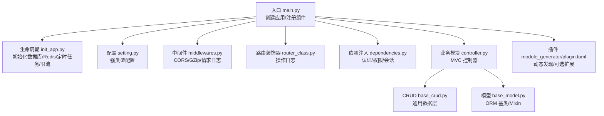
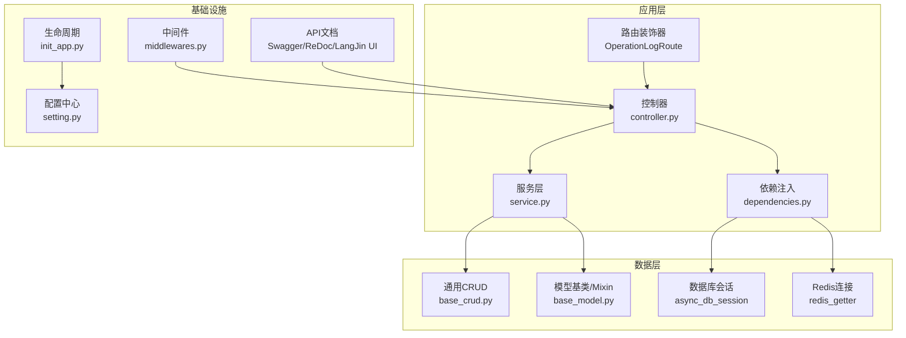
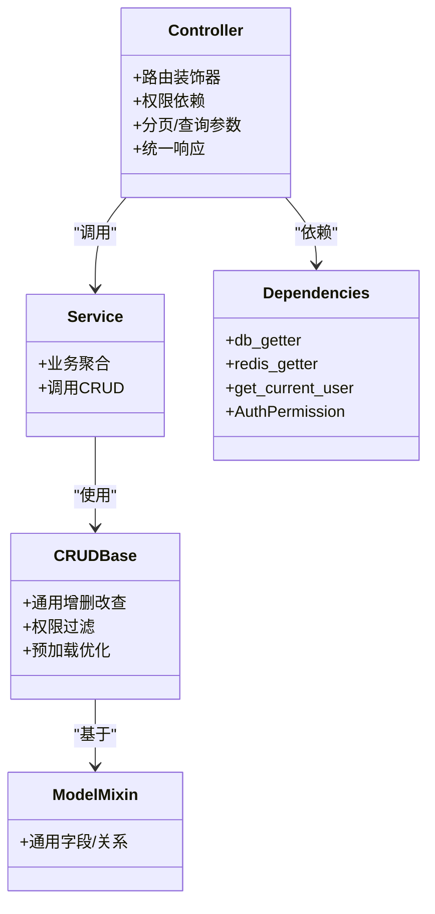
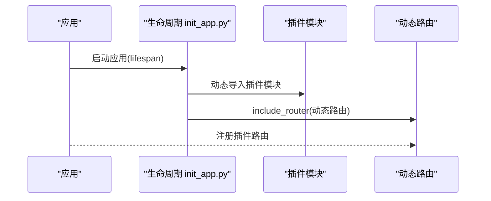
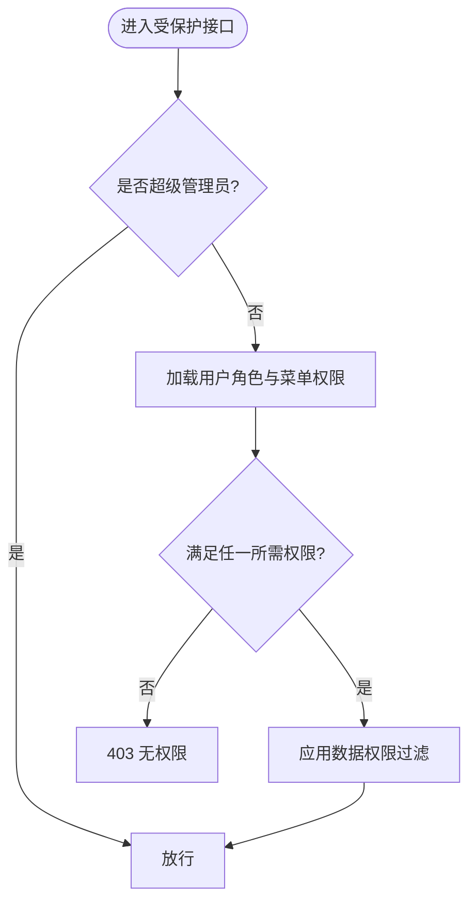
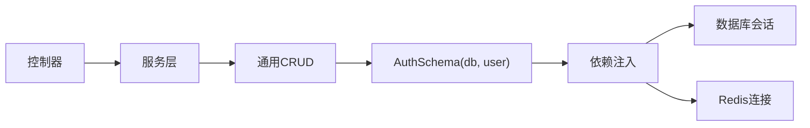

# 后端开发指南

<cite>
**本文引用的文件**
- [backend/main.py](file://backend/main.py)
- [backend/pyproject.toml](file://backend/pyproject.toml)
- [backend/requirements.txt](file://backend/requirements.txt)
- [backend/app/config/setting.py](file://backend/app/config/setting.py)
- [backend/app/config/path_conf.py](file://backend/app/config/path_conf.py)
- [backend/app/core/base_model.py](file://backend/app/core/base_model.py)
- [backend/app/core/base_crud.py](file://backend/app/core/base_crud.py)
- [backend/app/core/router_class.py](file://backend/app/core/router_class.py)
- [backend/app/core/dependencies.py](file://backend/app/core/dependencies.py)
- [backend/app/common/enums.py](file://backend/app/common/enums.py)
- [backend/app/api/v1/module_system/user/controller.py](file://backend/app/api/v1/module_system/user/controller.py)
- [backend/app/api/v1/module_system/user/model.py](file://backend/app/api/v1/module_system/user/model.py)
- [backend/app/api/v1/module_system/user/crud.py](file://backend/app/api/v1/module_system/user/crud.py)
- [backend/app/api/v1/module_system/user/service.py](file://backend/app/api/v1/module_system/user/service.py)
- [backend/app/api/v1/module_system/user/schema.py](file://backend/app/api/v1/module_system/user/schema.py)
- [backend/app/plugin/module_example/demo/controller.py](file://backend/app/plugin/module_example/demo/controller.py)
- [backend/app/plugin/module_example/demo/service.py](file://backend/app/plugin/module_example/demo/service.py)
- [backend/app/plugin/module_example/demo/model.py](file://backend/app/plugin/module_example/demo/model.py)
- [backend/app/plugin/module_example/demo/crud.py](file://backend/app/plugin/module_example/demo/crud.py)
- [backend/app/plugin/module_example/demo/schema.py](file://backend/app/plugin/module_example/demo/schema.py)
- [backend/app/core/middlewares.py](file://backend/app/core/middlewares.py)
- [backend/app/scripts/init_app.py](file://backend/app/scripts/init_app.py)
- [backend/app/plugin/module_generator/plugin.toml](file://backend/app/plugin/module_generator/plugin.toml)
</cite>

## 目录
1. [引言](#引言)
2. [项目结构](#项目结构)
3. [核心组件](#核心组件)
4. [架构总览](#架构总览)
5. [详细组件分析](#详细组件分析)
6. [依赖分析](#依赖分析)
7. [性能考虑](#性能考虑)
8. [故障排查指南](#故障排查指南)
9. [结论](#结论)
10. [附录](#附录)

## 引言
本指南面向 FastapiAdmin 后端开发者，系统性讲解项目结构与分包理念、核心开发模式（MVC 分层、依赖注入、插件化）、开发规范（命名、组织、权限、日志）、数据模型与 API 设计、错误处理机制，并提供插件开发流程与调试技巧。目标是帮助你在保持高内聚低耦合的同时，快速构建稳定、可扩展、易维护的后端服务。

## 项目结构
FastapiAdmin 后端采用“按业务特性分包”的组织方式，将系统划分为多个模块（如 system、monitor、application、common），并在每个模块下遵循 MVC 分层（controller/crud/service/model/schema）与统一的依赖注入入口。插件以独立子模块形式存在，通过配置文件声明并动态发现注册。

- 入口与生命周期
  - 应用入口与生命周期管理集中在 [backend/main.py](file://backend/main.py)，负责创建 FastAPI 实例、注册中间件、路由、静态资源与文档。
  - 生命周期钩子在 [backend/app/scripts/init_app.py](file://backend/app/scripts/init_app.py) 中集中初始化数据库、Redis、定时任务、限流器等。

- 配置体系
  - 配置类与环境变量加载在 [backend/app/config/setting.py](file://backend/app/config/setting.py)，通过 Pydantic Settings 提供强类型配置。
  - 路径常量在 [backend/app/config/path_conf.py](file://backend/app/config/path_conf.py) 统一管理。

- 核心基础设施
  - ORM 基类与通用 Mixin 在 [backend/app/core/base_model.py](file://backend/app/core/base_model.py)。
  - 通用 CRUD 在 [backend/app/core/base_crud.py](file://backend/app/core/base_crud.py)。
  - 路由装饰器（操作日志）在 [backend/app/core/router_class.py](file://backend/app/core/router_class.py)。
  - 依赖注入与权限校验在 [backend/app/core/dependencies.py](file://backend/app/core/dependencies.py)。
  - 中间件在 [backend/app/core/middlewares.py](file://backend/app/core/middlewares.py)。

- 业务模块
  - 系统模块（用户、角色、菜单、字典、日志等）在 [backend/app/api/v1/module_system/...](file://backend/app/api/v1/module_system/)。
  - 示例模块（module_example）与生成器模块（module_generator）在 [backend/app/plugin/...](file://backend/app/plugin/)，体现插件化扩展能力。

- 依赖与运行
  - 依赖清单在 [backend/pyproject.toml](file://backend/pyproject.toml) 与 [backend/requirements.txt](file://backend/requirements.txt)。
  - 插件元信息在 [backend/app/plugin/module_generator/plugin.toml](file://backend/app/plugin/module_generator/plugin.toml)。

**图表来源**
- [backend/main.py:16-51](file://backend/main.py#L16-L51)
- [backend/app/scripts/init_app.py:27-93](file://backend/app/scripts/init_app.py#L27-L93)
- [backend/app/config/setting.py:13-355](file://backend/app/config/setting.py#L13-L355)
- [backend/app/core/middlewares.py:22-215](file://backend/app/core/middlewares.py#L22-L215)
- [backend/app/core/router_class.py:24-165](file://backend/app/core/router_class.py#L24-L165)
- [backend/app/core/dependencies.py:21-296](file://backend/app/core/dependencies.py#L21-L296)
- [backend/app/core/base_crud.py:26-571](file://backend/app/core/base_crud.py#L26-L571)
- [backend/app/core/base_model.py:21-228](file://backend/app/core/base_model.py#L21-L228)
- [backend/app/plugin/module_generator/plugin.toml:1-9](file://backend/app/plugin/module_generator/plugin.toml#L1-L9)

**章节来源**
- [backend/main.py:16-51](file://backend/main.py#L16-L51)
- [backend/app/scripts/init_app.py:27-93](file://backend/app/scripts/init_app.py#L27-L93)
- [backend/app/config/setting.py:13-355](file://backend/app/config/setting.py#L13-L355)
- [backend/app/config/path_conf.py:1-32](file://backend/app/config/path_conf.py#L1-L32)

## 核心组件
- 配置中心（Settings）
  - 通过 LRU 缓存的单例模式提供全局配置，支持环境切换、数据库/Redis/日志/跨域/认证/静态资源/文档等配置项。
  - 支持动态拼装中间件列表、事件列表、FastAPI 关键参数等。

- ORM 基类与 Mixin
  - 统一的异步 ORM 基类，提供 UUID、状态、时间戳、软删除、租户隔离、用户审计等通用字段与关系。

- 通用 CRUD
  - 提供 get/list/tree_list/page/create/update/delete/set/restore/clear 等通用能力，内置权限过滤、预加载、排序、搜索条件构建、主键计数优化等。

- 依赖注入与权限
  - 依赖提供数据库会话、Redis 连接、当前用户解析与校验、权限校验器（支持超级管理员豁免、角色绑定权限集合）。

- 路由装饰器与中间件
  - OperationLogRoute 记录操作日志；自定义 CORS/GZip/请求日志中间件；演示模式下的 IP 白名单/黑名单拦截。

- 生命周期与初始化
  - 通过 lifespan 钩子完成数据库初始化、全局事件加载、系统配置与字典注入、定时任务调度器、请求限流器初始化。

**章节来源**
- [backend/app/config/setting.py:13-355](file://backend/app/config/setting.py#L13-L355)
- [backend/app/core/base_model.py:21-228](file://backend/app/core/base_model.py#L21-L228)
- [backend/app/core/base_crud.py:26-571](file://backend/app/core/base_crud.py#L26-L571)
- [backend/app/core/dependencies.py:21-296](file://backend/app/core/dependencies.py#L21-L296)
- [backend/app/core/router_class.py:24-165](file://backend/app/core/router_class.py#L24-L165)
- [backend/app/core/middlewares.py:22-215](file://backend/app/core/middlewares.py#L22-L215)
- [backend/app/scripts/init_app.py:27-93](file://backend/app/scripts/init_app.py#L27-L93)

## 架构总览
系统采用 FastAPI + SQLAlchemy 2.x 异步 ORM + Redis + 定时任务 + 请求限流的组合。MVC 分层清晰，依赖注入贯穿控制器、服务与数据层，插件化扩展通过 TOML 元信息与动态发现机制实现。

**图表来源**
- [backend/app/core/router_class.py:24-165](file://backend/app/core/router_class.py#L24-L165)
- [backend/app/api/v1/module_system/user/controller.py:30-456](file://backend/app/api/v1/module_system/user/controller.py#L30-L456)
- [backend/app/api/v1/module_system/user/service.py](file://backend/app/api/v1/module_system/user/service.py)
- [backend/app/core/base_crud.py:26-571](file://backend/app/core/base_crud.py#L26-L571)
- [backend/app/core/base_model.py:21-228](file://backend/app/core/base_model.py#L21-L228)
- [backend/app/core/dependencies.py:21-296](file://backend/app/core/dependencies.py#L21-L296)
- [backend/app/core/middlewares.py:22-215](file://backend/app/core/middlewares.py#L22-L215)
- [backend/app/scripts/init_app.py:27-93](file://backend/app/scripts/init_app.py#L27-L93)
- [backend/app/config/setting.py:13-355](file://backend/app/config/setting.py#L13-L355)

## 详细组件分析

### MVC 分层与依赖注入
- 控制器（Controller）
  - 路由装饰器统一记录操作日志；权限依赖 AuthPermission；分页与查询参数通过依赖注入；响应统一包装。
  - 示例：用户模块控制器在 [backend/app/api/v1/module_system/user/controller.py:30-456](file://backend/app/api/v1/module_system/user/controller.py#L30-L456)。

- 服务层（Service）
  - 聚合业务逻辑，调用 CRUD 与外部能力；示例：用户模块服务在 [backend/app/api/v1/module_system/user/service.py](file://backend/app/api/v1/module_system/user/service.py)。

- 数据层（CRUD）
  - 通用 CRUD 提供查询、分页、树形、批量操作、软删除/恢复等；内置权限过滤与预加载优化；示例：通用 CRUD 在 [backend/app/core/base_crud.py:26-571](file://backend/app/core/base_crud.py#L26-L571)。

- 模型层（Model）
  - 统一基类与 Mixin 提供通用字段与关系；示例：用户模型在 [backend/app/api/v1/module_system/user/model.py](file://backend/app/api/v1/module_system/user/model.py)。

- 依赖注入（Dependencies）
  - 数据库会话、Redis、当前用户解析、权限校验；示例：依赖注入在 [backend/app/core/dependencies.py:21-296](file://backend/app/core/dependencies.py#L21-L296)。

**图表来源**
- [backend/app/api/v1/module_system/user/controller.py:30-456](file://backend/app/api/v1/module_system/user/controller.py#L30-L456)
- [backend/app/api/v1/module_system/user/service.py](file://backend/app/api/v1/module_system/user/service.py)
- [backend/app/core/base_crud.py:26-571](file://backend/app/core/base_crud.py#L26-L571)
- [backend/app/core/base_model.py:40-228](file://backend/app/core/base_model.py#L40-L228)
- [backend/app/core/dependencies.py:21-296](file://backend/app/core/dependencies.py#L21-L296)

**章节来源**
- [backend/app/api/v1/module_system/user/controller.py:30-456](file://backend/app/api/v1/module_system/user/controller.py#L30-L456)
- [backend/app/core/base_crud.py:26-571](file://backend/app/core/base_crud.py#L26-L571)
- [backend/app/core/base_model.py:40-228](file://backend/app/core/base_model.py#L40-L228)
- [backend/app/core/dependencies.py:21-296](file://backend/app/core/dependencies.py#L21-L296)

### 插件化扩展与动态发现
- 插件元信息
  - 通过 TOML 声明插件名称、标题、版本、描述、标签等；示例：生成器插件在 [backend/app/plugin/module_generator/plugin.toml:1-9](file://backend/app/plugin/module_generator/plugin.toml#L1-L9)。

- 动态发现与注册
  - 生命周期中动态导入模块、挂载路由；示例：动态路由注册在 [backend/app/scripts/init_app.py:152-158](file://backend/app/scripts/init_app.py#L152-L158)。

- 插件示例
  - 示例模块（module_example）展示标准的 MVC 结构与权限注解；示例：控制器在 [backend/app/plugin/module_example/demo/controller.py:19-264](file://backend/app/plugin/module_example/demo/controller.py#L19-L264)。

**图表来源**
- [backend/app/scripts/init_app.py:152-158](file://backend/app/scripts/init_app.py#L152-L158)
- [backend/app/plugin/module_generator/plugin.toml:1-9](file://backend/app/plugin/module_generator/plugin.toml#L1-L9)

**章节来源**
- [backend/app/scripts/init_app.py:152-158](file://backend/app/scripts/init_app.py#L152-L158)
- [backend/app/plugin/module_example/demo/controller.py:19-264](file://backend/app/plugin/module_example/demo/controller.py#L19-L264)
- [backend/app/plugin/module_generator/plugin.toml:1-9](file://backend/app/plugin/module_generator/plugin.toml#L1-L9)

### 权限控制与数据隔离
- 权限模型
  - 基于角色的菜单权限集合；超级管理员豁免；按需关闭数据权限过滤；示例：权限校验在 [backend/app/core/dependencies.py:236-296](file://backend/app/core/dependencies.py#L236-L296)。

- 数据隔离
  - 租户隔离字段与 Mixin；用户审计字段；权限过滤策略枚举；示例：模型 Mixin 在 [backend/app/core/base_model.py:128-228](file://backend/app/core/base_model.py#L128-L228)。

**图表来源**
- [backend/app/core/dependencies.py:236-296](file://backend/app/core/dependencies.py#L236-L296)
- [backend/app/core/base_model.py:128-228](file://backend/app/core/base_model.py#L128-L228)

**章节来源**
- [backend/app/core/dependencies.py:236-296](file://backend/app/core/dependencies.py#L236-L296)
- [backend/app/core/base_model.py:128-228](file://backend/app/core/base_model.py#L128-L228)

### API 设计与响应规范
- 路由装饰器
  - OperationLogRoute 统一记录请求/响应、耗时、IP、浏览器/系统、参数长度限制等；示例：[backend/app/core/router_class.py:24-165](file://backend/app/core/router_class.py#L24-165)。

- 统一响应
  - 控制器返回统一响应包装；示例：用户控制器在 [backend/app/api/v1/module_system/user/controller.py:30-456](file://backend/app/api/v1/module_system/user/controller.py#L30-L456)。

- 分页与查询
  - 通用分页参数与查询参数依赖注入；示例：分页参数在 [backend/app/core/base_params.py](file://backend/app/core/base_params.py)。

**章节来源**
- [backend/app/core/router_class.py:24-165](file://backend/app/core/router_class.py#L24-L165)
- [backend/app/api/v1/module_system/user/controller.py:30-456](file://backend/app/api/v1/module_system/user/controller.py#L30-L456)

### 错误处理与日志记录
- 全局异常处理
  - 在生命周期中注册统一异常处理器；示例：[backend/app/scripts/init_app.py:112-123](file://backend/app/scripts/init_app.py#L112-L123)。

- 操作日志
  - 路由装饰器记录请求参数（长度限制）、响应状态、处理时间、用户信息等；示例：[backend/app/core/router_class.py:24-165](file://backend/app/core/router_class.py#L24-165)。

- 请求日志中间件
  - 记录来源、方法、路径、响应状态、处理时间；演示模式下支持 IP 黑白名单拦截；示例：[backend/app/core/middlewares.py:36-215](file://backend/app/core/middlewares.py#L36-215)。

**章节来源**
- [backend/app/scripts/init_app.py:112-123](file://backend/app/scripts/init_app.py#L112-L123)
- [backend/app/core/router_class.py:24-165](file://backend/app/core/router_class.py#L24-L165)
- [backend/app/core/middlewares.py:36-215](file://backend/app/core/middlewares.py#L36-L215)

## 依赖分析
- 运行时依赖
  - FastAPI、SQLAlchemy 2.x、asyncpg/asyncmy、Redis、Pydantic Settings、Typer、Uvicorn、Alembic、APScheduler、FastAPI-Limiter 等；详见 [backend/pyproject.toml:7-51](file://backend/pyproject.toml#L7-L51) 与 [backend/requirements.txt:1-45](file://backend/requirements.txt#L1-L45)。

- 依赖注入链路
  - 控制器依赖服务，服务依赖 CRUD，CRUD 依赖 AuthSchema（封装 db 会话与用户），AuthSchema 由依赖注入提供；示例：[backend/app/core/dependencies.py:21-296](file://backend/app/core/dependencies.py#L21-L296)。

**图表来源**
- [backend/app/core/dependencies.py:21-296](file://backend/app/core/dependencies.py#L21-L296)
- [backend/app/core/base_crud.py:26-571](file://backend/app/core/base_crud.py#L26-L571)

**章节来源**
- [backend/pyproject.toml:7-51](file://backend/pyproject.toml#L7-L51)
- [backend/requirements.txt:1-45](file://backend/requirements.txt#L1-45)
- [backend/app/core/dependencies.py:21-296](file://backend/app/core/dependencies.py#L21-L296)

## 性能考虑
- 查询优化
  - 通用 CRUD 使用主键计数优化与 selectinload 预加载，减少 N+1 问题；参见 [backend/app/core/base_crud.py:186-204](file://backend/app/core/base_crud.py#L186-L204) 与 [backend/app/core/base_crud.py:534-571](file://backend/app/core/base_crud.py#L534-L571)。

- 连接池与数据库
  - 配置连接池大小、超时、回收、预检等参数；参见 [backend/app/config/setting.py:86-96](file://backend/app/config/setting.py#L86-L96)。

- 压缩与限流
  - GZip 压缩与请求/WS 限流器；参见 [backend/app/core/middlewares.py:206-215](file://backend/app/core/middlewares.py#L206-L215) 与 [backend/app/scripts/init_app.py:55-60](file://backend/app/scripts/init_app.py#L55-L60)。

- 演示模式拦截
  - 非 GET 请求在演示模式下按 IP 白名单/黑名单拦截，避免误操作；参见 [backend/app/core/middlewares.py:150-186](file://backend/app/core/middlewares.py#L150-L186)。

**章节来源**
- [backend/app/core/base_crud.py:186-204](file://backend/app/core/base_crud.py#L186-L204)
- [backend/app/core/base_crud.py:534-571](file://backend/app/core/base_crud.py#L534-L571)
- [backend/app/config/setting.py:86-96](file://backend/app/config/setting.py#L86-L96)
- [backend/app/core/middlewares.py:206-215](file://backend/app/core/middlewares.py#L206-L215)
- [backend/app/scripts/init_app.py:55-60](file://backend/app/scripts/init_app.py#L55-L60)
- [backend/app/core/middlewares.py:150-186](file://backend/app/core/middlewares.py#L150-L186)

## 故障排查指南
- 启动失败
  - 检查环境变量与配置缓存清理；参考 [backend/main.py:74-83](file://backend/main.py#L74-L83)。

- 数据库/Redis 初始化
  - 查看生命周期初始化日志与异常；参考 [backend/app/scripts/init_app.py:42-61](file://backend/app/scripts/init_app.py#L42-L61)。

- 权限/认证问题
  - 确认 Token 格式与 Redis 在线状态；参考 [backend/app/core/dependencies.py:61-96](file://backend/app/core/dependencies.py#L61-L96)。

- 操作日志缺失
  - 检查配置开关与路由装饰器；参考 [backend/app/config/setting.py:153-162](file://backend/app/config/setting.py#L153-L162) 与 [backend/app/core/router_class.py:57-63](file://backend/app/core/router_class.py#L57-L63)。

- 演示模式拦截
  - 核对 IP 白名单/黑名单与路径白名单；参考 [backend/app/core/middlewares.py:150-186](file://backend/app/core/middlewares.py#L150-L186)。

**章节来源**
- [backend/main.py:74-83](file://backend/main.py#L74-L83)
- [backend/app/scripts/init_app.py:42-61](file://backend/app/scripts/init_app.py#L42-L61)
- [backend/app/core/dependencies.py:61-96](file://backend/app/core/dependencies.py#L61-L96)
- [backend/app/config/setting.py:153-162](file://backend/app/config/setting.py#L153-L162)
- [backend/app/core/router_class.py:57-63](file://backend/app/core/router_class.py#L57-L63)
- [backend/app/core/middlewares.py:150-186](file://backend/app/core/middlewares.py#L150-L186)

## 结论
FastapiAdmin 后端以“按业务特性分包 + MVC 分层 + 依赖注入 + 插件化”为核心架构，结合统一配置、ORM Mixin、通用 CRUD、操作日志与中间件体系，形成高内聚、低耦合、可扩展、易维护的工程化实践。遵循本文规范与最佳实践，可在保证一致性的同时快速迭代业务功能。

## 附录

### 开发规范速查
- 命名约定
  - 模块：按业务域划分（如 module_system、module_monitor、module_application、module_common）。
  - 文件：controller.py、crud.py、service.py、model.py、schema.py、router_class.py、dependencies.py、middlewares.py。

- 代码组织
  - 控制器：统一响应包装、权限依赖、分页/查询参数依赖注入。
  - 服务层：业务聚合、调用 CRUD 与外部能力。
  - 数据层：通用 CRUD + 权限过滤 + 预加载优化。
  - 模型层：统一基类与 Mixin，提供通用字段与关系。

- 权限控制
  - 使用 AuthPermission 注解所需权限；超级管理员豁免；必要时关闭数据权限过滤。

- 日志记录
  - 路由装饰器记录操作日志；请求日志中间件记录来源/方法/路径/响应状态/处理时间；演示模式拦截非 GET 请求。

- API 接口规范
  - 统一响应包装；分页参数与查询参数依赖注入；路由装饰器统一记录请求/响应与耗时。

- 错误处理
  - 全局异常处理器；自定义异常类型；中间件捕获并返回统一错误响应。

**章节来源**
- [backend/app/api/v1/module_system/user/controller.py:30-456](file://backend/app/api/v1/module_system/user/controller.py#L30-L456)
- [backend/app/core/router_class.py:24-165](file://backend/app/core/router_class.py#L24-L165)
- [backend/app/core/middlewares.py:36-215](file://backend/app/core/middlewares.py#L36-L215)
- [backend/app/core/dependencies.py:236-296](file://backend/app/core/dependencies.py#L236-L296)

### 插件开发流程与调试技巧
- 开发流程
  - 在 app/plugin 下创建模块目录（如 module_xxx），按 MVC 结构编写 controller/crud/service/model/schema。
  - 在模块根目录创建 plugin.toml，填写 name/title/version/description/tags 等元信息。
  - 在生命周期中动态导入模块并注册路由；参考 [backend/app/scripts/init_app.py:152-158](file://backend/app/scripts/init_app.py#L152-L158)。

- 调试技巧
  - 使用 Typer CLI 启动服务与迁移：参考 [backend/main.py:55-106](file://backend/main.py#L55-L106) 与 [backend/main.py:109-158](file://backend/main.py#L109-L158)。
  - 查看启动横幅与日志输出，确认中间件、限流器、定时任务初始化状态。
  - 在演示模式下验证拦截逻辑与白名单/黑名单生效。

**章节来源**
- [backend/app/scripts/init_app.py:152-158](file://backend/app/scripts/init_app.py#L152-L158)
- [backend/main.py:55-106](file://backend/main.py#L55-L106)
- [backend/main.py:109-158](file://backend/main.py#L109-L158)
- [backend/app/plugin/module_generator/plugin.toml:1-9](file://backend/app/plugin/module_generator/plugin.toml#L1-L9)