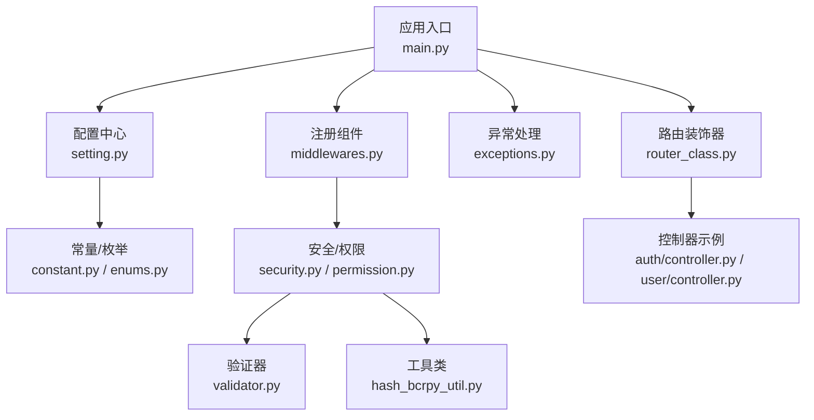
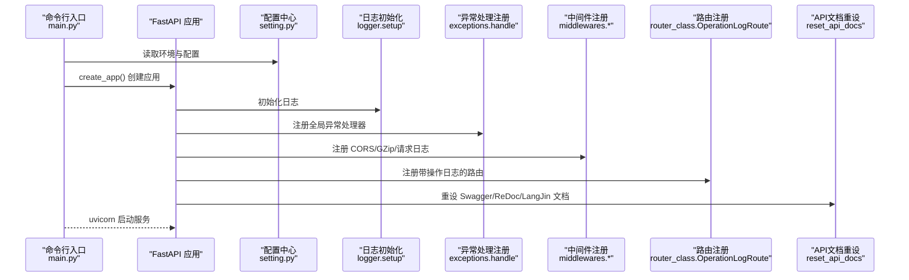
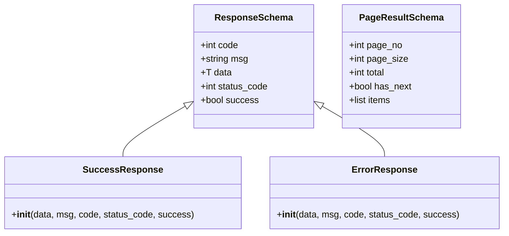
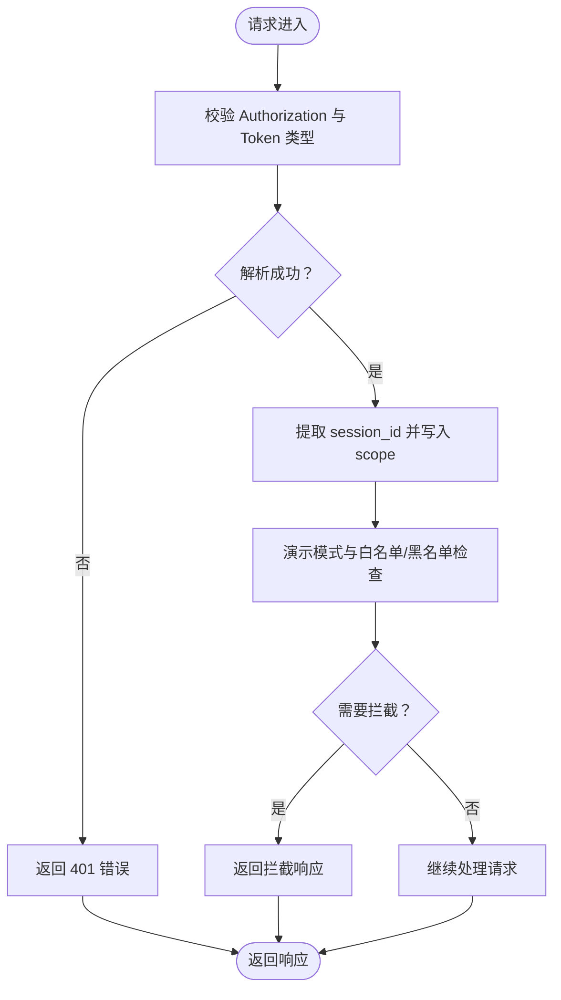
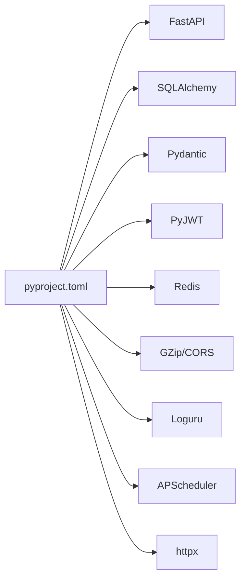

# 开发规范与最佳实践

<cite>
**本文引用的文件**
- [main.py](file://backend/main.py)
- [pyproject.toml](file://backend/pyproject.toml)
- [setting.py](file://backend/app/config/setting.py)
- [enums.py](file://backend/app/common/enums.py)
- [constant.py](file://backend/app/common/constant.py)
- [request.py](file://backend/app/common/request.py)
- [response.py](file://backend/app/common/response.py)
- [security.py](file://backend/app/core/security.py)
- [base_schema.py](file://backend/app/core/base_schema.py)
- [base_model.py](file://backend/app/core/base_model.py)
- [router_class.py](file://backend/app/core/router_class.py)
- [middlewares.py](file://backend/app/core/middlewares.py)
- [exceptions.py](file://backend/app/core/exceptions.py)
- [validator.py](file://backend/app/core/validator.py)
- [hash_bcrpy_util.py](file://backend/app/utils/hash_bcrpy_util.py)
- [permission.py](file://backend/app/core/permission.py)
- [controller.py（认证）](file://backend/app/api/v1/module_system/auth/controller.py)
- [controller.py（用户）](file://backend/app/api/v1/module_system/user/controller.py)
</cite>

## 目录
1. [简介](#简介)
2. [项目结构](#项目结构)
3. [核心组件](#核心组件)
4. [架构总览](#架构总览)
5. [详细组件分析](#详细组件分析)
6. [依赖分析](#依赖分析)
7. [性能考虑](#性能考虑)
8. [故障排查指南](#故障排查指南)
9. [结论](#结论)
10. [附录](#附录)

## 简介
本指南面向 FastapiAdmin 后端开发者，系统化总结代码命名约定、文件组织规范、API 设计规范、数据验证与序列化、权限控制与安全编码等开发规范与最佳实践。文档结合仓库现有实现，给出可落地的建议与图示，帮助团队统一风格、提升质量与可维护性。

## 项目结构
后端采用 FastAPI + SQLAlchemy 2.x + 异步数据库驱动的分层架构，主要模块如下：
- 应用入口与命令行：main.py、pyproject.toml
- 配置中心：app/config/setting.py
- 通用常量与枚举：app/common/constant.py、app/common/enums.py
- 请求/响应模型与分页：app/common/request.py、app/common/response.py
- 安全与权限：app/core/security.py、app/core/permission.py、app/core/middlewares.py
- 基础模型与混入：app/core/base_model.py、app/core/base_schema.py
- 路由与日志：app/core/router_class.py
- 异常处理：app/core/exceptions.py
- 工具与验证：app/utils/hash_bcrpy_util.py、app/core/validator.py
- 控制器示例：app/api/v1/module_system/auth/controller.py、app/api/v1/module_system/user/controller.py

图表来源
- [main.py:16-51](file://backend/main.py#L16-L51)
- [setting.py:314-340](file://backend/app/config/setting.py#L314-L340)
- [middlewares.py:22-215](file://backend/app/core/middlewares.py#L22-L215)
- [exceptions.py:57-248](file://backend/app/core/exceptions.py#L57-L248)
- [router_class.py:24-165](file://backend/app/core/router_class.py#L24-L165)
- [security.py:11-149](file://backend/app/core/security.py#L11-L149)
- [validator.py:10-298](file://backend/app/core/validator.py#L10-L298)
- [hash_bcrpy_util.py:21-208](file://backend/app/utils/hash_bcrpy_util.py#L21-L208)
- [controller.py（认证）:38-349](file://backend/app/api/v1/module_system/auth/controller.py#L38-L349)
- [controller.py（用户）:30-456](file://backend/app/api/v1/module_system/user/controller.py#L30-L456)

章节来源
- [main.py:16-51](file://backend/main.py#L16-L51)
- [setting.py:13-355](file://backend/app/config/setting.py#L13-L355)

## 核心组件
- 配置中心 Settings：集中管理运行环境、数据库、Redis、JWT、日志、跨域、Swagger、Gzip、静态文件、验证码、OAuth 等配置，并提供动态构造 FastAPI 关键参数。
- 响应与分页：统一响应模型 ResponseSchema、SuccessResponse/ErrorResponse、分页模型 PageResultSchema 与 PaginationService。
- 安全与权限：自定义 OAuth2 密码流、JWT 生成/解析、权限过滤策略（数据范围/角色/部门/仅本人）、中间件（CORS、GZip、请求日志与演示拦截）。
- 基础模型与混入：ModelMixin/UserMixin/TenantMixin 提供审计字段、租户隔离与关系加载策略。
- 异常处理：覆盖 CustomException、HTTPException、Pydantic 校验异常、SQLAlchemy 异常等，统一输出 ErrorResponse。
- 工具与验证：密码加密（bcrypt）、ItsDangerous/AES/MD5 加密器、常用字段验证器（邮箱、手机号、日期时间字符串）。

章节来源
- [setting.py:13-355](file://backend/app/config/setting.py#L13-L355)
- [response.py:26-176](file://backend/app/common/response.py#L26-L176)
- [request.py:10-75](file://backend/app/common/request.py#L10-L75)
- [security.py:11-149](file://backend/app/core/security.py#L11-L149)
- [permission.py:13-311](file://backend/app/core/permission.py#L13-L311)
- [middlewares.py:22-215](file://backend/app/core/middlewares.py#L22-L215)
- [base_model.py:21-228](file://backend/app/core/base_model.py#L21-L228)
- [exceptions.py:57-248](file://backend/app/core/exceptions.py#L57-L248)
- [validator.py:10-298](file://backend/app/core/validator.py#L10-L298)
- [hash_bcrpy_util.py:21-208](file://backend/app/utils/hash_bcrpy_util.py#L21-L208)

## 架构总览
应用启动流程与关键组件交互如下：

图表来源
- [main.py:16-51](file://backend/main.py#L16-L51)
- [setting.py:314-340](file://backend/app/config/setting.py#L314-L340)
- [middlewares.py:22-215](file://backend/app/core/middlewares.py#L22-L215)
- [exceptions.py:57-248](file://backend/app/core/exceptions.py#L57-L248)
- [router_class.py:24-165](file://backend/app/core/router_class.py#L24-L165)

## 详细组件分析

### 命名约定与文件组织规范
- 类名：采用 UpperCamelCase，如 Settings、ResponseSchema、OperationLogRoute、PwdUtil、Permission。
- 函数/方法：采用 snake_case，如 get_settings、decode_access_token、filter_query、encrypt。
- 变量：采用 snake_case，如 settings、request、payload、auth。
- 常量：采用 UPPER_SNAKE_CASE，如 RET.OK、ACCESS_TOKEN_EXPIRE_MINUTES。
- 模块/文件：采用小写加下划线，如 security.py、base_model.py、hash_bcrpy_util.py。
- 导入顺序与注释：
  - 标准库 → 第三方库 → 项目内模块
  - 每个模块顶部包含简要说明与用途注释
  - 控制器文件中，路由装饰器与依赖注入使用清晰注释标注
- 文档字符串：
  - 模块/类/函数均提供 docstring，包含参数、返回值、异常说明
  - 使用统一的中文格式，避免英文混杂

章节来源
- [setting.py:13-355](file://backend/app/config/setting.py#L13-L355)
- [response.py:26-176](file://backend/app/common/response.py#L26-L176)
- [router_class.py:24-165](file://backend/app/core/router_class.py#L24-L165)
- [hash_bcrpy_util.py:21-208](file://backend/app/utils/hash_bcrpy_util.py#L21-L208)

### API 接口设计规范
- HTTP 方法使用
  - GET：查询列表/详情
  - POST：创建/登录/导入/触发流程
  - PUT：更新
  - PATCH：部分更新
  - DELETE：删除
- URL 设计
  - 复数名词：/user、/role、/dept
  - 资源层级：/user/{id}、/user/{id}/avatar
  - 操作后缀：/export、/import、/template、/refresh
- 请求/响应格式
  - 统一使用 SuccessResponse/ErrorResponse，包含 code/msg/data/status_code/success
  - 分页使用 PageResultSchema，包含 page_no/page_size/total/has_next/items
- 错误码定义
  - RET 枚举覆盖成功、HTTP 标准错误、业务错误、Token/认证授权/会话安全/组件/任务/服务等分类
  - 自定义错误码从 4000+ 开始，避免与 HTTP 标准冲突
- 示例参考
  - 登录接口：POST /api/v1/auth/login
  - 用户列表：GET /api/v1/user/list
  - 用户详情：GET /api/v1/user/detail/{id}
  - 用户创建：POST /api/v1/user/create
  - 用户更新：PUT /api/v1/user/update/{id}
  - 用户删除：DELETE /api/v1/user/delete
  - 用户导入模板：GET /api/v1/user/import/template
  - 用户导入：POST /api/v1/user/import/data
  - 用户导出：POST /api/v1/user/export

章节来源
- [constant.py:7-213](file://backend/app/common/constant.py#L7-L213)
- [request.py:10-75](file://backend/app/common/request.py#L10-L75)
- [response.py:26-176](file://backend/app/common/response.py#L26-L176)
- [controller.py（认证）:38-349](file://backend/app/api/v1/module_system/auth/controller.py#L38-L349)
- [controller.py（用户）:30-456](file://backend/app/api/v1/module_system/user/controller.py#L30-L456)

### 数据验证与序列化最佳实践
- Pydantic 模型
  - 使用 BaseModel 定义请求/响应模型，字段声明明确类型与默认值
  - 使用 alias_generator=to_camel 统一前后端字段命名
  - 使用 Field(...) 与约束（ge/le/...）保证输入合法性
- 自定义类型与序列化
  - DateTimeStr/DateStr/TimeStr：统一日期时间字符串格式与序列化
  - jsonable_encoder + 自定义 encoder：确保裸 datetime/date/time 正确序列化
- 字段验证规则
  - 邮箱/手机号/必填编码等使用专用验证器，不符合时抛出 CustomException
  - Pydantic 校验异常统一由全局异常处理器转换为 ErrorResponse
- 示例参考
  - 基础模型 BaseSchema：包含审计字段与软删除字段
  - 通用输出模型 CommonSchema：包含 id/name
  - 上传/下载模型 UploadResponseSchema/DownloadFileSchema

图表来源
- [response.py:26-176](file://backend/app/common/response.py#L26-L176)
- [request.py:10-75](file://backend/app/common/request.py#L10-L75)

章节来源
- [validator.py:10-298](file://backend/app/core/validator.py#L10-L298)
- [response.py:22-24](file://backend/app/common/response.py#L22-L24)
- [base_schema.py:15-75](file://backend/app/core/base_schema.py#L15-L75)

### 权限控制与安全编码规范
- JWT 令牌处理
  - 生成：create_access_token，载荷包含用户信息
  - 解析：decode_access_token，校验签名、过期与格式
  - 白名单：TOKEN_REQUEST_PATH_EXCLUDE 配置放行登录等接口
- 密码加密
  - bcrypt：PwdUtil.set_password_hash/PwdContext.hash
  - ItsDangerous/AES/MD5：提供多种加密器，失败时记录日志并降级
- SQL 注入防护
  - 使用 SQLAlchemy 2.x ORM 与类型安全查询，避免原生 SQL 拼接
  - 权限过滤：Permission 类按策略生成 WHERE 条件，防止越权
- 中间件与演示拦截
  - RequestLogMiddleware：记录请求日志、提取 session_id、X-Process-Time
  - 演示拦截：根据 Redis 配置与白名单/黑名单拦截非 GET 请求
- CORS/GZip
  - CORS：allow_origins/allow_methods/allow_headers/allow_credentials
  - GZip：minimum_size/compresslevel

图表来源
- [middlewares.py:87-200](file://backend/app/core/middlewares.py#L87-L200)
- [security.py:30-51](file://backend/app/core/security.py#L30-L51)

章节来源
- [security.py:98-149](file://backend/app/core/security.py#L98-L149)
- [hash_bcrpy_util.py:21-73](file://backend/app/utils/hash_bcrpy_util.py#L21-L73)
- [permission.py:41-311](file://backend/app/core/permission.py#L41-L311)
- [middlewares.py:22-215](file://backend/app/core/middlewares.py#L22-L215)

### 控制器与路由组织
- 路由装饰器
  - OperationLogRoute：在路由处理前后记录操作日志，过滤文档来源请求
- 依赖注入
  - get_current_user/AuthPermission：权限校验与认证
  - db_getter/redis_getter：数据库与 Redis 会话
- 控制器示例
  - 认证模块：登录/刷新/验证码/登出/免登录/OAuth
  - 用户模块：当前用户信息/头像上传/密码修改/注册/忘记密码/分页查询/导入导出

章节来源
- [router_class.py:24-165](file://backend/app/core/router_class.py#L24-L165)
- [controller.py（认证）:38-349](file://backend/app/api/v1/module_system/auth/controller.py#L38-L349)
- [controller.py（用户）:30-456](file://backend/app/api/v1/module_system/user/controller.py#L30-L456)

## 依赖分析
- 依赖管理与格式化
  - 依赖清单与版本锁定：pyproject.toml
  - 代码格式化与检查：ruff（line-length=100、preview=true、fix=true）
- 运行时依赖
  - FastAPI、SQLAlchemy、Pydantic、JWT、Redis、GZip、CORS、日志（loguru）、定时任务（APScheduler）、外部 HTTP（httpx）等

图表来源
- [pyproject.toml:7-51](file://backend/pyproject.toml#L7-L51)
- [pyproject.toml:68-138](file://backend/pyproject.toml#L68-L138)

章节来源
- [pyproject.toml:1-138](file://backend/pyproject.toml#L1-L138)

## 性能考虑
- 连接池与数据库
  - 连接池大小、超时、回收、预检等参数在 settings 中集中配置
  - 使用异步驱动（asyncpg/asyncmy/aiosqlite）提升并发性能
- 压缩与缓存
  - GZip 压缩按最小阈值与压缩级别配置
  - Redis 缓存验证码、Token、系统配置等热点数据
- 序列化与响应
  - 自定义 jsonable_encoder 与日期时间序列化，减少传输体积
- 路由与中间件
  - 按需启用中间件，避免不必要的开销
  - 操作日志按配置开关，避免生产环境过度记录

章节来源
- [setting.py:86-95](file://backend/app/config/setting.py#L86-L95)
- [setting.py:108-114](file://backend/app/config/setting.py#L108-L114)
- [setting.py:167-170](file://backend/app/config/setting.py#L167-L170)
- [middlewares.py:206-215](file://backend/app/core/middlewares.py#L206-L215)
- [response.py:14-24](file://backend/app/common/response.py#L14-L24)

## 故障排查指南
- 常见异常与处理
  - CustomException：业务异常统一包装为 ErrorResponse
  - HTTPException：直接映射为 ErrorResponse
  - RequestValidationError/ResponseValidationError：格式化错误消息
  - SQLAlchemyError：数据库异常，生产环境返回通用错误
  - ValueError/FieldValidationError/Exception：兜底异常处理
- 日志与追踪
  - RequestLogMiddleware 记录请求来源、方法、路径、处理时间
  - OperationLogRoute 记录操作日志（含请求/响应、IP、UA、耗时）
  - 中间件演示拦截记录详细拦截原因
- 建议排查步骤
  - 查看日志级别与输出位置（控制台/文件/JSON Lines）
  - 检查配置中心 settings 中各开关（日志、跨域、GZip、操作日志）
  - 核对依赖注入与权限校验链路（get_current_user/AuthPermission）

章节来源
- [exceptions.py:57-248](file://backend/app/core/exceptions.py#L57-L248)
- [middlewares.py:87-200](file://backend/app/core/middlewares.py#L87-L200)
- [router_class.py:41-165](file://backend/app/core/router_class.py#L41-L165)

## 结论
本指南基于 FastapiAdmin 代码库提炼出一套可复用的后端开发规范与最佳实践，涵盖命名、文件组织、API 设计、数据验证、权限与安全、性能与故障排查等方面。建议团队在日常开发中严格遵循，持续通过配置中心与中间件机制统一行为，借助统一响应与异常处理降低沟通成本，提升系统稳定性与可维护性。

## 附录
- 命令行与启动
  - 启动服务：python main.py run --env=dev/prod
  - 生成迁移：python main.py revision --env=dev/prod
  - 应用迁移：python main.py upgrade --env=dev/prod
- 配置要点
  - 环境变量 ENVIRONMENT 控制 .env.{env} 加载
  - ROOT_PATH=/api/v1 统一 API 前缀
  - TOKEN_REQUEST_PATH_EXCLUDE 白名单放行登录等接口
- 常用工具
  - PwdUtil：密码加密与校验
  - ItsDangerous/AES/MD5：数据加密与解密
  - Permission：数据权限过滤策略

章节来源
- [main.py:54-162](file://backend/main.py#L54-L162)
- [setting.py:26-73](file://backend/app/config/setting.py#L26-L73)
- [hash_bcrpy_util.py:21-208](file://backend/app/utils/hash_bcrpy_util.py#L21-L208)
- [permission.py:13-311](file://backend/app/core/permission.py#L13-L311)