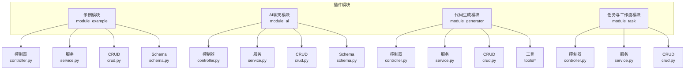
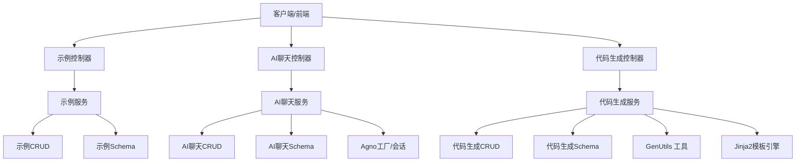
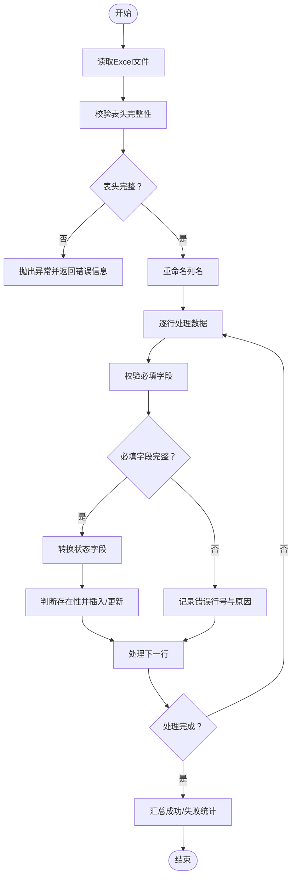
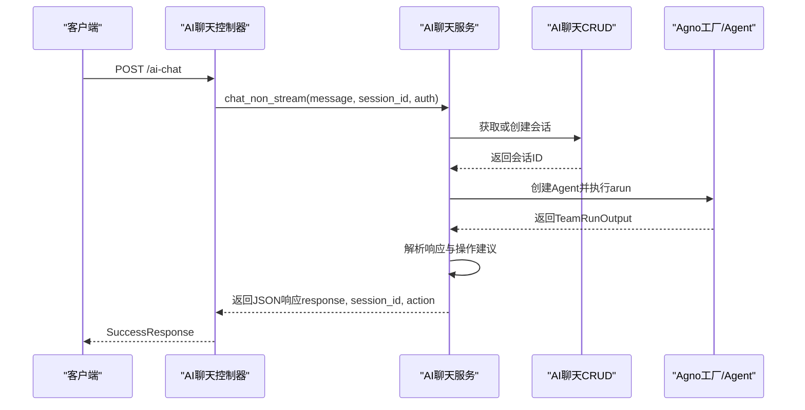
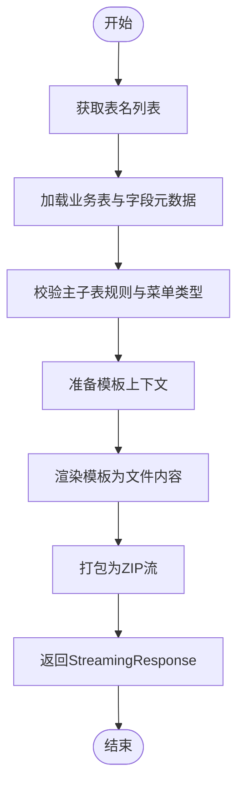
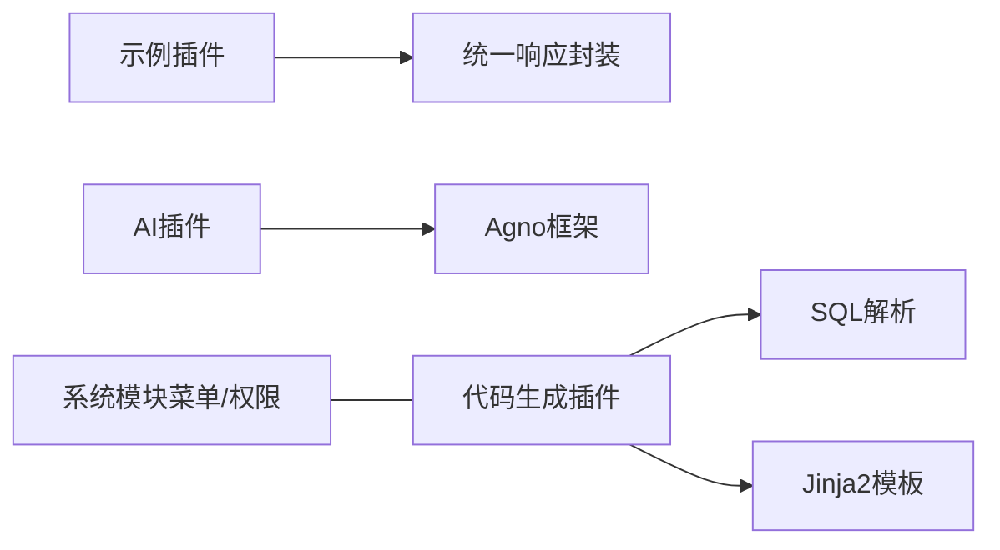

# 插件开发实例

<cite>
**本文引用的文件**
- [plugin.toml（示例插件）](file://backend/app/plugin/module_example/plugin.toml)
- [plugin.toml（AI子系统）](file://backend/app/plugin/module_ai/plugin.toml)
- [plugin.toml（代码生成）](file://backend/app/plugin/module_generator/plugin.toml)
- [plugin.toml（任务与工作流）](file://backend/app/plugin/module_task/plugin.toml)
- [示例控制器（demo）](file://backend/app/plugin/module_example/demo/controller.py)
- [示例控制器（demo01）](file://backend/app/plugin/module_example/demo01/controller.py)
- [示例模式（demo）](file://backend/app/plugin/module_example/demo/model.py)
- [示例模式（demo01）](file://backend/app/plugin/module_example/demo01/model.py)
- [示例CRUD（demo）](file://backend/app/plugin/module_example/demo/crud.py)
- [示例CRUD（demo01）](file://backend/app/plugin/module_example/demo01/crud.py)
- [示例Schema（demo）](file://backend/app/plugin/module_example/demo/schema.py)
- [示例Schema（demo01）](file://backend/app/plugin/module_example/demo01/schema.py)
- [示例服务（demo）](file://backend/app/plugin/module_example/demo/service.py)
- [示例服务（demo01）](file://backend/app/plugin/module_example/demo01/service.py)
- [AI聊天控制器](file://backend/app/plugin/module_ai/chat/controller.py)
- [AI聊天Schema](file://backend/app/plugin/module_ai/chat/schema.py)
- [AI聊天服务](file://backend/app/plugin/module_ai/chat/service.py)
- [AI聊天CRUD](file://backend/app/plugin/module_ai/chat/crud.py)
- [AI聊天WS](file://backend/app/plugin/module_ai/chat/ws.py)
- [AI聊天工具](file://backend/app/plugin/module_ai/chat/utils.py)
- [代码生成控制器](file://backend/app/plugin/module_generator/gencode/controller.py)
- [代码生成Schema](file://backend/app/plugin/module_generator/gencode/schema.py)
- [代码生成服务](file://backend/app/plugin/module_generator/gencode/service.py)
- [代码生成CRUD](file://backend/app/plugin/module_generator/gencode/crud.py)
- [代码生成工具（GenUtils）](file://backend/app/plugin/module_generator/gencode/tools/gen_util.py)
- [代码生成模板引擎](file://backend/app/plugin/module_generator/gencode/tools/jinja2_template_util.py)
- [示例API（前端）](file://frontend/web/src/api/module_example/demo.ts)
- [示例API（前端）](file://frontend/web/src/api/module_example/demo01.ts)
- [代码生成API（前端）](file://frontend/web/src/api/module_generator/gencode.ts)
- [AI聊天API（前端）](file://frontend/web/src/api/module_ai/chat.ts)
</cite>

## 目录
1. [简介](#简介)
2. [项目结构](#项目结构)
3. [核心组件](#核心组件)
4. [架构总览](#架构总览)
5. [详细组件分析](#详细组件分析)
6. [依赖分析](#依赖分析)
7. [性能考量](#性能考量)
8. [故障排查指南](#故障排查指南)
9. [结论](#结论)
10. [附录](#附录)

## 简介
本文件围绕 FastapiAdmin 的插件体系，提供三类插件开发实例的完整文档：简单示例插件、AI智能体插件与代码生成器插件。通过对控制器、服务、CRUD、Schema、工具类与前端API的深入剖析，帮助开发者快速理解插件的实现思路、技术要点与关键流程，并给出测试方法、调试技巧、二次开发与性能安全最佳实践。

## 项目结构
插件采用“模块化 + 动态路由注册”的组织方式，每个插件在 backend/app/plugin 下以 module_* 命名的子模块形式存在，通过各自 plugin.toml 提供元数据，控制器层在 module_*/**/controller.py 中定义路由，服务层封装业务逻辑，CRUD层负责数据访问，Schema层定义请求/响应模型，部分插件还包含工具类与前端API定义。

图表来源
- [plugin.toml（示例插件）:1-10](file://backend/app/plugin/module_example/plugin.toml#L1-L10)
- [plugin.toml（AI子系统）:1-9](file://backend/app/plugin/module_ai/plugin.toml#L1-L9)
- [plugin.toml（代码生成）:1-9](file://backend/app/plugin/module_generator/plugin.toml#L1-L9)
- [plugin.toml（任务与工作流）:1-9](file://backend/app/plugin/module_task/plugin.toml#L1-L9)

章节来源
- [plugin.toml（示例插件）:1-10](file://backend/app/plugin/module_example/plugin.toml#L1-L10)
- [plugin.toml（AI子系统）:1-9](file://backend/app/plugin/module_ai/plugin.toml#L1-L9)
- [plugin.toml（代码生成）:1-9](file://backend/app/plugin/module_generator/plugin.toml#L1-L9)
- [plugin.toml（任务与工作流）:1-9](file://backend/app/plugin/module_task/plugin.toml#L1-L9)

## 核心组件
- 控制器层：定义HTTP路由与鉴权依赖，负责请求参数解析、权限校验与响应封装。
- 服务层：编排业务流程，协调CRUD与外部工具，处理异常与日志。
- CRUD层：抽象数据访问，提供通用的增删改查与分页能力。
- Schema层：Pydantic/Dataclass模型，定义请求/响应结构与校验规则。
- 工具与前端API：模板渲染、SQL解析、Agno集成、前端TS接口定义等。

章节来源
- [示例控制器（demo）:1-264](file://backend/app/plugin/module_example/demo/controller.py#L1-L264)
- [示例服务（demo）:1-327](file://backend/app/plugin/module_example/demo/service.py#L1-L327)
- [示例CRUD（demo）:1-136](file://backend/app/plugin/module_example/demo/crud.py#L1-L136)
- [示例Schema（demo）:1-125](file://backend/app/plugin/module_example/demo/schema.py#L1-L125)
- [AI聊天控制器:1-196](file://backend/app/plugin/module_ai/chat/controller.py#L1-L196)
- [AI聊天服务:1-426](file://backend/app/plugin/module_ai/chat/service.py#L1-L426)
- [AI聊天Schema:1-71](file://backend/app/plugin/module_ai/chat/schema.py#L1-L71)
- [代码生成控制器:1-363](file://backend/app/plugin/module_generator/gencode/controller.py#L1-L363)
- [代码生成服务:1-800](file://backend/app/plugin/module_generator/gencode/service.py#L1-L800)
- [代码生成Schema:1-326](file://backend/app/plugin/module_generator/gencode/schema.py#L1-L326)

## 架构总览
插件遵循“控制器-服务-数据访问-模型”的分层架构，结合权限中间件与统一响应封装，形成清晰的职责边界。AI插件引入Agno智能体框架，代码生成插件引入SQL解析与Jinja2模板引擎，示例插件提供标准REST CRUD与导入导出能力。

图表来源
- [示例控制器（demo）:1-264](file://backend/app/plugin/module_example/demo/controller.py#L1-L264)
- [示例服务（demo）:1-327](file://backend/app/plugin/module_example/demo/service.py#L1-L327)
- [示例CRUD（demo）:1-136](file://backend/app/plugin/module_example/demo/crud.py#L1-L136)
- [示例Schema（demo）:1-125](file://backend/app/plugin/module_example/demo/schema.py#L1-L125)
- [AI聊天控制器:1-196](file://backend/app/plugin/module_ai/chat/controller.py#L1-L196)
- [AI聊天服务:1-426](file://backend/app/plugin/module_ai/chat/service.py#L1-L426)
- [AI聊天Schema:1-71](file://backend/app/plugin/module_ai/chat/schema.py#L1-L71)
- [AI聊天CRUD](file://backend/app/plugin/module_ai/chat/crud.py)
- [AI聊天工具](file://backend/app/plugin/module_ai/chat/utils.py)
- [AI聊天WS](file://backend/app/plugin/module_ai/chat/ws.py)
- [代码生成控制器:1-363](file://backend/app/plugin/module_generator/gencode/controller.py#L1-L363)
- [代码生成服务:1-800](file://backend/app/plugin/module_generator/gencode/service.py#L1-L800)
- [代码生成Schema:1-326](file://backend/app/plugin/module_generator/gencode/schema.py#L1-L326)
- [代码生成CRUD](file://backend/app/plugin/module_generator/gencode/crud.py)
- [代码生成工具（GenUtils）](file://backend/app/plugin/module_generator/gencode/tools/gen_util.py)
- [代码生成模板引擎](file://backend/app/plugin/module_generator/gencode/tools/jinja2_template_util.py)

## 详细组件分析

### 示例插件（module_example）
- 功能特性
  - 提供标准的REST CRUD接口（详情、列表、创建、更新、删除、批量状态设置）。
  - 支持分页查询、模糊/精确/范围查询参数。
  - 支持Excel导入导出，模板下载与批量导入。
  - 统一响应封装与操作日志记录。
- 技术要点
  - 控制器使用 FastAPI 路由与依赖注入，结合权限中间件与分页参数模型。
  - 服务层封装业务规则与异常处理，CRUD层提供通用数据访问。
  - Schema层使用 Pydantic 校验与字段验证，Query Dataclass 作为查询参数载体。
- 关键流程（批量导入）

图表来源
- [示例服务（demo）:217-309](file://backend/app/plugin/module_example/demo/service.py#L217-L309)

章节来源
- [示例控制器（demo）:1-264](file://backend/app/plugin/module_example/demo/controller.py#L1-L264)
- [示例控制器（demo01）:1-264](file://backend/app/plugin/module_example/demo01/controller.py#L1-L264)
- [示例CRUD（demo）:1-136](file://backend/app/plugin/module_example/demo/crud.py#L1-L136)
- [示例CRUD（demo01）](file://backend/app/plugin/module_example/demo01/crud.py)
- [示例Schema（demo）:1-125](file://backend/app/plugin/module_example/demo/schema.py#L1-L125)
- [示例Schema（demo01）](file://backend/app/plugin/module_example/demo01/schema.py)
- [示例服务（demo）:1-327](file://backend/app/plugin/module_example/demo/service.py#L1-L327)
- [示例服务（demo01）](file://backend/app/plugin/module_example/demo01/service.py)
- [plugin.toml（示例插件）:1-10](file://backend/app/plugin/module_example/plugin.toml#L1-L10)

### AI智能体插件（module_ai）
- 功能特性
  - 会话管理：创建、查询、更新、删除会话。
  - 非流式对话：一次性返回AI回复、会话ID与可选操作建议。
  - 流式对话：通过WebSocket逐步返回回复片段（前端配合）。
  - 与Agno框架集成，支持Team/Agent运行与会话持久化。
- 技术要点
  - 控制器定义REST接口与权限依赖。
  - 服务层封装Agno工厂创建、会话获取/创建、消息提取与格式化。
  - Schema层定义会话与对话请求/响应模型。
- 关键流程（非流式对话）

图表来源
- [AI聊天控制器:167-196](file://backend/app/plugin/module_ai/chat/controller.py#L167-L196)
- [AI聊天服务:180-264](file://backend/app/plugin/module_ai/chat/service.py#L180-L264)
- [AI聊天Schema:59-71](file://backend/app/plugin/module_ai/chat/schema.py#L59-L71)
- [AI聊天CRUD](file://backend/app/plugin/module_ai/chat/crud.py)
- [AI聊天工具](file://backend/app/plugin/module_ai/chat/utils.py)
- [AI聊天WS](file://backend/app/plugin/module_ai/chat/ws.py)

章节来源
- [AI聊天控制器:1-196](file://backend/app/plugin/module_ai/chat/controller.py#L1-L196)
- [AI聊天服务:1-426](file://backend/app/plugin/module_ai/chat/service.py#L1-L426)
- [AI聊天Schema:1-71](file://backend/app/plugin/module_ai/chat/schema.py#L1-L71)
- [plugin.toml（AI子系统）:1-9](file://backend/app/plugin/module_ai/plugin.toml#L1-L9)

### 代码生成器插件（module_generator）
- 功能特性
  - 数据库表与业务表管理：导入表结构、创建表、编辑/删除业务表。
  - 代码生成：预览、批量生成与本地生成，支持主子表与权限前缀。
  - 数据库同步：差异预览与受控同步（白名单DDL）。
  - 菜单自动创建：目录/菜单/按钮三层结构，权限前缀与路由路径统一。
- 技术要点
  - 控制器提供列表、详情、导入、创建、更新、删除、生成、预览、同步等接口。
  - 服务层封装包名推断、菜单创建、模板渲染、SQL解析与安全校验。
  - 工具层包含GenUtils（字段/表初始化）、Jinja2模板引擎。
- 关键流程（批量生成代码）

图表来源
- [代码生成控制器:243-263](file://backend/app/plugin/module_generator/gencode/controller.py#L243-L263)
- [代码生成服务:649-703](file://backend/app/plugin/module_generator/gencode/service.py#L649-L703)
- [代码生成工具（GenUtils）](file://backend/app/plugin/module_generator/gencode/tools/gen_util.py)
- [代码生成模板引擎](file://backend/app/plugin/module_generator/gencode/tools/jinja2_template_util.py)

章节来源
- [代码生成控制器:1-363](file://backend/app/plugin/module_generator/gencode/controller.py#L1-L363)
- [代码生成服务:1-800](file://backend/app/plugin/module_generator/gencode/service.py#L1-L800)
- [代码生成Schema:1-326](file://backend/app/plugin/module_generator/gencode/schema.py#L1-L326)
- [plugin.toml（代码生成）:1-9](file://backend/app/plugin/module_generator/plugin.toml#L1-L9)

## 依赖分析
- 插件间耦合
  - 各插件相对独立，通过统一的权限中间件与响应封装进行交互。
  - 代码生成插件与系统菜单模块存在集成点（菜单创建与权限前缀）。
- 外部依赖
  - AI插件依赖Agno框架（Team/Agent/TeamSession）。
  - 代码生成插件依赖SQL解析库与Jinja2模板引擎。
  - 示例插件依赖Excel工具与分页服务。

图表来源
- [AI聊天服务:1-426](file://backend/app/plugin/module_ai/chat/service.py#L1-L426)
- [代码生成服务:1-800](file://backend/app/plugin/module_generator/gencode/service.py#L1-L800)
- [示例服务（demo）:1-327](file://backend/app/plugin/module_example/demo/service.py#L1-L327)

章节来源
- [AI聊天服务:1-426](file://backend/app/plugin/module_ai/chat/service.py#L1-L426)
- [代码生成服务:1-800](file://backend/app/plugin/module_generator/gencode/service.py#L1-L800)
- [示例服务（demo）:1-327](file://backend/app/plugin/module_example/demo/service.py#L1-L327)

## 性能考量
- 分页与查询
  - 示例插件优先使用数据库侧分页，避免应用层全量加载。
  - 代码生成插件对数据库表列表采用数据库OFFSET/LIMIT分页，减少反射开销。
- IO与流式
  - 导入/导出与批量生成采用流式响应，降低内存占用。
  - AI插件支持流式对话，提升用户体验。
- 安全与校验
  - 代码生成对DDL进行白名单校验，拒绝破坏性操作。
  - 统一权限中间件与Schema校验，防止越权与非法输入。

[本节为通用指导，无需列出具体文件来源]

## 故障排查指南
- 权限与认证
  - 确认控制器依赖的权限标识与前端菜单/按钮权限一致。
  - 检查AuthPermission中间件是否正确注入用户信息。
- 日志与异常
  - 使用统一日志记录关键流程与错误堆栈。
  - 服务层装饰器将非CustomException统一包装为CustomException，便于前端捕获。
- 导入/导出与生成
  - Excel导入需校验表头、必填字段与行号定位，关注错误汇总。
  - 代码生成需确认模板上下文与文件名规则一致性。
- AI对话
  - 确认Agno工厂创建Agent时的用户/部门/会话ID参数正确。
  - 检查会话存储与消息提取逻辑。

章节来源
- [示例服务（demo）:217-309](file://backend/app/plugin/module_example/demo/service.py#L217-L309)
- [代码生成服务:43-62](file://backend/app/plugin/module_generator/gencode/service.py#L43-L62)
- [AI聊天服务:130-178](file://backend/app/plugin/module_ai/chat/service.py#L130-L178)

## 结论
通过以上三个插件实例，可以系统掌握FastapiAdmin插件开发的分层架构、权限控制、数据访问与业务编排。示例插件提供标准CRUD与导入导出能力；AI插件展示了与第三方智能体框架的集成；代码生成器体现了复杂业务流程与模板渲染的协同。开发者可据此快速构建新插件，并在安全、性能与可维护性方面持续优化。

[本节为总结性内容，无需列出具体文件来源]

## 附录

### 开发步骤与最佳实践
- 新插件搭建
  - 在 backend/app/plugin 下创建 module_yourname 目录，编写 plugin.toml 元数据。
  - 按需创建 controller.py、service.py、crud.py、schema.py 与工具类。
  - 在前端 frontend/web/src/api 下新增对应API定义。
- 二次开发与扩展
  - 在现有Schema基础上增加字段与校验规则，保持向后兼容。
  - 在服务层新增业务流程，尽量复用CRUD与工具类。
  - 通过权限中间件与菜单模块扩展访问控制与前端路由。
- 测试与调试
  - 使用Swagger/Redoc查看接口文档与示例。
  - 通过单元测试与集成测试覆盖关键流程（导入/导出/生成/对话）。
  - 使用日志与异常包装定位问题，关注流式响应与模板渲染的边界情况。

[本节为通用指导，无需列出具体文件来源]