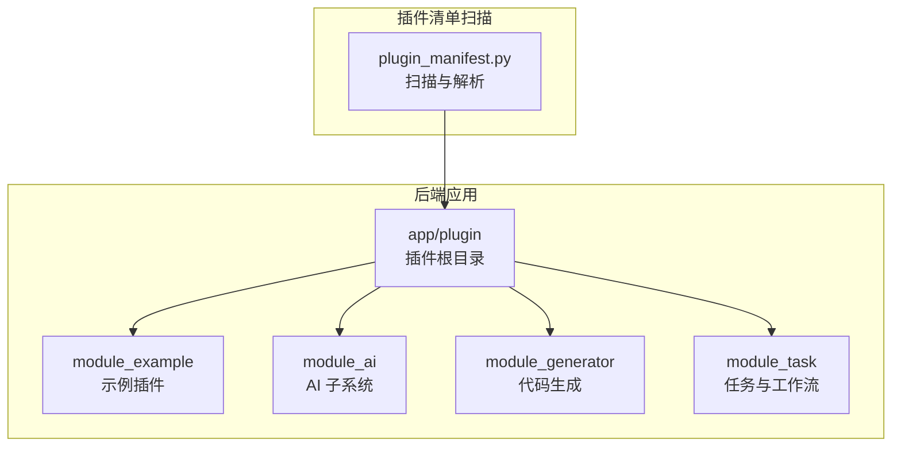
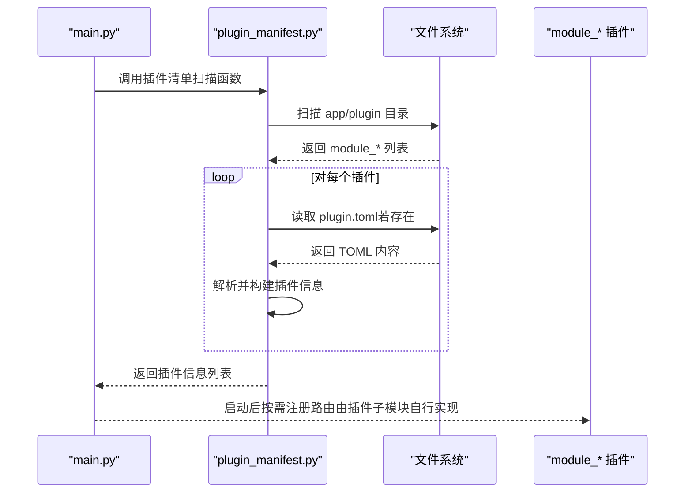
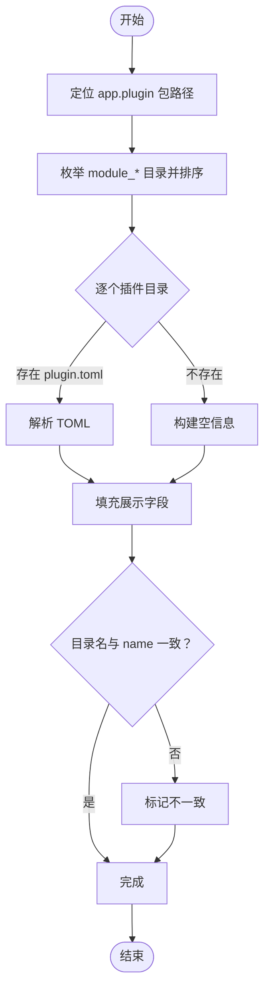
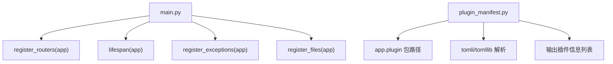

# 插件开发指南

<cite>
**本文引用的文件**
- [backend/app/plugin/module_example/plugin.toml](file://backend/app/plugin/module_example/plugin.toml)
- [backend/app/plugin/module_ai/plugin.toml](file://backend/app/plugin/module_ai/plugin.toml)
- [backend/app/plugin/module_generator/plugin.toml](file://backend/app/plugin/module_generator/plugin.toml)
- [backend/app/plugin/module_task/plugin.toml](file://backend/app/plugin/module_task/plugin.toml)
- [backend/app/api/v1/module_application/portal/plugin_manifest.py](file://backend/app/api/v1/module_application/portal/plugin_manifest.py)
- [backend/main.py](file://backend/main.py)
</cite>

## 目录
1. [引言](#引言)
2. [项目结构](#项目结构)
3. [核心组件](#核心组件)
4. [架构总览](#架构总览)
5. [详细组件分析](#详细组件分析)
6. [依赖分析](#依赖分析)
7. [性能考虑](#性能考虑)
8. [故障排查指南](#故障排查指南)
9. [结论](#结论)
10. [附录](#附录)

## 引言
本指南面向希望在 FastapiAdmin 中开发“插件”的后端开发者，系统讲解插件架构原理与实践流程，包括：
- 动态模块加载机制
- 路由自动注册策略
- 依赖注入与生命周期管理
- plugin.toml 配置项详解
- 插件间通信与数据共享
- 实战案例：示例插件、AI 智能体插件、代码生成器插件
- 调试技巧、性能优化与常见问题

## 项目结构
FastapiAdmin 的插件体系以“模块化目录 + TOML 元数据 + 动态扫描”为核心组织方式：
- 插件根目录位于后端包 app/plugin 下，每个插件以 module_ 前缀命名的顶级目录表示一个独立模块
- 每个 module_* 目录下可包含若干子模块（如 demo、demo01、chat、gencode 等），每个子模块通常包含 controller、service、crud、schema、model 等层次
- 每个插件可选地提供 plugin.toml 作为元数据清单，用于描述插件名称、标题、版本、描述、是否可选、标签等信息
- 插件清单扫描与构建逻辑集中在 portal 的插件清单模块中，负责发现插件目录、解析 plugin.toml 并输出统一信息结构

图表来源
- [backend/app/api/v1/module_application/portal/plugin_manifest.py](file://backend/app/api/v1/module_application/portal/plugin_manifest.py)
- [backend/app/plugin/module_example/plugin.toml](file://backend/app/plugin/module_example/plugin.toml)
- [backend/app/plugin/module_ai/plugin.toml](file://backend/app/plugin/module_ai/plugin.toml)
- [backend/app/plugin/module_generator/plugin.toml](file://backend/app/plugin/module_generator/plugin.toml)
- [backend/app/plugin/module_task/plugin.toml](file://backend/app/plugin/module_task/plugin.toml)

章节来源
- [backend/app/api/v1/module_application/portal/plugin_manifest.py](file://backend/app/api/v1/module_application/portal/plugin_manifest.py)
- [backend/app/plugin/module_example/plugin.toml](file://backend/app/plugin/module_example/plugin.toml)
- [backend/app/plugin/module_ai/plugin.toml](file://backend/app/plugin/module_ai/plugin.toml)
- [backend/app/plugin/module_generator/plugin.toml](file://backend/app/plugin/module_generator/plugin.toml)
- [backend/app/plugin/module_task/plugin.toml](file://backend/app/plugin/module_task/plugin.toml)

## 核心组件
- 插件清单扫描器：负责定位 app/plugin 下的 module_* 目录，解析 plugin.toml，构建插件展示信息
- 插件目录结构：module_* 为插件根，内部按子模块划分功能域
- TOML 元数据：描述插件的基本属性与可选特性
- 应用入口与生命周期：通过 main.py 创建应用并注册中间件、路由、静态资源与异常处理

章节来源
- [backend/app/api/v1/module_application/portal/plugin_manifest.py](file://backend/app/api/v1/module_application/portal/plugin_manifest.py)
- [backend/main.py](file://backend/main.py)

## 架构总览
插件系统采用“声明式 + 动态发现”的设计：
- 在 app/plugin 下新增 module_* 目录即视为一个插件
- 若存在 plugin.toml，则将其作为插件元数据来源
- 应用启动时，扫描插件目录并构建统一信息结构，供门户或管理端展示与使用
- 路由注册由各插件子模块的 controller 自行完成，遵循 FastAPI 的标准路由机制

图表来源
- [backend/app/api/v1/module_application/portal/plugin_manifest.py](file://backend/app/api/v1/module_application/portal/plugin_manifest.py)
- [backend/main.py](file://backend/main.py)

## 详细组件分析

### 插件清单扫描器（plugin_manifest.py）
该模块提供以下关键能力：
- 定位 app.plugin 包路径
- 枚举 module_* 插件目录并排序
- 解析 plugin.toml（兼容 Python 3.11+ 与旧版本）
- 构建插件展示信息（包含模块名、路由前缀、可选元数据、标签等）
- 校验插件目录名与 manifest 中 name 是否一致

图表来源
- [backend/app/api/v1/module_application/portal/plugin_manifest.py](file://backend/app/api/v1/module_application/portal/plugin_manifest.py)

章节来源
- [backend/app/api/v1/module_application/portal/plugin_manifest.py](file://backend/app/api/v1/module_application/portal/plugin_manifest.py)

### plugin.toml 配置文件
每个插件可选提供 plugin.toml，用于描述插件元数据。其典型字段如下：
- name：插件标识符，应与 module_* 目录名保持一致（或与目录名对应的主题部分一致）
- title：插件显示标题
- version：插件版本
- description：插件描述
- optional：布尔值，指示该插件是否可选
- tags：字符串数组，用于分类与检索

章节来源
- [backend/app/plugin/module_example/plugin.toml](file://backend/app/plugin/module_example/plugin.toml)
- [backend/app/plugin/module_ai/plugin.toml](file://backend/app/plugin/module_ai/plugin.toml)
- [backend/app/plugin/module_generator/plugin.toml](file://backend/app/plugin/module_generator/plugin.toml)
- [backend/app/plugin/module_task/plugin.toml](file://backend/app/plugin/module_task/plugin.toml)

### 路由自动注册与依赖注入
- 路由注册：各插件子模块的 controller 负责定义路由，FastAPI 标准注册流程由应用入口统一调用
- 依赖注入：通过 FastAPI 的依赖注入机制在控制器中注入服务层、CRUD 层等依赖
- 生命周期：应用通过 lifespan 管理启动与关闭阶段的初始化与清理

章节来源
- [backend/main.py](file://backend/main.py)

### 插件开发流程（从零到一）
- 创建目录：在 app/plugin 下新建 module_{yourname} 目录
- 编写元数据：在插件根目录添加 plugin.toml，填写 name、title、version、description、optional、tags
- 设计子模块：在 module_{yourname} 下创建子模块目录（如 demo、chat、gencode 等）
- 控制器层：在子模块中编写 controller，定义路由与视图函数
- 服务层与数据访问：在 service/crud 层封装业务逻辑与数据操作
- 模型与模式：在 model/schema 中定义数据模型与请求/响应模式
- 注册路由：确保子模块的 controller 已被 FastAPI 路由系统注册
- 测试与验证：启动应用，检查插件是否出现在门户/管理端，并验证接口可用性

### 实战案例

#### 示例插件（module_example）
- 目标：演示 module_* 约定与动态路由注册
- 结构要点：包含 demo 与 demo01 子模块，每个子模块具备 controller、service、crud、schema、model 等层次
- 元数据：通过 plugin.toml 提供 name、title、description、optional、tags 等信息

章节来源
- [backend/app/plugin/module_example/plugin.toml](file://backend/app/plugin/module_example/plugin.toml)

#### AI 智能体插件（module_ai）
- 目标：提供对话、Agent 等能力（Agno）
- 结构要点：chat 子模块包含 controller、service、crud、schema、model、ws（WebSocket）、utils 等
- 元数据：通过 plugin.toml 提供 name、title、description、optional、tags 等信息

章节来源
- [backend/app/plugin/module_ai/plugin.toml](file://backend/app/plugin/module_ai/plugin.toml)

#### 代码生成器插件（module_generator）
- 目标：基于数据表与模板进行代码生成
- 结构要点：gencode 子模块包含 controller、service、crud、model、schema、templates、tools 等
- 元数据：通过 plugin.toml 提供 name、title、description、optional、tags 等信息

章节来源
- [backend/app/plugin/module_generator/plugin.toml](file://backend/app/plugin/module_generator/plugin.toml)

#### 任务与工作流插件（module_task）
- 目标：定时任务、工作流等子模块
- 结构要点：cronjob、workflow 等子模块
- 元数据：通过 plugin.toml 提供 name、title、description、optional、tags 等信息

章节来源
- [backend/app/plugin/module_task/plugin.toml](file://backend/app/plugin/module_task/plugin.toml)

### 插件间通信与数据共享
- 组件内通信：同一插件内的 controller-service-crud-model 通过依赖注入协作
- 跨插件通信：通过公共服务层、共享数据库模型、统一的 CRUD 抽象或事件总线实现
- 数据共享：在 app.core 或 app.common 层定义共享工具、常量、枚举与通用模型

（本节为概念性说明，不直接分析具体文件）

## 依赖分析
- 插件清单扫描依赖于 Python 的 importlib 与 pathlib，用于定位包路径与遍历目录
- TOML 解析兼容 Python 3.11+ 与旧版本（通过 tomli）
- 应用入口依赖 FastAPI 的 lifespan、中间件、路由注册与异常处理

图表来源
- [backend/main.py](file://backend/main.py)
- [backend/app/api/v1/module_application/portal/plugin_manifest.py](file://backend/app/api/v1/module_application/portal/plugin_manifest.py)

章节来源
- [backend/main.py](file://backend/main.py)
- [backend/app/api/v1/module_application/portal/plugin_manifest.py](file://backend/app/api/v1/module_application/portal/plugin_manifest.py)

## 性能考虑
- 插件扫描：仅在应用启动时执行一次，避免频繁 IO；可结合缓存策略减少重复解析
- 路由注册：按需注册，避免一次性加载过多路由导致启动时间过长
- 依赖注入：尽量复用已有的服务实例，减少重复初始化
- 日志与监控：在插件初始化阶段记录关键指标，便于定位性能瓶颈

（本节提供一般性指导，不直接分析具体文件）

## 故障排查指南
- 插件未出现：确认 module_* 目录命名规范、plugin.toml 是否存在且格式正确
- 目录名与 name 不一致：检查 plugin.toml 的 name 与目录主题部分是否匹配
- TOML 解析失败：检查编码与语法，确保使用 UTF-8 并符合 TOML 规范
- 路由未生效：确认子模块 controller 已被 FastAPI 正确注册
- 启动异常：查看 lifespan、中间件与异常处理注册顺序是否正确

章节来源
- [backend/app/api/v1/module_application/portal/plugin_manifest.py](file://backend/app/api/v1/module_application/portal/plugin_manifest.py)
- [backend/main.py](file://backend/main.py)

## 结论
FastapiAdmin 的插件系统以清晰的目录约定、可选的元数据清单与动态扫描机制为基础，配合 FastAPI 的标准路由与依赖注入，实现了高扩展性的模块化架构。开发者只需遵循 module_* 约定并在子模块中实现 controller-service-crud-schema-model 层次，即可快速交付插件功能。

## 附录
- 快速检查清单
  - 在 app/plugin 下创建 module_{yourname} 目录
  - 添加 plugin.toml 并填写必要字段
  - 在子模块中实现 controller、service、crud、schema、model
  - 确保路由注册与依赖注入配置正确
  - 启动应用验证插件展示与接口可用性

（本节为概念性说明，不直接分析具体文件）