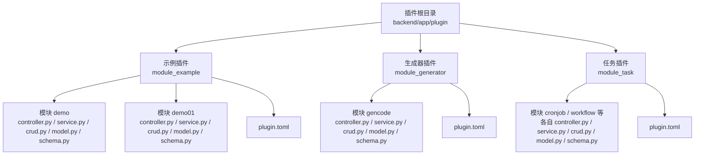
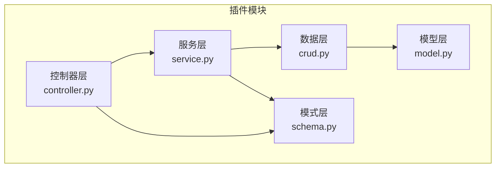
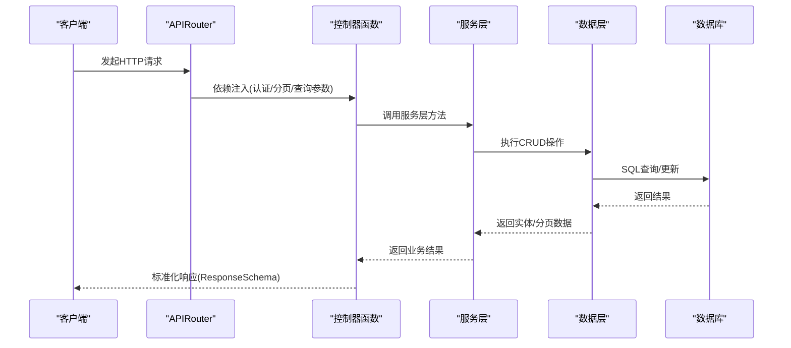
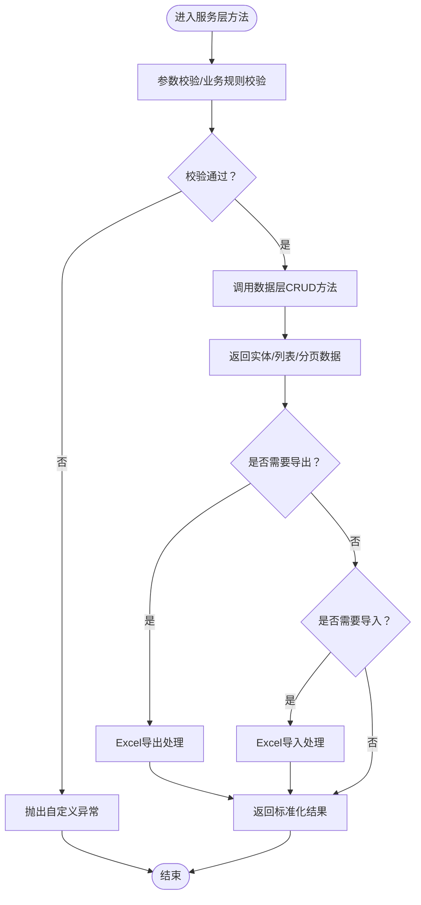
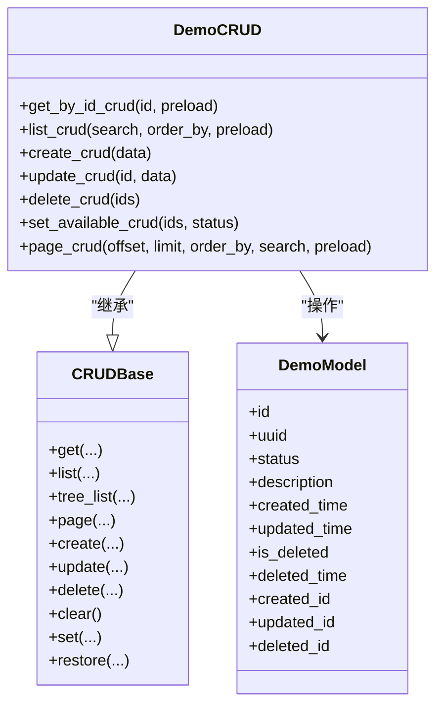
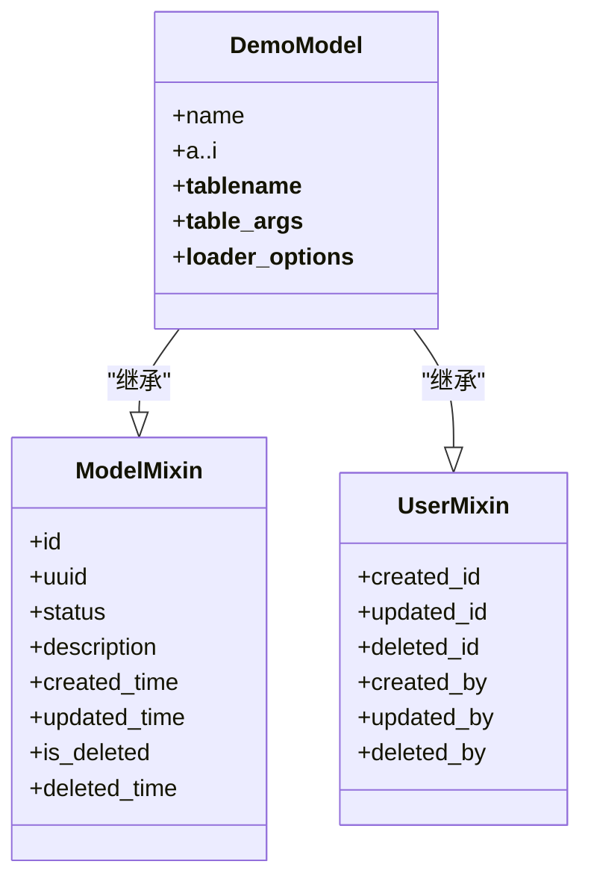
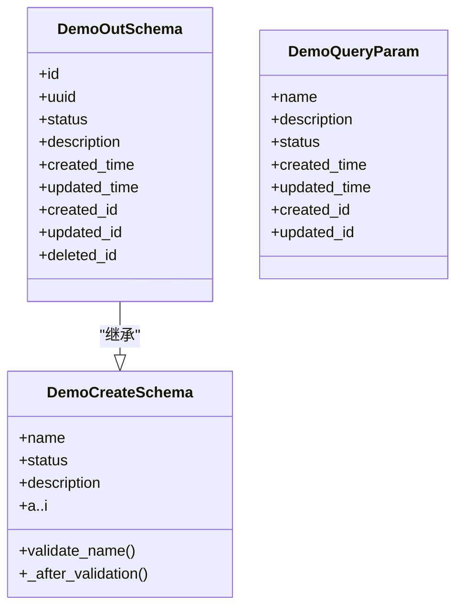
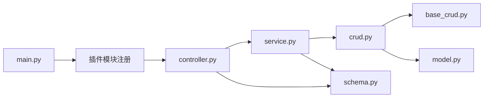

# 插件开发流程

<cite>
**本文档引用的文件**
- [backend/app/plugin/module_example/plugin.toml](file://backend/app/plugin/module_example/plugin.toml)
- [backend/app/plugin/module_example/demo/controller.py](file://backend/app/plugin/module_example/demo/controller.py)
- [backend/app/plugin/module_example/demo/service.py](file://backend/app/plugin/module_example/demo/service.py)
- [backend/app/plugin/module_example/demo/crud.py](file://backend/app/plugin/module_example/demo/crud.py)
- [backend/app/plugin/module_example/demo/model.py](file://backend/app/plugin/module_example/demo/model.py)
- [backend/app/plugin/module_example/demo/schema.py](file://backend/app/plugin/module_example/demo/schema.py)
- [backend/app/plugin/module_example/demo01/controller.py](file://backend/app/plugin/module_example/demo01/controller.py)
- [backend/app/plugin/module_example/demo01/service.py](file://backend/app/plugin/module_example/demo01/service.py)
- [backend/app/plugin/module_generator/plugin.toml](file://backend/app/plugin/module_generator/plugin.toml)
- [backend/app/plugin/module_task/plugin.toml](file://backend/app/plugin/module_task/plugin.toml)
- [backend/app/core/base_crud.py](file://backend/app/core/base_crud.py)
- [backend/app/core/base_model.py](file://backend/app/core/base_model.py)
- [backend/main.py](file://backend/main.py)
</cite>

## 目录
1. [简介](#简介)
2. [项目结构](#项目结构)
3. [核心组件](#核心组件)
4. [架构总览](#架构总览)
5. [详细组件分析](#详细组件分析)
6. [依赖分析](#依赖分析)
7. [性能考虑](#性能考虑)
8. [故障排查指南](#故障排查指南)
9. [结论](#结论)
10. [附录](#附录)

## 简介
本指南面向希望在 FastapiAdmin 中开发“插件”的开发者，提供从零开始创建插件的完整步骤与最佳实践。插件遵循统一的模块化约定：每个插件位于独立目录下，内部包含标准文件结构（controller.py、service.py、crud.py、model.py、schema.py），并通过 TOML 元数据文件声明插件信息。插件通过 FastAPI 路由注册机制自动接入系统，实现控制器层路由定义、请求处理与响应格式标准化，服务层封装业务逻辑与 CRUD 操作，数据层基于通用基类提供高性能、安全的数据库访问。

## 项目结构
FastapiAdmin 的插件采用“模块化目录 + 动态路由注册”的组织方式：
- 插件根目录：backend/app/plugin
- 每个插件以独立子目录形式存在，例如 module_example、module_generator、module_task
- 每个插件内包含若干“模块”，如 demo、demo01、gencode 等
- 每个模块包含标准文件：controller.py、service.py、crud.py、model.py、schema.py
- 每个插件根目录包含 plugin.toml，用于声明插件元数据

图表来源
- [backend/app/plugin/module_example/plugin.toml:1-10](file://backend/app/plugin/module_example/plugin.toml#L1-L10)
- [backend/app/plugin/module_generator/plugin.toml:1-9](file://backend/app/plugin/module_generator/plugin.toml#L1-L9)
- [backend/app/plugin/module_task/plugin.toml:1-9](file://backend/app/plugin/module_task/plugin.toml#L1-L9)

章节来源
- [backend/app/plugin/module_example/plugin.toml:1-10](file://backend/app/plugin/module_example/plugin.toml#L1-L10)
- [backend/app/plugin/module_generator/plugin.toml:1-9](file://backend/app/plugin/module_generator/plugin.toml#L1-L9)
- [backend/app/plugin/module_task/plugin.toml:1-9](file://backend/app/plugin/module_task/plugin.toml#L1-L9)

## 核心组件
- 控制器层（controller.py）：定义路由、接收请求参数、调用服务层、返回标准化响应
- 服务层（service.py）：封装业务规则、参数校验、调用数据层、处理导入导出等复杂流程
- 数据层（crud.py）：基于通用基类 CRUDBase 实现增删改查、分页、权限过滤、软删除等
- 模型层（model.py）：定义数据库表结构、字段类型、索引与注释
- 模式层（schema.py）：定义输入/输出数据模型、查询参数、字段校验规则

章节来源
- [backend/app/plugin/module_example/demo/controller.py:1-264](file://backend/app/plugin/module_example/demo/controller.py#L1-L264)
- [backend/app/plugin/module_example/demo/service.py:1-327](file://backend/app/plugin/module_example/demo/service.py#L1-L327)
- [backend/app/plugin/module_example/demo/crud.py:1-136](file://backend/app/plugin/module_example/demo/crud.py#L1-L136)
- [backend/app/plugin/module_example/demo/model.py:1-48](file://backend/app/plugin/module_example/demo/model.py#L1-L48)
- [backend/app/plugin/module_example/demo/schema.py:1-125](file://backend/app/plugin/module_example/demo/schema.py#L1-L125)

## 架构总览
插件遵循“控制器-服务-数据-模型-模式”五层架构，结合 FastAPI 的依赖注入与 Pydantic 的数据校验，形成清晰的职责边界与可维护性。

图表来源
- [backend/app/plugin/module_example/demo/controller.py:1-264](file://backend/app/plugin/module_example/demo/controller.py#L1-L264)
- [backend/app/plugin/module_example/demo/service.py:1-327](file://backend/app/plugin/module_example/demo/service.py#L1-L327)
- [backend/app/plugin/module_example/demo/crud.py:1-136](file://backend/app/plugin/module_example/demo/crud.py#L1-L136)
- [backend/app/plugin/module_example/demo/model.py:1-48](file://backend/app/plugin/module_example/demo/model.py#L1-L48)
- [backend/app/plugin/module_example/demo/schema.py:1-125](file://backend/app/plugin/module_example/demo/schema.py#L1-L125)

## 详细组件分析

### 控制器层（controller.py）
- 路由定义：使用 FastAPI 的 APIRouter，设置前缀与标签，便于统一管理与文档生成
- 请求处理：通过依赖注入获取认证信息与分页/查询参数，调用服务层方法
- 响应格式：统一使用 ResponseSchema 包裹，支持 JSONResponse 或 StreamingResponse（如导出/导入）
- 权限控制：通过 AuthPermission 依赖校验操作权限
- 典型接口：详情、列表、分页、创建、更新、删除、批量设置状态、导入导出、下载模板

图表来源
- [backend/app/plugin/module_example/demo/controller.py:19-264](file://backend/app/plugin/module_example/demo/controller.py#L19-L264)
- [backend/app/plugin/module_example/demo/service.py:22-327](file://backend/app/plugin/module_example/demo/service.py#L22-L327)
- [backend/app/plugin/module_example/demo/crud.py:10-136](file://backend/app/plugin/module_example/demo/crud.py#L10-L136)
- [backend/app/core/base_crud.py:26-571](file://backend/app/core/base_crud.py#L26-L571)

章节来源
- [backend/app/plugin/module_example/demo/controller.py:1-264](file://backend/app/plugin/module_example/demo/controller.py#L1-L264)

### 服务层（service.py）
- 设计原则：单一职责、幂等、可测试、可扩展
- CRUD封装：对数据层方法进行组合，实现复杂查询、分页、导入导出、批量操作
- 校验与异常：对输入参数进行严格校验，抛出自定义异常
- 导入导出：基于 ExcelUtil 实现模板下载、Excel解析、批量导入与导出
- 批量操作：支持批量设置状态、批量删除等

图表来源
- [backend/app/plugin/module_example/demo/service.py:22-327](file://backend/app/plugin/module_example/demo/service.py#L22-L327)

章节来源
- [backend/app/plugin/module_example/demo/service.py:1-327](file://backend/app/plugin/module_example/demo/service.py#L1-L327)

### 数据层（crud.py）
- 继承基类：基于 CRUDBase 泛型基类，自动获得 get/list/page/create/update/delete/set 等能力
- 权限过滤：自动应用数据权限过滤，防止越权访问
- 预加载优化：支持 selectinload 等策略，避免 N+1 查询
- 软删除：根据模型是否具备软删除字段自动切换软/硬删除策略
- 分页优化：使用主键计数，避免全表扫描

图表来源
- [backend/app/core/base_crud.py:26-571](file://backend/app/core/base_crud.py#L26-L571)
- [backend/app/plugin/module_example/demo/crud.py:10-136](file://backend/app/plugin/module_example/demo/crud.py#L10-L136)
- [backend/app/plugin/module_example/demo/model.py:28-48](file://backend/app/plugin/module_example/demo/model.py#L28-L48)

章节来源
- [backend/app/plugin/module_example/demo/crud.py:1-136](file://backend/app/plugin/module_example/demo/crud.py#L1-L136)
- [backend/app/core/base_crud.py:1-571](file://backend/app/core/base_crud.py#L1-L571)

### 模型层（model.py）
- 字段设计：涵盖常见数据类型（字符串、整数、浮点、布尔、日期时间、JSON、文本等）
- 审计字段：统一的 created_id/updated_id/deleted_id 与 created_by/updated_by/deleted_by 关系
- 表注释：为每个字段与表提供中文注释，提升可维护性
- 加载策略：通过 __loader_options__ 指定默认预加载关系

图表来源
- [backend/app/core/base_model.py:40-228](file://backend/app/core/base_model.py#L40-L228)
- [backend/app/plugin/module_example/demo/model.py:28-48](file://backend/app/plugin/module_example/demo/model.py#L28-L48)

章节来源
- [backend/app/plugin/module_example/demo/model.py:1-48](file://backend/app/plugin/module_example/demo/model.py#L1-L48)
- [backend/app/core/base_model.py:1-228](file://backend/app/core/base_model.py#L1-L228)

### 模式层（schema.py）
- 输入模型：DemoCreateSchema/DemoUpdateSchema 定义字段与校验规则
- 输出模型：DemoOutSchema 继承 BaseSchema/UserBySchema，用于响应序列化
- 查询参数：DemoQueryParam 使用 Pydantic 的 Query 与枚举策略，支持模糊/精确/范围/关联查询
- 校验器：field_validator/model_validator 实现字段级与模型级校验

图表来源
- [backend/app/plugin/module_example/demo/schema.py:17-125](file://backend/app/plugin/module_example/demo/schema.py#L17-L125)

章节来源
- [backend/app/plugin/module_example/demo/schema.py:1-125](file://backend/app/plugin/module_example/demo/schema.py#L1-L125)

## 依赖分析
- 插件注册：通过 main.py 中的路由注册流程，系统会自动发现并注册插件模块的路由
- 插件元数据：各插件根目录下的 plugin.toml 提供插件名称、标题、版本、描述、标签等信息
- 模块间依赖：控制器依赖服务层，服务层依赖数据层，数据层依赖模型层与基类，模式层被控制器与服务层共同使用

图表来源
- [backend/main.py:16-51](file://backend/main.py#L16-L51)
- [backend/app/plugin/module_example/plugin.toml:1-10](file://backend/app/plugin/module_example/plugin.toml#L1-L10)

章节来源
- [backend/main.py:1-163](file://backend/main.py#L1-L163)
- [backend/app/plugin/module_example/plugin.toml:1-10](file://backend/app/plugin/module_example/plugin.toml#L1-L10)

## 性能考虑
- 分页与排序：优先在数据库侧完成排序与分页，避免应用层二次处理
- 条件构建：使用 CRUDBase 的条件构建器，支持多种比较运算符与范围查询
- 预加载策略：合理使用 selectinload 等策略，减少 N+1 查询
- 主键计数：分页统计使用主键计数，避免全表扫描
- 软删除：在模型具备软删除字段时，自动应用软删除策略，减少物理删除带来的性能问题
- 导入导出：Excel 导入使用 pandas 批量处理，导出使用 ExcelUtil 生成字节流，避免内存峰值过高

## 故障排查指南
- 权限不足：检查 AuthPermission 依赖注入的权限码是否正确，以及用户角色的数据范围策略
- 参数校验失败：查看 schema 中的 field_validator/model_validator 抛出的具体错误信息
- 数据不存在：CRUD 方法在对象不存在时会抛出自定义异常，需检查 ID 与查询条件
- 导入失败：Excel 导入会进行表头校验、必填字段校验与逐行处理，错误信息会汇总返回
- 导出异常：检查 ExcelUtil 的导出映射与数据格式，确保字段类型一致

章节来源
- [backend/app/plugin/module_example/demo/service.py:217-327](file://backend/app/plugin/module_example/demo/service.py#L217-L327)
- [backend/app/core/base_crud.py:446-571](file://backend/app/core/base_crud.py#L446-L571)

## 结论
通过遵循 FastapiAdmin 的插件开发规范，开发者可以快速构建功能完备、结构清晰、易于维护的模块化插件。控制器层负责路由与响应，服务层封装业务与复杂流程，数据层提供高性能与安全的数据库访问，模式层保证输入输出的一致性与可验证性。配合统一的插件元数据与动态注册机制，插件能够无缝集成到系统中，满足多样化的业务需求。

## 附录

### 从零开始创建插件的步骤
- 创建插件目录：在 backend/app/plugin 下新建插件目录（如 module_yourplugin）
- 编写插件元数据：在插件根目录创建 plugin.toml，填写 name、title、version、description、tags 等
- 创建模块目录：在插件目录下创建模块子目录（如 your_module）
- 编写基础文件：
  - controller.py：定义路由、依赖注入、调用服务层、返回响应
  - service.py：封装业务逻辑、参数校验、调用数据层、处理导入导出
  - crud.py：继承 CRUDBase，实现 CRUD 方法与分页
  - model.py：定义数据库表结构与字段
  - schema.py：定义输入/输出模型与查询参数
- 注册与启动：确保 main.py 的路由注册流程生效，启动服务后插件模块会自动注册

章节来源
- [backend/app/plugin/module_example/plugin.toml:1-10](file://backend/app/plugin/module_example/plugin.toml#L1-L10)
- [backend/app/plugin/module_example/demo/controller.py:1-264](file://backend/app/plugin/module_example/demo/controller.py#L1-L264)
- [backend/app/plugin/module_example/demo/service.py:1-327](file://backend/app/plugin/module_example/demo/service.py#L1-L327)
- [backend/app/plugin/module_example/demo/crud.py:1-136](file://backend/app/plugin/module_example/demo/crud.py#L1-L136)
- [backend/app/plugin/module_example/demo/model.py:1-48](file://backend/app/plugin/module_example/demo/model.py#L1-L48)
- [backend/app/plugin/module_example/demo/schema.py:1-125](file://backend/app/plugin/module_example/demo/schema.py#L1-L125)
- [backend/main.py:16-51](file://backend/main.py#L16-L51)

### 最佳实践与注意事项
- 路由命名：使用语义化前缀与标签，便于统一管理与文档生成
- 权限设计：为每个操作定义明确的权限码，确保最小权限原则
- 错误处理：统一使用自定义异常，提供清晰的错误信息
- 数据校验：在 schema 中实现严格的字段校验，避免脏数据进入数据库
- 导入导出：提供模板下载与错误汇总，提升用户体验
- 性能优化：合理使用分页、排序与预加载策略，避免 N+1 查询
- 版本管理：通过 plugin.toml 的 version 字段管理插件版本，便于升级与回滚