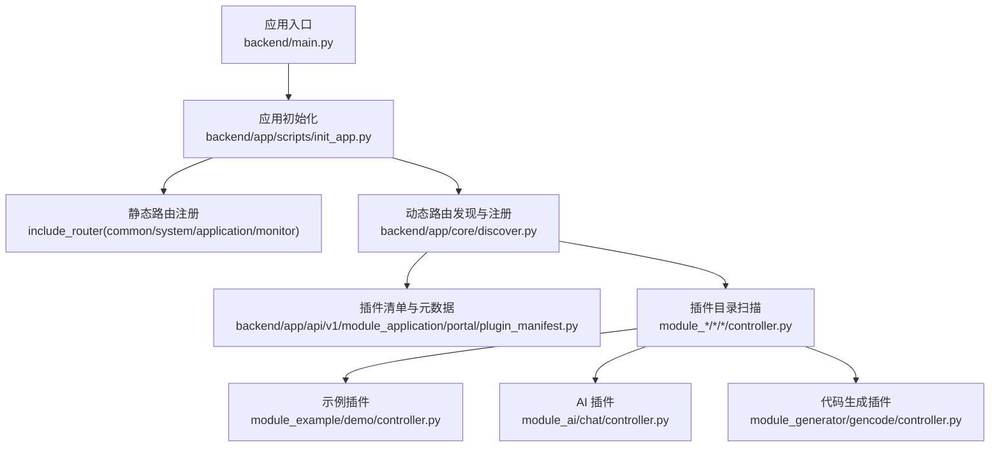
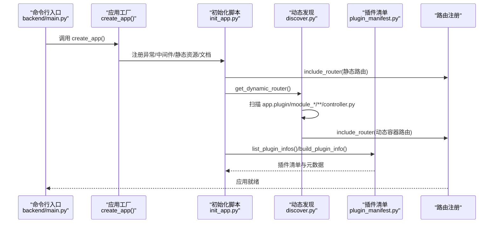
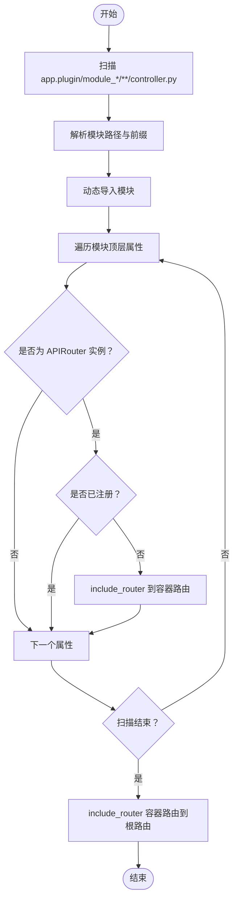
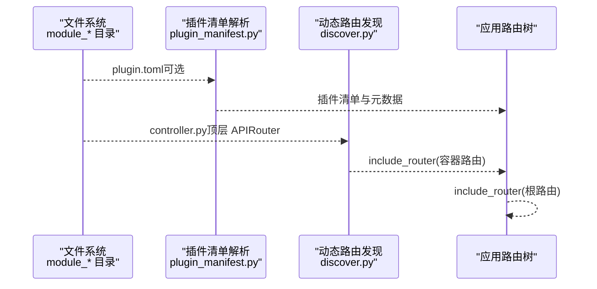
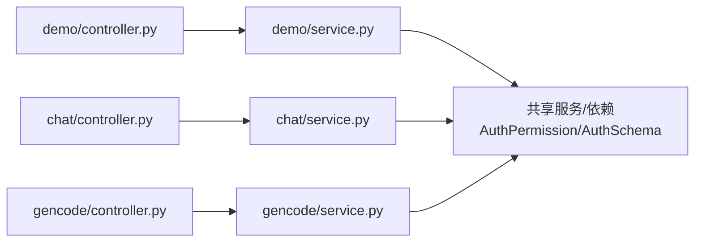
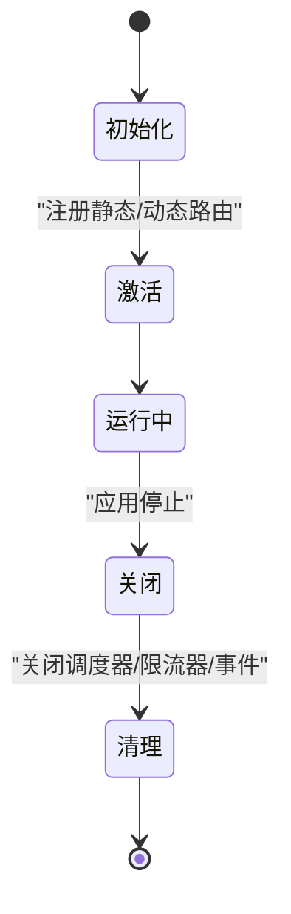
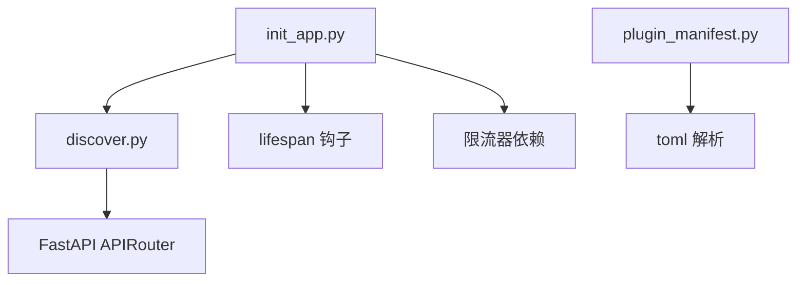

# 插件架构原理

<cite>
**本文引用的文件**
- [backend/main.py](file://backend/main.py)
- [backend/app/scripts/init_app.py](file://backend/app/scripts/init_app.py)
- [backend/app/core/discover.py](file://backend/app/core/discover.py)
- [backend/app/api/v1/module_application/portal/plugin_manifest.py](file://backend/app/api/v1/module_application/portal/plugin_manifest.py)
- [backend/app/plugin/module_example/plugin.toml](file://backend/app/plugin/module_example/plugin.toml)
- [backend/app/plugin/module_ai/plugin.toml](file://backend/app/plugin/module_ai/plugin.toml)
- [backend/app/plugin/module_generator/plugin.toml](file://backend/app/plugin/module_generator/plugin.toml)
- [backend/app/plugin/module_task/plugin.toml](file://backend/app/plugin/module_task/plugin.toml)
- [backend/app/plugin/module_example/demo/controller.py](file://backend/app/plugin/module_example/demo/controller.py)
- [backend/app/plugin/module_example/demo/service.py](file://backend/app/plugin/module_example/demo/service.py)
- [backend/app/plugin/module_ai/chat/controller.py](file://backend/app/plugin/module_ai/chat/controller.py)
- [backend/app/plugin/module_generator/gencode/controller.py](file://backend/app/plugin/module_generator/gencode/controller.py)
</cite>

## 目录
1. [引言](#引言)
2. [项目结构](#项目结构)
3. [核心组件](#核心组件)
4. [架构总览](#架构总览)
5. [详细组件分析](#详细组件分析)
6. [依赖关系分析](#依赖关系分析)
7. [性能考量](#性能考量)
8. [故障排查指南](#故障排查指南)
9. [结论](#结论)
10. [附录](#附录)

## 引言
本文件系统性阐述 FastapiAdmin 插件架构的设计理念与实现原理，重点覆盖：
- 动态模块加载与自动路由注册机制
- 插件发现与加载流程（从系统扫描到插件实例化）
- 插件间隔离与通信方式
- 插件生命周期管理（初始化、激活、停用、卸载）
- 插件配置文件 plugin.toml 的结构与字段语义
- 通过架构图与数据流图帮助开发者快速理解插件系统工作原理

## 项目结构
FastapiAdmin 的插件体系围绕 backend/app/plugin 下的 module_* 目录组织，遵循“目录即插件、controller.py 即路由入口”的约定式设计。每个 module_* 插件可包含若干子模块（如 demo、chat、gencode 等），每个子模块均提供 controller.py 作为 APIRouter 的声明点，系统在启动时自动扫描并注册这些路由。

图表来源
- [backend/main.py:16-51](file://backend/main.py#L16-L51)
- [backend/app/scripts/init_app.py:125-159](file://backend/app/scripts/init_app.py#L125-L159)
- [backend/app/core/discover.py:62-167](file://backend/app/core/discover.py#L62-L167)
- [backend/app/api/v1/module_application/portal/plugin_manifest.py:28-116](file://backend/app/api/v1/module_application/portal/plugin_manifest.py#L28-L116)

章节来源
- [backend/main.py:16-51](file://backend/main.py#L16-L51)
- [backend/app/scripts/init_app.py:125-159](file://backend/app/scripts/init_app.py#L125-L159)
- [backend/app/core/discover.py:62-167](file://backend/app/core/discover.py#L62-L167)
- [backend/app/api/v1/module_application/portal/plugin_manifest.py:28-116](file://backend/app/api/v1/module_application/portal/plugin_manifest.py#L28-L116)

## 核心组件
- 应用工厂与生命周期
  - create_app 负责创建 FastAPI 实例并注册异常、中间件、路由、静态资源与文档。
  - lifespan 提供应用启动/关闭的生命周期钩子，负责数据库初始化、Redis配置、定时任务调度器、请求限流器等的初始化与关闭。
- 动态路由发现与注册
  - get_dynamic_router 扫描 app.plugin 下 module_* 目录树，定位 controller.py 中的顶层 APIRouter 实例并注册到根路由，同时进行去重与前缀映射。
- 插件清单与元数据
  - plugin_manifest 提供对 plugin.toml 的解析与插件信息汇总，支持可选元数据（name、title、version、description、optional、tags）以及一致性校验。
- 插件示例
  - module_example/demo、module_ai/chat、module_generator/gencode 等展示了标准的 CRUD/查询/导出/导入等控制器与服务层结构。

章节来源
- [backend/main.py:16-51](file://backend/main.py#L16-L51)
- [backend/app/scripts/init_app.py:27-93](file://backend/app/scripts/init_app.py#L27-L93)
- [backend/app/core/discover.py:62-167](file://backend/app/core/discover.py#L62-L167)
- [backend/app/api/v1/module_application/portal/plugin_manifest.py:59-116](file://backend/app/api/v1/module_application/portal/plugin_manifest.py#L59-L116)
- [backend/app/plugin/module_example/demo/controller.py:19](file://backend/app/plugin/module_example/demo/controller.py#L19)
- [backend/app/plugin/module_ai/chat/controller.py:22](file://backend/app/plugin/module_ai/chat/controller.py#L22)
- [backend/app/plugin/module_generator/gencode/controller.py:24](file://backend/app/plugin/module_generator/gencode/controller.py#L24)

## 架构总览
下面的序列图展示了从应用启动到动态路由注册的关键流程，以及插件清单解析如何辅助前端与管理端展示。

图表来源
- [backend/main.py:16-51](file://backend/main.py#L16-L51)
- [backend/app/scripts/init_app.py:125-159](file://backend/app/scripts/init_app.py#L125-L159)
- [backend/app/core/discover.py:62-167](file://backend/app/core/discover.py#L62-L167)
- [backend/app/api/v1/module_application/portal/plugin_manifest.py:109-116](file://backend/app/api/v1/module_application/portal/plugin_manifest.py#L109-L116)

## 详细组件分析

### 动态模块加载与自动路由注册
- 发现规则
  - 仅扫描 app.plugin 下以 module_* 命名的顶级目录。
  - 递归查找子树中的 controller.py 文件。
  - 要求 controller.py 中的 APIRouter 必须在模块顶层定义（不在函数内部），以便被扫描到。
- 注册策略
  - 为每个顶级 module_* 创建独立的容器路由（前缀为 /xxx，其中 xxx 为 module_* 去除前缀后的名称）。
  - 将模块内的所有顶层 APIRouter 实例 include_router 到对应的容器路由。
  - 最终将所有容器路由 include_router 到根路由，形成统一的动态路由树。
  - 使用 router 实例 id 去重，避免重复注册。
- 错误处理与提示
  - 针对 ModuleNotFoundError、ImportError、SyntaxError、PermissionError 等异常提供针对性提示，便于定位包结构、命名与导入问题。

图表来源
- [backend/app/core/discover.py:82-161](file://backend/app/core/discover.py#L82-L161)

章节来源
- [backend/app/core/discover.py:62-167](file://backend/app/core/discover.py#L62-L167)

### 插件发现与加载流程（系统扫描到插件实例化）
- 插件目录扫描
  - iter_module_plugin_dirs 识别 app.plugin 下所有 module_* 目录。
- 元数据解析
  - build_plugin_info 读取 plugin.toml 并提取 name、title、version、description、optional、tags 等字段，同时校验 manifest 名称与目录名一致性。
- 路由实例化
  - get_dynamic_router 在运行时动态导入各插件的 controller.py，收集顶层 APIRouter 并注册到容器路由，最终挂载到根路由。
- 依赖注入与限流
  - 注册动态路由时统一附加 HTTP 限流依赖，WebSocket 路由单独处理。

图表来源
- [backend/app/api/v1/module_application/portal/plugin_manifest.py:28-116](file://backend/app/api/v1/module_application/portal/plugin_manifest.py#L28-L116)
- [backend/app/core/discover.py:82-161](file://backend/app/core/discover.py#L82-L161)

章节来源
- [backend/app/api/v1/module_application/portal/plugin_manifest.py:59-116](file://backend/app/api/v1/module_application/portal/plugin_manifest.py#L59-L116)
- [backend/app/core/discover.py:62-167](file://backend/app/core/discover.py#L62-L167)

### 插件间隔离与通信
- 隔离机制
  - 每个插件的 controller.py 位于独立的包路径下，动态导入时仅暴露顶层 APIRouter 实例，避免相互污染。
  - 容器路由按前缀隔离，不同插件的路由互不干扰。
- 通信方式
  - 通过共享的服务层（service）与数据访问层（crud）进行跨模块协作。
  - 控制器层通过依赖注入（Depends）获取认证与权限信息，确保跨模块统一鉴权。
  - 示例：module_example/demo 与 module_ai/chat 均依赖 app.core.dependencies.AuthPermission 与 app.api.v1.module_system.auth.schema.AuthSchema。

图表来源
- [backend/app/plugin/module_example/demo/controller.py:16-17](file://backend/app/plugin/module_example/demo/controller.py#L16-L17)
- [backend/app/plugin/module_example/demo/service.py:13-19](file://backend/app/plugin/module_example/demo/service.py#L13-L19)
- [backend/app/plugin/module_ai/chat/controller.py:13-20](file://backend/app/plugin/module_ai/chat/controller.py#L13-L20)
- [backend/app/plugin/module_generator/gencode/controller.py:14-22](file://backend/app/plugin/module_generator/gencode/controller.py#L14-L22)

章节来源
- [backend/app/plugin/module_example/demo/controller.py:16-17](file://backend/app/plugin/module_example/demo/controller.py#L16-L17)
- [backend/app/plugin/module_example/demo/service.py:13-19](file://backend/app/plugin/module_example/demo/service.py#L13-L19)
- [backend/app/plugin/module_ai/chat/controller.py:13-20](file://backend/app/plugin/module_ai/chat/controller.py#L13-L20)
- [backend/app/plugin/module_generator/gencode/controller.py:14-22](file://backend/app/plugin/module_generator/gencode/controller.py#L14-L22)

### 插件生命周期管理
- 初始化
  - 应用启动时，lifespan 负责数据库连接、Redis 配置、定时任务调度器与请求限流器的初始化。
  - 全局事件模块按配置列表异步导入。
- 激活
  - 注册静态路由与动态路由，动态路由通过 get_dynamic_router 自动发现并挂载。
- 停用
  - 应用关闭时，先关闭定时任务调度器与限流器，再卸载全局事件模块，最后清理控制台输出。
- 卸载
  - 由于 FastAPI 路由注册不可逆，卸载主要体现在关闭阶段的资源回收与事件卸载。

图表来源
- [backend/app/scripts/init_app.py:27-93](file://backend/app/scripts/init_app.py#L27-L93)
- [backend/app/scripts/init_app.py:125-159](file://backend/app/scripts/init_app.py#L125-L159)

章节来源
- [backend/app/scripts/init_app.py:27-93](file://backend/app/scripts/init_app.py#L27-L93)
- [backend/app/scripts/init_app.py:125-159](file://backend/app/scripts/init_app.py#L125-L159)

### 插件配置文件 plugin.toml 结构与字段
- 字段说明
  - name：插件标识名，建议与 module_* 目录名一致。
  - title：插件标题，用于展示与文档。
  - version：插件版本号。
  - description：插件功能描述。
  - optional：布尔值，标记插件是否可选。
  - tags：字符串数组，用于分类与检索。
- 解析与校验
  - build_plugin_info 读取并解析 plugin.toml，若存在则填充到插件信息中；同时校验 manifest 的 name 与目录名是否一致，不一致时记录警告。

章节来源
- [backend/app/plugin/module_example/plugin.toml:1-10](file://backend/app/plugin/module_example/plugin.toml#L1-L10)
- [backend/app/plugin/module_ai/plugin.toml:1-9](file://backend/app/plugin/module_ai/plugin.toml#L1-L9)
- [backend/app/plugin/module_generator/plugin.toml:1-9](file://backend/app/plugin/module_generator/plugin.toml#L1-L9)
- [backend/app/plugin/module_task/plugin.toml:1-9](file://backend/app/plugin/module_task/plugin.toml#L1-L9)
- [backend/app/api/v1/module_application/portal/plugin_manifest.py:43-106](file://backend/app/api/v1/module_application/portal/plugin_manifest.py#L43-L106)

## 依赖关系分析
- 组件耦合
  - discover.py 与 plugin_manifest.py 分别承担“运行时动态发现”和“清单与元数据”职责，耦合度低，职责清晰。
  - init_app.py 作为装配器，协调静态路由、动态路由、限流与生命周期管理。
- 外部依赖
  - FastAPI 的 APIRouter、Depends、include_router 等用于路由构建与依赖注入。
  - toml 解析库（Python 3.11+ 使用内置 tomllib，否则使用 tomli）。
- 潜在风险
  - controller.py 顶层未定义 APIRouter 将导致未注册。
  - 目录命名不合法或缺少 __init__.py 会导致导入失败。

图表来源
- [backend/app/core/discover.py:27-30](file://backend/app/core/discover.py#L27-L30)
- [backend/app/scripts/init_app.py:135-158](file://backend/app/scripts/init_app.py#L135-L158)
- [backend/app/api/v1/module_application/portal/plugin_manifest.py:11-19](file://backend/app/api/v1/module_application/portal/plugin_manifest.py#L11-L19)

章节来源
- [backend/app/core/discover.py:27-30](file://backend/app/core/discover.py#L27-L30)
- [backend/app/scripts/init_app.py:135-158](file://backend/app/scripts/init_app.py#L135-L158)
- [backend/app/api/v1/module_application/portal/plugin_manifest.py:11-19](file://backend/app/api/v1/module_application/portal/plugin_manifest.py#L11-L19)

## 性能考量
- 动态导入成本
  - 控制器模块数量较多时，动态导入与属性扫描会带来一定开销。建议保持 controller.py 顶层 APIRouter 的简洁与稳定。
- 路由去重
  - 使用 id 去重避免重复注册，减少路由树膨胀。
- 限流策略
  - 动态路由统一附加 HTTP 限流依赖，WebSocket 单独处理，有助于保护系统资源。
- 扫描范围
  - 仅扫描 module_* 目录，避免对其他包的无谓扫描。

## 故障排查指南
- “未注册任何路由”
  - 检查 controller.py 是否在模块顶层定义 APIRouter，而非函数内部。
  - 确认目录名与文件名符合规范（controller.py、合法标识符、存在 __init__.py）。
- “导入失败/找不到模块”
  - 检查目录命名是否为合法 Python 标识符（不含连字符、空格、中文）。
  - 确认磁盘路径与 import 路径一致，大小写正确。
- “语法错误”
  - 定位 controller.py 中的语法错误行号并修正。
- “权限错误”
  - 在受限环境（沙箱、CI）中，注意模块初始化时是否调用了被禁止的系统能力。

章节来源
- [backend/app/core/discover.py:33-59](file://backend/app/core/discover.py#L33-L59)

## 结论
FastapiAdmin 的插件架构以“约定优于配置”为核心，通过严格的目录与文件命名规范、顶层 APIRouter 的显式声明、以及运行时动态发现与注册，实现了高内聚、低耦合的模块化扩展能力。配合 plugin.toml 的可选元数据与生命周期管理，系统在保证易用性的同时，提供了良好的可维护性与可观测性。

## 附录
- 目录与命名规范摘要
  - 顶级目录：module_*（扫描模式：module_*/**/controller.py）
  - 控制器文件：controller.py（顶层声明 APIRouter）
  - 包结构：每级目录需可作为包导入（通常需 __init__.py）
  - 路由前缀：module_xxx -> /xxx
- 常见问题速查
  - 未注册路由：确认顶层 APIRouter 定义与文件命名。
  - 导入失败：检查目录名合法性与 __init__.py。
  - 语法错误：修复 controller.py 中的语法问题。
  - 权限错误：在完整操作系统环境下重试或排查受限能力。