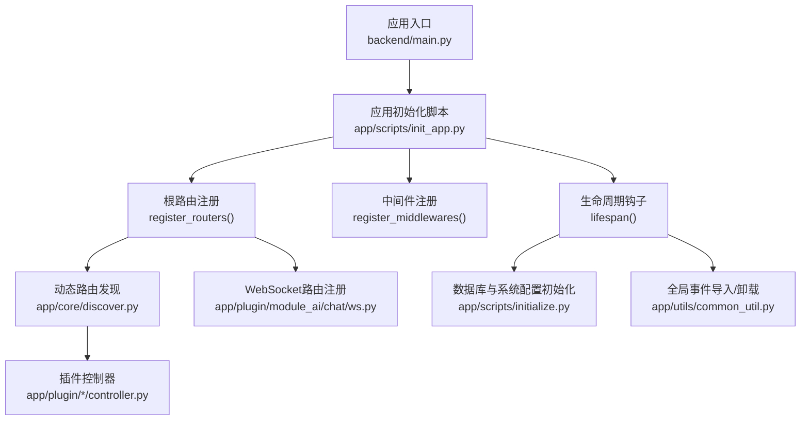
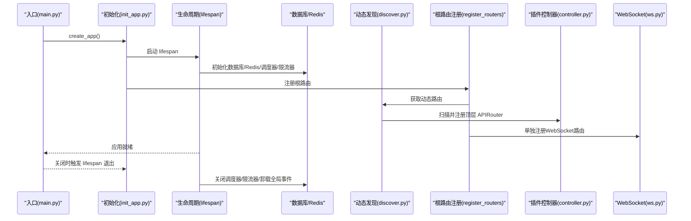
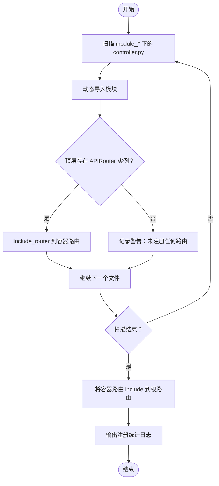
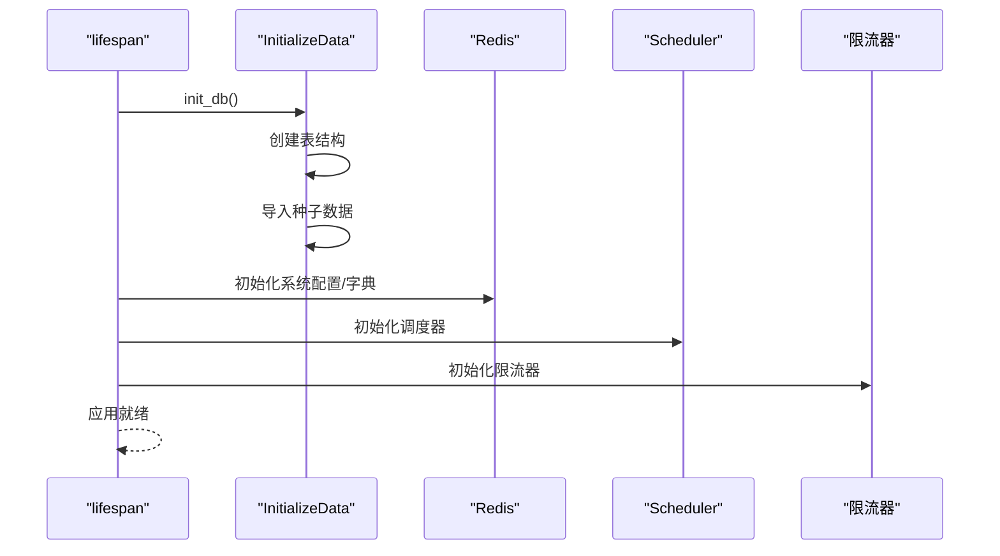
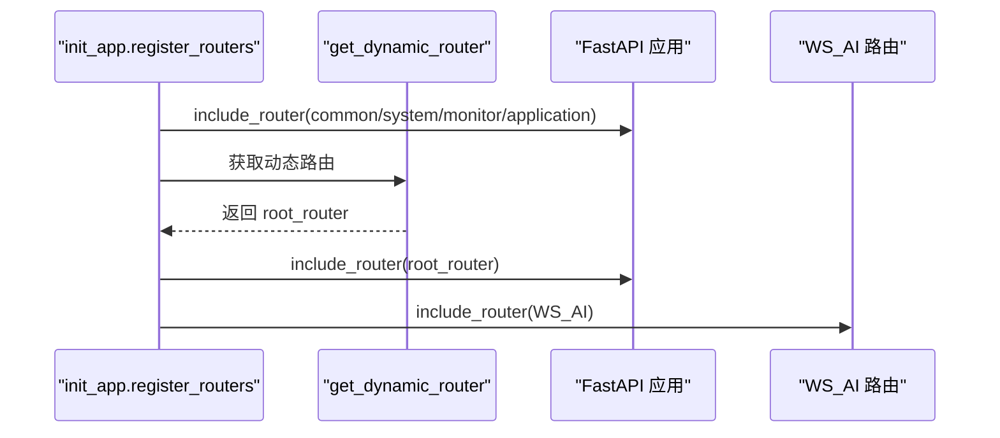
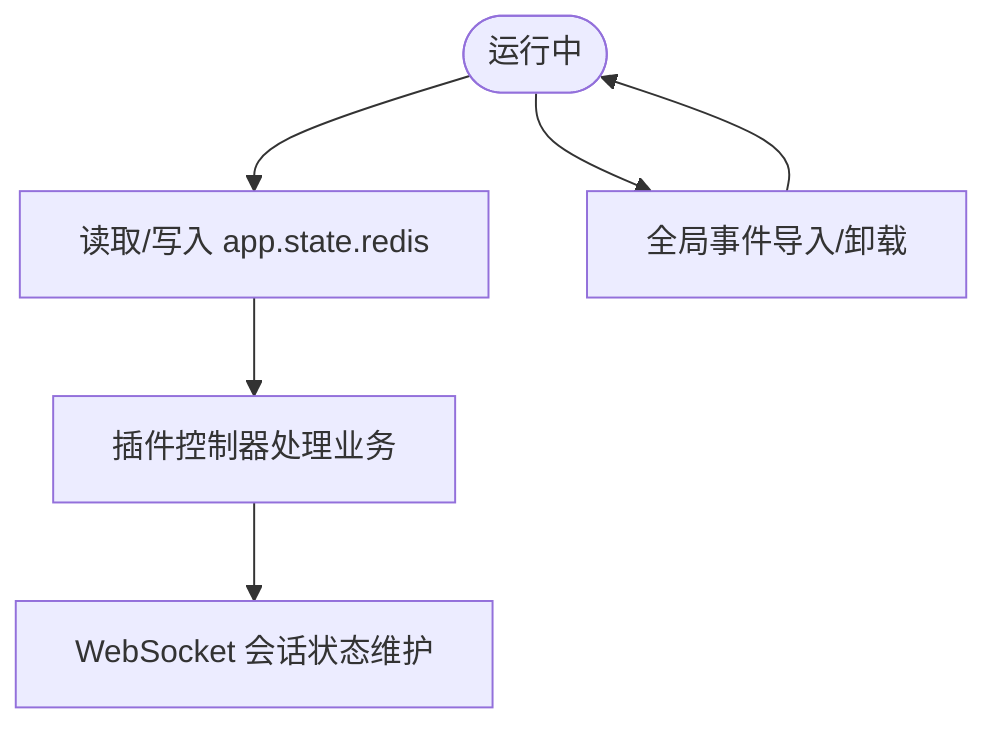
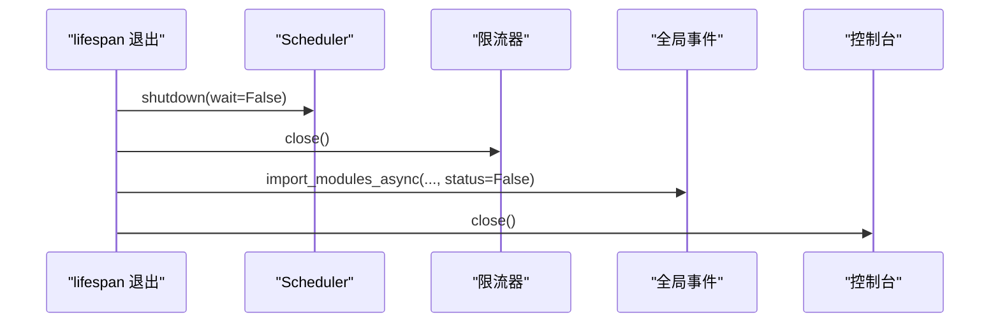
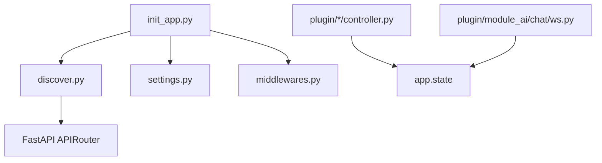

# 插件生命周期管理

<cite>
**本文引用的文件**   
- [backend/main.py](file://backend/main.py)
- [backend/app/scripts/init_app.py](file://backend/app/scripts/init_app.py)
- [backend/app/scripts/initialize.py](file://backend/app/scripts/initialize.py)
- [backend/app/core/discover.py](file://backend/app/core/discover.py)
- [backend/app/plugin/module_example/demo/controller.py](file://backend/app/plugin/module_example/demo/controller.py)
- [backend/app/plugin/module_ai/chat/ws.py](file://backend/app/plugin/module_ai/chat/ws.py)
- [backend/app/utils/common_util.py](file://backend/app/utils/common_util.py)
- [backend/app/core/middlewares.py](file://backend/app/core/middlewares.py)
- [backend/app/config/setting.py](file://backend/app/config/setting.py)
</cite>

## 目录
1. [简介](#简介)
2. [项目结构](#项目结构)
3. [核心组件](#核心组件)
4. [架构总览](#架构总览)
5. [详细组件分析](#详细组件分析)
6. [依赖分析](#依赖分析)
7. [性能考虑](#性能考虑)
8. [故障排查指南](#故障排查指南)
9. [结论](#结论)
10. [附录](#附录)

## 简介
本文件系统化阐述本项目的插件生命周期管理，覆盖从插件发现、初始化、激活、运行到停用与卸载的全链路流程。重点说明：
- 插件发现与动态路由注册机制
- 初始化阶段的资源分配与依赖注入
- 激活阶段的路由注册与中间件挂载
- 运行阶段的状态管理与事件处理
- 停用与卸载阶段的资源清理与内存回收
- 生命周期钩子函数的使用方法与最佳实践
- 插件状态监控与故障恢复机制

## 项目结构
插件体系位于后端目录的 app/plugin 下，采用“模块化目录 + 动态路由发现”的组织方式：
- 每个插件以 module_xxx 命名的顶级目录表示
- 插件内的控制器统一命名为 controller.py，并在模块顶层定义 APIRouter 实例
- 动态路由扫描规则严格约束目录命名、包结构与顶层变量定义

图表来源
- [backend/main.py:16-51](file://backend/main.py#L16-L51)
- [backend/app/scripts/init_app.py:27-94](file://backend/app/scripts/init_app.py#L27-L94)
- [backend/app/core/discover.py:62-167](file://backend/app/core/discover.py#L62-L167)

章节来源
- [backend/main.py:16-51](file://backend/main.py#L16-L51)
- [backend/app/scripts/init_app.py:27-94](file://backend/app/scripts/init_app.py#L27-L94)
- [backend/app/core/discover.py:1-172](file://backend/app/core/discover.py#L1-L172)

## 核心组件
- 应用入口与生命周期
  - 应用通过工厂函数创建，使用 lifespan 钩子完成数据库、Redis、调度器、限流器等资源的初始化与关闭。
- 动态路由发现与注册
  - 通过扫描 app/plugin 下 module_xxx/*/controller.py，自动发现并注册 APIRouter 实例，形成容器前缀路由。
- 插件控制器与WebSocket
  - 插件控制器在模块顶层定义 APIRouter，统一前缀与标签；WebSocket路由独立注册，便于差异化限流策略。
- 中间件与依赖注入
  - 中间件在应用启动时集中注册；依赖注入通过 Depends 与 app.state 注入 Redis、数据库等共享资源。

章节来源
- [backend/main.py:16-51](file://backend/main.py#L16-L51)
- [backend/app/scripts/init_app.py:95-226](file://backend/app/scripts/init_app.py#L95-L226)
- [backend/app/core/discover.py:62-167](file://backend/app/core/discover.py#L62-L167)
- [backend/app/plugin/module_example/demo/controller.py:19](file://backend/app/plugin/module_example/demo/controller.py#L19)
- [backend/app/plugin/module_ai/chat/ws.py:13](file://backend/app/plugin/module_ai/chat/ws.py#L13)

## 架构总览
下图展示插件生命周期的关键交互：应用启动时的初始化、中间件与根路由注册、动态路由发现、插件激活与运行、以及停用时的资源回收。

图表来源
- [backend/main.py:16-51](file://backend/main.py#L16-L51)
- [backend/app/scripts/init_app.py:27-94](file://backend/app/scripts/init_app.py#L27-L94)
- [backend/app/scripts/init_app.py:125-159](file://backend/app/scripts/init_app.py#L125-L159)
- [backend/app/core/discover.py:62-167](file://backend/app/core/discover.py#L62-L167)
- [backend/app/plugin/module_ai/chat/ws.py:13](file://backend/app/plugin/module_ai/chat/ws.py#L13)

## 详细组件分析

### 插件发现与动态路由注册
- 发现规则
  - 仅扫描 app/plugin/module_*/**/controller.py
  - 顶层必须定义 APIRouter 实例，否则不会被注册
  - 容器前缀由 module_xxx 映射为 /xxx
- 注册流程
  - 生成根路由 root_router
  - 为每个容器前缀创建 container_router 并 include_router
  - 将所有容器路由 include 到 root_router
- 错误提示
  - 对 ModuleNotFoundError、ImportError、SyntaxError、PermissionError 等异常提供针对性提示

图表来源
- [backend/app/core/discover.py:62-167](file://backend/app/core/discover.py#L62-L167)

章节来源
- [backend/app/core/discover.py:1-172](file://backend/app/core/discover.py#L1-L172)

### 初始化阶段：资源分配与依赖注入
- 生命周期钩子
  - lifespan 在应用启动前执行数据库与系统配置初始化，在应用关闭时执行资源回收与事件卸载
- 初始化清单
  - 数据库表结构创建与种子数据初始化
  - Redis 系统配置与数据字典服务初始化
  - 定时任务调度器初始化
  - 请求限流器初始化
- 依赖注入
  - app.state.redis 与数据库连接在中间件与插件控制器中通过 Depends 或直接访问 app.state 获取

图表来源
- [backend/app/scripts/init_app.py:27-94](file://backend/app/scripts/init_app.py#L27-L94)
- [backend/app/scripts/initialize.py:185-199](file://backend/app/scripts/initialize.py#L185-L199)

章节来源
- [backend/app/scripts/init_app.py:27-94](file://backend/app/scripts/init_app.py#L27-L94)
- [backend/app/scripts/initialize.py:21-199](file://backend/app/scripts/initialize.py#L21-L199)

### 激活阶段：路由注册与中间件挂载
- 中间件注册
  - 从配置列表反向导入并注册中间件
- 根路由注册
  - 注册通用模块路由与动态路由
  - 动态路由通过 get_dynamic_router() 获取并 include_router
- WebSocket 路由
  - 单独注册 AI 聊天 WebSocket 路由，使用独立限流策略

图表来源
- [backend/app/scripts/init_app.py:125-159](file://backend/app/scripts/init_app.py#L125-L159)
- [backend/app/core/discover.py:62-167](file://backend/app/core/discover.py#L62-L167)
- [backend/app/plugin/module_ai/chat/ws.py:13](file://backend/app/plugin/module_ai/chat/ws.py#L13)

章节来源
- [backend/app/scripts/init_app.py:95-226](file://backend/app/scripts/init_app.py#L95-L226)

### 运行阶段：状态管理与事件处理
- 状态管理
  - 插件控制器通过 app.state.redis 与数据库连接进行状态持久化与查询
  - WebSocket 控制器在 websocket.state 中保存认证信息，便于会话管理
- 事件处理
  - 全局事件模块通过 import_modules_async 在应用生命周期前后执行初始化/卸载

图表来源
- [backend/app/plugin/module_ai/chat/ws.py:46-56](file://backend/app/plugin/module_ai/chat/ws.py#L46-L56)
- [backend/app/scripts/init_app.py:45-47](file://backend/app/scripts/init_app.py#L45-L47)
- [backend/app/utils/common_util.py:42-68](file://backend/app/utils/common_util.py#L42-L68)

章节来源
- [backend/app/plugin/module_ai/chat/ws.py:1-110](file://backend/app/plugin/module_ai/chat/ws.py#L1-L110)
- [backend/app/scripts/init_app.py:42-47](file://backend/app/scripts/init_app.py#L42-L47)
- [backend/app/utils/common_util.py:19-68](file://backend/app/utils/common_util.py#L19-L68)

### 停用与卸载：资源清理与内存回收
- 生命周期关闭
  - 关闭定时任务调度器与限流器
  - 卸载全局事件模块
  - 关闭控制台输出
- 资源回收
  - 释放 Redis、数据库连接等共享资源
  - 确保异常场景下的日志记录与优雅退出

图表来源
- [backend/app/scripts/init_app.py:82-93](file://backend/app/scripts/init_app.py#L82-L93)

章节来源
- [backend/app/scripts/init_app.py:82-93](file://backend/app/scripts/init_app.py#L82-L93)

### 生命周期钩子函数与最佳实践
- 钩子函数
  - lifespan：应用启动/关闭的生命周期钩子，负责资源初始化与回收
  - import_modules_async：异步导入模块列表，支持初始化/卸载
- 最佳实践
  - 在插件控制器顶层定义 APIRouter，避免在函数内部创建
  - 严格遵循 module_xxx 目录命名与包结构，确保 import 成功
  - 使用 app.state 注入共享资源，避免硬编码
  - WebSocket 路由单独注册，便于差异化限流策略

章节来源
- [backend/app/scripts/init_app.py:27-94](file://backend/app/scripts/init_app.py#L27-L94)
- [backend/app/utils/common_util.py:42-68](file://backend/app/utils/common_util.py#L42-L68)
- [backend/app/core/discover.py:14-20](file://backend/app/core/discover.py#L14-L20)

## 依赖分析
- 组件耦合
  - discover 依赖 app.plugin 包路径与 APIRouter 类型
  - init_app 依赖 settings、中间件与动态路由发现
  - 插件控制器依赖 app.state 与服务层
- 外部依赖
  - FastAPI、SQLAlchemy、Redis、调度器与限流器

图表来源
- [backend/app/core/discover.py:27-31](file://backend/app/core/discover.py#L27-L31)
- [backend/app/scripts/init_app.py:16-24](file://backend/app/scripts/init_app.py#L16-L24)
- [backend/app/config/setting.py:13-21](file://backend/app/config/setting.py#L13-L21)
- [backend/app/core/middlewares.py:14-18](file://backend/app/core/middlewares.py#L14-L18)
- [backend/app/plugin/module_example/demo/controller.py:16](file://backend/app/plugin/module_example/demo/controller.py#L16)
- [backend/app/plugin/module_ai/chat/ws.py:46-47](file://backend/app/plugin/module_ai/chat/ws.py#L46-L47)

章节来源
- [backend/app/core/discover.py:1-172](file://backend/app/core/discover.py#L1-L172)
- [backend/app/scripts/init_app.py:1-226](file://backend/app/scripts/init_app.py#L1-L226)
- [backend/app/config/setting.py:1-200](file://backend/app/config/setting.py#L1-L200)
- [backend/app/core/middlewares.py:1-215](file://backend/app/core/middlewares.py#L1-L215)
- [backend/app/plugin/module_example/demo/controller.py:1-264](file://backend/app/plugin/module_example/demo/controller.py#L1-L264)
- [backend/app/plugin/module_ai/chat/ws.py:1-110](file://backend/app/plugin/module_ai/chat/ws.py#L1-L110)

## 性能考虑
- 动态路由扫描
  - 仅扫描 module_* 目录，避免不必要的文件系统遍历
  - 顶层 APIRouter 才会被注册，减少无效路由数量
- 中间件与限流
  - 根路由统一限流，WebSocket 使用独立限流策略，降低全局影响
- 资源复用
  - app.state 复用 Redis 与数据库连接，减少重复初始化开销

## 故障排查指南
- 路由未注册
  - 检查目录是否以 module_* 命名，controller.py 是否在正确层级
  - 确认模块可导入（缺少 __init__.py、非法目录名、拼写错误）
  - 确保 APIRouter 在模块顶层定义
- 导入失败
  - ModuleNotFoundError：检查包路径与大小写
  - ImportError：排查循环导入与依赖缺失
  - SyntaxError：修正 controller.py 语法错误
  - PermissionError：在受限环境下重试或排查系统能力调用
- 生命周期异常
  - 初始化失败：查看日志定位异常模块并修复
  - 关闭异常：确保资源释放顺序正确，避免阻塞

章节来源
- [backend/app/core/discover.py:33-59](file://backend/app/core/discover.py#L33-L59)
- [backend/app/scripts/init_app.py:76-78](file://backend/app/scripts/init_app.py#L76-L78)
- [backend/app/scripts/init_app.py:91-92](file://backend/app/scripts/init_app.py#L91-L92)

## 结论
本项目的插件生命周期管理通过严格的目录与变量规范、动态路由发现与注册、以及完善的生命周期钩子，实现了插件从创建到销毁的可控与可观测。配合中间件与依赖注入机制，插件可在运行期稳定地获取共享资源并高效处理请求与会话。建议在开发新插件时严格遵循现有规范，确保发现、注册与运行的顺畅。

## 附录
- 插件示例
  - 示例插件控制器展示了标准的 CRUD 接口与权限依赖
  - AI 插件 WebSocket 展示了认证、会话状态与流式响应处理
- 配置参考
  - settings 提供了中间件、限流、静态资源等关键配置项

章节来源
- [backend/app/plugin/module_example/demo/controller.py:19-264](file://backend/app/plugin/module_example/demo/controller.py#L19-L264)
- [backend/app/plugin/module_ai/chat/ws.py:13-110](file://backend/app/plugin/module_ai/chat/ws.py#L13-L110)
- [backend/app/config/setting.py:13-200](file://backend/app/config/setting.py#L13-L200)