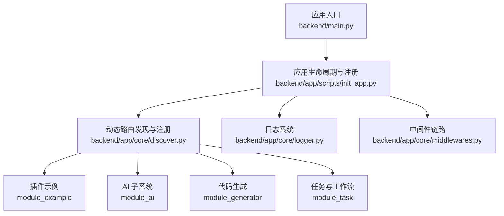
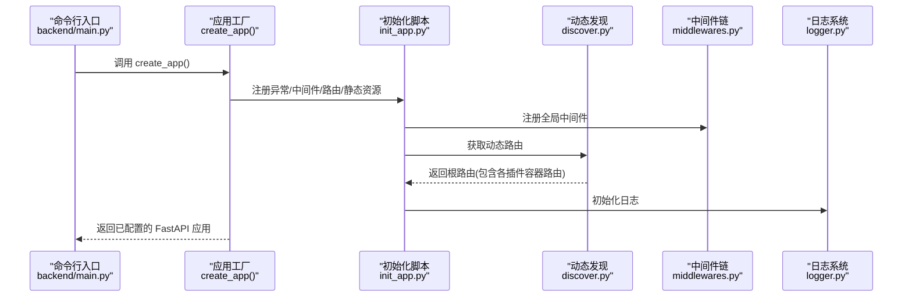
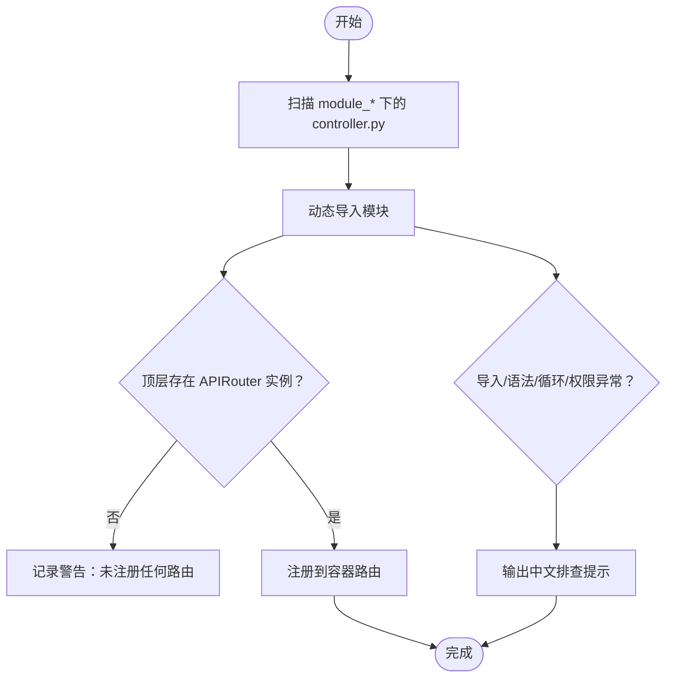
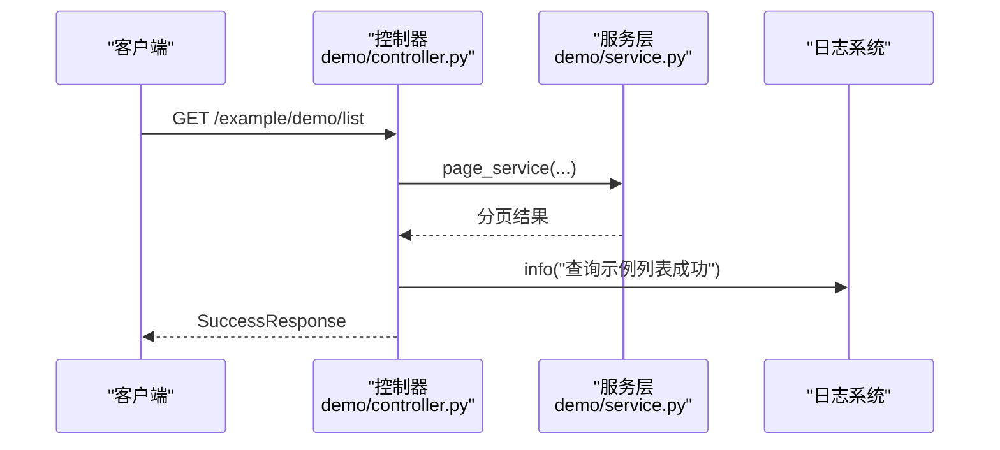
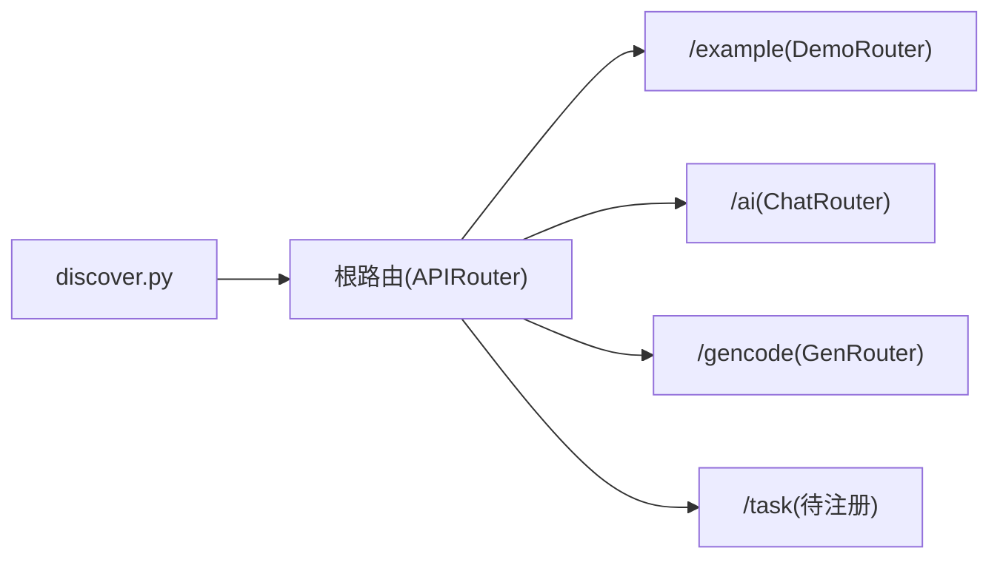
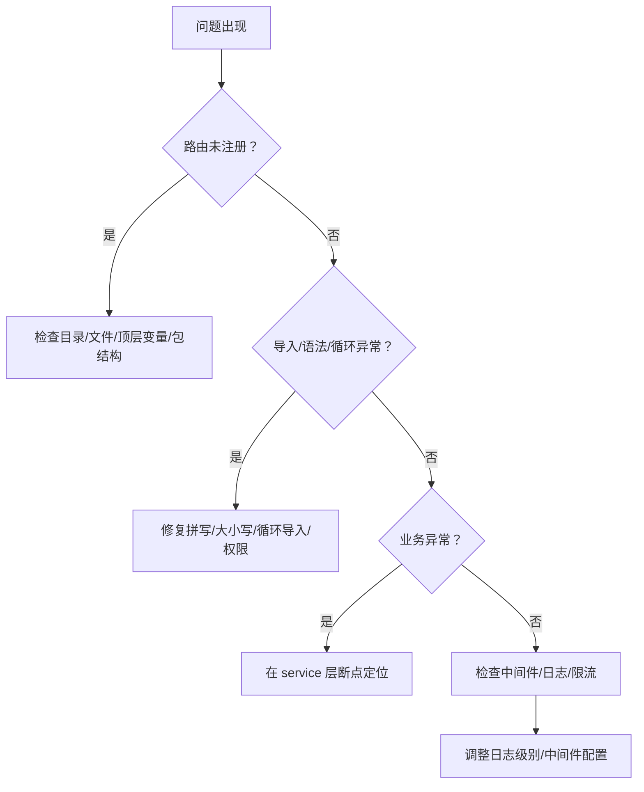

# 插件调试与优化

<cite>
**本文引用的文件**
- [backend/main.py](file://backend/main.py)
- [backend/app/scripts/init_app.py](file://backend/app/scripts/init_app.py)
- [backend/app/core/discover.py](file://backend/app/core/discover.py)
- [backend/app/core/logger.py](file://backend/app/core/logger.py)
- [backend/app/core/middlewares.py](file://backend/app/core/middlewares.py)
- [backend/app/utils/common_util.py](file://backend/app/utils/common_util.py)
- [backend/app/plugin/module_example/plugin.toml](file://backend/app/plugin/module_example/plugin.toml)
- [backend/app/plugin/module_ai/plugin.toml](file://backend/app/plugin/module_ai/plugin.toml)
- [backend/app/plugin/module_generator/plugin.toml](file://backend/app/plugin/module_generator/plugin.toml)
- [backend/app/plugin/module_task/plugin.toml](file://backend/app/plugin/module_task/plugin.toml)
- [backend/app/plugin/module_example/demo/controller.py](file://backend/app/plugin/module_example/demo/controller.py)
- [backend/app/plugin/module_example/demo/service.py](file://backend/app/plugin/module_example/demo/service.py)
- [backend/app/plugin/module_ai/chat/controller.py](file://backend/app/plugin/module_ai/chat/controller.py)
- [backend/app/plugin/module_generator/gencode/controller.py](file://backend/app/plugin/module_generator/gencode/controller.py)
</cite>

## 目录
1. [简介](#简介)
2. [项目结构](#项目结构)
3. [核心组件](#核心组件)
4. [架构总览](#架构总览)
5. [详细组件分析](#详细组件分析)
6. [依赖分析](#依赖分析)
7. [性能考虑](#性能考虑)
8. [故障排查指南](#故障排查指南)
9. [结论](#结论)
10. [附录](#附录)

## 简介
本指南面向插件开发者与维护者，聚焦于 FastapiAdmin 插件体系的调试与性能优化。内容涵盖：
- 插件开发与调试：断点设置、日志追踪、异常定位与常见问题诊断
- 性能监控与分析：执行时间统计、资源使用观测、瓶颈识别
- 代码质量与静态分析：工具链建议与最佳实践
- 发布前测试与质量保障：端到端验证、回归测试与发布清单
- 维护与升级：版本兼容、依赖管理与灰度策略

## 项目结构
FastapiAdmin 的插件采用“约定优于配置”的动态路由发现机制，插件位于 backend/app/plugin 下，遵循 module_* 命名与 controller.py 结构约定。应用启动时通过 discover 模块扫描并注册插件路由，同时统一注册中间件、异常处理器与静态资源。

图表来源
- [backend/main.py:16-51](file://backend/main.py#L16-L51)
- [backend/app/scripts/init_app.py:125-159](file://backend/app/scripts/init_app.py#L125-L159)
- [backend/app/core/discover.py:62-167](file://backend/app/core/discover.py#L62-L167)

章节来源
- [backend/main.py:16-51](file://backend/main.py#L16-L51)
- [backend/app/scripts/init_app.py:125-159](file://backend/app/scripts/init_app.py#L125-L159)
- [backend/app/core/discover.py:1-172](file://backend/app/core/discover.py#L1-L172)

## 核心组件
- 应用工厂与生命周期
  - create_app 负责创建 FastAPI 实例、初始化日志、注册异常处理器、中间件、路由与静态资源，并重设 API 文档界面。
- 动态路由发现
  - discover.get_dynamic_router 扫描 app/plugin 下 module_* 目录，按约定导入 controller.py 并注册顶层 APIRouter 实例。
- 日志系统
  - logger 使用 loguru，统一拦截标准 logging，支持控制台与文件轮转、错误日志分离、异常回溯与诊断。
- 中间件链
  - RequestLogMiddleware 记录请求/响应、计算处理时间、注入 X-Process-Time 响应头、演示模式下的访问拦截与审计。
- 工具与异步导入
  - common_util 提供 import_module 与 import_modules_async，支持模块动态导入与异步事件加载。

章节来源
- [backend/main.py:16-51](file://backend/main.py#L16-L51)
- [backend/app/scripts/init_app.py:27-93](file://backend/app/scripts/init_app.py#L27-L93)
- [backend/app/core/discover.py:62-167](file://backend/app/core/discover.py#L62-L167)
- [backend/app/core/logger.py:71-147](file://backend/app/core/logger.py#L71-L147)
- [backend/app/core/middlewares.py:36-204](file://backend/app/core/middlewares.py#L36-L204)
- [backend/app/utils/common_util.py:19-68](file://backend/app/utils/common_util.py#L19-L68)

## 架构总览
应用启动流程与插件路由注册的关键交互如下：

图表来源
- [backend/main.py:16-51](file://backend/main.py#L16-L51)
- [backend/app/scripts/init_app.py:112-159](file://backend/app/scripts/init_app.py#L112-L159)
- [backend/app/core/discover.py:62-167](file://backend/app/core/discover.py#L62-L167)
- [backend/app/core/middlewares.py:22-215](file://backend/app/core/middlewares.py#L22-L215)
- [backend/app/core/logger.py:71-147](file://backend/app/core/logger.py#L71-L147)

## 详细组件分析

### 动态路由发现与注册（discover）
- 约定与规范
  - 插件目录必须以 module_* 命名；controller.py 必须位于该目录树下；顶层定义 APIRouter 实例；每级目录需可作为包导入（含 __init__.py）。
  - 路由前缀由顶级目录名去掉前缀得到（如 module_example -> /example）。
- 关键行为
  - 扫描 app/plugin/module_*/**/controller.py
  - 动态导入模块，查找顶层 APIRouter 实例并注册到对应容器路由
  - 避免重复注册，记录警告与异常提示
- 常见问题与排障
  - 未注册：顶层未定义 APIRouter 或仅在函数内定义
  - 导入失败：缺少 __init__.py、目录名非法、大小写不一致
  - 语法错误：controller.py 存在语法错误
  - 循环导入：controller 或其依赖模块存在循环导入
  - 权限错误：受限环境下 import 调用被禁止的能力

图表来源
- [backend/app/core/discover.py:82-150](file://backend/app/core/discover.py#L82-L150)
- [backend/app/core/discover.py:33-59](file://backend/app/core/discover.py#L33-L59)

章节来源
- [backend/app/core/discover.py:1-172](file://backend/app/core/discover.py#L1-L172)

### 插件示例（module_example）
- 结构与职责
  - controller.py 定义 DemoRouter，提供增删改查、分页、导入导出等接口
  - service.py 实现业务逻辑，包含校验、CRUD、Excel 导入导出等
- 调试要点
  - 在 controller 层打印关键入参与返回值，结合日志定位问题
  - 在 service 层捕获并抛出自定义异常，便于统一处理
  - 使用分页参数与排序参数进行边界条件测试

图表来源
- [backend/app/plugin/module_example/demo/controller.py:47-78](file://backend/app/plugin/module_example/demo/controller.py#L47-L78)
- [backend/app/plugin/module_example/demo/service.py:67-98](file://backend/app/plugin/module_example/demo/service.py#L67-L98)
- [backend/app/core/logger.py:71-147](file://backend/app/core/logger.py#L71-L147)

章节来源
- [backend/app/plugin/module_example/demo/controller.py:1-264](file://backend/app/plugin/module_example/demo/controller.py#L1-L264)
- [backend/app/plugin/module_example/demo/service.py:1-327](file://backend/app/plugin/module_example/demo/service.py#L1-L327)

### AI 子系统（module_ai）
- 结构与职责
  - controller.py 定义 ChatRouter，提供会话查询、创建、更新、删除与对话接口
- 调试要点
  - 对话接口返回会话ID与函数调用信息，便于前端联动与后端审计
  - 注意 WebSocket 路由单独注册，不受通用速率限制

章节来源
- [backend/app/plugin/module_ai/chat/controller.py:1-196](file://backend/app/plugin/module_ai/chat/controller.py#L1-L196)
- [backend/app/scripts/init_app.py:145-150](file://backend/app/scripts/init_app.py#L145-L150)

### 代码生成（module_generator）
- 结构与职责
  - controller.py 定义 GenRouter，提供业务表管理、数据库表查询、代码生成、预览与同步数据库等功能
- 调试要点
  - 批量生成代码返回 ZIP 流，注意 Content-Disposition 与媒体类型
  - 同步数据库前提供差异预览，避免误操作

章节来源
- [backend/app/plugin/module_generator/gencode/controller.py:1-363](file://backend/app/plugin/module_generator/gencode/controller.py#L1-L363)

### 插件元数据（plugin.toml）
- 各插件均提供 name、title、version、description、optional、tags 等元信息，用于文档展示与运维管理
- 依赖声明：插件自身不直接声明运行时依赖，依赖由项目根目录统一管理

章节来源
- [backend/app/plugin/module_example/plugin.toml:1-10](file://backend/app/plugin/module_example/plugin.toml#L1-L10)
- [backend/app/plugin/module_ai/plugin.toml:1-9](file://backend/app/plugin/module_ai/plugin.toml#L1-L9)
- [backend/app/plugin/module_generator/plugin.toml:1-9](file://backend/app/plugin/module_generator/plugin.toml#L1-L9)
- [backend/app/plugin/module_task/plugin.toml:1-9](file://backend/app/plugin/module_task/plugin.toml#L1-L9)

## 依赖分析
- 组件耦合
  - discover 与 controller.py 之间为弱耦合：仅通过约定的顶层 APIRouter 变量建立联系
  - init_app 将 discover 产出的根路由纳入应用，形成“容器路由 -> 插件路由”的层次
- 外部依赖
  - FastAPI、loguru、starlette、SQLAlchemy、pandas 等
- 潜在风险
  - 插件间命名冲突（同前缀）可能导致路由覆盖
  - 插件内部循环导入会阻断动态导入流程

图表来源
- [backend/app/core/discover.py:152-159](file://backend/app/core/discover.py#L152-L159)
- [backend/app/plugin/module_example/demo/controller.py:19](file://backend/app/plugin/module_example/demo/controller.py#L19)
- [backend/app/plugin/module_ai/chat/controller.py:22](file://backend/app/plugin/module_ai/chat/controller.py#L22)
- [backend/app/plugin/module_generator/gencode/controller.py:24](file://backend/app/plugin/module_generator/gencode/controller.py#L24)

章节来源
- [backend/app/core/discover.py:62-167](file://backend/app/core/discover.py#L62-L167)

## 性能考虑
- 请求处理时间统计
  - RequestLogMiddleware 在响应头注入 X-Process-Time，便于网关与前端观测
  - 建议在关键服务方法（如批量导入、代码生成）记录耗时日志，辅助定位慢点
- 资源使用观测
  - 日志系统按天轮转与压缩，避免磁盘膨胀；生产环境建议监控日志目录空间
  - 中间件 GZip 压缩阈值与等级可调，平衡带宽与 CPU
- 瓶颈识别
  - Excel 导入/导出：pandas 读写与内存占用较高，建议分批处理与及时释放资源
  - 代码生成：批量生成 ZIP 前评估输出体积，必要时拆分批次
- 限流与并发
  - 全局速率限制器与 WebSocket 专用限流器已在应用层初始化，插件无需重复配置

章节来源
- [backend/app/core/middlewares.py:87-199](file://backend/app/core/middlewares.py#L87-L199)
- [backend/app/core/logger.py:107-130](file://backend/app/core/logger.py#L107-L130)
- [backend/app/scripts/init_app.py:55-60](file://backend/app/scripts/init_app.py#L55-L60)

## 故障排查指南
- 路由未注册
  - 检查目录是否以 module_* 命名、controller.py 是否在该目录树下
  - 确认顶层定义了 APIRouter 实例，而非函数内局部变量
  - 确保每级目录存在 __init__.py，目录名为合法标识符
- 导入失败
  - 缺少 __init__.py、拼写不一致、大小写错误、CI 环境权限受限
- 语法错误
  - 修正 controller.py 中的语法问题，定位报错行号
- 循环导入
  - 检查 controller 与其依赖模块是否存在相互 import
- 异常与日志
  - 使用 loguru 输出 info/warning/error 级别日志，结合异常回溯定位
  - 中间件统一捕获自定义异常并返回标准化响应
- 断点与调试
  - 在 controller 层设置断点，观察入参与返回值
  - 在 service 层设置断点，验证业务分支与异常抛出
  - 使用 RequestLogMiddleware 的处理时间与响应头辅助判断慢请求

图表来源
- [backend/app/core/discover.py:16-20](file://backend/app/core/discover.py#L16-L20)
- [backend/app/core/discover.py:33-59](file://backend/app/core/discover.py#L33-L59)
- [backend/app/core/middlewares.py:201-204](file://backend/app/core/middlewares.py#L201-L204)
- [backend/app/core/logger.py:71-147](file://backend/app/core/logger.py#L71-L147)

章节来源
- [backend/app/core/discover.py:16-20](file://backend/app/core/discover.py#L16-L20)
- [backend/app/core/discover.py:33-59](file://backend/app/core/discover.py#L33-L59)
- [backend/app/core/middlewares.py:201-204](file://backend/app/core/middlewares.py#L201-L204)
- [backend/app/core/logger.py:71-147](file://backend/app/core/logger.py#L71-L147)

## 结论
通过约定化的插件目录与动态路由发现机制，FastapiAdmin 实现了高扩展性与低耦合的插件体系。配合统一的日志、中间件与异常处理，开发者可以高效地进行插件调试与性能优化。建议在开发流程中坚持：规范命名与结构、完善日志与断点、关注资源与限流、持续进行质量与性能评审。

## 附录
- 调试与性能优化清单
  - 断点位置：controller（入参/返回）、service（关键分支/异常）
  - 日志级别：info（流程）、warning（异常路径）、error（致命错误）
  - 性能指标：X-Process-Time、日志耗时、内存峰值、I/O 次数
  - 资源监控：日志轮转、磁盘空间、网络带宽、CPU 占用
- 发布前测试与质量保证
  - 单元测试：覆盖关键业务分支与边界条件
  - 集成测试：端到端验证路由、权限与数据一致性
  - 回归测试：插件变更对其他模块的影响
  - 性能回归：对比基准版本的处理时间与资源消耗
- 维护与升级最佳实践
  - 版本语义化：minor/patch 保持向后兼容
  - 依赖锁定：通过项目统一管理依赖，避免插件各自声明
  - 灰度发布：先小范围上线，逐步扩大流量
  - 文档与元数据：完善 plugin.toml 与接口文档，便于运维与使用者理解