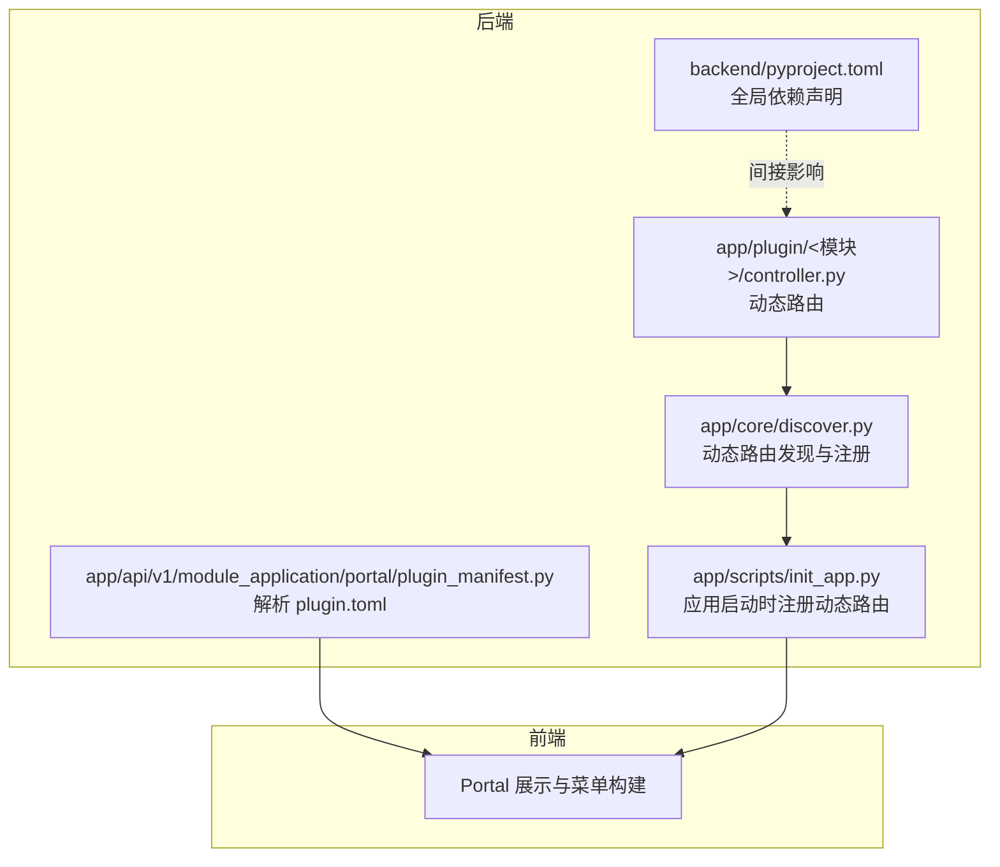
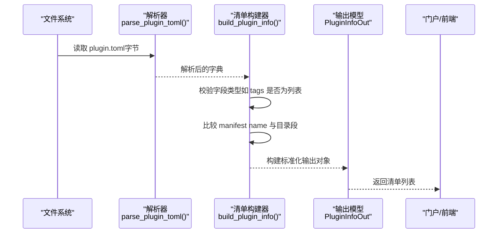
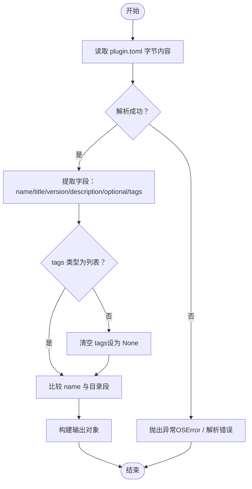
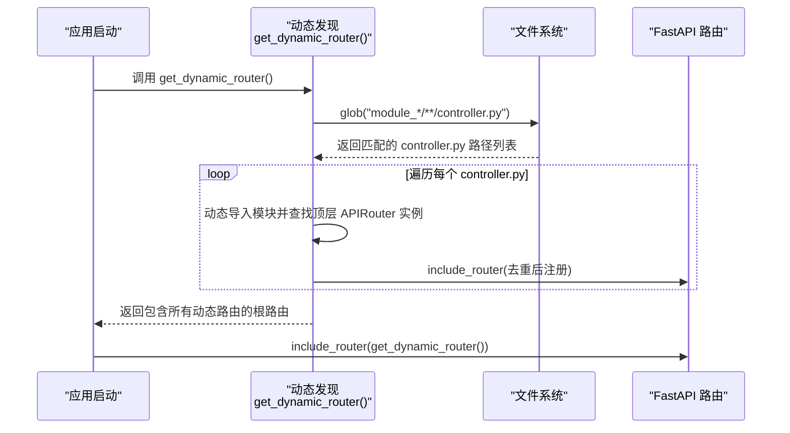
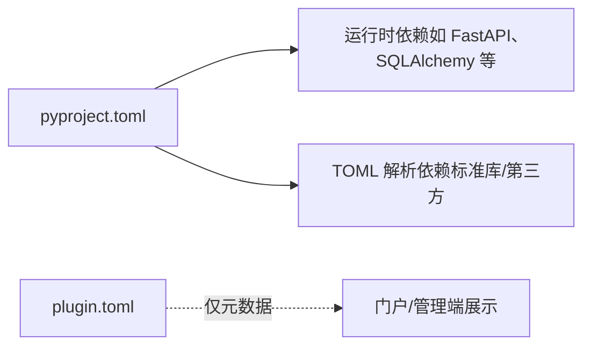

# 插件配置管理

<cite>
**本文引用的文件**
- [plugin_manifest.py](file://backend/app/api/v1/module_application/portal/plugin_manifest.py)
- [schema.py](file://backend/app/api/v1/module_application/portal/schema.py)
- [discover.py](file://backend/app/core/discover.py)
- [init_app.py](file://backend/app/scripts/init_app.py)
- [plugin.toml（示例）](file://backend/app/plugin/module_example/plugin.toml)
- [plugin.toml（AI）](file://backend/app/plugin/module_ai/plugin.toml)
- [plugin.toml（生成器）](file://backend/app/plugin/module_generator/plugin.toml)
- [plugin.toml（任务）](file://backend/app/plugin/module_task/plugin.toml)
- [pyproject.toml](file://backend/pyproject.toml)
- [controller.py（示例 demo）](file://backend/app/plugin/module_example/demo/controller.py)
- [controller.py（示例 demo01）](file://backend/app/plugin/module_example/demo01/controller.py)
</cite>

## 目录
1. [简介](#简介)
2. [项目结构](#项目结构)
3. [核心组件](#核心组件)
4. [架构总览](#架构总览)
5. [详细组件分析](#详细组件分析)
6. [依赖分析](#依赖分析)
7. [性能考虑](#性能考虑)
8. [故障排除指南](#故障排除指南)
9. [结论](#结论)
10. [附录](#附录)

## 简介
本文件系统化梳理 FastapiAdmin 后端的“插件配置管理”机制，重点围绕 plugin.toml 配置文件的结构、字段语义、解析流程、依赖管理策略以及可选性与条件加载的实现方式。文档旨在帮助开发者快速理解如何编写、校验与扩展插件配置，涵盖从配置项定义、解析与验证、到动态路由注册与前端展示的全链路。

## 项目结构
- 插件位于 backend/app/plugin 下，采用 module_* 的目录约定，每个模块可包含若干子模块（如 demo、demo01 等），并通过 controller.py 暴露 API 路由。
- 插件元数据通过可选的 plugin.toml 提供，用于门户展示、标签检索与可选性标识。
- 动态路由发现与注册在启动阶段执行，自动扫描 module_* 下的 controller.py 并注册 APIRouter 实例。
- 插件清单（包含 plugin.toml 解析结果）通过 Portal 接口对外输出，供前端与管理端使用。

**图示来源**
- [discover.py:62-167](file://backend/app/core/discover.py#L62-L167)
- [plugin_manifest.py:22-116](file://backend/app/api/v1/module_application/portal/plugin_manifest.py#L22-L116)
- [init_app.py:125-158](file://backend/app/scripts/init_app.py#L125-L158)
- [pyproject.toml:1-138](file://backend/pyproject.toml#L1-L138)

**章节来源**
- [discover.py:1-172](file://backend/app/core/discover.py#L1-L172)
- [plugin_manifest.py:1-116](file://backend/app/api/v1/module_application/portal/plugin_manifest.py#L1-L116)
- [init_app.py:125-158](file://backend/app/scripts/init_app.py#L125-L158)
- [pyproject.toml:1-138](file://backend/pyproject.toml#L1-L138)

## 核心组件
- plugin.toml 解析器：负责读取并解析 TOML 文件，提取插件元数据（name、title、version、description、optional、tags 等），并对字段进行基础校验（如 tags 类型）。
- 插件清单构建器：遍历 app/plugin 下的 module_* 目录，构建包含路由前缀、清单存在性、字段值及一致性校验的结果集。
- 动态路由发现与注册：扫描 module_* 下的 controller.py，自动注册 APIRouter 实例，支持多实例与去重。
- 启动集成：在应用启动时注册动态路由根容器，统一纳入 FastAPI 应用。

**章节来源**
- [plugin_manifest.py:11-116](file://backend/app/api/v1/module_application/portal/plugin_manifest.py#L11-L116)
- [discover.py:62-167](file://backend/app/core/discover.py#L62-L167)
- [init_app.py:125-158](file://backend/app/scripts/init_app.py#L125-L158)

## 架构总览
下面的序列图展示了从磁盘读取 plugin.toml 到最终在门户中呈现的完整流程。

**图示来源**
- [plugin_manifest.py:43-106](file://backend/app/api/v1/module_application/portal/plugin_manifest.py#L43-L106)
- [schema.py:55-69](file://backend/app/api/v1/module_application/portal/schema.py#L55-L69)

## 详细组件分析

### plugin.toml 配置文件结构与字段说明
- 文件位置：每个 module_* 目录下可选的 plugin.toml。
- 字段定义与语义：
  - name：字符串，建议与目录段保持一致（如 module_example 对应 name="example"）。用于门户展示与一致性校验。
  - title：字符串，插件显示标题。
  - version：字符串，语义为版本号。
  - description：字符串，简要描述。
  - optional：布尔值，语义为“是否可关闭该子系统”。当前实现中该字段用于门户展示与元数据标注，不直接参与运行时的动态路由开关。
  - tags：数组（列表）字符串，用于分类与检索。
- 依赖声明：plugin.toml 不用于声明运行时依赖。运行时依赖统一在项目根目录的 pyproject.toml 中声明，由包管理器（如 uv/pip）管理安装。

**章节来源**
- [plugin.toml（示例）:1-10](file://backend/app/plugin/module_example/plugin.toml#L1-L10)
- [plugin.toml（AI）:1-9](file://backend/app/plugin/module_ai/plugin.toml#L1-L9)
- [plugin.toml（生成器）:1-9](file://backend/app/plugin/module_generator/plugin.toml#L1-L9)
- [plugin.toml（任务）:1-9](file://backend/app/plugin/module_task/plugin.toml#L1-L9)
- [plugin_manifest.py:91-104](file://backend/app/api/v1/module_application/portal/plugin_manifest.py#L91-L104)
- [schema.py:55-69](file://backend/app/api/v1/module_application/portal/schema.py#L55-L69)
- [pyproject.toml:1-138](file://backend/pyproject.toml#L1-L138)

### 解析与校验流程
- 解析：根据 Python 版本选择标准库 tomllib 或第三方 tomli 进行 TOML 解析。
- 字段提取：读取 name、title、version、description、optional、tags。
- 类型校验：tags 必须为列表，否则视为无效。
- 一致性校验：当 manifest 中的 name 与目录段（module_xxx 去除前缀）不一致时，标记为 name_mismatch。
- 输出模型：标准化为 PluginInfoOut，包含 module_dir、route_prefix、has_manifest、name、title、version、description、optional、tags、manifest_name_mismatch。

**图示来源**
- [plugin_manifest.py:11-19](file://backend/app/api/v1/module_application/portal/plugin_manifest.py#L11-L19)
- [plugin_manifest.py:43-106](file://backend/app/api/v1/module_application/portal/plugin_manifest.py#L43-L106)

**章节来源**
- [plugin_manifest.py:11-116](file://backend/app/api/v1/module_application/portal/plugin_manifest.py#L11-L116)
- [schema.py:55-69](file://backend/app/api/v1/module_application/portal/schema.py#L55-L69)

### 可选性与条件加载机制
- 可选性字段：optional 为布尔值，用于表达“是否可关闭该子系统”的语义。当前实现中，该字段主要服务于门户展示与运维侧的元数据标注。
- 条件加载：动态路由注册并不受 optional 影响，而是依据目录结构与 controller.py 的存在与否进行发现与注册。因此，即使 optional=true，只要目录结构与文件命名满足规范，路由仍会被自动注册。
- 建议实践：若需要在运行时控制模块启停，应在业务层面增加开关（如配置中心或数据库标志位），并在启动流程中根据开关决定是否 include 对应的动态路由容器或执行初始化逻辑。

**章节来源**
- [plugin_manifest.py:91-104](file://backend/app/api/v1/module_application/portal/plugin_manifest.py#L91-L104)
- [discover.py:62-167](file://backend/app/core/discover.py#L62-L167)
- [init_app.py:125-158](file://backend/app/scripts/init_app.py#L125-L158)

### 动态路由注册与插件目录约定
- 目录约定：顶级目录必须以 module_ 开头，controller.py 必须位于该目录树的任意层级，且文件名严格为 controller.py。
- 路由前缀：module_xxx 自动映射为 /xxx。
- 多实例支持：controller.py 可定义多个 APIRouter 实例，均会被扫描并注册。
- 去重机制：通过比较 APIRouter 实例 ID 避免重复注册。
- 异常提示：针对 ModuleNotFoundError、ImportError、SyntaxError、PermissionError 等提供中文排查提示。

**图示来源**
- [discover.py:62-167](file://backend/app/core/discover.py#L62-L167)
- [init_app.py:125-158](file://backend/app/scripts/init_app.py#L125-L158)

**章节来源**
- [discover.py:1-172](file://backend/app/core/discover.py#L1-L172)
- [init_app.py:125-158](file://backend/app/scripts/init_app.py#L125-L158)

### 插件清单输出模型与门户展示
- 输出模型：PluginInfoOut 定义了门户所需的关键字段，包括模块目录名、路由前缀、清单存在性、各元数据字段以及 name 与目录段一致性标记。
- 用途：Portal 通过 list_plugin_infos() 获取清单列表，用于菜单生成、模块展示与运维检索。

**章节来源**
- [schema.py:55-69](file://backend/app/api/v1/module_application/portal/schema.py#L55-L69)
- [plugin_manifest.py:109-116](file://backend/app/api/v1/module_application/portal/plugin_manifest.py#L109-L116)

### 配置示例与最佳实践
- 简单插件（示例模块）：包含基本元数据与可选标签，便于门户展示与检索。
- 复杂插件（AI/生成器/任务）：包含更丰富的描述与标签，体现模块职责与能力边界。
- 带依赖的插件：依赖声明集中在 pyproject.toml，不在 plugin.toml 中体现。建议在插件开发文档中明确列出依赖项，以便运维与部署。

**章节来源**
- [plugin.toml（示例）:1-10](file://backend/app/plugin/module_example/plugin.toml#L1-L10)
- [plugin.toml（AI）:1-9](file://backend/app/plugin/module_ai/plugin.toml#L1-L9)
- [plugin.toml（生成器）:1-9](file://backend/app/plugin/module_generator/plugin.toml#L1-L9)
- [plugin.toml（任务）:1-9](file://backend/app/plugin/module_task/plugin.toml#L1-L9)
- [pyproject.toml:1-138](file://backend/pyproject.toml#L1-L138)

## 依赖分析
- 运行时依赖：统一在 pyproject.toml 中声明，包括 FastAPI、SQLAlchemy、Pydantic 等核心库，以及解析 TOML 的依赖（Python 3.11+ 使用标准库，低版本使用第三方库）。
- 插件依赖：plugin.toml 不用于声明运行时依赖；插件开发所需的第三方库应通过 pyproject.toml 管理。
- TOML 解析依赖：根据 Python 版本自动选择解析器，保证跨版本兼容。

**图示来源**
- [pyproject.toml:1-138](file://backend/pyproject.toml#L1-L138)
- [plugin_manifest.py:13-17](file://backend/app/api/v1/module_application/portal/plugin_manifest.py#L13-L17)

**章节来源**
- [pyproject.toml:1-138](file://backend/pyproject.toml#L1-L138)
- [plugin_manifest.py:11-19](file://backend/app/api/v1/module_application/portal/plugin_manifest.py#L11-L19)

## 性能考虑
- 动态路由扫描：glob 与动态导入在启动阶段执行，建议控制 module_* 数量与层级深度，避免过多 controller.py 导致启动时间增长。
- 去重与注册：通过 APIRouter 实例 ID 去重，减少重复 include_router 的开销。
- 前端路由注册：前端动态路由注册时会进行校验与去重，避免与静态壳层冲突的路径段被覆盖。

[本节为通用指导，不涉及具体文件分析]

## 故障排除指南
- 无法解析 plugin.toml
  - 现象：解析异常或返回错误。
  - 排查：确认 TOML 语法正确；检查 Python 版本对应的解析器可用性。
  - 参考：解析器选择与异常抛出逻辑。
- tags 非列表导致字段丢失
  - 现象：tags 在输出中为 None。
  - 排查：确保 tags 为数组（列表）格式。
- name 与目录段不一致
  - 现象：manifest_name_mismatch 标记为 True。
  - 排查：确保 manifest 中的 name 与 module_xxx 的 xxx 部分一致。
- 动态路由未注册
  - 现象：模块未出现在 /xxx 路由下。
  - 排查：确认目录名为 module_*、controller.py 存在且位于该目录树下、顶层定义 APIRouter 实例、无语法错误与导入异常。
- 导入失败提示
  - 现象：日志出现 ModuleNotFoundError/ImportError/SyntaxError/PermissionError 等提示。
  - 排查：检查缺失的 __init__.py、非法目录名、拼写不一致、循环导入、依赖未安装等问题。

**章节来源**
- [plugin_manifest.py:11-19](file://backend/app/api/v1/module_application/portal/plugin_manifest.py#L11-L19)
- [plugin_manifest.py:91-104](file://backend/app/api/v1/module_application/portal/plugin_manifest.py#L91-L104)
- [discover.py:33-59](file://backend/app/core/discover.py#L33-L59)
- [discover.py:145-149](file://backend/app/core/discover.py#L145-L149)

## 结论
- plugin.toml 专注于提供插件元数据与展示信息，不承担运行时依赖声明与可选性控制的职责。
- 动态路由注册与发现遵循严格的目录与文件命名规范，确保可维护性与可扩展性。
- 建议在插件开发中：
  - 保持 plugin.toml 字段完整且与目录段一致；
  - 将运行时依赖统一声明在 pyproject.toml；
  - 在业务层实现模块启停控制（如开关位），而非依赖 optional 字段。

[本节为总结性内容，不涉及具体文件分析]

## 附录

### 配置字段对照表
- name：字符串，建议与目录段一致，用于门户展示与一致性校验。
- title：字符串，插件显示标题。
- version：字符串，版本号。
- description：字符串，简要描述。
- optional：布尔值，语义为“是否可关闭该子系统”，主要用于门户展示。
- tags：数组（列表）字符串，用于分类与检索。

**章节来源**
- [schema.py:55-69](file://backend/app/api/v1/module_application/portal/schema.py#L55-L69)
- [plugin_manifest.py:91-104](file://backend/app/api/v1/module_application/portal/plugin_manifest.py#L91-L104)

### 目录与文件命名规范
- 顶级目录：module_*（如 module_example、module_ai、module_generator、module_task）。
- 控制器文件：controller.py（大小写敏感）。
- 路由前缀：module_xxx -> /xxx。
- 多实例 APIRouter：支持在 controller.py 中定义多个顶层 APIRouter 实例。

**章节来源**
- [discover.py:4-20](file://backend/app/core/discover.py#L4-L20)
- [controller.py（示例 demo）](file://backend/app/plugin/module_example/demo/controller.py#L19)
- [controller.py（示例 demo01）](file://backend/app/plugin/module_example/demo01/controller.py#L19)