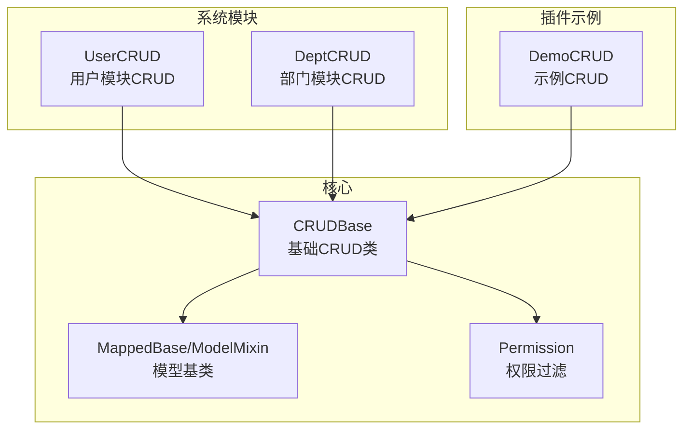
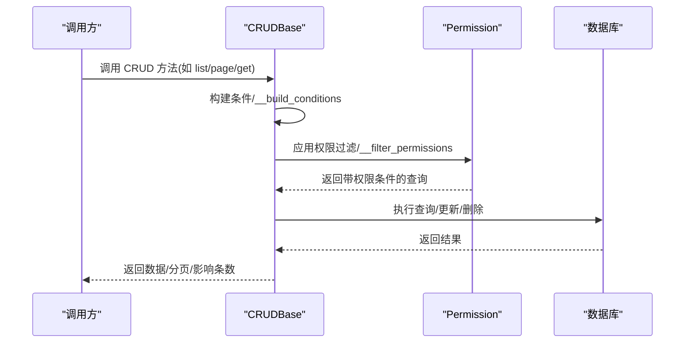
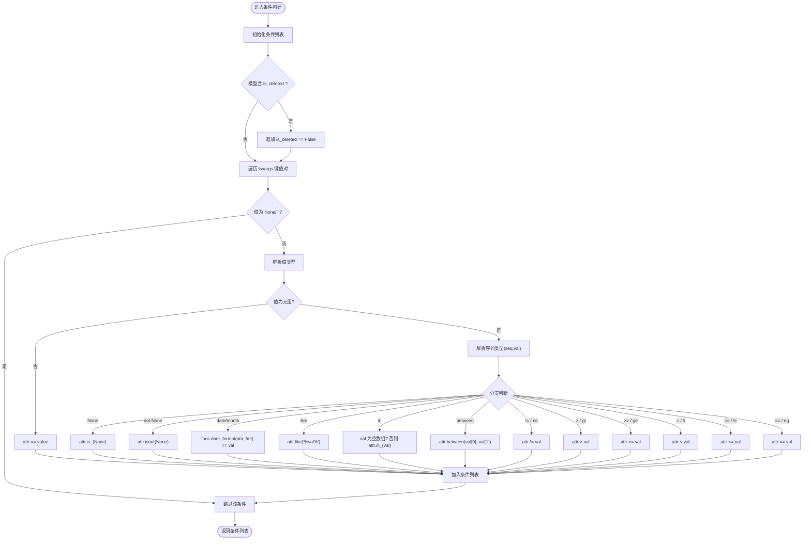
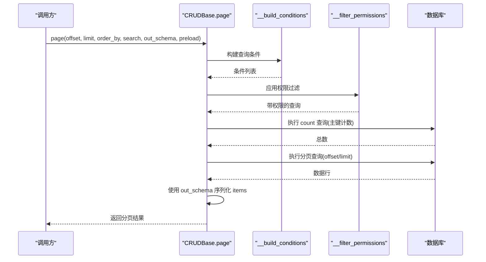
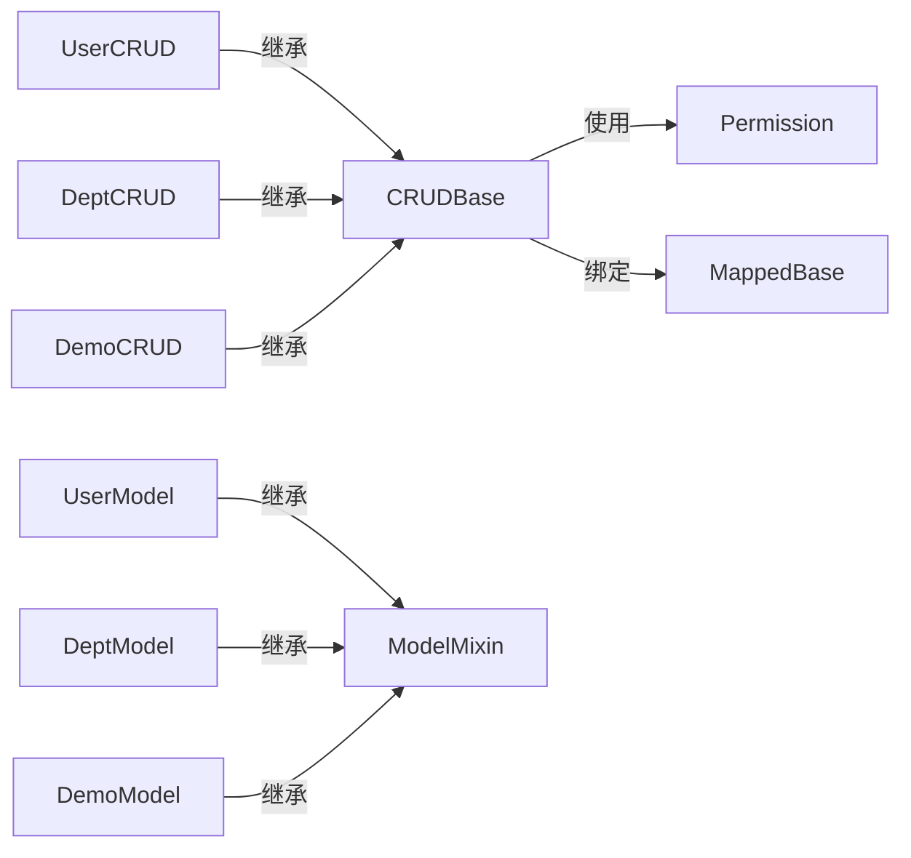

# CRUD 基础层

<cite>
**本文引用的文件**
- [backend/app/core/base_crud.py](file://backend/app/core/base_crud.py)
- [backend/app/core/base_model.py](file://backend/app/core/base_model.py)
- [backend/app/core/permission.py](file://backend/app/core/permission.py)
- [backend/app/api/v1/module_system/user/crud.py](file://backend/app/api/v1/module_system/user/crud.py)
- [backend/app/api/v1/module_system/dept/crud.py](file://backend/app/api/v1/module_system/dept/crud.py)
- [backend/app/api/v1/module_system/user/model.py](file://backend/app/api/v1/module_system/user/model.py)
- [backend/app/api/v1/module_system/dept/model.py](file://backend/app/api/v1/module_system/dept/model.py)
- [backend/app/plugin/module_example/demo/crud.py](file://backend/app/plugin/module_example/demo/crud.py)
- [backend/app/plugin/module_example/demo/model.py](file://backend/app/plugin/module_example/demo/model.py)
- [backend/app/plugin/module_example/demo/schema.py](file://backend/app/plugin/module_example/demo/schema.py)
</cite>

## 目录
1. [简介](#简介)
2. [项目结构](#项目结构)
3. [核心组件](#核心组件)
4. [架构总览](#架构总览)
5. [详细组件分析](#详细组件分析)
6. [依赖分析](#依赖分析)
7. [性能考量](#性能考量)
8. [故障排查指南](#故障排查指南)
9. [结论](#结论)
10. [附录](#附录)

## 简介
本文件系统性梳理 FastapiAdmin 的 CRUD 基础层设计与实现，重点围绕泛型类 CRUDBase 的设计理念、类型变量与 SQLAlchemy ORM 集成方式，以及核心 CRUD 方法（get、list、tree_list、page、create、update、delete、clear、set、restore）的实现细节。同时深入解析条件构建机制（__build_conditions）、排序处理（__order_by）、预加载优化（__loader_options）与权限过滤（__filter_permissions）。文档还对比软删除与硬删除的差异与实现，并提供基于真实模块的使用示例，说明如何继承 CRUDBase 并实现自定义数据访问层，以及与 BaseModel 的关系与在实际业务中的应用场景。

## 项目结构
CRUD 基础层位于后端核心目录，配合权限过滤与模型基类共同构成数据访问层基础设施。典型模块化的 CRUD 类通过继承 CRUDBase 并绑定具体模型与 Pydantic Schema，形成“模型-数据层-接口层”的清晰分层。

图示来源
- [backend/app/core/base_crud.py:26-571](file://backend/app/core/base_crud.py#L26-L571)
- [backend/app/core/base_model.py:21-228](file://backend/app/core/base_model.py#L21-L228)
- [backend/app/core/permission.py:13-311](file://backend/app/core/permission.py#L13-L311)
- [backend/app/api/v1/module_system/user/crud.py:18-221](file://backend/app/api/v1/module_system/user/crud.py#L18-L221)
- [backend/app/api/v1/module_system/dept/crud.py:10-110](file://backend/app/api/v1/module_system/dept/crud.py#L10-L110)
- [backend/app/plugin/module_example/demo/crud.py:10-136](file://backend/app/plugin/module_example/demo/crud.py#L10-L136)

章节来源
- [backend/app/core/base_crud.py:26-571](file://backend/app/core/base_crud.py#L26-L571)
- [backend/app/core/base_model.py:21-228](file://backend/app/core/base_model.py#L21-L228)
- [backend/app/core/permission.py:13-311](file://backend/app/core/permission.py#L13-L311)

## 核心组件
- CRUDBase 泛型类：提供统一的 CRUD 操作入口，内置条件构建、排序、预加载、权限过滤、软/硬删除等能力。
- MappedBase/ModelMixin：定义 ORM 基类与通用字段（如主键、状态、时间戳、软删除字段、审计字段等），支撑 CRUDBase 的默认行为。
- Permission：封装数据权限过滤策略，按模型策略动态追加 WHERE 条件，确保查询结果符合用户权限范围。
- 具体模块 CRUD：如 UserCRUD、DeptCRUD、DemoCRUD，继承 CRUDBase 并绑定对应模型与 Schema，提供业务语义化的数据访问方法。

章节来源
- [backend/app/core/base_crud.py:26-571](file://backend/app/core/base_crud.py#L26-L571)
- [backend/app/core/base_model.py:21-228](file://backend/app/core/base_model.py#L21-L228)
- [backend/app/core/permission.py:13-311](file://backend/app/core/permission.py#L13-L311)

## 架构总览
CRUDBase 作为数据访问层的抽象基座，向上承接控制器/服务层的调用，向下对接 SQLAlchemy ORM 与数据库。其内部通过类型变量约束模型与 Schema，结合权限过滤与预加载策略，保证查询的正确性、安全性与性能。

图示来源
- [backend/app/core/base_crud.py:43-214](file://backend/app/core/base_crud.py#L43-L214)
- [backend/app/core/permission.py:41-52](file://backend/app/core/permission.py#L41-L52)

## 详细组件分析

### CRUDBase 泛型类与类型变量
- 类型变量
  - ModelType：约束为 MappedBase 的子类，确保 ORM 能力与基类字段可用。
  - CreateSchemaType/UpdateSchemaType/OutSchemaType：分别约束为 Pydantic BaseModel 的子类，用于创建、更新与输出数据的类型安全。
- 设计要点
  - 通过 Generic[...] 将模型与 Schema 绑定，使 CRUD 方法在编译期具备更强的类型约束，降低运行期错误。
  - 以 AuthSchema 为上下文，贯穿权限过滤、审计字段填充、数据库会话等。

章节来源
- [backend/app/core/base_crud.py:20-42](file://backend/app/core/base_crud.py#L20-L42)
- [backend/app/core/base_model.py:21-38](file://backend/app/core/base_model.py#L21-L38)

### CRUD 方法实现概览
- get：按条件获取单个对象，支持预加载与权限过滤。
- list：按条件获取对象列表，默认按 id 升序，支持排序与预加载。
- tree_list：获取树形结构列表，自动合并模型默认预加载与 children 属性。
- page：分页查询，计算总数并返回 items、page_no、page_size、total、has_next。
- create：创建对象，自动填充 created_id/updated_id（若存在）。
- update：更新对象，二次权限确认，防止并发逃逸。
- delete：软删除或硬删除，依据模型是否具备软删除字段自动切换。
- clear：清空表（软清空或硬清空）。
- set：批量更新（仅限权限范围内的数据）。
- restore：恢复软删除对象（需模型支持软删除）。

章节来源
- [backend/app/core/base_crud.py:43-444](file://backend/app/core/base_crud.py#L43-L444)

### 条件构建机制：__build_conditions
- 默认行为：若模型具备 is_deleted 字段，自动追加“未删除”条件，避免误查已删除数据。
- 支持的查询语法：
  - 精确匹配：key=value
  - 空值判断：("None", ...)、("not None", ...)
  - 日期/月份匹配：("date", ...)、("month", ...)
  - 模糊匹配：("like", ...)
  - 包含/不在：("in", [...])；空数组生成恒假条件，避免全表扫描
  - 范围：("between", [a,b])
  - 比较：!=、>、>=、<、<=、== 或其别名（如 ne、gt、ge、lt、le、eq）
- 边界处理：
  - 值为 None 或空字符串时跳过条件，避免无效过滤。
  - 对空 "in" 列表生成 false() 条件，确保返回空集。

图示来源
- [backend/app/core/base_crud.py:453-512](file://backend/app/core/base_crud.py#L453-L512)

章节来源
- [backend/app/core/base_crud.py:453-512](file://backend/app/core/base_crud.py#L453-L512)

### 排序处理：__order_by
- 输入：order_by 为字段与方向的字典列表，如 [{"id":"asc"}, {"name":"desc"}]。
- 输出：返回对应的 SQLAlchemy 列排序表达式列表，支持 asc/desc。
- 异常：字段不存在时由 SQLAlchemy 抛错，CRUDBase 捕获并转换为统一异常。

章节来源
- [backend/app/core/base_crud.py:514-532](file://backend/app/core/base_crud.py#L514-L532)

### 预加载优化：__loader_options
- 默认加载：从模型的 __loader_options__ 获取默认预加载关系。
- 明确禁用：preload=[] 表示不使用任何预加载。
- 合并策略：将模型默认与传入 preload 合并去重，支持字符串关系名与 SQLAlchemy LoaderOption。
- 异步兼容：对字符串关系使用 selectinload，避免异步环境下的 MissingGreenlet 错误。
- 无效关系：若关系不存在则忽略，避免报错。

章节来源
- [backend/app/core/base_crud.py:534-570](file://backend/app/core/base_crud.py#L534-L570)

### 权限过滤：__filter_permissions
- 通过 Permission 类根据模型的 __permission_strategy__ 选择策略，追加 WHERE 条件。
- 支持策略：角色授权、部门关联、仅本人、用户绑定角色、通用数据范围等。
- 超级管理员豁免：is_superuser 为真时不限制。
- 与条件构建协同：先构建业务条件，再叠加权限条件，确保最终查询满足权限要求。

章节来源
- [backend/app/core/base_crud.py:446-451](file://backend/app/core/base_crud.py#L446-L451)
- [backend/app/core/permission.py:41-86](file://backend/app/core/permission.py#L41-L86)

### 软删除与硬删除
- 软删除判定：模型同时具备 is_deleted、deleted_time、deleted_id 字段时，delete/clear/set 按软删除逻辑执行；否则走硬删除。
- 软删除流程：
  - delete：将 is_deleted 置为 true，设置 deleted_time 与 deleted_id（若有当前用户），仅更新有权限的数据。
  - clear：对全表执行软删除。
  - restore：将 is_deleted 置为 false，清理 deleted_time/ deleted_id。
- 硬删除流程：
  - delete/clear：直接执行 delete 操作。
- 注意事项：
  - 条件构建默认排除已删除数据，软删除对象不会被常规查询返回。
  - restore 仅在模型支持软删除时可用。

章节来源
- [backend/app/core/base_crud.py:296-444](file://backend/app/core/base_crud.py#L296-L444)
- [backend/app/core/base_model.py:112-126](file://backend/app/core/base_model.py#L112-L126)

### 典型 CRUD 方法调用时序
以 page 为例，展示从调用到返回分页数据的完整流程。

图示来源
- [backend/app/core/base_crud.py:151-214](file://backend/app/core/base_crud.py#L151-L214)

### 与 BaseModel 的关系
- MappedBase：声明式 ORM 基类，统一异步属性、映射列与注释风格，兼容多数据库。
- ModelMixin：提供通用字段（id、uuid、status、时间戳、is_deleted 等），支撑分页、状态管理与软删除。
- UserMixin：提供审计字段 created_id/updated_id/deleted_id 与关联关系 created_by/updated_by/deleted_by，支撑“仅本人数据”等权限策略。
- 模型示例：
  - UserModel：继承 ModelMixin、TenantMixin、UserMixin，具备软删除与审计字段，定义多对多关系与树形字段。
  - DeptModel：继承 ModelMixin，设置 __permission_strategy__ 为 DEPT_BASED，支持部门维度的权限过滤。
  - DemoModel：示例模型，演示多种数据类型与默认预加载关系。

章节来源
- [backend/app/core/base_model.py:21-228](file://backend/app/core/base_model.py#L21-L228)
- [backend/app/api/v1/module_system/user/model.py:64-151](file://backend/app/api/v1/module_system/user/model.py#L64-L151)
- [backend/app/api/v1/module_system/dept/model.py:14-59](file://backend/app/api/v1/module_system/dept/model.py#L14-L59)
- [backend/app/plugin/module_example/demo/model.py:28-48](file://backend/app/plugin/module_example/demo/model.py#L28-L48)

### 使用示例：继承 CRUDBase 实现自定义数据访问层
- 系统模块示例
  - UserCRUD：继承 CRUDBase[UserModel, UserCreateSchema, UserUpdateSchema]，提供按 id/username/mobile 查询、列表查询、更新登录时间、设置可用状态、设置角色/岗位、修改/重置密码、注册等业务方法。
  - DeptCRUD：继承 CRUDBase[DeptModel, DeptCreateSchema, DeptUpdateSchema]，提供树形列表、设置可用状态、按 id 获取名称等。
- 插件示例
  - DemoCRUD：继承 CRUDBase[DemoModel, DemoCreateSchema, DemoUpdateSchema]，提供详情、列表、创建、更新、批量设置状态、分页查询等。

章节来源
- [backend/app/api/v1/module_system/user/crud.py:18-221](file://backend/app/api/v1/module_system/user/crud.py#L18-L221)
- [backend/app/api/v1/module_system/dept/crud.py:10-110](file://backend/app/api/v1/module_system/dept/crud.py#L10-L110)
- [backend/app/plugin/module_example/demo/crud.py:10-136](file://backend/app/plugin/module_example/demo/crud.py#L10-L136)

### 与 BaseModel 的关系及在业务中的应用
- 关系映射
  - CRUDBase 通过类型变量绑定模型，确保 ORM 字段与默认行为（如软删除、审计字段）可用。
  - 权限过滤依赖模型的 __permission_strategy__ 与审计字段 created_id，实现“仅本人数据”、“部门范围”等策略。
- 典型场景
  - 用户管理：UserCRUD 结合 UserModel 的 created_id 与角色数据范围，实现“仅本人数据”或“部门及以下”等权限控制。
  - 部门树形：DeptCRUD 使用 tree_list，自动合并模型默认预加载与 children 关系，提升树形查询效率。
  - 示例表：DemoCRUD 展示了分页、批量设置状态、预加载等常见 CRUD 场景。

章节来源
- [backend/app/core/base_crud.py:446-451](file://backend/app/core/base_crud.py#L446-L451)
- [backend/app/core/permission.py:174-247](file://backend/app/core/permission.py#L174-L247)
- [backend/app/api/v1/module_system/dept/model.py:22](file://backend/app/api/v1/module_system/dept/model.py#L22)

## 依赖分析
CRUDBase 与权限过滤、模型基类之间的耦合度低，内聚性强；具体模块 CRUD 仅依赖 CRUDBase 与对应模型/Schema，职责清晰。

图示来源
- [backend/app/core/base_crud.py:26-571](file://backend/app/core/base_crud.py#L26-L571)
- [backend/app/core/permission.py:13-311](file://backend/app/core/permission.py#L13-L311)
- [backend/app/core/base_model.py:21-228](file://backend/app/core/base_model.py#L21-L228)
- [backend/app/api/v1/module_system/user/crud.py:18](file://backend/app/api/v1/module_system/user/crud.py#L18)
- [backend/app/api/v1/module_system/dept/crud.py:10](file://backend/app/api/v1/module_system/dept/crud.py#L10)
- [backend/app/plugin/module_example/demo/crud.py:10](file://backend/app/plugin/module_example/demo/crud.py#L10)

章节来源
- [backend/app/core/base_crud.py:26-571](file://backend/app/core/base_crud.py#L26-L571)
- [backend/app/core/permission.py:13-311](file://backend/app/core/permission.py#L13-L311)
- [backend/app/core/base_model.py:21-228](file://backend/app/core/base_model.py#L21-L228)

## 性能考量
- 分页计数优化：优先使用主键列进行 count，避免全表扫描；若无主键则回退为 count(*)。
- 预加载策略：默认使用 selectinload，减少 N+1 查询风险；可通过 __loader_options__ 与传入 preload 精细控制。
- 条件构建：对空 "in" 数组生成 false() 条件，避免退化为全量查询。
- 权限过滤：在查询构建阶段一次性追加 WHERE 条件，减少后续处理成本。
- 软删除：通过 is_deleted 字段快速过滤，避免扫描大量历史数据。

章节来源
- [backend/app/core/base_crud.py:186-201](file://backend/app/core/base_crud.py#L186-L201)
- [backend/app/core/base_crud.py:534-570](file://backend/app/core/base_crud.py#L534-L570)
- [backend/app/core/base_crud.py:472-495](file://backend/app/core/base_crud.py#L472-L495)

## 故障排查指南
- 查询失败
  - 现象：get/list/tree_list/page 抛出统一异常。
  - 排查：检查条件构建（空值/空 in 数组）、排序字段是否存在、权限策略是否正确。
- 删除失败
  - 现象：delete/clear/restore 抛出异常。
  - 排查：确认模型是否具备软删除字段；批量操作是否仅作用于有权限的数据；复合主键不支持批量操作。
- 更新失败
  - 现象：update 抛出“对象不存在或无权限访问”。
  - 排查：并发修改导致权限变化；二次验证失败；检查 created_id/updated_id 是否正确设置。
- 权限逃逸
  - 现象：越权看到其他用户数据。
  - 排查：确认 __permission_strategy__ 设置；用户角色与数据范围；dept_id/created_id 关系是否正确。

章节来源
- [backend/app/core/base_crud.py:69-70](file://backend/app/core/base_crud.py#L69-L70)
- [backend/app/core/base_crud.py:102-103](file://backend/app/core/base_crud.py#L102-L103)
- [backend/app/core/base_crud.py:148-149](file://backend/app/core/base_crud.py#L148-L149)
- [backend/app/core/base_crud.py:213-214](file://backend/app/core/base_crud.py#L213-L214)
- [backend/app/core/base_crud.py:294-295](file://backend/app/core/base_crud.py#L294-L295)
- [backend/app/core/base_crud.py:337-338](file://backend/app/core/base_crud.py#L337-L338)
- [backend/app/core/base_crud.py:403-404](file://backend/app/core/base_crud.py#L403-L404)
- [backend/app/core/base_crud.py:442-444](file://backend/app/core/base_crud.py#L442-L444)
- [backend/app/core/base_crud.py:287-290](file://backend/app/core/base_crud.py#L287-L290)
- [backend/app/core/permission.py:41-52](file://backend/app/core/permission.py#L41-L52)

## 结论
CRUDBase 通过类型安全的泛型设计、完善的条件构建与排序、高效的预加载与权限过滤，以及对软/硬删除的统一处理，形成了稳定、可扩展、易维护的 CRUD 基础层。结合 MappedBase/ModelMixin 的通用字段与关系，开发者只需专注于业务 Schema 与模块 CRUD 的适配，即可快速搭建高质量的数据访问层。建议在新模块中遵循现有模式：继承 CRUDBase、绑定模型与 Schema、合理设置 __loader_options__ 与 __permission_strategy__，并在需要时扩展软删除字段以获得更好的数据治理能力。

## 附录
- 业务模型字段参考
  - ModelMixin：id、uuid、status、description、created_time、updated_time、is_deleted、deleted_time。
  - UserMixin：created_id、updated_id、deleted_id 与 created_by/updated_by/deleted_by 关系。
  - 示例 Schema：DemoCreateSchema/DemoUpdateSchema/DemoOutSchema，涵盖常用字段与校验规则。
- 权限策略参考
  - PermissionFilterStrategy：DATA_SCOPE、ROLE_BASED、DEPT_BASED、SELF_ONLY、USER_ROLE 等，模型可通过 __permission_strategy__ 选择。

章节来源
- [backend/app/core/base_model.py:70-182](file://backend/app/core/base_model.py#L70-L182)
- [backend/app/plugin/module_example/demo/schema.py:17-125](file://backend/app/plugin/module_example/demo/schema.py#L17-L125)
- [backend/app/core/permission.py:20-86](file://backend/app/core/permission.py#L20-L86)