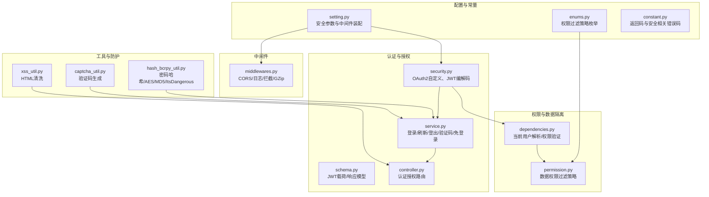
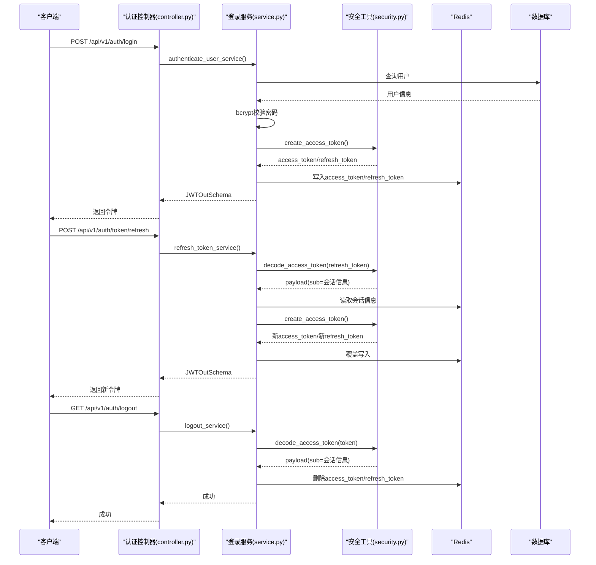
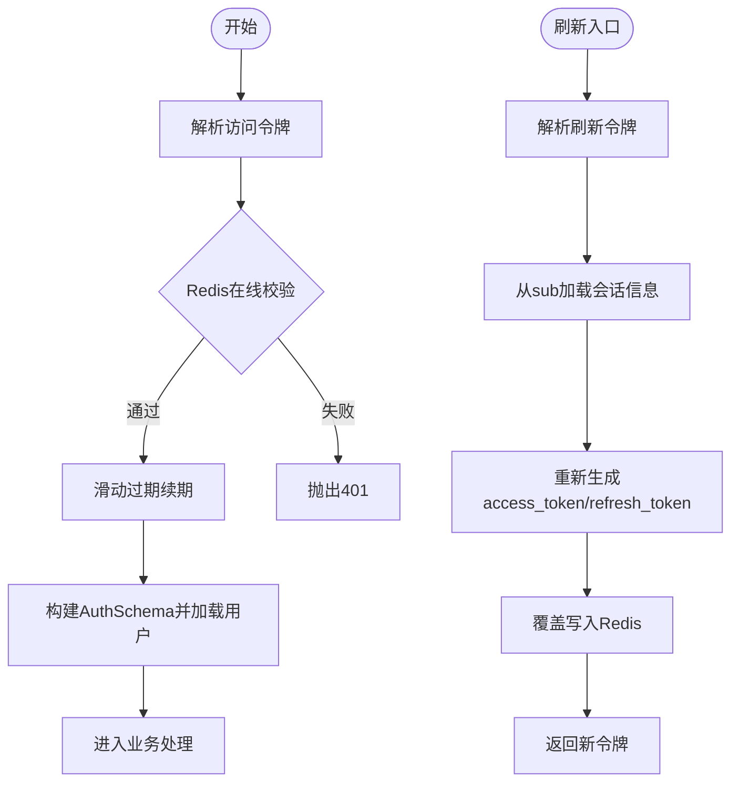
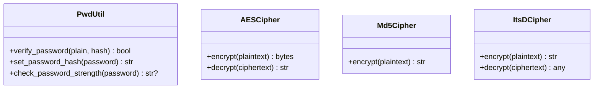
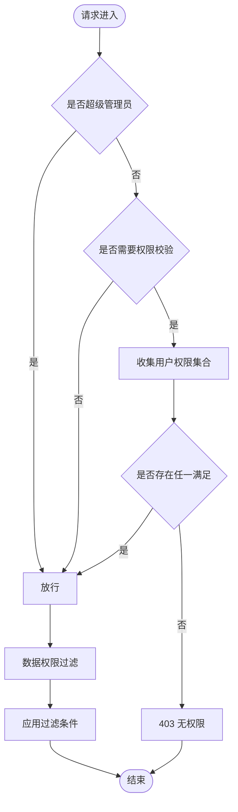
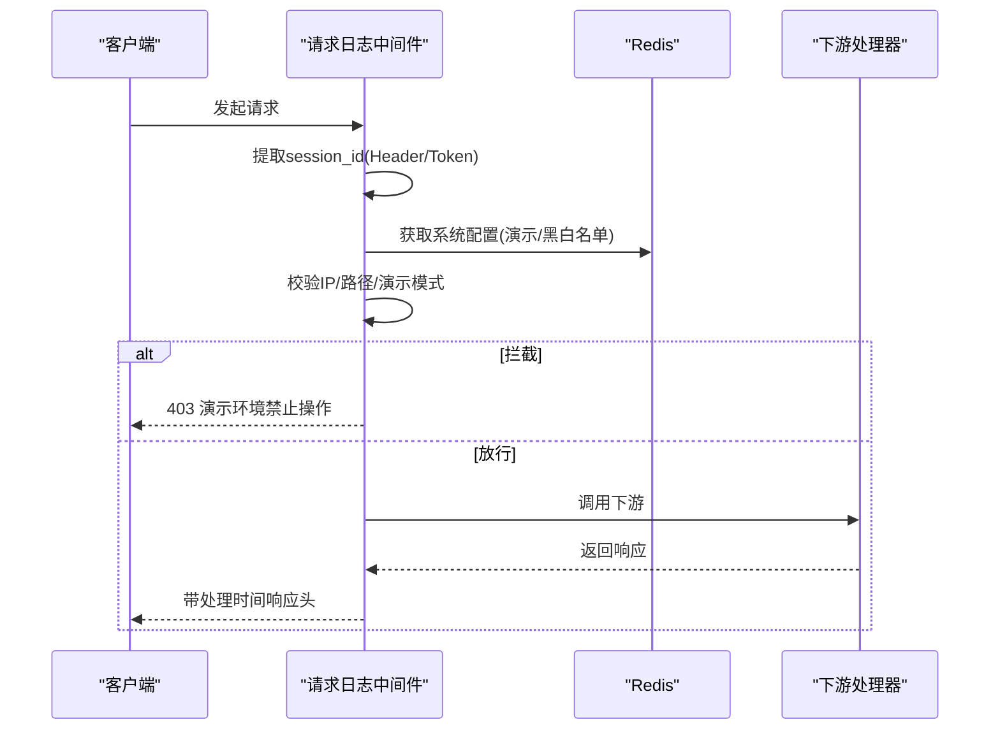
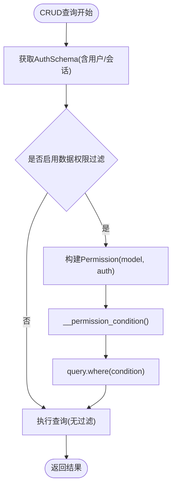
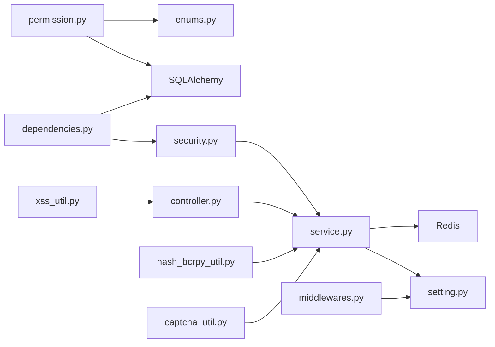

# 安全系统组件

<cite>
**本文引用的文件**
- [security.py](file://backend/app/core/security.py)
- [middlewares.py](file://backend/app/core/middlewares.py)
- [permission.py](file://backend/app/core/permission.py)
- [setting.py](file://backend/app/config/setting.py)
- [schema.py](file://backend/app/api/v1/module_system/auth/schema.py)
- [controller.py](file://backend/app/api/v1/module_system/auth/controller.py)
- [service.py](file://backend/app/api/v1/module_system/auth/service.py)
- [dependencies.py](file://backend/app/core/dependencies.py)
- [enums.py](file://backend/app/common/enums.py)
- [hash_bcrpy_util.py](file://backend/app/utils/hash_bcrpy_util.py)
- [xss_util.py](file://backend/app/utils/xss_util.py)
- [captcha_util.py](file://backend/app/utils/captcha_util.py)
- [constant.py](file://backend/app/common/constant.py)
</cite>

## 目录
1. [简介](#简介)
2. [项目结构](#项目结构)
3. [核心组件](#核心组件)
4. [架构总览](#架构总览)
5. [详细组件分析](#详细组件分析)
6. [依赖分析](#依赖分析)
7. [性能考虑](#性能考虑)
8. [故障排查指南](#故障排查指南)
9. [结论](#结论)
10. [附录](#附录)

## 简介
本文件面向 FastapiAdmin 的安全系统组件，围绕以下目标展开：
- JWT 令牌的生成、验证与刷新机制，覆盖密钥管理、过期时间与安全策略
- 密码加密算法的选择与实现，涵盖哈希算法、盐值生成与安全存储
- RBAC 权限控制模型，包括角色分配、权限矩阵与动态权限计算
- 中间件体系，包括认证中间件、权限中间件与审计中间件
- 安全最佳实践，包括 CSRF 防护、XSS 防护与 SQL 注入防护
- 在 CRUD 操作中集成权限验证与细粒度数据权限控制

## 项目结构
安全相关能力主要分布在如下模块：
- 配置与常量：系统安全参数、Redis键名、返回码等
- 认证与授权：JWT 生成/解析、登录/刷新/登出、验证码、免登录
- 中间件：CORS、请求日志与拦截、GZip
- 权限与数据隔离：基于角色/部门/自定义的数据权限过滤
- 工具与防护：密码哈希、XSS 清洗、验证码生成

**图表来源**
- [setting.py:227-241](file://backend/app/config/setting.py#L227-L241)
- [security.py:95-149](file://backend/app/core/security.py#L95-L149)
- [schema.py:9-93](file://backend/app/api/v1/module_system/auth/schema.py#L9-L93)
- [service.py:45-576](file://backend/app/api/v1/module_system/auth/service.py#L45-L576)
- [controller.py:38-349](file://backend/app/api/v1/module_system/auth/controller.py#L38-L349)
- [middlewares.py:22-215](file://backend/app/core/middlewares.py#L22-L215)
- [dependencies.py:44-296](file://backend/app/core/dependencies.py#L44-L296)
- [permission.py:13-311](file://backend/app/core/permission.py#L13-L311)
- [hash_bcrpy_util.py:13-208](file://backend/app/utils/hash_bcrpy_util.py#L13-L208)
- [xss_util.py:1-159](file://backend/app/utils/xss_util.py#L1-L159)
- [captcha_util.py:11-139](file://backend/app/utils/captcha_util.py#L11-L139)
- [enums.py:111-122](file://backend/app/common/enums.py#L111-L122)
- [constant.py:7-213](file://backend/app/common/constant.py#L7-L213)

**章节来源**
- [setting.py:227-241](file://backend/app/config/setting.py#L227-L241)
- [middlewares.py:22-215](file://backend/app/core/middlewares.py#L22-L215)
- [security.py:95-149](file://backend/app/core/security.py#L95-L149)
- [dependencies.py:44-296](file://backend/app/core/dependencies.py#L44-L296)
- [permission.py:13-311](file://backend/app/core/permission.py#L13-L311)
- [hash_bcrpy_util.py:13-208](file://backend/app/utils/hash_bcrpy_util.py#L13-L208)
- [xss_util.py:1-159](file://backend/app/utils/xss_util.py#L1-L159)
- [captcha_util.py:11-139](file://backend/app/utils/captcha_util.py#L11-L139)
- [enums.py:111-122](file://backend/app/common/enums.py#L111-L122)
- [constant.py:7-213](file://backend/app/common/constant.py#L7-L213)

## 核心组件
- JWT 与认证
  - 自定义 OAuth2 密码流与令牌解析，支持滑动过期与在线校验
  - 登录/刷新/登出流程，结合 Redis 存储与过期策略
- 密码与加密
  - bcrypt 哈希、轮数配置与强度校验
  - AES/MD5/ItsDangerous 多种加密工具，用于不同场景
- RBAC 权限
  - 基于角色的菜单/资源授权，动态权限集合计算
  - 数据权限过滤策略：按角色、部门、自定义、仅本人等
- 中间件体系
  - CORS、请求日志与拦截、GZip 压缩
  - 演示模式下的 IP 白名单/黑名单与路径白名单控制
- 安全防护
  - XSS 清洗、验证码、SQL 注入防护建议

**章节来源**
- [security.py:95-149](file://backend/app/core/security.py#L95-L149)
- [service.py:45-576](file://backend/app/api/v1/module_system/auth/service.py#L45-L576)
- [dependencies.py:44-296](file://backend/app/core/dependencies.py#L44-L296)
- [permission.py:13-311](file://backend/app/core/permission.py#L13-L311)
- [middlewares.py:22-215](file://backend/app/core/middlewares.py#L22-L215)
- [hash_bcrpy_util.py:13-208](file://backend/app/utils/hash_bcrpy_util.py#L13-L208)
- [xss_util.py:1-159](file://backend/app/utils/xss_util.py#L1-L159)
- [captcha_util.py:11-139](file://backend/app/utils/captcha_util.py#L11-L139)

## 架构总览
下面的序列图展示了登录、刷新与登出的端到端流程，以及中间件在请求生命周期中的作用。

**图表来源**
- [controller.py:41-171](file://backend/app/api/v1/module_system/auth/controller.py#L41-L171)
- [service.py:48-338](file://backend/app/api/v1/module_system/auth/service.py#L48-L338)
- [security.py:98-149](file://backend/app/core/security.py#L98-L149)
- [middlewares.py:87-199](file://backend/app/core/middlewares.py#L87-L199)

## 详细组件分析

### JWT 令牌生成、验证与刷新
- 生成
  - 会话信息（包含 session_id、用户标识、登录地点、设备等）作为 sub 字段
  - 使用配置的 SECRET_KEY 与 ALGORITHM 生成 access_token 与 refresh_token
- 验证
  - 通过 decode_access_token 解析并校验签名、过期时间
  - 通过 Redis 中的 ACCESS_TOKEN 键确认在线状态
  - 支持滑动过期：每次访问自动延长过期时间
- 刷新
  - 仅允许使用 refresh_token 进行刷新
  - 从 payload.sub 中解析会话信息，重新签发新令牌并覆盖写入 Redis
- 登出
  - 使用 access_token 解析会话信息，删除 Redis 中对应键

**图表来源**
- [security.py:116-149](file://backend/app/core/security.py#L116-L149)
- [dependencies.py:44-129](file://backend/app/core/dependencies.py#L44-L129)
- [service.py:222-338](file://backend/app/api/v1/module_system/auth/service.py#L222-L338)

**章节来源**
- [security.py:98-149](file://backend/app/core/security.py#L98-L149)
- [dependencies.py:44-129](file://backend/app/core/dependencies.py#L44-L129)
- [service.py:127-338](file://backend/app/api/v1/module_system/auth/service.py#L127-L338)
- [setting.py:67-74](file://backend/app/config/setting.py#L67-L74)

### 密码加密与安全存储
- 算法与轮数
  - 使用 bcrypt，轮数为 12，提升抗暴力破解能力
- 强度校验
  - 长度、大小写、数字要求
- 存储
  - 仅存储哈希值，不存储明文或盐值
- 其他加密工具
  - AES：CBC 模式，PKCS7 填充，随机 IV
  - MD5：仅用于降级场景
  - ItsDangerous：URL 安全序列化，失败时降级为 MD5

**图表来源**
- [hash_bcrpy_util.py:13-208](file://backend/app/utils/hash_bcrpy_util.py#L13-L208)

**章节来源**
- [hash_bcrpy_util.py:13-73](file://backend/app/utils/hash_bcrpy_util.py#L13-L73)
- [hash_bcrpy_util.py:75-208](file://backend/app/utils/hash_bcrpy_util.py#L75-L208)

### RBAC 权限控制模型
- 角色与权限
  - 用户拥有多个角色，每个角色关联菜单，菜单带权限标识
  - 权限集合为所有角色授权菜单权限的并集
- 授权判定
  - 支持通配符“*”或“*:*:*”
  - 任一所需权限满足即通过
- 数据权限过滤策略
  - 策略枚举：按数据范围、角色授权、部门关联、仅本人、当前用户绑定角色
  - 超级管理员绕过数据权限
  - 未启用角色时默认仅本人可见
  - 自定义部门权限与本部门/下级部门组合

**图表来源**
- [dependencies.py:236-296](file://backend/app/core/dependencies.py#L236-L296)
- [permission.py:13-311](file://backend/app/core/permission.py#L13-L311)
- [enums.py:111-122](file://backend/app/common/enums.py#L111-L122)

**章节来源**
- [dependencies.py:236-296](file://backend/app/core/dependencies.py#L236-L296)
- [permission.py:13-311](file://backend/app/core/permission.py#L13-L311)
- [enums.py:111-122](file://backend/app/common/enums.py#L111-L122)

### 中间件系统架构
- CORS 中间件：按配置允许来源、方法、头与凭据
- 请求日志与拦截中间件
  - 提取 session_id 并记录请求/响应信息
  - 支持演示模式：非 GET 请求在黑名单或未命中白名单时拦截
  - IP 黑名单优先，其次白名单与演示模式
- GZip 中间件：按最小压缩大小与压缩级别配置

**图表来源**
- [middlewares.py:36-215](file://backend/app/core/middlewares.py#L36-L215)
- [setting.py:227-241](file://backend/app/config/setting.py#L227-L241)

**章节来源**
- [middlewares.py:22-215](file://backend/app/core/middlewares.py#L22-L215)
- [setting.py:227-241](file://backend/app/config/setting.py#L227-L241)

### 安全最佳实践
- CSRF 防护
  - 使用 SameSite Cookie 与后端校验 Referer/Header
  - 重要操作采用二次确认与验证码
- XSS 防护
  - 使用 bleach 对富文本进行白名单清洗
  - 提供仅标签剥离与样式清洗两种策略
- SQL 注入防护
  - 使用 ORM（SQLAlchemy）与参数化查询
  - 数据权限过滤通过 SQLAlchemy 查询构造器拼接，避免字符串拼接
- 其他
  - 强密码策略与定期轮换
  - 传输加密（HTTPS）、最小权限原则、审计日志

**章节来源**
- [xss_util.py:1-159](file://backend/app/utils/xss_util.py#L1-L159)
- [permission.py:41-52](file://backend/app/core/permission.py#L41-L52)
- [captcha_util.py:11-139](file://backend/app/utils/captcha_util.py#L11-L139)

### CRUD 中的权限验证与数据权限
- 权限验证
  - 通过 AuthPermission 依赖注入，自动完成用户解析与权限校验
- 数据权限
  - 在查询前调用 Permission.filter_query，按策略追加 WHERE 条件
  - 支持多策略组合：角色授权、部门范围、自定义部门、仅本人

**图表来源**
- [dependencies.py:236-296](file://backend/app/core/dependencies.py#L236-L296)
- [permission.py:41-86](file://backend/app/core/permission.py#L41-L86)

**章节来源**
- [dependencies.py:236-296](file://backend/app/core/dependencies.py#L236-L296)
- [permission.py:13-311](file://backend/app/core/permission.py#L13-L311)

## 依赖分析
- 组件耦合
  - 认证服务依赖安全工具与 Redis；权限验证依赖用户模型与角色菜单
  - 数据权限过滤依赖模型元数据与部门树工具
- 外部依赖
  - Redis 用于令牌与验证码存储、演示配置
  - SQLAlchemy 用于 ORM 查询与数据权限过滤
- 循环依赖
  - 未发现循环导入；各模块职责清晰

**图表来源**
- [security.py:95-149](file://backend/app/core/security.py#L95-L149)
- [service.py:45-576](file://backend/app/api/v1/module_system/auth/service.py#L45-L576)
- [dependencies.py:44-296](file://backend/app/core/dependencies.py#L44-L296)
- [permission.py:13-311](file://backend/app/core/permission.py#L13-L311)
- [enums.py:111-122](file://backend/app/common/enums.py#L111-L122)
- [controller.py:38-349](file://backend/app/api/v1/module_system/auth/controller.py#L38-L349)
- [middlewares.py:22-215](file://backend/app/core/middlewares.py#L22-L215)
- [xss_util.py:1-159](file://backend/app/utils/xss_util.py#L1-L159)
- [hash_bcrpy_util.py:13-208](file://backend/app/utils/hash_bcrpy_util.py#L13-L208)
- [captcha_util.py:11-139](file://backend/app/utils/captcha_util.py#L11-L139)
- [setting.py:67-74](file://backend/app/config/setting.py#L67-L74)

**章节来源**
- [security.py:95-149](file://backend/app/core/security.py#L95-L149)
- [service.py:45-576](file://backend/app/api/v1/module_system/auth/service.py#L45-L576)
- [dependencies.py:44-296](file://backend/app/core/dependencies.py#L44-L296)
- [permission.py:13-311](file://backend/app/core/permission.py#L13-L311)
- [enums.py:111-122](file://backend/app/common/enums.py#L111-L122)
- [controller.py:38-349](file://backend/app/api/v1/module_system/auth/controller.py#L38-L349)
- [middlewares.py:22-215](file://backend/app/core/middlewares.py#L22-L215)
- [xss_util.py:1-159](file://backend/app/utils/xss_util.py#L1-L159)
- [hash_bcrpy_util.py:13-208](file://backend/app/utils/hash_bcrpy_util.py#L13-L208)
- [captcha_util.py:11-139](file://backend/app/utils/captcha_util.py#L11-L139)
- [setting.py:67-74](file://backend/app/config/setting.py#L67-L74)

## 性能考虑
- 令牌滑动过期
  - 每次访问更新 Redis 过期时间，减少无效令牌占用
- 数据权限过滤
  - 通过策略模式与 SQLAlchemy 查询拼接，避免不必要的数据扫描
- 中间件顺序
  - CORS 在最外层，日志与拦截在中间，GZip 在内层，减少下游压力
- 压缩与缓存
  - GZip 压缩阈值与级别可调，验证码与令牌使用 Redis 缓存

[本节为通用指导，无需特定文件引用]

## 故障排查指南
- 401 未认证
  - 检查 Authorization 头、Bearer 前缀、令牌是否过期
  - 确认 Redis 中 ACCESS_TOKEN 键是否存在
- 403 无权限
  - 检查用户角色与菜单权限是否启用
  - 确认权限标识是否正确，是否使用通配符
- 数据看不到
  - 检查数据权限策略与用户部门范围
  - 确认是否启用数据权限过滤
- 验证码问题
  - 检查验证码是否过期、大小写忽略
  - 确认 Redis 中验证码键是否存在

**章节来源**
- [dependencies.py:44-129](file://backend/app/core/dependencies.py#L44-L129)
- [constant.py:57-87](file://backend/app/common/constant.py#L57-L87)
- [service.py:340-417](file://backend/app/api/v1/module_system/auth/service.py#L340-L417)
- [permission.py:13-311](file://backend/app/core/permission.py#L13-L311)

## 结论
FastapiAdmin 的安全体系以 JWT 为核心，结合 Redis 在线校验与滑动过期，形成完整的认证与会话管理；RBAC 权限模型与多策略数据权限过滤确保了细粒度的资源与数据访问控制；中间件体系提供了跨域、审计与性能优化能力；配合密码哈希、XSS 清洗与验证码等工具，整体具备良好的安全性与可维护性。

[本节为总结性内容，无需特定文件引用]

## 附录
- 配置要点
  - SECRET_KEY、ALGORITHM、ACCESS_TOKEN_EXPIRE_MINUTES、REFRESH_TOKEN_EXPIRE_MINUTES
  - CORS 允许项、GZip 配置、演示模式开关与黑白名单
- 常用错误码
  - 令牌相关：无效令牌、过期令牌
  - 权限相关：无效权限、访问受限
  - 会话安全：无效会话、签名错误

**章节来源**
- [setting.py:67-74](file://backend/app/config/setting.py#L67-L74)
- [constant.py:57-87](file://backend/app/common/constant.py#L57-L87)