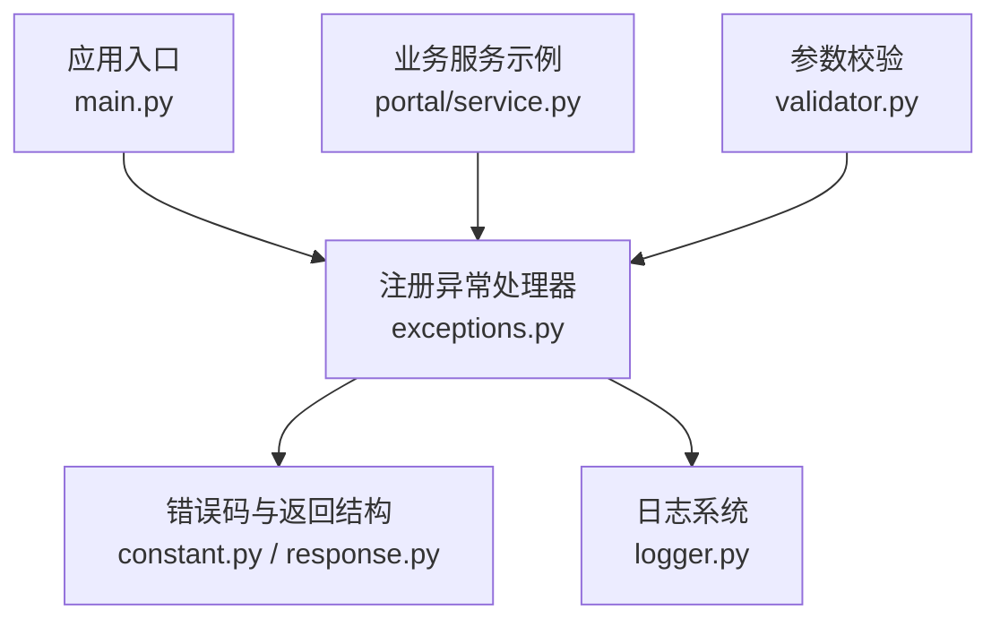
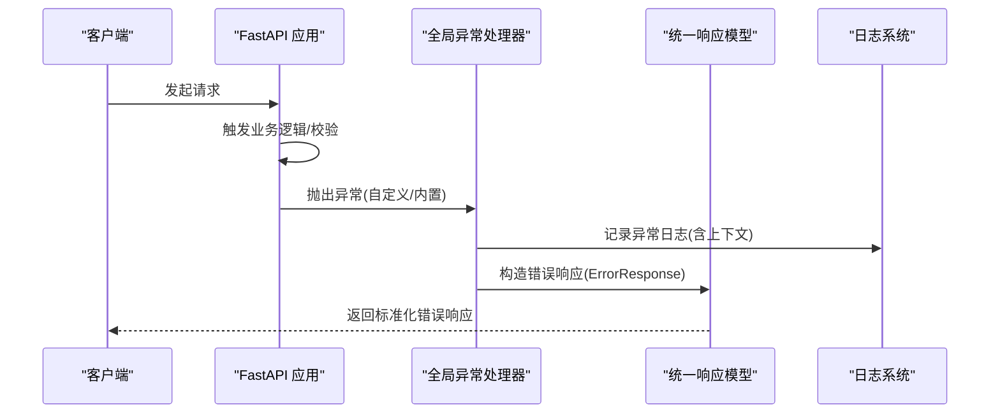
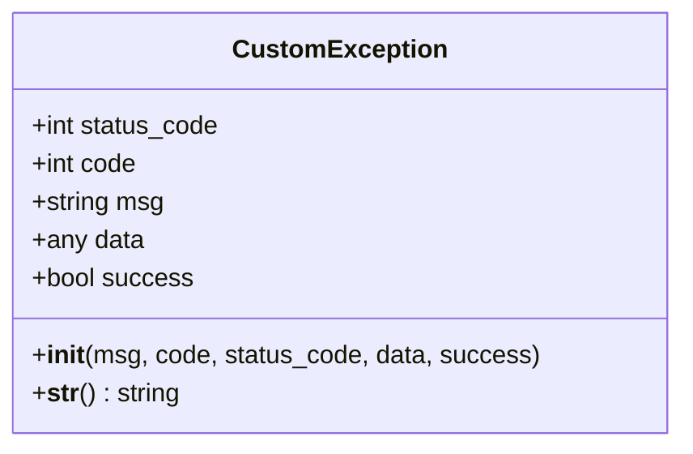
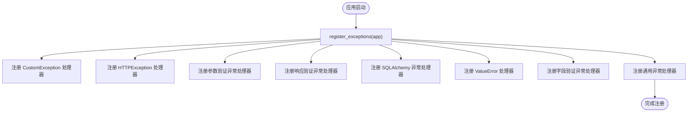
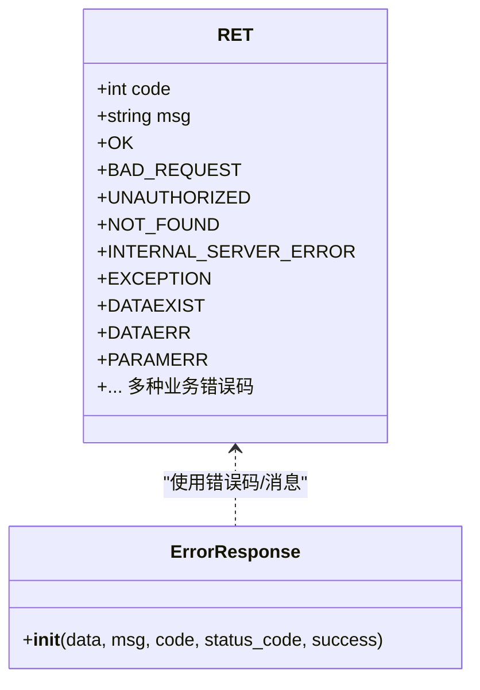
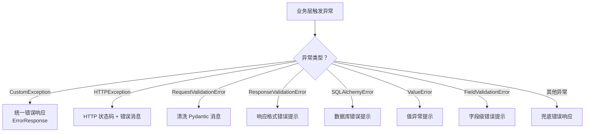
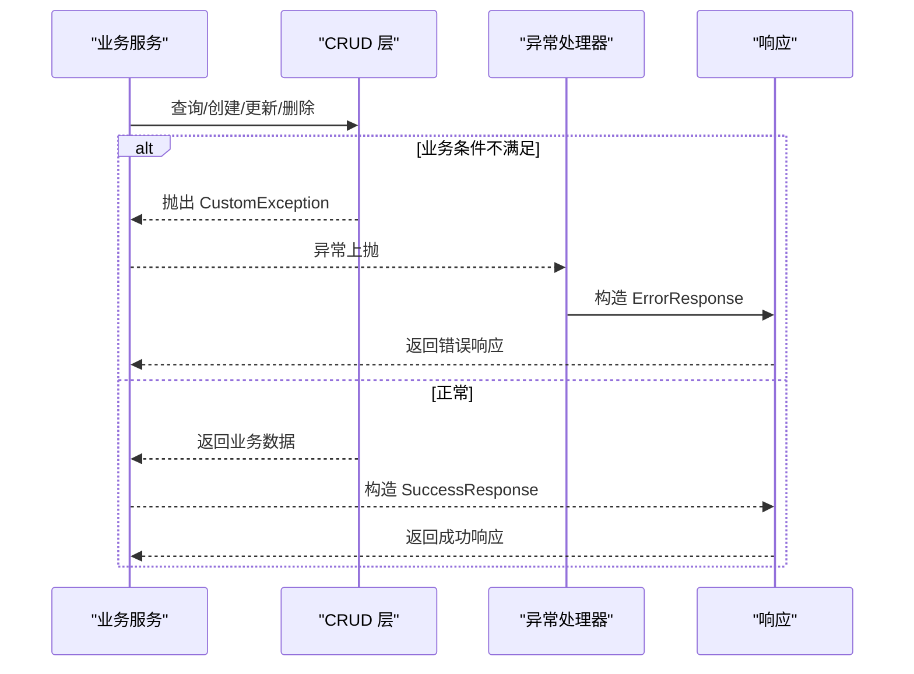
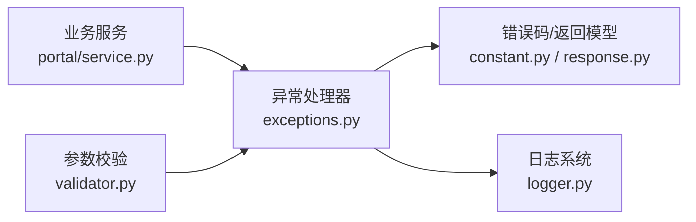

# 异常处理机制

<cite>
**本文引用的文件**
- [backend/app/core/exceptions.py](file://backend/app/core/exceptions.py)
- [backend/app/common/constant.py](file://backend/app/common/constant.py)
- [backend/app/common/response.py](file://backend/app/common/response.py)
- [backend/app/core/logger.py](file://backend/app/core/logger.py)
- [backend/main.py](file://backend/main.py)
- [backend/app/api/v1/module_application/portal/service.py](file://backend/app/api/v1/module_application/portal/service.py)
- [backend/app/core/validator.py](file://backend/app/core/validator.py)
</cite>

## 目录
1. [简介](#简介)
2. [项目结构](#项目结构)
3. [核心组件](#核心组件)
4. [架构总览](#架构总览)
5. [详细组件分析](#详细组件分析)
6. [依赖分析](#依赖分析)
7. [性能考虑](#性能考虑)
8. [故障排查指南](#故障排查指南)
9. [结论](#结论)
10. [附录](#附录)

## 简介
本文件系统性梳理 FastapiAdmin 的异常处理机制，重点覆盖以下方面：
- CustomException 设计与实现：异常类型分类、错误码定义、消息格式化策略
- 全局异常处理器的配置与注册流程
- 不同层级异常处理策略：业务异常、数据异常、权限异常、参数异常等
- 异常链传递与上下文信息保留
- 异常处理最佳实践：捕获、日志记录、用户友好提示
- CRUD 场景中的异常使用范式与自定义业务异常扩展

## 项目结构
异常处理相关的关键文件分布如下：
- 异常定义与全局处理器：backend/app/core/exceptions.py
- 错误码与返回结构：backend/app/common/constant.py、backend/app/common/response.py
- 日志系统：backend/app/core/logger.py
- 应用入口与注册流程：backend/main.py
- 业务层异常使用示例：backend/app/api/v1/module_application/portal/service.py
- 参数与数据校验引发的异常：backend/app/core/validator.py

**图示来源**
- [backend/main.py:16-51](file://backend/main.py#L16-L51)
- [backend/app/core/exceptions.py:57-248](file://backend/app/core/exceptions.py#L57-L248)
- [backend/app/common/constant.py:7-212](file://backend/app/common/constant.py#L7-L212)
- [backend/app/common/response.py:26-102](file://backend/app/common/response.py#L26-L102)
- [backend/app/core/logger.py:71-147](file://backend/app/core/logger.py#L71-L147)
- [backend/app/api/v1/module_application/portal/service.py:1-191](file://backend/app/api/v1/module_application/portal/service.py#L1-L191)
- [backend/app/core/validator.py:1-200](file://backend/app/core/validator.py#L1-L200)

**章节来源**
- [backend/main.py:16-51](file://backend/main.py#L16-L51)
- [backend/app/core/exceptions.py:57-248](file://backend/app/core/exceptions.py#L57-L248)

## 核心组件
- CustomException：自定义异常基类，统一承载业务错误码、HTTP 状态码、消息与附加数据
- 全局异常处理器：针对 CustomException、HTTPException、参数/响应验证异常、SQLAlchemyError、ValueError、字段验证异常以及通用异常进行处理
- 错误码体系：RET 枚举定义了业务与 HTTP 标准错误码
- 统一响应模型：ErrorResponse/SuccessResponse 提供一致的响应结构
- 日志系统：基于 Loguru 的拦截与落盘，保证异常日志可追踪

**章节来源**
- [backend/app/core/exceptions.py:15-47](file://backend/app/core/exceptions.py#L15-L47)
- [backend/app/common/constant.py:7-212](file://backend/app/common/constant.py#L7-L212)
- [backend/app/common/response.py:70-102](file://backend/app/common/response.py#L70-L102)
- [backend/app/core/logger.py:71-147](file://backend/app/core/logger.py#L71-L147)

## 架构总览
异常处理在应用生命周期中的位置与交互如下：

**图示来源**
- [backend/app/core/exceptions.py:57-248](file://backend/app/core/exceptions.py#L57-L248)
- [backend/app/common/response.py:70-102](file://backend/app/common/response.py#L70-L102)
- [backend/app/core/logger.py:71-147](file://backend/app/core/logger.py#L71-L147)

## 详细组件分析

### CustomException 类设计与实现
- 设计要点
  - 统一承载：msg、code、status_code、data、success
  - 默认值来源于 RET.EXCEPTION，便于兜底
  - 支持子类扩展以表达不同业务场景
- 消息格式化
  - 通过构造函数注入业务错误码与 HTTP 状态码
  - 与 ErrorResponse 结合，形成前后端一致的错误契约

**图示来源**
- [backend/app/core/exceptions.py:15-55](file://backend/app/core/exceptions.py#L15-L55)

**章节来源**
- [backend/app/core/exceptions.py:15-55](file://backend/app/core/exceptions.py#L15-L55)

### 全局异常处理器配置与注册
- 注册入口
  - 在应用创建阶段调用 register_exceptions(app) 完成注册
- 处理器清单
  - CustomException：记录日志并返回 ErrorResponse
  - HTTPException：记录 HTTP 状态细节并返回 ErrorResponse
  - RequestValidationError：映射常见 Pydantic 错误消息，去除冗余前缀
  - ResponseValidationError：响应格式错误，返回通用提示
  - SQLAlchemyError：数据库操作失败，生产环境返回通用提示
  - ValueError：值异常，返回通用提示
  - FieldValidationError：字段级校验异常，返回具体字段消息
  - Exception：兜底处理器，记录未捕获异常并返回通用错误

**图示来源**
- [backend/main.py:41](file://backend/main.py#L41)
- [backend/app/core/exceptions.py:57-248](file://backend/app/core/exceptions.py#L57-L248)

**章节来源**
- [backend/main.py:41](file://backend/main.py#L41)
- [backend/app/core/exceptions.py:57-248](file://backend/app/core/exceptions.py#L57-L248)

### 错误码定义与消息格式化
- 错误码体系
  - RET 枚举涵盖成功、HTTP 标准错误、服务器错误与各类业务错误码
  - 业务异常默认使用 RET.EXCEPTION，亦可按场景选择更细粒度的错误码
- 消息格式化
  - 参数验证异常处理器对 Pydantic 原始消息进行映射与清洗
  - 统一通过 ErrorResponse 输出，包含 code、msg、status_code、data、success

**图示来源**
- [backend/app/common/constant.py:7-212](file://backend/app/common/constant.py#L7-L212)
- [backend/app/common/response.py:70-102](file://backend/app/common/response.py#L70-L102)

**章节来源**
- [backend/app/common/constant.py:7-212](file://backend/app/common/constant.py#L7-L212)
- [backend/app/common/response.py:70-102](file://backend/app/common/response.py#L70-L102)

### 不同层级的异常处理策略
- 业务异常（CustomException）
  - 用途：封装业务规则违反、数据状态不合法、操作失败等
  - 示例：应用管理模块在查询/创建/更新/删除时抛出
- 数据异常（SQLAlchemyError）
  - 用途：数据库连接、事务、约束冲突等
  - 处理：记录类型与摘要，返回通用提示，避免泄露底层细节
- 权限异常（HTTP 401/403）
  - 用途：未认证、权限不足
  - 处理：由 HTTPException 处理器统一包装为 ErrorResponse
- 参数异常（Request/Response/Field 验证）
  - 用途：请求体/响应体不符合 Pydantic 定义
  - 处理：清洗消息、保留原始 body，返回 422/400

**图示来源**
- [backend/app/core/exceptions.py:88-247](file://backend/app/core/exceptions.py#L88-L247)
- [backend/app/api/v1/module_application/portal/service.py:44-176](file://backend/app/api/v1/module_application/portal/service.py#L44-L176)
- [backend/app/core/validator.py:63-177](file://backend/app/core/validator.py#L63-L177)

**章节来源**
- [backend/app/core/exceptions.py:88-247](file://backend/app/core/exceptions.py#L88-L247)
- [backend/app/api/v1/module_application/portal/service.py:44-176](file://backend/app/api/v1/module_application/portal/service.py#L44-L176)
- [backend/app/core/validator.py:63-177](file://backend/app/core/validator.py#L63-L177)

### 异常链传递与上下文信息保留
- 异常链
  - 全局处理器捕获异常后，统一记录日志并返回 ErrorResponse，不向外抛出原生异常栈
- 上下文信息
  - 日志记录包含请求方法、URL、错误码/消息、原始错误详情
  - 参数/响应验证异常保留原始 body，便于定位问题

**章节来源**
- [backend/app/core/exceptions.py:80-88](file://backend/app/core/exceptions.py#L80-L88)
- [backend/app/core/exceptions.py:137-144](file://backend/app/core/exceptions.py#L137-L144)
- [backend/app/core/exceptions.py:160-167](file://backend/app/core/exceptions.py#L160-L167)
- [backend/app/core/exceptions.py:185-192](file://backend/app/core/exceptions.py#L185-L192)
- [backend/app/core/exceptions.py:239-247](file://backend/app/core/exceptions.py#L239-L247)

### CRUD 场景中的异常使用范式
- 查询/详情
  - 未找到资源时抛出 CustomException，携带明确业务提示
- 创建
  - 名称重复、创建失败等场景抛出 CustomException
- 更新
  - 资源不存在、名称冲突、更新失败等场景抛出 CustomException
- 删除
  - 删除对象为空、目标不存在等场景抛出 CustomException

**图示来源**
- [backend/app/api/v1/module_application/portal/service.py:44-176](file://backend/app/api/v1/module_application/portal/service.py#L44-L176)
- [backend/app/core/exceptions.py:68-88](file://backend/app/core/exceptions.py#L68-L88)

**章节来源**
- [backend/app/api/v1/module_application/portal/service.py:44-176](file://backend/app/api/v1/module_application/portal/service.py#L44-L176)

### 自定义业务异常类型建议
- 建议在业务模块内定义领域异常类，继承 CustomException 并预置合适的 code/msg
- 在服务层集中抛出，避免在控制器或 CRUD 层分散处理
- 对外暴露统一的错误码与消息，便于前端与监控系统消费

**章节来源**
- [backend/app/core/exceptions.py:15-55](file://backend/app/core/exceptions.py#L15-L55)

## 依赖分析
- 组件耦合
  - 异常处理器依赖错误码与响应模型，日志系统贯穿各处理器
  - 业务服务通过导入 CustomException 使用统一异常
- 外部依赖
  - FastAPI 异常类型（HTTPException、RequestValidationError、ResponseValidationError）
  - SQLAlchemyError
  - Pydantic 字段级校验异常

**图示来源**
- [backend/app/core/exceptions.py:57-248](file://backend/app/core/exceptions.py#L57-L248)
- [backend/app/common/constant.py:7-212](file://backend/app/common/constant.py#L7-L212)
- [backend/app/common/response.py:26-102](file://backend/app/common/response.py#L26-L102)
- [backend/app/core/logger.py:71-147](file://backend/app/core/logger.py#L71-L147)
- [backend/app/api/v1/module_application/portal/service.py:1-191](file://backend/app/api/v1/module_application/portal/service.py#L1-L191)
- [backend/app/core/validator.py:1-200](file://backend/app/core/validator.py#L1-L200)

**章节来源**
- [backend/app/core/exceptions.py:57-248](file://backend/app/core/exceptions.py#L57-L248)
- [backend/app/common/constant.py:7-212](file://backend/app/common/constant.py#L7-L212)
- [backend/app/common/response.py:26-102](file://backend/app/common/response.py#L26-L102)
- [backend/app/core/logger.py:71-147](file://backend/app/core/logger.py#L71-L147)
- [backend/app/api/v1/module_application/portal/service.py:1-191](file://backend/app/api/v1/module_application/portal/service.py#L1-L191)
- [backend/app/core/validator.py:1-200](file://backend/app/core/validator.py#L1-L200)

## 性能考虑
- 异常处理开销
  - 全局处理器仅在异常发生时执行，正常路径不受影响
- 日志性能
  - 控制台与文件轮转配置合理，避免高频异常导致磁盘压力
- 响应序列化
  - 统一使用 jsonable_encoder 与自定义日期序列化，减少额外转换成本

[本节为通用指导，无需特定文件引用]

## 故障排查指南
- 常见问题定位
  - 查看日志文件 info.log/error.log，定位异常类型与上下文
  - 关注参数验证异常的原始 body，确认请求格式
- 处理建议
  - 对于 422 响应，优先检查 Pydantic 模型与字段注解
  - 对于数据库异常，结合 SQL 日志与事务边界排查
  - 对于未捕获异常，查看兜底处理器日志并补充针对性处理器

**章节来源**
- [backend/app/core/logger.py:107-130](file://backend/app/core/logger.py#L107-L130)
- [backend/app/core/exceptions.py:137-144](file://backend/app/core/exceptions.py#L137-L144)
- [backend/app/core/exceptions.py:160-167](file://backend/app/core/exceptions.py#L160-L167)
- [backend/app/core/exceptions.py:185-192](file://backend/app/core/exceptions.py#L185-L192)
- [backend/app/core/exceptions.py:239-247](file://backend/app/core/exceptions.py#L239-L247)

## 结论
FastapiAdmin 的异常处理机制通过 CustomException 与全局处理器实现了统一、可追踪、可维护的错误处理闭环。配合 RET 错误码与 ErrorResponse 响应模型，既保证了前后端一致性，也为后续扩展与监控提供了基础。建议在业务层集中使用 CustomException，并根据场景选择合适的错误码，持续优化日志与告警策略。

[本节为总结性内容，无需特定文件引用]

## 附录
- 最佳实践清单
  - 在服务层抛出 CustomException，避免在控制器/CRUD 层散落异常
  - 为关键业务场景定义专用错误码，提升可观测性
  - 参数/响应验证异常统一清洗消息，保留必要上下文
  - 生产环境避免泄露底层异常细节，使用通用提示并记录详细日志
  - 对未覆盖的异常类型补充针对性处理器，完善兜底能力

[本节为通用指导，无需特定文件引用]