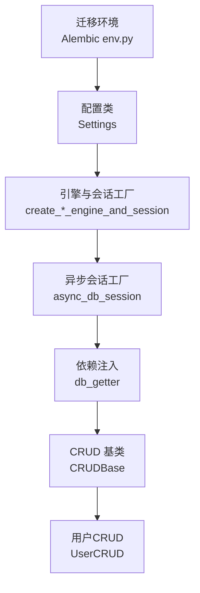
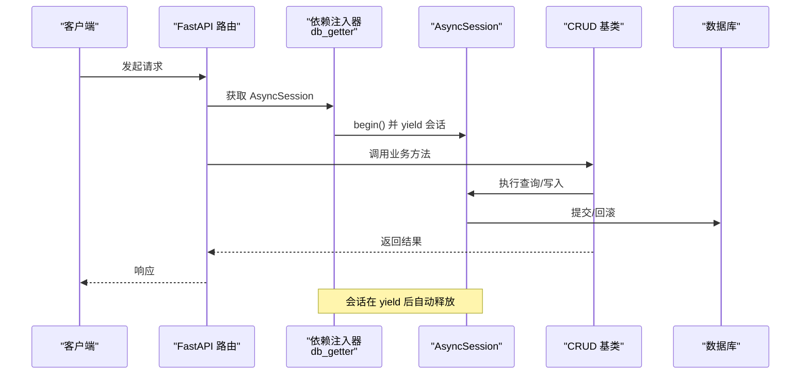
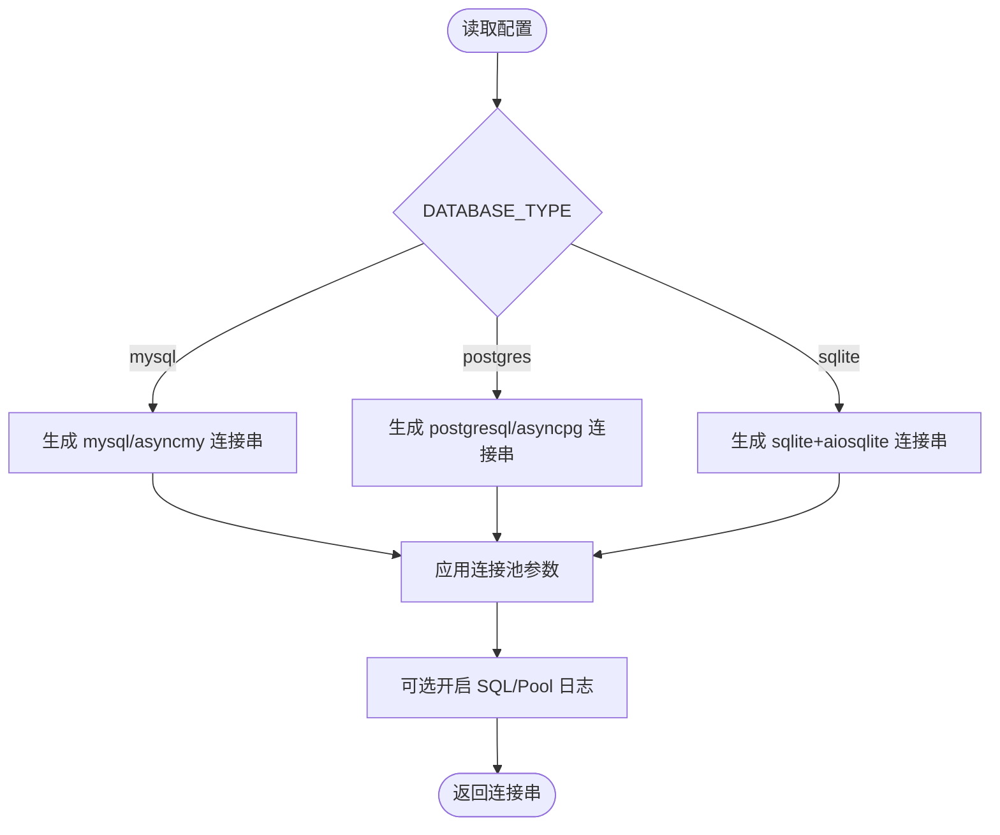
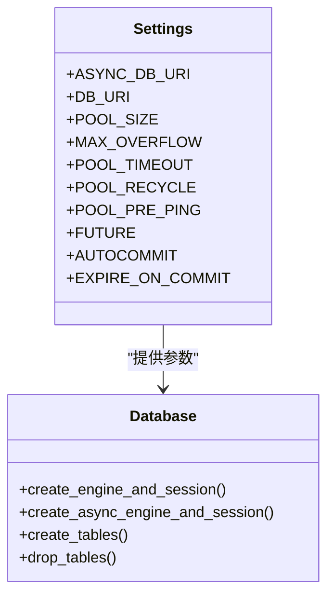
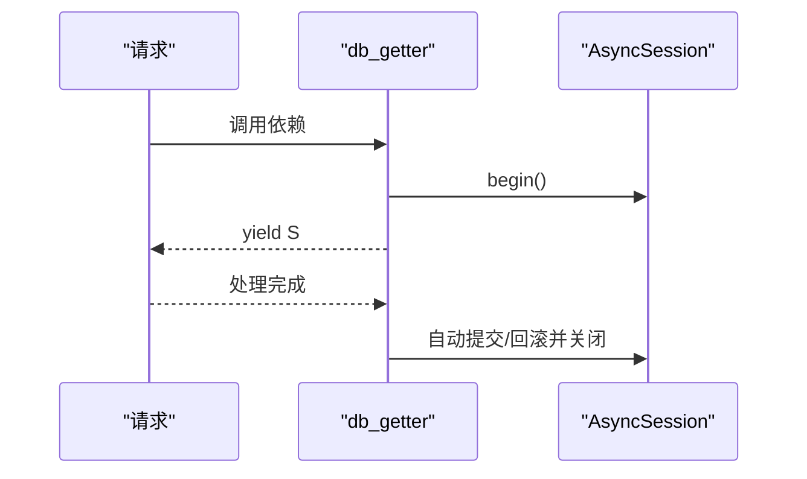
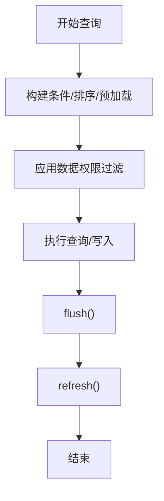
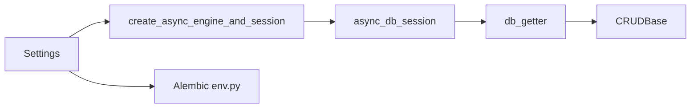

# 数据库连接管理

<cite>
**本文引用的文件**
- [backend/app/core/database.py](file://backend/app/core/database.py)
- [backend/app/config/setting.py](file://backend/app/config/setting.py)
- [backend/app/core/dependencies.py](file://backend/app/core/dependencies.py)
- [backend/app/core/base_crud.py](file://backend/app/core/base_crud.py)
- [backend/app/api/v1/module_system/auth/schema.py](file://backend/app/api/v1/module_system/auth/schema.py)
- [backend/app/api/v1/module_system/user/crud.py](file://backend/app/api/v1/module_system/user/crud.py)
- [backend/app/alembic/env.py](file://backend/app/alembic/env.py)
</cite>

## 目录
1. [简介](#简介)
2. [项目结构](#项目结构)
3. [核心组件](#核心组件)
4. [架构总览](#架构总览)
5. [详细组件分析](#详细组件分析)
6. [依赖分析](#依赖分析)
7. [性能考虑](#性能考虑)
8. [故障排查指南](#故障排查指南)
9. [结论](#结论)
10. [附录](#附录)

## 简介
本文件聚焦 FastapiAdmin 的数据库连接管理，系统性解析异步数据库引擎与会话的创建、生命周期与事务处理机制，覆盖连接池参数优化、连接超时与复用策略、多数据库连接管理与切换、CRUD 中的会话使用与异常重连策略，并给出性能优化建议。

## 项目结构
围绕数据库连接管理的关键模块分布如下：
- 配置层：集中于配置类，负责数据库与连接池参数、驱动选择与连接串生成
- 引擎与会话：封装同步与异步引擎创建、会话工厂与表级生命周期管理
- 依赖注入：提供异步会话与 Redis 的依赖注入器，贯穿请求生命周期
- CRUD 层：统一使用注入的会话执行查询与写入，内置权限过滤与预加载策略
- 迁移工具：Alembic 环境脚本读取配置生成迁移

**图表来源**
- [backend/app/config/setting.py:257-302](file://backend/app/config/setting.py#L257-L302)
- [backend/app/core/database.py:53-106](file://backend/app/core/database.py#L53-L106)
- [backend/app/core/dependencies.py:21-30](file://backend/app/core/dependencies.py#L21-L30)
- [backend/app/core/base_crud.py:26-42](file://backend/app/core/base_crud.py#L26-L42)
- [backend/app/api/v1/module_system/user/crud.py:18-33](file://backend/app/api/v1/module_system/user/crud.py#L18-L33)
- [backend/app/alembic/env.py:50-50](file://backend/app/alembic/env.py#L50-L50)

**章节来源**
- [backend/app/config/setting.py:80-104](file://backend/app/config/setting.py#L80-L104)
- [backend/app/core/database.py:19-106](file://backend/app/core/database.py#L19-L106)
- [backend/app/core/dependencies.py:21-30](file://backend/app/core/dependencies.py#L21-L30)
- [backend/app/core/base_crud.py:26-42](file://backend/app/core/base_crud.py#L26-L42)
- [backend/app/alembic/env.py:50-50](file://backend/app/alembic/env.py#L50-L50)

## 核心组件
- 配置类 Settings：集中管理数据库类型、连接参数、驱动连接串生成与事件注册
- 引擎与会话工厂：创建同步/异步引擎与会话工厂，支持连接池参数与预检
- 依赖注入器：提供异步会话与 Redis 的 FastAPI 依赖，贯穿请求生命周期
- CRUD 基类：统一使用注入的会话执行查询、分页、增删改、软删除与权限过滤
- Alembic 迁移：读取配置生成迁移脚本，支持异步迁移

**章节来源**
- [backend/app/config/setting.py:80-104](file://backend/app/config/setting.py#L80-L104)
- [backend/app/core/database.py:53-106](file://backend/app/core/database.py#L53-L106)
- [backend/app/core/dependencies.py:21-30](file://backend/app/core/dependencies.py#L21-L30)
- [backend/app/core/base_crud.py:26-42](file://backend/app/core/base_crud.py#L26-L42)
- [backend/app/alembic/env.py:50-50](file://backend/app/alembic/env.py#L50-L50)

## 架构总览
异步数据库连接管理采用“配置 → 引擎 → 会话 → 依赖注入 → CRUD”的链路，确保每个请求拥有独立的异步会话，事务在会话作用域内自动开启与提交。

**图表来源**
- [backend/app/core/dependencies.py:21-30](file://backend/app/core/dependencies.py#L21-L30)
- [backend/app/core/base_crud.py:43-103](file://backend/app/core/base_crud.py#L43-L103)

**章节来源**
- [backend/app/core/dependencies.py:21-30](file://backend/app/core/dependencies.py#L21-L30)
- [backend/app/core/base_crud.py:43-103](file://backend/app/core/base_crud.py#L43-L103)

## 详细组件分析

### 配置与连接参数
- 数据库类型与驱动：支持 mysql、postgres、sqlite，分别生成同步与异步连接串
- 连接池参数：池大小、最大溢出、超时、回收、预检、LIFO 等
- 会话行为：自动提交、自动刷新、提交后过期等
- 事件注册：根据开关动态注册 Redis 连接事件

**图表来源**
- [backend/app/config/setting.py:257-302](file://backend/app/config/setting.py#L257-L302)
- [backend/app/config/setting.py:86-95](file://backend/app/config/setting.py#L86-L95)

**章节来源**
- [backend/app/config/setting.py:80-104](file://backend/app/config/setting.py#L80-L104)
- [backend/app/config/setting.py:257-302](file://backend/app/config/setting.py#L257-L302)

### 引擎与会话工厂
- 同步引擎：基于配置创建 Engine，结合 sessionmaker
- 异步引擎：区分 sqlite 与其他数据库，应用不同连接池参数
- 表级生命周期：提供创建/删除表的异步入口，使用 AsyncEngine.begin

**图表来源**
- [backend/app/config/setting.py:257-302](file://backend/app/config/setting.py#L257-L302)
- [backend/app/core/database.py:19-133](file://backend/app/core/database.py#L19-L133)

**章节来源**
- [backend/app/core/database.py:19-133](file://backend/app/core/database.py#L19-L133)

### 依赖注入与会话生命周期
- db_getter：在每次请求中创建 AsyncSession，并在 begin() 作用域内 yield，确保事务在会话作用域内自动提交/回滚
- 会话释放：yield 后自动关闭，避免连接泄漏

**图表来源**
- [backend/app/core/dependencies.py:21-30](file://backend/app/core/dependencies.py#L21-L30)

**章节来源**
- [backend/app/core/dependencies.py:21-30](file://backend/app/core/dependencies.py#L21-L30)

### CRUD 与事务处理
- 查询与写入：统一通过注入的 AsyncSession 执行，支持预加载、权限过滤与分页
- 事务语义：db_getter 在会话 begin() 作用域内，保证同一请求内的读写在一个事务中
- 软删除：支持按模型特征进行软删除与恢复
- 权限过滤：CRUDBase 内部对 Select 查询应用数据权限过滤

**图表来源**
- [backend/app/core/base_crud.py:43-103](file://backend/app/core/base_crud.py#L43-L103)
- [backend/app/core/base_crud.py:216-246](file://backend/app/core/base_crud.py#L216-L246)
- [backend/app/core/base_crud.py:247-294](file://backend/app/core/base_crud.py#L247-L294)

**章节来源**
- [backend/app/core/base_crud.py:43-103](file://backend/app/core/base_crud.py#L43-L103)
- [backend/app/core/base_crud.py:216-246](file://backend/app/core/base_crud.py#L216-L246)
- [backend/app/core/base_crud.py:247-294](file://backend/app/core/base_crud.py#L247-L294)

### 多数据库与切换策略
- 驱动选择：通过配置项 DATABASE_TYPE 切换 mysql、postgres、sqlite
- 连接串生成：同步/异步分别生成对应驱动的连接串
- 切换建议：通过环境变量或配置文件切换 DATABASE_TYPE 与连接参数，确保连接池参数与目标数据库兼容

**章节来源**
- [backend/app/config/setting.py:98-104](file://backend/app/config/setting.py#L98-L104)
- [backend/app/config/setting.py:257-302](file://backend/app/config/setting.py#L257-L302)

### Alembic 迁移集成
- 迁移环境读取配置生成异步迁移连接
- 事务 per 迁移，检测模型变更并生成迁移文件

**章节来源**
- [backend/app/alembic/env.py:50-50](file://backend/app/alembic/env.py#L50-L50)
- [backend/app/alembic/env.py:118-128](file://backend/app/alembic/env.py#L118-L128)

## 依赖分析
- 配置类 Settings 为引擎与会话工厂提供参数来源
- 依赖注入器 db_getter 依赖 async_db_session，贯穿业务层
- CRUD 基类依赖注入的会话执行数据库操作
- Alembic env 依赖配置生成迁移连接

**图表来源**
- [backend/app/config/setting.py:257-302](file://backend/app/config/setting.py#L257-L302)
- [backend/app/core/database.py:53-106](file://backend/app/core/database.py#L53-L106)
- [backend/app/core/dependencies.py:21-30](file://backend/app/core/dependencies.py#L21-L30)
- [backend/app/core/base_crud.py:26-42](file://backend/app/core/base_crud.py#L26-L42)
- [backend/app/alembic/env.py:50-50](file://backend/app/alembic/env.py#L50-L50)

**章节来源**
- [backend/app/config/setting.py:257-302](file://backend/app/config/setting.py#L257-L302)
- [backend/app/core/database.py:53-106](file://backend/app/core/database.py#L53-L106)
- [backend/app/core/dependencies.py:21-30](file://backend/app/core/dependencies.py#L21-L30)
- [backend/app/core/base_crud.py:26-42](file://backend/app/core/base_crud.py#L26-L42)
- [backend/app/alembic/env.py:50-50](file://backend/app/alembic/env.py#L50-L50)

## 性能考虑
- 连接池参数
  - 池大小与溢出：根据并发与数据库承载能力调整，避免过度占用
  - 超时与回收：合理设置超时与回收时间，减少僵尸连接
  - 预检与 LIFO：开启预检提升连接健康度，LIFO 可改善热点
- 查询优化
  - 分页使用主键计数，避免全表扫描
  - 预加载策略：使用 selectinload，避免异步环境下的缺失绿灯问题
  - 条件构建：利用等值/范围/模糊等条件，减少无效查询
- 事务策略
  - 单请求单事务：db_getter 已在会话 begin() 作用域内，避免长事务
  - 明确 flush/refresh：在写入后及时刷新以获取最新状态
- 连接复用
  - 依赖注入确保会话复用，避免频繁创建销毁
  - 异步引擎与会话工厂统一管理，减少重复初始化

**章节来源**
- [backend/app/config/setting.py:86-95](file://backend/app/config/setting.py#L86-L95)
- [backend/app/core/base_crud.py:186-194](file://backend/app/core/base_crud.py#L186-L194)
- [backend/app/core/base_crud.py:534-570](file://backend/app/core/base_crud.py#L534-L570)
- [backend/app/core/dependencies.py:21-30](file://backend/app/core/dependencies.py#L21-L30)

## 故障排查指南
- 连接失败
  - 检查配置项 DATABASE_TYPE 与连接串生成逻辑
  - 查看连接池参数是否与数据库版本兼容
- 会话异常
  - 确认 db_getter 是否在 begin() 作用域内使用
  - 检查 flush/refresh 是否在写入后调用
- 权限过滤问题
  - 确认 CRUDBase 的权限过滤逻辑与 check_data_scope 设置
- 迁移失败
  - 检查 Alembic env 读取的连接串与数据库连通性

**章节来源**
- [backend/app/config/setting.py:257-302](file://backend/app/config/setting.py#L257-L302)
- [backend/app/core/dependencies.py:21-30](file://backend/app/core/dependencies.py#L21-L30)
- [backend/app/core/base_crud.py:446-451](file://backend/app/core/base_crud.py#L446-L451)
- [backend/app/alembic/env.py:92-102](file://backend/app/alembic/env.py#L92-L102)

## 结论
FastapiAdmin 的数据库连接管理以配置为中心，通过异步引擎与会话工厂、依赖注入与 CRUD 基类形成闭环，既保证了请求级事务的一致性，又提供了灵活的连接池与查询优化策略。遵循本文的参数调优与最佳实践，可在高并发场景下获得稳定与高效的数据库表现。

## 附录
- CRUD 使用示例路径
  - [用户CRUD示例:18-33](file://backend/app/api/v1/module_system/user/crud.py#L18-L33)
  - [CRUDBase 基类:26-42](file://backend/app/core/base_crud.py#L26-L42)
- 会话与依赖
  - [db_getter 依赖注入:21-30](file://backend/app/core/dependencies.py#L21-L30)
  - [AuthSchema 会话字段:16-16](file://backend/app/api/v1/module_system/auth/schema.py#L16-L16)
- 配置与迁移
  - [Settings 配置项:80-104](file://backend/app/config/setting.py#L80-L104)
  - [Alembic env 迁移:50-50](file://backend/app/alembic/env.py#L50-L50)