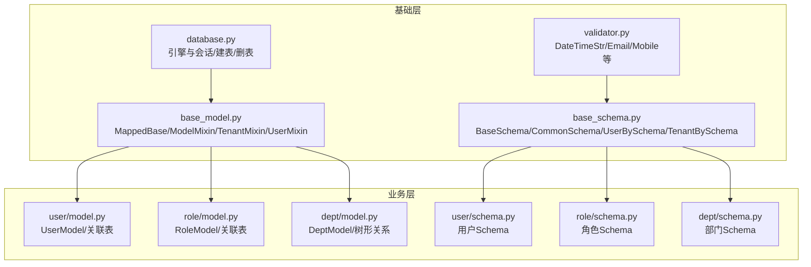
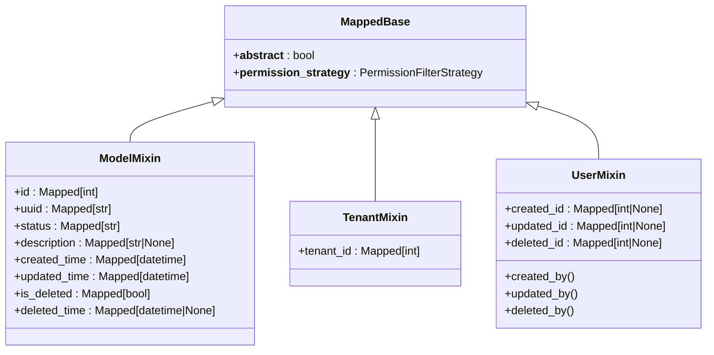
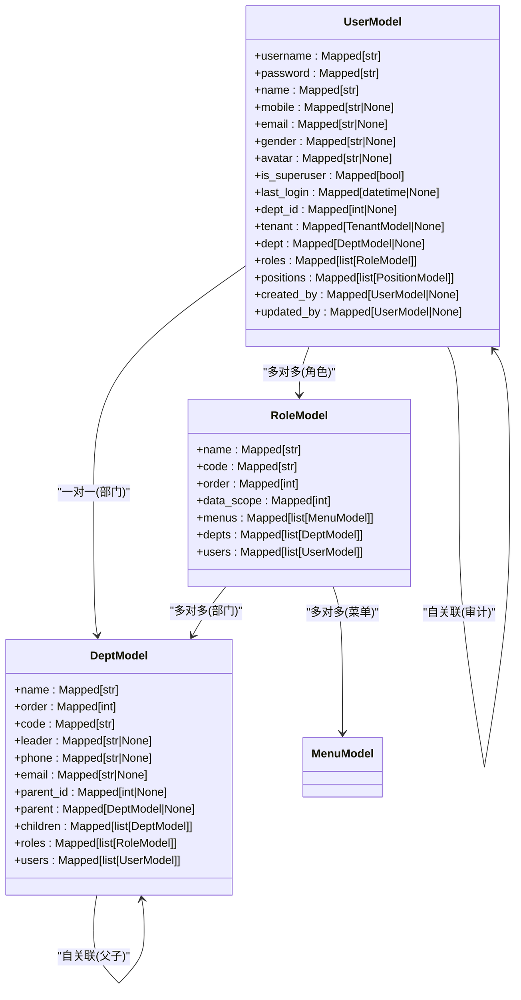
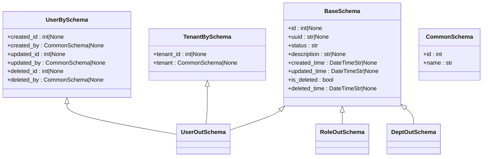
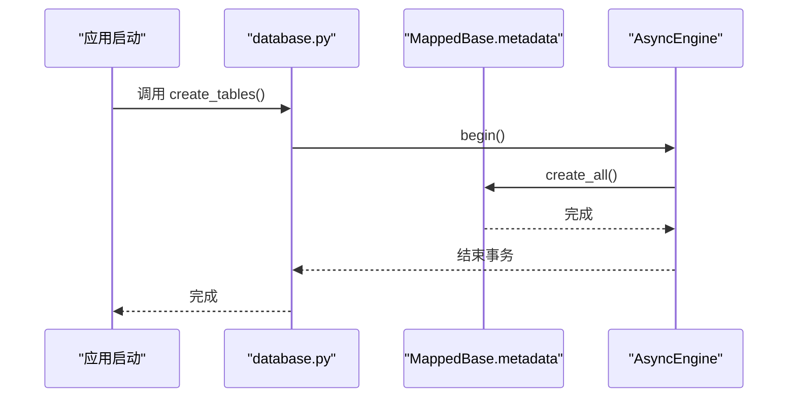
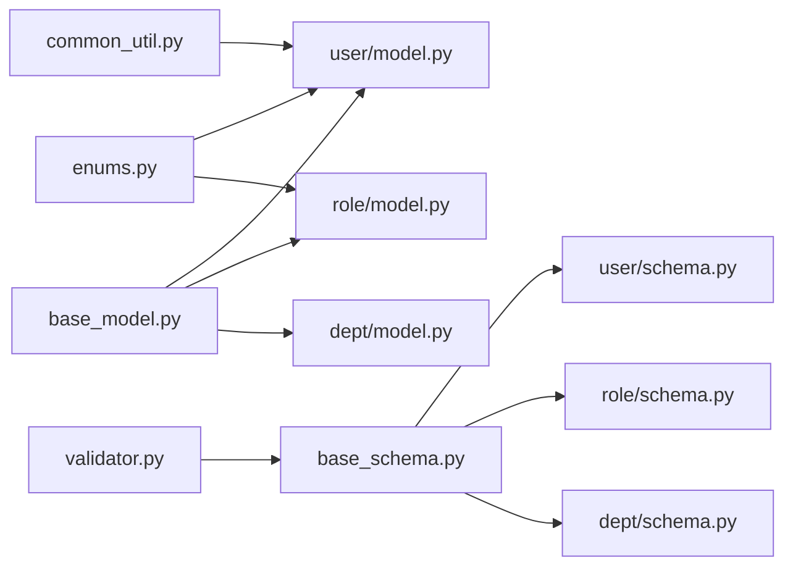

# 数据模型层

<cite>
**本文档引用的文件**
- [backend/app/core/base_model.py](file://backend/app/core/base_model.py)
- [backend/app/core/base_schema.py](file://backend/app/core/base_schema.py)
- [backend/app/core/database.py](file://backend/app/core/database.py)
- [backend/app/core/validator.py](file://backend/app/core/validator.py)
- [backend/app/common/enums.py](file://backend/app/common/enums.py)
- [backend/app/utils/common_util.py](file://backend/app/utils/common_util.py)
- [backend/app/api/v1/module_system/user/model.py](file://backend/app/api/v1/module_system/user/model.py)
- [backend/app/api/v1/module_system/user/schema.py](file://backend/app/api/v1/module_system/user/schema.py)
- [backend/app/api/v1/module_system/role/model.py](file://backend/app/api/v1/module_system/role/model.py)
- [backend/app/api/v1/module_system/role/schema.py](file://backend/app/api/v1/module_system/role/schema.py)
- [backend/app/api/v1/module_system/dept/model.py](file://backend/app/api/v1/module_system/dept/model.py)
- [backend/app/api/v1/module_system/dept/schema.py](file://backend/app/api/v1/module_system/dept/schema.py)
</cite>

## 目录
1. [简介](#简介)
2. [项目结构](#项目结构)
3. [核心组件](#核心组件)
4. [架构总览](#架构总览)
5. [详细组件分析](#详细组件分析)
6. [依赖分析](#依赖分析)
7. [性能考虑](#性能考虑)
8. [故障排查指南](#故障排查指南)
9. [结论](#结论)
10. [附录](#附录)

## 简介
本文件聚焦 FastapiAdmin 的数据模型层，系统性解析以下主题：
- BaseModel 抽象设计：基于 SQLAlchemy MappedBase 的继承与 ORM 映射配置
- BaseSchema Pydantic 模型设计：数据验证、序列化与反序列化
- 字段定义最佳实践：数据类型选择、约束设置与索引优化
- 模型关系映射：一对一、一对多、多对多与外键约束
- 模型扩展指南：如何在业务模型中继承基础模型
- 模型与数据库迁移：Alembic 版本管理配合使用

## 项目结构
数据模型层位于后端工程的 core 层与各业务模块的 model/schema 层，采用“基础模型 + 业务模型”的分层组织方式：
- 基础层：core/base_model.py、core/base_schema.py、core/database.py、core/validator.py
- 业务层：module_system 下的 user、role、dept 等模块的 model 与 schema
- 工具与枚举：common/enums.py、utils/common_util.py



**图表来源**
- [backend/app/core/base_model.py:21-228](file://backend/app/core/base_model.py#L21-L228)
- [backend/app/core/base_schema.py:1-75](file://backend/app/core/base_schema.py#L1-L75)
- [backend/app/core/database.py:1-177](file://backend/app/core/database.py#L1-L177)
- [backend/app/core/validator.py:1-298](file://backend/app/core/validator.py#L1-L298)
- [backend/app/api/v1/module_system/user/model.py:1-151](file://backend/app/api/v1/module_system/user/model.py#L1-L151)
- [backend/app/api/v1/module_system/user/schema.py:1-310](file://backend/app/api/v1/module_system/user/schema.py#L1-L310)
- [backend/app/api/v1/module_system/role/model.py:1-100](file://backend/app/api/v1/module_system/role/model.py#L1-L100)
- [backend/app/api/v1/module_system/role/schema.py:1-126](file://backend/app/api/v1/module_system/role/schema.py#L1-L126)
- [backend/app/api/v1/module_system/dept/model.py:1-59](file://backend/app/api/v1/module_system/dept/model.py#L1-L59)
- [backend/app/api/v1/module_system/dept/schema.py:1-102](file://backend/app/api/v1/module_system/dept/schema.py#L1-L102)

**章节来源**
- [backend/app/core/base_model.py:21-228](file://backend/app/core/base_model.py#L21-L228)
- [backend/app/core/base_schema.py:1-75](file://backend/app/core/base_schema.py#L1-L75)
- [backend/app/core/database.py:1-177](file://backend/app/core/database.py#L1-L177)

## 核心组件
- MappedBase：声明式 ORM 基类，统一异步属性与元数据，作为所有业务模型的根基类
- ModelMixin：提供通用字段（主键、UUID、状态、描述、时间戳、软删除）与索引
- TenantMixin：租户隔离字段与外键约束
- UserMixin：审计字段 created_id/updated_id/deleted_id 及其关系映射
- BaseSchema：Pydantic 输出模型，统一基础与审计字段，支持 from_attributes
- Validator：自定义类型 DateTimeStr、DateStr、TimeStr、Email、Telephone 等

**章节来源**
- [backend/app/core/base_model.py:21-228](file://backend/app/core/base_model.py#L21-L228)
- [backend/app/core/base_schema.py:15-75](file://backend/app/core/base_schema.py#L15-L75)
- [backend/app/core/validator.py:11-60](file://backend/app/core/validator.py#L11-L60)

## 架构总览
数据模型层遵循“ORM 映射 + Pydantic 序列化”的双层设计：
- ORM 层：通过 MappedBase 与 Mixin 统一字段与关系，结合数据库引擎与会话完成持久化
- 序列化层：通过 BaseSchema 与自定义类型实现输入/输出的严格校验与格式化



**图表来源**
- [backend/app/core/base_model.py:21-228](file://backend/app/core/base_model.py#L21-L228)

## 详细组件分析

### BaseModel 抽象设计与 ORM 映射
- 继承体系
  - MappedBase：DeclarativeBase + AsyncAttrs，统一异步 ORM 行为
  - ModelMixin：提供 id、uuid、status、description、时间戳、软删除等字段与索引
  - TenantMixin：提供 tenant_id 外键，配合 sys_tenant 实现行级租户隔离
  - UserMixin：提供 created_id/updated_id/deleted_id 外键，配合 sys_user 实现审计与“仅本人”权限
- 关系映射
  - UserMixin 中的 created_by/updated_by/deleted_by 使用延迟加载与 TYPE_CHECKING 避免循环依赖
  - UserModel 显式覆盖 UserMixin 的关系，指定 foreign_keys 与 remote_side，防止自引用歧义
- 权限策略
  - __permission_strategy__ 可在子类覆盖，支持数据范围、角色、部门、仅本人、用户角色等策略



**图表来源**
- [backend/app/api/v1/module_system/user/model.py:64-151](file://backend/app/api/v1/module_system/user/model.py#L64-L151)
- [backend/app/api/v1/module_system/role/model.py:64-100](file://backend/app/api/v1/module_system/role/model.py#L64-L100)
- [backend/app/api/v1/module_system/dept/model.py:14-59](file://backend/app/api/v1/module_system/dept/model.py#L14-L59)

**章节来源**
- [backend/app/core/base_model.py:21-228](file://backend/app/core/base_model.py#L21-L228)
- [backend/app/api/v1/module_system/user/model.py:64-151](file://backend/app/api/v1/module_system/user/model.py#L64-L151)
- [backend/app/api/v1/module_system/role/model.py:64-100](file://backend/app/api/v1/module_system/role/model.py#L64-L100)
- [backend/app/api/v1/module_system/dept/model.py:14-59](file://backend/app/api/v1/module_system/dept/model.py#L14-L59)

### BaseSchema 的 Pydantic 设计
- BaseSchema：统一输出模型，包含 id、uuid、status、description、created_time、updated_time、is_deleted、deleted_time
- UserBySchema：嵌套 created_id/created_by、updated_id/updated_by、deleted_id/deleted_by
- TenantBySchema：嵌套 tenant_id/tenant
- Validator 集成：DateTimeStr、DateStr、TimeStr、Email、Telephone 等类型确保序列化一致性与格式校验
- from_attributes=True：支持直接从 ORM 实例构建 Pydantic 模型，简化序列化流程



**图表来源**
- [backend/app/core/base_schema.py:6-75](file://backend/app/core/base_schema.py#L6-L75)
- [backend/app/api/v1/module_system/user/schema.py:241-260](file://backend/app/api/v1/module_system/user/schema.py#L241-L260)
- [backend/app/api/v1/module_system/role/schema.py:84-91](file://backend/app/api/v1/module_system/role/schema.py#L84-L91)
- [backend/app/api/v1/module_system/dept/schema.py:64-70](file://backend/app/api/v1/module_system/dept/schema.py#L64-L70)

**章节来源**
- [backend/app/core/base_schema.py:6-75](file://backend/app/core/base_schema.py#L6-L75)
- [backend/app/core/validator.py:11-60](file://backend/app/core/validator.py#L11-L60)
- [backend/app/api/v1/module_system/user/schema.py:241-260](file://backend/app/api/v1/module_system/user/schema.py#L241-L260)

### 字段定义最佳实践
- 数据类型选择
  - 文本类：String(N)、Text，注意长度与存储成本
  - 时间类：DateTime，配合自定义 DateTimeStr 序列化为字符串
  - 布尔类：Boolean，用于状态与开关字段
- 约束设置
  - 主键：自增整数 id，uuid 唯一
  - 唯一性：username/email/mobile 等唯一约束
  - 非空：关键字段默认非空，配合默认值
  - 外键：ForeignKey + ON DELETE/UPDATE 策略明确
- 索引优化
  - 高频查询字段建立索引：status、created_time、updated_time、uuid、tenant_id、created_id/updated_id
  - 复合索引：多对多关联表使用联合主键
- 软删除
  - is_deleted + deleted_time，避免物理删除影响关联完整性

**章节来源**
- [backend/app/core/base_model.py:70-125](file://backend/app/core/base_model.py#L70-L125)
- [backend/app/api/v1/module_system/user/model.py:81-116](file://backend/app/api/v1/module_system/user/model.py#L81-L116)
- [backend/app/api/v1/module_system/role/model.py:76-86](file://backend/app/api/v1/module_system/role/model.py#L76-L86)
- [backend/app/api/v1/module_system/dept/model.py:24-40](file://backend/app/api/v1/module_system/dept/model.py#L24-L40)

### 模型关系映射与外键约束
- 一对一：UserModel.dept → DeptModel，DeptModel.users ← UserModel
- 一对多：DeptModel.children → DeptModel、RoleModel.users ← UserModel
- 多对多：UserModel.roles ← sys_user_roles → RoleModel、UserModel.positions ← sys_user_positions → PositionModel、RoleModel.menus ← sys_role_menus → MenuModel、RoleModel.depts ← sys_role_depts → DeptModel
- 外键策略
  - RESTRICT/SET NULL/CASCADE 明确删除与更新行为
  - TYPE_CHECKING 与 declared_attr 避免循环依赖与关系歧义
- 树形结构
  - DeptModel.parent/children 使用自关联，支持层级查询与权限计算

```mermaid
erDiagram
SYS_USER {
int id PK
string username UK
string password
string name
string mobile UK
string email UK
string gender
string avatar
boolean is_superuser
datetime last_login
int dept_id FK
int tenant_id FK
}
SYS_DEPT {
int id PK
string name
int order
string code UK
string leader
string phone
string email
int parent_id FK
}
SYS_ROLE {
int id PK
string name
string code UK
int order
int data_scope
}
SYS_USER_ROLES {
int user_id PK,FK
int role_id PK,FK
}
SYS_USER_POSITIONS {
int user_id PK,FK
int position_id PK,FK
}
SYS_ROLE_MENUS {
int role_id PK,FK
int menu_id PK,FK
}
SYS_ROLE_DEPTS {
int role_id PK,FK
int dept_id PK,FK
}
SYS_TENANT {
int id PK
}
SYS_MENU {
int id PK
}
SYS_POSITION {
int id PK
}
SYS_USER }o--|| SYS_DEPT : "belongs to"
SYS_USER }o--o|| SYS_TENANT : "belongs to"
SYS_USER }o--o{ SYS_ROLE : "has many"
SYS_USER }o--o{ SYS_POSITION : "has many"
SYS_ROLE }o--o{ SYS_MENU : "has many"
SYS_ROLE }o--o{ SYS_DEPT : "has many"
SYS_DEPT }o--o{ SYS_DEPT : "parent/child"
```

**图表来源**
- [backend/app/api/v1/module_system/user/model.py:16-151](file://backend/app/api/v1/module_system/user/model.py#L16-L151)
- [backend/app/api/v1/module_system/role/model.py:15-100](file://backend/app/api/v1/module_system/role/model.py#L15-L100)
- [backend/app/api/v1/module_system/dept/model.py:14-59](file://backend/app/api/v1/module_system/dept/model.py#L14-L59)

**章节来源**
- [backend/app/api/v1/module_system/user/model.py:16-151](file://backend/app/api/v1/module_system/user/model.py#L16-L151)
- [backend/app/api/v1/module_system/role/model.py:15-100](file://backend/app/api/v1/module_system/role/model.py#L15-L100)
- [backend/app/api/v1/module_system/dept/model.py:14-59](file://backend/app/api/v1/module_system/dept/model.py#L14-L59)

### 模型扩展指南
- 业务模型继承
  - 基础模型：ModelMixin + TenantMixin + UserMixin
  - 示例：UserModel、RoleModel、DeptModel
- 关系扩展
  - 在业务模型中定义 secondary 表或 back_populates 关系
  - 使用 lazy 策略优化加载性能（推荐 selectin）
- 权限策略
  - 子类可覆盖 __permission_strategy__ 以适配不同权限模型
- 查询参数
  - 通过 QueryParam 将前端查询参数标准化为 (op, value) 形式，便于统一处理

**章节来源**
- [backend/app/api/v1/module_system/user/model.py:64-151](file://backend/app/api/v1/module_system/user/model.py#L64-L151)
- [backend/app/api/v1/module_system/role/model.py:64-100](file://backend/app/api/v1/module_system/role/model.py#L64-L100)
- [backend/app/api/v1/module_system/dept/model.py:14-59](file://backend/app/api/v1/module_system/dept/model.py#L14-L59)
- [backend/app/api/v1/module_system/user/schema.py:262-310](file://backend/app/api/v1/module_system/user/schema.py#L262-L310)
- [backend/app/api/v1/module_system/role/schema.py:93-126](file://backend/app/api/v1/module_system/role/schema.py#L93-L126)
- [backend/app/api/v1/module_system/dept/schema.py:72-102](file://backend/app/api/v1/module_system/dept/schema.py#L72-L102)

### 模型与数据库迁移（Alembic）
- 建表与删表
  - 通过 create_tables/drop_tables 基于 MappedBase.metadata 创建或删除所有表
- 引擎与会话
  - 支持同步与异步引擎，按配置动态创建
- 迁移建议
  - 使用 Alembic 基于 ORM 元数据生成初始版本
  - 后续变更通过 Alembic 自动追踪 MappedBase.metadata 的差异
  - 遵循外键约束与索引策略，避免破坏现有数据



**图表来源**
- [backend/app/core/database.py:113-122](file://backend/app/core/database.py#L113-L122)

**章节来源**
- [backend/app/core/database.py:113-122](file://backend/app/core/database.py#L113-L122)

## 依赖分析
- 组件耦合
  - ModelMixin/TenantMixin/UserMixin 与具体业务模型松耦合，通过继承复用字段与关系
  - BaseSchema 与 Validator 解耦，通过类型注解与 ConfigDict 实现序列化契约
- 外部依赖
  - SQLAlchemy 异步 ORM、Pydantic 校验、自定义枚举与工具类
- 循环依赖规避
  - TYPE_CHECKING 与 declared_attr 在关系映射中避免循环导入



**图表来源**
- [backend/app/core/base_model.py:21-228](file://backend/app/core/base_model.py#L21-L228)
- [backend/app/core/base_schema.py:1-75](file://backend/app/core/base_schema.py#L1-L75)
- [backend/app/core/validator.py:1-298](file://backend/app/core/validator.py#L1-L298)
- [backend/app/common/enums.py:111-122](file://backend/app/common/enums.py#L111-L122)
- [backend/app/utils/common_util.py:290-376](file://backend/app/utils/common_util.py#L290-L376)
- [backend/app/api/v1/module_system/user/model.py:1-151](file://backend/app/api/v1/module_system/user/model.py#L1-L151)
- [backend/app/api/v1/module_system/user/schema.py:1-310](file://backend/app/api/v1/module_system/user/schema.py#L1-L310)
- [backend/app/api/v1/module_system/role/model.py:1-100](file://backend/app/api/v1/module_system/role/model.py#L1-L100)
- [backend/app/api/v1/module_system/role/schema.py:1-126](file://backend/app/api/v1/module_system/role/schema.py#L1-L126)
- [backend/app/api/v1/module_system/dept/model.py:1-59](file://backend/app/api/v1/module_system/dept/model.py#L1-L59)
- [backend/app/api/v1/module_system/dept/schema.py:1-102](file://backend/app/api/v1/module_system/dept/schema.py#L1-L102)

**章节来源**
- [backend/app/core/base_model.py:21-228](file://backend/app/core/base_model.py#L21-L228)
- [backend/app/core/base_schema.py:1-75](file://backend/app/core/base_schema.py#L1-L75)
- [backend/app/core/validator.py:1-298](file://backend/app/core/validator.py#L1-L298)
- [backend/app/common/enums.py:111-122](file://backend/app/common/enums.py#L111-L122)
- [backend/app/utils/common_util.py:290-376](file://backend/app/utils/common_util.py#L290-L376)

## 性能考虑
- 加载策略
  - 推荐 selectin 用于一对多关系，减少 N+1 查询
  - 关系字段使用 lazy="selectin"，避免默认 select 延迟导致的多次查询
- 索引设计
  - 高频过滤字段建立索引，如 status、created_time、updated_time、uuid、tenant_id、created_id/updated_id
  - 复合索引用于多对多关联表的联合主键
- 序列化开销
  - from_attributes=True 减少手动映射成本
  - DateTimeStr 等自定义类型在序列化时统一格式，降低前端处理复杂度

[本节为通用指导，无需特定文件引用]

## 故障排查指南
- 数据库连接失败
  - 检查配置项 SQL_DB_ENABLE 与数据库 URL
  - 查看异常日志定位连接参数问题
- Redis 连接异常
  - 检查 REDIS_ENABLE 与 REDIS_URI，确认认证与超时设置
- 字段校验失败
  - Pydantic 校验器抛出异常时，检查字段长度、格式与必填约束
  - 自定义验证器（如手机号、邮箱、日期）确保传入值符合规范
- 关系映射错误
  - 多对多/自关联关系需明确 foreign_keys 与 remote_side，避免歧义
  - TYPE_CHECKING 保护避免循环导入

**章节来源**
- [backend/app/core/database.py:32-46](file://backend/app/core/database.py#L32-L46)
- [backend/app/core/database.py:146-176](file://backend/app/core/database.py#L146-L176)
- [backend/app/core/validator.py:63-127](file://backend/app/core/validator.py#L63-L127)
- [backend/app/api/v1/module_system/user/model.py:133-150](file://backend/app/api/v1/module_system/user/model.py#L133-L150)

## 结论
FastapiAdmin 的数据模型层通过 MappedBase 与 Mixin 提供统一的 ORM 基座，结合 Pydantic 的 BaseSchema 实现严格的输入输出校验与序列化。该设计在保证扩展性的同时兼顾性能与可维护性，适用于多租户、多角色、树形结构等复杂业务场景。配合 Alembic 的元数据驱动迁移，可稳定支撑持续演进。

[本节为总结性内容，无需特定文件引用]

## 附录
- 常用字段与类型
  - 字符串：String(N)、Text
  - 时间：DateTime、自定义 DateTimeStr
  - 布尔：Boolean
  - 数值：Integer
- 关系加载策略
  - select（默认）、joined、selectin（推荐）、subquery、dynamic 等
- 权限策略枚举
  - DATA_SCOPE、ROLE_BASED、DEPT_BASED、SELF_ONLY、USER_ROLE

**章节来源**
- [backend/app/common/enums.py:111-122](file://backend/app/common/enums.py#L111-L122)
- [backend/app/core/base_model.py:56-66](file://backend/app/core/base_model.py#L56-L66)