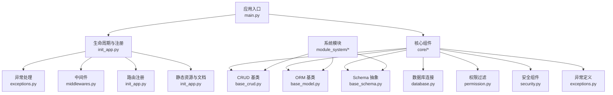
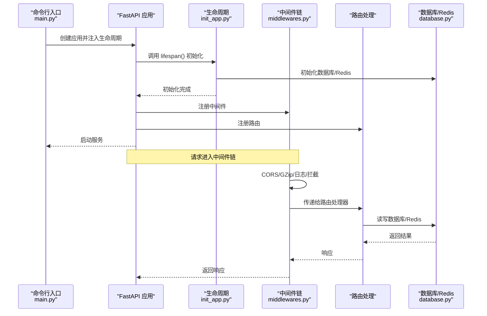
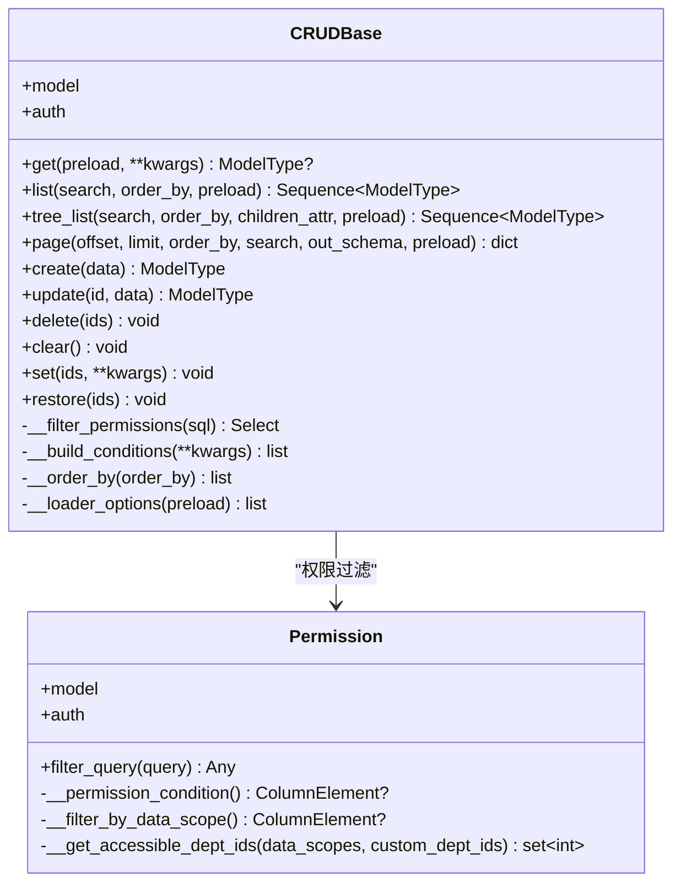
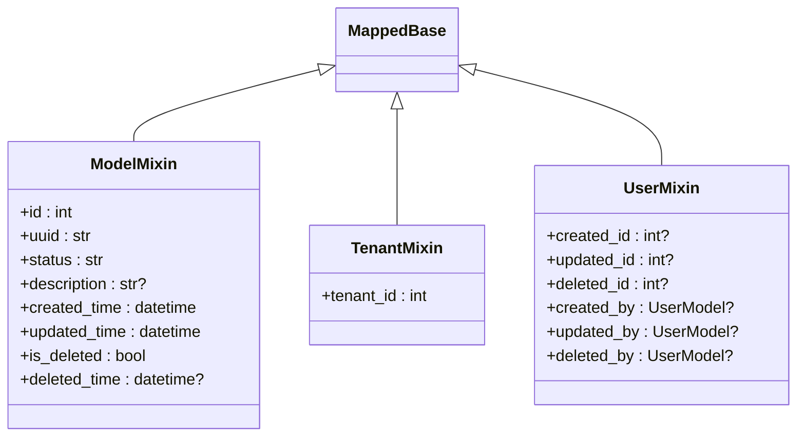
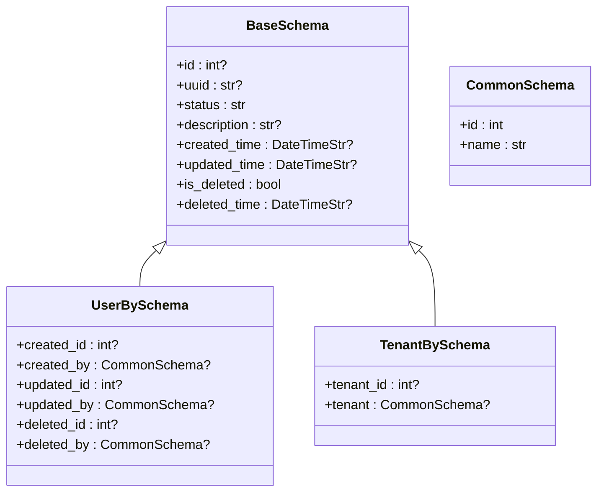
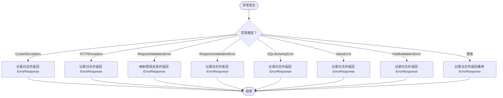
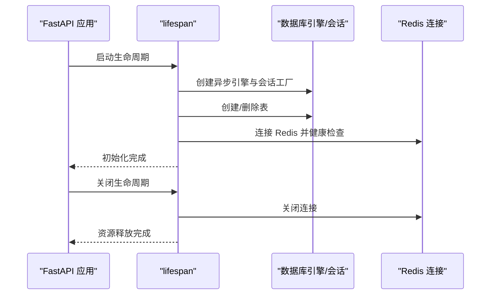
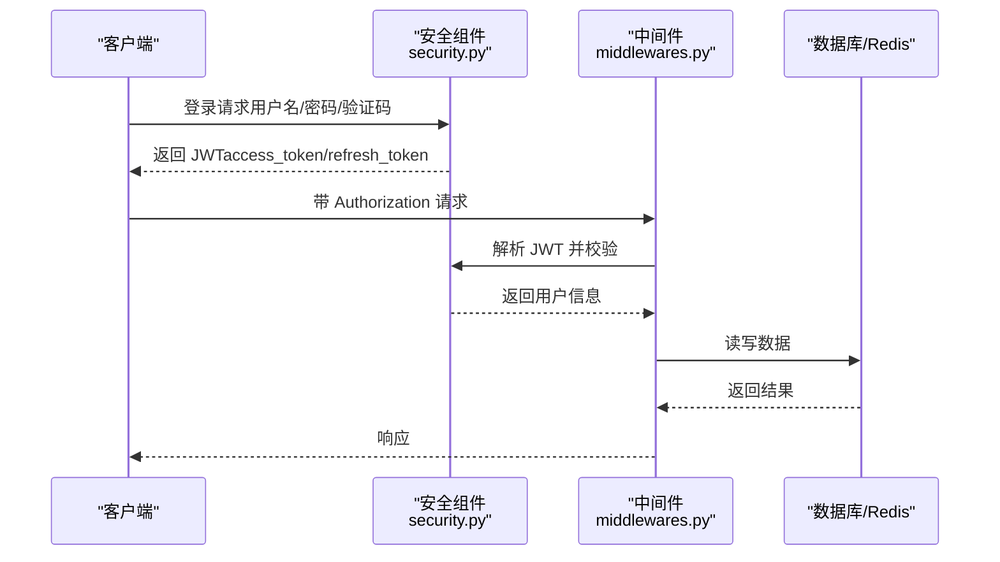
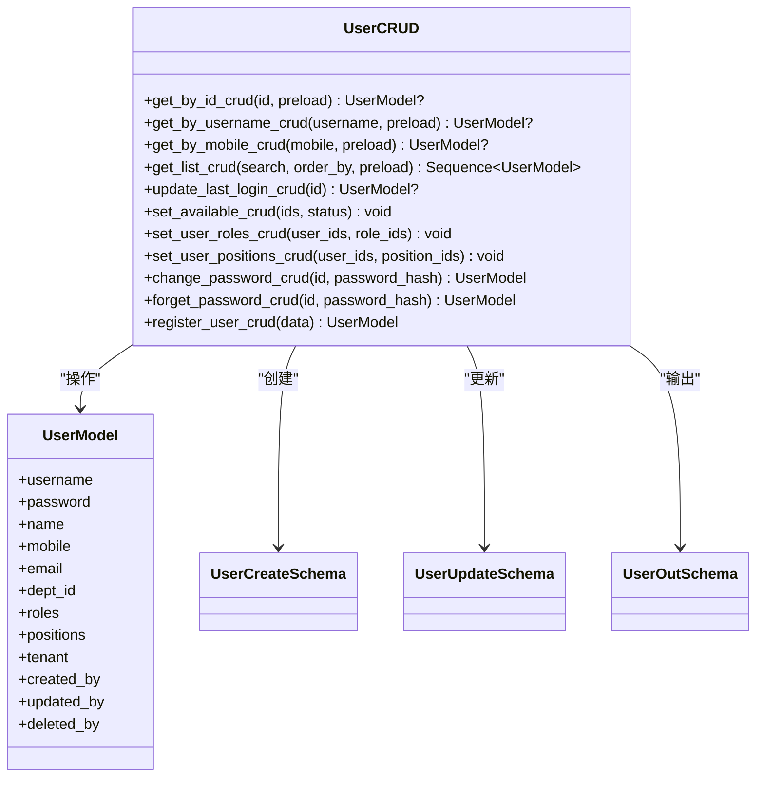
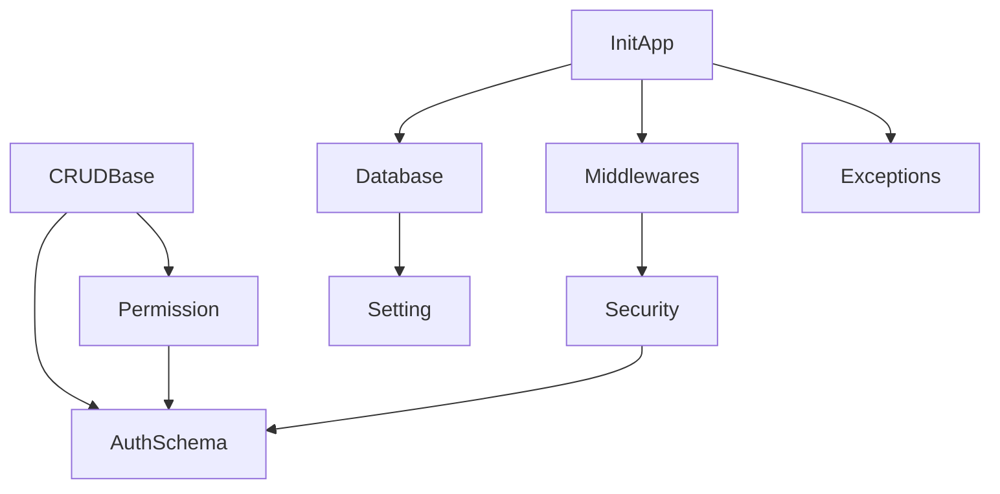

# 核心组件详解

<cite>
**本文档引用的文件**
- [main.py](file://backend/main.py)
- [base_crud.py](file://backend/app/core/base_crud.py)
- [base_model.py](file://backend/app/core/base_model.py)
- [base_schema.py](file://backend/app/core/base_schema.py)
- [database.py](file://backend/app/core/database.py)
- [exceptions.py](file://backend/app/core/exceptions.py)
- [permission.py](file://backend/app/core/permission.py)
- [security.py](file://backend/app/core/security.py)
- [middlewares.py](file://backend/app/core/middlewares.py)
- [init_app.py](file://backend/app/scripts/init_app.py)
- [setting.py](file://backend/app/config/setting.py)
- [crud.py](file://backend/app/api/v1/module_system/user/crud.py)
- [schema.py](file://backend/app/api/v1/module_system/user/schema.py)
- [model.py](file://backend/app/api/v1/module_system/user/model.py)
- [hash_bcrpy_util.py](file://backend/app/utils/hash_bcrpy_util.py)
</cite>

## 目录
1. [简介](#简介)
2. [项目结构](#项目结构)
3. [核心组件](#核心组件)
4. [架构总览](#架构总览)
5. [详细组件分析](#详细组件分析)
6. [依赖关系分析](#依赖关系分析)
7. [性能考虑](#性能考虑)
8. [故障排除指南](#故障排除指南)
9. [结论](#结论)
10. [附录](#附录)

## 简介
本文件聚焦 FastapiAdmin 的核心组件，深入解析 CRUDBase 基类的设计理念与实现细节，涵盖泛型类型系统、SQLAlchemy 集成、权限过滤机制；阐述 BaseModel 与 BaseSchema 的抽象设计以及 ORM 模型与 Pydantic 模型的关系；全面说明异常处理机制（CustomException 的使用与全局异常处理器配置）、数据库连接管理与会话生命周期控制；解释安全组件（密码加密、JWT 令牌处理、中间件系统）的设计与协作关系，并提供实际使用示例与架构图，帮助开发者快速理解整个后端架构的核心支撑。

## 项目结构
FastapiAdmin 采用模块化与分层架构组织，核心能力集中在 backend/app/core 下，配合配置、脚本与 API 模块协同工作。关键目录与职责概览：
- backend/main.py：应用入口与命令行工具（Typer），负责创建 FastAPI 实例、注册组件与启动服务。
- backend/app/core：核心基础设施，包含 CRUD 抽象、ORM 基类、Schema 抽象、数据库连接、异常处理、权限过滤、安全与中间件等。
- backend/app/api/v1/module_system：系统模块（用户、角色、菜单等）的控制器、CRUD、模型与 Schema。
- backend/app/config：配置中心，集中管理运行时配置与连接串生成。
- backend/app/scripts：应用生命周期管理、中间件注册、路由挂载、静态资源与文档重定向。
- backend/app/utils：通用工具，如密码加密、哈希、验证码等。

图表来源
- [main.py:16-51](file://backend/main.py#L16-L51)
- [init_app.py:27-93](file://backend/app/scripts/init_app.py#L27-L93)
- [base_crud.py:26-571](file://backend/app/core/base_crud.py#L26-L571)
- [base_model.py:21-228](file://backend/app/core/base_model.py#L21-L228)
- [base_schema.py:6-75](file://backend/app/core/base_schema.py#L6-L75)
- [database.py:19-177](file://backend/app/core/database.py#L19-L177)
- [permission.py:13-311](file://backend/app/core/permission.py#L13-L311)
- [security.py:11-149](file://backend/app/core/security.py#L11-L149)
- [middlewares.py:22-215](file://backend/app/core/middlewares.py#L22-L215)
- [exceptions.py:15-248](file://backend/app/core/exceptions.py#L15-L248)

章节来源
- [main.py:16-51](file://backend/main.py#L16-L51)
- [init_app.py:27-93](file://backend/app/scripts/init_app.py#L27-L93)

## 核心组件
本节聚焦四大核心抽象与基础设施，阐明其职责边界与协作方式。

- CRUDBase 泛型基类：提供统一的增删改查、分页、树形查询、软/硬删除与批量操作能力，内置权限过滤与预加载策略，屏蔽 SQLAlchemy 细节，简化业务层调用。
- ORM 基类与混入：通过 MappedBase、ModelMixin、TenantMixin、UserMixin 提供统一字段、审计字段、租户隔离与用户审计字段，统一数据模型设计。
- Schema 抽象：BaseSchema、CommonSchema、UserBySchema、TenantBySchema 等定义通用输出与嵌套结构，确保 API 响应一致性。
- 数据库与会话：封装同步/异步引擎与会话工厂，提供表创建/删除、Redis 连接与健康检查，统一连接生命周期管理。

章节来源
- [base_crud.py:26-571](file://backend/app/core/base_crud.py#L26-L571)
- [base_model.py:21-228](file://backend/app/core/base_model.py#L21-L228)
- [base_schema.py:6-75](file://backend/app/core/base_schema.py#L6-L75)
- [database.py:19-177](file://backend/app/core/database.py#L19-L177)

## 架构总览
下图展示应用启动到请求处理的关键流程，包括生命周期管理、中间件链路、异常处理与数据库/Redis 连接。

图表来源
- [main.py:16-51](file://backend/main.py#L16-L51)
- [init_app.py:27-93](file://backend/app/scripts/init_app.py#L27-L93)
- [middlewares.py:22-215](file://backend/app/core/middlewares.py#L22-L215)
- [database.py:135-177](file://backend/app/core/database.py#L135-L177)

## 详细组件分析

### CRUDBase 基类：泛型、SQLAlchemy 集成与权限过滤
CRUDBase 以泛型参数约束模型与 Schema 类型，统一实现 CRUD、分页、树形查询、软/硬删除与批量操作。其关键特性：
- 泛型类型系统：ModelType、CreateSchemaType、UpdateSchemaType、OutSchemaType 确保编译期类型安全与 IDE 智能提示。
- 条件构建与排序：支持多种比较运算符（等于、不等、大于、小于、模糊、IN、区间、日期格式化等），并自动拼接软删除条件。
- 权限过滤：通过 Permission 组件在查询阶段追加 WHERE 条件，支持角色/部门/自定义/仅本人等多种策略。
- 预加载策略：统一使用 selectinload 避免异步环境下的 MissingGreenlet 错误，支持模型默认加载项与显式 preload 组合。
- 会话与审计：自动注入 created_id/updated_id，支持软删除字段（is_deleted/deleted_time/deleted_id）与恢复操作。

图表来源
- [base_crud.py:26-571](file://backend/app/core/base_crud.py#L26-L571)
- [permission.py:13-311](file://backend/app/core/permission.py#L13-L311)

章节来源
- [base_crud.py:26-571](file://backend/app/core/base_crud.py#L26-L571)
- [permission.py:13-311](file://backend/app/core/permission.py#L13-L311)

### ORM 基类与混入：ModelMixin、TenantMixin、UserMixin
ORM 基类通过混入提供统一字段与关系：
- MappedBase：声明式异步 ORM 基类，支持 SQLite/MySQL/PostgreSQL。
- ModelMixin：提供 id、uuid、status、description、created_time、updated_time、is_deleted、deleted_time 等通用字段。
- TenantMixin：提供 tenant_id 外键，实现租户级数据隔离。
- UserMixin：提供 created_id/updated_id/created_by/updated_by 等审计字段与关系，支持“仅本人”数据权限。

图表来源
- [base_model.py:21-228](file://backend/app/core/base_model.py#L21-L228)

章节来源
- [base_model.py:21-228](file://backend/app/core/base_model.py#L21-L228)

### Schema 抽象：BaseSchema、CommonSchema、UserBySchema、TenantBySchema
Schema 抽象确保 API 响应的一致性与可复用性：
- BaseSchema：通用输出模型，包含基础字段与审计字段。
- CommonSchema：通用信息模型，用于嵌套输出。
- UserBySchema/TenantBySchema：分别嵌套用户与租户信息，避免扁平化带来的冗余字段。
- UploadResponseSchema/DownloadFileSchema：文件上传/下载响应模型。

图表来源
- [base_schema.py:6-75](file://backend/app/core/base_schema.py#L6-L75)

章节来源
- [base_schema.py:6-75](file://backend/app/core/base_schema.py#L6-L75)

### 异常处理机制：CustomException 与全局异常处理器
异常处理体系以 CustomException 为核心，结合 FastAPI 的全局异常处理器，统一错误响应格式：
- CustomException：自定义异常基类，包含 msg/code/status_code/data/success 字段，便于前后端约定。
- 全局异常处理器：覆盖 CustomException、HTTPException、RequestValidationError、ResponseValidationError、SQLAlchemyError、ValueError、FieldValidationError 与通用 Exception，统一记录日志并返回 ErrorResponse。
- 错误映射：对常见参数验证错误进行人性化提示转换，提升用户体验。

图表来源
- [exceptions.py:57-248](file://backend/app/core/exceptions.py#L57-L248)

章节来源
- [exceptions.py:15-248](file://backend/app/core/exceptions.py#L15-L248)

### 数据库连接管理与会话生命周期控制
数据库与 Redis 连接通过配置中心集中管理，提供统一的生命周期控制：
- 引擎与会话工厂：支持同步/异步引擎创建，按配置注入连接池参数、echo、预检与回收策略。
- 表管理：提供创建/删除所有表的能力，便于开发与测试。
- Redis 连接：支持连接创建与关闭，健康检查与异常分类处理（认证、超时、Redis 错误）。
- 生命周期：在 lifespan 中完成数据库初始化、Redis 配置、定时任务与限流器初始化，优雅关闭时释放资源。

图表来源
- [database.py:19-177](file://backend/app/core/database.py#L19-L177)
- [init_app.py:27-93](file://backend/app/scripts/init_app.py#L27-L93)

章节来源
- [database.py:19-177](file://backend/app/core/database.py#L19-L177)
- [init_app.py:27-93](file://backend/app/scripts/init_app.py#L27-L93)

### 安全组件：密码加密、JWT 令牌处理与中间件系统
安全体系围绕密码加密、令牌签发/解析与中间件拦截展开：
- 密码加密：使用 bcrypt（passlib），提供 verify_password 与 set_password_hash，支持密码强度检查。
- JWT 令牌：自定义 OAuth2PasswordBearer，支持自定义载荷（JWTPayloadSchema），提供 create_access_token 与 decode_access_token，并在解码失败时抛出自定义异常。
- 中间件：CORS、GZip、请求日志与演示模式拦截，支持从 Authorization 头解析 Token 并提取会话信息，增强安全审计。

图表来源
- [security.py:11-149](file://backend/app/core/security.py#L11-L149)
- [middlewares.py:36-215](file://backend/app/core/middlewares.py#L36-L215)

章节来源
- [security.py:11-149](file://backend/app/core/security.py#L11-L149)
- [middlewares.py:36-215](file://backend/app/core/middlewares.py#L36-L215)
- [hash_bcrpy_util.py:21-73](file://backend/app/utils/hash_bcrpy_util.py#L21-L73)

### 组件协作关系与实际使用示例
以用户模块为例，展示 CRUD 基类与系统模块的协作：
- UserCRUD 继承 CRUDBase[UserModel, UserCreateSchema, UserUpdateSchema]，复用统一的 CRUD 能力。
- UserModel 继承 ModelMixin/TenantMixin/UserMixin，具备统一字段与审计关系。
- UserSchema 定义输入/输出模型，结合 BaseSchema/UserBySchema/TenantBySchema 实现嵌套输出。

图表来源
- [crud.py:18-221](file://backend/app/api/v1/module_system/user/crud.py#L18-L221)
- [model.py:64-151](file://backend/app/api/v1/module_system/user/model.py#L64-L151)
- [schema.py:217-310](file://backend/app/api/v1/module_system/user/schema.py#L217-L310)

章节来源
- [crud.py:18-221](file://backend/app/api/v1/module_system/user/crud.py#L18-L221)
- [model.py:64-151](file://backend/app/api/v1/module_system/user/model.py#L64-L151)
- [schema.py:217-310](file://backend/app/api/v1/module_system/user/schema.py#L217-L310)

## 依赖关系分析
核心组件之间的耦合与依赖关系如下：
- CRUDBase 依赖 Permission 进行数据权限过滤，依赖 AuthSchema 持有数据库会话与用户上下文。
- Permission 依赖 AuthSchema 与模型元数据，结合枚举策略实现多种权限过滤。
- Security 与 Middlewares 依赖配置中心与异常处理，共同保障认证与安全拦截。
- Database 提供引擎与会话工厂，贯穿整个应用生命周期。
- Setting 统一生成数据库/Redis/中间件/事件等配置，形成松耦合的配置驱动。

图表来源
- [base_crud.py:26-571](file://backend/app/core/base_crud.py#L26-L571)
- [permission.py:13-311](file://backend/app/core/permission.py#L13-L311)
- [security.py:11-149](file://backend/app/core/security.py#L11-L149)
- [middlewares.py:22-215](file://backend/app/core/middlewares.py#L22-L215)
- [database.py:19-177](file://backend/app/core/database.py#L19-L177)
- [init_app.py:27-93](file://backend/app/scripts/init_app.py#L27-L93)
- [setting.py:227-355](file://backend/app/config/setting.py#L227-L355)

章节来源
- [base_crud.py:26-571](file://backend/app/core/base_crud.py#L26-L571)
- [permission.py:13-311](file://backend/app/core/permission.py#L13-L311)
- [security.py:11-149](file://backend/app/core/security.py#L11-L149)
- [middlewares.py:22-215](file://backend/app/core/middlewares.py#L22-L215)
- [database.py:19-177](file://backend/app/core/database.py#L19-L177)
- [init_app.py:27-93](file://backend/app/scripts/init_app.py#L27-L93)
- [setting.py:227-355](file://backend/app/config/setting.py#L227-L355)

## 性能考虑
- 查询优化：分页查询使用主键计数（pk_cols[0]）替代 count(*)，减少全表扫描开销。
- 预加载策略：统一使用 selectinload，避免异步环境下的 MissingGreenlet 错误，同时减少 N+1 查询风险。
- 条件构建：对空值与空数组进行显式处理，避免查询退化为全量扫描。
- 连接池：合理配置 pool_size/max_overflow/pool_timeout/pool_recycle，平衡吞吐与资源占用。
- 压缩与跨域：GZip 压缩与 CORS 中间件按需启用，降低带宽与提升兼容性。

## 故障排除指南
- 数据库连接失败：检查配置项 SQL_DB_ENABLE、DATABASE_TYPE、DB_URI 与连接池参数；查看日志定位具体异常。
- Redis 连接失败：确认 REDIS_ENABLE、REDIS_URI、认证信息与网络连通性；关注认证错误、超时与 Redis 错误分类日志。
- 权限过滤异常：核对模型的 __permission_strategy__ 与用户角色/部门数据范围；检查 Permission 过滤逻辑分支。
- 异常未被捕获：确认全局异常处理器已注册，CustomException 的 status_code/code/msg/data 是否正确设置。
- 中间件拦截：检查演示模式配置、IP 白名单/黑名单与路径白名单，确保非 GET 请求在演示模式下的行为符合预期。

章节来源
- [database.py:135-177](file://backend/app/core/database.py#L135-L177)
- [middlewares.py:133-186](file://backend/app/core/middlewares.py#L133-L186)
- [exceptions.py:57-248](file://backend/app/core/exceptions.py#L57-L248)
- [permission.py:54-86](file://backend/app/core/permission.py#L54-L86)

## 结论
FastapiAdmin 的核心组件以 CRUDBase 为数据访问抽象，结合 ORM 基类与 Schema 抽象，实现了类型安全、可维护与高性能的数据层；通过统一的异常处理、数据库与 Redis 连接管理、权限过滤与安全中间件，构建了健壮的后端基础设施。开发者可基于这些组件快速扩展业务模块，同时保持一致的开发体验与运维特性。

## 附录
- 配置中心：Settings 提供统一配置入口，支持环境切换、中间件/事件/连接串动态装配。
- 应用入口：main.py 使用 Typer 提供命令行工具，支持启动服务、生成迁移与升级数据库。
- 路由与文档：init_app.py 注册路由与自定义 API 文档页面，结合限流器与静态资源挂载。

章节来源
- [setting.py:13-355](file://backend/app/config/setting.py#L13-L355)
- [main.py:16-163](file://backend/main.py#L16-L163)
- [init_app.py:125-226](file://backend/app/scripts/init_app.py#L125-L226)