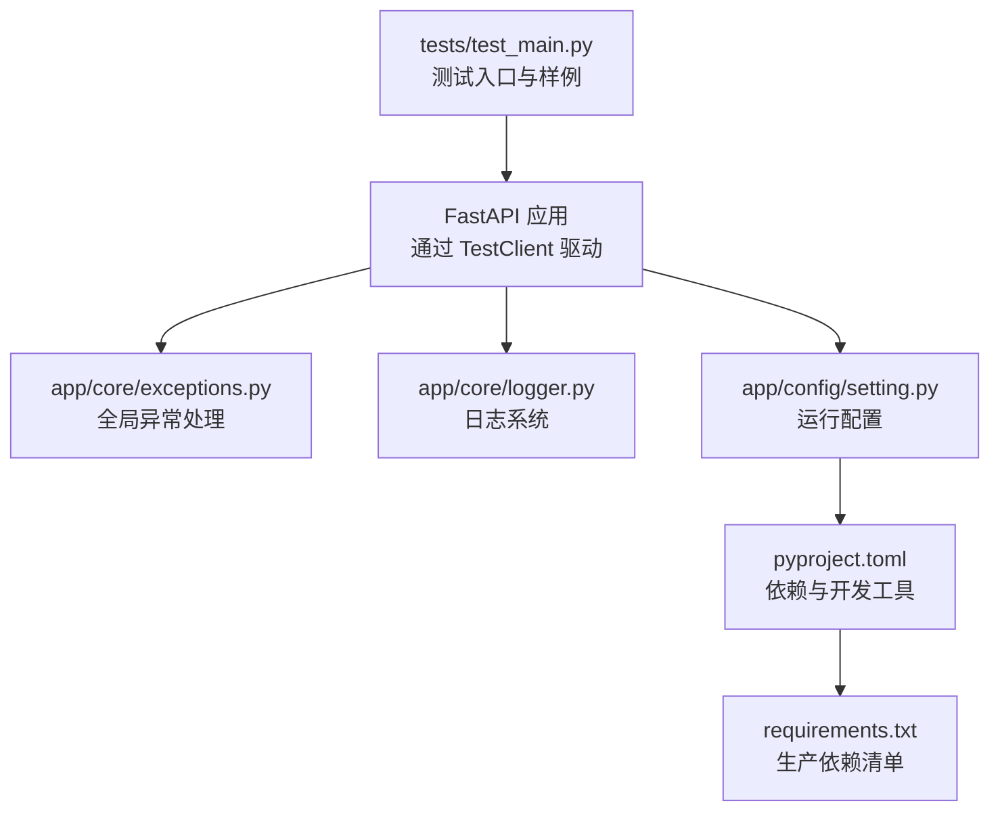
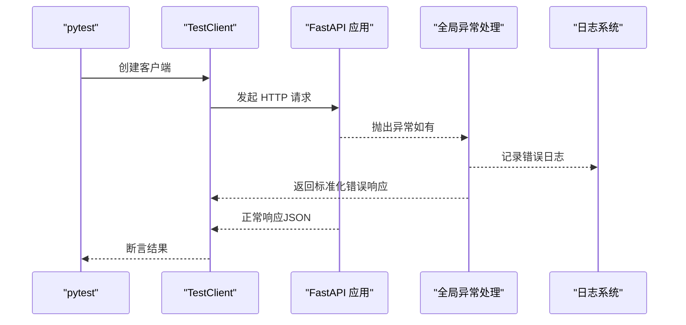
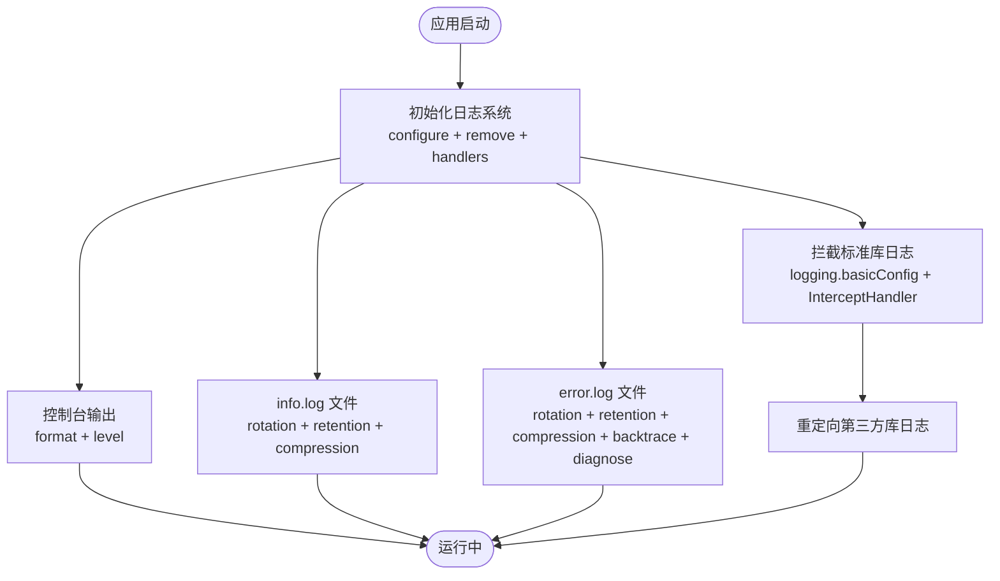
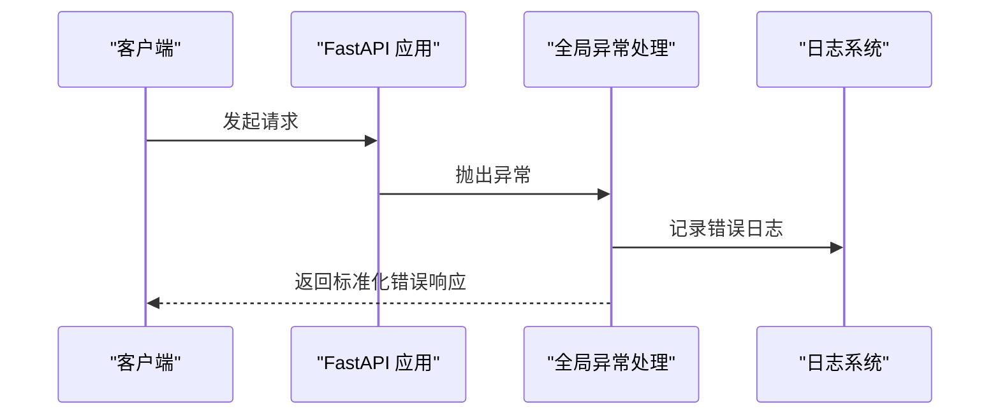
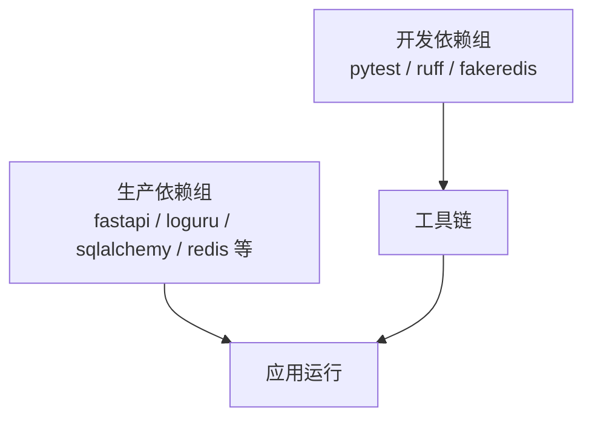

# 测试与调试

<cite>
**本文引用的文件**
- [pyproject.toml](file://backend/pyproject.toml)
- [requirements.txt](file://backend/requirements.txt)
- [test_main.py](file://backend/tests/test_main.py)
- [logger.py](file://backend/app/core/logger.py)
- [exceptions.py](file://backend/app/core/exceptions.py)
- [setting.py](file://backend/app/config/setting.py)
</cite>

## 目录
1. [简介](#简介)
2. [项目结构](#项目结构)
3. [核心组件](#核心组件)
4. [架构总览](#架构总览)
5. [详细组件分析](#详细组件分析)
6. [依赖分析](#依赖分析)
7. [性能考虑](#性能考虑)
8. [故障排查指南](#故障排查指南)
9. [结论](#结论)
10. [附录](#附录)

## 简介
本指南面向 FastapiAdmin 后端的测试与调试实践，覆盖单元测试与集成测试的编写方法、pytest 使用要点、API 测试最佳实践、日志系统配置与应用、异常处理与错误追踪机制、调试技巧与工具推荐，以及测试覆盖率与持续集成配置建议。内容以仓库现有实现为依据，确保可操作性与可落地。

## 项目结构
后端测试与调试相关的关键位置如下：
- 测试入口与样例：backend/tests/test_main.py
- 日志系统：backend/app/core/logger.py
- 全局异常处理：backend/app/core/exceptions.py
- 配置中心：backend/app/config/setting.py
- 依赖与开发工具：backend/pyproject.toml、backend/requirements.txt

图表来源
- [test_main.py:1-48](file://backend/tests/test_main.py#L1-L48)
- [logger.py:1-147](file://backend/app/core/logger.py#L1-L147)
- [exceptions.py:1-248](file://backend/app/core/exceptions.py#L1-L248)
- [setting.py:1-355](file://backend/app/config/setting.py#L1-L355)
- [pyproject.toml:1-138](file://backend/pyproject.toml#L1-L138)
- [requirements.txt:1-45](file://backend/requirements.txt#L1-L45)

章节来源
- [test_main.py:1-48](file://backend/tests/test_main.py#L1-L48)
- [pyproject.toml:1-138](file://backend/pyproject.toml#L1-L138)
- [requirements.txt:1-45](file://backend/requirements.txt#L1-L45)

## 核心组件
- 测试框架与工具
  - pytest：用于组织与执行测试用例，支持 TestClient 驱动的同步测试函数。
  - ruff：代码风格与静态检查工具，保障测试代码质量。
  - fakeredis：内存 Redis，便于在测试环境中隔离与快速清理。
- 日志系统
  - 基于 loguru，提供控制台彩色输出、文件轮转、错误日志分离、标准库日志拦截与统一格式化。
  - 支持 JSON Lines 输出选项，便于日志平台采集。
- 全局异常处理
  - 针对自定义异常、HTTP 异常、参数/响应验证异常、数据库异常、值异常、字段验证异常与通用异常，统一返回标准化错误响应，并记录详细日志。
- 配置中心
  - 提供日志级别、中间件开关、数据库/Redis 连接、Gzip 压缩、Swagger 文档路径等运行期配置，影响测试与调试行为。

章节来源
- [pyproject.toml:54-59](file://backend/pyproject.toml#L54-L59)
- [logger.py:71-147](file://backend/app/core/logger.py#L71-L147)
- [exceptions.py:57-248](file://backend/app/core/exceptions.py#L57-L248)
- [setting.py:50-170](file://backend/app/config/setting.py#L50-L170)

## 架构总览
下图展示测试执行、日志与异常处理在后端中的交互关系：

图表来源
- [test_main.py:12-42](file://backend/tests/test_main.py#L12-L42)
- [exceptions.py:57-248](file://backend/app/core/exceptions.py#L57-L248)
- [logger.py:71-147](file://backend/app/core/logger.py#L71-L147)

## 详细组件分析

### 测试用例设计与执行
- 测试入口与样例
  - 使用 TestClient 驱动同步测试函数，避免在用例内使用 async def。
  - 示例用例覆盖健康检查与就绪检查接口，断言统一响应结构与关键字段。
- 建议的测试策略
  - 单元测试：针对独立函数与小范围逻辑，使用内存数据库或最小化依赖。
  - 集成测试：覆盖控制器到数据库/缓存的真实链路，确保中间件与异常处理生效。
  - 边界条件：空输入、超长字符串、非法类型、越权访问、限流触发等。
  - 并发与稳定性：压力测试与长时间运行测试，观察日志与异常处理表现。
- 执行方式
  - 在 tests 目录下运行 pytest，或指定具体测试文件。

章节来源
- [test_main.py:1-48](file://backend/tests/test_main.py#L1-L48)

### API 测试最佳实践
- 请求模拟
  - 使用 TestClient 发送 GET/POST/PUT/DELETE 等请求，构造合理负载与头部。
  - 对需要鉴权的接口，先登录获取令牌并注入到后续请求。
- 响应断言
  - 断言状态码、统一响应结构字段（success/code/msg/data/status_code）。
  - 对错误场景断言错误码与错误信息，确保与全局异常处理一致。
- 边界条件测试
  - 空值、超长、特殊字符、非法类型、缺失必填项、越界索引等。
  - 验证参数/响应校验异常是否被正确捕获并返回标准化错误。
- 性能与稳定性
  - 在测试中加入超时与重试策略，观察限流与中间件行为。
  - 关注日志输出，定位慢请求与异常堆栈。

章节来源
- [test_main.py:12-42](file://backend/tests/test_main.py#L12-L42)
- [exceptions.py:107-144](file://backend/app/core/exceptions.py#L107-L144)

### 日志系统使用与配置
- 配置要点
  - 控制台输出：彩色格式，级别由配置决定。
  - 文件输出：info.log 与 error.log 分离，每日轮转、压缩与保留策略。
  - 标准库日志拦截：将 logging 重定向至 loguru，统一格式。
  - 可选 JSON Lines 文件输出，便于日志平台采集。
- 日志级别与应用场景
  - DEBUG：开发调试与问题定位。
  - INFO：一般运行信息与操作记录。
  - WARNING/ERROR：警告与错误，配合 error.log 与 backtrace/diagnose。
- 日志格式定制
  - 时间、级别、调用者信息与消息统一格式，便于检索与聚合。
- 配置读取
  - 从配置中心读取日志级别与开关，确保测试与生产一致性。

图表来源
- [logger.py:71-147](file://backend/app/core/logger.py#L71-L147)
- [setting.py:50-170](file://backend/app/config/setting.py#L50-L170)

章节来源
- [logger.py:71-147](file://backend/app/core/logger.py#L71-L147)
- [setting.py:50-170](file://backend/app/config/setting.py#L50-L170)

### 异常处理与错误追踪
- 全局异常处理器
  - 自定义异常、HTTP 异常、参数/响应验证异常、数据库异常、值异常、字段验证异常与通用异常均有专门处理。
  - 统一返回标准化错误响应，并记录详细日志（含请求方法、URL、错误码/信息、原始错误等）。
- 错误追踪建议
  - 在测试中主动触发各类异常，验证异常处理器与日志记录。
  - 使用日志级别与过滤器，聚焦关键错误与堆栈。
  - 对数据库异常，区分开发与生产环境的错误信息策略。

图表来源
- [exceptions.py:57-248](file://backend/app/core/exceptions.py#L57-L248)
- [logger.py:71-147](file://backend/app/core/logger.py#L71-L147)

章节来源
- [exceptions.py:57-248](file://backend/app/core/exceptions.py#L57-L248)
- [logger.py:71-147](file://backend/app/core/logger.py#L71-L147)

### 调试技巧与工具推荐
- IDE 调试器
  - 在测试用例中设置断点，结合 TestClient 逐步跟踪请求处理链路。
- 数据库查询分析
  - 通过配置中心开启 SQL/连接池日志，观察慢查询与连接异常。
- 性能瓶颈定位
  - 使用日志中的时间戳与调用栈，结合异常处理器记录的错误详情，定位耗时环节。
- 日志与异常联动
  - 在测试中模拟高并发与异常场景，观察日志滚动与异常处理是否正常工作。

章节来源
- [setting.py:81-120](file://backend/app/config/setting.py#L81-L120)
- [exceptions.py:169-192](file://backend/app/core/exceptions.py#L169-L192)
- [logger.py:106-130](file://backend/app/core/logger.py#L106-L130)

## 依赖分析
- 开发依赖
  - pytest、ruff、fakeredis：用于测试、代码规范与内存 Redis。
- 生产依赖
  - fastapi、loguru、sqlalchemy、redis 等：支撑应用运行与日志/数据库/缓存能力。
- 依赖一致性
  - 生产依赖与开发依赖分别管理，确保测试环境与生产环境的差异可控。

图表来源
- [pyproject.toml:54-59](file://backend/pyproject.toml#L54-L59)
- [requirements.txt:1-45](file://backend/requirements.txt#L1-L45)

章节来源
- [pyproject.toml:54-59](file://backend/pyproject.toml#L54-L59)
- [requirements.txt:1-45](file://backend/requirements.txt#L1-L45)

## 性能考虑
- 日志性能
  - 控制台输出与文件轮转策略需平衡可观测性与磁盘占用。
  - JSON Lines 输出适合日志平台，但会带来额外序列化开销。
- 数据库与缓存
  - 在测试中使用内存数据库或最小化连接池配置，避免真实外部依赖成为瓶颈。
- 中间件与压缩
  - Gzip 压缩与跨域中间件在高并发下需评估 CPU 与带宽成本。

## 故障排查指南
- 健康检查失败
  - 检查数据库与 Redis 可达性，确认就绪检查接口返回结构。
- 参数/响应验证失败
  - 关注全局参数/响应验证异常处理器的错误映射与日志记录。
- 数据库异常
  - 观察数据库异常处理器的错误类型与返回码，结合日志定位具体 SQL 与参数。
- 日志缺失或格式异常
  - 确认日志级别、文件轮转与拦截器配置，检查标准库日志是否被正确重定向。

章节来源
- [test_main.py:12-42](file://backend/tests/test_main.py#L12-L42)
- [exceptions.py:107-192](file://backend/app/core/exceptions.py#L107-L192)
- [logger.py:132-141](file://backend/app/core/logger.py#L132-L141)

## 结论
通过 pytest 驱动的测试体系、统一的日志与异常处理机制，以及可配置的运行参数，FastapiAdmin 后端具备良好的可测性与可观测性。建议在日常开发中坚持单元与集成测试并重，严格遵循 API 测试最佳实践，充分利用日志与异常处理进行问题定位，并结合配置中心优化性能与稳定性。

## 附录
- 测试覆盖率与持续集成建议
  - 覆盖率目标：建议关键路径与异常分支覆盖率不低于 80%，核心模块不低于 90%。
  - CI 配置：在流水线中包含安装开发依赖、运行 pytest、ruff 代码检查、生成覆盖率报告与归档日志。
  - 环境隔离：使用 fakeredis 与内存数据库，确保测试可重复与无副作用。
- 参考文件
  - 测试入口与样例：[test_main.py:1-48](file://backend/tests/test_main.py#L1-L48)
  - 日志系统：[logger.py:71-147](file://backend/app/core/logger.py#L71-L147)
  - 全局异常处理：[exceptions.py:57-248](file://backend/app/core/exceptions.py#L57-L248)
  - 配置中心：[setting.py:50-170](file://backend/app/config/setting.py#L50-L170)
  - 依赖与工具：[pyproject.toml:54-59](file://backend/pyproject.toml#L54-L59)、[requirements.txt:1-45](file://backend/requirements.txt#L1-L45)