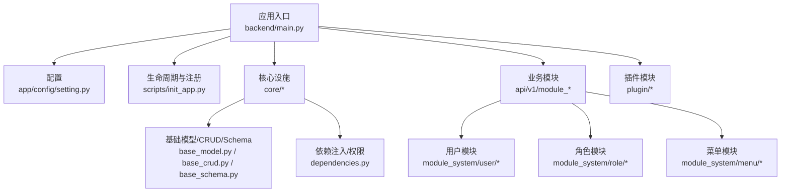
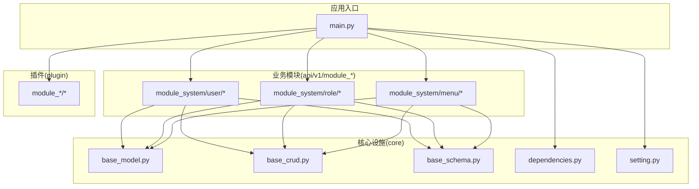
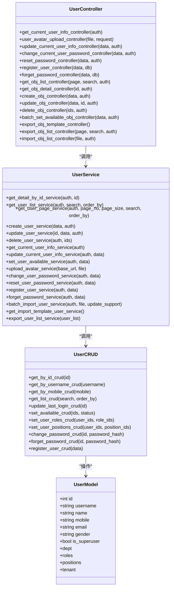
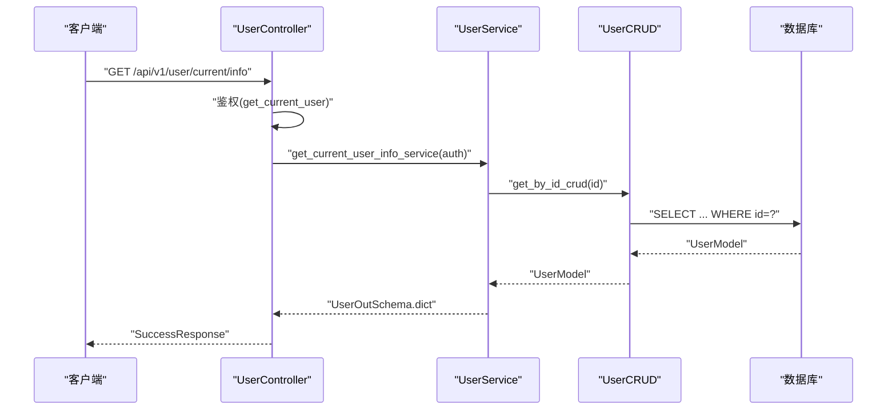
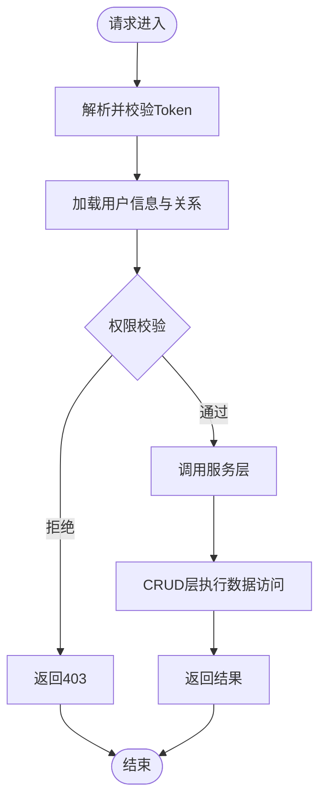
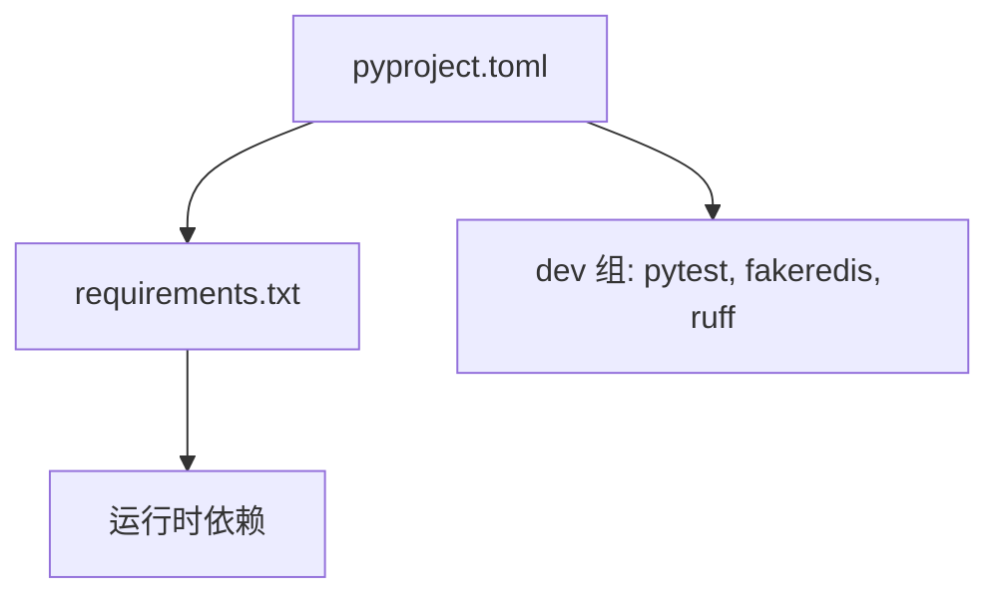

# 项目结构与分包理念

<cite>
**本文档引用的文件**
- [README.md](file://README.md)
- [main.py](file://backend/main.py)
- [setting.py](file://backend/app/config/setting.py)
- [base_crud.py](file://backend/app/core/base_crud.py)
- [base_model.py](file://backend/app/core/base_model.py)
- [base_schema.py](file://backend/app/core/base_schema.py)
- [dependencies.py](file://backend/app/core/dependencies.py)
- [controller.py](file://backend/app/api/v1/module_system/user/controller.py)
- [service.py](file://backend/app/api/v1/module_system/user/service.py)
- [crud.py](file://backend/app/api/v1/module_system/user/crud.py)
- [model.py](file://backend/app/api/v1/module_system/user/model.py)
- [schema.py](file://backend/app/api/v1/module_system/user/schema.py)
- [pyproject.toml](file://backend/pyproject.toml)
- [requirements.txt](file://backend/requirements.txt)
</cite>

## 目录
1. [引言](#引言)
2. [项目结构](#项目结构)
3. [核心组件](#核心组件)
4. [架构总览](#架构总览)
5. [详细组件分析](#详细组件分析)
6. [依赖分析](#依赖分析)
7. [性能考虑](#性能考虑)
8. [故障排除指南](#故障排除指南)
9. [结论](#结论)
10. [附录](#附录)

## 引言
本项目采用“按业务特性分包（按特性竖切）”的设计哲学，将系统划分为多个业务域（如系统管理、监控、任务、开发工具等），每个业务域内部再细分为 controller、service、crud、model、schema 等层次，形成“模块内垂直分层”的组织方式。这种设计有利于：
- 按业务边界解耦，减少跨模块耦合
- 便于团队并行开发与模块独立演进
- 降低迁移成本（模块可整体独立）

与传统的“按技术层次分包（按层分包）”相比，本项目在“第一层”坚持按业务域划分，同时在“模块内部”仍保留典型的 Controller → Service → CRUD → Model 的逻辑分层。

## 项目结构
后端工程位于 backend 目录，主要目录与职责如下：
- app：应用主体
  - api/v1：API 版本入口，按业务域划分模块（如 module_system、module_monitor、module_application、module_task 等）
  - core：核心基础设施（数据库、依赖注入、权限、日志、中间件、基础模型/CRUD/Schema 等）
  - common：通用常量、枚举、请求/响应模型
  - config：配置管理（环境变量、FastAPI 参数、数据库/Redis 连接等）
  - plugin：插件化模块（可自动发现与注册）
  - utils：工具类（加密、Excel、上传、时间、正则等）
  - scripts：初始化脚本（应用生命周期、静态文件、路由注册等）
- backend/main.py：应用入口，负责创建 FastAPI 实例、注册中间件/路由/静态文件、启动服务
- requirements.txt / pyproject.toml：依赖声明与管理

图表来源
- [main.py:16-51](file://backend/main.py#L16-L51)
- [setting.py:13-355](file://backend/app/config/setting.py#L13-L355)
- [base_crud.py:26-571](file://backend/app/core/base_crud.py#L26-L571)
- [base_model.py:21-228](file://backend/app/core/base_model.py#L21-L228)
- [base_schema.py:6-75](file://backend/app/core/base_schema.py#L6-L75)
- [dependencies.py:21-296](file://backend/app/core/dependencies.py#L21-L296)

章节来源
- [README.md:37-57](file://README.md#L37-L57)
- [main.py:16-51](file://backend/main.py#L16-L51)
- [setting.py:13-355](file://backend/app/config/setting.py#L13-L355)

## 核心组件
- 应用入口与生命周期
  - create_app：创建 FastAPI 实例，注册异常处理、中间件、路由、静态文件、API 文档重置
  - CLI 命令：run（启动服务）、revision/upgrade（Alembic 迁移）
- 配置系统
  - Settings：集中管理环境、服务器、文档、跨域、认证、数据库、Redis、验证码、OAuth、日志、Gzip、静态文件、Swagger、AI/向量库、请求限制等
  - 通过 LRU 缓存的 get_settings 提供全局单例
- 核心基础设施
  - 基础模型：MappedBase、ModelMixin、TenantMixin、UserMixin，统一字段与权限策略
  - 基础 CRUD：CRUDBase，封装 get/list/tree_list/page/create/update/delete/set/restore 等通用能力，并内置权限过滤与预加载
  - 基础 Schema：通用输出/审计/租户/用户等模型
  - 依赖注入：db_getter、redis_getter、get_current_user、AuthPermission，统一认证、权限校验与数据权限过滤
- 业务模块组织
  - 每个业务域（如 module_system/user）包含 controller.py、service.py、crud.py、model.py、schema.py，形成“模块内垂直分层”
  - 控制器负责路由与参数绑定，服务层编排业务逻辑，CRUD 层封装数据访问，Model 定义表结构，Schema 定义输入/输出模型

章节来源
- [main.py:16-106](file://backend/main.py#L16-L106)
- [setting.py:13-355](file://backend/app/config/setting.py#L13-L355)
- [base_crud.py:26-571](file://backend/app/core/base_crud.py#L26-L571)
- [base_model.py:21-228](file://backend/app/core/base_model.py#L21-L228)
- [base_schema.py:6-75](file://backend/app/core/base_schema.py#L6-L75)
- [dependencies.py:21-296](file://backend/app/core/dependencies.py#L21-L296)

## 架构总览
系统采用“按业务特性分包 + 模块内逻辑分层”的架构：
- 第一层：按业务域划分（module_system、module_monitor、module_application、module_task、module_generator 等）
- 第二层：模块内按 Controller → Service → CRUD → Model 的职责划分
- 第三层：核心设施（core）提供统一的基础设施（数据库、权限、日志、依赖注入等）
- 第四层：插件化（plugin）支持动态扩展

图表来源
- [main.py:16-51](file://backend/main.py#L16-L51)
- [base_crud.py:26-571](file://backend/app/core/base_crud.py#L26-L571)
- [base_model.py:21-228](file://backend/app/core/base_model.py#L21-L228)
- [base_schema.py:6-75](file://backend/app/core/base_schema.py#L6-L75)
- [dependencies.py:21-296](file://backend/app/core/dependencies.py#L21-L296)

## 详细组件分析

### 用户管理模块（按业务特性分包示例）
用户管理模块展示了“模块内垂直分层”的完整实现：
- controller：定义路由、参数绑定、鉴权装饰器、响应封装
- service：编排业务逻辑（如获取当前用户信息、更新用户信息、导入导出、密码处理等）
- crud：封装数据访问（增删改查、批量设置状态、设置角色/岗位等）
- model：定义表结构与关系（用户、角色、岗位、部门、租户等）
- schema：定义输入/输出模型与校验规则

图表来源
- [controller.py:30-456](file://backend/app/api/v1/module_system/user/controller.py#L30-L456)
- [service.py:35-737](file://backend/app/api/v1/module_system/user/service.py#L35-L737)
- [crud.py:18-221](file://backend/app/api/v1/module_system/user/crud.py#L18-L221)
- [model.py:64-151](file://backend/app/api/v1/module_system/user/model.py#L64-L151)

章节来源
- [controller.py:30-456](file://backend/app/api/v1/module_system/user/controller.py#L30-L456)
- [service.py:35-737](file://backend/app/api/v1/module_system/user/service.py#L35-L737)
- [crud.py:18-221](file://backend/app/api/v1/module_system/user/crud.py#L18-L221)
- [model.py:64-151](file://backend/app/api/v1/module_system/user/model.py#L64-L151)
- [schema.py:20-310](file://backend/app/api/v1/module_system/user/schema.py#L20-L310)

### API 分层架构设计
- Controller 层
  - 职责：接收请求、参数绑定、鉴权（AuthPermission）、调用服务层、封装响应
  - 特点：轻薄、可测试性强、依赖注入明确
- Service 层
  - 职责：编排业务流程、组合多个 CRUD 操作、调用外部工具（Excel、上传、密码加密等）
  - 特点：业务逻辑集中、可复用、便于单元测试
- CRUD 层
  - 职责：封装通用数据访问能力（查询、分页、树形、批量、软删除/恢复等）
  - 特点：统一权限过滤、预加载策略、异常处理
- Model 层
  - 职责：定义表结构、关系、默认加载策略、权限策略
  - 特点：继承统一 Mixin，统一字段与审计信息
- Schema 层
  - 职责：输入/输出模型、字段校验、序列化配置
  - 特点：统一时间序列化策略、审计字段、租户/用户嵌套模型

图表来源
- [controller.py:33-53](file://backend/app/api/v1/module_system/user/controller.py#L33-L53)
- [service.py:279-332](file://backend/app/api/v1/module_system/user/service.py#L279-L332)
- [crud.py:34-50](file://backend/app/api/v1/module_system/user/crud.py#L34-L50)
- [base_crud.py:43-71](file://backend/app/core/base_crud.py#L43-L71)

章节来源
- [controller.py:30-456](file://backend/app/api/v1/module_system/user/controller.py#L30-L456)
- [service.py:35-737](file://backend/app/api/v1/module_system/user/service.py#L35-L737)
- [crud.py:18-221](file://backend/app/api/v1/module_system/user/crud.py#L18-L221)
- [base_crud.py:26-571](file://backend/app/core/base_crud.py#L26-L571)

### 依赖注入与模块解耦
- 依赖注入
  - db_getter：提供 AsyncSession，事务在 Session 上下文中开启/提交
  - redis_getter：从 FastAPI 应用状态中获取 Redis 连接
  - get_current_user：解析 Token、校验在线状态、加载用户信息与角色/岗位/部门等关系
  - AuthPermission：权限校验装饰器，支持超级管理员豁免与任意权限满足
- 模块解耦
  - 控制器仅依赖服务层接口，不直接依赖 CRUD/Model
  - 服务层通过 AuthSchema 传入认证上下文，CRUD 层基于泛型与权限过滤实现统一数据访问
  - Schema 作为输入/输出契约，避免控制器与模型直接耦合

图表来源
- [dependencies.py:44-129](file://backend/app/core/dependencies.py#L44-L129)
- [dependencies.py:236-296](file://backend/app/core/dependencies.py#L236-L296)
- [base_crud.py:446-451](file://backend/app/core/base_crud.py#L446-L451)

章节来源
- [dependencies.py:21-296](file://backend/app/core/dependencies.py#L21-L296)
- [base_crud.py:26-571](file://backend/app/core/base_crud.py#L26-L571)

## 依赖分析
- 运行时依赖
  - FastAPI、SQLAlchemy 2.0、asyncpg/asyncmy、Redis、Pydantic Settings、Alembic、APScheduler、Passlib/Bcrypt、OpenAI、Pandas、PyJWT、Typer、Uvicorn 等
- 开发依赖
  - pytest、fakeredis、ruff（代码检查/格式化）
- 依赖管理
  - 生产环境使用 requirements.txt，开发环境使用 pyproject.toml 的 dev 组

图表来源
- [pyproject.toml:1-138](file://backend/pyproject.toml#L1-L138)
- [requirements.txt:1-45](file://backend/requirements.txt#L1-L45)

章节来源
- [pyproject.toml:1-138](file://backend/pyproject.toml#L1-L138)
- [requirements.txt:1-45](file://backend/requirements.txt#L1-L45)

## 性能考虑
- 数据访问
  - 基础 CRUD 提供预加载策略（selectinload）与权限过滤，避免 N+1 查询与越权访问
  - 分页查询使用主键计数优化，避免全表 COUNT
- 异步与连接池
  - SQLAlchemy 2.0 异步 ORM，连接池参数可配置（大小、超时、回收、预检）
  - Redis 异步客户端，结合 Token 滑动过期减少无效会话
- 序列化与时间
  - Pydantic v2 的 PlainSerializer 与 JSON 输出区分，避免 ORM 写入与 JSON 输出的类型不一致
- 压缩与静态资源
  - Gzip 压缩与静态文件服务可配置，Swagger/Redoc 资源路径可定制

## 故障排除指南
- 启动失败
  - 确认环境变量（ENVIRONMENT）与 .env.* 文件正确
  - 首次启动会自动初始化数据库与基础数据，无需手动执行 upgrade
- 认证失败
  - 检查 Token 格式与在线状态，确认 Redis 中存在对应会话键
  - 滑动过期开启时，频繁请求会自动续期
- 权限不足
  - 使用 AuthPermission 装饰器时，确认用户角色与菜单权限集合
  - 超级管理员可绕过权限校验
- 数据权限
  - 基础模型提供权限策略与默认加载选项，确保查询时应用数据范围过滤

章节来源
- [main.py:74-106](file://backend/main.py#L74-L106)
- [dependencies.py:44-129](file://backend/app/core/dependencies.py#L44-L129)
- [dependencies.py:236-296](file://backend/app/core/dependencies.py#L236-L296)
- [base_model.py:36-37](file://backend/app/core/base_model.py#L36-L37)
- [base_crud.py:446-451](file://backend/app/core/base_crud.py#L446-L451)

## 结论
本项目通过“按业务特性分包 + 模块内逻辑分层”的架构，实现了高内聚、低耦合的系统组织方式。模块边界清晰，便于团队协作与独立演进；核心设施统一，降低了重复实现与维护成本。配合依赖注入与权限体系，系统在安全性与可维护性方面表现良好。对于二次开发与插件扩展，项目提供了自动发现与注册机制，进一步提升了可扩展性。

## 附录
- 快速开始
  - 安装依赖：uv sync 或 pip install -r requirements.txt
  - 启动后端：uv run main.py run --env=dev
  - 访问 API 文档：http://127.0.0.1:8001/docs
- 常用命令
  - 生成迁移：uv run main.py revision --env=dev
  - 应用迁移：uv run main.py upgrade --env=dev