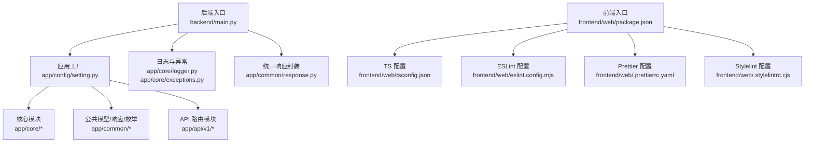
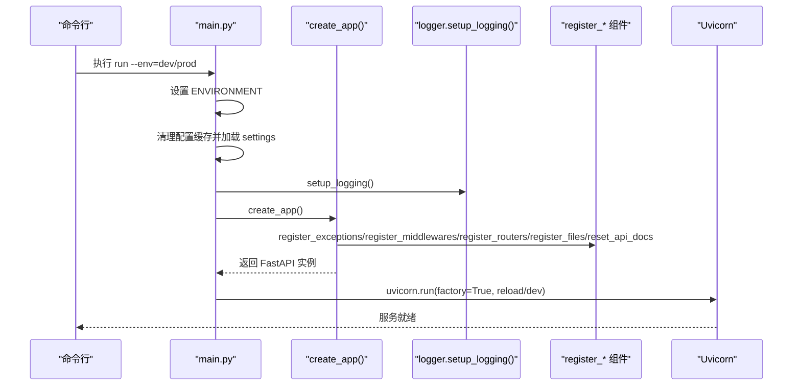
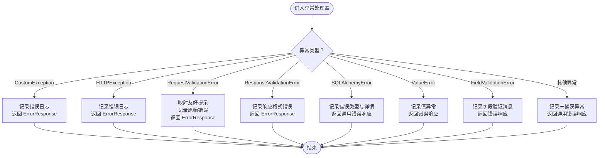
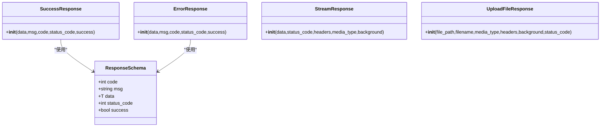
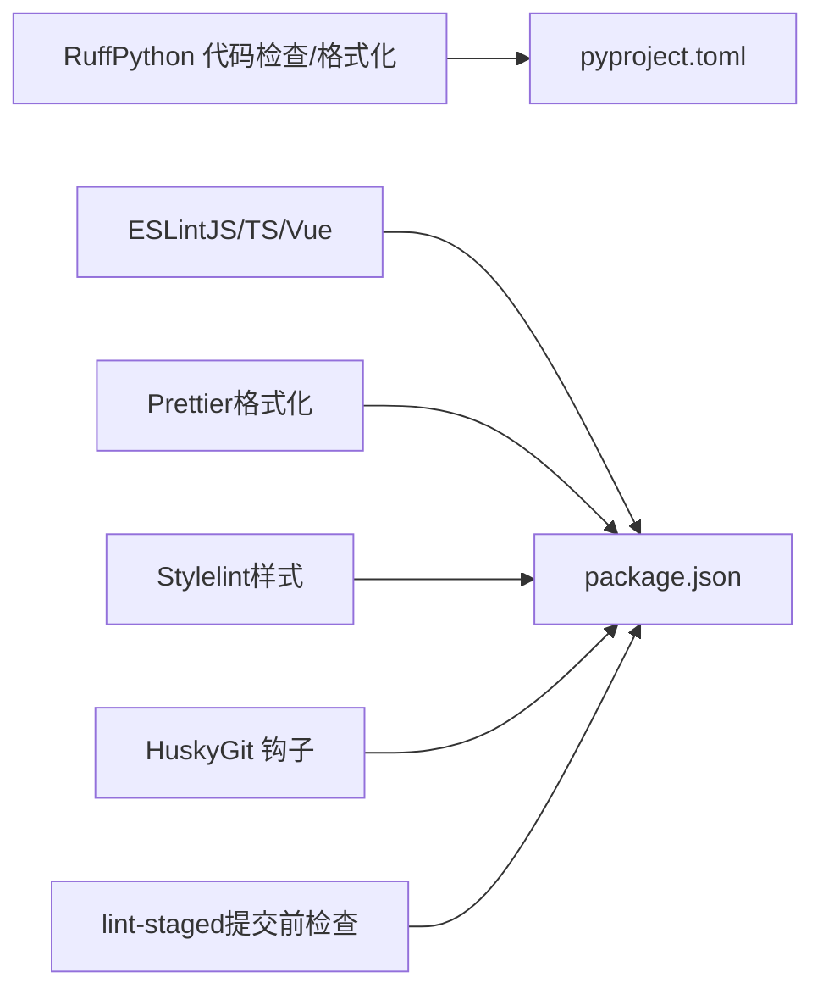

# 代码规范

<cite>
**本文引用的文件**   
- [backend/pyproject.toml](file://backend/pyproject.toml)
- [backend/main.py](file://backend/main.py)
- [backend/app/core/logger.py](file://backend/app/core/logger.py)
- [backend/app/core/exceptions.py](file://backend/app/core/exceptions.py)
- [backend/app/common/response.py](file://backend/app/common/response.py)
- [backend/app/common/enums.py](file://backend/app/common/enums.py)
- [backend/app/config/setting.py](file://backend/app/config/setting.py)
- [frontend/web/.prettierrc.yaml](file://frontend/web/.prettierrc.yaml)
- [frontend/web/eslint.config.mjs](file://frontend/web/eslint.config.mjs)
- [frontend/web/tsconfig.json](file://frontend/web/tsconfig.json)
- [frontend/web/package.json](file://frontend/web/package.json)
- [frontend/web/.stylelintrc.cjs](file://frontend/web/.stylelintrc.cjs)
- [frontend/web/.stylelintignore](file://frontend/web/.stylelintignore)
</cite>

## 目录
1. [简介](#简介)
2. [项目结构](#项目结构)
3. [核心组件](#核心组件)
4. [架构总览](#架构总览)
5. [详细组件分析](#详细组件分析)
6. [依赖分析](#依赖分析)
7. [性能考虑](#性能考虑)
8. [故障排查指南](#故障排查指南)
9. [结论](#结论)
10. [附录](#附录)

## 简介
本文件为 FastapiAdmin 项目的统一代码规范文档，覆盖后端 Python、前端 TypeScript/Vue 以及 Vue 组件开发的风格与实践，明确命名约定、缩进与注释标准、文件组织结构、格式化工具配置与使用、代码审查清单与质量检查标准、错误处理与日志规范、异常处理最佳实践，并提供面向新成员的培训指南。

## 项目结构
- 后端采用 FastAPI + SQLAlchemy 2.x 架构，模块化组织在 app/api/v1 下，核心能力通过 app/core、app/common、app/config 等目录分层。
- 前端采用 Vue 3 + TypeScript + Vite + Element Plus，样式与组件按功能域划分，遵循统一的 tsconfig 路径别名与包管理脚本。

图表来源
- [backend/main.py:1-163](file://backend/main.py#L1-L163)
- [backend/app/config/setting.py:1-355](file://backend/app/config/setting.py#L1-L355)
- [backend/app/core/logger.py:1-147](file://backend/app/core/logger.py#L1-L147)
- [backend/app/core/exceptions.py:1-248](file://backend/app/core/exceptions.py#L1-L248)
- [backend/app/common/response.py:1-176](file://backend/app/common/response.py#L1-L176)
- [frontend/web/package.json:1-205](file://frontend/web/package.json#L1-L205)
- [frontend/web/tsconfig.json:1-39](file://frontend/web/tsconfig.json#L1-L39)
- [frontend/web/eslint.config.mjs:1-88](file://frontend/web/eslint.config.mjs#L1-L88)
- [frontend/web/.prettierrc.yaml:1-42](file://frontend/web/.prettierrc.yaml#L1-L42)
- [frontend/web/.stylelintrc.cjs:1-68](file://frontend/web/.stylelintrc.cjs#L1-L68)

章节来源
- [backend/main.py:1-163](file://backend/main.py#L1-L163)
- [backend/app/config/setting.py:1-355](file://backend/app/config/setting.py#L1-L355)
- [frontend/web/package.json:1-205](file://frontend/web/package.json#L1-L205)
- [frontend/web/tsconfig.json:1-39](file://frontend/web/tsconfig.json#L1-L39)

## 核心组件
- 应用工厂与启动流程：通过 create_app() 组装日志、中间件、路由与静态资源，支持多环境 CLI 启动。
- 日志系统：基于 loguru，统一拦截标准库日志，控制台彩色输出与文件轮转，支持 JSON Lines 输出。
- 全局异常处理：覆盖自定义异常、HTTP 异常、参数/响应验证异常、数据库异常、值异常与通用异常，统一返回 ErrorResponse。
- 统一响应模型：SuccessResponse/ErrorResponse/StreamResponse/UploadFileResponse，标准化 code/msg/data/status_code/success 字段。
- 配置中心：Settings 使用 pydantic-settings，支持 .env.{env} 加载、连接池/中间件/静态文件/上传/文档等集中配置。
- 前端工具链：ESLint + Prettier + Stylelint，结合 husky/lint-staged 在提交前强制格式化与质量检查。

章节来源
- [backend/main.py:16-51](file://backend/main.py#L16-L51)
- [backend/app/core/logger.py:71-144](file://backend/app/core/logger.py#L71-L144)
- [backend/app/core/exceptions.py:57-248](file://backend/app/core/exceptions.py#L57-L248)
- [backend/app/common/response.py:26-176](file://backend/app/common/response.py#L26-L176)
- [backend/app/config/setting.py:13-355](file://backend/app/config/setting.py#L13-L355)
- [frontend/web/eslint.config.mjs:21-87](file://frontend/web/eslint.config.mjs#L21-L87)
- [frontend/web/.prettierrc.yaml:1-42](file://frontend/web/.prettierrc.yaml#L1-L42)
- [frontend/web/.stylelintrc.cjs:1-68](file://frontend/web/.stylelintrc.cjs#L1-L68)

## 架构总览
后端启动序列图（CLI → 工厂 → 日志/中间件/路由/静态资源 → Uvicorn）

图表来源
- [backend/main.py:54-107](file://backend/main.py#L54-L107)
- [backend/app/core/logger.py:71-144](file://backend/app/core/logger.py#L71-L144)

章节来源
- [backend/main.py:54-107](file://backend/main.py#L54-L107)

## 详细组件分析

### 后端：日志与异常处理
- 日志拦截：将 logging 标准库日志重定向至 loguru，统一格式与级别，支持深度追踪与异常堆栈。
- 文件轮转：info/error 分离输出，按日轮转、gzip 压缩、保留天数配置；可选 JSON Lines 文件输出。
- 异常处理：覆盖常见异常类型，统一记录日志并返回 ErrorResponse，避免泄露内部细节。

图表来源
- [backend/app/core/exceptions.py:57-248](file://backend/app/core/exceptions.py#L57-L248)
- [backend/app/common/response.py:70-102](file://backend/app/common/response.py#L70-L102)

章节来源
- [backend/app/core/logger.py:15-144](file://backend/app/core/logger.py#L15-L144)
- [backend/app/core/exceptions.py:57-248](file://backend/app/core/exceptions.py#L57-L248)
- [backend/app/common/response.py:26-176](file://backend/app/common/response.py#L26-L176)

### 后端：统一响应模型
- ResponseSchema：统一 code/msg/data/status_code/success 字段。
- SuccessResponse/ErrorResponse：基于 JSONResponse，使用 jsonable_encoder 自定义日期时间编码。
- StreamResponse/UploadFileResponse：分别用于流式下载与文件下载。

图表来源
- [backend/app/common/response.py:26-176](file://backend/app/common/response.py#L26-L176)

章节来源
- [backend/app/common/response.py:26-176](file://backend/app/common/response.py#L26-L176)

### 前端：ESLint + Prettier + Stylelint 配置
- ESLint：基础推荐 + TypeScript + Vue，忽略 node_modules/dist/public 等目录，放宽部分规则以配合 Prettier。
- Prettier：统一 printWidth、quote、semi、tabWidth、endOfLine 等规则，Vue 文件 script/style 不额外缩进。
- Stylelint：基于 standard/scss/recess-order，允许 Vue SFC 与 Tailwind 特有 at-rules。

章节来源
- [frontend/web/eslint.config.mjs:21-87](file://frontend/web/eslint.config.mjs#L21-L87)
- [frontend/web/.prettierrc.yaml:1-42](file://frontend/web/.prettierrc.yaml#L1-L42)
- [frontend/web/.stylelintrc.cjs:1-68](file://frontend/web/.stylelintrc.cjs#L1-L68)

### 前端：TS 路径别名与脚本
- tsconfig.json：严格模式、ESNext 模块解析、DOM/Iterable 库、路径别名（@/*、@views/*、@utils/* 等）。
- package.json：统一 lint 脚本，集成 lint-staged 与 husky，提交前自动格式化与校验。

章节来源
- [frontend/web/tsconfig.json:1-39](file://frontend/web/tsconfig.json#L1-L39)
- [frontend/web/package.json:28-67](file://frontend/web/package.json#L28-L67)

## 依赖分析
- 后端依赖管理：pyproject.toml 使用 ruff 进行代码检查与格式化，dev 分组包含 pytest、ruff；uv 管理索引与分组。
- 前端依赖管理：package.json 定义 lint 脚本与 lint-staged 规则，husky 提交钩子。

图表来源
- [backend/pyproject.toml:54-138](file://backend/pyproject.toml#L54-L138)
- [frontend/web/package.json:28-67](file://frontend/web/package.json#L28-L67)

章节来源
- [backend/pyproject.toml:54-138](file://backend/pyproject.toml#L54-L138)
- [frontend/web/package.json:28-67](file://frontend/web/package.json#L28-L67)

## 性能考虑
- 后端：连接池参数（pool_size/max_overflow/pool_timeout/recycle/pre_ping）与数据库类型（mysql/postgres/sqlite）需根据负载调整；Gzip 压缩与静态文件服务按需开启。
- 前端：构建产物体积可通过 rollup-plugin-visualizer 分析；按需引入组件与懒加载页面提升首屏性能。

## 故障排查指南
- 启动失败：检查 ENVIRONMENT 与 .env.{env} 文件是否存在，确认 settings.FASTAPI_CONFIG 与根路径配置。
- 日志无输出：确认 setup_logging() 是否执行，检查 LOG_DIR 是否可写，核对 LOGGER_LEVEL。
- 异常未捕获：确认 handle_exception 已注册，检查自定义异常是否正确继承 CustomException。
- 响应格式异常：确认返回类型使用 SuccessResponse/ErrorResponse/StreamResponse/UploadFileResponse。
- 前端格式化冲突：确保 VS Code 或编辑器使用 Prettier/ESLint 插件，提交前执行 pnpm lint。

章节来源
- [backend/main.py:74-106](file://backend/main.py#L74-L106)
- [backend/app/core/logger.py:71-144](file://backend/app/core/logger.py#L71-L144)
- [backend/app/core/exceptions.py:57-248](file://backend/app/core/exceptions.py#L57-L248)
- [backend/app/common/response.py:36-176](file://backend/app/common/response.py#L36-L176)
- [frontend/web/package.json:28-34](file://frontend/web/package.json#L28-L34)

## 结论
通过统一的工具链与规范约束，FastapiAdmin 在后端实现了可维护的日志与异常体系，在前端建立了可预期的格式化与质量保障机制。建议团队持续遵循本文规范，配合 CI/CD 与提交前检查，确保代码一致性与可读性。

## 附录

### 代码风格与命名约定
- Python（后端）
  - 文件与模块：小写下划线，如 app/api/v1/module_system/user/controller.py
  - 类：PascalCase，如 class CustomException
  - 函数/方法：snake_case，如 def handle_exception
  - 常量：UPPER_CASE，如 RET.OK.code
  - 类型变量：TypeVar，如 T
- TypeScript/Vue（前端）
  - 文件：小写带连字符，如 src/views/module-system/user.vue
  - 组件：PascalCase，如 FaUserCard
  - 变量/函数：camelCase，如 const userInfo
  - 常量：UPPER_CASE，如 const API_ROOT
  - 类型：PascalCase，如 interface ApiResponse

章节来源
- [backend/app/common/enums.py:1-122](file://backend/app/common/enums.py#L1-L122)
- [frontend/web/tsconfig.json:17-27](file://frontend/web/tsconfig.json#L17-L27)

### 缩进与注释标准
- Python：统一 4 空格缩进，行宽不超过 100；函数/类/模块使用三引号 docstring。
- TypeScript/Vue：统一 2 空格缩进，行宽 100；使用 JSDoc 注释接口与复杂逻辑。

章节来源
- [backend/pyproject.toml:68-138](file://backend/pyproject.toml#L68-L138)
- [frontend/web/.prettierrc.yaml:27-36](file://frontend/web/.prettierrc.yaml#L27-L36)

### 文件组织结构
- 后端
  - app/api/v1/module_{module}/controller.py、crud.py、schema.py、service.py、model.py
  - app/core/*（中间件、异常、日志、权限等）
  - app/common/*（枚举、常量、响应、请求/响应模型）
  - app/config/*（配置、路径）
- 前端
  - src/views/module_*/* 与 src/components/* 按功能域划分
  - src/utils/*、src/store/*、src/hooks/*、src/enums/*、src/types/*

章节来源
- [backend/app/api/v1/module_system/user/controller.py](file://backend/app/api/v1/module_system/user/controller.py)
- [frontend/web/src/views/module_system/user.vue](file://frontend/web/src/views/module_system/user.vue)

### 格式化工具配置与使用
- 后端
  - ruff：行宽 100，缩进 4，自动修复，忽略目录与特定规则
  - Black：ruff 已覆盖行长度，无需单独配置
- 前端
  - Prettier：printWidth 100，quote 与 semi 开启，tabWidth 2
  - ESLint：基础推荐 + TS + Vue，与 Prettier 协同
  - Stylelint：standard/scss/recess-order，允许 Vue/Tailwind 特有 at-rules

章节来源
- [backend/pyproject.toml:68-138](file://backend/pyproject.toml#L68-L138)
- [frontend/web/.prettierrc.yaml:1-42](file://frontend/web/.prettierrc.yaml#L1-L42)
- [frontend/web/eslint.config.mjs:21-87](file://frontend/web/eslint.config.mjs#L21-L87)
- [frontend/web/.stylelintrc.cjs:1-68](file://frontend/web/.stylelintrc.cjs#L1-L68)

### 代码审查清单与质量检查标准
- 后端
  - 通过 ruff 检查语法与风格，必要时手动修正
  - 异常处理完整，日志记录包含关键上下文
  - 响应统一使用 SuccessResponse/ErrorResponse
  - 配置项通过 Settings 校验，敏感信息放入 .env.{env}
- 前端
  - 通过 ESLint/Stylelint/Prettier 检查
  - 提交前执行 pnpm lint，确保无警告/错误
  - 组件命名与路径别名一致，避免硬编码路径

章节来源
- [backend/pyproject.toml:104-126](file://backend/pyproject.toml#L104-L126)
- [frontend/web/package.json:28-34](file://frontend/web/package.json#L28-L34)

### 错误处理规范与异常处理最佳实践
- 统一异常基类 CustomException，明确 code/msg/status_code/data/success
- 全局异常处理器 handle_exception，覆盖常见异常类型
- 响应层使用 ErrorResponse，避免直接抛出异常给客户端
- 日志记录异常类型与上下文，生产环境不暴露内部细节

章节来源
- [backend/app/core/exceptions.py:15-248](file://backend/app/core/exceptions.py#L15-L248)
- [backend/app/common/response.py:70-102](file://backend/app/common/response.py#L70-L102)
- [backend/app/core/logger.py:80-140](file://backend/app/core/logger.py#L80-L140)

### 日志记录规范
- 控制台：彩色输出，包含时间、级别、调用位置与消息
- 文件：info.log 与 error.log 分离，按日轮转、gzip 压缩、保留 30 天
- 标准库：拦截并统一转发，第三方库日志统一接管
- JSON Lines：可选开启，便于日志平台采集

章节来源
- [backend/app/core/logger.py:71-144](file://backend/app/core/logger.py#L71-L144)
- [backend/app/config/setting.py:147-152](file://backend/app/config/setting.py#L147-L152)

### Vue 组件开发规范
- 组件命名：PascalCase，如 FaUserCard.vue
- 路径别名：统一使用 @views/@components/@utils 等别名
- 样式：优先使用 scoped 与 CSS Modules，避免全局污染
- 交互：使用 Composition API，保持单一职责

章节来源
- [frontend/web/tsconfig.json:17-27](file://frontend/web/tsconfig.json#L17-L27)

### 新成员培训指南
- 环境准备：安装 Python 3.10+、Node.js 20+、pnpm，阅读 README 了解项目背景
- 后端入门：运行 python main.py run --env=dev，理解 create_app 流程与配置加载
- 前端入门：pnpm install，pnpm dev，修改 .prettierrc.yaml 或 eslint.config.mjs 前先与团队沟通
- 提交规范：使用 pnpm lint，确保 husky 钩子生效，遵循 commitizen 提交信息格式
- 常见问题：启动失败检查 .env.dev/.env.prod，日志无输出检查 LOG_DIR 权限

章节来源
- [backend/main.py:54-107](file://backend/main.py#L54-L107)
- [frontend/web/package.json:24-34](file://frontend/web/package.json#L24-L34)
- [frontend/web/eslint.config.mjs:21-33](file://frontend/web/eslint.config.mjs#L21-L33)