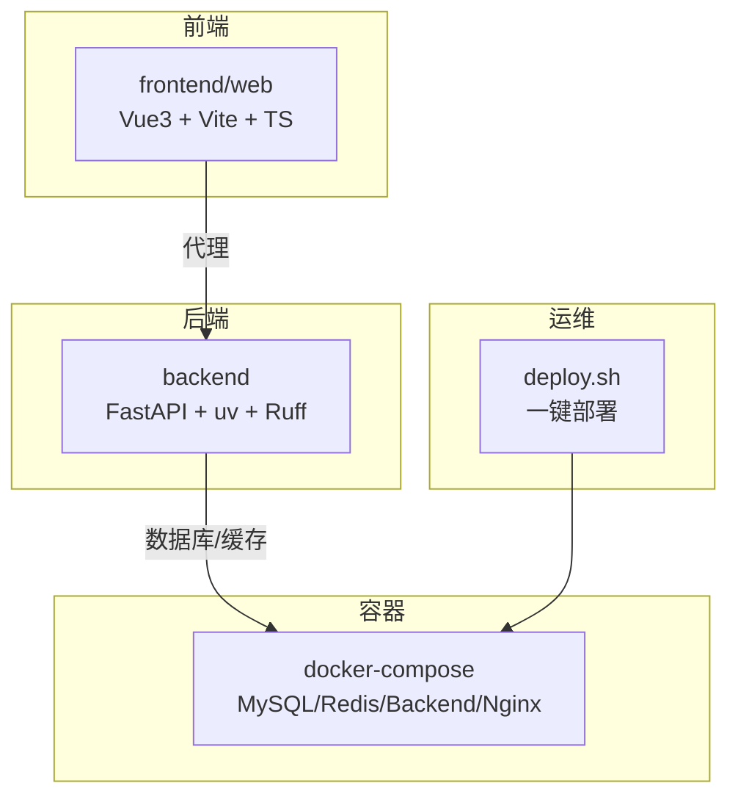
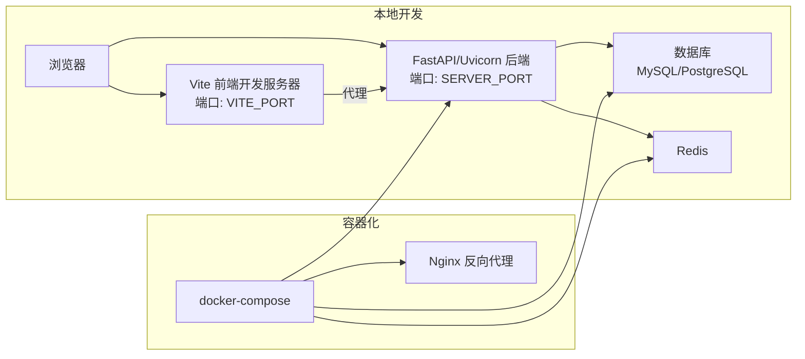
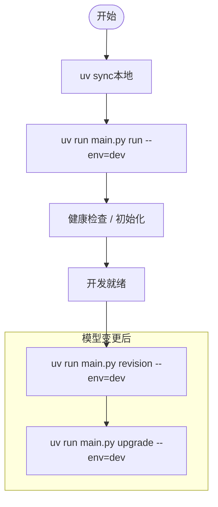
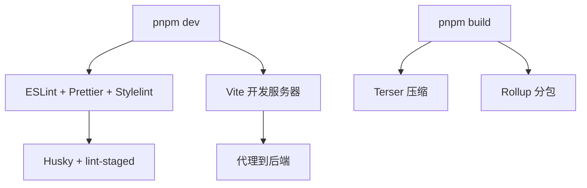
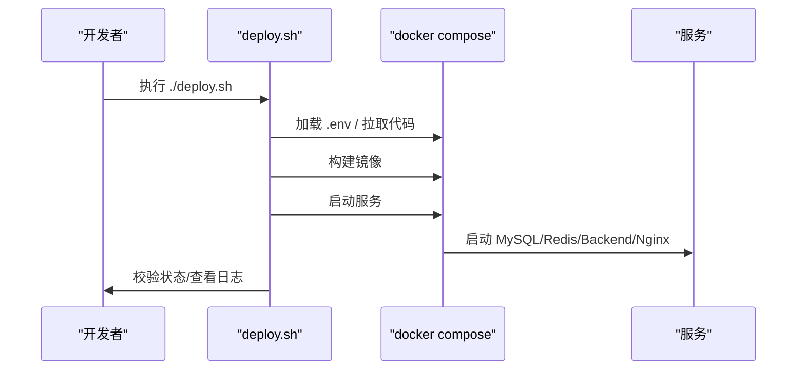
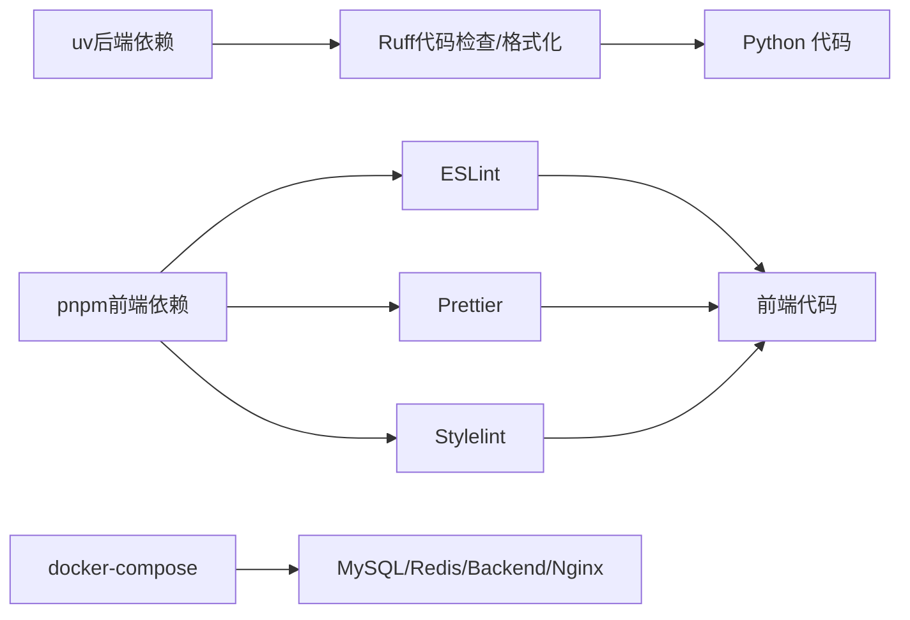

# 开发工具

<cite>
**本文引用的文件**
- [README.md](file://README.md)
- [pyproject.toml](file://backend/pyproject.toml)
- [requirements.txt](file://backend/requirements.txt)
- [docker-compose.yaml](file://docker/docker-compose.yaml)
- [run_linux.sh](file://backend/run_linux.sh)
- [run_win.bat](file://backend/run_win.bat)
- [deploy.sh](file://deploy.sh)
- [package.json](file://frontend/web/package.json)
- [.prettierrc.yaml](file://frontend/web/.prettierrc.yaml)
- [eslint.config.mjs](file://frontend/web/eslint.config.mjs)
- [tsconfig.json](file://frontend/web/tsconfig.json)
- [vite.config.ts](file://frontend/web/vite.config.ts)
- [setting.py](file://backend/app/config/setting.py)
- [path_conf.py](file://backend/app/config/path_conf.py)
</cite>

## 目录
1. [简介](#简介)
2. [项目结构](#项目结构)
3. [核心组件](#核心组件)
4. [架构总览](#架构总览)
5. [详细组件分析](#详细组件分析)
6. [依赖关系分析](#依赖关系分析)
7. [性能考虑](#性能考虑)
8. [故障排查指南](#故障排查指南)
9. [结论](#结论)
10. [附录](#附录)

## 简介
本文件面向 FastapiAdmin 项目的开发者，系统性梳理开发工具链与工程化实践，覆盖 IDE 配置、调试与性能分析、容器化与多环境管理、Git 工作流与协作、代码生成器、数据库与 API 测试工具，以及效率优化建议。内容以仓库现有配置与脚本为依据，确保可落地、可复用。

## 项目结构
- 后端工程（FastAPI + Python）位于 backend，使用 uv 管理依赖与运行，Ruff 作为代码检查与格式化工具。
- 前端工程位于 frontend/web，采用 Vue3 + Vite + TypeScript，集成 ESLint、Prettier、Stylelint、Husky、lint-staged 等质量保障工具。
- 容器化部署位于 docker，使用 docker-compose 编排 MySQL、Redis、后端、Nginx 四个服务。
- 一键部署脚本 deploy.sh 提供完整的拉取、构建、启动、校验与日志查看流程。

图表来源
- [docker-compose.yaml:9-201](file://docker/docker-compose.yaml#L9-L201)
- [run_linux.sh:105-138](file://backend/run_linux.sh#L105-L138)
- [run_win.bat:84-99](file://backend/run_win.bat#L84-L99)
- [deploy.sh:137-150](file://deploy.sh#L137-L150)

章节来源
- [README.md:96-115](file://README.md#L96-L115)
- [docker/docker-compose.yaml:1-201](file://docker/docker-compose.yaml#L1-L201)
- [backend/pyproject.toml:1-138](file://backend/pyproject.toml#L1-L138)
- [frontend/web/package.json:1-205](file://frontend/web/package.json#L1-L205)

## 核心组件
- 后端依赖与工具
  - 依赖管理：uv（本地同步含 dev 组，生产 pip 安装不含 dev 组）
  - 代码检查与格式化：Ruff（lint/format/fix/show-fixes）
  - 运行与迁移：uv run main.py run、Alembic 迁移命令
- 前端质量体系
  - 包管理：pnpm（engines 要求 Node >= 20）
  - Lint：ESLint + TypeScript ESLint + Vue 插件
  - 格式化：Prettier（.prettierrc.yaml）
  - 样式：Stylelint（配置文件存在）
  - Git Hooks：Husky + lint-staged
- 容器化与部署
  - docker-compose：MySQL/Redis/Backend/Nginx 编排
  - deploy.sh：一键拉取、构建、启动、校验、日志查看
- 开发脚本
  - run_linux.sh / run_win.bat：数据库检查/创建、迁移生成/应用、清理与删除数据库、初始化 SQL 数据等

章节来源
- [backend/pyproject.toml:54-138](file://backend/pyproject.toml#L54-L138)
- [backend/requirements.txt:1-45](file://backend/requirements.txt#L1-L45)
- [frontend/web/package.json:7-34](file://frontend/web/package.json#L7-L34)
- [frontend/web/.prettierrc.yaml:1-42](file://frontend/web/.prettierrc.yaml#L1-L42)
- [frontend/web/eslint.config.mjs:1-88](file://frontend/web/eslint.config.mjs#L1-L88)
- [frontend/web/tsconfig.json:1-39](file://frontend/web/tsconfig.json#L1-L39)
- [docker/docker-compose.yaml:1-201](file://docker/docker-compose.yaml#L1-L201)
- [deploy.sh:1-175](file://deploy.sh#L1-L175)
- [backend/run_linux.sh:105-339](file://backend/run_linux.sh#L105-L339)
- [backend/run_win.bat:84-234](file://backend/run_win.bat#L84-L234)

## 架构总览
下图展示本地开发与容器化部署的典型路径，涵盖前端代理、后端服务、数据库与缓存、Nginx 反向代理，以及一键部署流程。

图表来源
- [README.md:117-156](file://README.md#L117-L156)
- [docker/docker-compose.yaml:9-201](file://docker/docker-compose.yaml#L9-L201)
- [frontend/web/vite.config.ts:64-71](file://frontend/web/vite.config.ts#L64-L71)
- [backend/app/config/setting.py:31-32](file://backend/app/config/setting.py#L31-L32)

章节来源
- [README.md:117-156](file://README.md#L117-L156)
- [docker/docker-compose.yaml:9-201](file://docker/docker-compose.yaml#L9-L201)
- [frontend/web/vite.config.ts:64-71](file://frontend/web/vite.config.ts#L64-L71)
- [backend/app/config/setting.py:31-32](file://backend/app/config/setting.py#L31-L32)

## 详细组件分析

### 后端工具链（uv + Ruff + Alembic）
- 依赖管理
  - 本地：uv sync（默认包含 dev 组，含 pytest、ruff、fakeredis）
  - 生产：pip -r requirements.txt（不含 dev 组）
- 代码质量
  - Ruff：启用 fix、show-fixes；排除大量缓存与 IDE 目录；lint 规则集合包含 F/E/W/UP 等
  - 格式化：Prettier（前端）与 Ruff 格式化策略互补
- 运行与迁移
  - 启动：uv run main.py run --env=dev（首次启动自动初始化库表与基础数据）
  - 迁移：revision / upgrade（仅在模型变更时使用）

图表来源
- [backend/pyproject.toml:61-62](file://backend/pyproject.toml#L61-L62)
- [backend/run_linux.sh:140-164](file://backend/run_linux.sh#L140-L164)
- [backend/run_win.bat:101-113](file://backend/run_win.bat#L101-L113)

章节来源
- [backend/pyproject.toml:54-138](file://backend/pyproject.toml#L54-L138)
- [backend/requirements.txt:1-45](file://backend/requirements.txt#L1-L45)
- [backend/run_linux.sh:140-164](file://backend/run_linux.sh#L140-L164)
- [backend/run_win.bat:101-113](file://backend/run_win.bat#L101-L113)

### 前端工具链（Vite + ESLint + Prettier + Stylelint + Husky）
- 包管理与脚本
  - pnpm（engines 要求 Node >= 20）
  - scripts：dev/build/lint/type-check/preview 等
- Lint 与格式化
  - ESLint + TypeScript ESLint + Vue 插件；忽略路径与全局变量配置
  - Prettier：宽度、引号、分号、换行等策略
  - Stylelint：样式文件检查
- Git Hooks
  - Husky + lint-staged：提交前自动格式化与修复
- 构建优化
  - Terser 压缩、Rollup 分包策略、动态导入、依赖预优化

图表来源
- [frontend/web/package.json:7-34](file://frontend/web/package.json#L7-L34)
- [frontend/web/eslint.config.mjs:22-87](file://frontend/web/eslint.config.mjs#L22-L87)
- [frontend/web/.prettierrc.yaml:1-42](file://frontend/web/.prettierrc.yaml#L1-L42)
- [frontend/web/vite.config.ts:86-173](file://frontend/web/vite.config.ts#L86-L173)
- [frontend/web/vite.config.ts:208-261](file://frontend/web/vite.config.ts#L208-L261)

章节来源
- [frontend/web/package.json:1-205](file://frontend/web/package.json#L1-L205)
- [frontend/web/eslint.config.mjs:1-88](file://frontend/web/eslint.config.mjs#L1-L88)
- [frontend/web/.prettierrc.yaml:1-42](file://frontend/web/.prettierrc.yaml#L1-L42)
- [frontend/web/tsconfig.json:1-39](file://frontend/web/tsconfig.json#L1-L39)
- [frontend/web/vite.config.ts:1-292](file://frontend/web/vite.config.ts#L1-L292)

### 容器化与多环境管理
- docker-compose
  - MySQL/Redis/Backend/Nginx 服务编排，健康检查与资源限制
  - 环境变量注入（如数据库、Redis 密码、端口映射）
- 一键部署
  - deploy.sh：加载 .env、拉取代码、构建镜像、启动服务、校验、查看日志、清理缓存
- 本地开发脚本
  - run_linux.sh / run_win.bat：数据库检查/创建、迁移、清理/删除数据库、初始化 SQL 数据

图表来源
- [deploy.sh:25-102](file://deploy.sh#L25-L102)
- [docker/docker-compose.yaml:9-201](file://docker/docker-compose.yaml#L9-L201)

章节来源
- [docker/docker-compose.yaml:1-201](file://docker/docker-compose.yaml#L1-L201)
- [deploy.sh:1-175](file://deploy.sh#L1-L175)
- [backend/run_linux.sh:105-339](file://backend/run_linux.sh#L105-L339)
- [backend/run_win.bat:84-234](file://backend/run_win.bat#L84-L234)

### Git 工作流与 GitHub 协作
- 仓库与分支
  - 支持 Gitee/GitHub 两处仓库；一键部署脚本默认拉取 Gitee 仓库
- 提交与规范
  - commitizen + cz-git：规范化提交信息
  - husky + lint-staged：提交前自动修复与格式化
- 分支与协作
  - 建议采用 feature/bugfix/hotfix 分支策略，结合 Pull Request 审查与自动化校验

章节来源
- [deploy.sh:77-81](file://deploy.sh#L77-L81)
- [frontend/web/package.json:37-40](file://frontend/web/package.json#L37-L40)
- [frontend/web/package.json:24-34](file://frontend/web/package.json#L24-L34)

### 代码生成器与数据库工具
- 代码生成器
  - 项目内置“代码生成”模块，可基于数据库表结构自动生成前后端代码骨架
  - 生成文件结构与使用步骤详见项目文档
- 数据库工具
  - 首次启动自动初始化库表与基础数据
  - 模型变更时使用 Alembic 生成/应用迁移
  - 开发脚本提供数据库检查/创建、清理/删除、初始化 SQL 数据等功能

章节来源
- [README.md:464-530](file://README.md#L464-L530)
- [backend/run_linux.sh:140-339](file://backend/run_linux.sh#L140-L339)
- [backend/run_win.bat:101-234](file://backend/run_win.bat#L101-L234)

### API 测试工具
- 内置 API 文档
  - Swagger UI 与 ReDoc 文档地址与前缀在配置中定义
- 前端代理
  - Vite 开发服务器通过代理将 API 请求转发到后端，便于联调

章节来源
- [backend/app/config/setting.py:44-47](file://backend/app/config/setting.py#L44-L47)
- [frontend/web/vite.config.ts:64-71](file://frontend/web/vite.config.ts#L64-L71)

## 依赖关系分析
- 后端
  - uv 管理依赖与 dev 组；Ruff 作为代码质量工具；Alembic 用于数据库迁移
- 前端
  - pnpm 管理依赖；ESLint/Prettier/Stylelint 保障代码风格；Husky/lint-staged 自动化
- 容器化
  - docker-compose 编排四服务；deploy.sh 统一入口

图表来源
- [backend/pyproject.toml:54-138](file://backend/pyproject.toml#L54-L138)
- [frontend/web/package.json:121-178](file://frontend/web/package.json#L121-L178)
- [docker/docker-compose.yaml:9-201](file://docker/docker-compose.yaml#L9-L201)

章节来源
- [backend/pyproject.toml:54-138](file://backend/pyproject.toml#L54-L138)
- [frontend/web/package.json:121-178](file://frontend/web/package.json#L121-L178)
- [docker/docker-compose.yaml:9-201](file://docker/docker-compose.yaml#L9-L201)

## 性能考虑
- 后端
  - 连接池参数（大小、超时、回收）与预检（pool_pre_ping）有助于稳定高并发场景
  - Gzip 压缩与静态文件配置可降低传输体积
- 前端
  - Terser 压缩与 Rollup 分包策略减少首屏体积
  - 依赖预优化（optimizeDeps.include）缩短冷启动时间
- 容器化
  - 服务健康检查与资源限制（memory/cpus）提升稳定性与资源利用率

章节来源
- [backend/app/config/setting.py:86-95](file://backend/app/config/setting.py#L86-L95)
- [backend/app/config/setting.py:167-170](file://backend/app/config/setting.py#L167-L170)
- [frontend/web/vite.config.ts:86-173](file://frontend/web/vite.config.ts#L86-L173)
- [frontend/web/vite.config.ts:208-261](file://frontend/web/vite.config.ts#L208-L261)
- [docker/docker-compose.yaml:42-87](file://docker/docker-compose.yaml#L42-L87)

## 故障排查指南
- 后端
  - 数据库未创建：run_linux.sh/run_win.bat 会检查并创建数据库；确认 .env.dev 中数据库配置正确
  - 迁移问题：模型变更后使用 revision/upgrade；如需重置迁移记录可使用脚本提供的重置功能
  - 启动失败：查看容器日志（deploy.sh logs）或本地日志（uv run main.py run --env=dev）
- 前端
  - Lint 错误：执行 pnpm run lint 或修复 .eslintrc-auto-import.json 引用
  - 代理不通：检查 VITE_APP_BASE_API 与 VITE_API_BASE_URL 配置
- 容器化
  - 服务未健康：等待健康检查或查看 docker compose ps/logs
  - 端口冲突：调整 .env 中端口映射

章节来源
- [backend/run_linux.sh:105-339](file://backend/run_linux.sh#L105-L339)
- [backend/run_win.bat:84-234](file://backend/run_win.bat#L84-L234)
- [deploy.sh:110-128](file://deploy.sh#L110-L128)
- [frontend/web/vite.config.ts:64-71](file://frontend/web/vite.config.ts#L64-L71)
- [frontend/web/eslint.config.mjs:16-19](file://frontend/web/eslint.config.mjs#L16-L19)

## 结论
本项目在工具链层面实现了前后端一体化的质量保障与工程化能力：后端以 uv + Ruff + Alembic 为核心，前端以 Vite + ESLint/Prettier/Stylelint + Husky 为基础，容器化通过 docker-compose 与一键部署脚本实现标准化交付。结合本文的配置解读与最佳实践建议，开发者可快速建立高效、稳定的开发与运维流水线。

## 附录
- IDE 推荐与插件
  - VS Code：Python（uv/虚拟环境）、ESLint、Prettier、Vue Language Features、Tailwind CSS IntelliSense、Docker、Remote - SSH（远程开发）
  - WebStorm：TypeScript、ESLint、Prettier、Vue、Docker、Database Tools
- 调试与性能分析
  - 后端：使用 uv run main.py run --env=dev 启动，结合日志与 API 文档定位问题
  - 前端：Vite DevTools（仅开发启用），结合浏览器 Network/Performance 面板
  - 容器：docker compose logs/ps，观察健康检查与资源占用
- Git 工作流
  - 使用 commitizen + cz-git 生成规范提交信息；Husky + lint-staged 在提交前自动修复
- 代码生成器与数据库工具
  - 使用内置代码生成模块生成 CRUD 代码；模型变更后使用 Alembic 迁移
- API 测试
  - 使用 Swagger UI 与 ReDoc 进行接口测试与联调

章节来源
- [frontend/web/package.json:147-177](file://frontend/web/package.json#L147-L177)
- [frontend/web/vite.config.ts:205-207](file://frontend/web/vite.config.ts#L205-L207)
- [backend/app/config/setting.py:44-47](file://backend/app/config/setting.py#L44-L47)
- [README.md:464-530](file://README.md#L464-L530)