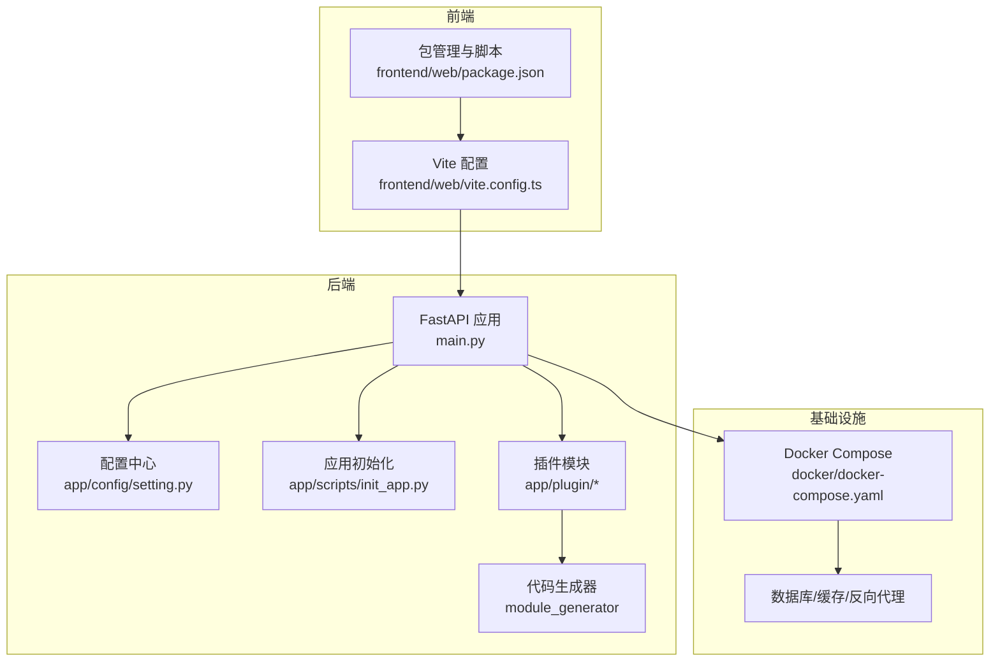
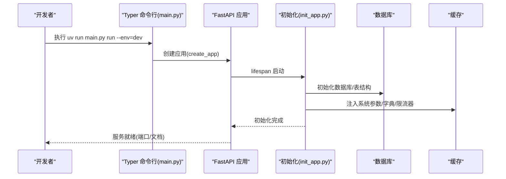
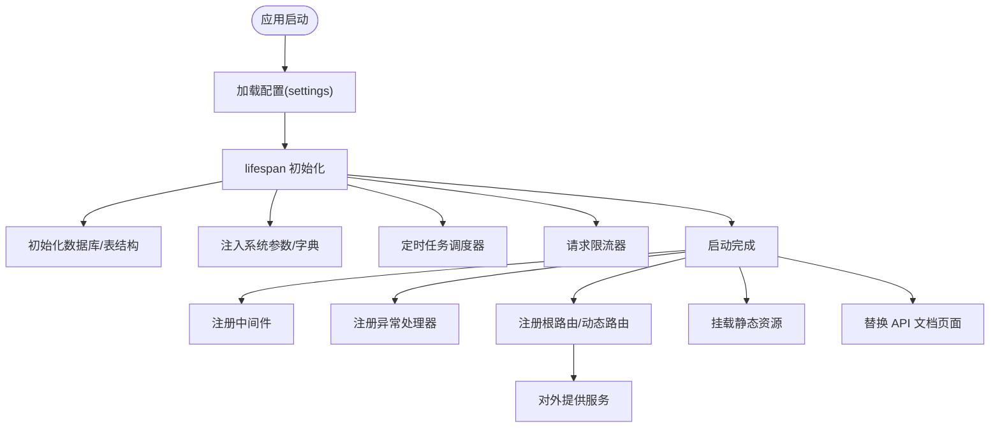
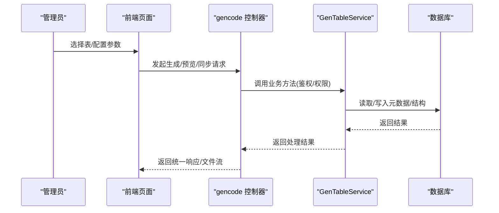
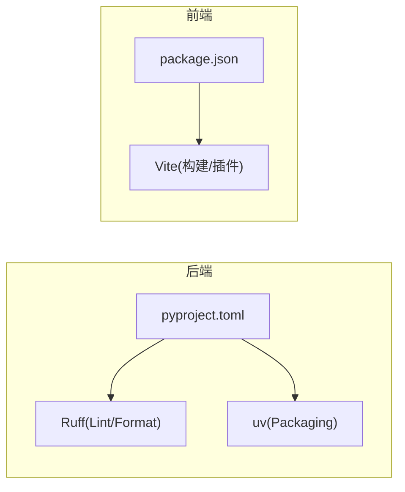

# 开发指南

<cite>
**本文引用的文件**
- [README.md](file://README.md)
- [backend/pyproject.toml](file://backend/pyproject.toml)
- [backend/main.py](file://backend/main.py)
- [backend/app/config/setting.py](file://backend/app/config/setting.py)
- [backend/app/scripts/init_app.py](file://backend/app/scripts/init_app.py)
- [backend/app/plugin/module_generator/plugin.toml](file://backend/app/plugin/module_generator/plugin.toml)
- [backend/app/plugin/module_generator/gencode/controller.py](file://backend/app/plugin/module_generator/gencode/controller.py)
- [frontend/web/package.json](file://frontend/web/package.json)
- [frontend/web/vite.config.ts](file://frontend/web/vite.config.ts)
- [docker/docker-compose.yaml](file://docker/docker-compose.yaml)
- [backend/run_linux.sh](file://backend/run_linux.sh)
- [backend/tests/test_main.py](file://backend/tests/test_main.py)
</cite>

## 目录
1. [简介](#简介)
2. [项目结构](#项目结构)
3. [核心组件](#核心组件)
4. [架构总览](#架构总览)
5. [详细组件分析](#详细组件分析)
6. [依赖分析](#依赖分析)
7. [性能考虑](#性能考虑)
8. [故障排查指南](#故障排查指南)
9. [结论](#结论)
10. [附录](#附录)

## 简介
本开发指南面向 FastapiAdmin 项目的开发者，覆盖从需求分析、开发、测试、代码审查、工具链配置、性能分析、代码生成器使用与自定义模板、版本与分支管理、发布流程，到团队协作与 CI/CD 的全流程实践。文档以仓库现有实现为依据，结合后端 FastAPI、前端 Vue3、数据库与缓存、Docker 容器化部署等技术栈，提供可落地的开发与运维建议。

## 项目结构
FastapiAdmin 采用前后端分离架构，后端使用 FastAPI + SQLAlchemy + Alembic，前端使用 Vue3 + Vite + TypeScript + Element Plus。项目通过插件化架构实现模块化扩展，内置代码生成器模块，支持基于数据库表结构自动生成前后端代码骨架。

图表来源
- [backend/main.py:16-51](file://backend/main.py#L16-L51)
- [backend/app/config/setting.py:13-355](file://backend/app/config/setting.py#L13-L355)
- [backend/app/scripts/init_app.py:27-94](file://backend/app/scripts/init_app.py#L27-L94)
- [frontend/web/vite.config.ts:49-287](file://frontend/web/vite.config.ts#L49-L287)
- [docker/docker-compose.yaml:9-201](file://docker/docker-compose.yaml#L9-L201)

章节来源
- [README.md:96-115](file://README.md#L96-L115)
- [backend/main.py:16-51](file://backend/main.py#L16-L51)
- [frontend/web/vite.config.ts:49-287](file://frontend/web/vite.config.ts#L49-L287)
- [docker/docker-compose.yaml:9-201](file://docker/docker-compose.yaml#L9-L201)

## 核心组件
- 应用入口与命令行工具：通过 Typer 提供 run/revision/upgrade 等命令，支持按环境启动服务与数据库迁移。
- 配置中心：集中管理服务器、数据库、Redis、JWT、文档、静态资源、压缩、限流等配置，并提供动态构造连接串与 FastAPI 关键参数。
- 应用生命周期与组件注册：在 lifespan 中完成数据库初始化、全局事件加载、系统参数与字典注入、定时任务调度器、请求限流器初始化；统一注册中间件、异常处理器、根路由与静态资源。
- 插件化架构：自动发现与注册插件模块路由，支持模块内多层级嵌套与权限控制。
- 代码生成器：提供数据库表导入、业务表管理、代码生成、差异预览与同步等功能，支持批量生成与本地输出。

章节来源
- [backend/main.py:54-162](file://backend/main.py#L54-L162)
- [backend/app/config/setting.py:13-355](file://backend/app/config/setting.py#L13-L355)
- [backend/app/scripts/init_app.py:27-226](file://backend/app/scripts/init_app.py#L27-L226)
- [backend/app/plugin/module_generator/plugin.toml:1-9](file://backend/app/plugin/module_generator/plugin.toml#L1-L9)
- [backend/app/plugin/module_generator/gencode/controller.py:24-363](file://backend/app/plugin/module_generator/gencode/controller.py#L24-L363)

## 架构总览
后端通过 Typer 命令行入口启动 Uvicorn 服务，加载配置与中间件，注册路由与静态资源，并在 lifespan 中完成数据库、Redis、定时任务与限流器初始化。前端通过 Vite 开发服务器代理后端 API，构建生产包并按需拆分代码块。Docker Compose 提供 MySQL、Redis、后端与 Nginx 的编排。

图表来源
- [backend/main.py:59-106](file://backend/main.py#L59-L106)
- [backend/app/scripts/init_app.py:27-94](file://backend/app/scripts/init_app.py#L27-L94)

章节来源
- [backend/main.py:59-106](file://backend/main.py#L59-L106)
- [backend/app/scripts/init_app.py:27-94](file://backend/app/scripts/init_app.py#L27-L94)

## 详细组件分析

### 后端应用生命周期与组件注册
- 生命周期管理：在 lifespan 中完成数据库初始化、全局事件加载、系统参数与字典注入、定时任务调度器、请求限流器初始化，并在关闭时优雅释放资源。
- 中间件注册：根据配置动态启用 CORS、请求日志、Gzip 压缩等中间件。
- 异常处理：统一注册异常处理器。
- 路由注册：包含通用、应用、系统、监控模块根路由，并动态注册插件模块路由；WebSocket 路由单独注册。
- 静态资源与文档：挂载静态目录，替换 Swagger UI、ReDoc 与自定义文档页面。

图表来源
- [backend/app/scripts/init_app.py:27-226](file://backend/app/scripts/init_app.py#L27-L226)
- [backend/app/config/setting.py:227-355](file://backend/app/config/setting.py#L227-L355)

章节来源
- [backend/app/scripts/init_app.py:27-226](file://backend/app/scripts/init_app.py#L27-L226)
- [backend/app/config/setting.py:227-355](file://backend/app/config/setting.py#L227-L355)

### 代码生成器工作流
- 功能范围：导入数据库表、管理业务表、生成前后端代码、预览与差异预览、同步数据库结构。
- 控制器职责：定义路由、鉴权与权限校验、调用服务层、返回统一响应。
- 服务层职责：封装业务逻辑，如分页查询、导入表、生成代码、差异预览与同步。

图表来源
- [backend/app/plugin/module_generator/gencode/controller.py:24-363](file://backend/app/plugin/module_generator/gencode/controller.py#L24-L363)
- [backend/app/plugin/module_generator/plugin.toml:1-9](file://backend/app/plugin/module_generator/plugin.toml#L1-L9)

章节来源
- [backend/app/plugin/module_generator/gencode/controller.py:24-363](file://backend/app/plugin/module_generator/gencode/controller.py#L24-L363)
- [backend/app/plugin/module_generator/plugin.toml:1-9](file://backend/app/plugin/module_generator/plugin.toml#L1-L9)

### 前端开发与构建
- 开发服务器：通过 Vite 提供热更新与代理，代理目标由环境变量配置。
- 构建优化：按需拆分第三方库与业务代码，设置压缩与产物命名策略。
- 依赖与脚本：使用 pnpm 管理依赖，提供开发、构建、预览、类型检查、Lint 等脚本。

章节来源
- [frontend/web/vite.config.ts:49-287](file://frontend/web/vite.config.ts#L49-L287)
- [frontend/web/package.json:7-34](file://frontend/web/package.json#L7-L34)

### Docker 编排与部署
- 服务编排：MySQL、Redis、后端、Nginx 四个服务，定义健康检查与资源限制。
- 端口映射：后端、数据库、Redis、HTTP/HTTPS 端口均可通过环境变量配置。
- 挂载与持久化：MySQL/Redis 数据目录绑定宿主机，后端挂载源码实现热更新。

章节来源
- [docker/docker-compose.yaml:9-201](file://docker/docker-compose.yaml#L9-L201)

## 依赖分析
- 后端依赖管理：使用 pyproject.toml 管理依赖与 dev 分组，Ruff 作为 Lint/格式化工具，uv 作为包管理与索引配置。
- 前端依赖管理：使用 package.json 管理依赖与脚本，Vite 插件体系提供自动导入、组件按需、样式优化与压缩。
- 运行时与工具链：后端支持 uv 与传统 pip/venv；前端使用 pnpm；Docker Compose 提供容器化运行。

图表来源
- [backend/pyproject.toml:68-138](file://backend/pyproject.toml#L68-L138)
- [frontend/web/package.json:68-178](file://frontend/web/package.json#L68-L178)

章节来源
- [backend/pyproject.toml:68-138](file://backend/pyproject.toml#L68-L138)
- [frontend/web/package.json:68-178](file://frontend/web/package.json#L68-L178)

## 性能考虑
- 后端性能
  - 异步数据库驱动：根据配置选择 asyncmy/asyncpg/aiosqlite，提升高并发场景吞吐。
  - 连接池与预检：合理设置连接池大小、超时与回收策略，开启预检以减少失效连接。
  - 压缩与限流：按需启用 Gzip 压缩与请求限流，降低带宽与保护服务。
  - 定时任务：通过 APScheduler 管理异步任务，结合 Redis 保障一致性。
- 前端性能
  - 代码分割：按第三方库与业务模块拆分 chunk，减少首屏体积。
  - 压缩与产物命名：生产构建启用 Terser 压缩与哈希命名，利于缓存。
  - 依赖优化：预优化常用依赖，减少冷启动时间。
- 基础设施
  - Docker 资源限制：为各服务设置内存与 CPU 限制，避免资源争抢。
  - 健康检查：为数据库、缓存、后端与 Nginx 配置健康检查，保障可用性。

章节来源
- [backend/app/config/setting.py:82-114](file://backend/app/config/setting.py#L82-L114)
- [backend/app/config/setting.py:227-355](file://backend/app/config/setting.py#L227-L355)
- [frontend/web/vite.config.ts:86-173](file://frontend/web/vite.config.ts#L86-L173)
- [docker/docker-compose.yaml:41-141](file://docker/docker-compose.yaml#L41-L141)

## 故障排查指南
- 启动失败
  - 检查环境变量与配置文件(.env.dev/.env.prod)，确认数据库与 Redis 连接正确。
  - 使用 run 命令的 --env 参数切换开发/生产环境，观察日志输出。
- 数据库问题
  - 首次启动会自动初始化库表与基础数据；如需迁移，使用 revision/upgrade 命令。
  - 可使用 run_linux.sh 提供的菜单进行数据库清理、重置迁移记录与 SQL 初始化。
- 健康检查
  - 后端提供 /common/health 与 /common/health/ready 接口，用于服务健康与依赖可用性检查。
- 前端代理
  - 确认 VITE_API_BASE_URL 与代理配置一致，避免跨域与 404。

章节来源
- [backend/main.py:109-159](file://backend/main.py#L109-L159)
- [backend/run_linux.sh:105-339](file://backend/run_linux.sh#L105-L339)
- [backend/tests/test_main.py:12-42](file://backend/tests/test_main.py#L12-L42)
- [frontend/web/vite.config.ts:64-71](file://frontend/web/vite.config.ts#L64-L71)

## 结论
本指南基于 FastapiAdmin 仓库现有实现，提供了从需求到发布的完整开发流程与最佳实践。通过插件化架构与代码生成器，团队可快速迭代功能模块；借助容器化与统一配置，开发、测试与生产环境的一致性得到保障。建议在实际项目中结合团队规模与业务复杂度，进一步细化代码规范、测试策略与 CI/CD 流水线。

## 附录

### 开发流程与规范
- 需求分析：明确模块边界与权限点，设计数据库表结构。
- 代码生成：使用代码生成器导入表结构，生成基础代码骨架。
- 业务开发：完善服务层与控制器逻辑，补充权限与日志。
- 前端开发：对接 API，注册路由与页面组件。
- 测试：编写单元测试与集成测试，覆盖关键路径。
- 代码审查：遵循统一规范，重点检查权限、异常处理、日志与性能。
- 发布：使用 Docker Compose 或部署脚本进行发布，关注健康检查与日志。

章节来源
- [README.md:539-557](file://README.md#L539-L557)

### 代码规范与工具链
- 后端
  - 使用 Ruff 进行 Lint 与格式化，配置行宽、缩进与忽略规则。
  - 使用 uv 进行依赖同步与打包，生产环境排除测试依赖。
- 前端
  - 使用 ESLint、Prettier、Stylelint 与 Husky/Lint-Staged 统一风格与提交前检查。
  - 使用 Vite 插件实现自动导入、组件按需与样式优化。

章节来源
- [backend/pyproject.toml:68-138](file://backend/pyproject.toml#L68-L138)
- [frontend/web/package.json:28-67](file://frontend/web/package.json#L28-L67)

### 测试策略
- 后端
  - 使用 pytest 与 TestClient 编写接口测试，覆盖健康检查与统一响应结构。
  - 建议增加单元测试与集成测试，覆盖服务层与数据库交互。
- 前端
  - 使用 Vitest/Jest 进行单元测试，结合 Vue Test Utils。
  - 使用 Playwright/Cypress 进行端到端测试。

章节来源
- [backend/tests/test_main.py:12-42](file://backend/tests/test_main.py#L12-L42)

### 代码生成器使用与自定义模板
- 使用步骤：登录系统 → 代码生成模块 → 导入表结构 → 配置参数 → 生成代码 → 下载或写入项目。
- 文件结构：后端生成 controller/service/crud/model/schema；前端生成 API 与页面组件。
- 自定义模板：在模板目录中扩展 Jinja2 模板，结合服务层生成逻辑实现差异化输出。

章节来源
- [README.md:464-497](file://README.md#L464-L497)
- [backend/app/plugin/module_generator/gencode/controller.py:24-363](file://backend/app/plugin/module_generator/gencode/controller.py#L24-L363)

### 版本管理、分支与发布
- 分支策略：建议采用 Git Flow，主分支用于稳定发布，开发分支合并前需通过 CI 与代码审查。
- 版本号：遵循语义化版本，后端与前端分别维护版本号。
- 发布流程：本地构建 → 代码审查 → CI/CD → Docker 镜像构建与推送 → 部署脚本发布。

章节来源
- [README.md:317-347](file://README.md#L317-L347)

### 团队协作与沟通
- 规范：统一代码风格、命名约定与注释规范。
- 工具：使用 Issue/MR 模板、Commitizen 提交规范、CI/CD 自动化。
- 文档：保持 README 与模块文档同步更新。

章节来源
- [README.md:539-557](file://README.md#L539-L557)

### 持续集成与持续部署
- CI：在 MR 中触发测试与 Lint，确保通过后再合并。
- CD：自动化构建 Docker 镜像，推送至镜像仓库，部署脚本拉取并启动服务。
- 健康检查：在 Docker Compose 中配置健康检查，保障服务可用性。

章节来源
- [docker/docker-compose.yaml:29-128](file://docker/docker-compose.yaml#L29-L128)
- [backend/run_linux.sh:371-379](file://backend/run_linux.sh#L371-L379)