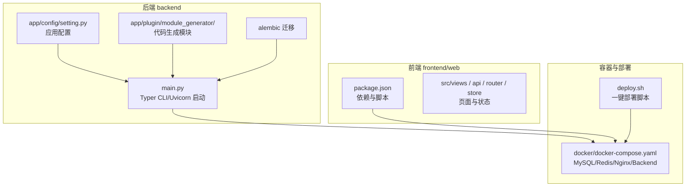
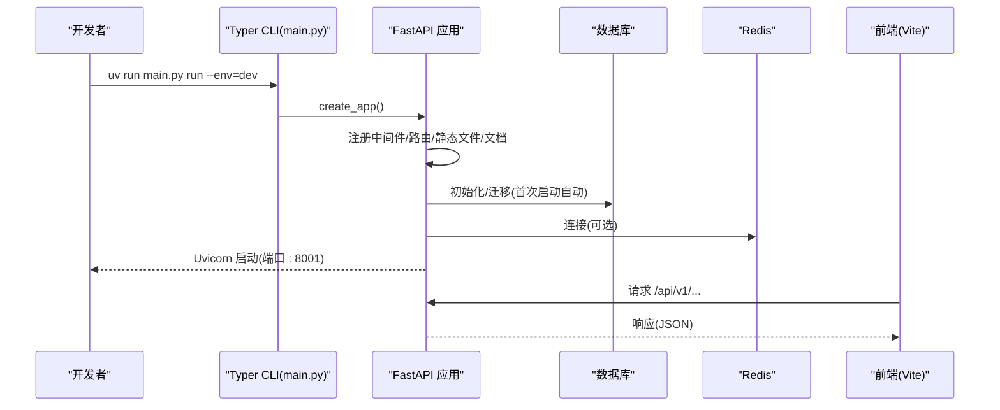
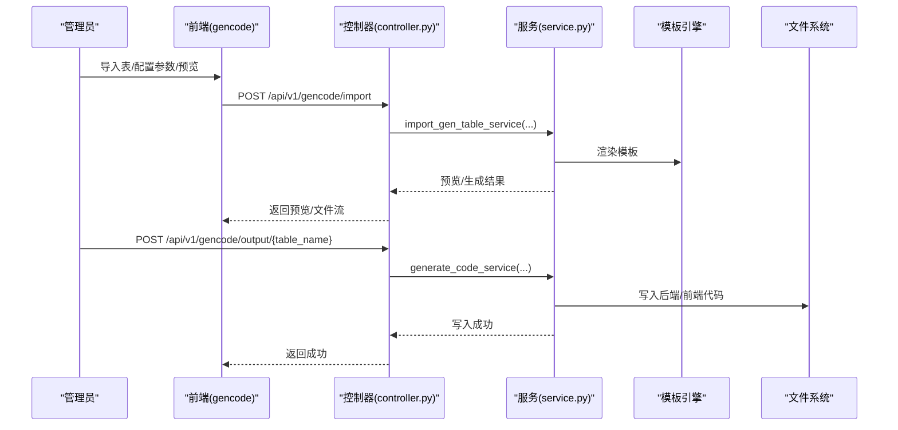
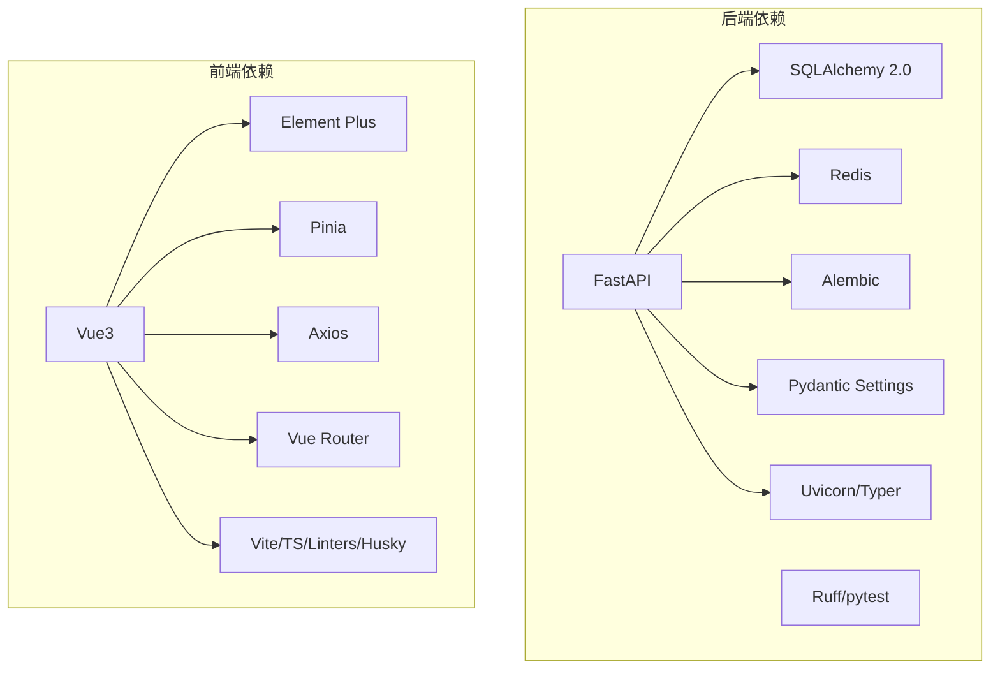

# 开发流程

<cite>
**本文引用的文件**
- [README.md](file://README.md)
- [backend/pyproject.toml](file://backend/pyproject.toml)
- [frontend/web/package.json](file://frontend/web/package.json)
- [backend/main.py](file://backend/main.py)
- [backend/app/config/setting.py](file://backend/app/config/setting.py)
- [backend/app/plugin/module_generator/plugin.toml](file://backend/app/plugin/module_generator/plugin.toml)
- [backend/app/plugin/module_generator/gencode/controller.py](file://backend/app/plugin/module_generator/gencode/controller.py)
- [backend/app/plugin/module_generator/gencode/service.py](file://backend/app/plugin/module_generator/gencode/service.py)
- [backend/app/plugin/module_generator/gencode/tools/gen_util.py](file://backend/app/plugin/module_generator/gencode/tools/gen_util.py)
- [docker/docker-compose.yaml](file://docker/docker-compose.yaml)
- [deploy.sh](file://deploy.sh)
- [backend/run_linux.sh](file://backend/run_linux.sh)
- [backend/run_win.bat](file://backend/run_win.bat)
- [backend/tests/test_main.py](file://backend/tests/test_main.py)
</cite>

## 目录
1. [简介](#简介)
2. [项目结构](#项目结构)
3. [核心组件](#核心组件)
4. [架构总览](#架构总览)
5. [详细组件分析](#详细组件分析)
6. [依赖分析](#依赖分析)
7. [性能考虑](#性能考虑)
8. [故障排查指南](#故障排查指南)
9. [结论](#结论)
10. [附录](#附录)

## 简介
本文件面向 FastapiAdmin 项目的开发团队，提供从需求分析到代码发布的完整开发流程指南。内容涵盖：
- 开发环境搭建（后端 uv/pip、前端 pnpm、数据库与 Redis、环境变量）
- 模块开发与插件化架构实践
- 代码生成器的使用与原理
- 测试验证与质量保障
- 部署发布（Docker Compose 一键部署）
- 版本管理、分支管理与发布流程最佳实践
- 团队协作规范与沟通建议

## 项目结构
FastapiAdmin 采用前后端分离架构，后端基于 FastAPI，前端基于 Vue3 + TypeScript。项目采用“按业务特性分包”的组织方式，模块化程度高，便于团队协作与独立演进。

图表来源
- [backend/app/config/setting.py:13-355](file://backend/app/config/setting.py#L13-L355)
- [backend/main.py:16-51](file://backend/main.py#L16-L51)
- [docker/docker-compose.yaml:9-201](file://docker/docker-compose.yaml#L9-L201)
- [frontend/web/package.json:1-205](file://frontend/web/package.json#L1-L205)
- [deploy.sh:1-175](file://deploy.sh#L1-L175)

章节来源
- [README.md:96-115](file://README.md#L96-L115)
- [backend/app/config/setting.py:13-355](file://backend/app/config/setting.py#L13-L355)
- [docker/docker-compose.yaml:9-201](file://docker/docker-compose.yaml#L9-L201)

## 核心组件
- 应用配置与启动
  - 配置加载：通过环境变量与 .env 文件加载，支持 dev/prod 环境切换。
  - 启动入口：Typer CLI 提供 run/revision/upgrade 子命令，Uvicorn 启动服务。
- 代码生成器
  - 模块注册：通过 plugin.toml 声明，自动发现与注册路由。
  - 控制器：提供数据库表列表、导入表结构、生成代码、预览、同步数据库等接口。
  - 服务层：封装业务逻辑，负责模板渲染、菜单创建、权限前缀拼接、主子表校验等。
  - 工具类：字段类型映射、HTML 控件推断、默认展示/查询策略等。
- Docker Compose 与一键部署
  - 一键脚本 deploy.sh，支持拉取代码、构建镜像、启动服务、查看日志与健康检查。
  - docker-compose.yaml 定义 MySQL、Redis、Nginx、Backend 四个服务及其依赖关系。

章节来源
- [backend/app/config/setting.py:13-355](file://backend/app/config/setting.py#L13-L355)
- [backend/main.py:54-163](file://backend/main.py#L54-L163)
- [backend/app/plugin/module_generator/plugin.toml:1-9](file://backend/app/plugin/module_generator/plugin.toml#L1-L9)
- [backend/app/plugin/module_generator/gencode/controller.py:24-363](file://backend/app/plugin/module_generator/gencode/controller.py#L24-L363)
- [backend/app/plugin/module_generator/gencode/service.py:69-800](file://backend/app/plugin/module_generator/gencode/service.py#L69-L800)
- [backend/app/plugin/module_generator/gencode/tools/gen_util.py:12-200](file://backend/app/plugin/module_generator/gencode/tools/gen_util.py#L12-L200)
- [docker/docker-compose.yaml:9-201](file://docker/docker-compose.yaml#L9-L201)
- [deploy.sh:1-175](file://deploy.sh#L1-L175)

## 架构总览
后端通过 Typer CLI 提供统一入口，加载配置后创建 FastAPI 应用，注册中间件、路由、静态文件与文档。前端通过 Vite 开发服务器提供页面与 API 调用，生产环境由 Nginx 提供静态资源与反向代理。

图表来源
- [backend/main.py:54-107](file://backend/main.py#L54-L107)
- [backend/app/config/setting.py:312-340](file://backend/app/config/setting.py#L312-L340)

章节来源
- [backend/main.py:54-107](file://backend/main.py#L54-L107)
- [backend/app/config/setting.py:312-340](file://backend/app/config/setting.py#L312-L340)

## 详细组件分析

### 开发环境搭建
- 后端
  - 运行时：Python ≥ 3.10，推荐 3.12；包管理器 uv（可选，与 pyproject.toml 一致）。
  - 依赖安装：推荐使用 uv sync；或使用 pip install -r requirements.txt。
  - 环境变量：复制 .env.dev.example 为 .env.dev，按注释填写数据库、Redis、JWT 密钥等。
  - 启动：uv run main.py run --env=dev；生产环境 uv run main.py run --env=prod。
- 前端
  - 运行时：Node.js ≥ 20，pnpm 包管理器。
  - 依赖安装：pnpm install；开发：pnpm run dev；生产构建：pnpm run build。
- 数据库与缓存
  - 数据库：MySQL 8.0 或 PostgreSQL；Redis 7.x。
  - Docker Compose：docker compose -f docker/docker-compose.yaml up -d 启动 MySQL/Redis/Backend/Nginx。
- 一键部署
  - Linux：./deploy.sh；支持 start/stop/restart/logs/verify/clean 等子命令。
  - Windows：双击 run_win.bat 或 powershell 执行 run_win.bat。

章节来源
- [README.md:211-271](file://README.md#L211-L271)
- [backend/pyproject.toml:1-138](file://backend/pyproject.toml#L1-L138)
- [frontend/web/package.json:1-205](file://frontend/web/package.json#L1-L205)
- [docker/docker-compose.yaml:9-201](file://docker/docker-compose.yaml#L9-L201)
- [deploy.sh:1-175](file://deploy.sh#L1-L175)
- [backend/run_linux.sh:105-138](file://backend/run_linux.sh#L105-L138)
- [backend/run_win.bat:84-99](file://backend/run_win.bat#L84-L99)

### 模块开发与插件化架构
- 插件目录结构
  - backend/app/plugin/module_xxx/ 下包含 controller.py、model.py、schema.py、service.py、crud.py 等文件。
  - plugin.toml 声明模块元信息，系统自动发现并注册路由。
- 开发步骤
  - 创建模块目录与文件，编写数据模型、数据验证、CRUD、业务逻辑与控制器。
  - 自动路由注册：模块名 module_xxx → 前缀 /xxx；无需手动注册。
- 开发规范
  - 权限控制：所有 API 添加 AuthPermission 装饰器。
  - 日志记录：使用 OperationLogRoute 自动记录操作日志。
  - 返回格式：统一 SuccessResponse/ErrorResponse。
  - 文档字符串：为所有 API 接口添加摘要与描述。

章节来源
- [README.md:354-457](file://README.md#L354-L457)
- [backend/app/plugin/module_generator/plugin.toml:1-9](file://backend/app/plugin/module_generator/plugin.toml#L1-L9)

### 代码生成器使用指南
- 登录系统，进入“代码生成”模块。
- 导入数据库表结构（支持分页与搜索）。
- 配置生成参数（模块名、功能名、包名、上级目录等）。
- 预览代码或直接生成到指定路径，支持批量生成为 ZIP。
- 同步数据库：生成差异预览（主表+可选子表），不落库；也可直接同步到数据库。

图表来源
- [backend/app/plugin/module_generator/gencode/controller.py:96-288](file://backend/app/plugin/module_generator/gencode/controller.py#L96-L288)
- [backend/app/plugin/module_generator/gencode/service.py:707-800](file://backend/app/plugin/module_generator/gencode/service.py#L707-L800)

章节来源
- [README.md:464-496](file://README.md#L464-L496)
- [backend/app/plugin/module_generator/gencode/controller.py:24-363](file://backend/app/plugin/module_generator/gencode/controller.py#L24-L363)
- [backend/app/plugin/module_generator/gencode/service.py:69-800](file://backend/app/plugin/module_generator/gencode/service.py#L69-L800)

### 数据库迁移与模型演进
- 生成迁移：uv run main.py revision --env=dev
- 应用迁移：uv run main.py upgrade --env=dev
- 首次启动一般无需手动执行 upgrade，应用会自动初始化库表与基础数据。
- 交互式脚本：run_linux.sh/run_win.bat 提供数据库检查、创建、清理、重置迁移记录等辅助操作。

章节来源
- [backend/main.py:109-158](file://backend/main.py#L109-L158)
- [README.md:569-579](file://README.md#L569-L579)
- [backend/run_linux.sh:140-164](file://backend/run_linux.sh#L140-L164)
- [backend/run_win.bat:101-113](file://backend/run_win.bat#L101-L113)

### 测试验证
- 后端测试入口：tests/test_main.py，包含健康检查与就绪检查。
- 执行方式：pytest tests/test_main.py 或 pytest tests/。
- 建议：结合 pytest fixtures、TestClient 与覆盖率工具，完善单元测试与集成测试。

章节来源
- [backend/tests/test_main.py:1-48](file://backend/tests/test_main.py#L1-L48)

### 部署发布
- Docker Compose
  - 服务：mysql、redis、backend、nginx。
  - 端口映射：BACKEND_PORT(HTTP)/8001、HTTP_PORT/80、HTTPS_PORT/443。
  - 健康检查：后端健康检查 /common/health 与 /common/health/ready/。
- 一键部署脚本
  - ./deploy.sh：拉取代码、构建镜像、启动服务、查看日志、健康检查。
  - 支持 --skip-frontend/--build-frontend 等参数控制前端构建策略。

章节来源
- [docker/docker-compose.yaml:9-201](file://docker/docker-compose.yaml#L9-L201)
- [deploy.sh:1-175](file://deploy.sh#L1-L175)

## 依赖分析
- 后端依赖
  - 核心：FastAPI、SQLAlchemy 2.0、Alembic、Pydantic Settings、Uvicorn、Typer。
  - 数据库：asyncmy/asyncpg（MySQL/PostgreSQL 异步）、pymysql/psycopg（同步）。
  - 缓存：Redis。
  - 工具：Ruff（代码检查/格式化）、pytest（测试）、APScheduler（定时任务）、OpenAI（可选）。
- 前端依赖
  - 核心：Vue3、Element Plus、Pinia、Axios、Vue Router。
  - 开发：Vite、TypeScript、ESLint/Prettier/Stylelint、Husky/Lint-Staged。

图表来源
- [backend/pyproject.toml:7-52](file://backend/pyproject.toml#L7-L52)
- [frontend/web/package.json:68-177](file://frontend/web/package.json#L68-L177)

章节来源
- [backend/pyproject.toml:1-138](file://backend/pyproject.toml#L1-L138)
- [frontend/web/package.json:1-205](file://frontend/web/package.json#L1-L205)

## 性能考虑
- 异步与连接池
  - 使用 SQLAlchemy 2.0 异步驱动（asyncmy/asyncpg）与连接池参数（pool_size、max_overflow、pool_recycle 等）。
- 缓存与限流
  - Redis 缓存与 Gzip 压缩可提升响应速度与带宽利用率。
- API 设计
  - 分页查询与数据库侧 OFFSET/LIMIT，避免全量反射导致卡顿。
- 前端优化
  - 按需加载组件、路由懒加载、构建产物压缩与缓存策略。

章节来源
- [backend/app/config/setting.py:82-114](file://backend/app/config/setting.py#L82-L114)
- [backend/app/plugin/module_generator/gencode/controller.py:84-93](file://backend/app/plugin/module_generator/gencode/controller.py#L84-L93)

## 故障排查指南
- 启动失败
  - 检查 .env.dev/.env.prod 配置是否正确（数据库、Redis、JWT 密钥）。
  - 使用 uv run main.py run --env=dev 查看启动日志。
- 数据库问题
  - 首次启动会自动初始化库表与基础数据；如需迁移，使用 uv run main.py revision/upgrade。
  - 交互式脚本提供数据库检查、创建、清理、重置迁移记录等操作。
- 健康检查
  - /common/health 与 /common/health/ready/ 返回统一成功结构，便于监控与自动化检查。
- Docker 问题
  - 使用 ./deploy.sh verify/logs 查看容器状态与日志；必要时 ./deploy.sh clean 清理构建缓存。

章节来源
- [backend/tests/test_main.py:12-42](file://backend/tests/test_main.py#L12-L42)
- [backend/run_linux.sh:191-264](file://backend/run_linux.sh#L191-L264)
- [backend/run_win.bat:133-183](file://backend/run_win.bat#L133-L183)
- [deploy.sh:117-128](file://deploy.sh#L117-L128)

## 结论
本指南提供了 FastapiAdmin 从需求分析到发布的全流程实践，强调：
- 插件化与模块化开发，降低耦合、提升可维护性；
- 代码生成器显著提升 CRUD 开发效率；
- Docker 一键部署简化运维；
- 严格的开发规范与测试保障质量；
- 健全的环境变量与配置体系确保一致性。

## 附录

### 开发流程（从需求到发布）
- 需求分析
  - 明确业务域与模块边界，确定数据库表结构与字段。
- 环境准备
  - 安装运行时与依赖，配置 .env.dev/.env.prod，启动 MySQL/Redis。
- 模块开发
  - 在 backend/app/plugin/module_xxx 下创建文件，编写模型/验证/CRUD/业务/控制器。
  - 自动路由注册，无需手动配置。
- 代码生成
  - 使用代码生成器导入表结构，配置参数，预览并生成代码，写入后端/前端目录。
- 测试验证
  - 编写单元测试与集成测试，执行 pytest；检查 /common/health 与 /common/health/ready/。
- 数据库迁移
  - 如模型变更，生成并应用迁移；首次启动一般无需手动迁移。
- 部署发布
  - 使用 Docker Compose 或 ./deploy.sh 一键部署；Nginx 提供静态资源与反向代理。

章节来源
- [README.md:539-548](file://README.md#L539-L548)
- [backend/app/plugin/module_generator/gencode/controller.py:24-363](file://backend/app/plugin/module_generator/gencode/controller.py#L24-L363)
- [backend/tests/test_main.py:12-42](file://backend/tests/test_main.py#L12-L42)
- [docker/docker-compose.yaml:9-201](file://docker/docker-compose.yaml#L9-L201)
- [deploy.sh:1-175](file://deploy.sh#L1-L175)

### 版本管理、分支管理与发布流程最佳实践
- 分支策略
  - 主分支：稳定版本；develop：日常合并；feature/*：功能开发；hotfix/*：紧急修复。
- 提交规范
  - 使用 commitizen（cz-git）规范化提交信息，便于自动生成变更日志。
- 发布流程
  - 本地测试通过后，合并到 develop；打标签并推送；CI/CD 自动构建镜像与发布。
- Docker 发布
  - 使用 docker-compose 构建镜像，部署到目标环境；./deploy.sh 支持 update/verify/logs。

章节来源
- [frontend/web/package.json:36-40](file://frontend/web/package.json#L36-L40)
- [deploy.sh:1-175](file://deploy.sh#L1-L175)

### 团队协作规范与沟通指南
- 代码规范
  - 后端：Ruff 统一风格与修复；前端：ESLint/Prettier/Stylelint；husky/lint-staged 自动检查。
- 权限与日志
  - 所有 API 添加权限控制与操作日志；统一响应格式。
- 文档与演示
  - Swagger/Redoc 自动生成接口文档；演示环境账号与端口参考 README。
- 沟通与反馈
  - 使用 Issue/PR 流程；定期回顾与知识沉淀。

章节来源
- [backend/pyproject.toml:68-137](file://backend/pyproject.toml#L68-L137)
- [frontend/web/package.json:41-67](file://frontend/web/package.json#L41-L67)
- [README.md:83-87](file://README.md#L83-L87)