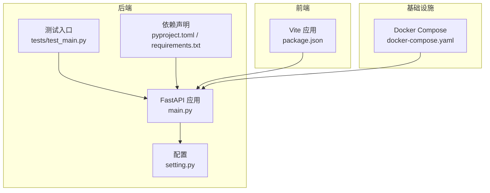
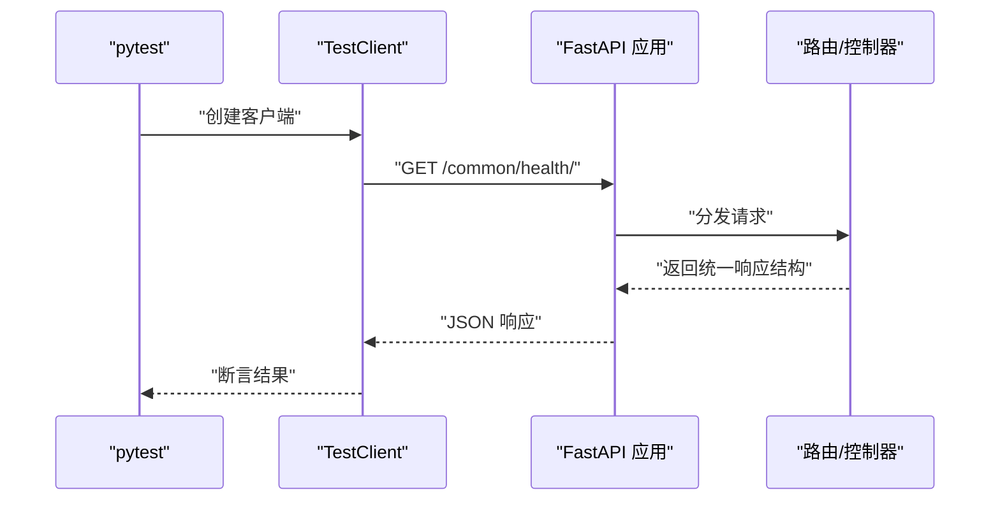
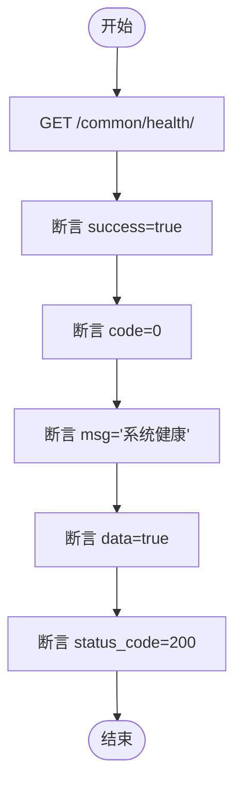
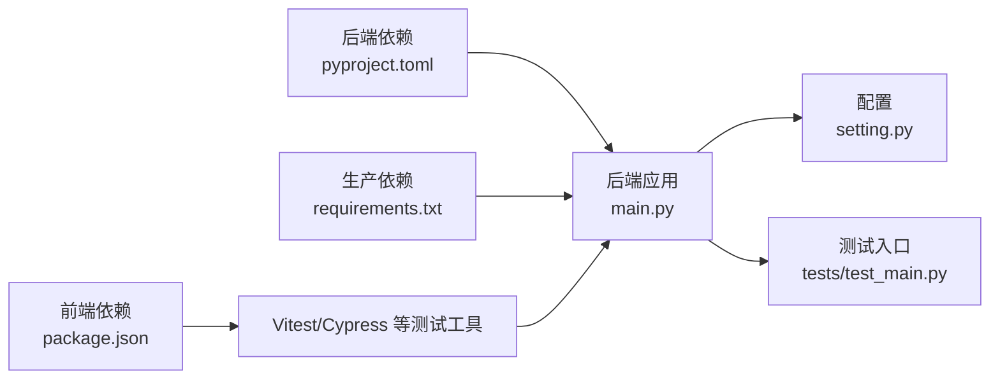

# 测试策略

<cite>
**本文引用的文件**
- [backend/tests/test_main.py](file://backend/tests/test_main.py)
- [backend/pyproject.toml](file://backend/pyproject.toml)
- [backend/requirements.txt](file://backend/requirements.txt)
- [backend/main.py](file://backend/main.py)
- [backend/app/config/setting.py](file://backend/app/config/setting.py)
- [docker/docker-compose.yaml](file://docker/docker-compose.yaml)
- [frontend/web/package.json](file://frontend/web/package.json)
</cite>

## 目录
1. [引言](#引言)
2. [项目结构](#项目结构)
3. [核心组件](#核心组件)
4. [架构总览](#架构总览)
5. [详细组件分析](#详细组件分析)
6. [依赖分析](#依赖分析)
7. [性能考虑](#性能考虑)
8. [故障排查指南](#故障排查指南)
9. [结论](#结论)
10. [附录](#附录)

## 引言
本测试策略文档面向 FastapiAdmin 项目的后端与前端，旨在建立覆盖单元测试、集成测试与端到端测试的完整测试体系。文档明确测试框架选择与配置（pytest、unittest、前端测试工具链）、API 测试与前端组件测试的实施方案、测试数据准备与隔离策略、性能与安全测试方法、以及 CI/CD 集成建议。目标是提升交付质量、降低回归风险，并为持续演进提供可靠保障。

## 项目结构
FastapiAdmin 采用前后端分离架构：
- 后端：Python/ FastAPI，使用 SQLAlchemy 2.x、Alembic 迁移、Redis、Uvicorn 作为 ASGI 服务器，通过 Typer 提供命令行工具。
- 前端：Vue3 + Vite + TypeScript + Element Plus，提供管理端界面与交互组件。
- 测试：后端已有基础测试入口；前端缺少测试配置与用例，需补齐。

图表来源
- [backend/main.py:16-51](file://backend/main.py#L16-L51)
- [backend/app/config/setting.py:343-355](file://backend/app/config/setting.py#L343-L355)
- [backend/tests/test_main.py:12-42](file://backend/tests/test_main.py#L12-L42)
- [backend/pyproject.toml:1-138](file://backend/pyproject.toml#L1-L138)
- [docker/docker-compose.yaml](file://docker/docker-compose.yaml)

章节来源
- [backend/main.py:16-51](file://backend/main.py#L16-L51)
- [backend/app/config/setting.py:343-355](file://backend/app/config/setting.py#L343-L355)
- [backend/tests/test_main.py:12-42](file://backend/tests/test_main.py#L12-L42)
- [backend/pyproject.toml:1-138](file://backend/pyproject.toml#L1-L138)
- [docker/docker-compose.yaml](file://docker/docker-compose.yaml)

## 核心组件
- 应用工厂与生命周期：通过工厂函数创建 FastAPI 实例，注册中间件、路由、静态文件与异常处理器，支持不同环境配置。
- 配置中心：集中管理数据库、Redis、JWT、日志、静态文件、Swagger 等配置，并提供连接串构造逻辑。
- 健康检查与就绪检查：提供统一健康状态与就绪状态接口，便于测试与运维监控。
- 测试入口：现有测试覆盖健康检查接口，后续应扩展至各模块控制器与业务流程。

章节来源
- [backend/main.py:16-51](file://backend/main.py#L16-L51)
- [backend/app/config/setting.py:227-340](file://backend/app/config/setting.py#L227-L340)
- [backend/tests/test_main.py:12-42](file://backend/tests/test_main.py#L12-L42)

## 架构总览
后端通过 Typer 子命令提供运行、迁移与升级能力；测试阶段通过 TestClient 直连应用，绕过真实网络栈，快速验证接口行为。

图表来源
- [backend/tests/test_main.py:12-42](file://backend/tests/test_main.py#L12-L42)
- [backend/main.py:16-51](file://backend/main.py#L16-L51)

## 详细组件分析

### 后端测试策略
- 测试框架与配置
  - 使用 pytest 作为主测试框架，遵循其约定式命名与夹具机制。
  - 依赖管理：dev 组包含 pytest、ruff、fakeredis，满足测试与代码规范需求。
  - 生产依赖与测试依赖分离，避免将测试工具打入生产镜像。
- 测试类型与范围
  - 单元测试：针对控制器、CRUD、服务层与工具函数，使用夹具注入依赖，模拟外部服务。
  - 集成测试：以 TestClient 启动应用，覆盖路由、中间件、权限校验、数据库与 Redis 交互。
  - 端到端测试：结合 Docker Compose 启动完整栈，验证从浏览器到数据库的完整链路。
- 关键接口测试
  - 健康检查与就绪检查：验证统一响应结构、数据库可用性标记。
  - 认证与权限：登录、令牌刷新、RBAC 白名单豁免、滑动过期等。
  - 业务模块：系统管理、监控、任务、AI 插件等模块的增删改查与边界条件。
- 测试数据与隔离
  - 使用内存 Redis（fakeredis）与 SQLite/临时数据库，确保测试隔离与可重复性。
  - 通过环境变量切换测试配置，避免污染生产数据。
- 性能与安全
  - 接口限流、Gzip 压缩、跨域与敏感头暴露等配置纳入测试矩阵。
  - 对上传、导出、定时任务等高负载场景进行压力与稳定性测试。

章节来源
- [backend/tests/test_main.py:12-42](file://backend/tests/test_main.py#L12-L42)
- [backend/pyproject.toml:54-62](file://backend/pyproject.toml#L54-L62)
- [backend/requirements.txt:1-45](file://backend/requirements.txt#L1-L45)

### 前端测试策略
- 测试工具链
  - 基于 Vite 的 Vue3 应用，推荐使用 Vitest 进行单元测试，Cypress 或 Playwright 进行端到端测试。
  - 与现有包管理器（pnpm）保持一致，减少工具链复杂度。
- 测试类型与范围
  - 单元测试：组件渲染、组合式函数、Pinia Store、路由守卫与指令。
  - 集成测试：API 适配层（Axios/HTTP 工具）与组件交互。
  - 端到端测试：登录、菜单导航、表格 CRUD、导入导出、图表渲染。
- 测试数据与隔离
  - 使用 Mock API（如 vite-plugin-mock）或拦截 HTTP 请求，避免真实后端耦合。
  - 本地化存储（localStorage/sessionStorage）在测试中隔离或清理。
- 可访问性与国际化
  - 覆盖多语言文案与主题切换，确保视觉与交互一致性。

章节来源
- [frontend/web/package.json:1-205](file://frontend/web/package.json#L1-L205)

### 数据库与缓存测试
- 数据库
  - 支持 MySQL、PostgreSQL、SQLite；测试优先使用 SQLite 或临时数据库，保证速度与隔离。
  - 使用 Alembic 在测试前初始化/迁移，测试后回滚或重建。
- 缓存
  - Redis 可用时，使用 fakeredis 内存实现；不可用时降级为内存缓存或禁用缓存逻辑。

章节来源
- [backend/app/config/setting.py:257-302](file://backend/app/config/setting.py#L257-L302)
- [backend/pyproject.toml:56](file://backend/pyproject.toml#L56)

### API 测试实施方案
- 接口覆盖率
  - 系统模块：用户、角色、菜单、字典、通知、参数、岗位、部门、租户等。
  - 监控模块：在线用户、缓存、资源、服务器。
  - 任务模块：定时作业、工作流定义与执行。
  - AI 模块：聊天、WebSocket 会话。
- 断言策略
  - 统一响应结构：success、code、msg、data、status_code。
  - 状态码与字段存在性校验。
  - 权限与参数校验：401/403/422 场景。
- 示例流程（健康检查）

图表来源
- [backend/tests/test_main.py:25-42](file://backend/tests/test_main.py#L25-L42)

### 前端组件测试实施方案
- 组件测试
  - 使用 Vitest + @vue/test-utils 渲染组件，触发用户交互，断言 DOM 与状态变化。
- 表单与表格
  - 验证搜索栏、分页、排序、筛选、批量操作、导入导出。
- 路由与权限
  - 登录后访问受限页面，断言重定向与权限提示。
- Mock 与拦截
  - 使用 Axios 拦截器或 vite-plugin-mock，模拟不同响应与错误场景。

章节来源
- [frontend/web/package.json:1-205](file://frontend/web/package.json#L1-L205)

### 测试数据准备与管理
- 准备策略
  - 使用 JSON/CSV 初始化脚本或 Alembic 初始数据，确保测试前置数据一致。
  - 对于敏感数据，使用占位符或随机化生成。
- 隔离策略
  - 测试数据库与 Redis 使用独立命名空间或容器实例。
  - 通过环境变量切换测试配置，避免与开发/生产冲突。
- 清理策略
  - 测试结束后删除临时数据与缓存，确保下次测试干净。

章节来源
- [backend/app/config/setting.py:82-122](file://backend/app/config/setting.py#L82-L122)
- [backend/app/scripts/data/sys_user.json](file://backend/app/scripts/data/sys_user.json)

### 性能测试与安全测试
- 性能测试
  - 使用 Locust 或 k6 对高频接口进行并发压测，关注 P95/P99 延迟与错误率。
  - 针对上传、导出、图表渲染等场景进行资源占用评估。
- 安全测试
  - 输入验证与 XSS 过滤：对富文本、评论、参数进行注入测试。
  - 权限越权：模拟低权限用户访问高权限接口。
  - 速率限制与防护：验证限流、验证码、跨域与敏感头暴露配置。

章节来源
- [backend/app/utils/xss_util.py](file://backend/app/utils/xss_util.py)
- [backend/app/config/setting.py:227-241](file://backend/app/config/setting.py#L227-L241)

### 兼容性测试
- 浏览器与设备
  - 使用 BrowserStack 或 LambdaTest 在主流浏览器与移动端进行回归。
- 前端构建
  - 验证不同构建模式（dev/pro/test）下的产物与运行时行为。

章节来源
- [frontend/web/package.json:7-35](file://frontend/web/package.json#L7-L35)

### CI/CD 集成方案
- 流水线阶段
  - 代码检查：Ruff/Lint-Staged/ESLint/Stylelint。
  - 单元测试：后端 pytest，前端 Vitest。
  - 集成测试：Docker Compose 启动后端+数据库+Redis，运行 TestClient 测试。
  - 端到端测试：Playwright/Cypress，覆盖关键用户路径。
  - 构建与发布：Vite 构建前端产物，打包后端与静态资源。
- 缓存与并行
  - 缓存依赖与构建产物，提升流水线效率。
  - 并行执行不同模块测试，缩短总耗时。
- 报告与告警
  - 生成测试报告与覆盖率，失败时邮件/IM 通知。

章节来源
- [backend/pyproject.toml:104-138](file://backend/pyproject.toml#L104-L138)
- [docker/docker-compose.yaml](file://docker/docker-compose.yaml)

## 依赖分析
后端依赖与测试依赖分离，生产与测试环境通过环境变量与配置文件区分。前端通过包管理器与脚本组织测试工具链。

图表来源
- [backend/main.py:16-51](file://backend/main.py#L16-L51)
- [backend/app/config/setting.py:343-355](file://backend/app/config/setting.py#L343-L355)
- [backend/tests/test_main.py:12-42](file://backend/tests/test_main.py#L12-L42)
- [backend/pyproject.toml:1-138](file://backend/pyproject.toml#L1-L138)
- [backend/requirements.txt:1-45](file://backend/requirements.txt#L1-L45)
- [frontend/web/package.json:1-205](file://frontend/web/package.json#L1-L205)

章节来源
- [backend/pyproject.toml:54-62](file://backend/pyproject.toml#L54-L62)
- [backend/requirements.txt:1-45](file://backend/requirements.txt#L1-L45)
- [frontend/web/package.json:1-205](file://frontend/web/package.json#L1-L205)

## 性能考虑
- 测试阶段
  - 使用内存数据库与缓存，避免磁盘 IO。
  - 控制并发与迭代次数，逐步扩大规模。
- 生产阶段
  - 启用连接池、预检与压缩，优化数据库与网络层。
  - 对热点接口进行缓存与限流，防止雪崩。

## 故障排查指南
- 常见问题
  - 健康检查失败：检查数据库与 Redis 连接串、端口与凭据。
  - 权限错误：确认白名单配置与令牌过期策略。
  - 跨域问题：核对允许来源、方法与头部。
- 排查步骤
  - 查看日志级别与输出位置。
  - 使用最小化用例复现，逐步缩小范围。
  - 对比不同环境配置差异。

章节来源
- [backend/app/config/setting.py:55-63](file://backend/app/config/setting.py#L55-L63)
- [backend/app/config/setting.py:315-340](file://backend/app/config/setting.py#L315-L340)

## 结论
通过明确的测试框架与配置、覆盖全栈的测试类型、严格的测试数据管理与隔离、完善的性能与安全测试方法，以及可落地的 CI/CD 集成方案，FastapiAdmin 能够在快速迭代的同时保持高质量与稳定性。建议优先补齐前端测试配置与用例，完善数据库与缓存测试，持续优化测试覆盖率与执行效率。

## 附录
- 快速开始
  - 后端测试：在 backend 目录执行 pytest tests/。
  - 前端测试：在 frontend/web 目录执行 pnpm test。
- 参考文件
  - 后端应用工厂与配置：[backend/main.py](file://backend/main.py)，[backend/app/config/setting.py](file://backend/app/config/setting.py)
  - 测试入口与依赖：[backend/tests/test_main.py](file://backend/tests/test_main.py)，[backend/pyproject.toml](file://backend/pyproject.toml)，[backend/requirements.txt](file://backend/requirements.txt)
  - 基础设施与容器编排：[docker/docker-compose.yaml](file://docker/docker-compose.yaml)
  - 前端工具链：[frontend/web/package.json](file://frontend/web/package.json)