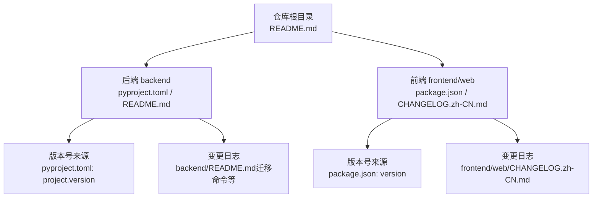
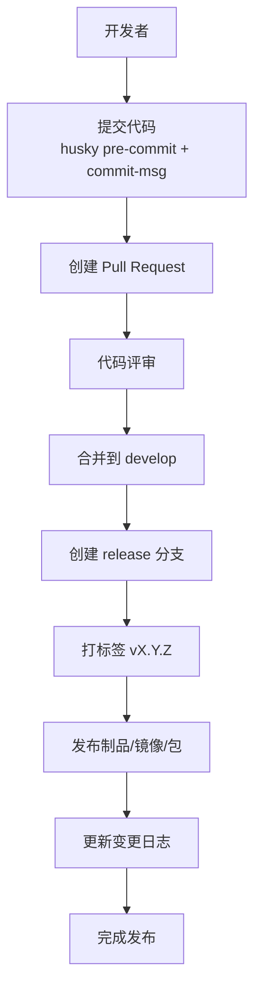
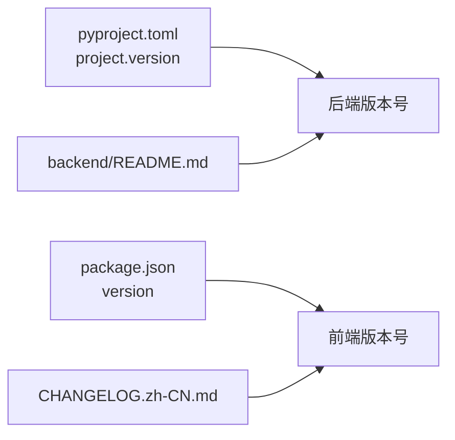

# 版本管理

<cite>
**本文引用的文件**
- [README.md](file://README.md)
- [backend/README.md](file://backend/README.md)
- [backend/pyproject.toml](file://backend/pyproject.toml)
- [backend/app/config/setting.py](file://backend/app/config/setting.py)
- [frontend/web/package.json](file://frontend/web/package.json)
- [frontend/web/CHANGELOG.zh-CN.md](file://frontend/web/CHANGELOG.zh-CN.md)
- [frontend/web/.husky/pre-commit](file://frontend/web/.husky/pre-commit)
- [frontend/web/.husky/commit-msg](file://frontend/web/.husky/commit-msg)
</cite>

## 目录
1. [简介](#简介)
2. [项目结构](#项目结构)
3. [核心组件](#核心组件)
4. [架构总览](#架构总览)
5. [详细组件分析](#详细组件分析)
6. [依赖分析](#依赖分析)
7. [性能考虑](#性能考虑)
8. [故障排查指南](#故障排查指南)
9. [结论](#结论)
10. [附录](#附录)

## 简介
本文件为 FastapiAdmin 项目的版本管理文档，目标是建立统一、可追溯、可自动化、可回溯的版本控制策略与发布流程。文档覆盖以下方面：
- 语义化版本号与版本号来源
- Git 工作流与分支/标签管理规范
- 版本发布流程（版本号升级、变更日志维护、发布说明）
- 代码合并策略与冲突解决方法
- 回滚策略与紧急修复流程
- 团队培训与最佳实践

## 项目结构
FastapiAdmin 为前后端分离项目，后端采用 Python + FastAPI，前端采用 Vue3 + Vite。版本号与变更日志分别在后端与前端独立维护，形成“双版本”体系。

**图表来源**
- [README.md](file://README.md)
- [backend/pyproject.toml](file://backend/pyproject.toml)
- [backend/README.md](file://backend/README.md)
- [frontend/web/package.json](file://frontend/web/package.json)
- [frontend/web/CHANGELOG.zh-CN.md](file://frontend/web/CHANGELOG.zh-CN.md)

**章节来源**
- [README.md](file://README.md)
- [backend/README.md](file://backend/README.md)
- [backend/pyproject.toml](file://backend/pyproject.toml)
- [frontend/web/package.json](file://frontend/web/package.json)
- [frontend/web/CHANGELOG.zh-CN.md](file://frontend/web/CHANGELOG.zh-CN.md)

## 核心组件
- 后端版本号来源：pyproject.toml 中的 project.version
- 前端版本号来源：package.json 中的 version
- 变更日志来源：
  - 后端：backend/README.md（包含 Alembic 迁移命令与开发约定）
  - 前端：frontend/web/CHANGELOG.zh-CN.md（遵循 Keep a Changelog 与 SemVer）

**章节来源**
- [backend/pyproject.toml](file://backend/pyproject.toml)
- [backend/README.md](file://backend/README.md)
- [frontend/web/package.json](file://frontend/web/package.json)
- [frontend/web/CHANGELOG.zh-CN.md](file://frontend/web/CHANGELOG.zh-CN.md)

## 架构总览
版本管理在本项目中的落地要点：
- 语义化版本：后端与前端分别维护各自版本号，遵循 SemVer
- 变更日志：前端严格遵循 Keep a Changelog，后端通过 README.md 记录迁移与开发约定
- 提交规范：前端通过 Husky 钩子强制 commitlint 与 lint-staged，确保提交质量
- 发布流程：结合版本号升级与变更日志维护，形成可追溯的发布说明

[本图为概念性流程示意，不直接映射具体文件，故不附“图表来源”]

## 详细组件分析

### 语义化版本与版本号来源
- 后端版本号：来自 pyproject.toml 的 project.version
- 前端版本号：来自 package.json 的 version
- 版本号规则：遵循 SemVer（主/次/修订），后端与前端各自独立演进

**章节来源**
- [backend/pyproject.toml](file://backend/pyproject.toml)
- [frontend/web/package.json](file://frontend/web/package.json)

### Git 工作流与分支/标签管理规范
- 分支策略（建议采用 Git Flow）：
  - main/master：保存可发布版本，与标签一一对应
  - develop：集成日常开发，合并自 feature 分支
  - feature/*：功能开发分支，从 develop 派生，完成后合并回 develop
  - release/*：准备发布的分支，从 develop 派生，仅做最小化缺陷修复与版本号/变更日志更新，完成后合并回 main 并打标签
  - hotfix/*：线上紧急修复分支，从 main 派生，修复后同时合并回 main 与 develop，并打标签
- 标签规范：
  - 使用语义化标签名，如 v2.0.0、v3.0.1
  - 标签与发布版本一一对应，便于回溯与回滚

[本节为通用规范说明，不直接分析具体文件，故不附“章节来源”]

### 版本发布流程
- 版本号升级：
  - 后端：更新 backend/pyproject.toml 的 project.version
  - 前端：更新 frontend/web/package.json 的 version
- 变更日志维护：
  - 前端：在 frontend/web/CHANGELOG.zh-CN.md 中新增条目，遵循 Keep a Changelog 与变更类型分类
  - 后端：在 backend/README.md 中记录迁移命令与重要变更
- 发布说明编写：
  - 基于变更日志生成发布说明，突出破坏性变更、新增功能、修复与优化
  - 明确版本号、发布日期、重要提示与迁移指引
- 打标签与发布：
  - 在 main 分支上创建与版本号一致的标签
  - 推送标签并发布制品/镜像/包

**章节来源**
- [backend/README.md](file://backend/README.md)
- [frontend/web/CHANGELOG.zh-CN.md](file://frontend/web/CHANGELOG.zh-CN.md)

### 代码合并策略与冲突解决
- 合并策略：
  - feature 分支合并到 develop 前，需通过 CI 与代码评审
  - release 分支仅允许最小化缺陷修复，禁止引入新功能
  - hotfix 分支修复后需同步合并到 develop
- 冲突解决：
  - 优先通过 rebase 保持线性历史
  - 使用小步提交与清晰的提交信息，便于冲突定位
  - 冲突解决后，再次通过 lint 与测试

[本节为通用规范说明，不直接分析具体文件，故不附“章节来源”]

### 回滚策略与紧急修复流程
- 回滚策略：
  - 依据标签回滚到上一个稳定版本
  - 如涉及数据库结构变更，结合 Alembic 迁移回退（后端）
- 紧急修复流程：
  - 从 main 派生 hotfix/* 分支，修复后合并回 main 与 develop，并打新标签
  - 前端紧急修复同样遵循相同流程

**章节来源**
- [backend/README.md](file://backend/README.md)

### 提交规范与质量保障
- 提交信息规范：前端通过 commit-msg 钩子强制 commitlint 校验
- 代码质量：pre-commit 钩子执行 lint-staged，确保提交前格式化与静态检查
- 建议：统一使用 Conventional Commits，便于自动生成变更日志

**章节来源**
- [frontend/web/.husky/commit-msg](file://frontend/web/.husky/commit-msg)
- [frontend/web/.husky/pre-commit](file://frontend/web/.husky/pre-commit)

## 依赖分析
- 后端版本号与依赖版本：pyproject.toml 中的 project.version 与依赖版本共同决定后端版本
- 前端版本号与依赖版本：package.json 中的 version 与依赖版本共同决定前端版本
- 变更日志与版本号：前端 CHANGELOG.zh-CN.md 与 package.json/version 保持一致；后端 README.md 与 pyproject.toml/version 保持一致

**图表来源**
- [backend/pyproject.toml](file://backend/pyproject.toml)
- [frontend/web/package.json](file://frontend/web/package.json)
- [frontend/web/CHANGELOG.zh-CN.md](file://frontend/web/CHANGELOG.zh-CN.md)
- [backend/README.md](file://backend/README.md)

**章节来源**
- [backend/pyproject.toml](file://backend/pyproject.toml)
- [frontend/web/package.json](file://frontend/web/package.json)
- [frontend/web/CHANGELOG.zh-CN.md](file://frontend/web/CHANGELOG.zh-CN.md)
- [backend/README.md](file://backend/README.md)

## 性能考虑
- 版本号与变更日志的维护应尽量自动化，减少人工干预带来的错误
- 发布前的 lint 与测试应尽可能缩短耗时，保证发布效率
- 标签与发布制品的关联应清晰，便于快速定位与回滚

[本节为通用指导，不直接分析具体文件，故不附“章节来源”]

## 故障排查指南
- 版本号不一致：
  - 检查后端 pyproject.toml 与前端 package.json 的版本号是否同步更新
- 变更日志缺失：
  - 前端确认 CHANGELOG.zh-CN.md 是否按规范更新；后端确认 README.md 是否记录迁移与变更
- 提交被拒绝：
  - 检查 commit-msg 与 pre-commit 钩子是否通过，必要时重新执行 lint-staged 与 commitlint

**章节来源**
- [frontend/web/.husky/commit-msg](file://frontend/web/.husky/commit-msg)
- [frontend/web/.husky/pre-commit](file://frontend/web/.husky/pre-commit)
- [frontend/web/CHANGELOG.zh-CN.md](file://frontend/web/CHANGELOG.zh-CN.md)
- [backend/README.md](file://backend/README.md)

## 结论
通过建立统一的语义化版本策略、严格的 Git 工作流与标签规范、完善的变更日志与发布说明流程，以及基于 Husky 的提交质量保障，FastapiAdmin 可以实现可追溯、可回溯、可自动化的版本管理。团队应遵循本文档的规范，确保每次发布都稳定、透明、可控。

[本节为总结性内容，不直接分析具体文件，故不附“章节来源”]

## 附录

### 附录A：版本号与变更日志对照
- 后端版本号：backend/pyproject.toml 中的 project.version
- 前端版本号：frontend/web/package.json 中的 version
- 前端变更日志：frontend/web/CHANGELOG.zh-CN.md

**章节来源**
- [backend/pyproject.toml](file://backend/pyproject.toml)
- [frontend/web/package.json](file://frontend/web/package.json)
- [frontend/web/CHANGELOG.zh-CN.md](file://frontend/web/CHANGELOG.zh-CN.md)

### 附录B：后端迁移与版本管理参考
- 后端迁移命令与开发约定参考 backend/README.md 中的“数据库迁移命令”与“快速开始”

**章节来源**
- [backend/README.md](file://backend/README.md)