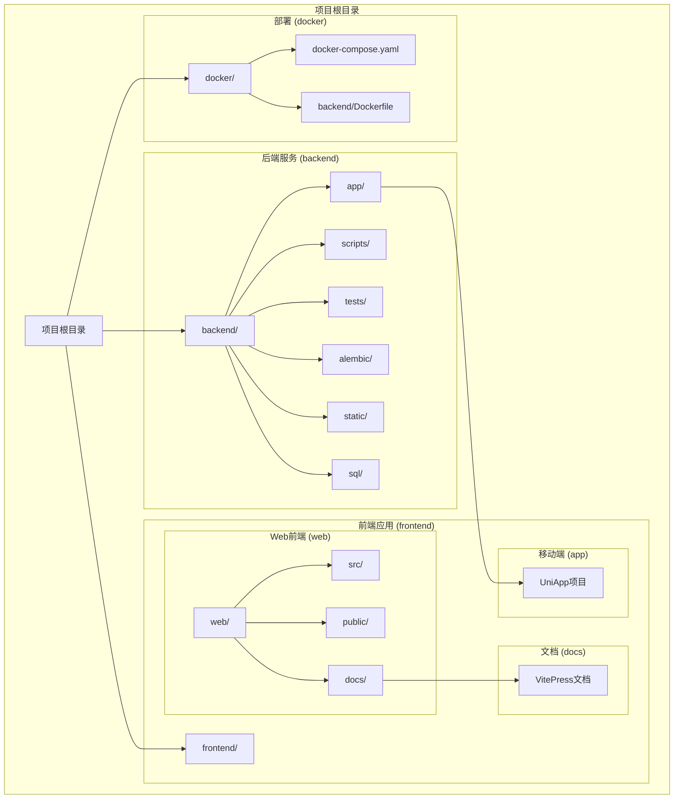
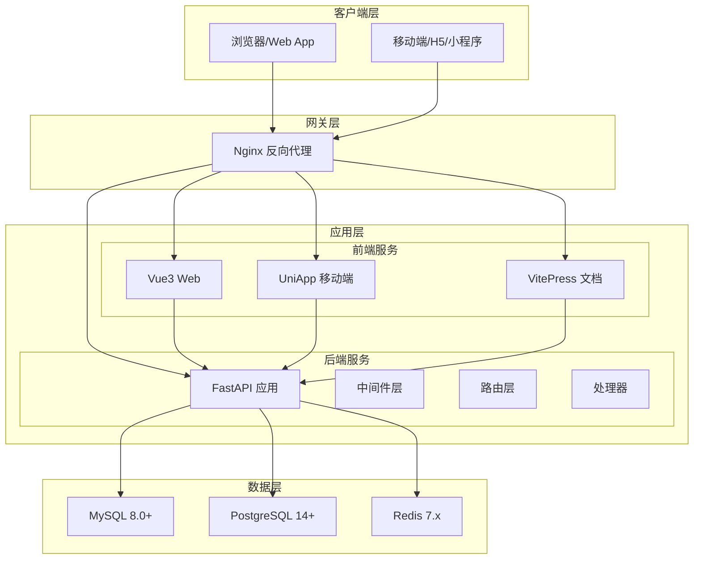
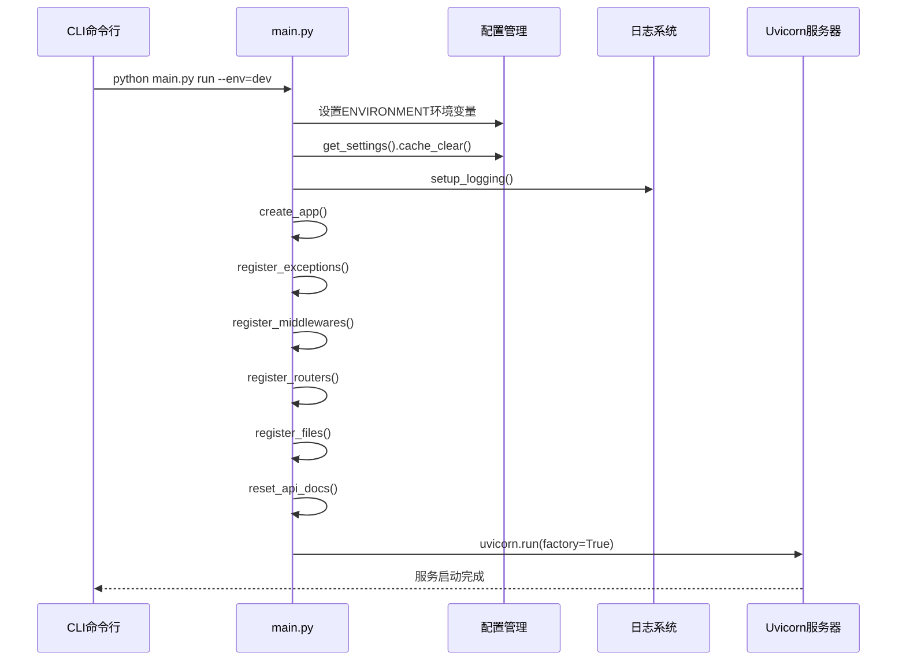
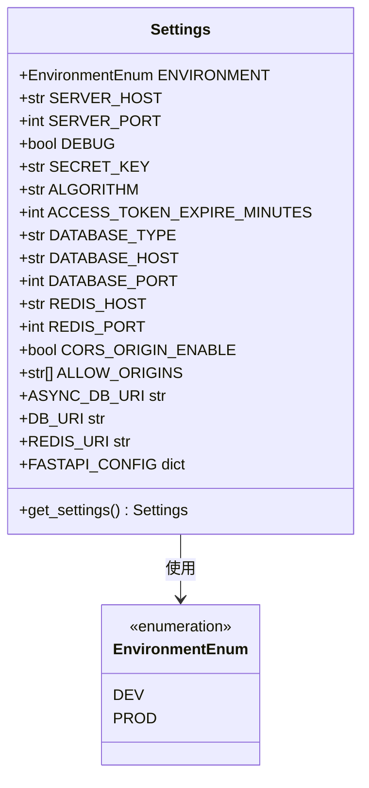
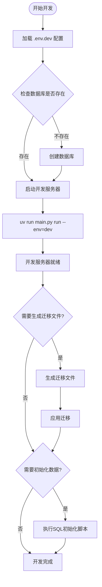
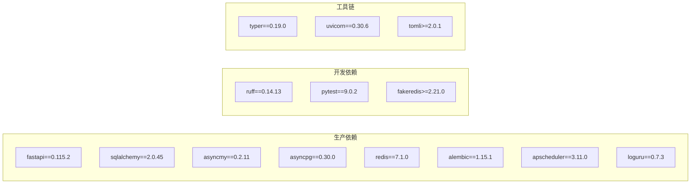
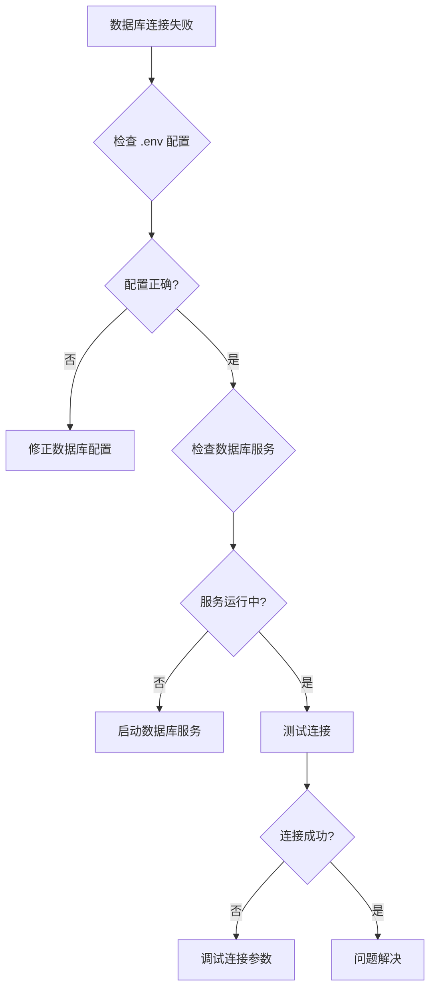

# 贡献指南

<cite>
**本文档引用的文件**
- [CONTRIBUTING.md](file://CONTRIBUTING.md)
- [README.md](file://README.md)
- [backend/main.py](file://backend/main.py)
- [backend/pyproject.toml](file://backend/pyproject.toml)
- [backend/requirements.txt](file://backend/requirements.txt)
- [backend/app/config/setting.py](file://backend/app/config/setting.py)
- [backend/tests/test_main.py](file://backend/tests/test_main.py)
- [backend/run_linux.sh](file://backend/run_linux.sh)
- [frontend/web/package.json](file://frontend/web/package.json)
- [frontend/web/.husky/pre-commit](file://frontend/web/.husky/pre-commit)
- [docker/docker-compose.yaml](file://docker/docker-compose.yaml)
- [deploy.sh](file://deploy.sh)
</cite>

## 目录
1. [简介](#简介)
2. [项目结构](#项目结构)
3. [核心组件](#核心组件)
4. [架构概览](#架构概览)
5. [详细组件分析](#详细组件分析)
6. [依赖分析](#依赖分析)
7. [性能考虑](#性能考虑)
8. [故障排除指南](#故障排除指南)
9. [结论](#结论)
10. [附录](#附录)

## 简介

FastapiAdmin 是一个基于 FastAPI + Vue3 + TypeScript 的全栈快速开发平台，提供开箱即用的企业级中后台解决方案。本项目采用 Monorepo 架构，包含后端 FastAPI 服务、前端 Vue3 Web 应用、移动端应用和文档网站。

## 项目结构

FastapiAdmin 采用 Monorepo 结构组织，主要包含以下核心目录：



**图表来源**
- [README.md:77-89](file://README.md#L77-L89)

**章节来源**
- [README.md:77-89](file://README.md#L77-L89)

## 核心组件

### 后端核心组件

后端采用 FastAPI 框架，提供完整的 API 服务、数据库管理和中间件支持：

- **应用入口**: `backend/main.py` - 主要的 FastAPI 应用入口点
- **配置管理**: `backend/app/config/setting.py` - 系统配置类，支持多环境配置
- **依赖管理**: `backend/pyproject.toml` - Python 依赖配置，使用 uv 包管理器
- **测试框架**: `backend/tests/test_main.py` - 基础测试套件

### 前端核心组件

前端采用 Vue3 + TypeScript 技术栈，提供现代化的用户界面：

- **包管理**: `frontend/web/package.json` - 前端依赖和脚本配置
- **构建工具**: Vite + TypeScript + Element Plus
- **开发工具**: ESLint + Prettier + Stylelint 代码质量工具链

### 部署组件

- **Docker 配置**: `docker/docker-compose.yaml` - 完整的服务编排配置
- **部署脚本**: `deploy.sh` - 自动化部署脚本
- **环境脚本**: `backend/run_linux.sh` - 开发环境自动化脚本

**章节来源**
- [backend/main.py:16-51](file://backend/main.py#L16-L51)
- [backend/app/config/setting.py:13-355](file://backend/app/config/setting.py#L13-L355)
- [backend/pyproject.toml:1-138](file://backend/pyproject.toml#L1-L138)
- [frontend/web/package.json:1-205](file://frontend/web/package.json#L1-L205)

## 架构概览

FastapiAdmin 采用分层架构设计，实现了前后端分离和模块化组织：



**图表来源**
- [docker/docker-compose.yaml:9-201](file://docker/docker-compose.yaml#L9-L201)
- [backend/app/config/setting.py:97-114](file://backend/app/config/setting.py#L97-L114)

## 详细组件分析

### 应用启动流程

后端应用采用工厂模式创建 FastAPI 实例，并支持多种启动模式：



**图表来源**
- [backend/main.py:55-107](file://backend/main.py#L55-L107)

### 配置管理系统

系统采用 Pydantic Settings 实现灵活的配置管理：



**图表来源**
- [backend/app/config/setting.py:13-355](file://backend/app/config/setting.py#L13-L355)

### 开发环境自动化脚本

后端提供了完整的开发环境自动化脚本：



**图表来源**
- [backend/run_linux.sh:105-138](file://backend/run_linux.sh#L105-L138)

**章节来源**
- [backend/main.py:16-107](file://backend/main.py#L16-L107)
- [backend/app/config/setting.py:13-355](file://backend/app/config/setting.py#L13-L355)
- [backend/run_linux.sh:105-379](file://backend/run_linux.sh#L105-L379)

## 依赖分析

### 后端依赖结构

后端采用 uv 包管理器，支持开发和生产环境分离：



**图表来源**
- [backend/pyproject.toml:7-52](file://backend/pyproject.toml#L7-L52)

### 前端依赖结构

前端采用现代化的开发工具链：

```mermaid
graph TB
subgraph "运行时依赖"
Vue[Vue3 ^3.5.34]
Router[Vue Router ^5.0.7]
Pinia[Pinia ^3.0.4]
ElementPlus[Element Plus ~2.13.7]
Axios[Axios ^1.16.1]
TypeScript[TypeScript ^6.0.3]
end
subgraph "开发工具"
Vite[Vite ^7.1.5]
ESLint[ESLint ^10.3.0]
Prettier[Prettier ^3.6.2]
Stylelint[Stylelint ^17.0.0]
Husky[Husky ^9.1.7]
end
subgraph "UI组件"
ElementIcons[@element-plus/icons-vue ^2.3.2]
ECharts[ECharts ^6.0.0]
CodeMirror[CodeMirror ^5.65.21]
end
```

**图表来源**
- [frontend/web/package.json:68-178](file://frontend/web/package.json#L68-L178)

**章节来源**
- [backend/pyproject.toml:1-138](file://backend/pyproject.toml#L1-L138)
- [frontend/web/package.json:1-205](file://frontend/web/package.json#L1-L205)

## 性能考虑

### 数据库连接优化

系统支持多种数据库类型，提供连接池优化配置：

- **连接池大小**: 默认 10，最大溢出 20
- **连接超时**: 30 秒
- **连接回收**: 1800 秒
- **预检连接**: 启用以确保连接有效性

### 缓存策略

- **Redis 集成**: 支持分布式缓存和会话存储
- **Gzip 压缩**: 可选的响应压缩
- **静态文件缓存**: 优化静态资源加载

### 并发处理

- **异步数据库操作**: 支持 MySQL 和 PostgreSQL 异步驱动
- **协程框架**: 基于 asyncio 的高性能异步处理
- **负载均衡**: Nginx 反向代理支持多实例部署

## 故障排除指南

### 常见问题诊断

#### 数据库连接问题



#### 开发服务器启动失败

1. **检查端口占用**: 确保 8001 端口可用
2. **验证依赖安装**: 运行 `uv sync` 安装完整依赖
3. **检查环境变量**: 确认 `.env.dev` 配置正确
4. **查看日志**: 使用 `uv run main.py run --env=dev` 查看详细日志

#### 前端构建问题

1. **Node.js 版本**: 确保 Node.js ≥ 20.19.0
2. **包管理器**: 使用 pnpm ≥ 8.8.0
3. **依赖安装**: 运行 `pnpm install` 安装依赖
4. **构建脚本**: 使用 `pnpm run build` 进行生产构建

**章节来源**
- [backend/run_linux.sh:105-379](file://backend/run_linux.sh#L105-L379)
- [docker/docker-compose.yaml:9-201](file://docker/docker-compose.yaml#L9-L201)

## 结论

FastapiAdmin 提供了一个完整的企业级中后台开发解决方案，具有以下特点：

- **现代化技术栈**: 基于 FastAPI 和 Vue3 的高性能架构
- **完善的开发工具**: 自动化的开发环境和部署流程
- **模块化设计**: 清晰的代码结构和可扩展性
- **企业级功能**: RBAC 权限管理、代码生成器、监控系统等

贡献者可以通过遵循本指南中的开发规范和流程，为项目的发展做出贡献。

## 附录

### 贡献流程

1. **Fork 仓库**: 创建个人 Fork
2. **创建分支**: 使用 `feature/xxx` 或 `bugfix/xxx` 命名
3. **代码规范**: 遵循约定式提交和代码风格
4. **测试验证**: 运行后端 `ruff check` 和前端 `pnpm lint`
5. **提交 PR**: 发送到 `dev` 分支

### 开发环境要求

- **Python**: ≥ 3.10（推荐 3.12）
- **Node.js**: ≥ 20.0 + pnpm
- **数据库**: MySQL 8.0+ / PostgreSQL 14+
- **缓存**: Redis 6.x / 7.x

### 部署选项

- **Docker 一键部署**: 使用 `deploy.sh` 脚本
- **手动部署**: 参考 `docker-compose.yaml` 配置
- **生产环境**: 使用 `--env=prod` 参数启动