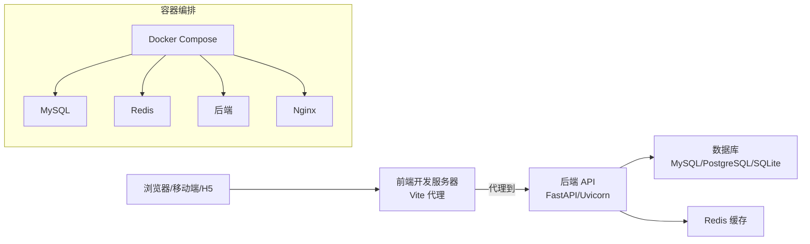
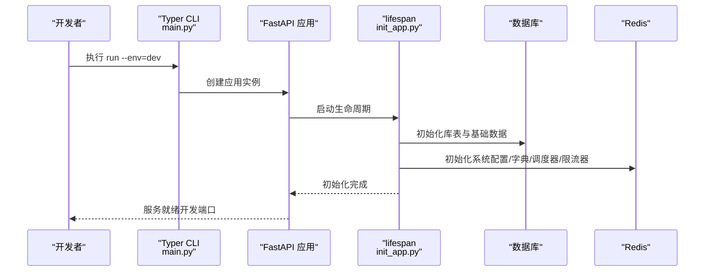
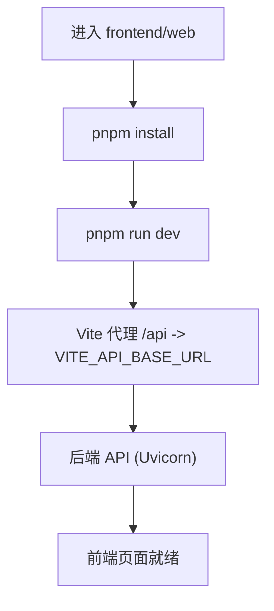
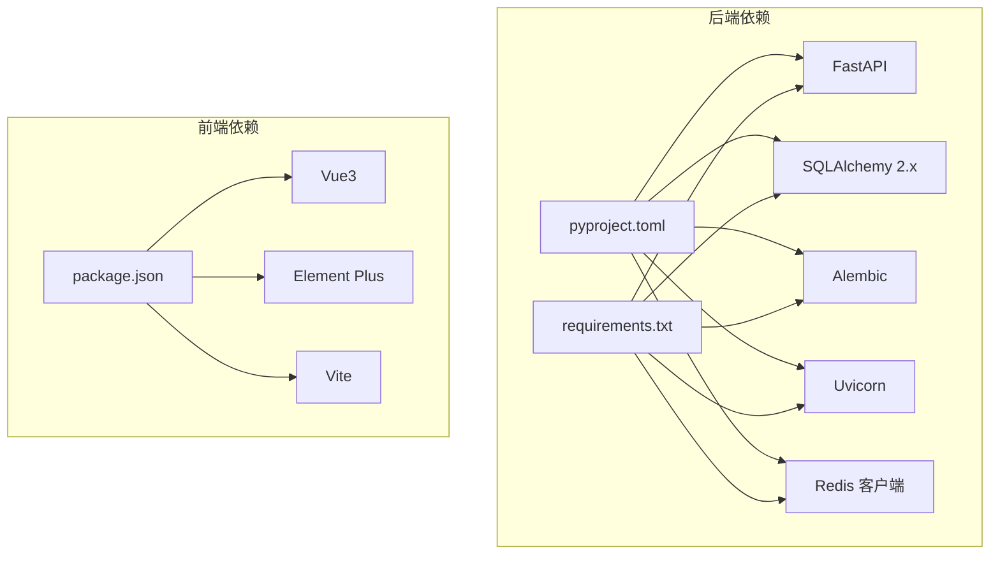

# 快速开始

<cite>
**本文引用的文件**
- [README.md](file://README.md)
- [main.py](file://backend/main.py)
- [pyproject.toml](file://backend/pyproject.toml)
- [requirements.txt](file://backend/requirements.txt)
- [run_linux.sh](file://backend/run_linux.sh)
- [run_win.bat](file://backend/run_win.bat)
- [setting.py](file://backend/app/config/setting.py)
- [init_app.py](file://backend/app/scripts/init_app.py)
- [alembic.ini](file://backend/alembic.ini)
- [.env.development](file://frontend/web/.env.development)
- [package.json](file://frontend/web/package.json)
- [vite.config.ts](file://frontend/web/vite.config.ts)
- [docker-compose.yaml](file://docker/docker-compose.yaml)
</cite>

## 目录
1. [简介](#简介)
2. [项目结构](#项目结构)
3. [核心组件](#核心组件)
4. [架构总览](#架构总览)
5. [详细组件分析](#详细组件分析)
6. [依赖关系分析](#依赖关系分析)
7. [性能考虑](#性能考虑)
8. [故障排除指南](#故障排除指南)
9. [结论](#结论)
10. [附录](#附录)

## 简介
本指南面向首次接触 FastapiAdmin 的开发者，提供从零到一的完整快速开始流程。内容覆盖系统要求、依赖安装、环境变量配置、数据库与 Redis 初始化、后端与前端启动步骤、首次运行全流程、常见问题与进阶配置建议。目标是在最短时间内帮助你在本地成功运行项目。

## 项目结构
FastapiAdmin 采用前后端分离架构，后端基于 FastAPI，前端包含 Vue3 Web、UniApp H5 与 VitePress 文档站点。项目还提供 Docker Compose 一键部署方案。

```mermaid
graph TB
subgraph "后端"
BE["FastAPI 应用<br/>main.py"]
CFG["配置系统<br/>setting.py"]
INIT["应用初始化<br/>init_app.py"]
DB[("数据库")]
RDS[("Redis")]
end
subgraph "前端"
FE_WEB["Vue3 Web<br/>.env.development"]
FE_APP["UniApp H5"]
FE_DOCS["VitePress 文档"]
end
subgraph "容器"
DC["Docker Compose"]
MYSQL["MySQL 8.0"]
REDIS["Redis 7.x"]
NGINX["Nginx"]
end
FE_WEB --> |HTTP(S)| BE
FE_APP --> |HTTP(S)| BE
FE_DOCS --> |HTTP(S)| BE
BE --> DB
BE --> RDS
DC --> MYSQL
DC --> REDIS
DC --> BE
DC --> NGINX
```

图表来源
- [main.py:16-51](file://backend/main.py#L16-L51)
- [setting.py:257-313](file://backend/app/config/setting.py#L257-L313)
- [init_app.py:27-93](file://backend/app/scripts/init_app.py#L27-L93)
- [docker-compose.yaml:9-201](file://docker/docker-compose.yaml#L9-L201)

章节来源
- [README.md:96-115](file://README.md#L96-L115)
- [README.md:117-156](file://README.md#L117-L156)

## 核心组件
- 后端应用入口与命令行工具：通过 Typer 提供 run、revision、upgrade 等命令，支持 dev/prod 环境切换与 Uvicorn 启动。
- 配置系统：集中管理服务器、数据库、Redis、JWT、API 文档、静态资源、Gzip、OAuth 等配置项。
- 应用生命周期与初始化：在 lifespan 中完成数据库初始化、Redis 系统配置与数据字典、定时任务调度器、请求限流器的准备。
- 前端开发与构建：Vite 提供开发服务器与代理，支持按需自动导入、组件自动注册、构建产物分包优化。
- Docker Compose：一键拉起 MySQL、Redis、后端与 Nginx，便于本地与生产部署。

章节来源
- [main.py:54-107](file://backend/main.py#L54-L107)
- [setting.py:13-355](file://backend/app/config/setting.py#L13-L355)
- [init_app.py:27-93](file://backend/app/scripts/init_app.py#L27-L93)
- [vite.config.ts:49-72](file://frontend/web/vite.config.ts#L49-L72)

## 架构总览
后端通过 Uvicorn 提供 HTTP 服务，前端通过 Vite 代理转发到后端。数据库与 Redis 由后端在启动时初始化并使用。Docker Compose 将服务解耦为独立容器并通过网络互联。



图表来源
- [README.md:117-156](file://README.md#L117-L156)
- [docker-compose.yaml:88-141](file://docker/docker-compose.yaml#L88-L141)

## 详细组件分析

### 环境要求与依赖安装
- 后端运行时
  - Python ≥ 3.10（推荐 3.12）
  - FastAPI、SQLAlchemy 2.x、Alembic、Redis 客户端、Uvicorn 等
  - 推荐使用 uv 进行依赖同步，或使用 pip 安装 requirements.txt
- 前端运行时
  - Node.js ≥ 20
  - pnpm 作为包管理器
- 数据库与缓存
  - MySQL ≥ 8.0 或 PostgreSQL/SQLite（可在配置中切换）
  - Redis ≥ 7.0（与 .env.dev 一致）

章节来源
- [README.md:221-231](file://README.md#L221-L231)
- [pyproject.toml:6-52](file://backend/pyproject.toml#L6-L52)
- [requirements.txt:1-45](file://backend/requirements.txt#L1-L45)
- [package.json:188-193](file://frontend/web/package.json#L188-L193)

### 环境变量与配置
- 后端
  - 环境文件：backend/env/.env.dev（开发）与 .env.prod（生产）
  - 关键配置项：服务器地址与端口、数据库类型与连接、Redis 连接、JWT 密钥、API 文档路径、静态资源路径、Gzip、上传目录等
  - 配置加载：通过 pydantic-settings 从 .env.{env} 加载，支持 LRU 缓存
- 前端
  - 环境文件：frontend/web/.env.development（开发）
  - 关键配置项：VITE_API_BASE_URL（后端地址）、VITE_APP_WS_ENDPOINT（WebSocket）、VITE_PORT（开发端口）、VITE_API_URL（同源前缀）

章节来源
- [setting.py:13-355](file://backend/app/config/setting.py#L13-L355)
- [.env.development:1-22](file://frontend/web/.env.development#L1-L22)
- [vite.config.ts:49-72](file://frontend/web/vite.config.ts#L49-L72)

### 数据库初始化与 Alembic
- 首次启动后端会自动完成数据库表结构与基础数据初始化，通常无需手动执行 upgrade
- 如需管理模型变更，使用 revision 生成迁移脚本，使用 upgrade 应用迁移
- Alembic 配置位于 backend/alembic.ini，脚本位置与版本目录在其中定义

章节来源
- [README.md:209-220](file://README.md#L209-L220)
- [main.py:109-158](file://backend/main.py#L109-L158)
- [alembic.ini:1-120](file://backend/alembic.ini#L1-L120)

### Redis 配置与使用
- 后端在 lifespan 中通过 EVENT_LIST 动态加载 Redis 连接模块
- 配置项包含主机、端口、DB 名称、用户名与密码
- 用于系统参数、数据字典、定时任务调度器与请求限流器

章节来源
- [setting.py:106-114](file://backend/app/config/setting.py#L106-L114)
- [init_app.py:49-61](file://backend/app/scripts/init_app.py#L49-L61)

### 后端启动流程
- 使用 uv（推荐）或 pip 安装依赖后，执行 uv run main.py run --env=dev
- 首次启动会自动初始化数据库与基础数据，无需先执行 upgrade
- 开发环境支持热重载，生产环境通过 --env=prod 切换



图表来源
- [main.py:54-107](file://backend/main.py#L54-L107)
- [init_app.py:27-93](file://backend/app/scripts/init_app.py#L27-L93)

章节来源
- [README.md:245-271](file://README.md#L245-L271)
- [run_linux.sh:105-138](file://backend/run_linux.sh#L105-L138)
- [run_win.bat:84-99](file://backend/run_win.bat#L84-L99)

### 前端启动流程
- 进入 frontend/web，执行 pnpm install 安装依赖，再执行 pnpm run dev 启动开发服务器
- Vite 代理将 /api 前缀请求转发至后端地址（由 .env.development 的 VITE_API_BASE_URL 指定）
- 默认端口与访问地址以 .env.development 为准



图表来源
- [README.md:272-303](file://README.md#L272-L303)
- [vite.config.ts:49-72](file://frontend/web/vite.config.ts#L49-L72)
- [.env.development:13-14](file://frontend/web/.env.development#L13-L14)

章节来源
- [README.md:272-303](file://README.md#L272-L303)
- [package.json:7-34](file://frontend/web/package.json#L7-L34)

### 首次运行完整操作流程
- 克隆代码并创建环境变量文件
  - 后端：复制 backend/env/.env.dev.example 为 backend/env/.env.dev
  - 前端：复制 frontend/web/.env.development.example 为 frontend/web/.env.development
- 安装后端依赖并启动
  - 推荐使用 uv sync；或 pip install -r requirements.txt 后 python main.py run --env=dev
- 安装前端依赖并启动
  - 进入 frontend/web，执行 pnpm install 与 pnpm run dev
- 打开浏览器访问前端地址（默认 5173），使用管理员账号登录（默认 admin/123456）

章节来源
- [README.md:209-218](file://README.md#L209-L218)
- [README.md:232-244](file://README.md#L232-L244)

### Docker 一键部署
- 使用 docker compose 启动 MySQL、Redis、后端与 Nginx
- 环境变量通过 .env 文件注入，端口映射与健康检查已配置
- 支持开发与生产环境切换

章节来源
- [README.md:317-347](file://README.md#L317-L347)
- [docker-compose.yaml:1-201](file://docker/docker-compose.yaml#L1-L201)

## 依赖关系分析
后端与前端的依赖与版本约束在各自清单文件中声明，后端使用 pyproject.toml 与 requirements.txt 保持一致；前端使用 package.json 管理依赖与脚本。



图表来源
- [pyproject.toml:1-52](file://backend/pyproject.toml#L1-L52)
- [requirements.txt:1-45](file://backend/requirements.txt#L1-L45)
- [package.json:68-178](file://frontend/web/package.json#L68-L178)

章节来源
- [pyproject.toml:1-52](file://backend/pyproject.toml#L1-L52)
- [requirements.txt:1-45](file://backend/requirements.txt#L1-L45)
- [package.json:68-178](file://frontend/web/package.json#L68-L178)

## 性能考虑
- 后端
  - 使用异步数据库驱动（asyncpg/asyncmy/aiosqlite）提升 I/O 性能
  - 连接池参数可调（POOL_SIZE、MAX_OVERFLOW、POOL_TIMEOUT 等）
  - Gzip 压缩与静态资源托管优化传输
- 前端
  - Vite 构建按需分包，减少首屏体积
  - 依赖预优化与按需组件自动导入
- 容器化
  - Docker Compose 为各服务设置资源限制与健康检查，便于生产部署

章节来源
- [setting.py:86-96](file://backend/app/config/setting.py#L86-L96)
- [setting.py:167-170](file://backend/app/config/setting.py#L167-L170)
- [vite.config.ts:86-173](file://frontend/web/vite.config.ts#L86-L173)
- [docker-compose.yaml:41-87](file://docker/docker-compose.yaml#L41-L87)

## 故障排除指南
- 后端启动失败
  - 确认 .env.dev 中数据库与 Redis 连接正确
  - 首次启动无需手动 upgrade，若自行修改模型再使用 revision/upgrade
  - 开发环境可开启 reload，生产环境使用 --env=prod
- 前端无法访问后端
  - 检查 .env.development 的 VITE_API_BASE_URL 与后端地址一致
  - 确认 Vite 代理配置与后端 ROOT_PATH 一致
- 数据库初始化异常
  - 确认数据库已创建且用户权限正确
  - 如需重置迁移记录，使用 run_linux.sh/run_win.bat 菜单中的“重置迁移记录”
- Docker 启动失败
  - 检查 .env 文件中的环境变量是否设置
  - 查看容器日志与健康检查状态

章节来源
- [README.md:558-586](file://README.md#L558-L586)
- [run_linux.sh:166-189](file://backend/run_linux.sh#L166-L189)
- [run_win.bat:115-131](file://backend/run_win.bat#L115-L131)
- [docker-compose.yaml:1-201](file://docker/docker-compose.yaml#L1-L201)

## 结论
通过本快速开始指南，你可以完成从环境准备、依赖安装、配置设置到后端与前端启动的全流程。首次运行无需手动迁移，后端会在启动时自动初始化数据库与基础数据。遇到问题时，可参考故障排除章节或使用提供的脚本辅助诊断。建议在开发阶段使用 uv 与 Vite，生产阶段使用 Docker Compose 一键部署。

## 附录
- 常用命令
  - 后端：uv run main.py run --env=dev；uv run main.py revision --env=dev；uv run main.py upgrade --env=dev
  - 前端：pnpm install；pnpm run dev；pnpm run build
  - Docker：docker compose --env-file .env up -d
- 进阶配置
  - 修改数据库类型与连接参数
  - 调整 Redis 参数与持久化策略
  - 自定义 API 文档样式与静态资源路径
  - 配置 OAuth 登录与第三方回调地址

章节来源
- [README.md:245-347](file://README.md#L245-L347)
- [setting.py:97-138](file://backend/app/config/setting.py#L97-L138)
- [vite.config.ts:49-72](file://frontend/web/vite.config.ts#L49-L72)
- [docker-compose.yaml:9-201](file://docker/docker-compose.yaml#L9-L201)