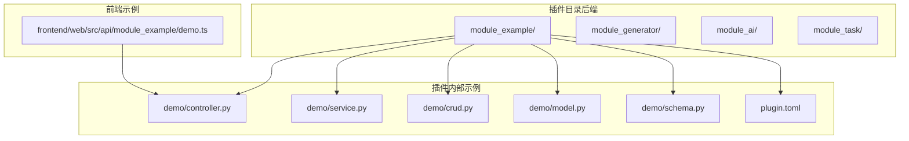
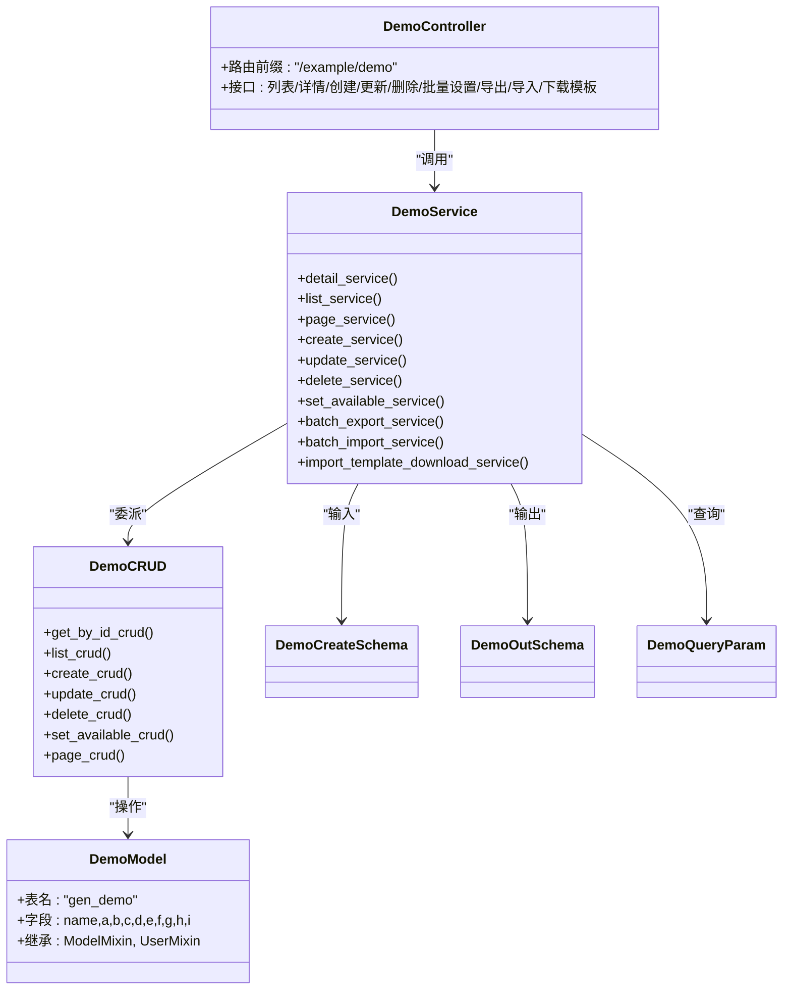
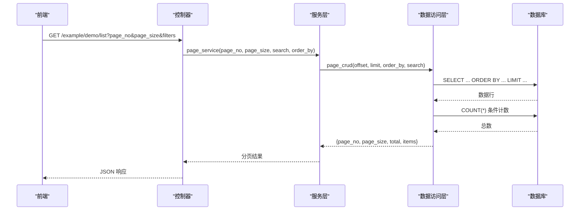
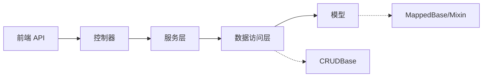

# 插件开发指南

<cite>
**本文引用的文件**   
- [plugin.toml（示例插件）](file://backend/app/plugin/module_example/plugin.toml)
- [plugin.toml（代码生成插件）](file://backend/app/plugin/module_generator/plugin.toml)
- [plugin.toml（AI 子系统插件）](file://backend/app/plugin/module_ai/plugin.toml)
- [plugin.toml（任务与工作流插件）](file://backend/app/plugin/module_task/plugin.toml)
- [控制器（示例模块）](file://backend/app/plugin/module_example/demo/controller.py)
- [服务层（示例模块）](file://backend/app/plugin/module_example/demo/service.py)
- [数据访问层（示例模块）](file://backend/app/plugin/module_example/demo/crud.py)
- [模型（示例模块）](file://backend/app/plugin/module_example/demo/model.py)
- [请求/响应模型（示例模块）](file://backend/app/plugin/module_example/demo/schema.py)
- [基础 CRUD 抽象类](file://backend/app/core/base_crud.py)
- [基础模型抽象类](file://backend/app/core/base_model.py)
- [前端 API（示例模块）](file://frontend/web/src/api/module_example/demo.ts)
</cite>

## 目录
1. [简介](#简介)
2. [项目结构](#项目结构)
3. [核心组件](#核心组件)
4. [架构总览](#架构总览)
5. [详细组件分析](#详细组件分析)
6. [依赖分析](#依赖分析)
7. [性能考虑](#性能考虑)
8. [故障排查指南](#故障排查指南)
9. [结论](#结论)
10. [附录](#附录)

## 简介
本指南面向希望在 FastapiAdmin 中开发“插件”的工程师，提供从零开始创建新插件的完整流程与最佳实践。内容涵盖：
- 插件目录结构规范与文件命名约定
- 插件配置文件 plugin.toml 的参数说明与配置方法
- MVC 架构实现：控制器、服务层、数据访问层、模型层的开发模式
- 实际示例：CRUD、API 接口与前端集成
- 代码规范、性能与安全建议，以及常见问题与规避方法

## 项目结构
FastapiAdmin 的插件采用“模块化 + 动态路由注册”的组织方式，每个插件位于 backend/app/plugin 下的独立模块目录中，内部遵循统一的 MVC 结构。

图表来源
- [plugin.toml（示例插件）:1-10](file://backend/app/plugin/module_example/plugin.toml#L1-L10)
- [plugin.toml（代码生成插件）:1-9](file://backend/app/plugin/module_generator/plugin.toml#L1-L9)
- [plugin.toml（AI 子系统插件）:1-9](file://backend/app/plugin/module_ai/plugin.toml#L1-L9)
- [plugin.toml（任务与工作流插件）:1-9](file://backend/app/plugin/module_task/plugin.toml#L1-L9)
- [控制器（示例模块）:1-264](file://backend/app/plugin/module_example/demo/controller.py#L1-L264)
- [服务层（示例模块）:1-327](file://backend/app/plugin/module_example/demo/service.py#L1-L327)
- [数据访问层（示例模块）:1-136](file://backend/app/plugin/module_example/demo/crud.py#L1-L136)
- [模型（示例模块）:1-48](file://backend/app/plugin/module_example/demo/model.py#L1-L48)
- [请求/响应模型（示例模块）:1-125](file://backend/app/plugin/module_example/demo/schema.py#L1-L125)
- [前端 API（示例模块）:1-125](file://frontend/web/src/api/module_example/demo.ts#L1-L125)

章节来源
- [plugin.toml（示例插件）:1-10](file://backend/app/plugin/module_example/plugin.toml#L1-L10)
- [plugin.toml（代码生成插件）:1-9](file://backend/app/plugin/module_generator/plugin.toml#L1-L9)
- [plugin.toml（AI 子系统插件）:1-9](file://backend/app/plugin/module_ai/plugin.toml#L1-L9)
- [plugin.toml（任务与工作流插件）:1-9](file://backend/app/plugin/module_task/plugin.toml#L1-L9)

## 核心组件
- 插件配置文件 plugin.toml：声明插件元数据与特性，决定是否可选、标签与版本等。
- 控制器（Controller）：接收 HTTP 请求，解析参数，调用服务层，返回标准化响应。
- 服务层（Service）：编排业务逻辑，协调数据访问层，处理导入导出、校验与异常。
- 数据访问层（CRUD）：封装数据库操作，提供增删改查、分页、批量操作等。
- 模型层（Model）：定义数据库表结构与字段，继承通用 Mixin 实现审计、软删除、租户隔离等。
- 请求/响应模型（Schema）：定义输入输出数据结构与校验规则。

章节来源
- [控制器（示例模块）:1-264](file://backend/app/plugin/module_example/demo/controller.py#L1-L264)
- [服务层（示例模块）:1-327](file://backend/app/plugin/module_example/demo/service.py#L1-L327)
- [数据访问层（示例模块）:1-136](file://backend/app/plugin/module_example/demo/crud.py#L1-L136)
- [模型（示例模块）:1-48](file://backend/app/plugin/module_example/demo/model.py#L1-L48)
- [请求/响应模型（示例模块）:1-125](file://backend/app/plugin/module_example/demo/schema.py#L1-L125)
- [基础 CRUD 抽象类:1-571](file://backend/app/core/base_crud.py#L1-L571)
- [基础模型抽象类:1-228](file://backend/app/core/base_model.py#L1-L228)

## 架构总览
下面的类图展示了插件 MVC 的核心关系与职责分工。

图表来源
- [控制器（示例模块）:1-264](file://backend/app/plugin/module_example/demo/controller.py#L1-L264)
- [服务层（示例模块）:1-327](file://backend/app/plugin/module_example/demo/service.py#L1-L327)
- [数据访问层（示例模块）:1-136](file://backend/app/plugin/module_example/demo/crud.py#L1-L136)
- [模型（示例模块）:1-48](file://backend/app/plugin/module_example/demo/model.py#L1-L48)
- [请求/响应模型（示例模块）:1-125](file://backend/app/plugin/module_example/demo/schema.py#L1-L125)

## 详细组件分析

### 插件配置文件 plugin.toml
- 作用：声明插件元数据，用于文档、运维与门户展示；不参与运行时依赖安装。
- 关键字段
  - name：插件唯一标识（小写、短横线风格）
  - title：插件显示名称
  - version：版本号
  - description：简要描述
  - optional：是否可选
  - tags：标签数组，便于分类检索
- 配置示例与参考
  - [示例插件配置:1-10](file://backend/app/plugin/module_example/plugin.toml#L1-L10)
  - [代码生成插件配置:1-9](file://backend/app/plugin/module_generator/plugin.toml#L1-L9)
  - [AI 子系统插件配置:1-9](file://backend/app/plugin/module_ai/plugin.toml#L1-L9)
  - [任务与工作流插件配置:1-9](file://backend/app/plugin/module_task/plugin.toml#L1-L9)

章节来源
- [plugin.toml（示例插件）:1-10](file://backend/app/plugin/module_example/plugin.toml#L1-L10)
- [plugin.toml（代码生成插件）:1-9](file://backend/app/plugin/module_generator/plugin.toml#L1-L9)
- [plugin.toml（AI 子系统插件）:1-9](file://backend/app/plugin/module_ai/plugin.toml#L1-L9)
- [plugin.toml（任务与工作流插件）:1-9](file://backend/app/plugin/module_task/plugin.toml#L1-L9)

### 控制器（Controller）
- 路由前缀与标签：统一使用 OperationLogRoute，前缀为模块名，标签用于 Swagger 分组。
- 主要接口
  - 列表/分页：支持分页参数与复杂查询参数
  - 详情：按 ID 查询
  - 创建/更新：使用 Pydantic 输入模型
  - 删除/批量设置：支持批量 ID 与状态切换
  - 导出/导入/下载模板：支持 Excel 流式响应与模板生成
- 权限与日志：依赖认证与权限装饰器，统一记录操作日志
- 参考实现
  - [控制器（示例模块）:1-264](file://backend/app/plugin/module_example/demo/controller.py#L1-L264)

章节来源
- [控制器（示例模块）:1-264](file://backend/app/plugin/module_example/demo/controller.py#L1-L264)

### 服务层（Service）
- 职责：编排业务、参数校验、异常处理、导入导出与模板生成。
- 关键能力
  - CRUD 调用：委派给 DemoCRUD
  - 分页与列表：构建查询条件与排序
  - 导入：读取 Excel、字段映射、校验与批量创建/更新
  - 导出：字典映射、状态转换、生成 Excel 流
  - 模板：生成带下拉选项的 Excel 模板
- 参考实现
  - [服务层（示例模块）:1-327](file://backend/app/plugin/module_example/demo/service.py#L1-L327)

章节来源
- [服务层（示例模块）:1-327](file://backend/app/plugin/module_example/demo/service.py#L1-L327)

### 数据访问层（CRUD）
- 继承 CRUDBase 泛型基类，统一实现增删改查、分页、批量更新与软删除。
- 特性
  - 条件构造：支持模糊、精确、范围、空值等查询策略
  - 排序：支持多字段升/降序
  - 预加载：selectinload 避免异步环境问题
  - 权限过滤：自动注入数据权限过滤
  - 软删除：根据模型是否具备软删除字段自动选择物理/软删除
- 参考实现
  - [基础 CRUD 抽象类:1-571](file://backend/app/core/base_crud.py#L1-L571)
  - [数据访问层（示例模块）:1-136](file://backend/app/plugin/module_example/demo/crud.py#L1-L136)

章节来源
- [基础 CRUD 抽象类:1-571](file://backend/app/core/base_crud.py#L1-L571)
- [数据访问层（示例模块）:1-136](file://backend/app/plugin/module_example/demo/crud.py#L1-L136)

### 模型层（Model）
- 继承通用 Mixin
  - ModelMixin：基础字段（id、uuid、status、时间戳、软删除）、审计字段
  - UserMixin：created_id/updated_id/deleted_id 及其关联关系
- 示例模型 DemoModel
  - 表名与注释
  - 字段覆盖常用数据类型（字符串、整数、浮点、布尔、日期/时间、长文本、JSON）
  - 预加载关系：created_by、updated_by、deleted_by
- 参考实现
  - [基础模型抽象类:1-228](file://backend/app/core/base_model.py#L1-L228)
  - [模型（示例模块）:1-48](file://backend/app/plugin/module_example/demo/model.py#L1-L48)

章节来源
- [基础模型抽象类:1-228](file://backend/app/core/base_model.py#L1-L228)
- [模型（示例模块）:1-48](file://backend/app/plugin/module_example/demo/model.py#L1-L48)

### 请求/响应模型（Schema）
- 输入模型：DemoCreateSchema/DemoUpdateSchema，包含字段校验与业务规则校验
- 输出模型：DemoOutSchema，继承 BaseSchema 与 UserBySchema，用于序列化响应
- 查询参数：DemoQueryParam，将 Query 参数转为内部查询条件（模糊、精确、范围、时间区间等）
- 参考实现
  - [请求/响应模型（示例模块）:1-125](file://backend/app/plugin/module_example/demo/schema.py#L1-L125)

章节来源
- [请求/响应模型（示例模块）:1-125](file://backend/app/plugin/module_example/demo/schema.py#L1-L125)

### 前端集成（示例）
- 前端 API 文件与后端控制器一一对应，统一前缀与方法名
- 支持分页查询、导入导出、模板下载等
- 类型定义与后端 Schema 保持一致
- 参考实现
  - [前端 API（示例模块）:1-125](file://frontend/web/src/api/module_example/demo.ts#L1-L125)

章节来源
- [前端 API（示例模块）:1-125](file://frontend/web/src/api/module_example/demo.ts#L1-L125)

### 从零创建新插件的步骤
- 步骤一：创建插件目录与配置
  - 在 backend/app/plugin 下新建模块目录（如 module_yourname）
  - 在模块内创建 plugin.toml，填写 name/title/version/description/tags/optional
  - 参考：[插件配置示例:1-10](file://backend/app/plugin/module_example/plugin.toml#L1-L10)
- 步骤二：创建 MVC 目录与文件
  - 在模块内创建 demo 子目录，包含 controller.py、service.py、crud.py、model.py、schema.py
  - 参考：[示例 MVC 文件:1-264](file://backend/app/plugin/module_example/demo/controller.py#L1-L264)
- 步骤三：定义模型与表结构
  - 在 model.py 中定义 SQLAlchemy 模型，继承通用 Mixin
  - 参考：[模型示例:1-48](file://backend/app/plugin/module_example/demo/model.py#L1-L48)
- 步骤四：编写请求/响应模型
  - 在 schema.py 中定义输入/输出模型与查询参数
  - 参考：[Schema 示例:1-125](file://backend/app/plugin/module_example/demo/schema.py#L1-L125)
- 步骤五：实现服务层与数据访问层
  - 在 service.py 中编排业务逻辑
  - 在 crud.py 中继承 CRUDBase，实现 CRUD 方法
  - 参考：[服务层示例:1-327](file://backend/app/plugin/module_example/demo/service.py#L1-L327)，[CRUD 示例:1-136](file://backend/app/plugin/module_example/demo/crud.py#L1-L136)
- 步骤六：实现控制器与路由
  - 在 controller.py 中定义路由前缀与接口，调用服务层
  - 参考：[控制器示例:1-264](file://backend/app/plugin/module_example/demo/controller.py#L1-L264)
- 步骤七：前端对接
  - 在 frontend/web/src/api 下创建同名 API 文件，与后端接口保持一致
  - 参考：[前端 API 示例:1-125](file://frontend/web/src/api/module_example/demo.ts#L1-L125)
- 步骤八：测试与验证
  - 使用 Swagger/Redoc 调试接口
  - 验证权限、分页、导入导出、模板下载等功能

章节来源
- [plugin.toml（示例插件）:1-10](file://backend/app/plugin/module_example/plugin.toml#L1-L10)
- [控制器（示例模块）:1-264](file://backend/app/plugin/module_example/demo/controller.py#L1-L264)
- [服务层（示例模块）:1-327](file://backend/app/plugin/module_example/demo/service.py#L1-L327)
- [数据访问层（示例模块）:1-136](file://backend/app/plugin/module_example/demo/crud.py#L1-L136)
- [模型（示例模块）:1-48](file://backend/app/plugin/module_example/demo/model.py#L1-L48)
- [请求/响应模型（示例模块）:1-125](file://backend/app/plugin/module_example/demo/schema.py#L1-L125)
- [前端 API（示例模块）:1-125](file://frontend/web/src/api/module_example/demo.ts#L1-L125)

### API 调用时序（示例：分页查询）

图表来源
- [控制器（示例模块）:47-78](file://backend/app/plugin/module_example/demo/controller.py#L47-L78)
- [服务层（示例模块）:67-98](file://backend/app/plugin/module_example/demo/service.py#L67-L98)
- [数据访问层（示例模块）:104-135](file://backend/app/plugin/module_example/demo/crud.py#L104-L135)
- [基础 CRUD 抽象类:151-214](file://backend/app/core/base_crud.py#L151-L214)

## 依赖分析
- 控制器依赖服务层，服务层依赖数据访问层，数据访问层依赖模型与数据库
- 基础类提供跨模块复用能力：CRUDBase、MappedBase/Mixin
- 前端 API 与后端控制器一一对应，形成稳定的契约

图表来源
- [控制器（示例模块）:1-264](file://backend/app/plugin/module_example/demo/controller.py#L1-L264)
- [服务层（示例模块）:1-327](file://backend/app/plugin/module_example/demo/service.py#L1-L327)
- [数据访问层（示例模块）:1-136](file://backend/app/plugin/module_example/demo/crud.py#L1-L136)
- [模型（示例模块）:1-48](file://backend/app/plugin/module_example/demo/model.py#L1-L48)
- [基础 CRUD 抽象类:1-571](file://backend/app/core/base_crud.py#L1-L571)
- [基础模型抽象类:1-228](file://backend/app/core/base_model.py#L1-L228)
- [前端 API（示例模块）:1-125](file://frontend/web/src/api/module_example/demo.ts#L1-L125)

章节来源
- [基础 CRUD 抽象类:1-571](file://backend/app/core/base_crud.py#L1-L571)
- [基础模型抽象类:1-228](file://backend/app/core/base_model.py#L1-L228)

## 性能考虑
- 分页查询
  - 使用数据库侧分页与主键计数，避免全表扫描
  - 参考：[分页实现:151-214](file://backend/app/core/base_crud.py#L151-L214)
- 预加载
  - 使用 selectinload 避免 N+1 查询与异步环境问题
  - 参考：[预加载实现:534-570](file://backend/app/core/base_crud.py#L534-L570)
- 条件查询
  - 统一条件构造，支持模糊、范围、空值等策略
  - 参考：[条件构造:453-512](file://backend/app/core/base_crud.py#L453-L512)
- 导入导出
  - 使用流式响应与模板生成，减少内存占用
  - 参考：[导入导出实现:182-326](file://backend/app/plugin/module_example/demo/service.py#L182-L326)

章节来源
- [基础 CRUD 抽象类:151-214](file://backend/app/core/base_crud.py#L151-L214)
- [基础 CRUD 抽象类:534-570](file://backend/app/core/base_crud.py#L534-L570)
- [基础 CRUD 抽象类:453-512](file://backend/app/core/base_crud.py#L453-L512)
- [服务层（示例模块）:182-326](file://backend/app/plugin/module_example/demo/service.py#L182-L326)

## 故障排查指南
- 常见问题与解决
  - 权限不足：检查控制器中的权限装饰器与角色数据权限配置
  - 查询无结果：确认查询参数与条件构造是否正确
  - 导入失败：检查 Excel 表头、必填字段与状态值映射
  - 导出异常：确认导出模板映射与状态转换逻辑
- 错误处理
  - 统一抛出自定义异常，前端捕获并提示
  - 参考：[异常处理:69-70](file://backend/app/core/base_crud.py#L69-L70)
- 日志与审计
  - 控制器统一记录操作日志，便于追踪
  - 参考：[控制器日志:42-44](file://backend/app/plugin/module_example/demo/controller.py#L42-L44)

章节来源
- [基础 CRUD 抽象类:69-70](file://backend/app/core/base_crud.py#L69-L70)
- [控制器（示例模块）:42-44](file://backend/app/plugin/module_example/demo/controller.py#L42-L44)

## 结论
通过遵循本指南的目录结构、配置规范与 MVC 开发模式，开发者可以快速、稳定地在 FastapiAdmin 中创建高质量插件。建议在开发过程中：
- 严格遵守 CRUD 基类与模型 Mixin 的约定
- 使用统一的 Schema 定义输入输出
- 注重权限过滤与数据隔离
- 优化分页与导入导出性能
- 保持前后端接口契约一致

## 附录

### 插件配置文件参数对照表
- name：插件唯一标识（小写、短横线风格）
- title：插件显示名称
- version：版本号
- description：简要描述
- optional：是否可选（true/false）
- tags：标签数组，便于分类检索

章节来源
- [plugin.toml（示例插件）:1-10](file://backend/app/plugin/module_example/plugin.toml#L1-L10)
- [plugin.toml（代码生成插件）:1-9](file://backend/app/plugin/module_generator/plugin.toml#L1-L9)
- [plugin.toml（AI 子系统插件）:1-9](file://backend/app/plugin/module_ai/plugin.toml#L1-L9)
- [plugin.toml（任务与工作流插件）:1-9](file://backend/app/plugin/module_task/plugin.toml#L1-L9)