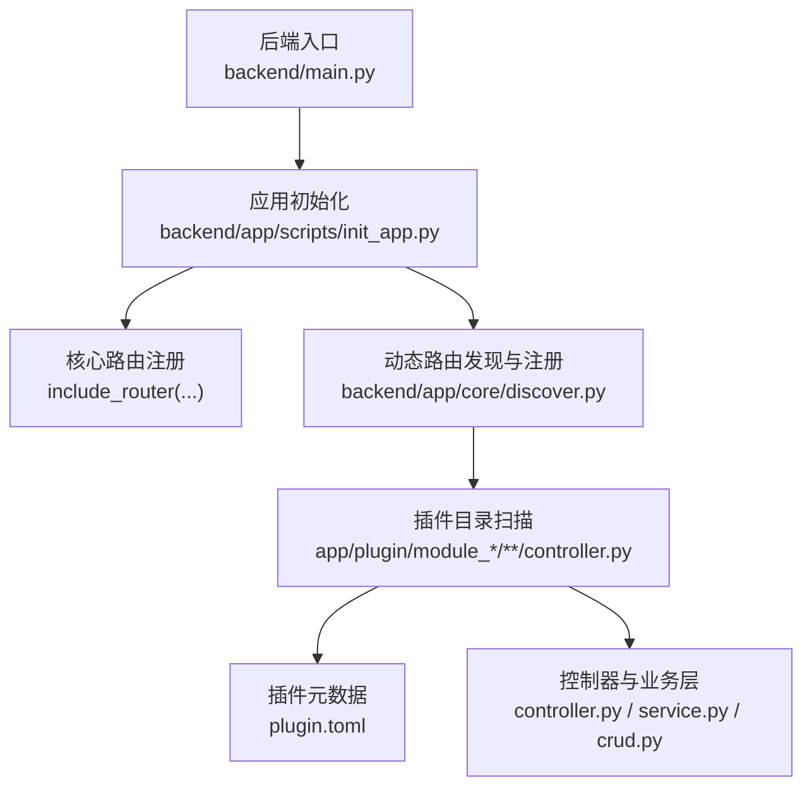
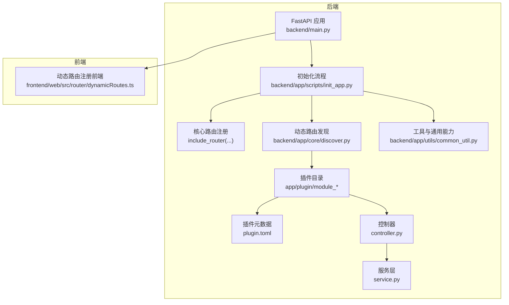
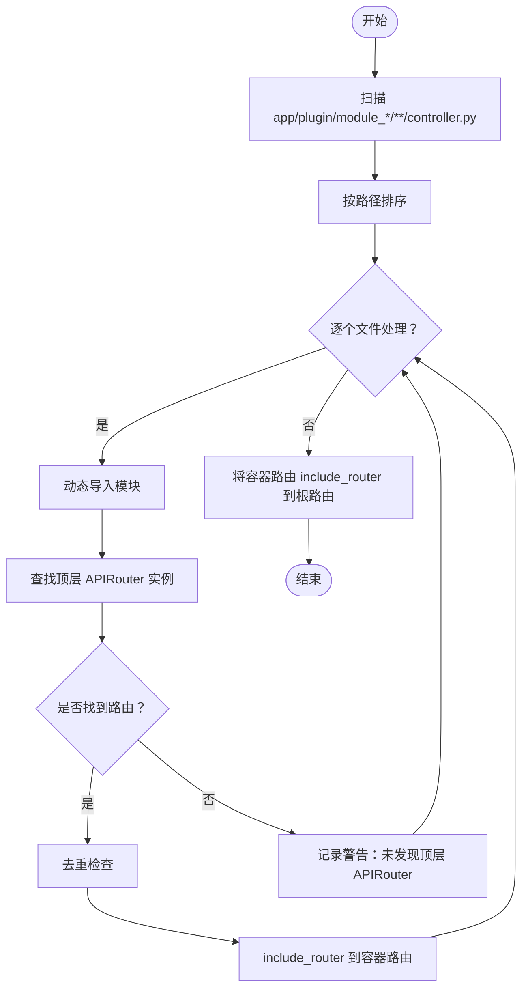
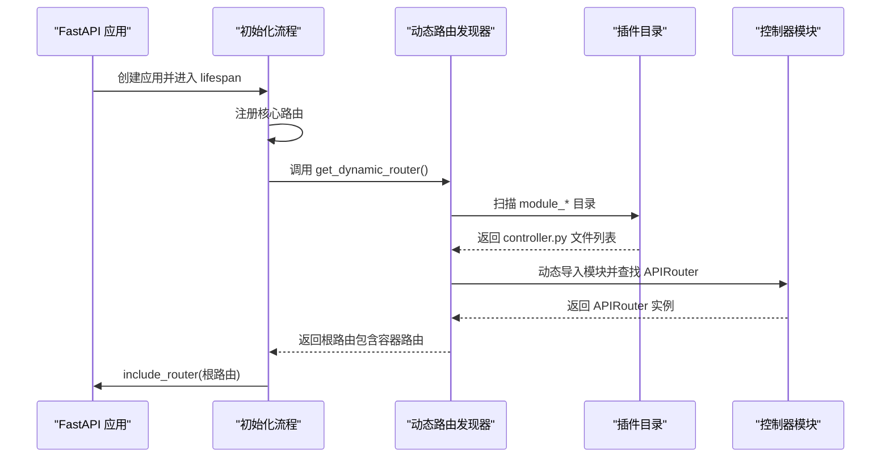
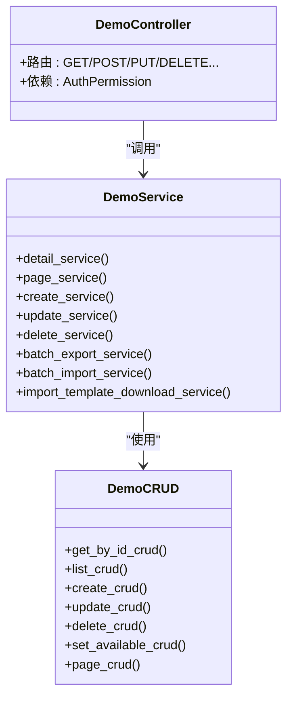
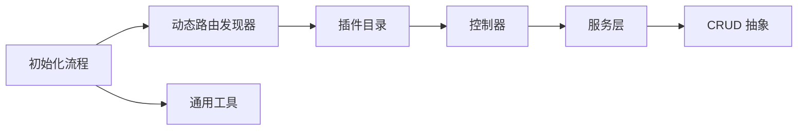

# 插件架构原理

<cite>
**本文引用的文件**
- [main.py](file://backend/main.py)
- [init_app.py](file://backend/app/scripts/init_app.py)
- [discover.py](file://backend/app/core/discover.py)
- [common_util.py](file://backend/app/utils/common_util.py)
- [plugin.toml（示例）](file://backend/app/plugin/module_example/plugin.toml)
- [plugin.toml（AI）](file://backend/app/plugin/module_ai/plugin.toml)
- [plugin.toml（代码生成）](file://backend/app/plugin/module_generator/plugin.toml)
- [plugin.toml（任务）](file://backend/app/plugin/module_task/plugin.toml)
- [controller.py（示例）](file://backend/app/plugin/module_example/demo/controller.py)
- [service.py（示例）](file://backend/app/plugin/module_example/demo/service.py)
- [crud.py（示例）](file://backend/app/plugin/module_example/demo/crud.py)
- [controller.py（AI 聊天）](file://backend/app/plugin/module_ai/chat/controller.py)
- [dynamicRoutes.ts（前端路由注册）](file://frontend/web/src/router/dynamicRoutes.ts)
</cite>

## 目录
1. [引言](#引言)
2. [项目结构](#项目结构)
3. [核心组件](#核心组件)
4. [架构总览](#架构总览)
5. [组件详解](#组件详解)
6. [依赖关系分析](#依赖关系分析)
7. [性能考量](#性能考量)
8. [故障排查指南](#故障排查指南)
9. [结论](#结论)
10. [附录](#附录)

## 引言
本文件系统性阐述 FastapiAdmin 的插件化架构原理，重点围绕模块化设计、动态加载机制、路由自动注册与插件发现算法展开。文档同时解释插件与主系统的交互模式、数据隔离与安全边界，并提供架构图与组件关系图，帮助读者快速理解插件在整体系统中的定位与职责。

## 项目结构
FastapiAdmin 的后端采用“核心 + 插件”的双层结构：
- 核心层：负责应用生命周期、中间件、异常处理、静态资源、文档页面与基础路由注册。
- 插件层：位于 app/plugin 下，遵循 module_* 目录约定，按需动态发现并注册控制器路由。

**图表来源**
- [main.py:16-51](file://backend/main.py#L16-L51)
- [init_app.py:125-159](file://backend/app/scripts/init_app.py#L125-L159)
- [discover.py:62-167](file://backend/app/core/discover.py#L62-L167)

**章节来源**
- [main.py:16-51](file://backend/main.py#L16-L51)
- [init_app.py:125-159](file://backend/app/scripts/init_app.py#L125-L159)
- [discover.py:1-20](file://backend/app/core/discover.py#L1-L20)

## 核心组件
- 应用工厂与生命周期
  - 应用工厂负责创建 FastAPI 实例、注册中间件、异常处理器、静态资源与 API 文档，并在 lifespan 中完成数据库、Redis、定时任务、限流器等初始化。
- 动态路由发现器
  - 依据目录与命名规范扫描 app/plugin 下的 module_* 目录，自动发现并注册控制器路由，支持去重与错误提示。
- 插件元数据
  - plugin.toml 提供插件元信息（名称、标题、版本、描述、标签等），用于文档与门户展示，不影响运行时依赖安装。
- 控制器与业务层
  - 控制器定义 APIRouter 并声明路由；服务层封装业务逻辑；CRUD 层抽象数据访问；三者配合实现清晰的分层与职责分离。

**章节来源**
- [main.py:16-51](file://backend/main.py#L16-L51)
- [init_app.py:27-93](file://backend/app/scripts/init_app.py#L27-L93)
- [discover.py:62-167](file://backend/app/core/discover.py#L62-L167)
- [plugin.toml（示例）:1-10](file://backend/app/plugin/module_example/plugin.toml#L1-L10)
- [plugin.toml（AI）:1-9](file://backend/app/plugin/module_ai/plugin.toml#L1-L9)

## 架构总览
下图展示了插件在系统中的位置与交互：

**图表来源**
- [main.py:16-51](file://backend/main.py#L16-L51)
- [init_app.py:125-159](file://backend/app/scripts/init_app.py#L125-L159)
- [discover.py:62-167](file://backend/app/core/discover.py#L62-L167)
- [dynamicRoutes.ts:404-470](file://frontend/web/src/router/dynamicRoutes.ts#L404-L470)

## 组件详解

### 插件发现算法与动态加载
- 发现范围与规则
  - 仅扫描 app/plugin 下以 module_* 命名的顶级目录。
  - 控制器文件必须命名为 controller.py，且位于 module_* 的任意子路径中。
  - 每一层目录需可作为 Python 包导入（通常包含 __init__.py）。
  - 控制器模块顶层必须定义至少一个 APIRouter 实例，否则不会被注册。
- 路由前缀映射
  - module_xxx → /xxx（去除前缀 module_ 后的剩余部分）。
- 加载与注册流程
  - 动态导入模块，遍历模块属性，识别 APIRouter 实例并 include_router 到容器路由。
  - 使用集合记录已注册的路由 ID，避免重复注册。
  - 对每个容器路由进行统计与日志输出，最后将容器路由 include_router 到根路由。
- 错误提示与排障
  - 针对 ModuleNotFoundError、ImportError、SyntaxError、PermissionError 等异常提供针对性提示，便于快速定位问题。

**图表来源**
- [discover.py:62-167](file://backend/app/core/discover.py#L62-L167)

**章节来源**
- [discover.py:1-20](file://backend/app/core/discover.py#L1-L20)
- [discover.py:62-167](file://backend/app/core/discover.py#L62-L167)

### 自动路由生成与注册
- 后端注册
  - 核心模块路由（common/application/system/monitor）先注册，随后注册动态路由根路由。
  - 动态路由根路由包含所有容器路由，每个容器路由对应一个 module_* 前缀。
- 前端注册
  - 前端通过 RouteRegistry 校验与转换菜单/路由配置，批量添加动态路由，避免与静态壳层冲突的关键一级路径段重名。

**图表来源**
- [init_app.py:125-159](file://backend/app/scripts/init_app.py#L125-L159)
- [discover.py:62-167](file://backend/app/core/discover.py#L62-L167)

**章节来源**
- [init_app.py:125-159](file://backend/app/scripts/init_app.py#L125-L159)
- [dynamicRoutes.ts:404-470](file://frontend/web/src/router/dynamicRoutes.ts#L404-L470)

### 模块依赖解析与交互模式
- 依赖注入与权限控制
  - 控制器通过 Depends 注入认证与权限校验，确保每个路由具备细粒度的安全边界。
- 服务层与 CRUD 抽象
  - 服务层封装业务逻辑，CRUD 抽象统一数据访问，降低耦合并提升可测试性。
- 插件间隔离
  - 插件以独立的 module_* 目录组织，彼此通过 APIRouter 前缀隔离，互不干扰。

**图表来源**
- [controller.py（示例）:19-264](file://backend/app/plugin/module_example/demo/controller.py#L19-L264)
- [service.py（示例）:22-327](file://backend/app/plugin/module_example/demo/service.py#L22-L327)
- [crud.py（示例）:10-136](file://backend/app/plugin/module_example/demo/crud.py#L10-L136)

**章节来源**
- [controller.py（示例）:19-264](file://backend/app/plugin/module_example/demo/controller.py#L19-L264)
- [service.py（示例）:22-327](file://backend/app/plugin/module_example/demo/service.py#L22-L327)
- [crud.py（示例）:10-136](file://backend/app/plugin/module_example/demo/crud.py#L10-L136)

### 插件元数据与模块化设计
- 元数据用途
  - 插件元数据（plugin.toml）用于文档与门户展示，不参与运行时依赖安装。
- 设计原则
  - 以 module_* 为边界，每个插件自包含 controller、service、crud、schema、model 等文件，遵循清晰的分层与职责划分。
- 可选性与扩展性
  - 插件标记 optional=true，表示可按需启用，便于在不同部署环境中灵活裁剪功能。

**章节来源**
- [plugin.toml（示例）:1-10](file://backend/app/plugin/module_example/plugin.toml#L1-L10)
- [plugin.toml（AI）:1-9](file://backend/app/plugin/module_ai/plugin.toml#L1-L9)
- [plugin.toml（代码生成）:1-9](file://backend/app/plugin/module_generator/plugin.toml#L1-L9)
- [plugin.toml（任务）:1-9](file://backend/app/plugin/module_task/plugin.toml#L1-L9)

## 依赖关系分析
- 组件耦合
  - 初始化流程与动态路由发现器耦合紧密，后者为前者提供动态路由根路由。
  - 控制器依赖服务层，服务层依赖 CRUD 抽象，形成稳定的分层依赖。
- 外部依赖
  - 动态导入依赖标准库 importlib 与 pathlib。
  - 日志与异常处理贯穿各层，保证可观测性与稳定性。
- 循环依赖风险
  - 控制器顶层定义 APIRouter，避免在函数内部创建导致扫描不到的风险。
  - 插件目录结构要求每级目录可作为包导入，减少循环导入的可能性。

**图表来源**
- [init_app.py:125-159](file://backend/app/scripts/init_app.py#L125-L159)
- [discover.py:62-167](file://backend/app/core/discover.py#L62-L167)
- [common_util.py:19-68](file://backend/app/utils/common_util.py#L19-L68)

**章节来源**
- [init_app.py:125-159](file://backend/app/scripts/init_app.py#L125-L159)
- [discover.py:62-167](file://backend/app/core/discover.py#L62-L167)
- [common_util.py:19-68](file://backend/app/utils/common_util.py#L19-L68)

## 性能考量
- 动态导入成本
  - 插件发现阶段一次性完成，运行期不重复扫描，避免频繁 IO 与导入开销。
- 路由注册去重
  - 使用路由 ID 集合去重，防止重复注册带来的匹配与调度开销。
- 速率限制与并发
  - 核心路由与动态路由均应用统一的速率限制策略，保障系统在高并发场景下的稳定性。
- 前端路由注册
  - 前端通过 RouteRegistry 批量注册，避免重复注册与覆盖静态壳层路由，减少运行期路由计算成本。

## 故障排查指南
- 常见问题与定位
  - 控制器未注册：确认控制器顶层定义了 APIRouter 实例，且文件名为 controller.py。
  - 目录不可导入：检查每级目录是否包含 __init__.py，目录名是否为合法标识符。
  - 语法错误：关注 SyntaxError 提示，定位具体行号并修正。
  - 权限错误：在受限环境（沙箱、CI）中，注意初始化链路是否调用被禁止的系统能力。
- 日志与提示
  - 动态发现器提供详细的日志与提示，优先查看扫描阶段与导入阶段的日志输出，快速定位问题根因。

**章节来源**
- [discover.py:33-59](file://backend/app/core/discover.py#L33-L59)
- [discover.py:136-144](file://backend/app/core/discover.py#L136-L144)

## 结论
FastapiAdmin 的插件架构以“模块化 + 动态发现 + 自动注册”为核心，通过严格的目录与命名规范、清晰的分层设计与完善的错误提示机制，实现了插件的即插即用与稳定运行。该架构在保证扩展性的同时，兼顾性能与安全性，适合在复杂业务场景中持续演进。

## 附录
- 关键实现路径参考
  - 应用工厂与生命周期：[main.py:16-51](file://backend/main.py#L16-L51)
  - 初始化与路由注册：[init_app.py:125-159](file://backend/app/scripts/init_app.py#L125-L159)
  - 动态路由发现与注册：[discover.py:62-167](file://backend/app/core/discover.py#L62-L167)
  - 插件元数据示例：[plugin.toml（示例）:1-10](file://backend/app/plugin/module_example/plugin.toml#L1-L10)、[plugin.toml（AI）:1-9](file://backend/app/plugin/module_ai/plugin.toml#L1-L9)、[plugin.toml（代码生成）:1-9](file://backend/app/plugin/module_generator/plugin.toml#L1-L9)、[plugin.toml（任务）:1-9](file://backend/app/plugin/module_task/plugin.toml#L1-L9)
  - 控制器与业务层示例：[controller.py（示例）:19-264](file://backend/app/plugin/module_example/demo/controller.py#L19-L264)、[service.py（示例）:22-327](file://backend/app/plugin/module_example/demo/service.py#L22-L327)、[crud.py（示例）:10-136](file://backend/app/plugin/module_example/demo/crud.py#L10-L136)
  - 前端动态路由注册：[dynamicRoutes.ts:404-470](file://frontend/web/src/router/dynamicRoutes.ts#L404-L470)