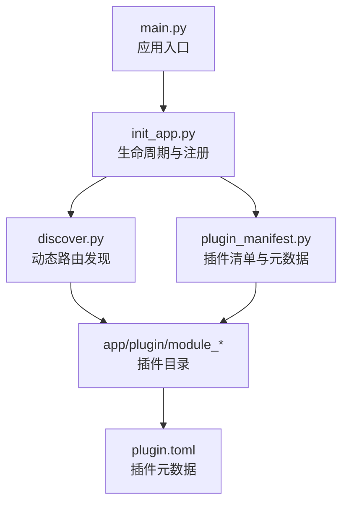
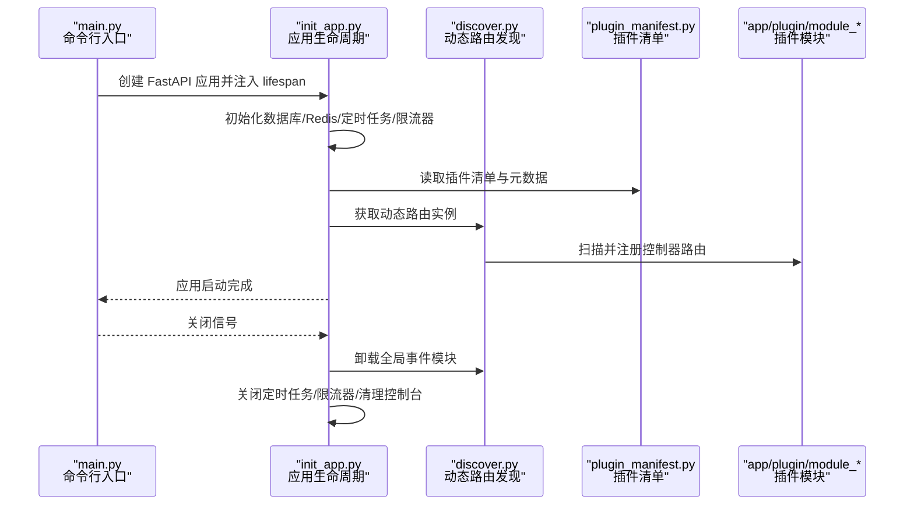
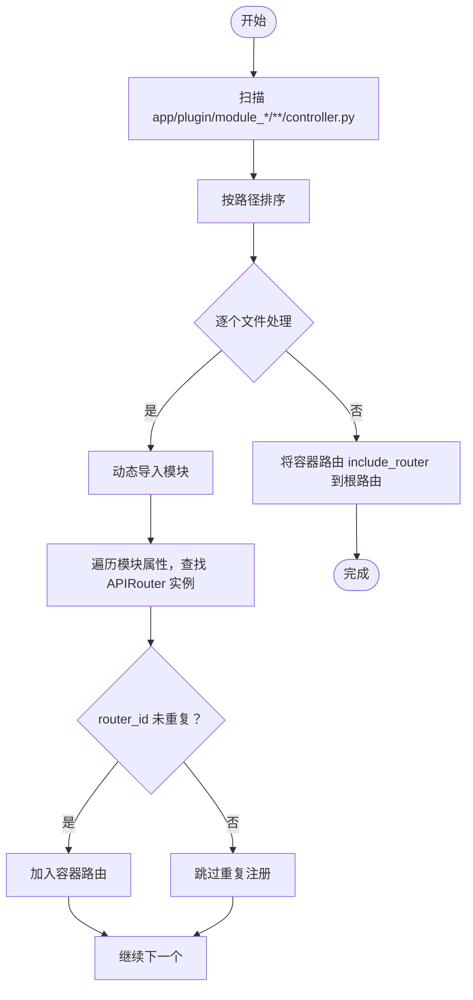
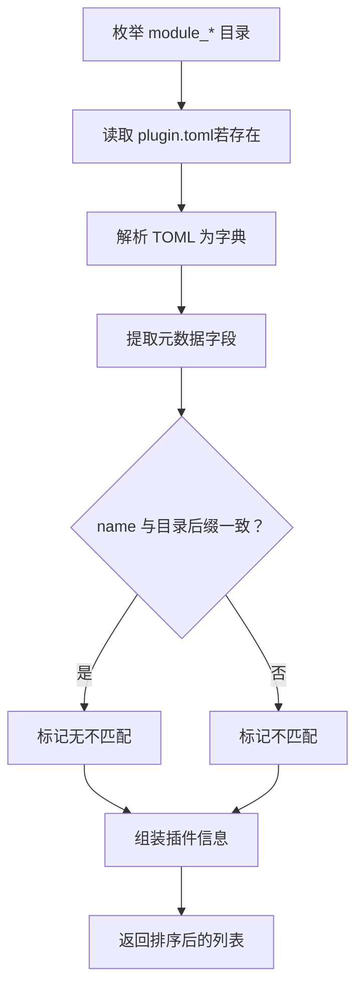
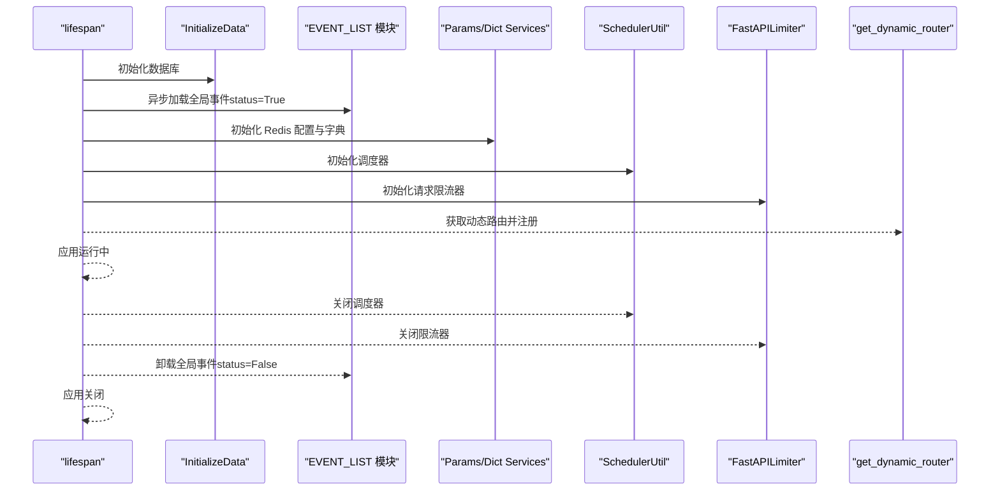
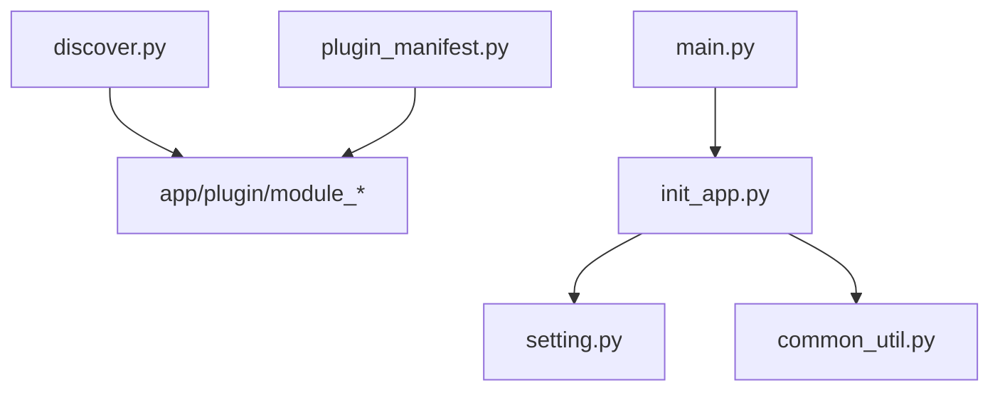

# 插件生命周期管理

<cite>
**本文引用的文件**
- [backend/main.py](file://backend/main.py)
- [backend/app/scripts/init_app.py](file://backend/app/scripts/init_app.py)
- [backend/app/core/discover.py](file://backend/app/core/discover.py)
- [backend/app/utils/common_util.py](file://backend/app/utils/common_util.py)
- [backend/app/config/setting.py](file://backend/app/config/setting.py)
- [backend/app/plugin/module_ai/plugin.toml](file://backend/app/plugin/module_ai/plugin.toml)
- [backend/app/plugin/module_example/plugin.toml](file://backend/app/plugin/module_example/plugin.toml)
- [backend/app/plugin/module_generator/plugin.toml](file://backend/app/plugin/module_generator/plugin.toml)
- [backend/app/plugin/module_task/plugin.toml](file://backend/app/plugin/module_task/plugin.toml)
- [backend/app/api/v1/module_application/portal/plugin_manifest.py](file://backend/app/api/v1/module_application/portal/plugin_manifest.py)
</cite>

## 目录
1. [简介](#简介)
2. [项目结构](#项目结构)
3. [核心组件](#核心组件)
4. [架构总览](#架构总览)
5. [详细组件分析](#详细组件分析)
6. [依赖分析](#依赖分析)
7. [性能考虑](#性能考虑)
8. [故障排查指南](#故障排查指南)
9. [结论](#结论)
10. [附录](#附录)

## 简介
本文件系统性阐述 FastapiAdmin 后端的插件生命周期管理机制，覆盖从“发现—加载—初始化—运行—销毁”的完整流程，解释插件加载顺序、依赖解析与冲突处理、状态管理与健康检查、异常恢复策略，以及热重载、动态更新与版本升级的支撑方式。同时说明插件间通信、资源共享与数据一致性保障方案。

## 项目结构
插件体系围绕以下关键位置组织：
- 插件目录：backend/app/plugin/module_*
- 动态路由发现：backend/app/core/discover.py
- 插件清单与元数据：backend/app/api/v1/module_application/portal/plugin_manifest.py
- 插件配置与元数据文件：各 module_xxx/plugin.toml
- 应用生命周期与注册：backend/app/scripts/init_app.py、backend/main.py
- 配置与事件列表：backend/app/config/setting.py
- 动态导入工具：backend/app/utils/common_util.py

图表来源
- [backend/main.py:16-51](file://backend/main.py#L16-L51)
- [backend/app/scripts/init_app.py:27-93](file://backend/app/scripts/init_app.py#L27-L93)
- [backend/app/core/discover.py:62-167](file://backend/app/core/discover.py#L62-L167)
- [backend/app/api/v1/module_application/portal/plugin_manifest.py:28-116](file://backend/app/api/v1/module_application/portal/plugin_manifest.py#L28-L116)

章节来源
- [backend/main.py:16-51](file://backend/main.py#L16-L51)
- [backend/app/scripts/init_app.py:27-93](file://backend/app/scripts/init_app.py#L27-L93)
- [backend/app/core/discover.py:1-172](file://backend/app/core/discover.py#L1-L172)
- [backend/app/api/v1/module_application/portal/plugin_manifest.py:1-117](file://backend/app/api/v1/module_application/portal/plugin_manifest.py#L1-L117)

## 核心组件
- 应用生命周期管理：通过 lifespan 管理应用启动与关闭阶段，统一初始化 Redis、数据库、定时任务、请求限流器等基础设施，并在关闭阶段执行反向清理。
- 动态路由发现与注册：扫描 app/plugin/module_*/**/controller.py，按模块前缀自动注册路由，避免重复注册并输出详细日志。
- 插件清单与元数据：解析各 module_xxx/plugin.toml，构建插件信息（名称、版本、标签、可选性等），并与目录名进行一致性校验。
- 动态导入工具：提供 import_module 与 import_modules_async，支持模块与协程方法的动态加载与调用。
- 配置与事件列表：通过 settings.EVENT_LIST 提供全局事件模块路径，实现按配置加载与卸载。

章节来源
- [backend/app/scripts/init_app.py:27-93](file://backend/app/scripts/init_app.py#L27-L93)
- [backend/app/core/discover.py:62-167](file://backend/app/core/discover.py#L62-L167)
- [backend/app/api/v1/module_application/portal/plugin_manifest.py:59-116](file://backend/app/api/v1/module_application/portal/plugin_manifest.py#L59-L116)
- [backend/app/utils/common_util.py:19-68](file://backend/app/utils/common_util.py#L19-L68)
- [backend/app/config/setting.py:244-254](file://backend/app/config/setting.py#L244-L254)

## 架构总览
下图展示了插件生命周期在应用启动与关闭阶段的交互关系：

图表来源
- [backend/main.py:16-51](file://backend/main.py#L16-L51)
- [backend/app/scripts/init_app.py:27-93](file://backend/app/scripts/init_app.py#L27-L93)
- [backend/app/core/discover.py:62-167](file://backend/app/core/discover.py#L62-L167)
- [backend/app/api/v1/module_application/portal/plugin_manifest.py:28-116](file://backend/app/api/v1/module_application/portal/plugin_manifest.py#L28-L116)

## 详细组件分析

### 动态路由发现与注册（discover.py）
- 发现规则
  - 插件目录必须位于 app/plugin 下，且顶级目录名以 module_ 开头。
  - 控制器文件必须命名为 controller.py（大小写敏感），且路径中各级目录名需为合法 Python 标识符。
  - 每级目录应可作为包导入（通常需有 __init__.py）。
  - 控制器模块顶层需定义 APIRouter 实例，函数内部定义的 router 不会被扫描。
- 注册流程
  - 扫描 module_*/**/controller.py，按路径排序确保注册顺序稳定。
  - 为每个前缀生成容器路由（/xxx），将匹配到的 APIRouter include_router 到容器路由。
  - 使用 router_id 集合避免重复注册，输出每个容器的子路由数量统计。
- 错误提示
  - 针对 ModuleNotFoundError、ImportError、SyntaxError、PermissionError 等异常提供简短排查提示，帮助定位包结构、命名与依赖问题。

图表来源
- [backend/app/core/discover.py:62-167](file://backend/app/core/discover.py#L62-L167)

章节来源
- [backend/app/core/discover.py:1-172](file://backend/app/core/discover.py#L1-L172)

### 插件清单与元数据（plugin_manifest.py）
- 目录枚举：遍历 app.plugin 包路径下的 module_* 目录，按目录名排序。
- TOML 解析：支持 Python 3.11+ 的 tomllib 或 3.11 之前的 tomli，读取 plugin.toml 并解析为字典。
- 信息构建：提取 name、title、version、description、optional、tags 等字段，并与目录名进行一致性校验（当 name 与目录后缀不一致时标记为不匹配）。
- 列表输出：返回按 module_dir 排序的插件信息列表，供管理端与 OpenAPI 使用。

图表来源
- [backend/app/api/v1/module_application/portal/plugin_manifest.py:28-116](file://backend/app/api/v1/module_application/portal/plugin_manifest.py#L28-L116)

章节来源
- [backend/app/api/v1/module_application/portal/plugin_manifest.py:1-117](file://backend/app/api/v1/module_application/portal/plugin_manifest.py#L1-L117)

### 应用生命周期与注册（init_app.py）
- 启动阶段
  - 初始化数据库、全局事件模块（settings.EVENT_LIST）、Redis 系统配置与数据字典、定时任务调度器、请求限流器。
  - 输出启动信息面板（包含数据库、Redis、调度器、限流器就绪状态）。
- 路由注册
  - 注册通用路由与动态路由（get_dynamic_router），并为 WebSocket 路由单独设置限流策略。
- 关闭阶段
  - 关闭定时任务与限流器，卸载全局事件模块，清理控制台。

图表来源
- [backend/app/scripts/init_app.py:27-93](file://backend/app/scripts/init_app.py#L27-L93)

章节来源
- [backend/app/scripts/init_app.py:27-93](file://backend/app/scripts/init_app.py#L27-L93)

### 动态导入工具（common_util.py）
- import_module：按“模块路径.类名”动态导入模块类，提供未找到模块或方法的错误日志。
- import_modules_async：遍历模块路径列表，动态导入模块并调用顶层方法（支持异步），用于生命周期事件的加载与卸载。

章节来源
- [backend/app/utils/common_util.py:19-68](file://backend/app/utils/common_util.py#L19-L68)

### 配置与事件列表（setting.py）
- EVENT_LIST：根据开关组装全局异步事件模块路径列表，用于应用启动时加载与关闭时卸载。
- MIDDLEWARE_LIST：根据开关组装中间件路径列表，逆序注册以确保外层中间件优先生效。

章节来源
- [backend/app/config/setting.py:244-254](file://backend/app/config/setting.py#L244-L254)
- [backend/app/config/setting.py:227-241](file://backend/app/config/setting.py#L227-L241)

### 插件元数据（plugin.toml）
- 各 module_xxx/plugin.toml 提供插件元数据（name、title、version、description、optional、tags），用于展示与管理端呈现。
- 示例文件路径：
  - [backend/app/plugin/module_ai/plugin.toml:1-9](file://backend/app/plugin/module_ai/plugin.toml#L1-L9)
  - [backend/app/plugin/module_example/plugin.toml:1-10](file://backend/app/plugin/module_example/plugin.toml#L1-L10)
  - [backend/app/plugin/module_generator/plugin.toml:1-9](file://backend/app/plugin/module_generator/plugin.toml#L1-L9)
  - [backend/app/plugin/module_task/plugin.toml:1-9](file://backend/app/plugin/module_task/plugin.toml#L1-L9)

章节来源
- [backend/app/plugin/module_ai/plugin.toml:1-9](file://backend/app/plugin/module_ai/plugin.toml#L1-L9)
- [backend/app/plugin/module_example/plugin.toml:1-10](file://backend/app/plugin/module_example/plugin.toml#L1-L10)
- [backend/app/plugin/module_generator/plugin.toml:1-9](file://backend/app/plugin/module_generator/plugin.toml#L1-L9)
- [backend/app/plugin/module_task/plugin.toml:1-9](file://backend/app/plugin/module_task/plugin.toml#L1-L9)

## 依赖分析
- 插件发现依赖
  - discover.py 依赖 app.plugin 包路径与模块导入机制，扫描 module_*/**/controller.py 并注册路由。
- 插件清单依赖
  - plugin_manifest.py 依赖 app.plugin 包路径与插件目录结构，解析 plugin.toml 并校验目录名一致性。
- 生命周期依赖
  - init_app.py 依赖 settings.EVENT_LIST 与 import_modules_async，实现事件模块的加载与卸载。
- 配置依赖
  - settings 提供中间件、事件、数据库、Redis、限流器等配置，贯穿生命周期。

图表来源
- [backend/app/core/discover.py:78-84](file://backend/app/core/discover.py#L78-L84)
- [backend/app/api/v1/module_application/portal/plugin_manifest.py:22-25](file://backend/app/api/v1/module_application/portal/plugin_manifest.py#L22-L25)
- [backend/app/scripts/init_app.py:42-47](file://backend/app/scripts/init_app.py#L42-L47)
- [backend/app/config/setting.py:244-254](file://backend/app/config/setting.py#L244-L254)
- [backend/main.py:24-31](file://backend/main.py#L24-L31)

章节来源
- [backend/app/core/discover.py:78-84](file://backend/app/core/discover.py#L78-L84)
- [backend/app/api/v1/module_application/portal/plugin_manifest.py:22-25](file://backend/app/api/v1/module_application/portal/plugin_manifest.py#L22-L25)
- [backend/app/scripts/init_app.py:42-47](file://backend/app/scripts/init_app.py#L42-L47)
- [backend/app/config/setting.py:244-254](file://backend/app/config/setting.py#L244-L254)
- [backend/main.py:24-31](file://backend/main.py#L24-L31)

## 性能考虑
- 路由发现排序：按路径排序确保注册顺序稳定，避免因文件系统差异导致的不稳定行为。
- 重复注册防护：使用 router_id 集合避免重复注册，减少运行时开销。
- 异步事件加载：通过 import_modules_async 支持异步初始化，缩短启动时间。
- 缓存与延迟：settings 使用 LRU 缓存 get_settings，降低重复读取成本。

## 故障排查指南
- 路由未注册
  - 检查目录是否以 module_ 开头、controller.py 是否位于模块树下、顶层是否存在 APIRouter 实例。
  - 确认包可导入（缺少 __init__.py、非法目录名、拼写不一致）。
- 导入失败
  - ModuleNotFoundError：检查模块路径与包结构，确认大小写与子目录名拼写一致。
  - ImportError：排查循环导入、第三方依赖缺失或相对导入路径错误。
  - SyntaxError：修正 controller.py 语法错误。
  - PermissionError：在受限环境（沙箱、CI）中，排查初始化时调用被禁止的系统能力。
- 插件清单不一致
  - 当 plugin.toml 中的 name 与目录后缀不一致时，将标记为不匹配，需保持一致以避免管理端混淆。

章节来源
- [backend/app/core/discover.py:33-59](file://backend/app/core/discover.py#L33-L59)
- [backend/app/api/v1/module_application/portal/plugin_manifest.py:90-106](file://backend/app/api/v1/module_application/portal/plugin_manifest.py#L90-L106)

## 结论
FastapiAdmin 的插件生命周期管理以“约定优于配置”为核心设计原则：通过严格的目录与文件命名规范、动态路由发现与注册、插件清单与元数据解析、以及统一的生命周期管理，实现了插件的自动化装配与可控的运行时治理。配合异步事件加载、资源初始化与关闭流程，系统在稳定性、可观测性与可维护性方面具备良好表现。

## 附录

### 插件生命周期事件钩子与回调
- 启动阶段
  - 初始化数据库与 Redis：确保基础设施可用。
  - 加载全局事件模块（settings.EVENT_LIST）：按配置异步加载。
  - 初始化系统配置与数据字典：从 Redis 读取并注入应用状态。
  - 初始化定时任务调度器与请求限流器：统一资源管理。
- 运行阶段
  - 动态路由注册：get_dynamic_router 返回根路由，include_router 到应用。
  - WebSocket 路由独立限流策略：针对实时场景优化。
- 关闭阶段
  - 关闭调度器与限流器：释放资源。
  - 卸载全局事件模块：按配置逆序卸载。
  - 清理控制台：输出结束信息。

章节来源
- [backend/app/scripts/init_app.py:27-93](file://backend/app/scripts/init_app.py#L27-L93)
- [backend/app/scripts/init_app.py:152-158](file://backend/app/scripts/init_app.py#L152-L158)
- [backend/app/config/setting.py:244-254](file://backend/app/config/setting.py#L244-L254)

### 插件状态管理与健康检查
- 状态标志
  - 调度器运行状态：SchedulerUtil.is_running()。
  - 限流器就绪状态：FastAPILimiter 初始化完成。
  - 数据库与 Redis 就绪状态：初始化日志输出。
- 健康检查建议
  - 在管理端或探针中定期调用 /docs、/redoc、/ljdoc 等文档端点，结合日志判断服务可用性。
  - 通过插件清单接口列出插件信息，核对 has_manifest 与 manifest_name_mismatch 状态。

章节来源
- [backend/app/scripts/init_app.py:64-74](file://backend/app/scripts/init_app.py#L64-L74)
- [backend/app/api/v1/module_application/portal/plugin_manifest.py:90-106](file://backend/app/api/v1/module_application/portal/plugin_manifest.py#L90-L106)

### 异常恢复策略
- 启动失败
  - lifespan 捕获异常并终止应用退出，避免半启动状态。
- 关闭阶段异常
  - 记录错误日志并继续执行后续清理步骤，确保资源尽量释放。
- 导入异常
  - 提供针对性提示，指导修复包结构、命名与依赖问题。

章节来源
- [backend/app/scripts/init_app.py:76-92](file://backend/app/scripts/init_app.py#L76-L92)
- [backend/app/core/discover.py:33-59](file://backend/app/core/discover.py#L33-L59)

### 插件间通信、资源共享与数据一致性
- 通信与共享
  - 插件通过统一的 APIRouter 容器前缀（/xxx）暴露接口，避免路由冲突。
  - 共享资源（Redis、数据库、调度器、限流器）在应用生命周期内集中初始化与管理，插件通过 app.state 访问。
- 数据一致性
  - 通过统一的初始化顺序与关闭顺序，确保资源在插件加载前后的一致性。
  - 插件清单与元数据解析提供可追溯的插件状态，便于运维与审计。

章节来源
- [backend/app/core/discover.py:100-108](file://backend/app/core/discover.py#L100-L108)
- [backend/app/scripts/init_app.py:42-61](file://backend/app/scripts/init_app.py#L42-L61)

### 热重载、动态更新与版本升级
- 热重载
  - main.py 在开发环境下启用 reload，结合动态路由与事件模块的异步加载，支持代码变更后的快速重启与生效。
- 动态更新
  - 通过重新扫描与注册机制，新增或修改 module_* 目录与 controller.py 后，可在下次启动时自动纳入。
- 版本升级
  - 插件元数据（plugin.toml）提供 version 字段，结合清单接口与管理端展示，便于版本追踪与升级决策。

章节来源
- [backend/main.py:94-102](file://backend/main.py#L94-L102)
- [backend/app/plugin/module_ai/plugin.toml:5](file://backend/app/plugin/module_ai/plugin.toml#L5)
- [backend/app/plugin/module_example/plugin.toml:6](file://backend/app/plugin/module_example/plugin.toml#L6)
- [backend/app/plugin/module_generator/plugin.toml:5](file://backend/app/plugin/module_generator/plugin.toml#L5)
- [backend/app/plugin/module_task/plugin.toml:5](file://backend/app/plugin/module_task/plugin.toml#L5)