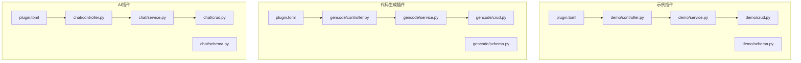
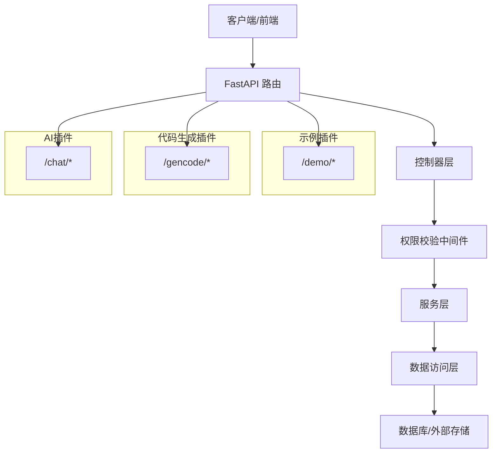
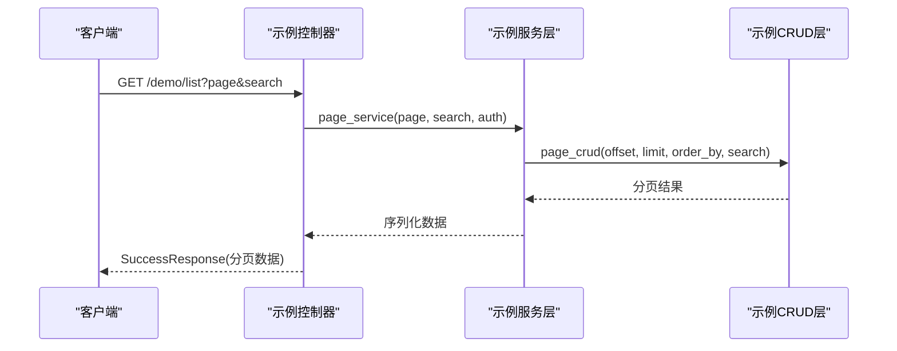
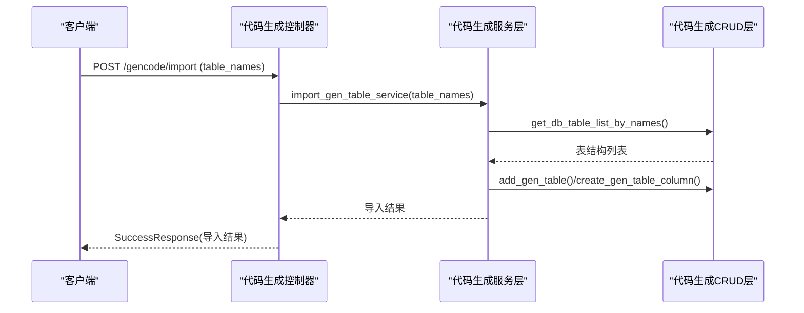
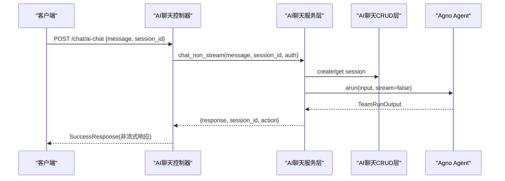
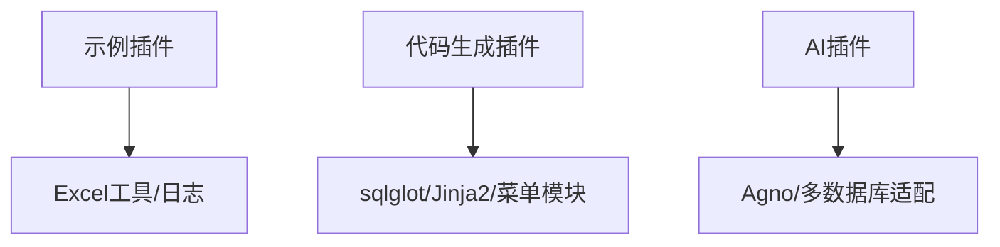

# 插件示例分析

<cite>
**本文档引用的文件**
- [plugin.toml（示例插件）](file://backend/app/plugin/module_example/plugin.toml)
- [plugin.toml（代码生成插件）](file://backend/app/plugin/module_generator/plugin.toml)
- [plugin.toml（AI插件）](file://backend/app/plugin/module_ai/plugin.toml)
- [示例插件控制器](file://backend/app/plugin/module_example/demo/controller.py)
- [示例插件服务层](file://backend/app/plugin/module_example/demo/service.py)
- [示例插件CRUD层](file://backend/app/plugin/module_example/demo/crud.py)
- [示例插件Schema](file://backend/app/plugin/module_example/demo/schema.py)
- [代码生成插件控制器](file://backend/app/plugin/module_generator/gencode/controller.py)
- [代码生成插件服务层](file://backend/app/plugin/module_generator/gencode/service.py)
- [代码生成插件CRUD层](file://backend/app/plugin/module_generator/gencode/crud.py)
- [代码生成插件Schema](file://backend/app/plugin/module_generator/gencode/schema.py)
- [AI聊天插件控制器](file://backend/app/plugin/module_ai/chat/controller.py)
- [AI聊天插件服务层](file://backend/app/plugin/module_ai/chat/service.py)
- [AI聊天插件CRUD层](file://backend/app/plugin/module_ai/chat/crud.py)
- [AI聊天插件Schema](file://backend/app/plugin/module_ai/chat/schema.py)
</cite>

## 目录
1. [引言](#引言)
2. [项目结构](#项目结构)
3. [核心组件](#核心组件)
4. [架构总览](#架构总览)
5. [详细组件分析](#详细组件分析)
6. [依赖分析](#依赖分析)
7. [性能考虑](#性能考虑)
8. [故障排查指南](#故障排查指南)
9. [结论](#结论)
10. [附录](#附录)

## 引言
本文件针对 FastapiAdmin 项目中的三个插件示例进行深入技术分析，涵盖：
- 示例插件（module_example）：功能演示与标准 CRUD 流程
- 代码生成插件（module_generator）：自动化代码生成与数据库同步能力
- AI 插件（module_ai）：智能对话与 Agent 协作能力

我们将从架构设计、核心功能实现、扩展点设计、插件间协作模式、接口设计与数据流转等方面进行全面剖析，并提供性能优化、安全考虑与可维护性建议，帮助开发者基于现有插件进行二次开发与功能扩展。

## 项目结构
三个插件均遵循统一的模块化组织方式：
- plugin.toml：插件元数据与描述
- demo/gencode/chat：按功能划分的子模块，包含 controller、service、crud、schema、model 等层次
- 每个子模块通过 FastAPI 路由注册，结合权限控制与日志记录

图表来源
- [plugin.toml（示例插件）:1-10](file://backend/app/plugin/module_example/plugin.toml#L1-L10)
- [plugin.toml（代码生成插件）:1-9](file://backend/app/plugin/module_generator/plugin.toml#L1-L9)
- [plugin.toml（AI插件）:1-9](file://backend/app/plugin/module_ai/plugin.toml#L1-L9)

章节来源
- [plugin.toml（示例插件）:1-10](file://backend/app/plugin/module_example/plugin.toml#L1-L10)
- [plugin.toml（代码生成插件）:1-9](file://backend/app/plugin/module_generator/plugin.toml#L1-L9)
- [plugin.toml（AI插件）:1-9](file://backend/app/plugin/module_ai/plugin.toml#L1-L9)

## 核心组件
- 控制器层（Controller）：定义 API 路由、参数绑定、权限校验与响应封装
- 服务层（Service）：编排业务流程、异常处理、跨模块协作与复杂逻辑
- 数据访问层（CRUD）：抽象数据库操作，支持分页、查询与事务
- 数据模型与Schema：统一输入输出校验与序列化
- 插件元数据（plugin.toml）：声明插件名称、版本、描述与标签，便于动态注册与运维展示

章节来源
- [示例插件控制器:1-264](file://backend/app/plugin/module_example/demo/controller.py#L1-L264)
- [示例插件服务层:1-327](file://backend/app/plugin/module_example/demo/service.py#L1-L327)
- [示例插件CRUD层:1-136](file://backend/app/plugin/module_example/demo/crud.py#L1-L136)
- [示例插件Schema:1-125](file://backend/app/plugin/module_example/demo/schema.py#L1-L125)
- [代码生成插件控制器:1-363](file://backend/app/plugin/module_generator/gencode/controller.py#L1-L363)
- [代码生成插件服务层:1-800](file://backend/app/plugin/module_generator/gencode/service.py#L1-L800)
- [代码生成插件CRUD层:1-200](file://backend/app/plugin/module_generator/gencode/crud.py#L1-L200)
- [代码生成插件Schema:1-326](file://backend/app/plugin/module_generator/gencode/schema.py#L1-L326)
- [AI聊天插件控制器:1-196](file://backend/app/plugin/module_ai/chat/controller.py#L1-L196)
- [AI聊天插件服务层:1-426](file://backend/app/plugin/module_ai/chat/service.py#L1-L426)
- [AI聊天插件CRUD层:1-177](file://backend/app/plugin/module_ai/chat/crud.py#L1-L177)
- [AI聊天插件Schema:1-71](file://backend/app/plugin/module_ai/chat/schema.py#L1-L71)

## 架构总览
三类插件均采用“控制器-服务-数据访问”的分层架构，配合权限中间件与统一响应封装，形成清晰的职责边界与可扩展性。

图表来源
- [示例插件控制器:19-264](file://backend/app/plugin/module_example/demo/controller.py#L19-L264)
- [代码生成插件控制器:24-363](file://backend/app/plugin/module_generator/gencode/controller.py#L24-L363)
- [AI聊天插件控制器:22-196](file://backend/app/plugin/module_ai/chat/controller.py#L22-L196)

## 详细组件分析

### 示例插件（module_example）分析
- 设计目标：演示标准 CRUD 与通用业务流程，包含分页、导入导出、批量操作等
- 关键特性：
  - 统一响应封装与日志记录
  - 权限中间件按功能点粒度控制
  - Excel 导入导出与模板下载
  - 批量状态设置与批量删除
- 数据模型与校验：通过 Pydantic Schema 定义输入输出，包含字段长度、格式与业务规则校验
- 处理流程：控制器接收请求 → 权限校验 → 服务层编排 → CRUD 访问 → 返回统一响应

图表来源
- [示例插件控制器:53-78](file://backend/app/plugin/module_example/demo/controller.py#L53-L78)
- [示例插件服务层:67-98](file://backend/app/plugin/module_example/demo/service.py#L67-L98)
- [示例插件CRUD层:104-135](file://backend/app/plugin/module_example/demo/crud.py#L104-L135)

章节来源
- [示例插件控制器:1-264](file://backend/app/plugin/module_example/demo/controller.py#L1-L264)
- [示例插件服务层:1-327](file://backend/app/plugin/module_example/demo/service.py#L1-L327)
- [示例插件CRUD层:1-136](file://backend/app/plugin/module_example/demo/crud.py#L1-L136)
- [示例插件Schema:1-125](file://backend/app/plugin/module_example/demo/schema.py#L1-L125)

### 代码生成插件（module_generator）分析
- 设计目标：基于数据库表与模板的自动化代码生成，支持建表、导入、预览、生成与同步
- 关键特性：
  - 数据库表列表分页（数据库侧 OFFSET/LIMIT）
  - SQL 安全校验与白名单执行
  - 模板渲染与子表主子表处理
  - 菜单与权限前缀自动推断与创建
  - 同步差异预览与安全同步
- 处理流程：控制器接收请求 → 权限校验 → 服务层解析与校验 → CRUD 访问 → 模板渲染/SQL 执行 → 返回流式或文件响应

图表来源
- [代码生成插件控制器:102-124](file://backend/app/plugin/module_generator/gencode/controller.py#L102-L124)
- [代码生成插件服务层:381-441](file://backend/app/plugin/module_generator/gencode/service.py#L381-L441)
- [代码生成插件CRUD层:1-200](file://backend/app/plugin/module_generator/gencode/crud.py#L1-L200)

章节来源
- [代码生成插件控制器:1-363](file://backend/app/plugin/module_generator/gencode/controller.py#L1-L363)
- [代码生成插件服务层:1-800](file://backend/app/plugin/module_generator/gencode/service.py#L1-L800)
- [代码生成插件CRUD层:1-200](file://backend/app/plugin/module_generator/gencode/crud.py#L1-L200)
- [代码生成插件Schema:1-326](file://backend/app/plugin/module_generator/gencode/schema.py#L1-L326)

### AI插件（module_ai）分析
- 设计目标：提供会话管理与智能对话能力，支持流式与非流式响应，具备操作建议解析
- 关键特性：
  - 会话存储基于 agno 的 TeamSession，支持多数据库适配
  - 流式与非流式两种对话模式
  - 自动解析导航类操作建议
  - 会话列表内存分页与消息提取
- 处理流程：控制器接收请求 → 权限校验 → 服务层创建/获取会话 → 调用 Agno Agent → 返回流式或非流式响应

图表来源
- [AI聊天插件控制器:167-195](file://backend/app/plugin/module_ai/chat/controller.py#L167-L195)
- [AI聊天插件服务层:180-264](file://backend/app/plugin/module_ai/chat/service.py#L180-L264)
- [AI聊天插件CRUD层:96-133](file://backend/app/plugin/module_ai/chat/crud.py#L96-L133)

章节来源
- [AI聊天插件控制器:1-196](file://backend/app/plugin/module_ai/chat/controller.py#L1-L196)
- [AI聊天插件服务层:1-426](file://backend/app/plugin/module_ai/chat/service.py#L1-L426)
- [AI聊天插件CRUD层:1-177](file://backend/app/plugin/module_ai/chat/crud.py#L1-L177)
- [AI聊天插件Schema:1-71](file://backend/app/plugin/module_ai/chat/schema.py#L1-L71)

### 插件间协作与接口设计
- 共同点：
  - 统一的权限中间件与日志记录
  - 统一响应封装（SuccessResponse/StreamResponse）
  - 按模块前缀动态注册路由（/demo、/gencode、/chat）
- 协作点：
  - 代码生成插件可与系统菜单模块协作，自动创建目录/菜单/按钮层级
  - AI 插件可与部门/用户服务协作，补充团队/用户上下文
- 数据流转：
  - 控制器负责参数绑定与权限校验
  - 服务层负责业务编排与异常处理
  - CRUD 层负责具体数据访问与分页/查询
  - 外部组件（模板引擎、Agno、数据库）参与处理

章节来源
- [示例插件控制器:1-264](file://backend/app/plugin/module_example/demo/controller.py#L1-L264)
- [代码生成插件服务层:707-800](file://backend/app/plugin/module_generator/gencode/service.py#L707-L800)
- [AI聊天插件服务层:126-178](file://backend/app/plugin/module_ai/chat/service.py#L126-L178)

## 依赖分析
- 插件元数据：通过 plugin.toml 声明插件信息，用于文档与运维展示
- 外部依赖：
  - 示例插件：Excel 工具（导入导出）、日志记录
  - 代码生成插件：SQL 解析库（sqlglot）、模板引擎（Jinja2）、菜单/权限模块
  - AI 插件：Agno（Team/Agent/Session）、多数据库适配（MySQL/Postgres/SQLite）

图表来源
- [plugin.toml（示例插件）:1-10](file://backend/app/plugin/module_example/plugin.toml#L1-L10)
- [plugin.toml（代码生成插件）:1-9](file://backend/app/plugin/module_generator/plugin.toml#L1-L9)
- [plugin.toml（AI插件）:1-9](file://backend/app/plugin/module_ai/plugin.toml#L1-L9)

章节来源
- [plugin.toml（示例插件）:1-10](file://backend/app/plugin/module_example/plugin.toml#L1-L10)
- [plugin.toml（代码生成插件）:1-9](file://backend/app/plugin/module_generator/plugin.toml#L1-L9)
- [plugin.toml（AI插件）:1-9](file://backend/app/plugin/module_ai/plugin.toml#L1-L9)

## 性能考虑
- 示例插件
  - 列表查询优先使用数据库侧分页，避免应用层分页带来的性能开销
  - Excel 导入/导出采用流式处理，减少内存占用
- 代码生成插件
  - 数据库表列表分页在数据库侧完成（OFFSET/LIMIT），避免全量反射导致卡顿
  - SQL 执行严格白名单与安全校验，避免高风险操作
  - 模板渲染异步执行，子表与主表分别渲染，提升可维护性
- AI 插件
  - 会话列表为内存分页，适合中小规模场景；大规模需考虑持久化与索引优化
  - 流式输出降低首字延迟，提升用户体验

章节来源
- [示例插件控制器:69-78](file://backend/app/plugin/module_example/demo/controller.py#L69-L78)
- [示例插件服务层:182-214](file://backend/app/plugin/module_example/demo/service.py#L182-L214)
- [代码生成插件控制器:85-93](file://backend/app/plugin/module_generator/gencode/controller.py#L85-L93)
- [代码生成插件服务层:444-528](file://backend/app/plugin/module_generator/gencode/service.py#L444-L528)
- [AI聊天插件服务层:357-392](file://backend/app/plugin/module_ai/chat/service.py#L357-L392)

## 故障排查指南
- 常见异常与定位
  - 自定义异常：服务层统一捕获并包装为 CustomException，便于前端识别与提示
  - 权限不足：控制器使用权限中间件，确认权限标识符与用户角色配置
  - Excel 导入失败：检查表头、必填字段与数据类型，关注错误汇总信息
  - SQL 创建失败：检查建表语句合法性与白名单限制
  - AI 对话异常：查看日志与异常堆栈，确认会话创建与 Agent 初始化
- 日志与追踪
  - 控制器与服务层均记录关键操作日志，便于问题定位与审计

章节来源
- [示例插件服务层:1-327](file://backend/app/plugin/module_example/demo/service.py#L1-L327)
- [代码生成插件服务层:43-62](file://backend/app/plugin/module_generator/gencode/service.py#L43-L62)
- [AI聊天插件服务层:1-426](file://backend/app/plugin/module_ai/chat/service.py#L1-L426)

## 结论
三个插件示例展示了 FastapiAdmin 的插件化架构与最佳实践：
- 清晰的分层设计与职责分离
- 统一的权限控制与响应封装
- 面向扩展的插件元数据与动态路由
- 针对不同场景的性能优化策略
- 安全与可维护性的综合考量

基于此架构，开发者可以快速扩展新功能模块，复用现有工具与中间件，构建稳定高效的业务插件体系。

## 附录
- 开发建议
  - 遵循模块化命名与目录结构，保持一致性
  - 使用统一的 Schema 校验与异常处理机制
  - 对大数据量场景优先采用数据库侧分页与流式处理
  - 对外部依赖做好兼容与降级策略
- 扩展点
  - 插件元数据：新增标签与描述，便于搜索与分类
  - 控制器：新增路由与权限标识符
  - 服务层：新增业务编排与跨模块协作
  - CRUD 层：新增数据访问与复杂查询
  - 外部集成：接入新的模板引擎、AI 框架或数据库