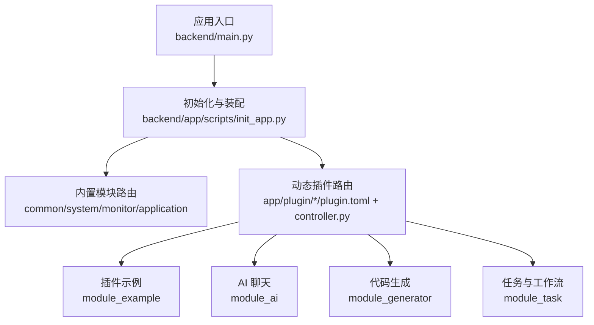
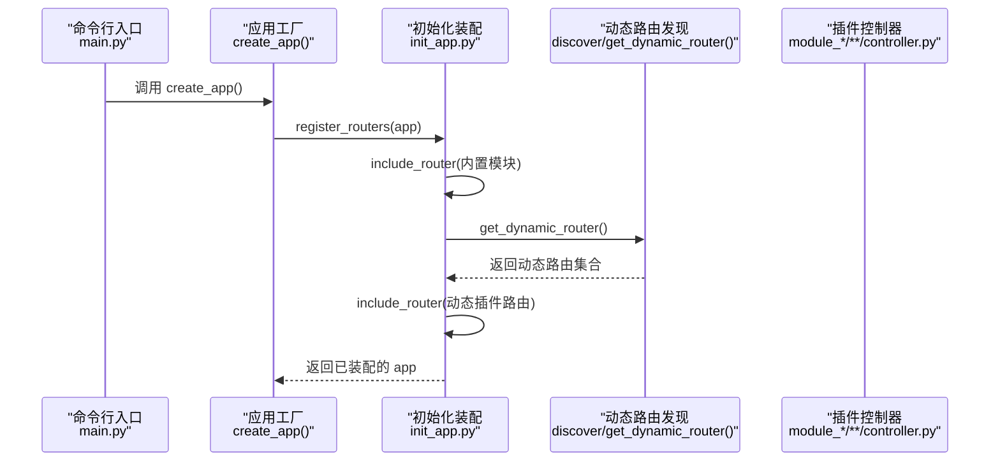
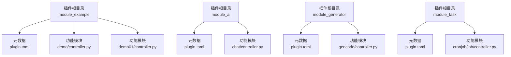
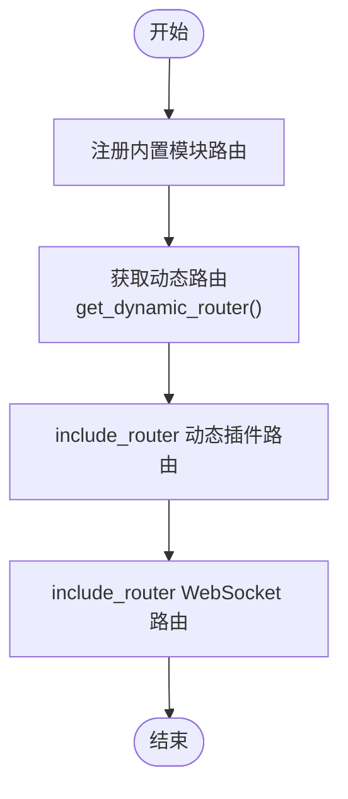
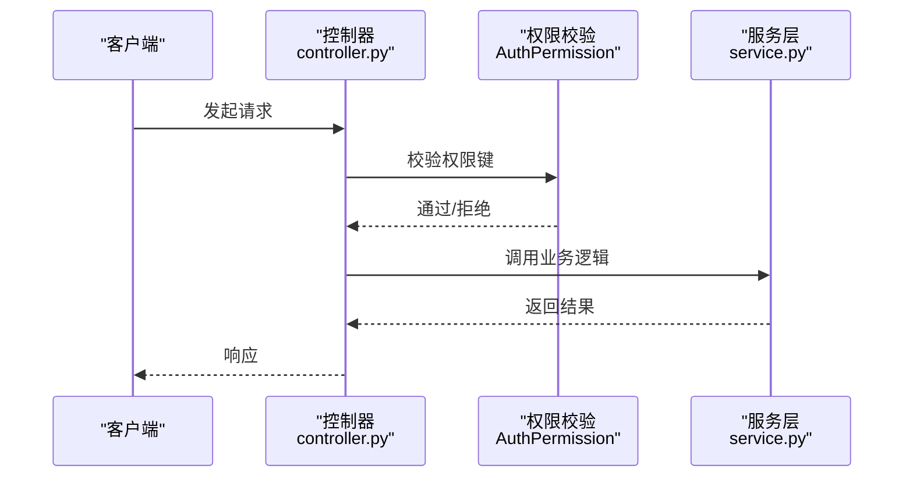
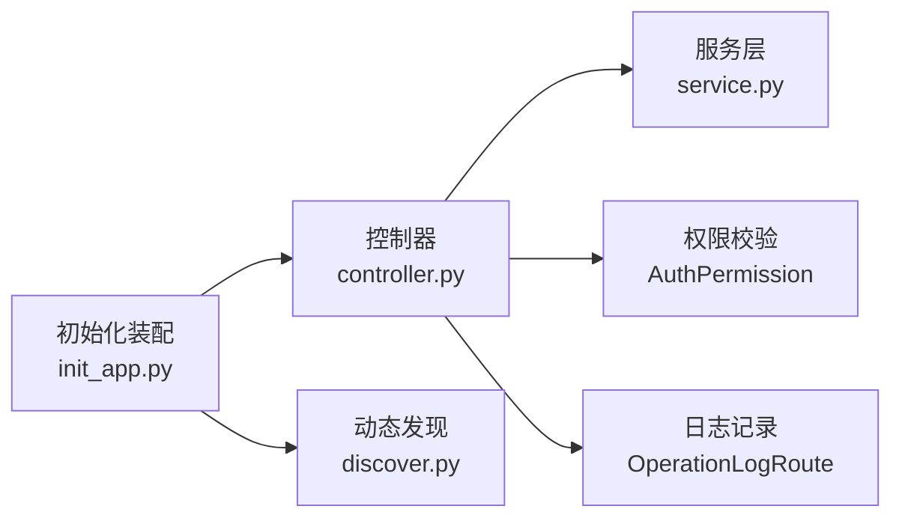

# 插件系统设计

<cite>
**本文引用的文件**
- [backend/main.py](file://backend/main.py)
- [backend/app/scripts/init_app.py](file://backend/app/scripts/init_app.py)
- [backend/app/plugin/module_example/plugin.toml](file://backend/app/plugin/module_example/plugin.toml)
- [backend/app/plugin/module_ai/plugin.toml](file://backend/app/plugin/module_ai/plugin.toml)
- [backend/app/plugin/module_generator/plugin.toml](file://backend/app/plugin/module_generator/plugin.toml)
- [backend/app/plugin/module_task/plugin.toml](file://backend/app/plugin/module_task/plugin.toml)
- [backend/app/plugin/module_example/demo/controller.py](file://backend/app/plugin/module_example/demo/controller.py)
- [backend/app/plugin/module_ai/chat/controller.py](file://backend/app/plugin/module_ai/chat/controller.py)
- [backend/app/plugin/module_generator/gencode/controller.py](file://backend/app/plugin/module_generator/gencode/controller.py)
- [backend/app/plugin/module_task/cronjob/job/controller.py](file://backend/app/plugin/module_task/cronjob/job/controller.py)
- [backend/app/utils/common_util.py](file://backend/app/utils/common_util.py)
</cite>

## 目录
1. [引言](#引言)
2. [项目结构](#项目结构)
3. [核心组件](#核心组件)
4. [架构总览](#架构总览)
5. [详细组件分析](#详细组件分析)
6. [依赖分析](#依赖分析)
7. [性能考虑](#性能考虑)
8. [故障排查指南](#故障排查指南)
9. [结论](#结论)
10. [附录](#附录)

## 引言
本设计文档面向 FastapiAdmin 的插件化架构，系统性阐述插件系统的理念、实现机制与开发规范。重点覆盖以下方面：
- 自动路由发现与动态加载
- 插件元数据与模块注册
- 插件间依赖关系、权限控制与数据隔离
- 开发最佳实践、调试技巧与性能优化
- 现有插件分析与扩展方法

## 项目结构
FastapiAdmin 的后端采用“模块化 + 插件化”的组织方式。核心入口负责应用生命周期与组件装配，插件位于 app/plugin 下按功能域划分，每个插件以 module_{name} 命名，并在插件根目录提供 plugin.toml 元数据。

图表来源
- [backend/main.py:16-51](file://backend/main.py#L16-L51)
- [backend/app/scripts/init_app.py:125-159](file://backend/app/scripts/init_app.py#L125-L159)

章节来源
- [backend/main.py:16-51](file://backend/main.py#L16-L51)
- [backend/app/scripts/init_app.py:125-159](file://backend/app/scripts/init_app.py#L125-L159)

## 核心组件
- 应用工厂与生命周期
  - create_app 负责创建 FastAPI 实例、注册中间件、异常处理、静态资源与文档，并在 lifespan 中完成数据库、Redis、定时任务、限流器等初始化与清理。
- 动态路由与插件发现
  - 在注册根路由后，通过动态路由发现模块获取插件控制器并统一 include_router，实现“约定优于配置”的自动发现。
- 插件元数据与模块注册
  - 每个插件目录包含 plugin.toml，声明插件元信息；插件控制器遵循统一的 APIRouter 命名与权限约定，便于统一鉴权与日志记录。

章节来源
- [backend/main.py:16-51](file://backend/main.py#L16-L51)
- [backend/app/scripts/init_app.py:27-94](file://backend/app/scripts/init_app.py#L27-L94)
- [backend/app/scripts/init_app.py:125-159](file://backend/app/scripts/init_app.py#L125-L159)

## 架构总览
下图展示从应用启动到动态路由注册的关键流程，以及插件元数据对模块注册的影响。

图表来源
- [backend/main.py:16-51](file://backend/main.py#L16-L51)
- [backend/app/scripts/init_app.py:125-159](file://backend/app/scripts/init_app.py#L125-L159)

## 详细组件分析

### 插件元数据与目录约定
- 目录命名：app/plugin/module_{name}/
- 元数据文件：plugin.toml，包含 name、title、version、description、optional、tags 等字段，用于文档与运维展示。
- 控制器约定：每个插件内部按功能拆分子目录（如 chat、demo、gencode、cronjob 等），控制器文件命名为 controller.py，统一使用 APIRouter 并设置 prefix 与 tags。

图表来源
- [backend/app/plugin/module_example/plugin.toml:1-10](file://backend/app/plugin/module_example/plugin.toml#L1-L10)
- [backend/app/plugin/module_ai/plugin.toml:1-9](file://backend/app/plugin/module_ai/plugin.toml#L1-L9)
- [backend/app/plugin/module_generator/plugin.toml:1-9](file://backend/app/plugin/module_generator/plugin.toml#L1-L9)
- [backend/app/plugin/module_task/plugin.toml:1-9](file://backend/app/plugin/module_task/plugin.toml#L1-L9)
- [backend/app/plugin/module_example/demo/controller.py:19](file://backend/app/plugin/module_example/demo/controller.py#L19)
- [backend/app/plugin/module_ai/chat/controller.py:22](file://backend/app/plugin/module_ai/chat/controller.py#L22)
- [backend/app/plugin/module_generator/gencode/controller.py:24](file://backend/app/plugin/module_generator/gencode/controller.py#L24)
- [backend/app/plugin/module_task/cronjob/job/controller.py:17](file://backend/app/plugin/module_task/cronjob/job/controller.py#L17)

章节来源
- [backend/app/plugin/module_example/plugin.toml:1-10](file://backend/app/plugin/module_example/plugin.toml#L1-L10)
- [backend/app/plugin/module_ai/plugin.toml:1-9](file://backend/app/plugin/module_ai/plugin.toml#L1-L9)
- [backend/app/plugin/module_generator/plugin.toml:1-9](file://backend/app/plugin/module_generator/plugin.toml#L1-L9)
- [backend/app/plugin/module_task/plugin.toml:1-9](file://backend/app/plugin/module_task/plugin.toml#L1-L9)
- [backend/app/plugin/module_example/demo/controller.py:19](file://backend/app/plugin/module_example/demo/controller.py#L19)
- [backend/app/plugin/module_ai/chat/controller.py:22](file://backend/app/plugin/module_ai/chat/controller.py#L22)
- [backend/app/plugin/module_generator/gencode/controller.py:24](file://backend/app/plugin/module_generator/gencode/controller.py#L24)
- [backend/app/plugin/module_task/cronjob/job/controller.py:17](file://backend/app/plugin/module_task/cronjob/job/controller.py#L17)

### 动态路由发现与模块注册
- 注册顺序
  - 先 include_router 内置模块（common/system/monitor/application）
  - 再 include_router 动态插件路由（通过 discover 获取）
  - 最后 include_router WebSocket 路由（如 AI 聊天）
- 动态发现机制
  - 通过 import_modules_async 或 import_module 动态导入模块与方法，实现插件控制器的自动发现与注册。
  - 速率限制器统一应用于动态路由，WebSocket 路由单独处理。

图表来源
- [backend/app/scripts/init_app.py:125-159](file://backend/app/scripts/init_app.py#L125-L159)

章节来源
- [backend/app/scripts/init_app.py:125-159](file://backend/app/scripts/init_app.py#L125-L159)

### 权限控制与依赖注入
- 权限键命名规范：module_{plugin}:{module}:{action}（如 module_example:demo:query）
- 控制器中通过 AuthPermission 依赖注入进行权限校验，确保每个接口具备最小权限集。
- 日志与审计：统一使用 OperationLogRoute 记录操作日志，便于审计与追踪。

图表来源
- [backend/app/plugin/module_example/demo/controller.py:30](file://backend/app/plugin/module_example/demo/controller.py#L30)
- [backend/app/plugin/module_ai/chat/controller.py:33](file://backend/app/plugin/module_ai/chat/controller.py#L33)
- [backend/app/plugin/module_generator/gencode/controller.py:36](file://backend/app/plugin/module_generator/gencode/controller.py#L36)
- [backend/app/plugin/module_task/cronjob/job/controller.py:28](file://backend/app/plugin/module_task/cronjob/job/controller.py#L28)

章节来源
- [backend/app/plugin/module_example/demo/controller.py:30](file://backend/app/plugin/module_example/demo/controller.py#L30)
- [backend/app/plugin/module_ai/chat/controller.py:33](file://backend/app/plugin/module_ai/chat/controller.py#L33)
- [backend/app/plugin/module_generator/gencode/controller.py:36](file://backend/app/plugin/module_generator/gencode/controller.py#L36)
- [backend/app/plugin/module_task/cronjob/job/controller.py:28](file://backend/app/plugin/module_task/cronjob/job/controller.py#L28)

### 数据隔离与模块边界
- 每个插件控制器独立维护其 APIRouter 与权限键，避免跨模块耦合。
- 服务层（service.py）封装具体业务，控制器仅做参数解析与权限校验，降低跨模块访问风险。
- WebSocket 路由独立注册，避免与常规 HTTP 路由共享速率限制策略。

章节来源
- [backend/app/plugin/module_ai/chat/ws.py](file://backend/app/plugin/module_ai/chat/ws.py)
- [backend/app/scripts/init_app.py:145-150](file://backend/app/scripts/init_app.py#L145-L150)

### 插件开发指南（从零到一）
- 目录结构
  - app/plugin/module_{your_plugin}/plugin.toml
  - app/plugin/module_{your_plugin}/{feature}/controller.py
  - app/plugin/module_{your_plugin}/{feature}/service.py
  - app/plugin/module_{your_plugin}/{feature}/schema.py
  - app/plugin/module_{your_plugin}/{feature}/crud.py
- 配置文件
  - 在 plugin.toml 中填写 name、title、version、description、optional、tags 等元信息。
- 生命周期管理
  - 若需在应用启动/关闭时执行初始化或清理，可在 lifespan 中通过 import_modules_async 注入事件模块。
- 权限与日志
  - 严格遵循权限键命名规范，使用 AuthPermission 依赖注入。
  - 使用 OperationLogRoute 记录操作日志。
- 动态加载
  - 控制器文件命名与目录结构遵循现有插件，即可被动态发现与注册。

章节来源
- [backend/app/plugin/module_example/plugin.toml:1-10](file://backend/app/plugin/module_example/plugin.toml#L1-L10)
- [backend/app/scripts/init_app.py:45-47](file://backend/app/scripts/init_app.py#L45-L47)

## 依赖分析
- 组件内聚与解耦
  - 插件控制器与服务层分离，提升内聚性与可测试性。
  - 权限校验集中在依赖注入层，减少控制器重复逻辑。
- 外部依赖
  - 通过 import_module 与 import_modules_async 实现动态导入，避免硬编码依赖。
- 潜在循环依赖
  - 插件间通过权限键与服务层交互，不直接导入控制器，降低循环依赖风险。

图表来源
- [backend/app/plugin/module_example/demo/controller.py:16-17](file://backend/app/plugin/module_example/demo/controller.py#L16-L17)
- [backend/app/scripts/init_app.py:125-159](file://backend/app/scripts/init_app.py#L125-L159)

章节来源
- [backend/app/utils/common_util.py:19-68](file://backend/app/utils/common_util.py#L19-L68)
- [backend/app/scripts/init_app.py:125-159](file://backend/app/scripts/init_app.py#L125-L159)

## 性能考虑
- 动态导入与异步初始化
  - 使用 import_modules_async 异步导入事件模块，缩短启动时间。
- 速率限制与并发
  - HTTP 路由统一应用速率限制器，WebSocket 路由单独配置，避免相互影响。
- 数据库与模板生成
  - 代码生成模块对数据库表查询采用数据库侧分页，避免全量反射导致卡顿。
- 日志与可观测性
  - 在 lifespan 中集中初始化日志、限流器与调度器，确保资源正确释放。

章节来源
- [backend/app/scripts/init_app.py:45-61](file://backend/app/scripts/init_app.py#L45-L61)
- [backend/app/scripts/init_app.py:145-150](file://backend/app/scripts/init_app.py#L145-L150)
- [backend/app/plugin/module_generator/gencode/controller.py:85](file://backend/app/plugin/module_generator/gencode/controller.py#L85)

## 故障排查指南
- 动态导入失败
  - 现象：模块未找到或方法不存在
  - 排查：检查模块路径与类名是否正确，确认插件目录结构与文件命名符合约定
- 权限校验失败
  - 现象：接口返回权限不足
  - 排查：核对权限键格式 module_{plugin}:{module}:{action} 是否与前端/前端路由一致
- 路由未生效
  - 现象：新增控制器未出现在路由表
  - 排查：确认控制器文件位于插件目录下且命名规范，检查动态发现流程是否被 include_router
- 启动阶段异常
  - 现象：应用初始化失败
  - 排查：查看 lifespan 中初始化日志，逐项检查数据库、Redis、定时任务与限流器初始化状态

章节来源
- [backend/app/utils/common_util.py:34-39](file://backend/app/utils/common_util.py#L34-L39)
- [backend/app/scripts/init_app.py:76-78](file://backend/app/scripts/init_app.py#L76-L78)

## 结论
FastapiAdmin 的插件系统以“约定优于配置”为核心，结合动态路由发现与统一的权限控制，实现了高内聚、低耦合的功能模块化。通过清晰的目录结构、元数据配置与生命周期管理，开发者可以快速扩展新功能模块，并在不破坏整体架构的前提下实现插件间的协作与隔离。

## 附录
- 现有插件概览
  - 示例插件：提供 CRUD 示例与导入导出能力
  - AI 子系统：会话管理与对话接口
  - 代码生成：数据库表与模板驱动的代码生成
  - 任务与工作流：定时任务与工作流调度
- 扩展建议
  - 新插件优先参考现有插件的目录结构与控制器命名
  - 严格遵循权限键命名规范，确保权限最小化
  - 对于复杂业务，拆分 service/crud/schema，保持控制器简洁

章节来源
- [backend/app/plugin/module_example/plugin.toml:1-10](file://backend/app/plugin/module_example/plugin.toml#L1-L10)
- [backend/app/plugin/module_ai/plugin.toml:1-9](file://backend/app/plugin/module_ai/plugin.toml#L1-L9)
- [backend/app/plugin/module_generator/plugin.toml:1-9](file://backend/app/plugin/module_generator/plugin.toml#L1-L9)
- [backend/app/plugin/module_task/plugin.toml:1-9](file://backend/app/plugin/module_task/plugin.toml#L1-L9)