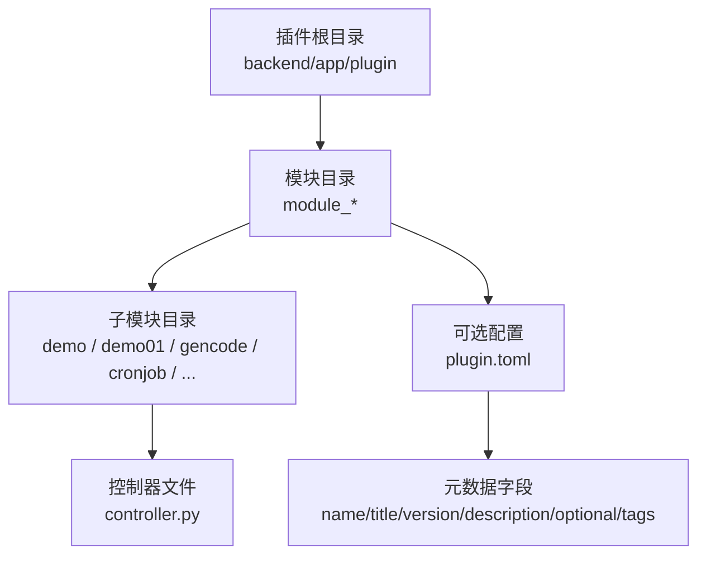
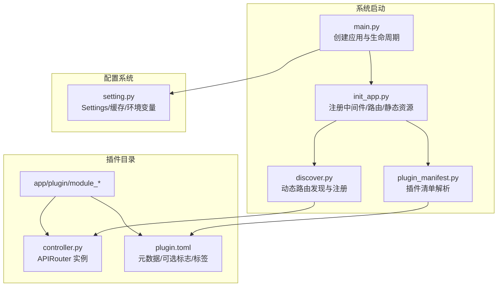
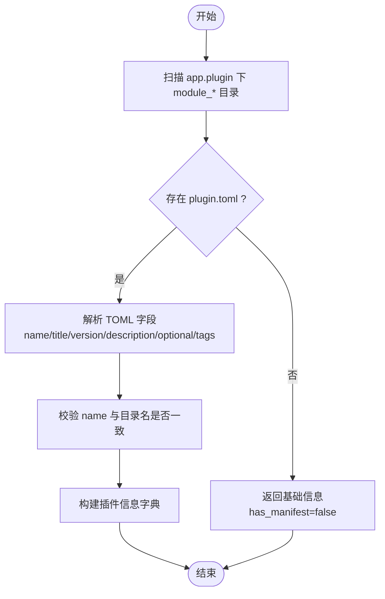
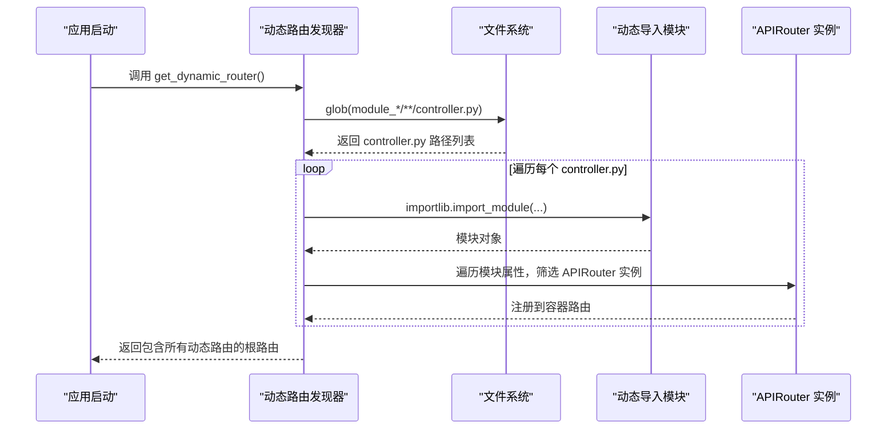
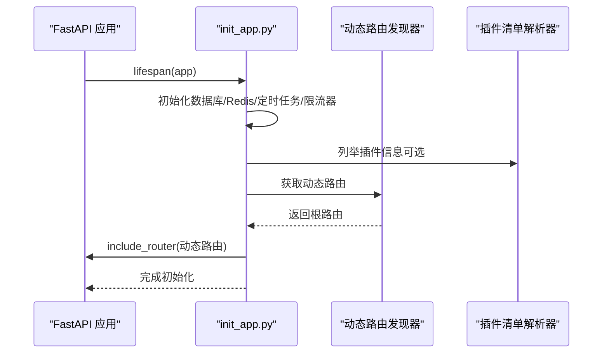
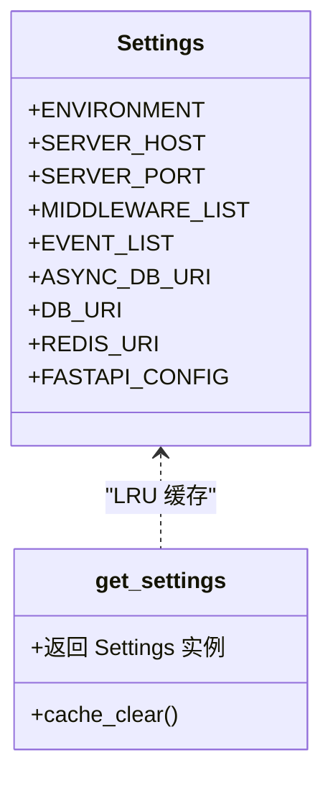
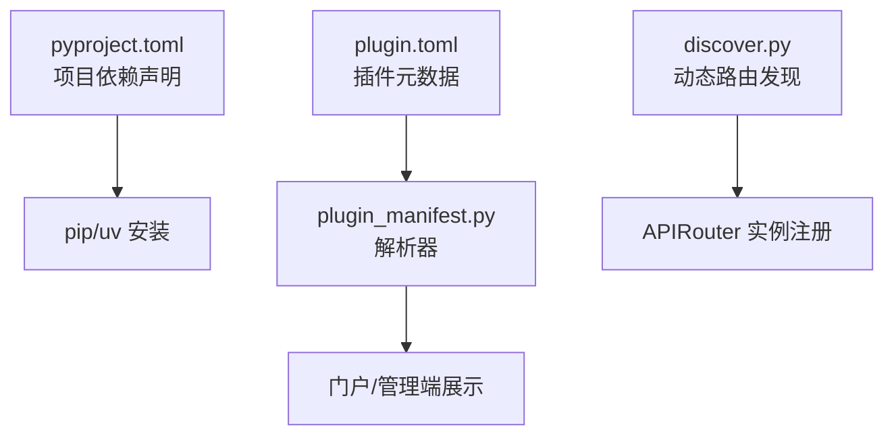

# 插件配置管理

<cite>
**本文档引用的文件**
- [backend/app/plugin/module_ai/plugin.toml](file://backend/app/plugin/module_ai/plugin.toml)
- [backend/app/plugin/module_example/plugin.toml](file://backend/app/plugin/module_example/plugin.toml)
- [backend/app/plugin/module_generator/plugin.toml](file://backend/app/plugin/module_generator/plugin.toml)
- [backend/app/plugin/module_task/plugin.toml](file://backend/app/plugin/module_task/plugin.toml)
- [backend/app/api/v1/module_application/portal/plugin_manifest.py](file://backend/app/api/v1/module_application/portal/plugin_manifest.py)
- [backend/app/core/discover.py](file://backend/app/core/discover.py)
- [backend/app/scripts/init_app.py](file://backend/app/scripts/init_app.py)
- [backend/app/config/setting.py](file://backend/app/config/setting.py)
- [backend/pyproject.toml](file://backend/pyproject.toml)
- [backend/main.py](file://backend/main.py)
</cite>

## 目录
1. [简介](#简介)
2. [项目结构](#项目结构)
3. [核心组件](#核心组件)
4. [架构总览](#架构总览)
5. [详细组件分析](#详细组件分析)
6. [依赖分析](#依赖分析)
7. [性能考虑](#性能考虑)
8. [故障排除指南](#故障排除指南)
9. [结论](#结论)
10. [附录](#附录)

## 简介
本文件系统性阐述 FastapiAdmin 后端的“插件配置管理”机制，重点围绕 plugin.toml 配置文件的结构、字段语义、解析流程与运行时集成方式，以及插件元数据、版本控制、依赖声明、启用/禁用控制、条件加载与运行时配置更新等方面。文档旨在帮助开发者快速理解并正确编写与维护插件配置，确保插件在系统中的稳定发现、注册与运行。

## 项目结构
- 插件目录位于 backend/app/plugin，采用 module_* 命名规范，每个插件包含若干子模块（如 demo、demo01、gencode、cronjob 等），控制器文件统一命名为 controller.py。
- 每个插件可选地提供 plugin.toml，用于声明元数据（名称、标题、版本、描述、是否可选、标签等），这些信息用于门户展示与系统管理。
- 动态路由发现与注册在启动阶段完成，自动扫描 app.plugin 下的 module_* 目录，按约定规则注册路由。

**图表来源**
- [backend/app/plugin/module_ai/plugin.toml:1-9](file://backend/app/plugin/module_ai/plugin.toml#L1-L9)
- [backend/app/plugin/module_example/plugin.toml:1-10](file://backend/app/plugin/module_example/plugin.toml#L1-L10)
- [backend/app/plugin/module_generator/plugin.toml:1-9](file://backend/app/plugin/module_generator/plugin.toml#L1-L9)
- [backend/app/plugin/module_task/plugin.toml:1-9](file://backend/app/plugin/module_task/plugin.toml#L1-L9)

**章节来源**
- [backend/app/plugin/module_ai/plugin.toml:1-9](file://backend/app/plugin/module_ai/plugin.toml#L1-L9)
- [backend/app/plugin/module_example/plugin.toml:1-10](file://backend/app/plugin/module_example/plugin.toml#L1-L10)
- [backend/app/plugin/module_generator/plugin.toml:1-9](file://backend/app/plugin/module_generator/plugin.toml#L1-L9)
- [backend/app/plugin/module_task/plugin.toml:1-9](file://backend/app/plugin/module_task/plugin.toml#L1-L9)

## 核心组件
- 插件清单解析器：负责扫描 app.plugin 下的 module_* 目录，解析每个插件的 plugin.toml（如存在），构建插件展示信息。
- 动态路由发现器：在启动时扫描 app.plugin 下的 module_* 目录，自动发现并注册控制器中的 APIRouter 实例。
- 初始化流程：在应用生命周期中，先初始化数据库、Redis、定时任务、限流器等，再进行动态路由注册与插件信息列举。
- 配置系统：通过 Settings 类集中管理运行时配置，支持环境切换与缓存，影响中间件、事件、数据库、Redis 等的启用状态。

**章节来源**
- [backend/app/api/v1/module_application/portal/plugin_manifest.py:1-117](file://backend/app/api/v1/module_application/portal/plugin_manifest.py#L1-L117)
- [backend/app/core/discover.py:1-172](file://backend/app/core/discover.py#L1-L172)
- [backend/app/scripts/init_app.py:1-226](file://backend/app/scripts/init_app.py#L1-L226)
- [backend/app/config/setting.py:1-355](file://backend/app/config/setting.py#L1-L355)

## 架构总览
下图展示了插件配置管理在系统中的关键交互：插件清单解析器读取 plugin.toml，动态路由发现器扫描并注册路由，初始化流程在启动时完成，配置系统提供运行时开关与参数。

**图表来源**
- [backend/main.py:16-51](file://backend/main.py#L16-L51)
- [backend/app/scripts/init_app.py:125-166](file://backend/app/scripts/init_app.py#L125-L166)
- [backend/app/core/discover.py:62-172](file://backend/app/core/discover.py#L62-L172)
- [backend/app/api/v1/module_application/portal/plugin_manifest.py:59-117](file://backend/app/api/v1/module_application/portal/plugin_manifest.py#L59-L117)
- [backend/app/config/setting.py:343-355](file://backend/app/config/setting.py#L343-L355)

## 详细组件分析

### 插件清单解析器（plugin_manifest.py）
- 功能职责
  - 扫描 app.plugin 目录，枚举所有 module_* 插件目录。
  - 若存在 plugin.toml，则解析并提取 name、title、version、description、optional、tags 等字段。
  - 校验 manifest 中的 name 与模块目录名是否匹配，生成“名称不匹配”标记。
  - 输出插件汇总信息，供门户与管理端展示。
- 关键点
  - TOML 解析兼容 Python 3.11+（内置 tomllib）与旧版本（依赖 tomli）。
  - 未找到 plugin.toml 时，仍返回基础信息（has_manifest=false）。
  - tags 字段仅当类型为列表时才视为有效。

**图表来源**
- [backend/app/api/v1/module_application/portal/plugin_manifest.py:28-117](file://backend/app/api/v1/module_application/portal/plugin_manifest.py#L28-L117)

**章节来源**
- [backend/app/api/v1/module_application/portal/plugin_manifest.py:1-117](file://backend/app/api/v1/module_application/portal/plugin_manifest.py#L1-L117)

### 动态路由发现器（discover.py）
- 功能职责
  - 在启动时扫描 app.plugin 下的 module_* 目录，定位 controller.py 文件。
  - 动态导入模块，查找顶层定义的 APIRouter 实例并注册到对应的容器路由。
  - 为每个 module_* 生成路由前缀（module_xxx -> /xxx），并合并为根路由。
  - 提供详细的导入失败提示，便于排查模块缺失、命名非法、顶层 router 未定义等问题。
- 关键点
  - 严格要求 controller.py 顶层定义 APIRouter 实例，函数内定义的 router 不会被扫描。
  - 通过日志输出注册详情，便于审计与问题定位。
  - 对重复注册进行去重处理。

**图表来源**
- [backend/app/core/discover.py:62-172](file://backend/app/core/discover.py#L62-L172)

**章节来源**
- [backend/app/core/discover.py:1-172](file://backend/app/core/discover.py#L1-L172)

### 初始化流程与插件集成（init_app.py）
- 功能职责
  - 在应用生命周期中，先初始化数据库、Redis、定时任务、限流器等基础设施。
  - 注册静态路由（common/system/application/monitor），随后注册动态路由（来自 discover）。
  - 提供自定义 API 文档页面（Swagger UI、ReDoc、LangJin UI）。
- 关键点
  - 动态路由注册发生在静态路由之后，确保动态路由优先级与预期一致。
  - WebSocket 路由单独注册，不使用通用速率限制器。

**图表来源**
- [backend/app/scripts/init_app.py:27-166](file://backend/app/scripts/init_app.py#L27-L166)
- [backend/app/api/v1/module_application/portal/plugin_manifest.py:109-117](file://backend/app/api/v1/module_application/portal/plugin_manifest.py#L109-L117)
- [backend/app/core/discover.py:62-172](file://backend/app/core/discover.py#L62-L172)

**章节来源**
- [backend/app/scripts/init_app.py:1-226](file://backend/app/scripts/init_app.py#L1-L226)

### 配置系统与运行时控制（setting.py）
- 功能职责
  - 通过 Settings 类集中管理运行时配置，支持环境变量切换与 LRU 缓存。
  - 提供中间件列表与事件列表的动态组装，决定中间件与全局事件的启用状态。
  - 生成 FastAPI 实例所需的关键字参数（如 debug、title、version、responses 等）。
- 关键点
  - 配置项通过 .env.{环境} 文件加载，区分大小写，额外字段忽略。
  - 通过缓存函数 get_settings() 提供全局单例，避免重复初始化。

**图表来源**
- [backend/app/config/setting.py:13-355](file://backend/app/config/setting.py#L13-L355)

**章节来源**
- [backend/app/config/setting.py:1-355](file://backend/app/config/setting.py#L1-L355)

### 启动入口与环境切换（main.py）
- 功能职责
  - 提供命令行入口，支持 run/revision/upgrade 等子命令。
  - 在启动时清除配置缓存，确保加载最新环境配置。
  - 根据环境变量选择开发/生产模式，控制热重载与日志。
- 关键点
  - 通过设置 ENVIRONMENT 环境变量影响配置加载。
  - 使用 Typer 提供友好的 CLI 体验。

**章节来源**
- [backend/main.py:55-107](file://backend/main.py#L55-L107)

## 依赖分析
- 插件依赖声明
  - plugin.toml 不用于运行时 pip 安装依赖；插件依赖由项目根目录的 pyproject.toml/uv.lock 统一管理。
  - 依赖解析与安装遵循 uv/pip 生态，开发/生产环境差异通过工具链配置控制。
- 运行时依赖
  - 动态路由发现依赖 Python 标识符合法性、包结构完整性与顶层 APIRouter 定义。
  - 插件清单解析依赖 TOML 解析库（Python 3.11+ 使用内置库，否则使用第三方库）。

**图表来源**
- [backend/pyproject.toml:1-138](file://backend/pyproject.toml#L1-L138)
- [backend/app/api/v1/module_application/portal/plugin_manifest.py:11-19](file://backend/app/api/v1/module_application/portal/plugin_manifest.py#L11-L19)
- [backend/app/core/discover.py:1-172](file://backend/app/core/discover.py#L1-L172)

**章节来源**
- [backend/pyproject.toml:1-138](file://backend/pyproject.toml#L1-L138)
- [backend/app/api/v1/module_application/portal/plugin_manifest.py:1-117](file://backend/app/api/v1/module_application/portal/plugin_manifest.py#L1-L117)
- [backend/app/core/discover.py:1-172](file://backend/app/core/discover.py#L1-L172)

## 性能考虑
- 动态路由发现
  - 扫描范围受 module_* 限制，避免全盘扫描；按路径排序确保注册顺序稳定。
  - 顶层 APIRouter 实例筛选与去重注册减少无效开销。
- 配置系统
  - Settings 通过 LRU 缓存提供单例，避免重复初始化带来的性能损耗。
- 启动流程
  - 基础设施（数据库、Redis、定时任务、限流器）在生命周期早期初始化，降低后续请求延迟。

[本节为通用性能讨论，不直接分析具体文件，故无“章节来源”]

## 故障排除指南
- “未注册路由”
  - 检查控制器文件是否命名为 controller.py，且位于 module_* 下的任意子路径。
  - 确认模块可导入：目录名为合法 Python 标识符，包结构包含 __init__.py。
  - 确保在 controller.py 模块顶层定义 APIRouter 实例，而非函数内部。
- “模块导入失败”
  - 常见原因：缺少 __init__.py、目录名非法、拼写不一致、循环导入、依赖未安装。
  - 根据日志提示逐项排查，必要时在完整操作系统环境下重试。
- “TOML 解析错误”
  - 确认 plugin.toml 语法正确，字段类型符合预期（tags 仅当为列表时有效）。
  - 确保 Python 版本满足依赖要求（3.11+ 使用内置库，否则使用第三方库）。
- “名称不匹配”
  - plugin.toml 中的 name 与模块目录名（module_xxx）不一致时，系统会标记“名称不匹配”，需保持一致。

**章节来源**
- [backend/app/core/discover.py:33-59](file://backend/app/core/discover.py#L33-L59)
- [backend/app/api/v1/module_application/portal/plugin_manifest.py:11-19](file://backend/app/api/v1/module_application/portal/plugin_manifest.py#L11-L19)

## 结论
本插件配置管理体系通过 plugin.toml 提供轻量元数据，结合动态路由发现与清单解析，实现了插件的自动化装配与可视化管理。配合配置系统的环境化与缓存机制，系统在保证灵活性的同时兼顾了稳定性与可观测性。建议在编写插件时严格遵循命名与结构规范，并在 plugin.toml 中准确填写元数据，以便获得最佳的开发与运维体验。

[本节为总结性内容，不直接分析具体文件，故无“章节来源”]

## 附录

### plugin.toml 字段定义与示例
- 字段说明
  - name：插件唯一标识（建议与模块目录名一致）。
  - title：插件展示标题。
  - version：插件版本（建议遵循语义化版本）。
  - description：插件功能描述。
  - optional：布尔值，指示插件是否可选。
  - tags：字符串数组，用于分类与检索。
- 示例参考
  - [backend/app/plugin/module_ai/plugin.toml:1-9](file://backend/app/plugin/module_ai/plugin.toml#L1-L9)
  - [backend/app/plugin/module_example/plugin.toml:1-10](file://backend/app/plugin/module_example/plugin.toml#L1-L10)
  - [backend/app/plugin/module_generator/plugin.toml:1-9](file://backend/app/plugin/module_generator/plugin.toml#L1-L9)
  - [backend/app/plugin/module_task/plugin.toml:1-9](file://backend/app/plugin/module_task/plugin.toml#L1-L9)

**章节来源**
- [backend/app/plugin/module_ai/plugin.toml:1-9](file://backend/app/plugin/module_ai/plugin.toml#L1-L9)
- [backend/app/plugin/module_example/plugin.toml:1-10](file://backend/app/plugin/module_example/plugin.toml#L1-L10)
- [backend/app/plugin/module_generator/plugin.toml:1-9](file://backend/app/plugin/module_generator/plugin.toml#L1-L9)
- [backend/app/plugin/module_task/plugin.toml:1-9](file://backend/app/plugin/module_task/plugin.toml#L1-L9)

### 配置验证规则与默认值
- 配置验证
  - Settings 类通过 Pydantic Settings 加载 .env.{环境} 文件，额外字段忽略，大小写敏感。
  - 数据库类型必须为 mysql/postgres/sqlite，否则抛出异常。
- 默认值
  - 服务器主机与端口、文档标题与版本、日志级别、跨域配置、认证参数、数据库连接参数、Redis 连接参数、静态文件与上传配置、Swagger/ReDoc/CSS/JS 路径等均有明确默认值。
- 配置优先级
  - 环境变量 ENVIRONMENT 决定加载的 .env 文件；Settings 通过 LRU 缓存提供全局单例，避免重复初始化。

**章节来源**
- [backend/app/config/setting.py:16-355](file://backend/app/config/setting.py#L16-L355)
- [backend/main.py:74-83](file://backend/main.py#L74-L83)

### 插件启用/禁用与条件加载
- 启用/禁用
  - optional 字段用于标识插件可选；系统通过插件清单解析器与动态路由发现器共同作用，确保可选插件不影响核心功能。
- 条件加载
  - 动态路由发现器仅扫描 module_* 目录，控制器文件必须为 controller.py，APIRouter 必须在模块顶层定义。
  - 初始化流程在应用生命周期早期完成基础设施初始化，随后注册动态路由，确保条件加载的确定性。

**章节来源**
- [backend/app/api/v1/module_application/portal/plugin_manifest.py:59-106](file://backend/app/api/v1/module_application/portal/plugin_manifest.py#L59-L106)
- [backend/app/core/discover.py:62-172](file://backend/app/core/discover.py#L62-L172)
- [backend/app/scripts/init_app.py:27-166](file://backend/app/scripts/init_app.py#L27-L166)

### 运行时配置更新
- 系统通过 Redis 与参数服务实现运行时配置同步与更新，更新后会同步到缓存并返回结果。
- 更新失败时会记录错误日志并抛出自定义异常，便于快速定位问题。

**章节来源**
- [backend/app/api/v1/module_system/params/service.py:205-231](file://backend/app/api/v1/module_system/params/service.py#L205-L231)