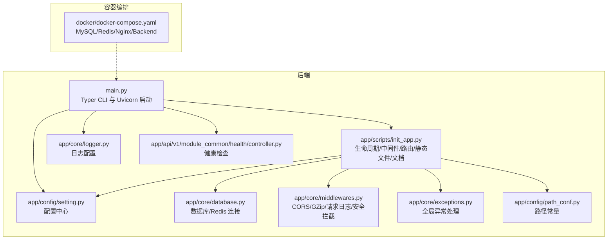
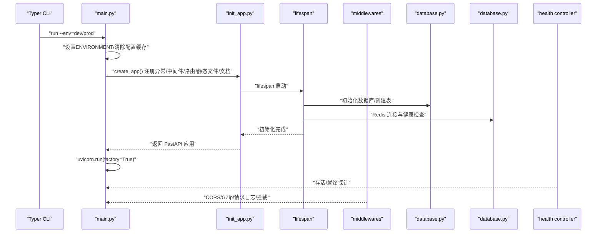
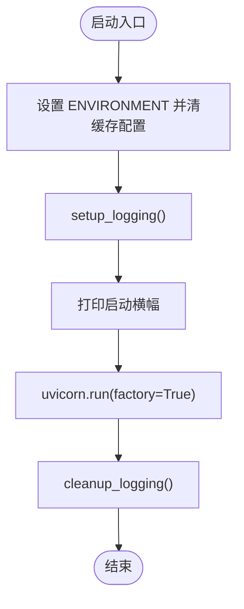
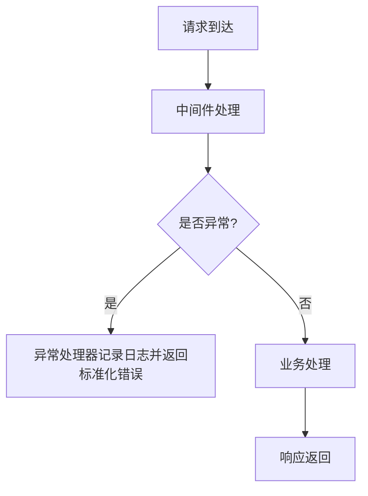
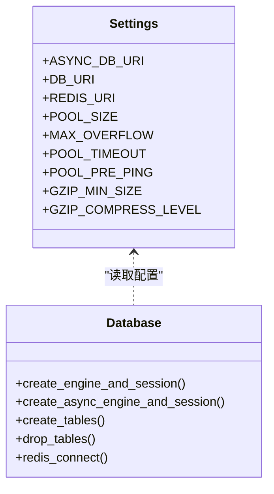
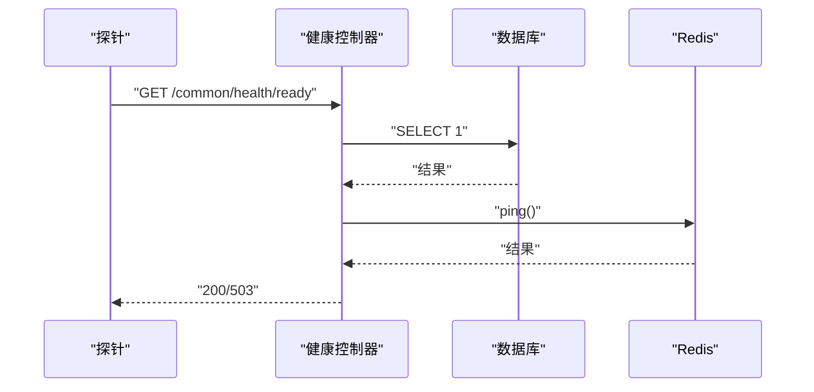

# 故障排查

<cite>
**本文引用的文件**
- [backend/main.py](file://backend/main.py)
- [backend/app/config/setting.py](file://backend/app/config/setting.py)
- [backend/app/core/logger.py](file://backend/app/core/logger.py)
- [backend/app/core/database.py](file://backend/app/core/database.py)
- [backend/app/core/exceptions.py](file://backend/app/core/exceptions.py)
- [backend/app/core/middlewares.py](file://backend/app/core/middlewares.py)
- [backend/app/scripts/init_app.py](file://backend/app/scripts/init_app.py)
- [backend/app/config/path_conf.py](file://backend/app/config/path_conf.py)
- [backend/pyproject.toml](file://backend/pyproject.toml)
- [docker/docker-compose.yaml](file://docker/docker-compose.yaml)
- [backend/run_linux.sh](file://backend/run_linux.sh)
- [backend/run_win.bat](file://backend/run_win.bat)
- [backend/app/api/v1/module_common/health/controller.py](file://backend/app/api/v1/module_common/health/controller.py)
</cite>

## 目录
1. [简介](#简介)
2. [项目结构](#项目结构)
3. [核心组件](#核心组件)
4. [架构总览](#架构总览)
5. [详细组件分析](#详细组件分析)
6. [依赖分析](#依赖分析)
7. [性能考虑](#性能考虑)
8. [故障排查指南](#故障排查指南)
9. [结论](#结论)
10. [附录](#附录)

## 简介
本指南面向运维与开发人员，聚焦 FastapiAdmin 在启动失败、数据库连接、权限与鉴权、性能瓶颈、日志分析、系统监控与告警、网络与文件权限、第三方服务集成以及多环境差异等方面的故障排查。文档以仓库现有实现为依据，结合启动流程、配置体系、日志与异常处理、中间件与数据库连接、健康检查与容器编排，提供可操作的诊断步骤与优化建议。

## 项目结构
后端采用 FastAPI + SQLAlchemy 异步 ORM + Redis 缓存 + Alembic 迁移，通过 Typer CLI 提供 run/revision/upgrade 子命令，日志统一由 Loguru 管理，容器化通过 docker-compose 编排 MySQL、Redis、Nginx 与后端服务。

图示来源
- [backend/main.py:16-51](file://backend/main.py#L16-L51)
- [backend/app/scripts/init_app.py:27-93](file://backend/app/scripts/init_app.py#L27-L93)
- [backend/app/config/setting.py:13-355](file://backend/app/config/setting.py#L13-L355)
- [backend/app/core/logger.py:71-147](file://backend/app/core/logger.py#L71-L147)
- [backend/app/core/database.py:19-177](file://backend/app/core/database.py#L19-L177)
- [backend/app/core/middlewares.py:22-215](file://backend/app/core/middlewares.py#L22-L215)
- [backend/app/core/exceptions.py:57-248](file://backend/app/core/exceptions.py#L57-L248)
- [backend/app/config/path_conf.py:1-32](file://backend/app/config/path_conf.py#L1-L32)
- [backend/app/api/v1/module_common/health/controller.py:17-41](file://backend/app/api/v1/module_common/health/controller.py#L17-L41)
- [docker/docker-compose.yaml:9-201](file://docker/docker-compose.yaml#L9-L201)

章节来源
- [backend/main.py:16-51](file://backend/main.py#L16-L51)
- [backend/app/scripts/init_app.py:27-93](file://backend/app/scripts/init_app.py#L27-L93)
- [docker/docker-compose.yaml:9-201](file://docker/docker-compose.yaml#L9-L201)

## 核心组件
- 启动与 CLI：Typer 提供 run/revision/upgrade 子命令，run 命令通过 Uvicorn 启动服务，并在启动前后设置日志与环境变量。
- 配置中心：集中管理服务器、数据库、Redis、日志、跨域、GZip、静态文件、Swagger/ReDoc/LangJin 文档等配置。
- 日志系统：Loguru 控制台与文件输出，标准库日志桥接，支持 INFO/ERROR 分离轮转、JSON Lines 可选。
- 数据库与缓存：异步/同步引擎创建、连接池参数、Redis 连接与健康检查、异常分类记录。
- 中间件：CORS、GZip、请求日志与演示模式拦截、X-Process-Time 响应头。
- 异常处理：统一捕获自定义异常、HTTP 异常、参数/响应校验异常、SQLAlchemy 异常、值异常与未捕获异常。
- 生命周期与初始化：lifespan 中完成数据库初始化、全局事件、Redis 系统配置/字典、定时任务、请求限流器初始化。
- 健康检查：存活/就绪探针，就绪探针检查数据库与 Redis。
- 容器编排：MySQL/Redis/Nginx/Backend，带健康检查与资源限制。

章节来源
- [backend/main.py:55-106](file://backend/main.py#L55-L106)
- [backend/app/config/setting.py:13-355](file://backend/app/config/setting.py#L13-L355)
- [backend/app/core/logger.py:71-147](file://backend/app/core/logger.py#L71-L147)
- [backend/app/core/database.py:19-177](file://backend/app/core/database.py#L19-L177)
- [backend/app/core/middlewares.py:22-215](file://backend/app/core/middlewares.py#L22-L215)
- [backend/app/core/exceptions.py:57-248](file://backend/app/core/exceptions.py#L57-L248)
- [backend/app/scripts/init_app.py:27-93](file://backend/app/scripts/init_app.py#L27-L93)
- [backend/app/api/v1/module_common/health/controller.py:17-41](file://backend/app/api/v1/module_common/health/controller.py#L17-L41)
- [docker/docker-compose.yaml:9-201](file://docker/docker-compose.yaml#L9-L201)

## 架构总览
下图展示启动与运行时的关键交互：CLI -> 应用创建 -> 生命周期初始化 -> 中间件/路由注册 -> 健康检查 -> 外部依赖（数据库/Redis）。

图示来源
- [backend/main.py:55-106](file://backend/main.py#L55-L106)
- [backend/app/scripts/init_app.py:27-93](file://backend/app/scripts/init_app.py#L27-L93)
- [backend/app/core/database.py:135-177](file://backend/app/core/database.py#L135-L177)
- [backend/app/api/v1/module_common/health/controller.py:17-41](file://backend/app/api/v1/module_common/health/controller.py#L17-L41)

## 详细组件分析

### 启动流程与 CLI
- run 子命令负责设置环境变量、清缓存、重新加载配置、打印横幅、调用 Uvicorn 启动服务。
- 开发环境启用 reload，生产环境关闭。
- 启动前后分别进行日志初始化与清理。

图示来源
- [backend/main.py:74-106](file://backend/main.py#L74-L106)
- [backend/app/core/logger.py:71-147](file://backend/app/core/logger.py#L71-L147)

章节来源
- [backend/main.py:55-106](file://backend/main.py#L55-L106)
- [backend/app/core/logger.py:71-147](file://backend/app/core/logger.py#L71-L147)

### 配置体系与环境差异
- 配置来源于 .env.{env}，区分大小写，支持调试、跨域、日志、数据库、Redis、GZip、静态文件、Swagger/ReDoc/LangJin 文档、OAuth、外部 HTTP、请求限流等。
- 数据库支持 mysql/postgres/sqlite，异步/同步 URL 动态拼装；连接池参数可调；Redis URI 统一拼装。
- 中间件与事件列表按开关动态组装。

章节来源
- [backend/app/config/setting.py:13-355](file://backend/app/config/setting.py#L13-L355)

### 日志系统与异常处理
- 日志：控制台彩色输出、info/error 分文件轮转、压缩、保留策略；标准库日志桥接；可选 JSON Lines 文件。
- 异常：统一捕获 Custom/HTTP/参数/响应/SQLAlchemy/值/未捕获异常，记录请求上下文与错误详情，返回标准化响应。

图示来源
- [backend/app/core/exceptions.py:57-248](file://backend/app/core/exceptions.py#L57-L248)
- [backend/app/core/logger.py:71-147](file://backend/app/core/logger.py#L71-L147)

章节来源
- [backend/app/core/exceptions.py:57-248](file://backend/app/core/exceptions.py#L57-L248)
- [backend/app/core/logger.py:71-147](file://backend/app/core/logger.py#L71-L147)

### 中间件与安全拦截
- CORS/GZip：按配置启用，最小压缩阈值与压缩等级可调。
- 请求日志：记录来源、方法、路径、处理时间、响应状态与内容长度；支持从 Token 提取会话 ID 写入 request.scope。
- 演示模式拦截：黑名单优先，其次非 GET 请求在演示模式下需白名单放行；拦截时记录详细审计信息。

章节来源
- [backend/app/core/middlewares.py:22-215](file://backend/app/core/middlewares.py#L22-L215)

### 数据库与 Redis 连接
- 异步/同步引擎创建：根据数据库类型与连接池参数构建；echo/echo_pool/预检/回收等参数可调。
- Redis 连接：从 URL 构造，健康检查 ping；认证/超时/错误分类记录；关闭时清理。
- 生命周期：lifespan 中初始化数据库、Redis、定时任务、限流器。

图示来源
- [backend/app/config/setting.py:257-312](file://backend/app/config/setting.py#L257-L312)
- [backend/app/core/database.py:19-177](file://backend/app/core/database.py#L19-L177)

章节来源
- [backend/app/core/database.py:19-177](file://backend/app/core/database.py#L19-L177)
- [backend/app/scripts/init_app.py:27-93](file://backend/app/scripts/init_app.py#L27-L93)

### 健康检查与系统监控
- 存活探针：轻量检查，进程启动即健康。
- 就绪探针：检查数据库与 Redis，任一失败返回 503，K8s 用作摘除流量。
- 容器健康检查：MySQL/Redis/Nginx/Backend 健康检查配置，便于编排层快速发现故障。

图示来源
- [backend/app/api/v1/module_common/health/controller.py:17-41](file://backend/app/api/v1/module_common/health/controller.py#L17-L41)
- [docker/docker-compose.yaml:119-128](file://docker/docker-compose.yaml#L119-L128)

章节来源
- [backend/app/api/v1/module_common/health/controller.py:17-41](file://backend/app/api/v1/module_common/health/controller.py#L17-L41)
- [docker/docker-compose.yaml:119-128](file://docker/docker-compose.yaml#L119-L128)

### 容器编排与多环境
- docker-compose 定义 MySQL/Redis/Nginx/Backend，均配置健康检查与资源限制。
- Backend 依赖 MySQL/Redis 健康；Nginx 依赖后端启动。
- 提供 Linux/Windows 启动脚本，封装数据库检查、迁移与初始化流程。

章节来源
- [docker/docker-compose.yaml:9-201](file://docker/docker-compose.yaml#L9-L201)
- [backend/run_linux.sh:105-138](file://backend/run_linux.sh#L105-L138)
- [backend/run_win.bat:84-99](file://backend/run_win.bat#L84-L99)

## 依赖分析
- 启动与运行：Typer -> FastAPI -> Uvicorn；生命周期依赖 SQLAlchemy/Redis/Alembic。
- 日志：Loguru 作为主日志库，桥接标准库日志。
- 数据库：SQLAlchemy 2.x + 异步驱动（asyncpg/asyncmy/aiosqlite）+ 连接池；同步驱动（psycopg/pymysql/sqlite）。
- 缓存：Redis 客户端；限流器基于 Redis。
- 文档：Swagger UI/ReDoc/LangJin UI 本地静态资源定制。
- 外部 HTTP：httpx 默认超时可配置。

章节来源
- [backend/pyproject.toml:7-52](file://backend/pyproject.toml#L7-L52)
- [backend/app/config/setting.py:142-143](file://backend/app/config/setting.py#L142-L143)

## 性能考虑
- 连接池与超时：合理设置 pool_size/max_overflow/pool_timeout/pool_recycle/预检，避免连接饥饿与泄漏。
- GZip 压缩：最小压缩阈值与压缩等级影响 CPU 与带宽权衡。
- 异步优先：数据库与外部 HTTP 使用异步客户端，减少阻塞。
- 中间件顺序：CORS/GZip/日志/拦截的组合会影响延迟，建议按性能需求调整。
- 定时任务与限流：SchedulerUtil 与 FastAPILimiter 初始化应在 lifespan 中完成，避免运行期抖动。

[本节为通用指导，不直接分析具体文件]

## 故障排查指南

### 一、启动失败
- 症状
  - 启动报错、端口占用、环境变量未生效、横幅未显示。
- 诊断步骤
  - 检查 run 子命令参数与环境变量是否正确设置，确认缓存已清。
  - 查看日志输出，确认 setup_logging 是否执行成功。
  - 开发环境是否启用 reload，生产环境是否关闭。
  - Uvicorn 工厂模式是否正确指向 create_app。
- 关联文件
  - [backend/main.py:55-106](file://backend/main.py#L55-L106)
  - [backend/app/core/logger.py:71-147](file://backend/app/core/logger.py#L71-L147)

章节来源
- [backend/main.py:55-106](file://backend/main.py#L55-L106)
- [backend/app/core/logger.py:71-147](file://backend/app/core/logger.py#L71-L147)

### 二、数据库连接问题
- 症状
  - 启动阶段连接失败、运行时报错、数据库不可用。
- 诊断步骤
  - 检查 DATABASE_TYPE/主机/端口/用户名/密码/库名是否正确。
  - 确认连接池参数（pool_size/max_overflow/pool_timeout/pool_recycle/预检）是否合理。
  - 在生命周期中确认数据库初始化是否完成。
  - 使用就绪探针检查数据库连通性。
- 关联文件
  - [backend/app/config/setting.py:257-302](file://backend/app/config/setting.py#L257-L302)
  - [backend/app/core/database.py:19-106](file://backend/app/core/database.py#L19-L106)
  - [backend/app/scripts/init_app.py:27-61](file://backend/app/scripts/init_app.py#L27-L61)
  - [backend/app/api/v1/module_common/health/controller.py:34-41](file://backend/app/api/v1/module_common/health/controller.py#L34-L41)

章节来源
- [backend/app/config/setting.py:257-302](file://backend/app/config/setting.py#L257-L302)
- [backend/app/core/database.py:19-106](file://backend/app/core/database.py#L19-L106)
- [backend/app/scripts/init_app.py:27-61](file://backend/app/scripts/init_app.py#L27-L61)
- [backend/app/api/v1/module_common/health/controller.py:34-41](file://backend/app/api/v1/module_common/health/controller.py#L34-L41)

### 三、Redis 连接问题
- 症状
  - Redis 未启用、认证失败、连接超时、ping 失败。
- 诊断步骤
  - 检查 REDIS_ENABLE/主机/端口/密码/DB 是否正确。
  - 观察 Redis 连接与 ping 结果，关注认证/超时/错误分类日志。
  - 确认 lifespan 中 Redis 初始化与关闭流程。
- 关联文件
  - [backend/app/config/setting.py:305-312](file://backend/app/config/setting.py#L305-L312)
  - [backend/app/core/database.py:135-177](file://backend/app/core/database.py#L135-L177)
  - [backend/app/scripts/init_app.py:42-61](file://backend/app/scripts/init_app.py#L42-L61)

章节来源
- [backend/app/config/setting.py:305-312](file://backend/app/config/setting.py#L305-L312)
- [backend/app/core/database.py:135-177](file://backend/app/core/database.py#L135-L177)
- [backend/app/scripts/init_app.py:42-61](file://backend/app/scripts/init_app.py#L42-L61)

### 四、权限与鉴权问题
- 症状
  - 401/403、JWT 过期、RBAC 白名单配置不当、演示模式拦截误伤。
- 诊断步骤
  - 检查 SECRET_KEY/ALGORITHM/TOKEN_EXPIRE/TOKEN_REQUEST_PATH_EXCLUDE。
  - 确认演示模式下 IP 黑名单/白名单与路径白名单配置。
  - 查看请求日志中间件对会话 ID 的提取与拦截记录。
- 关联文件
  - [backend/app/config/setting.py:67-73](file://backend/app/config/setting.py#L67-L73)
  - [backend/app/core/middlewares.py:36-200](file://backend/app/core/middlewares.py#L36-L200)

章节来源
- [backend/app/config/setting.py:67-73](file://backend/app/config/setting.py#L67-L73)
- [backend/app/core/middlewares.py:36-200](file://backend/app/core/middlewares.py#L36-L200)

### 五、性能瓶颈
- 症状
  - 响应慢、CPU 高、连接池耗尽、GZip 带宽与 CPU 权衡。
- 诊断步骤
  - 查看中间件 X-Process-Time 响应头，定位慢点。
  - 调整连接池参数与预检，观察数据库侧延迟。
  - 评估 GZip 最小压缩阈值与压缩等级。
  - 检查限流器与定时任务是否造成抖动。
- 关联文件
  - [backend/app/core/middlewares.py:189-192](file://backend/app/core/middlewares.py#L189-L192)
  - [backend/app/config/setting.py:86-91](file://backend/app/config/setting.py#L86-L91)
  - [backend/app/config/setting.py:167-169](file://backend/app/config/setting.py#L167-L169)

章节来源
- [backend/app/core/middlewares.py:189-192](file://backend/app/core/middlewares.py#L189-L192)
- [backend/app/config/setting.py:86-91](file://backend/app/config/setting.py#L86-L91)
- [backend/app/config/setting.py:167-169](file://backend/app/config/setting.py#L167-L169)

### 六、日志分析技巧
- 日志级别与输出
  - 通过 LOGGER_LEVEL 控制全局日志级别；INFO/ERROR 分文件轮转，保留 30 天，压缩 gz。
  - 可启用 JSON Lines 文件采集，缩短采集与检索链路。
- 关键信息提取
  - 请求来源、方法、路径、处理时间、响应状态与内容长度。
  - 异常类型与错误详情，便于快速定位。
- 问题定位方法
  - 使用就绪探针定位数据库/Redis 依赖故障。
  - 在演示模式拦截处查看详细审计日志。
- 关联文件
  - [backend/app/core/logger.py:71-147](file://backend/app/core/logger.py#L71-L147)
  - [backend/app/core/middlewares.py:104-197](file://backend/app/core/middlewares.py#L104-L197)
  - [backend/app/core/exceptions.py:80-247](file://backend/app/core/exceptions.py#L80-L247)

章节来源
- [backend/app/core/logger.py:71-147](file://backend/app/core/logger.py#L71-L147)
- [backend/app/core/middlewares.py:104-197](file://backend/app/core/middlewares.py#L104-L197)
- [backend/app/core/exceptions.py:80-247](file://backend/app/core/exceptions.py#L80-L247)

### 七、系统监控与告警
- 存活/就绪探针
  - 存活探针：进程启动即健康，用于容器存活判定。
  - 就绪探针：检查数据库与 Redis，任一失败返回 503，用于摘除流量。
- 容器健康检查
  - MySQL/Redis/Nginx/Backend 健康检查配置，便于编排层快速发现故障。
- 建议
  - 将就绪探针纳入 K8s readinessProbe/livenessProbe。
  - 结合日志与探针结果建立告警阈值。
- 关联文件
  - [backend/app/api/v1/module_common/health/controller.py:17-41](file://backend/app/api/v1/module_common/health/controller.py#L17-L41)
  - [docker/docker-compose.yaml:29-87](file://docker/docker-compose.yaml#L29-L87)
  - [docker/docker-compose.yaml:119-128](file://docker/docker-compose.yaml#L119-L128)

章节来源
- [backend/app/api/v1/module_common/health/controller.py:17-41](file://backend/app/api/v1/module_common/health/controller.py#L17-L41)
- [docker/docker-compose.yaml:29-87](file://docker/docker-compose.yaml#L29-L87)
- [docker/docker-compose.yaml:119-128](file://docker/docker-compose.yaml#L119-L128)

### 八、网络与文件权限
- 网络
  - CORS/跨域配置、代理头 X-Forwarded-For 的真实 IP 提取。
  - Nginx 作为反向代理时，注意上游健康检查与超时设置。
- 文件权限
  - 静态资源目录与上传目录需确保后端进程可读写。
  - 日志目录需确保后端进程可写，避免轮转失败。
- 关联文件
  - [backend/app/config/setting.py:57-62](file://backend/app/config/setting.py#L57-L62)
  - [backend/app/config/setting.py:174-194](file://backend/app/config/setting.py#L174-L194)
  - [backend/app/config/path_conf.py:9-16](file://backend/app/config/path_conf.py#L9-L16)
  - [docker/docker-compose.yaml:153-158](file://docker/docker-compose.yaml#L153-L158)

章节来源
- [backend/app/config/setting.py:57-62](file://backend/app/config/setting.py#L57-L62)
- [backend/app/config/setting.py:174-194](file://backend/app/config/setting.py#L174-L194)
- [backend/app/config/path_conf.py:9-16](file://backend/app/config/path_conf.py#L9-L16)
- [docker/docker-compose.yaml:153-158](file://docker/docker-compose.yaml#L153-L158)

### 九、第三方服务集成
- 外部 HTTP
  - httpx 默认超时可配置，IP 归属地查询等外部请求需考虑超时与降级。
- AI/OpenAI
  - OpenAI 基础地址、API Key、模型可配置，需确保网络可达与凭据正确。
- 关联文件
  - [backend/app/config/setting.py:142-143](file://backend/app/config/setting.py#L142-L143)
  - [backend/app/config/setting.py:209-211](file://backend/app/config/setting.py#L209-L211)

章节来源
- [backend/app/config/setting.py:142-143](file://backend/app/config/setting.py#L142-L143)
- [backend/app/config/setting.py:209-211](file://backend/app/config/setting.py#L209-L211)

### 十、多环境差异
- 开发/生产
  - 开发环境启用 reload，生产关闭；日志级别与文档路径可能不同。
  - Docker Compose 中资源限制与健康检查在不同环境有差异。
- 脚本辅助
  - Linux/Windows 启动脚本封装数据库检查、迁移与初始化，便于快速复现问题。
- 关联文件
  - [backend/main.py:95-101](file://backend/main.py#L95-L101)
  - [docker/docker-compose.yaml:9-201](file://docker/docker-compose.yaml#L9-L201)
  - [backend/run_linux.sh:105-138](file://backend/run_linux.sh#L105-L138)
  - [backend/run_win.bat:84-99](file://backend/run_win.bat#L84-L99)

章节来源
- [backend/main.py:95-101](file://backend/main.py#L95-L101)
- [docker/docker-compose.yaml:9-201](file://docker/docker-compose.yaml#L9-L201)
- [backend/run_linux.sh:105-138](file://backend/run_linux.sh#L105-L138)
- [backend/run_win.bat:84-99](file://backend/run_win.bat#L84-L99)

## 结论
本指南基于代码实现总结了 FastapiAdmin 的启动、配置、日志、异常、中间件、数据库/Redis、健康检查与容器编排等关键环节的故障排查要点。建议在日常运维中结合就绪探针、日志与容器健康检查，形成闭环监控与告警；针对性能问题，从连接池、压缩与中间件入手逐步优化；多环境差异通过脚本与配置中心统一管理，降低人为失误风险。

## 附录
- 常用命令参考
  - 启动：python main.py run --env={dev|prod}
  - 生成迁移：python main.py revision --env=dev
  - 应用迁移：python main.py upgrade --env=dev
- 路径与配置
  - 日志目录：logs
  - 静态资源目录：static
  - 环境配置目录：env
- 容器服务
  - MySQL/Redis/Nginx/Backend 健康检查与资源限制已在 docker-compose 中配置

[本节为补充信息，不直接分析具体文件]