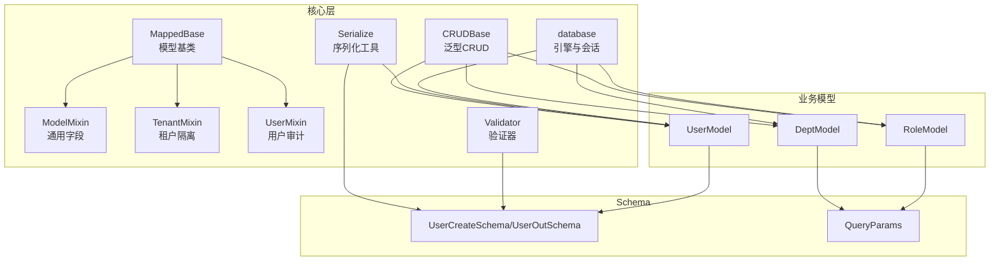
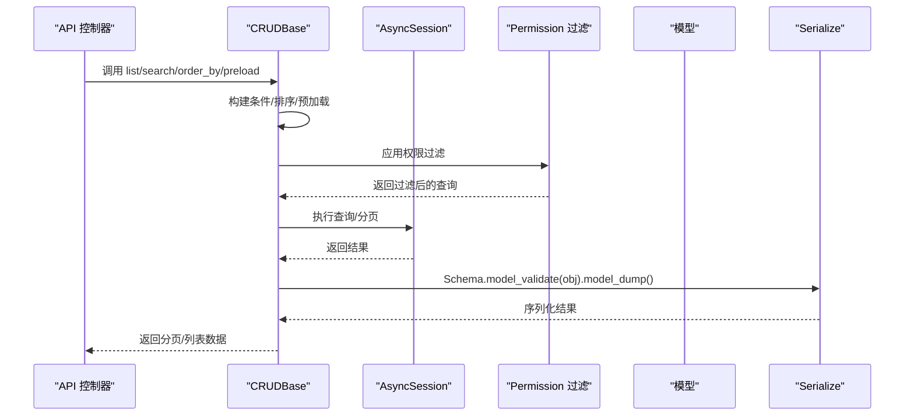
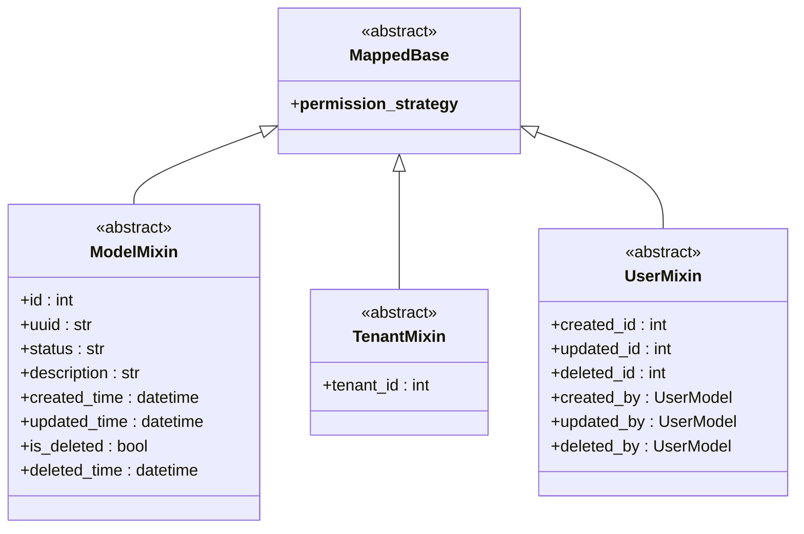
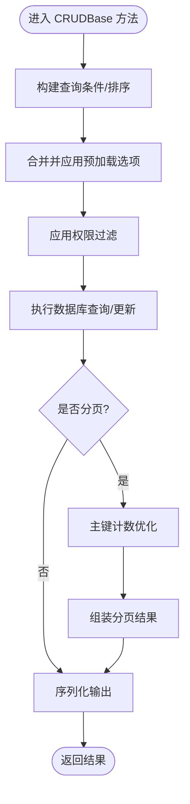
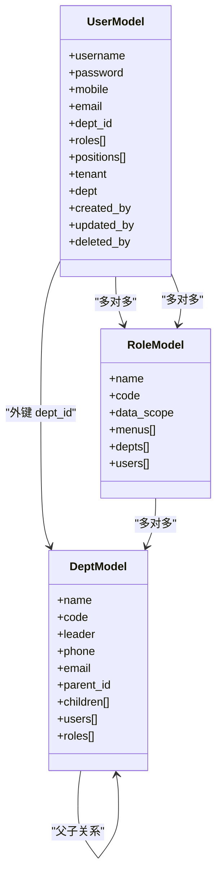

# ORM模型设计

<cite>
**本文档引用的文件**
- [backend/app/core/base_model.py](file://backend/app/core/base_model.py)
- [backend/app/core/base_crud.py](file://backend/app/core/base_crud.py)
- [backend/app/core/serialize.py](file://backend/app/core/serialize.py)
- [backend/app/core/validator.py](file://backend/app/core/validator.py)
- [backend/app/core/database.py](file://backend/app/core/database.py)
- [backend/app/core/base_schema.py](file://backend/app/core/base_schema.py)
- [backend/app/common/enums.py](file://backend/app/common/enums.py)
- [backend/app/common/constant.py](file://backend/app/common/constant.py)
- [backend/app/config/setting.py](file://backend/app/config/setting.py)
- [backend/app/api/v1/module_system/user/model.py](file://backend/app/api/v1/module_system/user/model.py)
- [backend/app/api/v1/module_system/user/crud.py](file://backend/app/api/v1/module_system/user/crud.py)
- [backend/app/api/v1/module_system/user/schema.py](file://backend/app/api/v1/module_system/user/schema.py)
- [backend/app/api/v1/module_system/dept/model.py](file://backend/app/api/v1/module_system/dept/model.py)
- [backend/app/api/v1/module_system/role/model.py](file://backend/app/api/v1/module_system/role/model.py)
</cite>

## 目录
1. [简介](#简介)
2. [项目结构](#项目结构)
3. [核心组件](#核心组件)
4. [架构总览](#架构总览)
5. [详细组件分析](#详细组件分析)
6. [依赖分析](#依赖分析)
7. [性能考虑](#性能考虑)
8. [故障排查指南](#故障排查指南)
9. [结论](#结论)
10. [附录](#附录)

## 简介
本文件面向 FastapiAdmin 的 ORM 模型设计，系统性阐述基于 SQLAlchemy 的架构设计与实现要点，涵盖：
- 基类与混入（BaseModel、ModelMixin、TenantMixin、UserMixin）
- CRUD 抽象层（CRUDBase）与查询优化策略
- 模型定义规范（字段类型映射、关系定义、约束声明）
- 查询优化（懒加载、急加载、批量查询）
- 模型验证机制（数据类型、业务规则、唯一性约束）
- 序列化与反序列化（JSON 序列化与 API 响应格式）
- 生命周期钩子（创建、更新、删除事件）

## 项目结构
FastapiAdmin 的 ORM 层采用“混入 + 泛型 CRUD + Schema 模式”的组织方式：
- 核心基类与混入位于 core 目录，提供统一的模型字段与权限策略
- CRUD 抽象层位于 core，封装通用的增删改查与权限过滤
- 模型与 Schema 分离，模型负责持久化，Schema 负责输入输出与验证
- 配置与常量位于 common 与 config，支撑数据库连接、枚举与常量

图表来源
- [backend/app/core/base_model.py:21-228](file://backend/app/core/base_model.py#L21-L228)
- [backend/app/core/base_crud.py:26-571](file://backend/app/core/base_crud.py#L26-L571)
- [backend/app/core/serialize.py:10-54](file://backend/app/core/serialize.py#L10-L54)
- [backend/app/core/validator.py:1-298](file://backend/app/core/validator.py#L1-L298)
- [backend/app/core/database.py:19-177](file://backend/app/core/database.py#L19-L177)
- [backend/app/api/v1/module_system/user/model.py:64-151](file://backend/app/api/v1/module_system/user/model.py#L64-L151)
- [backend/app/api/v1/module_system/dept/model.py:14-59](file://backend/app/api/v1/module_system/dept/model.py#L14-L59)
- [backend/app/api/v1/module_system/role/model.py:64-100](file://backend/app/api/v1/module_system/role/model.py#L64-L100)

章节来源
- [backend/app/core/base_model.py:21-228](file://backend/app/core/base_model.py#L21-L228)
- [backend/app/core/base_crud.py:26-571](file://backend/app/core/base_crud.py#L26-L571)
- [backend/app/core/database.py:19-177](file://backend/app/core/database.py#L19-L177)

## 核心组件
- MappedBase：声明式基类，兼容 SQLite/MySQL/PostgreSQL，提供抽象标记与权限策略默认值
- ModelMixin：提供 id、uuid、状态、描述、时间戳、软删除等通用字段
- TenantMixin：提供 tenant_id 字段，配合 sys_tenant 实现行级租户隔离
- UserMixin：提供 created_id/updated_id/deleted_id 及 created_by/updated_by/deleted_by 关系
- CRUDBase：泛型 CRUD 抽象，统一实现 get/list/tree_list/page/create/update/delete/set/restore 等
- Serialize：Schema 与模型之间的双向转换工具
- Validator：自定义类型与业务规则验证器（日期、邮箱、手机号、菜单/角色请求等）
- database：异步/同步引擎与会话工厂，表创建/删除入口

章节来源
- [backend/app/core/base_model.py:21-228](file://backend/app/core/base_model.py#L21-L228)
- [backend/app/core/base_crud.py:26-571](file://backend/app/core/base_crud.py#L26-L571)
- [backend/app/core/serialize.py:10-54](file://backend/app/core/serialize.py#L10-L54)
- [backend/app/core/validator.py:1-298](file://backend/app/core/validator.py#L1-L298)
- [backend/app/core/database.py:19-177](file://backend/app/core/database.py#L19-L177)

## 架构总览
ORM 层通过“基类 + 混入 + 泛型 CRUD + Schema”实现高内聚低耦合的设计：
- 模型层：继承混入，定义字段、索引、外键、关系与默认加载策略
- 数据层：CRUDBase 统一封装查询、权限过滤、预加载与分页
- 序列化层：Serialize 与 Pydantic Schema 实现 JSON 序列化与 API 响应格式
- 配置层：Settings 提供数据库连接与驱动选择，database 负责引擎与会话

图表来源
- [backend/app/core/base_crud.py:72-104](file://backend/app/core/base_crud.py#L72-L104)
- [backend/app/core/base_crud.py:151-214](file://backend/app/core/base_crud.py#L151-L214)
- [backend/app/core/serialize.py:36-53](file://backend/app/core/serialize.py#L36-L53)

## 详细组件分析

### 基类与混入体系
- MappedBase：声明式基类，支持 AsyncAttrs 与 DeclarativeBase，提供抽象标记与权限策略默认值
- ModelMixin：统一 id、uuid、status、description、created_time、updated_time、is_deleted、deleted_time 等字段
- TenantMixin：统一 tenant_id 字段，外键指向 sys_tenant，支持默认值与索引
- UserMixin：统一 created_id/updated_id/deleted_id 字段，并提供 created_by/updated_by/deleted_by 关系，使用 selectin 加载策略避免循环依赖

图表来源
- [backend/app/core/base_model.py:21-228](file://backend/app/core/base_model.py#L21-L228)

章节来源
- [backend/app/core/base_model.py:21-228](file://backend/app/core/base_model.py#L21-L228)

### 泛型 CRUD 抽象层
- 支持 get、list、tree_list、page、create、update、delete、clear、set、restore 等
- 条件构建：支持 None/空字符串跳过、("in", []) 空集恒假、("between", ...)、比较运算符等
- 排序：支持多字段 asc/desc
- 预加载：合并模型默认 __loader_options__ 与传入 preload，统一使用 selectinload
- 权限过滤：通过 Permission.filter_query 对 Select 进行权限裁剪
- 分页：主键计数优化，避免全表 count(*)
- 软删除：自动识别 is_deleted/deleted_time/deleted_id，支持 restore

图表来源
- [backend/app/core/base_crud.py:453-512](file://backend/app/core/base_crud.py#L453-L512)
- [backend/app/core/base_crud.py:534-570](file://backend/app/core/base_crud.py#L534-L570)
- [backend/app/core/base_crud.py:186-198](file://backend/app/core/base_crud.py#L186-L198)

章节来源
- [backend/app/core/base_crud.py:26-571](file://backend/app/core/base_crud.py#L26-L571)

### 模型定义规范
- 字段类型映射：参考 GenConstant 中的数据库类型到 SQLAlchemy 类型映射，确保跨数据库一致性
- 关系定义：使用 relationship 指定 foreign_keys、back_populates、lazy 策略（推荐 selectin）
- 约束声明：唯一性（unique）、非空（nullable=False）、索引（index=True）、外键约束（ForeignKey/ondelete/onupdate）
- 默认值：uuid4_str、datetime.now、布尔默认值等
- 权限策略：通过 __permission_strategy__ 选择数据范围/角色/部门/自定义策略

章节来源
- [backend/app/common/constant.py:516-775](file://backend/app/common/constant.py#L516-L775)
- [backend/app/common/enums.py:111-122](file://backend/app/common/enums.py#L111-L122)
- [backend/app/api/v1/module_system/user/model.py:64-151](file://backend/app/api/v1/module_system/user/model.py#L64-L151)
- [backend/app/api/v1/module_system/dept/model.py:14-59](file://backend/app/api/v1/module_system/dept/model.py#L14-L59)
- [backend/app/api/v1/module_system/role/model.py:64-100](file://backend/app/api/v1/module_system/role/model.py#L64-L100)

### 查询优化策略
- 懒加载（default select）：默认关系按需访问，避免 N+1
- 急加载（joined/subquery）：适合强关联一次性获取
- 批量查询（selectin）：推荐用于一对多，避免异步环境的 MissingGreenlet 错误
- 预加载合并：模型默认 __loader_options__ 与传入 preload 合并，避免重复加载
- 主键计数优化：分页 count 使用主键列计数，提升性能

章节来源
- [backend/app/core/base_model.py:56-66](file://backend/app/core/base_model.py#L56-L66)
- [backend/app/core/base_crud.py:534-570](file://backend/app/core/base_crud.py#L534-L570)
- [backend/app/core/base_crud.py:186-198](file://backend/app/core/base_crud.py#L186-L198)

### 模型验证机制
- 数据类型检查：Pydantic 字段与自定义类型（DateTimeStr、DateStr、TimeStr、Telephone、Email）
- 业务规则验证：手机号/邮箱正则、菜单/角色请求参数校验、用户名/密码长度与格式
- 唯一性约束：模型字段 unique=True，结合 Schema 校验保证输入合法性

章节来源
- [backend/app/core/validator.py:10-61](file://backend/app/core/validator.py#L10-L61)
- [backend/app/api/v1/module_system/user/schema.py:103-176](file://backend/app/api/v1/module_system/user/schema.py#L103-L176)
- [backend/app/api/v1/module_system/user/schema.py:217-242](file://backend/app/api/v1/module_system/user/schema.py#L217-L242)

### 序列化与反序列化
- 模型转 Schema：Serialize.model_to_dict + Schema.model_validate + model_dump
- Schema 转模型：Serialize.schema_to_model + model(**kwargs)
- JSON 序列化：PlainSerializer 将 datetime/date/time 序列化为字符串，统一展示格式

章节来源
- [backend/app/core/serialize.py:10-54](file://backend/app/core/serialize.py#L10-L54)
- [backend/app/core/validator.py:10-44](file://backend/app/core/validator.py#L10-L44)
- [backend/app/core/base_schema.py:15-50](file://backend/app/core/base_schema.py#L15-L50)

### 模型生命周期钩子
- 创建：CRUDBase.create 自动注入 created_id/updated_id（若有）
- 更新：CRUDBase.update 自动注入 updated_id，并在 flush 后二次验证对象仍处于权限范围内
- 删除：支持软删除（is_deleted/deleted_time/deleted_id）与物理删除；restore 支持恢复软删除
- 审计：UserMixin 提供 created_by/updated_by/deleted_by 关系，便于审计追踪

章节来源
- [backend/app/core/base_crud.py:216-246](file://backend/app/core/base_crud.py#L216-L246)
- [backend/app/core/base_crud.py:247-294](file://backend/app/core/base_crud.py#L247-L294)
- [backend/app/core/base_crud.py:296-372](file://backend/app/core/base_crud.py#L296-L372)
- [backend/app/core/base_crud.py:405-444](file://backend/app/core/base_crud.py#L405-L444)
- [backend/app/core/base_model.py:148-228](file://backend/app/core/base_model.py#L148-L228)

### 典型业务模型示例
- UserModel：继承 ModelMixin/TenantMixin/UserMixin，定义用户字段与多对多关系（角色、岗位），默认预加载 tenant/dept/roles/positions/created_by/updated_by/deleted_by
- DeptModel：继承 ModelMixin，定义树形结构 parent_id/children，权限策略为 DEPT_BASED
- RoleModel：继承 ModelMixin，定义角色字段与多对多关系（菜单、部门、用户），默认预加载 menus/depts，权限策略为 USER_ROLE

图表来源
- [backend/app/api/v1/module_system/user/model.py:64-151](file://backend/app/api/v1/module_system/user/model.py#L64-L151)
- [backend/app/api/v1/module_system/dept/model.py:14-59](file://backend/app/api/v1/module_system/dept/model.py#L14-L59)
- [backend/app/api/v1/module_system/role/model.py:64-100](file://backend/app/api/v1/module_system/role/model.py#L64-L100)

章节来源
- [backend/app/api/v1/module_system/user/model.py:64-151](file://backend/app/api/v1/module_system/user/model.py#L64-L151)
- [backend/app/api/v1/module_system/dept/model.py:14-59](file://backend/app/api/v1/module_system/dept/model.py#L14-L59)
- [backend/app/api/v1/module_system/role/model.py:64-100](file://backend/app/api/v1/module_system/role/model.py#L64-L100)

## 依赖分析
- 数据库连接：Settings 提供 ASYNC_DB_URI/DB_URI，database 创建 AsyncEngine/AsyncSessionLocal
- 引擎与会话：create_async_engine_and_session 根据 DATABASE_TYPE 选择驱动，支持 sqlite/mysql/postgres
- 表创建/删除：create_tables/drop_tables 基于 MappedBase.metadata

图表来源
- [backend/app/config/setting.py:257-302](file://backend/app/config/setting.py#L257-L302)
- [backend/app/core/database.py:53-106](file://backend/app/core/database.py#L53-L106)
- [backend/app/core/database.py:113-132](file://backend/app/core/database.py#L113-L132)

章节来源
- [backend/app/config/setting.py:257-302](file://backend/app/config/setting.py#L257-L302)
- [backend/app/core/database.py:53-106](file://backend/app/core/database.py#L53-L106)
- [backend/app/core/database.py:113-132](file://backend/app/core/database.py#L113-L132)

## 性能考虑
- 预加载策略：优先使用 selectinload 避免 N+1，合理合并 __loader_options__ 与传入 preload
- 分页优化：使用主键计数（pk_cols[0]）替代 count(*)，减少全表扫描
- 条件构建：对空值与 None 进行显式处理，避免无效查询退化
- 异步环境：避免使用 select/joined 等可能导致 MissingGreenlet 的加载策略
- 索引设计：常用过滤字段（status、uuid、created_id/updated_id 等）建立索引

## 故障排查指南
- 查询失败：CustomException 包裹底层异常，检查条件构建与权限过滤
- 权限异常：确认 __permission_strategy__ 与 Permission.filter_query 的应用
- 软删除问题：确认模型具备 is_deleted/deleted_time/deleted_id 字段，使用 restore 恢复
- 序列化异常：检查 Schema.model_validate 与 model_dump 的字段映射
- 数据库连接：确认 Settings.SQL_DB_ENABLE 与 DATABASE_TYPE 配置正确

章节来源
- [backend/app/core/base_crud.py:69-70](file://backend/app/core/base_crud.py#L69-L70)
- [backend/app/core/base_crud.py:293-294](file://backend/app/core/base_crud.py#L293-L294)
- [backend/app/core/base_crud.py:446-451](file://backend/app/core/base_crud.py#L446-L451)
- [backend/app/core/serialize.py:32-33](file://backend/app/core/serialize.py#L32-L33)
- [backend/app/config/setting.py:83-92](file://backend/app/config/setting.py#L83-L92)

## 结论
FastapiAdmin 的 ORM 设计通过“基类 + 混入 + 泛型 CRUD + Schema”的组合，实现了：
- 统一的模型字段与权限策略
- 高效的查询与分页能力
- 明确的验证与序列化流程
- 清晰的生命周期与审计机制
建议在实际业务中遵循字段类型映射、关系与约束声明规范，合理选择预加载策略，并充分利用软删除与权限过滤，确保系统的可维护性与性能。

## 附录
- 配置项参考：DATABASE_TYPE、ASYNC_DB_URI、DB_URI、POOL_SIZE、MAX_OVERFLOW、POOL_TIMEOUT 等
- 常量与枚举：RET（返回码）、PermissionFilterStrategy（权限策略）、QueueEnum（查询操作符）

章节来源
- [backend/app/config/setting.py:97-138](file://backend/app/config/setting.py#L97-L138)
- [backend/app/common/enums.py:111-122](file://backend/app/common/enums.py#L111-L122)
- [backend/app/common/constant.py:7-213](file://backend/app/common/constant.py#L7-L213)