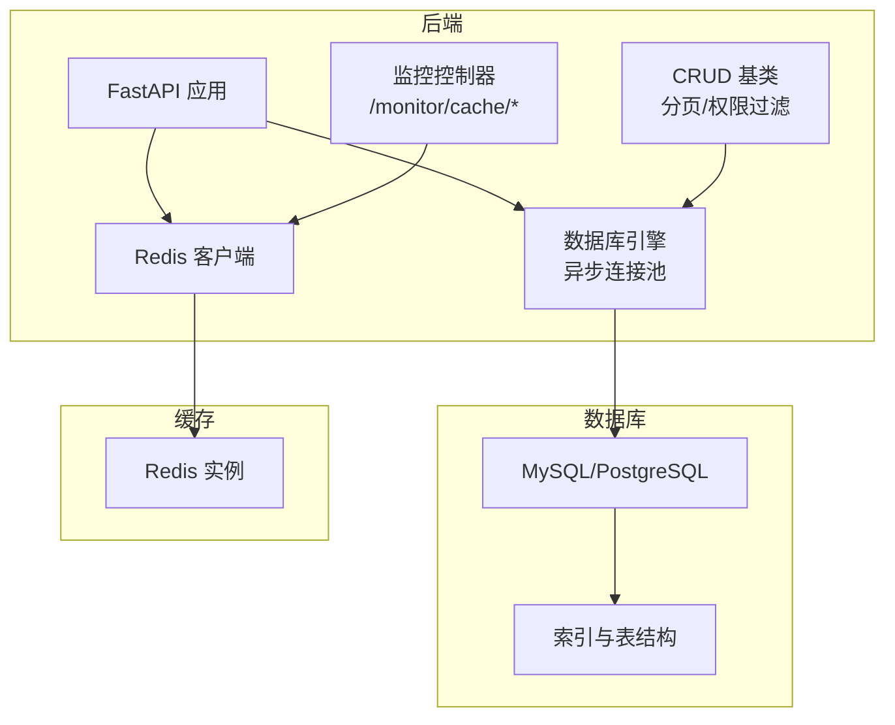
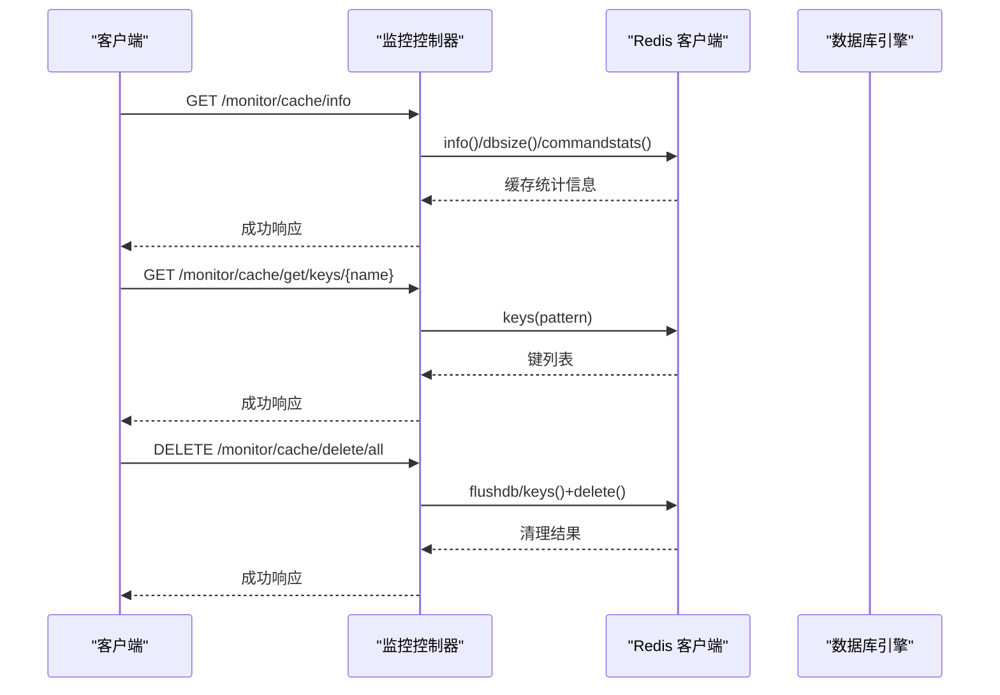
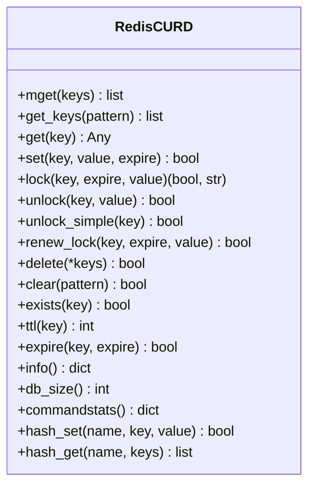
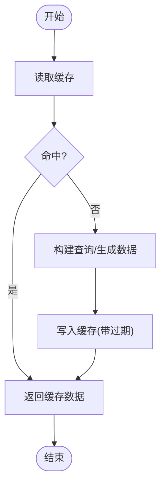
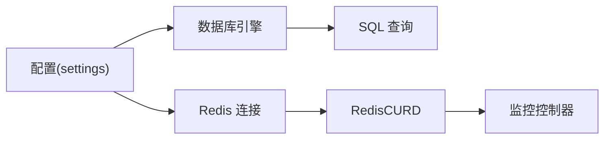

# 数据库性能优化

<cite>
**本文引用的文件**
- [backend/app/core/database.py](file://backend/app/core/database.py)
- [backend/app/config/setting.py](file://backend/app/config/setting.py)
- [backend/app/core/redis_crud.py](file://backend/app/core/redis_crud.py)
- [backend/app/api/v1/module_monitor/cache/controller.py](file://backend/app/api/v1/module_monitor/cache/controller.py)
- [frontend/web/src/api/module_monitor/cache.ts](file://frontend/web/src/api/module_monitor/cache.ts)
- [backend/sql/mysql/fastapiadmin_2026-04-19_223353.sql](file://backend/sql/mysql/fastapiadmin_2026-04-19_223353.sql)
- [backend/sql/postgres/fastapiadmin_2026-04-19_224727.sql](file://backend/sql/postgres/fastapiadmin_2026-04-19_224727.sql)
- [docker/docker-compose.yaml](file://docker/docker-compose.yaml)
- [backend/app/alembic/env.py](file://backend/app/alembic/env.py)
- [backend/alembic.ini](file://backend/alembic.ini)
- [backend/app/core/base_crud.py](file://backend/app/core/base_crud.py)
- [backend/app/api/v1/module_system/params/service.py](file://backend/app/api/v1/module_system/params/service.py)
- [frontend/web/src/utils/table/index.ts](file://frontend/web/src/utils/table/index.ts)
</cite>

## 目录
1. [简介](#简介)
2. [项目结构](#项目结构)
3. [核心组件](#核心组件)
4. [架构总览](#架构总览)
5. [详细组件分析](#详细组件分析)
6. [依赖分析](#依赖分析)
7. [性能考量](#性能考量)
8. [故障排查指南](#故障排查指南)
9. [结论](#结论)
10. [附录](#附录)

## 简介
本文件面向 FastapiAdmin 的数据库与缓存性能优化，聚焦以下方面：
- 数据库性能监控指标：查询响应时间、连接池利用率、锁等待时间、慢查询统计
- 索引优化策略：单列索引、复合索引、覆盖索引的设计原则
- 查询优化技术：EXPLAIN 分析、执行计划优化、查询重写技巧
- 缓存策略设计：Redis 缓存集成、热点数据缓存、缓存失效机制
- 数据库参数调优：连接池、缓冲池、查询缓存等关键参数配置建议
- 分库分表与读写分离：架构实施方法与注意事项

## 项目结构
后端通过 SQLAlchemy 异步引擎与连接池管理数据库连接，Redis 提供高性能缓存能力，并通过监控接口暴露缓存统计信息。数据库迁移与版本管理由 Alembic 驱动。

图表来源
- [backend/app/core/database.py:19-106](file://backend/app/core/database.py#L19-L106)
- [backend/app/config/setting.py:257-312](file://backend/app/config/setting.py#L257-L312)
- [backend/app/core/redis_crud.py:9-343](file://backend/app/core/redis_crud.py#L9-L343)
- [backend/app/api/v1/module_monitor/cache/controller.py:16-197](file://backend/app/api/v1/module_monitor/cache/controller.py#L16-L197)
- [backend/app/core/base_crud.py:26-79](file://backend/app/core/base_crud.py#L26-L79)

章节来源
- [backend/app/core/database.py:19-106](file://backend/app/core/database.py#L19-L106)
- [backend/app/config/setting.py:257-312](file://backend/app/config/setting.py#L257-L312)
- [docker/docker-compose.yaml:9-201](file://docker/docker-compose.yaml#L9-L201)

## 核心组件
- 数据库连接与连接池：异步引擎创建、连接池参数、预检与回收策略
- Redis 缓存：统一 CRUD 封装、分布式锁、过期与续约、命令统计
- 监控接口：缓存信息、键名与值查询、批量清理
- 索引与表结构：MySQL/PostgreSQL 导出脚本中的索引定义
- 迁移与版本：Alembic 配置与运行环境

章节来源
- [backend/app/core/database.py:19-106](file://backend/app/core/database.py#L19-L106)
- [backend/app/core/redis_crud.py:9-343](file://backend/app/core/redis_crud.py#L9-L343)
- [backend/app/api/v1/module_monitor/cache/controller.py:16-197](file://backend/app/api/v1/module_monitor/cache/controller.py#L16-L197)
- [backend/sql/mysql/fastapiadmin_2026-04-19_223353.sql:590-621](file://backend/sql/mysql/fastapiadmin_2026-04-19_223353.sql#L590-L621)
- [backend/sql/postgres/fastapiadmin_2026-04-19_224727.sql:5152-5205](file://backend/sql/postgres/fastapiadmin_2026-04-19_224727.sql#L5152-L5205)
- [backend/app/alembic/env.py:40-136](file://backend/app/alembic/env.py#L40-L136)

## 架构总览
数据库与缓存协同工作：应用通过异步引擎访问数据库，热点数据与临时数据通过 Redis 缓存加速；监控接口用于观测缓存状态与容量。

图表来源
- [backend/app/api/v1/module_monitor/cache/controller.py:16-197](file://backend/app/api/v1/module_monitor/cache/controller.py#L16-L197)
- [backend/app/core/redis_crud.py:273-307](file://backend/app/core/redis_crud.py#L273-L307)
- [frontend/web/src/api/module_monitor/cache.ts:1-95](file://frontend/web/src/api/module_monitor/cache.ts#L1-L95)

## 详细组件分析

### 数据库连接与连接池
- 异步引擎创建：根据配置动态拼接连接串，设置 echo、echo_pool、pool_pre_ping、future、pool_recycle、pool_size、max_overflow、pool_timeout、pool_use_lifo 等参数
- 同步引擎创建：同样支持 echo、pool_pre_ping、pool_recycle 等参数
- 连接池参数建议：
  - pool_size：根据并发峰值与数据库承载能力设定
  - max_overflow：溢出连接数，避免瞬时高峰阻塞
  - pool_timeout：获取连接超时时间
  - pool_recycle：连接回收周期，避免长时间连接失效
  - pool_pre_ping：连接复用前健康检查
  - pool_use_lifo：连接池 LIFO 策略，提升热点连接命中率

章节来源
- [backend/app/core/database.py:53-106](file://backend/app/core/database.py#L53-L106)
- [backend/app/config/setting.py:86-95](file://backend/app/config/setting.py#L86-L95)

### Redis 缓存与监控
- Redis 连接：从 URL 构建，设置编码、解码、健康检查间隔、最大连接数、socket 超时
- 缓存 CRUD：get/mget/set/delete/clear/exists/ttl/expire/hash_set/hash_get
- 分布式锁：lock/unlock/unlock_simple/renew_lock，使用 Lua 原子校验与续约
- 命令统计：info()/dbsize()/commandstats()，前端接口定义了 RedisInfo 与 CacheMonitor 结构
- 前端监控：提供获取缓存信息、键名列表、键值、批量删除等接口

图表来源
- [backend/app/core/redis_crud.py:9-343](file://backend/app/core/redis_crud.py#L9-L343)

章节来源
- [backend/app/core/redis_crud.py:9-343](file://backend/app/core/redis_crud.py#L9-L343)
- [backend/app/core/database.py:135-177](file://backend/app/core/database.py#L135-L177)
- [frontend/web/src/api/module_monitor/cache.ts:1-95](file://frontend/web/src/api/module_monitor/cache.ts#L1-L95)

### 监控接口与前端交互
- 控制器：提供 /monitor/cache/info、/monitor/cache/get/names、/monitor/cache/get/keys/{name}、/monitor/cache/get/value/{name}/{key}、/monitor/cache/delete/name/{name}、/monitor/cache/delete/key/{key}、/monitor/cache/delete/all
- 权限控制：部分接口需特定权限
- 前端 API：定义了 CacheMonitor、RedisInfo、CommandStats 等接口类型

章节来源
- [backend/app/api/v1/module_monitor/cache/controller.py:16-197](file://backend/app/api/v1/module_monitor/cache/controller.py#L16-L197)
- [frontend/web/src/api/module_monitor/cache.ts:1-95](file://frontend/web/src/api/module_monitor/cache.ts#L1-L95)

### 索引优化策略
- 单列索引：针对高频过滤字段建立，如 sys_param 的 created_time、updated_time、is_deleted、status 等
- 复合索引：针对多列组合查询场景，如 (status, is_deleted) 或 (created_time, status)
- 覆盖索引：将查询所需字段纳入索引，避免回表，提升 SELECT 性能
- 索引维护：定期评估索引选择性与使用率，删除冗余索引

章节来源
- [backend/sql/mysql/fastapiadmin_2026-04-19_223353.sql:590-621](file://backend/sql/mysql/fastapiadmin_2026-04-19_223353.sql#L590-L621)
- [backend/sql/postgres/fastapiadmin_2026-04-19_224727.sql:5152-5205](file://backend/sql/postgres/fastapiadmin_2026-04-19_224727.sql#L5152-L5205)

### 查询优化技术
- EXPLAIN 分析：对慢查询执行 EXPLAIN，观察执行计划、索引使用情况、扫描行数与排序
- 执行计划优化：避免全表扫描、减少不必要的排序与连接、合理使用覆盖索引
- 查询重写技巧：将 OR 改写为 UNION、避免在 WHERE 中对列进行函数计算、使用范围查询替代模糊匹配

[本节为通用实践说明，不直接分析具体文件]

### 缓存策略设计
- Redis 集成：统一的 RedisCURD 封装，支持键值、哈希、分布式锁、命令统计
- 热点数据缓存：对高并发读取的数据设置较短过期时间，结合后台任务预热
- 缓存失效机制：基于业务变更触发删除或更新，支持按标签批量清理
- 前端表格缓存：LRU 淘汰、访问计数与时间戳管理、按搜索条件与分页标签清理

图表来源
- [backend/app/core/redis_crud.py:69-96](file://backend/app/core/redis_crud.py#L69-L96)

章节来源
- [backend/app/core/redis_crud.py:9-343](file://backend/app/core/redis_crud.py#L9-L343)
- [frontend/web/src/utils/table/index.ts:132-288](file://frontend/web/src/utils/table/index.ts#L132-L288)

### 数据库参数调优
- 连接池参数：pool_size、max_overflow、pool_timeout、pool_recycle、pool_pre_ping、pool_use_lifo
- 缓冲池参数：MySQL 的 innodb_buffer_pool_size、PostgreSQL 的 shared_buffers、effective_cache_size
- 查询缓存：MySQL 的 query_cache_size 已在新版弃用，建议使用查询缓存替代方案或应用层缓存
- 日志与诊断：DATABASE_ECHO/ECHO_POOL 用于调试期输出 SQL 与连接池日志

章节来源
- [backend/app/config/setting.py:86-95](file://backend/app/config/setting.py#L86-L95)
- [backend/app/config/setting.py:84-85](file://backend/app/config/setting.py#L84-L85)

### 分库分表与读写分离
- 读写分离：通过配置区分主从数据库连接串，应用层在写操作使用主库、读操作使用从库
- 分库分表：按业务维度（租户/时间/地域）拆分，配合路由与聚合查询
- 迁移与一致性：使用 Alembic 管理结构迁移，保证多库一致性

章节来源
- [backend/app/config/setting.py:257-302](file://backend/app/config/setting.py#L257-L302)
- [backend/app/alembic/env.py:40-136](file://backend/app/alembic/env.py#L40-L136)

## 依赖分析
- 数据库引擎依赖配置项，异步/同步分别创建
- Redis 连接依赖配置项，提供统一的缓存 CRUD 能力
- 监控控制器依赖 Redis 客户端与权限控制
- CRUD 基类提供分页、排序、权限过滤与预加载

图表来源
- [backend/app/config/setting.py:257-312](file://backend/app/config/setting.py#L257-L312)
- [backend/app/core/database.py:135-177](file://backend/app/core/database.py#L135-L177)
- [backend/app/core/redis_crud.py:9-343](file://backend/app/core/redis_crud.py#L9-L343)
- [backend/app/api/v1/module_monitor/cache/controller.py:16-197](file://backend/app/api/v1/module_monitor/cache/controller.py#L16-L197)

章节来源
- [backend/app/config/setting.py:257-312](file://backend/app/config/setting.py#L257-L312)
- [backend/app/core/database.py:135-177](file://backend/app/core/database.py#L135-L177)
- [backend/app/core/redis_crud.py:9-343](file://backend/app/core/redis_crud.py#L9-L343)
- [backend/app/api/v1/module_monitor/cache/controller.py:16-197](file://backend/app/api/v1/module_monitor/cache/controller.py#L16-L197)

## 性能考量
- 连接池利用率：监控 pool_size 与 max_overflow 的使用率，避免频繁等待与连接耗尽
- 查询响应时间：对慢查询进行 EXPLAIN 分析，优化索引与 SQL 结构
- 锁等待时间：减少长事务、避免热点行锁竞争、使用合适的隔离级别
- 慢查询统计：结合数据库慢查询日志与应用埋点，定位瓶颈
- 缓存命中率：通过 info()/commandstats() 观察命中率与内存占用，调整过期策略与淘汰算法

[本节为通用指导，不直接分析具体文件]

## 故障排查指南
- 数据库连接失败：检查 SQL_DB_ENABLE、DB_URI、POOL_PRE_PING、POOL_RECYCLE 等配置
- Redis 连接失败：检查 REDIS_ENABLE、REDIS_URI、最大连接数、健康检查间隔
- 缓存清理无效：确认权限、键名匹配模式、批量清理逻辑
- 分页性能问题：检查排序字段是否建立索引、是否使用覆盖索引、LIMIT/OFFSET 是否过大

章节来源
- [backend/app/core/database.py:31-50](file://backend/app/core/database.py#L31-L50)
- [backend/app/core/database.py:146-177](file://backend/app/core/database.py#L146-L177)
- [backend/app/core/redis_crud.py:167-200](file://backend/app/core/redis_crud.py#L167-L200)

## 结论
通过合理的连接池参数、索引设计、查询优化与缓存策略，可显著提升 FastapiAdmin 的数据库与缓存性能。结合监控接口与日志输出，持续跟踪关键指标，动态调整参数与策略，是保障系统稳定与高性能的关键。

[本节为总结性内容，不直接分析具体文件]

## 附录

### 数据库性能监控指标清单
- 查询响应时间：慢查询阈值、P95/P99 响应时间
- 连接池利用率：活跃连接数、等待队列长度、超时次数
- 锁等待时间：行锁等待、意向锁冲突
- 慢查询统计：慢查询数量、占比、TOP N SQL

[本节为通用清单，不直接分析具体文件]

### 索引设计原则速查
- 单列索引：高频过滤字段
- 复合索引：多列组合查询，注意最左前缀原则
- 覆盖索引：SELECT 字段全部包含在索引中
- 维护策略：定期评估与清理冗余索引

[本节为通用原则，不直接分析具体文件]

### 缓存策略模板
- 热点数据：短 TTL + 预热
- 一次性数据：按业务事件清理
- 分布式锁：Lua 原子校验与续约
- 命令统计：info()/dbsize()/commandstats()

章节来源
- [backend/app/core/redis_crud.py:273-307](file://backend/app/core/redis_crud.py#L273-L307)