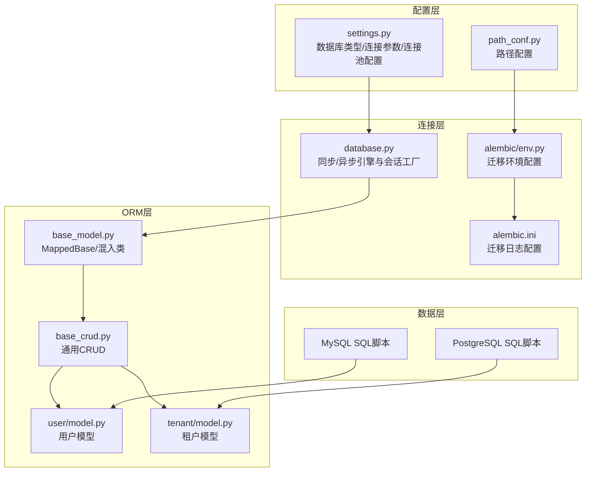
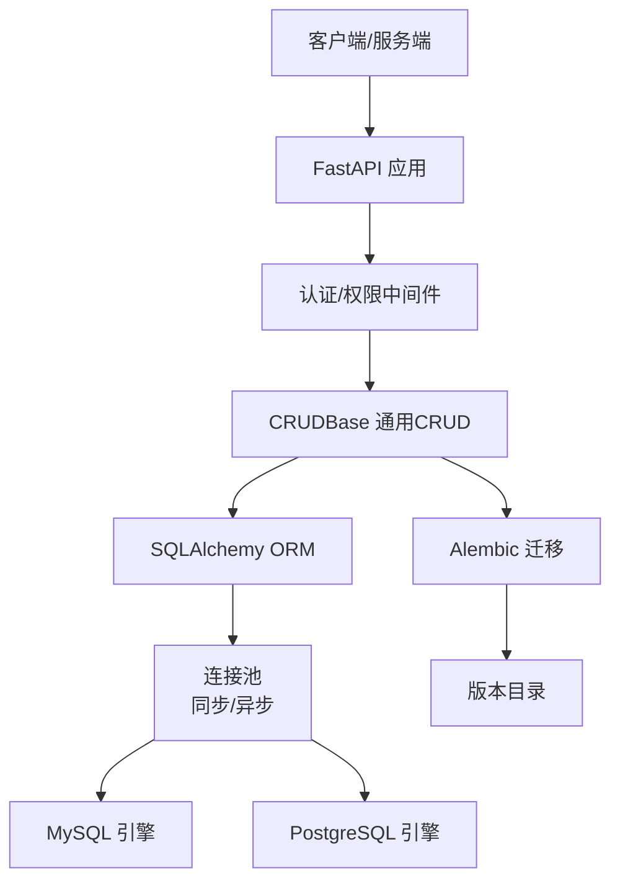
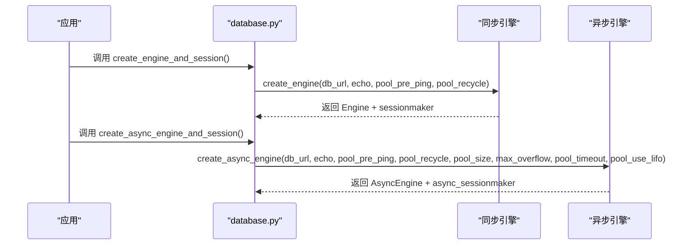
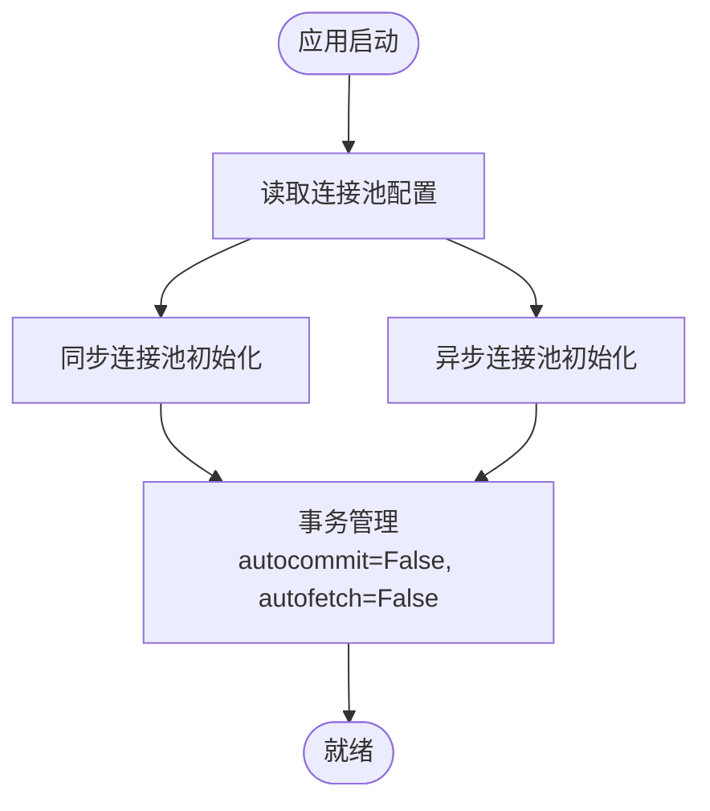
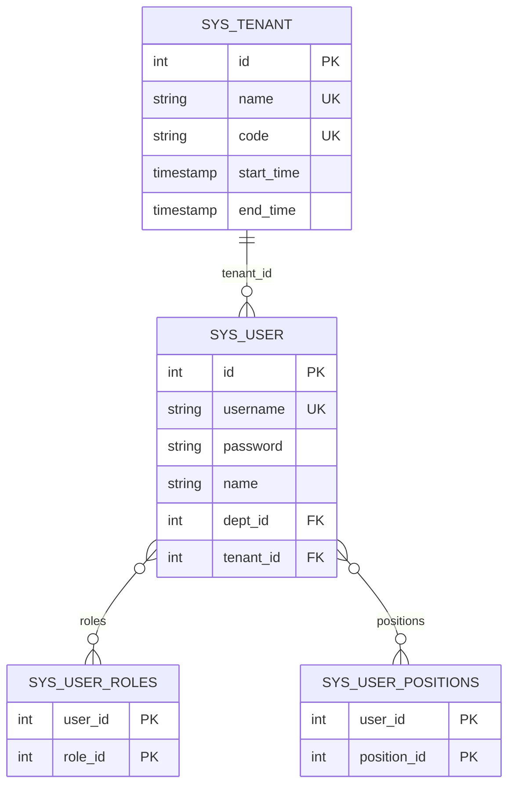
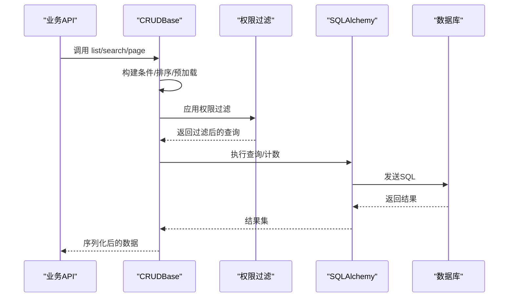
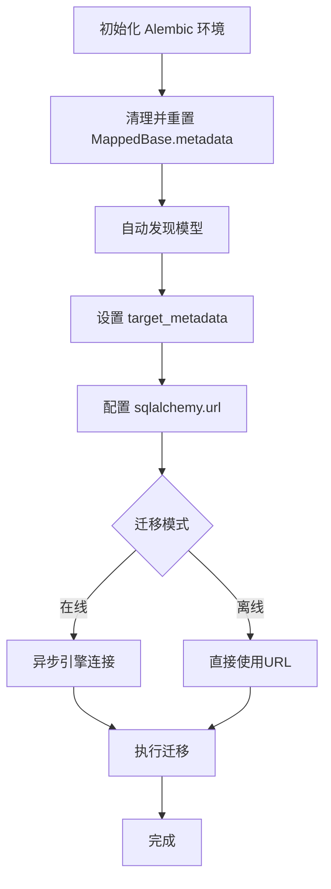
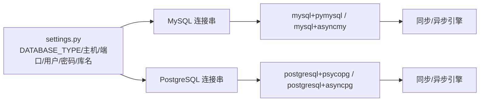
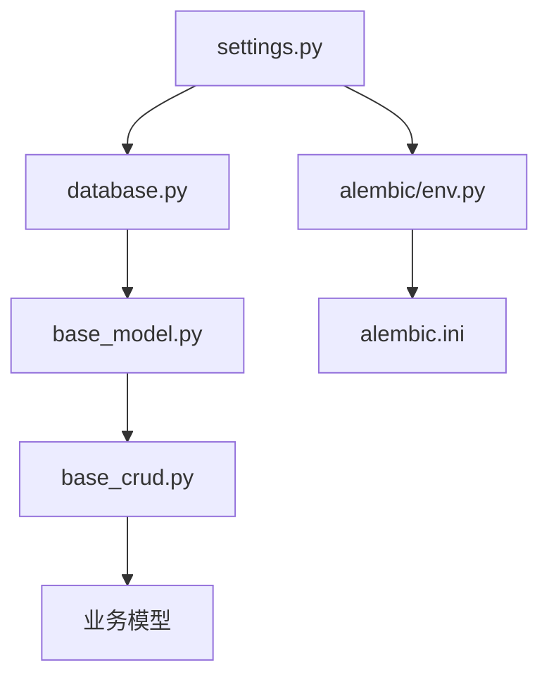

# 数据库架构设计

<cite>
**本文档引用的文件**
- [database.py](file://backend/app/core/database.py)
- [setting.py](file://backend/app/config/setting.py)
- [base_model.py](file://backend/app/core/base_model.py)
- [base_crud.py](file://backend/app/core/base_crud.py)
- [env.py](file://backend/app/alembic/env.py)
- [alembic.ini](file://backend/alembic.ini)
- [fastapiadmin_2026-04-19_223353.sql](file://backend/sql/mysql/fastapiadmin_2026-04-19_223353.sql)
- [fastapiadmin_2026-04-19_224727.sql](file://backend/sql/postgres/fastapiadmin_2026-04-19_224727.sql)
- [model.py](file://backend/app/api/v1/module_system/user/model.py)
- [model.py](file://backend/app/api/v1/module_system/tenant/model.py)
- [path_conf.py](file://backend/app/config/path_conf.py)
</cite>

## 目录
1. [引言](#引言)
2. [项目结构](#项目结构)
3. [核心组件](#核心组件)
4. [架构总览](#架构总览)
5. [详细组件分析](#详细组件分析)
6. [依赖关系分析](#依赖关系分析)
7. [性能考虑](#性能考虑)
8. [故障排除指南](#故障排除指南)
9. [结论](#结论)

## 引言

本文件为 FastapiAdmin 的数据库架构设计文档，重点阐述其双数据库（MySQL 与 PostgreSQL）支持的设计理念、连接池配置、事务管理策略、并发控制机制、多租户隔离策略、性能优化方案、监控与调优建议以及安全配置。文档旨在帮助开发者与运维人员全面理解系统的数据库层设计，并为后续扩展与维护提供参考。

## 项目结构

FastapiAdmin 的数据库相关代码集中在 backend/app/core 与 backend/app/config 目录中，配合 Alembic 迁移工具与 SQL 导出文件，形成完整的数据库生命周期管理：

- 配置与连接：settings.py 提供数据库类型、连接参数与连接池配置；database.py 负责创建同步与异步引擎及会话工厂。
- ORM 基类与混入：base_model.py 定义 MappedBase、ModelMixin、TenantMixin、UserMixin 等，统一模型字段与权限过滤策略。
- CRUD 基础：base_crud.py 提供通用的增删改查、分页、软删除、权限过滤等能力。
- 迁移与版本：alembic/env.py 与 alembic.ini 配合，支持异步迁移与版本控制。
- 数据模型：各模块模型（如用户、租户）继承上述混入，实现业务表结构与权限隔离。
- SQL 脚本：MySQL 与 PostgreSQL 的完整建表脚本，确保开发与生产环境一致性。

**图表来源**
- [setting.py:80-110](file://backend/app/config/setting.py#L80-L110)
- [database.py:19-110](file://backend/app/core/database.py#L19-L110)
- [env.py:14-50](file://backend/app/alembic/env.py#L14-L50)
- [alembic.ini:66-120](file://backend/alembic.ini#L66-L120)
- [base_model.py:21-228](file://backend/app/core/base_model.py#L21-L228)
- [base_crud.py:26-571](file://backend/app/core/base_crud.py#L26-L571)
- [model.py:64-151](file://backend/app/api/v1/module_system/user/model.py#L64-L151)
- [model.py:10-40](file://backend/app/api/v1/module_system/tenant/model.py#L10-L40)

**章节来源**
- [setting.py:80-110](file://backend/app/config/setting.py#L80-L110)
- [database.py:19-110](file://backend/app/core/database.py#L19-L110)
- [env.py:14-50](file://backend/app/alembic/env.py#L14-L50)
- [alembic.ini:66-120](file://backend/alembic.ini#L66-L120)
- [base_model.py:21-228](file://backend/app/core/base_model.py#L21-L228)
- [base_crud.py:26-571](file://backend/app/core/base_crud.py#L26-L571)
- [model.py:64-151](file://backend/app/api/v1/module_system/user/model.py#L64-L151)
- [model.py:10-40](file://backend/app/api/v1/module_system/tenant/model.py#L10-L40)

## 核心组件

- 数据库配置中心（settings.py）
  - 支持数据库类型切换：mysql、postgres、sqlite
  - 提供连接池参数：POOL_SIZE、MAX_OVERFLOW、POOL_TIMEOUT、POOL_RECYCLE、POOL_USE_LIFO、POOL_PRE_PING
  - 异步/同步连接串动态拼装，适配不同驱动
- 连接与会话工厂（database.py）
  - 同步引擎：create_engine + sessionmaker
  - 异步引擎：create_async_engine + async_sessionmaker，支持 LIFO 连接池与连接预检
  - 提供表创建/删除工具函数
- ORM 基类与混入（base_model.py）
  - MappedBase：声明式基类，兼容 SQLite、MySQL、PostgreSQL
  - ModelMixin：统一基础字段（id、uuid、状态、时间戳、软删除）
  - TenantMixin：租户字段与外键约束
  - UserMixin：审计字段 created_id/updated_id/deleted_id 及关联关系
- 通用 CRUD（base_crud.py）
  - 支持条件构建、排序、预加载、分页、软删除、批量更新/恢复
  - 内置权限过滤与二次验证，防止并发逃逸
- 迁移与版本（alembic）
  - 异步迁移环境，自动发现模型并生成迁移文件
  - 配置文件中设置 sqlalchemy.url 与日志级别

**章节来源**
- [setting.py:80-110](file://backend/app/config/setting.py#L80-L110)
- [database.py:19-110](file://backend/app/core/database.py#L19-L110)
- [base_model.py:21-228](file://backend/app/core/base_model.py#L21-L228)
- [base_crud.py:26-571](file://backend/app/core/base_crud.py#L26-L571)
- [env.py:40-137](file://backend/app/alembic/env.py#L40-L137)
- [alembic.ini:66-120](file://backend/alembic.ini#L66-L120)

## 架构总览

FastapiAdmin 的数据库架构采用“配置驱动 + ORM 混入 + 通用 CRUD + 异步迁移”的设计，支持 MySQL 与 PostgreSQL 双数据库后端，通过统一的连接池与权限过滤策略实现高性能与高可靠。

**图表来源**
- [database.py:19-110](file://backend/app/core/database.py#L19-L110)
- [base_crud.py:26-571](file://backend/app/core/base_crud.py#L26-L571)
- [env.py:83-137](file://backend/app/alembic/env.py#L83-L137)

## 详细组件分析

### 数据库连接与会话工厂

- 同步连接
  - 使用 create_engine 创建 Engine，结合 sessionmaker 构造会话工厂
  - 支持连接预检（pool_pre_ping）、回收（pool_recycle）与日志（echo）
- 异步连接
  - 使用 create_async_engine 创建 AsyncEngine，结合 async_sessionmaker
  - 针对不同数据库类型（mysql、postgres、sqlite）拼接不同的驱动连接串
  - 支持连接池参数：大小、溢出、超时、回收、LIFO 等
- 表管理
  - 提供 create_tables 与 drop_tables，基于 MappedBase.metadata

**图表来源**
- [database.py:19-110](file://backend/app/core/database.py#L19-L110)
- [setting.py:257-302](file://backend/app/config/setting.py#L257-L302)

**章节来源**
- [database.py:19-110](file://backend/app/core/database.py#L19-L110)
- [setting.py:257-302](file://backend/app/config/setting.py#L257-L302)

### 连接池配置与事务管理

- 连接池参数
  - 连接池大小（POOL_SIZE）、最大溢出（MAX_OVERFLOW）、超时（POOL_TIMEOUT）、回收（POOL_RECYCLE）
  - 连接预检（POOL_PRE_PING）与 LIFO（POOL_USE_LIFO）策略
- 事务管理
  - 默认自动提交关闭（AUTOCOMMIT=False），自动刷新关闭（AUTOFETCH=False）
  - 提交时不过期（EXPIRE_ON_COMMIT=False），遵循应用层显式提交/回滚
- 异步事务
  - 使用 async with async_engine.begin() 进入事务上下文，确保 begin/commit 正确释放

**图表来源**
- [setting.py:86-95](file://backend/app/config/setting.py#L86-L95)
- [database.py:19-110](file://backend/app/core/database.py#L19-L110)

**章节来源**
- [setting.py:86-95](file://backend/app/config/setting.py#L86-L95)
- [database.py:19-110](file://backend/app/core/database.py#L19-L110)

### 多租户架构与数据隔离

- 租户字段与外键
  - TenantMixin 在业务模型中注入 tenant_id 字段，并与 sys_tenant.id 建立外键约束
- 隔离策略
  - 平台超级管理员（is_superuser 且 tenant_id=1）在数据层不按租户过滤
  - 普通用户通过权限过滤器（Permission.filter_query）限制可见数据
- 关键表结构
  - sys_user：包含 dept_id、tenant_id、roles/positions 等关系
  - sys_tenant：唯一性约束 name/code，作为租户标识

**图表来源**
- [model.py:64-151](file://backend/app/api/v1/module_system/user/model.py#L64-L151)
- [model.py:10-40](file://backend/app/api/v1/module_system/tenant/model.py#L10-L40)
- [fastapiadmin_2026-04-19_223353.sql:758-797](file://backend/sql/mysql/fastapiadmin_2026-04-19_223353.sql#L758-L797)
- [fastapiadmin_2026-04-19_224727.sql:78-94](file://backend/sql/postgres/fastapiadmin_2026-04-19_224727.sql#L78-L94)

**章节来源**
- [base_model.py:128-146](file://backend/app/core/base_model.py#L128-L146)
- [model.py:64-151](file://backend/app/api/v1/module_system/user/model.py#L64-L151)
- [model.py:10-40](file://backend/app/api/v1/module_system/tenant/model.py#L10-L40)
- [fastapiadmin_2026-04-19_223353.sql:758-797](file://backend/sql/mysql/fastapiadmin_2026-04-19_223353.sql#L758-L797)
- [fastapiadmin_2026-04-19_224727.sql:78-94](file://backend/sql/postgres/fastapiadmin_2026-04-19_224727.sql#L78-L94)

### 通用 CRUD 与权限过滤

- 条件构建与排序
  - 支持多种比较操作符（等于、不等于、大于、小于、模糊、区间、IN、空值判断）
  - 默认追加软删除过滤（is_deleted=False）
- 预加载策略
  - 使用 selectinload 避免异步环境中的 MissingGreenlet 错误
  - 支持模型默认加载选项与运行时传入选项合并
- 权限过滤与二次验证
  - 通过 Permission.filter_query 对查询进行数据权限过滤
  - 更新后二次验证对象仍处于权限范围内，防止并发逃逸
- 分页与计数优化
  - 使用主键列计数替代全表扫描，提升大数据量场景性能

**图表来源**
- [base_crud.py:72-214](file://backend/app/core/base_crud.py#L72-L214)
- [base_crud.py:446-451](file://backend/app/core/base_crud.py#L446-L451)

**章节来源**
- [base_crud.py:72-214](file://backend/app/core/base_crud.py#L72-L214)
- [base_crud.py:446-451](file://backend/app/core/base_crud.py#L446-L451)

### Alembic 迁移与版本控制

- 迁移环境
  - 自动清理并重置 MappedBase.metadata，避免重复注册
  - 动态发现模型并设置 target_metadata
  - 通过 settings.ASYNC_DB_URI 注入迁移连接串
- 在线/离线迁移
  - 在线模式使用异步引擎建立连接，逐次迁移
  - 离线模式直接使用 URL 执行迁移
- 自动检测变更
  - 比较升级操作集，若为空则不生成迁移文件

**图表来源**
- [env.py:14-137](file://backend/app/alembic/env.py#L14-L137)
- [alembic.ini:66-120](file://backend/alembic.ini#L66-L120)

**章节来源**
- [env.py:14-137](file://backend/app/alembic/env.py#L14-L137)
- [alembic.ini:66-120](file://backend/alembic.ini#L66-L120)

### 双数据库支持（MySQL 与 PostgreSQL）

- 连接串拼装
  - MySQL：mysql+pymysql 或 mysql+asyncmy（异步）
  - PostgreSQL：postgresql+psycopg 或 postgresql+asyncpg（异步）
  - SQLite：sqlite+aiosqlite（异步）
- SQL 脚本
  - MySQL 脚本包含大量索引与外键约束，适合 InnoDB 引擎
  - PostgreSQL 脚本包含 schema（如 ai）与 JSON/JSONB 类型，适合复杂查询与扩展

**图表来源**
- [setting.py:257-302](file://backend/app/config/setting.py#L257-L302)
- [fastapiadmin_2026-04-19_223353.sql:1-100](file://backend/sql/mysql/fastapiadmin_2026-04-19_223353.sql#L1-L100)
- [fastapiadmin_2026-04-19_224727.sql:23-47](file://backend/sql/postgres/fastapiadmin_2026-04-19_224727.sql#L23-L47)

**章节来源**
- [setting.py:257-302](file://backend/app/config/setting.py#L257-L302)
- [fastapiadmin_2026-04-19_223353.sql:1-100](file://backend/sql/mysql/fastapiadmin_2026-04-19_223353.sql#L1-L100)
- [fastapiadmin_2026-04-19_224727.sql:23-47](file://backend/sql/postgres/fastapiadmin_2026-04-19_224727.sql#L23-L47)

## 依赖关系分析

- 组件耦合
  - settings.py 为全局配置中心，被 database.py、alembic/env.py、模型定义广泛依赖
  - base_model.py 为所有业务模型的抽象基类，耦合度低但影响面广
  - base_crud.py 依赖权限模块与数据库会话，提供通用能力
- 外部依赖
  - SQLAlchemy（同步/异步）、Alembic（迁移）、数据库驱动（pymysql/asyncmy、psycopg/asyncpg、aiosqlite）
- 循环依赖规避
  - 通过 TYPE_CHECKING 与延迟导入避免模型间的循环依赖

**图表来源**
- [setting.py:13-355](file://backend/app/config/setting.py#L13-L355)
- [database.py:13-17](file://backend/app/core/database.py#L13-L17)
- [env.py:9-12](file://backend/app/alembic/env.py#L9-L12)
- [base_model.py:21-34](file://backend/app/core/base_model.py#L21-L34)
- [base_crud.py:12-16](file://backend/app/core/base_crud.py#L12-L16)

**章节来源**
- [setting.py:13-355](file://backend/app/config/setting.py#L13-L355)
- [database.py:13-17](file://backend/app/core/database.py#L13-L17)
- [env.py:9-12](file://backend/app/alembic/env.py#L9-L12)
- [base_model.py:21-34](file://backend/app/core/base_model.py#L21-L34)
- [base_crud.py:12-16](file://backend/app/core/base_crud.py#L12-L16)

## 性能考虑

- 连接复用与池化
  - 合理设置 POOL_SIZE 与 MAX_OVERFLOW，避免连接不足或过度溢出
  - 启用 POOL_PRE_PING 与 POOL_RECYCLE，提升连接可用性与稳定性
- 查询优化
  - 使用 selectinload 预加载，减少 N+1 查询
  - 分页查询使用主键计数，避免全表扫描
  - 为高频查询字段建立索引（如 created_time、updated_time、uuid、tenant_id 等）
- 事务与并发
  - 显式事务边界，避免长时间持有连接
  - 更新后二次验证，降低并发冲突风险
- 异步优势
  - 异步连接池与非阻塞 I/O 提升高并发场景吞吐
- 监控与调优
  - 开启 DATABASE_ECHO/ECHO_POOL 观察 SQL 与连接池行为
  - 使用慢查询日志与数据库性能分析工具定位瓶颈

[本节为通用指导，无需特定文件引用]

## 故障排除指南

- 连接失败
  - 检查 DATABASE_TYPE 与连接串拼装是否正确
  - 确认 POOL_SIZE/MAX_OVERFLOW/POOL_TIMEOUT 配置合理
- 迁移问题
  - 确认 alembic.ini 中 sqlalchemy.url 已正确设置
  - 若未检测到变更，检查模型定义与 MappedBase.metadata
- 权限过滤异常
  - 确认用户角色与数据范围（data_scope）配置
  - 检查软删除字段 is_deleted 是否被正确过滤
- 异步加载错误
  - 确保使用 selectinload 替代默认延迟加载
  - 避免在异步环境中使用 join/raise 等不兼容策略

**章节来源**
- [database.py:19-110](file://backend/app/core/database.py#L19-L110)
- [env.py:53-137](file://backend/app/alembic/env.py#L53-L137)
- [base_crud.py:446-451](file://backend/app/core/base_crud.py#L446-L451)

## 结论

FastapiAdmin 的数据库架构以配置为中心、以 ORM 混入为基础、以通用 CRUD 为核心、以异步迁移为保障，实现了对 MySQL 与 PostgreSQL 的双后端支持。通过完善的连接池配置、权限过滤与并发控制策略，系统在保证数据隔离与安全性的同时，兼顾了性能与可维护性。建议在生产环境中结合监控与性能分析工具持续优化连接池参数与查询计划，确保系统稳定高效运行。