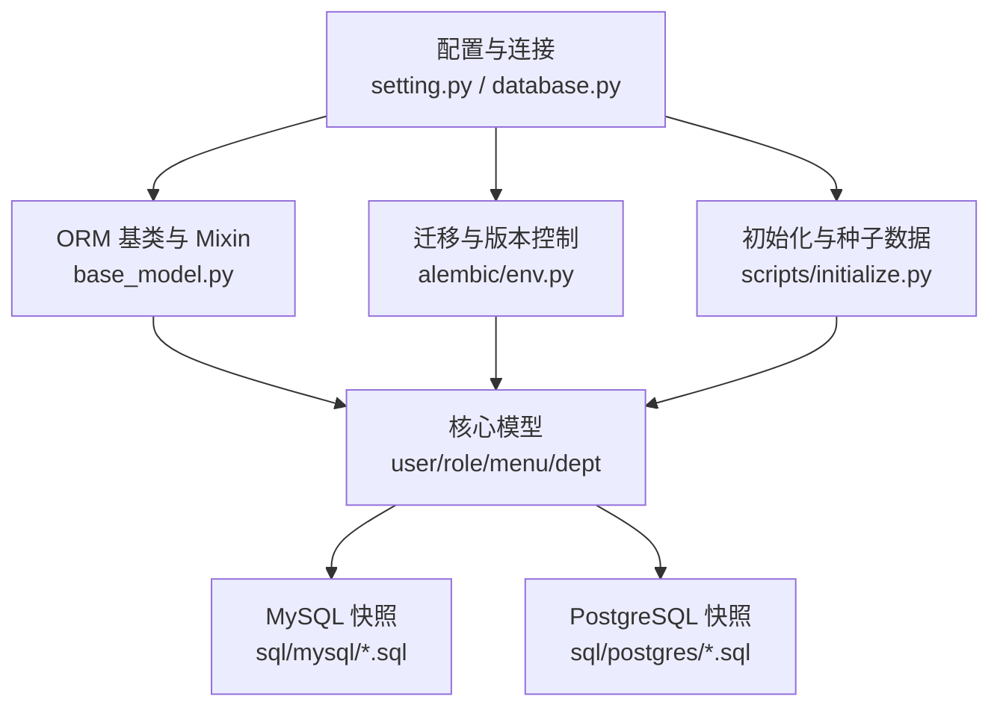
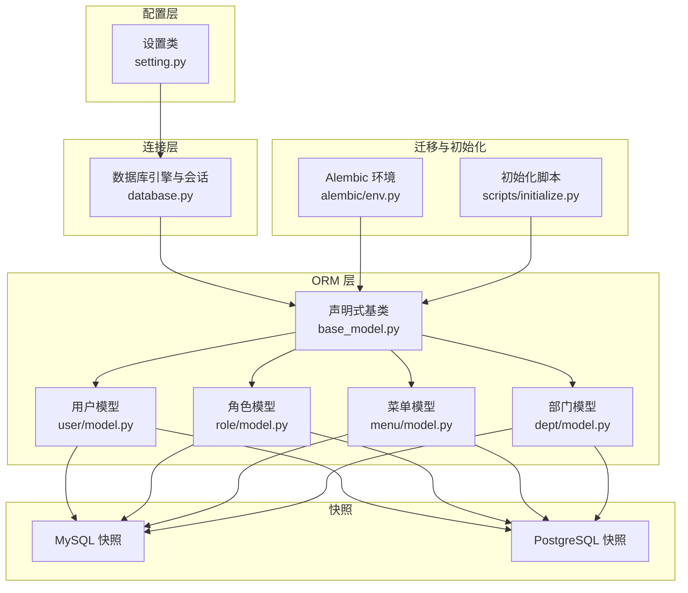
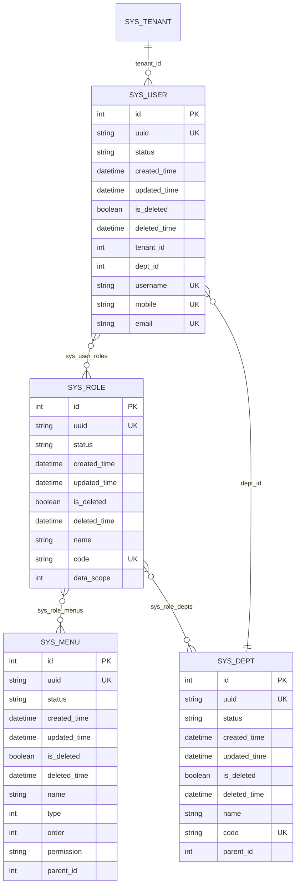
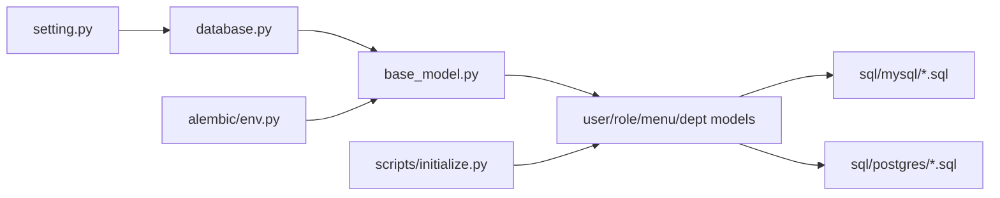

# 数据库设计

<cite>
**本文引用的文件**
- [backend/app/core/database.py](file://backend/app/core/database.py)
- [backend/app/config/setting.py](file://backend/app/config/setting.py)
- [backend/app/core/base_model.py](file://backend/app/core/base_model.py)
- [backend/app/alembic/env.py](file://backend/app/alembic/env.py)
- [backend/app/scripts/initialize.py](file://backend/app/scripts/initialize.py)
- [backend/sql/mysql/fastapiadmin_2026-04-19_223353.sql](file://backend/sql/mysql/fastapiadmin_2026-04-19_223353.sql)
- [backend/sql/postgres/fastapiadmin_2026-04-19_224727.sql](file://backend/sql/postgres/fastapiadmin_2026-04-19_224727.sql)
- [backend/app/api/v1/module_system/user/model.py](file://backend/app/api/v1/module_system/user/model.py)
- [backend/app/api/v1/module_system/role/model.py](file://backend/app/api/v1/module_system/role/model.py)
- [backend/app/api/v1/module_system/menu/model.py](file://backend/app/api/v1/module_system/menu/model.py)
- [backend/app/api/v1/module_system/dept/model.py](file://backend/app/api/v1/module_system/dept/model.py)
</cite>

## 目录
1. [简介](#简介)
2. [项目结构](#项目结构)
3. [核心组件](#核心组件)
4. [架构总览](#架构总览)
5. [详细组件分析](#详细组件分析)
6. [依赖分析](#依赖分析)
7. [性能考虑](#性能考虑)
8. [故障排查指南](#故障排查指南)
9. [结论](#结论)
10. [附录](#附录)

## 简介
本文件为 FastapiAdmin 的数据库设计文档，聚焦于数据库架构、表结构、索引与约束策略，系统性梳理用户、角色、菜单、部门等核心实体的关系设计，并给出数据库迁移管理（Alembic）、数据访问层（SQLAlchemy ORM）设计、备份恢复策略、性能监控与维护计划，以及多数据库支持（MySQL、PostgreSQL）的实现与差异。

## 项目结构
数据库相关的核心位置与职责如下：
- 配置与连接
  - 数据库连接配置与引擎创建：[backend/app/config/setting.py](file://backend/app/config/setting.py)，[backend/app/core/database.py](file://backend/app/core/database.py)
- ORM 基类与通用 Mixin
  - 声明式基类与通用字段：[backend/app/core/base_model.py](file://backend/app/core/base_model.py)
- 迁移与版本控制
  - Alembic 环境配置与自动化扫描：[backend/app/alembic/env.py](file://backend/app/alembic/env.py)
- 初始化与种子数据
  - 建表与导入基础数据：[backend/app/scripts/initialize.py](file://backend/app/scripts/initialize.py)
- 结构与数据快照
  - MySQL 结构与数据快照：[backend/sql/mysql/fastapiadmin_2026-04-19_223353.sql](file://backend/sql/mysql/fastapiadmin_2026-04-19_223353.sql)
  - PostgreSQL 结构与数据快照：[backend/sql/postgres/fastapiadmin_2026-04-19_224727.sql](file://backend/sql/postgres/fastapiadmin_2026-04-19_224727.sql)
- 核心模型
  - 用户、角色、菜单、部门模型：[backend/app/api/v1/module_system/user/model.py](file://backend/app/api/v1/module_system/user/model.py)，[backend/app/api/v1/module_system/role/model.py](file://backend/app/api/v1/module_system/role/model.py)，[backend/app/api/v1/module_system/menu/model.py](file://backend/app/api/v1/module_system/menu/model.py)，[backend/app/api/v1/module_system/dept/model.py](file://backend/app/api/v1/module_system/dept/model.py)

图表来源
- [backend/app/config/setting.py:80-110](file://backend/app/config/setting.py#L80-L110)
- [backend/app/core/database.py:19-110](file://backend/app/core/database.py#L19-L110)
- [backend/app/core/base_model.py:21-228](file://backend/app/core/base_model.py#L21-L228)
- [backend/app/alembic/env.py:14-44](file://backend/app/alembic/env.py#L14-L44)
- [backend/app/scripts/initialize.py:21-42](file://backend/app/scripts/initialize.py#L21-L42)
- [backend/sql/mysql/fastapiadmin_2026-04-19_223353.sql:1-120](file://backend/sql/mysql/fastapiadmin_2026-04-19_223353.sql#L1-L120)
- [backend/sql/postgres/fastapiadmin_2026-04-19_224727.sql:1-120](file://backend/sql/postgres/fastapiadmin_2026-04-19_224727.sql#L1-L120)

章节来源
- [backend/app/config/setting.py:80-110](file://backend/app/config/setting.py#L80-L110)
- [backend/app/core/database.py:19-110](file://backend/app/core/database.py#L19-L110)
- [backend/app/core/base_model.py:21-228](file://backend/app/core/base_model.py#L21-L228)
- [backend/app/alembic/env.py:14-44](file://backend/app/alembic/env.py#L14-L44)
- [backend/app/scripts/initialize.py:21-42](file://backend/app/scripts/initialize.py#L21-L42)
- [backend/sql/mysql/fastapiadmin_2026-04-19_223353.sql:1-120](file://backend/sql/mysql/fastapiadmin_2026-04-19_223353.sql#L1-L120)
- [backend/sql/postgres/fastapiadmin_2026-04-19_224727.sql:1-120](file://backend/sql/postgres/fastapiadmin_2026-04-19_224727.sql#L1-L120)

## 核心组件
- 数据库连接与引擎
  - 支持同步与异步连接，统一通过配置类生成连接字符串，支持 MySQL、PostgreSQL、SQLite。
  - 连接池参数、预检、回收等参数集中配置，确保稳定性与性能。
- ORM 基类与 Mixin
  - MappedBase：声明式基类，兼容 SQLite/MySQL/PostgreSQL。
  - ModelMixin：提供统一的业务字段（id、uuid、状态、时间戳、软删等）与索引。
  - TenantMixin：提供租户隔离字段与外键约束。
  - UserMixin：提供审计字段 created_id/updated_id/deleted_id 及其关联关系。
- 迁移与版本控制
  - Alembic 环境自动扫描模型，生成迁移脚本；支持离线与在线迁移。
- 初始化与种子数据
  - 按依赖顺序建表，再导入基础数据（菜单、部门、角色、字典、参数、岗位、用户、用户角色等）。

章节来源
- [backend/app/config/setting.py:257-302](file://backend/app/config/setting.py#L257-L302)
- [backend/app/core/database.py:19-110](file://backend/app/core/database.py#L19-L110)
- [backend/app/core/base_model.py:21-228](file://backend/app/core/base_model.py#L21-L228)
- [backend/app/alembic/env.py:26-44](file://backend/app/alembic/env.py#L26-L44)
- [backend/app/scripts/initialize.py:21-42](file://backend/app/scripts/initialize.py#L21-L42)

## 架构总览
数据库层整体采用“配置驱动 + ORM 基类 + Alembic 迁移”的架构，配合初始化脚本完成表结构与种子数据的快速落地。

图表来源
- [backend/app/config/setting.py:257-302](file://backend/app/config/setting.py#L257-L302)
- [backend/app/core/database.py:19-110](file://backend/app/core/database.py#L19-L110)
- [backend/app/core/base_model.py:21-228](file://backend/app/core/base_model.py#L21-L228)
- [backend/app/alembic/env.py:44-50](file://backend/app/alembic/env.py#L44-L50)
- [backend/app/scripts/initialize.py:44-58](file://backend/app/scripts/initialize.py#L44-L58)
- [backend/sql/mysql/fastapiadmin_2026-04-19_223353.sql:306-340](file://backend/sql/mysql/fastapiadmin_2026-04-19_223353.sql#L306-L340)
- [backend/sql/postgres/fastapiadmin_2026-04-19_224727.sql:76-120](file://backend/sql/postgres/fastapiadmin_2026-04-19_224727.sql#L76-L120)

## 详细组件分析

### 数据库连接与配置
- 连接类型与驱动
  - 异步驱动：mysql+asyncmy、postgresql+asyncpg、sqlite+aiosqlite
  - 同步驱动：mysql+pymysql、postgresql+psycopg、sqlite
- 连接池与性能参数
  - 连接池大小、最大溢出、超时、回收、预检、LIFO 等参数集中配置，适配高并发场景。
- 运行时开关
  - SQL_DB_ENABLE 控制是否启用数据库；REDIS_ENABLE 控制 Redis 连接。

章节来源
- [backend/app/config/setting.py:80-110](file://backend/app/config/setting.py#L80-L110)
- [backend/app/config/setting.py:257-302](file://backend/app/config/setting.py#L257-L302)
- [backend/app/core/database.py:19-110](file://backend/app/core/database.py#L19-L110)

### ORM 基类与通用 Mixin
- MappedBase
  - 统一的声明式基类，兼容多种数据库后端。
- ModelMixin
  - 统一业务字段：id、uuid、status、description、created_time、updated_time、is_deleted、deleted_time，并建立常用索引。
- TenantMixin
  - 提供 tenant_id 字段与外键约束，实现租户级数据隔离。
- UserMixin
  - 提供 created_id/updated_id/deleted_id 与关联关系 created_by/updated_by/deleted_by，支持“仅本人”数据权限。

章节来源
- [backend/app/core/base_model.py:21-228](file://backend/app/core/base_model.py#L21-L228)

### 核心数据模型与关系设计

#### 用户模型（sys_user）
- 关键字段
  - 用户名、密码哈希、昵称、手机号、邮箱、性别、头像、是否超管、最后登录时间、第三方登录标识等。
- 关系
  - 多对多：角色（sys_user_roles）
  - 多对多：岗位（sys_user_positions）
  - 多对一：部门（sys_dept）
  - 审计字段：created_id/updated_id/deleted_id 关联 sys_user
- 索引
  - username、mobile、email 唯一键，uuid、status、created_time、updated_time、is_deleted 等索引。

章节来源
- [backend/app/api/v1/module_system/user/model.py:64-151](file://backend/app/api/v1/module_system/user/model.py#L64-L151)

#### 角色模型（sys_role）
- 关键字段
  - 角色名称、编码、排序、数据权限范围（1-5）。
- 关系
  - 多对多：菜单（sys_role_menus）
  - 多对多：部门（sys_role_depts）
  - 多对多：用户（sys_user_roles）
- 索引
  - code 唯一键，status、created_time、updated_time、is_deleted 等索引。

章节来源
- [backend/app/api/v1/module_system/role/model.py:64-100](file://backend/app/api/v1/module_system/role/model.py#L64-L100)

#### 菜单模型（sys_menu）
- 关键字段
  - 名称、类型（目录/菜单/按钮/链接）、排序、权限标识、图标、路由信息、参数、是否隐藏/缓存/始终显示/固定标签页等。
- 关系
  - 树形父子关系（parent_id → sys_menu）
  - 多对多：角色（sys_role_menus）
- 索引
  - parent_id、status、created_time、updated_time、is_deleted 等索引。

章节来源
- [backend/app/api/v1/module_system/menu/model.py:13-103](file://backend/app/api/v1/module_system/menu/model.py#L13-L103)

#### 部门模型（sys_dept）
- 关键字段
  - 名称、排序、编码、负责人、电话、邮箱。
- 关系
  - 树形父子关系（parent_id → sys_dept）
  - 多对多：角色（sys_role_depts）
  - 一对多：用户（UserModel.dept_id → sys_dept.id）
- 索引
  - code 唯一键，parent_id、status、created_time、updated_time、is_deleted 等索引。

章节来源
- [backend/app/api/v1/module_system/dept/model.py:14-59](file://backend/app/api/v1/module_system/dept/model.py#L14-L59)

图表来源
- [backend/app/api/v1/module_system/user/model.py:64-151](file://backend/app/api/v1/module_system/user/model.py#L64-L151)
- [backend/app/api/v1/module_system/role/model.py:64-100](file://backend/app/api/v1/module_system/role/model.py#L64-L100)
- [backend/app/api/v1/module_system/menu/model.py:13-103](file://backend/app/api/v1/module_system/menu/model.py#L13-L103)
- [backend/app/api/v1/module_system/dept/model.py:14-59](file://backend/app/api/v1/module_system/dept/model.py#L14-L59)

### 数据访问层设计（SQLAlchemy ORM）
- 基类与字段
  - 统一使用 mapped_column 定义字段，配合注释与索引，保证跨数据库一致性。
- 关系与懒加载
  - 使用 selectin 预加载策略减少 N+1 查询；树形关系（菜单、部门）使用自引用外键与 back_populates。
- 审计与租户
  - 通过 Mixin 自动注入审计字段与租户字段，简化权限控制与数据隔离。

章节来源
- [backend/app/core/base_model.py:40-228](file://backend/app/core/base_model.py#L40-L228)
- [backend/app/api/v1/module_system/user/model.py:64-151](file://backend/app/api/v1/module_system/user/model.py#L64-L151)
- [backend/app/api/v1/module_system/role/model.py:64-100](file://backend/app/api/v1/module_system/role/model.py#L64-L100)
- [backend/app/api/v1/module_system/menu/model.py:13-103](file://backend/app/api/v1/module_system/menu/model.py#L13-L103)
- [backend/app/api/v1/module_system/dept/model.py:14-59](file://backend/app/api/v1/module_system/dept/model.py#L14-L59)

### 数据库迁移管理（Alembic）
- 自动发现模型
  - 环境脚本扫描 MappedBase 下的所有模型，生成迁移元数据。
- 在线/离线迁移
  - 在线模式通过异步引擎连接数据库执行迁移；离线模式直接输出 SQL。
- 迁移生成策略
  - 当检测到模型变更时生成迁移文件；若无变更则不生成。

章节来源
- [backend/app/alembic/env.py:26-44](file://backend/app/alembic/env.py#L26-L44)
- [backend/app/alembic/env.py:83-137](file://backend/app/alembic/env.py#L83-L137)

### 初始化与种子数据
- 建表顺序
  - 按依赖关系排序：租户、菜单、参数、部门、角色、字典类型、字典数据、岗位、用户、用户角色。
- 数据导入
  - 逐表检查是否已有数据，避免重复；特殊处理带 children 的菜单与部门；字典数据根据 dict_type 映射填充 dict_type_id。
- 事务与错误处理
  - 使用异步会话与事务包裹，异常时回滚并记录日志。

章节来源
- [backend/app/scripts/initialize.py:21-42](file://backend/app/scripts/initialize.py#L21-L42)
- [backend/app/scripts/initialize.py:59-122](file://backend/app/scripts/initialize.py#L59-L122)
- [backend/app/scripts/initialize.py:185-199](file://backend/app/scripts/initialize.py#L185-L199)

### 多数据库支持（MySQL 与 PostgreSQL）
- 连接字符串差异
  - MySQL：异步驱动为 asyncmy，同步驱动为 pymysql；字符集 utf8mb4。
  - PostgreSQL：异步驱动为 asyncpg，同步驱动为 psycopg；JSON 类型使用 json。
- 表结构差异
  - 字段类型：MySQL 使用 tinyint/varchar/date/datetime/json/text，PostgreSQL 使用 boolean/character varying/date/timestamp without time zone/json/jsonb/text。
  - 序列：PostgreSQL 使用序列（如 app_portal_id_seq），MySQL 使用 AUTO_INCREMENT。
  - 注释：MySQL 使用 COMMENT，PostgreSQL 使用 COMMENT ON COLUMN。
- 快照对比
  - 两份快照均包含相同业务表（sys_user、sys_role、sys_menu、sys_dept、sys_tenant 等）与关联表，差异体现在字段类型与注释语法。

章节来源
- [backend/app/config/setting.py:257-302](file://backend/app/config/setting.py#L257-L302)
- [backend/sql/mysql/fastapiadmin_2026-04-19_223353.sql:25-58](file://backend/sql/mysql/fastapiadmin_2026-04-19_223353.sql#L25-L58)
- [backend/sql/postgres/fastapiadmin_2026-04-19_224727.sql:78-120](file://backend/sql/postgres/fastapiadmin_2026-04-19_224727.sql#L78-L120)

## 依赖分析
- 组件耦合
  - 配置类驱动连接层，连接层驱动 ORM 基类，模型依赖基类与 Mixin。
  - Alembic 依赖 ORM 元数据进行迁移；初始化脚本依赖模型与数据文件。
- 外部依赖
  - SQLAlchemy（2.x 异步）、Alembic、asyncmy/asyncpg（异步驱动）、pymysql/psycopg（同步驱动）。
- 循环依赖规避
  - 使用 TYPE_CHECKING 与延迟关系定义，避免模型间循环导入。

图表来源
- [backend/app/config/setting.py:257-302](file://backend/app/config/setting.py#L257-L302)
- [backend/app/core/database.py:19-110](file://backend/app/core/database.py#L19-L110)
- [backend/app/core/base_model.py:21-228](file://backend/app/core/base_model.py#L21-L228)
- [backend/app/alembic/env.py:44-50](file://backend/app/alembic/env.py#L44-L50)
- [backend/app/scripts/initialize.py:44-58](file://backend/app/scripts/initialize.py#L44-L58)
- [backend/sql/mysql/fastapiadmin_2026-04-19_223353.sql:306-340](file://backend/sql/mysql/fastapiadmin_2026-04-19_223353.sql#L306-L340)
- [backend/sql/postgres/fastapiadmin_2026-04-19_224727.sql:76-120](file://backend/sql/postgres/fastapiadmin_2026-04-19_224727.sql#L76-L120)

章节来源
- [backend/app/config/setting.py:257-302](file://backend/app/config/setting.py#L257-L302)
- [backend/app/core/database.py:19-110](file://backend/app/core/database.py#L19-L110)
- [backend/app/core/base_model.py:21-228](file://backend/app/core/base_model.py#L21-L228)
- [backend/app/alembic/env.py:44-50](file://backend/app/alembic/env.py#L44-L50)
- [backend/app/scripts/initialize.py:44-58](file://backend/app/scripts/initialize.py#L44-L58)

## 性能考虑
- 连接池与预检
  - 启用 pool_pre_ping，定期校验连接有效性，降低断连风险。
  - 设置合理的 pool_size、max_overflow、pool_timeout，平衡吞吐与资源占用。
- 查询优化
  - 为高频过滤字段（status、is_deleted、created_time、updated_time、parent_id 等）建立索引。
  - 使用 selectin 预加载多对多关系，减少 N+1 查询。
  - 树形结构（菜单、部门）使用自引用外键与索引，避免深度查询导致的性能问题。
- 写入与事务
  - 批量写入使用 session.add_all + flush，减少往返次数。
  - 事务包裹初始化流程，失败回滚，避免部分数据污染。

章节来源
- [backend/app/config/setting.py:80-110](file://backend/app/config/setting.py#L80-L110)
- [backend/app/core/base_model.py:40-228](file://backend/app/core/base_model.py#L40-L228)
- [backend/app/scripts/initialize.py:115-122](file://backend/app/scripts/initialize.py#L115-L122)

## 故障排查指南
- 连接失败
  - 检查 SQL_DB_ENABLE 开关与数据库连接字符串；确认驱动与主机/端口/凭据正确。
- 迁移失败
  - 确认 Alembic URL 与 settings.ASYNC_DB_URI 一致；检查模型变更是否被正确识别。
- 初始化失败
  - 查看日志中“表结构初始化失败/数据初始化失败”提示，定位具体表与异常原因。
- 数据隔离与权限
  - 检查用户 created_id/updated_id 与角色 data_scope 配置，确认是否符合预期的数据权限策略。

章节来源
- [backend/app/core/database.py:31-50](file://backend/app/core/database.py#L31-L50)
- [backend/app/alembic/env.py:67-80](file://backend/app/alembic/env.py#L67-L80)
- [backend/app/scripts/initialize.py:52-58](file://backend/app/scripts/initialize.py#L52-L58)

## 结论
本设计以配置驱动为核心，结合统一的 ORM 基类与 Mixin，实现了用户、角色、菜单、部门等系统管理实体的一致化建模与跨数据库兼容。借助 Alembic 的自动化迁移与初始化脚本，能够高效完成表结构与种子数据的部署。通过索引、预加载与连接池等手段，兼顾了性能与稳定性。建议在生产环境中持续完善监控与备份策略，并根据业务演进迭代模型与迁移方案。

## 附录
- 快照文件概览
  - MySQL 快照包含业务表与关联表，字段类型与注释遵循 MySQL 语法。
  - PostgreSQL 快照包含相同业务表，字段类型与注释遵循 PostgreSQL 语法。
- 建议的维护清单
  - 定期备份：全量/增量备份策略，保留至少 7 天历史。
  - 监控指标：连接池利用率、慢查询、锁等待、表膨胀。
  - 迁移规范：每次模型变更必须生成迁移并测试；禁止手工修改生产库结构。

章节来源
- [backend/sql/mysql/fastapiadmin_2026-04-19_223353.sql:306-340](file://backend/sql/mysql/fastapiadmin_2026-04-19_223353.sql#L306-L340)
- [backend/sql/postgres/fastapiadmin_2026-04-19_224727.sql:76-120](file://backend/sql/postgres/fastapiadmin_2026-04-19_224727.sql#L76-L120)