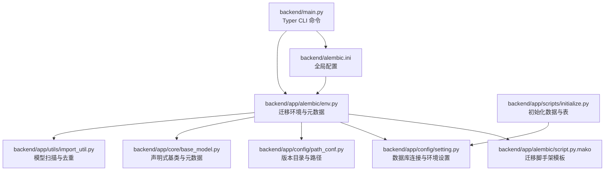
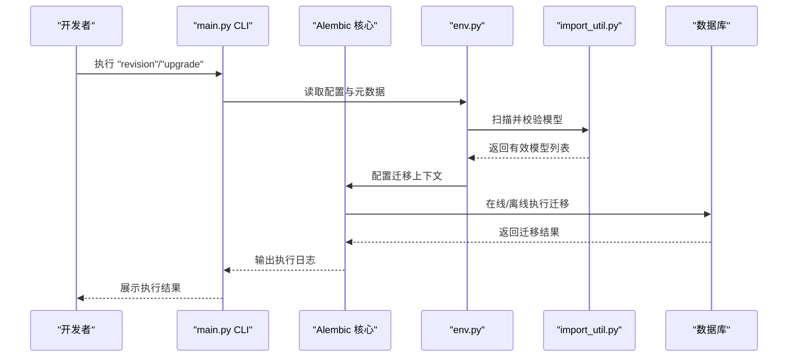
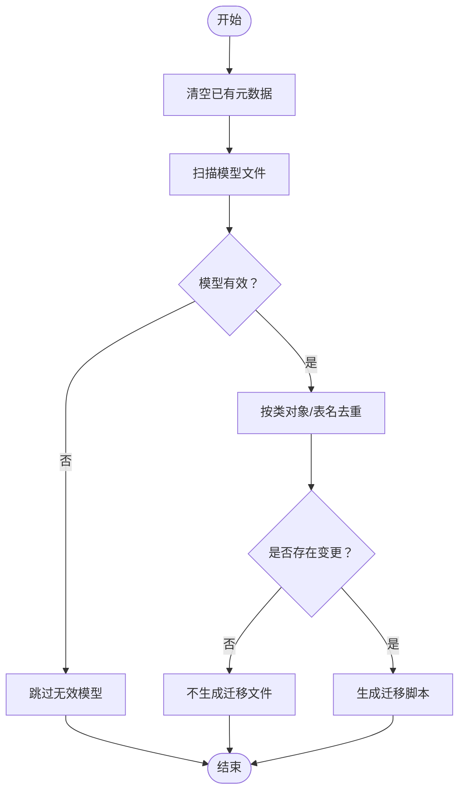
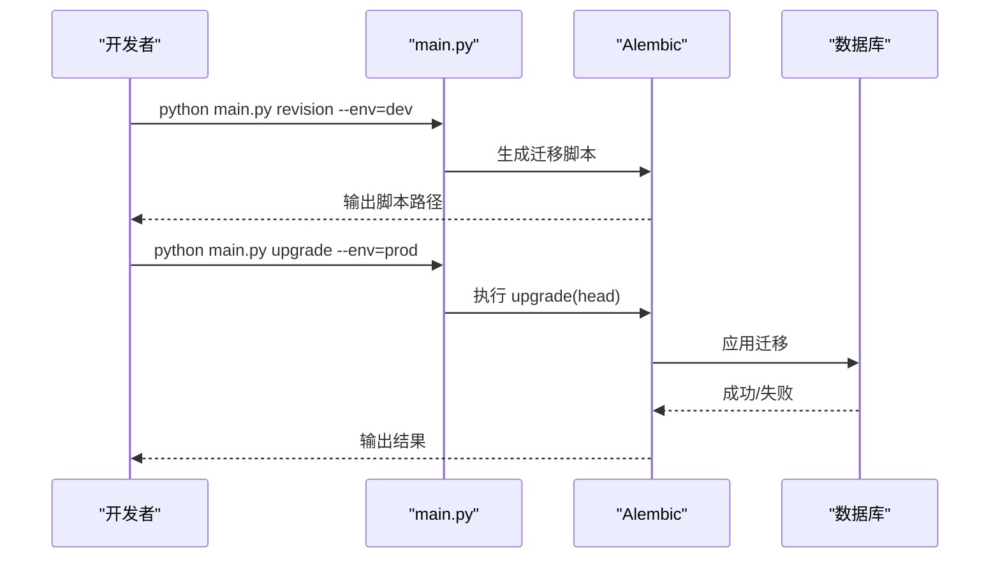
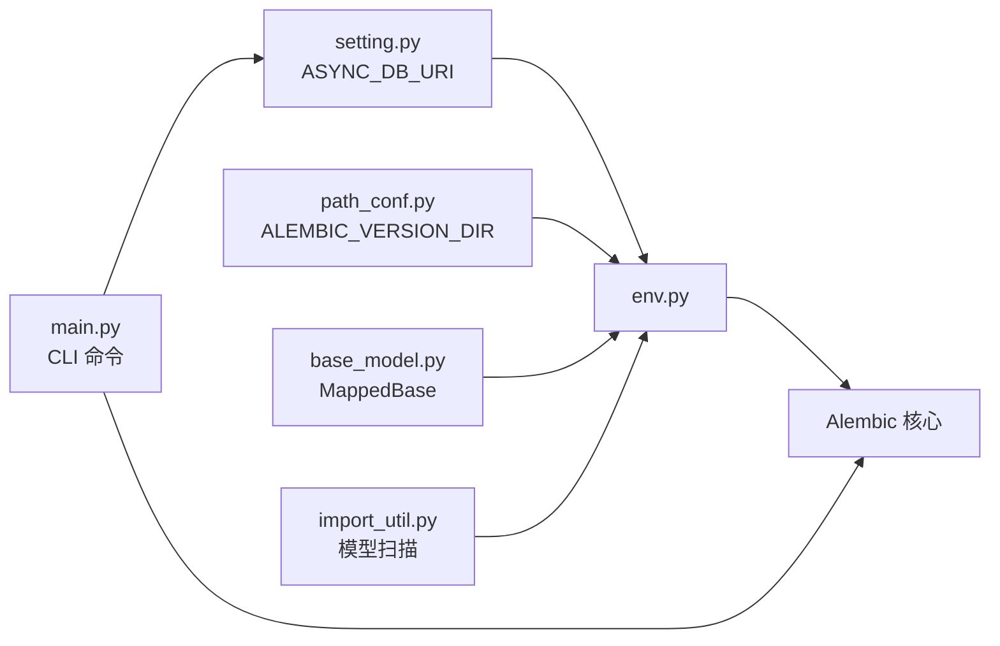

# 数据库迁移管理

<cite>
**本文引用的文件**
- [backend/alembic.ini](file://backend/alembic.ini)
- [backend/app/alembic/env.py](file://backend/app/alembic/env.py)
- [backend/app/alembic/script.py.mako](file://backend/app/alembic/script.py.mako)
- [backend/app/config/setting.py](file://backend/app/config/setting.py)
- [backend/app/config/path_conf.py](file://backend/app/config/path_conf.py)
- [backend/app/core/base_model.py](file://backend/app/core/base_model.py)
- [backend/app/utils/import_util.py](file://backend/app/utils/import_util.py)
- [backend/app/api/v1/module_system/user/model.py](file://backend/app/api/v1/module_system/user/model.py)
- [backend/app/api/v1/module_system/dept/model.py](file://backend/app/api/v1/module_system/dept/model.py)
- [backend/app/api/v1/module_system/role/model.py](file://backend/app/api/v1/module_system/role/model.py)
- [backend/app/scripts/initialize.py](file://backend/app/scripts/initialize.py)
- [backend/app/scripts/init_app.py](file://backend/app/scripts/init_app.py)
- [backend/main.py](file://backend/main.py)
</cite>

## 目录
1. [简介](#简介)
2. [项目结构](#项目结构)
3. [核心组件](#核心组件)
4. [架构总览](#架构总览)
5. [详细组件分析](#详细组件分析)
6. [依赖分析](#依赖分析)
7. [性能考量](#性能考量)
8. [故障排查指南](#故障排查指南)
9. [结论](#结论)
10. [附录](#附录)

## 简介
本文件面向 FastapiAdmin 项目的数据库迁移管理，围绕 Alembic 迁移框架的配置与使用进行系统化说明，涵盖初始化、版本管理、迁移脚本编写、迁移策略（向前/向后/批量）、版本控制最佳实践、数据保护与生产安全等主题。文档以仓库现有实现为依据，结合项目结构与关键配置文件，帮助开发者在开发与生产环境中安全、可控地演进数据库结构。

## 项目结构
FastapiAdmin 的 Alembic 迁移相关文件主要集中在 backend/app/alembic 目录，并通过 backend/alembic.ini 进行全局配置。迁移执行入口通过主程序 backend/main.py 中的 Typer CLI 暴露命令，配合配置模块 backend/app/config/setting.py 与路径配置 backend/app/config/path_conf.py 实现环境感知与目标元数据发现。

**图示来源**
- [backend/alembic.ini:1-120](file://backend/alembic.ini#L1-L120)
- [backend/app/alembic/env.py:1-137](file://backend/app/alembic/env.py#L1-L137)
- [backend/app/alembic/script.py.mako:1-27](file://backend/app/alembic/script.py.mako#L1-L27)
- [backend/app/config/setting.py:257-302](file://backend/app/config/setting.py#L257-L302)
- [backend/app/config/path_conf.py:6-7](file://backend/app/config/path_conf.py#L6-L7)
- [backend/app/core/base_model.py:21-32](file://backend/app/core/base_model.py#L21-L32)
- [backend/app/utils/import_util.py:56-163](file://backend/app/utils/import_util.py#L56-L163)
- [backend/main.py:13-162](file://backend/main.py#L13-L162)

**章节来源**
- [backend/alembic.ini:1-120](file://backend/alembic.ini#L1-L120)
- [backend/app/alembic/env.py:1-137](file://backend/app/alembic/env.py#L1-L137)
- [backend/app/alembic/script.py.mako:1-27](file://backend/app/alembic/script.py.mako#L1-L27)
- [backend/app/config/setting.py:257-302](file://backend/app/config/setting.py#L257-L302)
- [backend/app/config/path_conf.py:6-7](file://backend/app/config/path_conf.py#L6-L7)
- [backend/app/core/base_model.py:21-32](file://backend/app/core/base_model.py#L21-L32)
- [backend/app/utils/import_util.py:56-163](file://backend/app/utils/import_util.py#L56-L163)
- [backend/main.py:13-162](file://backend/main.py#L13-L162)

## 核心组件
- Alembic 全局配置：backend/alembic.ini
  - 指定迁移脚本位置、版本目录、日志级别、路径分隔符等。
- 迁移环境与元数据：backend/app/alembic/env.py
  - 在线/离线迁移模式、目标元数据、自动模型发现与去重、空变更保护。
- 迁移脚手架模板：backend/app/alembic/script.py.mako
  - 生成迁移脚本的模板，包含升级/降级骨架。
- 数据库配置与连接：backend/app/config/setting.py
  - 提供异步数据库连接串（ASYNC_DB_URI），支持 MySQL、PostgreSQL、SQLite。
- 路径与版本目录：backend/app/config/path_conf.py
  - 指定 Alembic 版本目录 app/alembic/versions。
- 声明式基类与元数据：backend/app/core/base_model.py
  - MappedBase 作为所有模型的基类，提供统一元数据入口。
- 模型扫描工具：backend/app/utils/import_util.py
  - 扫描工程内 model.py/models.py，校验并去重模型类，避免重复与冲突。
- 主程序 CLI：backend/main.py
  - 暴露 revision、upgrade 等命令，结合环境变量加载配置。

**章节来源**
- [backend/alembic.ini:6-120](file://backend/alembic.ini#L6-L120)
- [backend/app/alembic/env.py:14-136](file://backend/app/alembic/env.py#L14-L136)
- [backend/app/alembic/script.py.mako:1-27](file://backend/app/alembic/script.py.mako#L1-L27)
- [backend/app/config/setting.py:257-302](file://backend/app/config/setting.py#L257-L302)
- [backend/app/config/path_conf.py:6-7](file://backend/app/config/path_conf.py#L6-L7)
- [backend/app/core/base_model.py:21-32](file://backend/app/core/base_model.py#L21-L32)
- [backend/app/utils/import_util.py:56-163](file://backend/app/utils/import_util.py#L56-L163)
- [backend/main.py:13-162](file://backend/main.py#L13-L162)

## 架构总览
下图展示迁移执行链路：CLI 命令触发 Alembic，env.py 加载配置与元数据，ImportUtil 扫描模型，最终在线/离线执行迁移。

**图示来源**
- [backend/main.py:113-158](file://backend/main.py#L113-L158)
- [backend/app/alembic/env.py:26-130](file://backend/app/alembic/env.py#L26-L130)
- [backend/app/utils/import_util.py:56-163](file://backend/app/utils/import_util.py#L56-L163)

## 详细组件分析

### Alembic 配置与初始化
- 配置文件 backend/alembic.ini
  - script_location 指向 app/alembic，version_locations 默认位于 app/alembic/versions。
  - prepend_sys_path 为当前工作目录，确保模块导入路径正确。
  - 日志级别与输出格式在 [loggers]/[handlers]/[formatters] 中定义。
- 初始化步骤
  - 在 env.py 中确保版本目录存在（app/alembic/versions），避免首次运行时报错。
  - 通过 settings.ASYNC_DB_URI 注入数据库连接串，支持多数据库类型。

**章节来源**
- [backend/alembic.ini:6-120](file://backend/alembic.ini#L6-L120)
- [backend/app/alembic/env.py:14-50](file://backend/app/alembic/env.py#L14-L50)
- [backend/app/config/setting.py:257-302](file://backend/app/config/setting.py#L257-L302)

### 迁移环境与元数据
- 目标元数据
  - target_metadata 来自 MappedBase.metadata，确保所有模型纳入迁移范围。
- 模型发现与去重
  - ImportUtil.find_models 扫描工程内的 model.py/models.py，按表名与类对象去重，避免重复与冲突。
- 空变更保护
  - process_revision_directives 中检查 upgrade_ops_list 是否为空，若为空则不生成迁移文件，减少噪音。

**图示来源**
- [backend/app/alembic/env.py:17-24](file://backend/app/alembic/env.py#L17-L24)
- [backend/app/alembic/env.py:105-116](file://backend/app/alembic/env.py#L105-L116)
- [backend/app/utils/import_util.py:56-163](file://backend/app/utils/import_util.py#L56-L163)

**章节来源**
- [backend/app/alembic/env.py:17-24](file://backend/app/alembic/env.py#L17-L24)
- [backend/app/alembic/env.py:105-116](file://backend/app/alembic/env.py#L105-L116)
- [backend/app/utils/import_util.py:56-163](file://backend/app/utils/import_util.py#L56-L163)

### 迁移脚手架模板
- 脚本模板 backend/app/alembic/script.py.mako 提供标准骨架，包含 upgrade()/downgrade() 函数与版本标识。
- 实际迁移脚本由 Alembic 基于模板生成，开发者可在脚本中手动调整复杂变更。

**章节来源**
- [backend/app/alembic/script.py.mako:1-27](file://backend/app/alembic/script.py.mako#L1-L27)

### CLI 命令与迁移策略
- CLI 命令
  - revision：自动生成迁移脚本（autogenerate=True）。
  - upgrade：将数据库升级到 head。
- 迁移策略
  - 向前迁移：通过 upgrade(head) 应用最新变更。
  - 向后回滚：可通过 downgrade 或指定具体版本进行回滚（需在脚本中定义）。
  - 批量迁移：在 CI/CD 中顺序执行 upgrade/head，确保多环境一致性。

**图示来源**
- [backend/main.py:113-158](file://backend/main.py#L113-L158)

**章节来源**
- [backend/main.py:113-158](file://backend/main.py#L113-L158)

### 数据模型与迁移范围
- 声明式基类 MappedBase
  - 所有业务模型继承自 MappedBase，统一纳入迁移范围。
- 示例模型
  - 用户、部门、角色等模型均继承自 MappedBase 或其混入类，确保迁移时被正确识别。

**章节来源**
- [backend/app/core/base_model.py:21-32](file://backend/app/core/base_model.py#L21-L32)
- [backend/app/api/v1/module_system/user/model.py:64-151](file://backend/app/api/v1/module_system/user/model.py#L64-L151)
- [backend/app/api/v1/module_system/dept/model.py:14-59](file://backend/app/api/v1/module_system/dept/model.py#L14-L59)
- [backend/app/api/v1/module_system/role/model.py:64-100](file://backend/app/api/v1/module_system/role/model.py#L64-L100)

## 依赖分析
- 配置依赖
  - env.py 依赖 settings.ASYNC_DB_URI 与 ALEMBIC_VERSION_DIR。
- 模型依赖
  - ImportUtil 依赖 MappedBase 与工程路径，扫描并校验模型。
- CLI 依赖
  - main.py 的 CLI 命令依赖 Alembic Config 与 settings。

**图示来源**
- [backend/app/config/setting.py:257-302](file://backend/app/config/setting.py#L257-L302)
- [backend/app/config/path_conf.py:6-7](file://backend/app/config/path_conf.py#L6-L7)
- [backend/app/alembic/env.py:9-12](file://backend/app/alembic/env.py#L9-L12)
- [backend/app/core/base_model.py:21-32](file://backend/app/core/base_model.py#L21-L32)
- [backend/app/utils/import_util.py:56-163](file://backend/app/utils/import_util.py#L56-L163)
- [backend/main.py:13-162](file://backend/main.py#L13-L162)

**章节来源**
- [backend/app/config/setting.py:257-302](file://backend/app/config/setting.py#L257-L302)
- [backend/app/config/path_conf.py:6-7](file://backend/app/config/path_conf.py#L6-L7)
- [backend/app/alembic/env.py:9-12](file://backend/app/alembic/env.py#L9-L12)
- [backend/app/core/base_model.py:21-32](file://backend/app/core/base_model.py#L21-L32)
- [backend/app/utils/import_util.py:56-163](file://backend/app/utils/import_util.py#L56-L163)
- [backend/main.py:13-162](file://backend/main.py#L13-L162)

## 性能考量
- 迁移事务粒度
  - env.py 中 transaction_per_migration 选项可控制每次迁移在一个事务中执行，有助于减少锁竞争与提升稳定性。
- 连接池与预检
  - settings 中 DATABASE_ECHO/ECHO_POOL、POOL_PRE_PING 等配置可用于诊断与优化连接行为，间接影响迁移性能。
- 模型扫描效率
  - ImportUtil 使用 LRU 缓存与有序导入，降低扫描成本；建议保持模型文件结构清晰，避免不必要的模块导入。

**章节来源**
- [backend/app/alembic/env.py:121-125](file://backend/app/alembic/env.py#L121-L125)
- [backend/app/config/setting.py:84-95](file://backend/app/config/setting.py#L84-L95)
- [backend/app/utils/import_util.py:56-163](file://backend/app/utils/import_util.py#L56-L163)

## 故障排查指南
- 数据库连接问题
  - 若 sqlalchemy.url 未正确注入，env.py 会在 offline/online 模式下抛出明确错误提示，检查 settings.ASYNC_DB_URI 与环境变量。
- 模型未被发现
  - 确认模型文件位于 app/api/v1/**/model.py 或 models.py，且继承自 MappedBase，具备表名与列定义。
- 空变更导致不生成脚本
  - process_revision_directives 会检测 upgrade_ops_list 是否为空，若为空则不生成迁移文件，属于预期行为。
- 初始化数据与表
  - 初始化脚本会先创建表结构，再导入种子数据；若表已存在数据，会跳过初始化，避免重复写入。

**章节来源**
- [backend/app/alembic/env.py:67-70](file://backend/app/alembic/env.py#L67-L70)
- [backend/app/alembic/env.py:92-95](file://backend/app/alembic/env.py#L92-L95)
- [backend/app/alembic/env.py:105-116](file://backend/app/alembic/env.py#L105-L116)
- [backend/app/utils/import_util.py:40-53](file://backend/app/utils/import_util.py#L40-L53)
- [backend/app/scripts/initialize.py:69-79](file://backend/app/scripts/initialize.py#L69-L79)

## 结论
FastapiAdmin 的 Alembic 迁移体系通过清晰的配置、自动化的模型发现与去重、以及 CLI 命令封装，实现了从开发到生产的稳定迁移流程。结合空变更保护、事务控制与初始化脚本，能够在保证数据安全的同时，提升迁移效率与可维护性。建议在生产环境中遵循本文的最佳实践与安全策略，确保迁移过程可控、可观测、可回滚。

## 附录

### 迁移策略与操作流程
- 初始化
  - 确保版本目录存在（env.py 已处理）。
  - 通过 CLI 生成迁移脚本并应用到目标环境。
- 向前迁移
  - 使用 upgrade(head) 将数据库升级到最新版本。
- 向后回滚
  - 在迁移脚本中定义 downgrade 逻辑，使用 downgrade 或指定版本进行回滚。
- 批量迁移
  - 在 CI/CD 中顺序执行 upgrade/head，确保多环境一致。

**章节来源**
- [backend/app/alembic/env.py:121-128](file://backend/app/alembic/env.py#L121-L128)
- [backend/main.py:139-158](file://backend/main.py#L139-L158)

### 数据库版本控制最佳实践
- 命名规范
  - 使用 Alembic 默认命名规则，必要时可参考 alembic.ini 中的 file_template 配置。
- 依赖关系管理
  - 通过 ImportUtil 的去重与扫描，避免重复模型与表名冲突。
- 冲突解决
  - 当模型变更导致冲突时，优先在脚本中显式定义迁移顺序与依赖，确保幂等性。

**章节来源**
- [backend/alembic.ini:8-12](file://backend/alembic.ini#L8-L12)
- [backend/app/utils/import_util.py:70-163](file://backend/app/utils/import_util.py#L70-L163)

### 生产环境迁移安全考虑
- 停机时间最小化
  - 采用在线迁移与事务控制，尽量避免长事务与大表锁。
- 零停机部署
  - 通过脚本模板与回滚预案，确保回退路径可用。
- 回滚预案
  - 在迁移脚本中实现 downgrade，确保可逆操作；在 CI/CD 中增加回滚演练。

**章节来源**
- [backend/app/alembic/env.py:121-128](file://backend/app/alembic/env.py#L121-L128)
- [backend/app/alembic/script.py.mako:21-26](file://backend/app/alembic/script.py.mako#L21-L26)

### 数据保护与错误恢复
- 备份策略
  - 迁移前对生产数据库进行快照或逻辑备份，确保可恢复。
- 事务回滚
  - 利用 Alembic 的事务控制与数据库原生事务，失败时自动回滚。
- 错误恢复机制
  - 通过日志与 CLI 输出定位问题；必要时使用 downgrade 回退至上一稳定版本。

**章节来源**
- [backend/app/alembic/env.py:121-128](file://backend/app/alembic/env.py#L121-L128)
- [backend/alembic.ini:86-120](file://backend/alembic.ini#L86-L120)