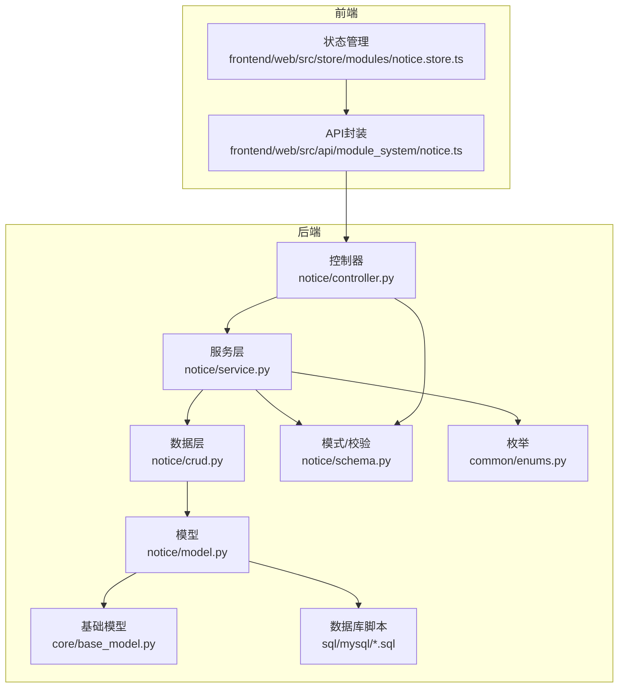
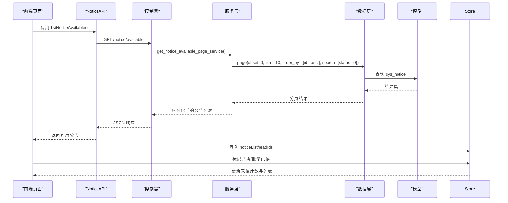
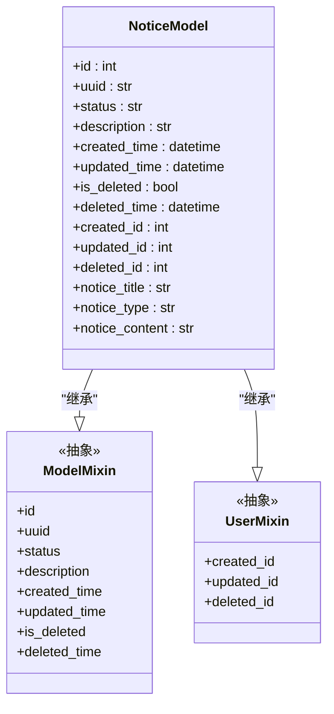
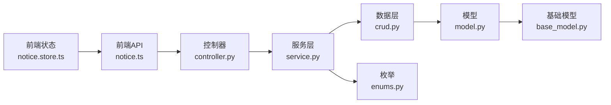

# 公告表设计

<cite>
**本文引用的文件**
- [backend/app/api/v1/module_system/notice/model.py](file://backend/app/api/v1/module_system/notice/model.py)
- [backend/app/api/v1/module_system/notice/schema.py](file://backend/app/api/v1/module_system/notice/schema.py)
- [backend/app/api/v1/module_system/notice/controller.py](file://backend/app/api/v1/module_system/notice/controller.py)
- [backend/app/api/v1/module_system/notice/crud.py](file://backend/app/api/v1/module_system/notice/crud.py)
- [backend/app/api/v1/module_system/notice/service.py](file://backend/app/api/v1/module_system/notice/service.py)
- [frontend/web/src/api/module_system/notice.ts](file://frontend/web/src/api/module_system/notice.ts)
- [frontend/web/src/store/modules/notice.store.ts](file://frontend/web/src/store/modules/notice.store.ts)
- [backend/app/core/base_model.py](file://backend/app/core/base_model.py)
- [backend/app/common/enums.py](file://backend/app/common/enums.py)
- [backend/sql/mysql/fastapiadmin_2026-04-19_223353.sql](file://backend/sql/mysql/fastapiadmin_2026-04-19_223353.sql)
</cite>

## 目录
1. [简介](#简介)
2. [项目结构](#项目结构)
3. [核心组件](#核心组件)
4. [架构总览](#架构总览)
5. [详细组件分析](#详细组件分析)
6. [依赖分析](#依赖分析)
7. [性能考虑](#性能考虑)
8. [故障排查指南](#故障排查指南)
9. [结论](#结论)
10. [附录](#附录)

## 简介
本文件为 FastapiAdmin 中“公告表(sys_notice)”的全面数据表设计文档。围绕公告表的字段设计、类型管理机制、应用场景、管理策略（发布流程、有效期管理、阅读状态跟踪、优先级与排序）、性能优化与用户体验优化进行系统性阐述，并结合后端控制器、服务层、数据层、前端接口与状态管理的实际实现，给出可落地的设计与实践建议。

## 项目结构
公告模块位于后端系统“module_system”下，采用标准的 MVC 分层：模型(model)、模式(schema)、控制器(controller)、服务(service)、数据访问(curd)。前端提供 API 封装与 Pinia 状态管理，用于展示“全局启用”的公告并维护用户的已读状态。

图表来源
- [backend/app/api/v1/module_system/notice/controller.py:18-233](file://backend/app/api/v1/module_system/notice/controller.py#L18-L233)
- [backend/app/api/v1/module_system/notice/service.py:15-254](file://backend/app/api/v1/module_system/notice/service.py#L15-L254)
- [backend/app/api/v1/module_system/notice/crud.py:10-107](file://backend/app/api/v1/module_system/notice/crud.py#L10-L107)
- [backend/app/api/v1/module_system/notice/model.py:7-21](file://backend/app/api/v1/module_system/notice/model.py#L7-L21)
- [backend/app/api/v1/module_system/notice/schema.py:16-101](file://backend/app/api/v1/module_system/notice/schema.py#L16-L101)
- [backend/app/core/base_model.py:40-200](file://backend/app/core/base_model.py#L40-L200)
- [backend/app/common/enums.py:94-109](file://backend/app/common/enums.py#L94-L109)
- [frontend/web/src/api/module_system/notice.ts:1-96](file://frontend/web/src/api/module_system/notice.ts#L1-L96)
- [frontend/web/src/store/modules/notice.store.ts:35-125](file://frontend/web/src/store/modules/notice.store.ts#L35-L125)
- [backend/sql/mysql/fastapiadmin_2026-04-19_223353.sql:1-200](file://backend/sql/mysql/fastapiadmin_2026-04-19_223353.sql#L1-L200)

章节来源
- [backend/app/api/v1/module_system/notice/controller.py:18-233](file://backend/app/api/v1/module_system/notice/controller.py#L18-L233)
- [backend/app/api/v1/module_system/notice/service.py:15-254](file://backend/app/api/v1/module_system/notice/service.py#L15-L254)
- [backend/app/api/v1/module_system/notice/crud.py:10-107](file://backend/app/api/v1/module_system/notice/crud.py#L10-L107)
- [backend/app/api/v1/module_system/notice/model.py:7-21](file://backend/app/api/v1/module_system/notice/model.py#L7-L21)
- [backend/app/api/v1/module_system/notice/schema.py:16-101](file://backend/app/api/v1/module_system/notice/schema.py#L16-L101)
- [frontend/web/src/api/module_system/notice.ts:1-96](file://frontend/web/src/api/module_system/notice.ts#L1-L96)
- [frontend/web/src/store/modules/notice.store.ts:35-125](file://frontend/web/src/store/modules/notice.store.ts#L35-L125)
- [backend/app/core/base_model.py:40-200](file://backend/app/core/base_model.py#L40-L200)
- [backend/app/common/enums.py:94-109](file://backend/app/common/enums.py#L94-L109)
- [backend/sql/mysql/fastapiadmin_2026-04-19_223353.sql:1-200](file://backend/sql/mysql/fastapiadmin_2026-04-19_223353.sql#L1-L200)

## 核心组件
- 数据模型 NoticeModel：定义公告表的字段与注释，继承基础模型与用户审计字段，具备统一的主键、状态、时间戳、软删除与审计字段。
- 模式/校验 NoticeCreateSchema/NoticeUpdateSchema/NoticeOutSchema：定义创建、更新、输出的字段约束、长度限制、类型校验与富文本净化。
- 控制器 NoticeRouter：提供公告详情、列表、创建、更新、删除、批量状态变更、导出、可用列表等接口。
- 服务层 NoticeService：封装业务逻辑，如可用公告列表、分页查询、创建/更新去重校验、导出映射等。
- 数据层 NoticeCRUD：基于通用 CRUD 基类，提供按 ID、列表、分页、创建、更新、删除、批量状态设置等能力。
- 前端 API NoticeAPI：封装系统公告的列表、详情、创建、更新、删除、批量状态设置、导出等请求。
- 前端状态 notice.store：维护“全局启用公告”的列表、总数、已读 ID 集合，并持久化到本地存储。

章节来源
- [backend/app/api/v1/module_system/notice/model.py:7-21](file://backend/app/api/v1/module_system/notice/model.py#L7-L21)
- [backend/app/api/v1/module_system/notice/schema.py:16-101](file://backend/app/api/v1/module_system/notice/schema.py#L16-L101)
- [backend/app/api/v1/module_system/notice/controller.py:18-233](file://backend/app/api/v1/module_system/notice/controller.py#L18-L233)
- [backend/app/api/v1/module_system/notice/service.py:15-254](file://backend/app/api/v1/module_system/notice/service.py#L15-L254)
- [backend/app/api/v1/module_system/notice/crud.py:10-107](file://backend/app/api/v1/module_system/notice/crud.py#L10-L107)
- [frontend/web/src/api/module_system/notice.ts:1-96](file://frontend/web/src/api/module_system/notice.ts#L1-L96)
- [frontend/web/src/store/modules/notice.store.ts:35-125](file://frontend/web/src/store/modules/notice.store.ts#L35-L125)

## 架构总览
公告模块遵循“控制器-服务-数据层-模型”的分层架构，配合前端 API 与 Pinia 状态管理，形成“查询可用公告—前端展示—本地已读标记—持久化”的闭环。

图表来源
- [frontend/web/src/api/module_system/notice.ts:14-18](file://frontend/web/src/api/module_system/notice.ts#L14-L18)
- [backend/app/api/v1/module_system/notice/controller.py:212-232](file://backend/app/api/v1/module_system/notice/controller.py#L212-L232)
- [backend/app/api/v1/module_system/notice/service.py:109-126](file://backend/app/api/v1/module_system/notice/service.py#L109-L126)
- [backend/app/api/v1/module_system/notice/crud.py:39-56](file://backend/app/api/v1/module_system/notice/crud.py#L39-L56)
- [backend/app/api/v1/module_system/notice/model.py:7-21](file://backend/app/api/v1/module_system/notice/model.py#L7-L21)

## 详细组件分析

### 数据表设计：sys_notice 字段说明
- 表名与注释：sys_notice，表注释为“通知公告表”，便于数据库管理工具识别。
- 字段设计（基于模型与基础模型）：
  - id：主键，自增，索引，用于唯一标识。
  - uuid：全局唯一标识，索引，便于跨系统追踪与幂等处理。
  - status：状态字段，默认“0”表示启用，索引，配合“可用公告”查询。
  - description：备注/描述，Text 类型，用于补充说明。
  - created_time/updated_time：创建与更新时间，带索引，支持排序与范围查询。
  - is_deleted/deleted_time：软删除标记与删除时间，便于审计与恢复。
  - created_id/updated_id/deleted_id：审计字段，外键关联用户表，支持“仅本人数据”等权限策略。
  - notice_title：公告标题，字符串，最大长度由模式约束限制，非空。
  - notice_type：公告类型，字符串，值域为“1通知 2公告”，用于区分展示策略与触达范围。
  - notice_content：公告内容，Text 类型，支持富文本，创建/更新时进行 HTML 净化。

字段来源与约束
- 字段定义与注释：[backend/app/api/v1/module_system/notice/model.py:11-21](file://backend/app/api/v1/module_system/notice/model.py#L11-L21)
- 基础模型字段（id/uuid/status/description/时间戳/软删除/审计字段）：[backend/app/core/base_model.py:70-126](file://backend/app/core/base_model.py#L70-L126)
- 类型与长度约束、HTML 净化、必填校验：[backend/app/api/v1/module_system/notice/schema.py:16-43](file://backend/app/api/v1/module_system/notice/schema.py#L16-L43)

章节来源
- [backend/app/api/v1/module_system/notice/model.py:11-21](file://backend/app/api/v1/module_system/notice/model.py#L11-L21)
- [backend/app/core/base_model.py:70-126](file://backend/app/core/base_model.py#L70-L126)
- [backend/app/api/v1/module_system/notice/schema.py:16-43](file://backend/app/api/v1/module_system/notice/schema.py#L16-L43)

### 类型管理机制：通知 vs 公告
- 类型字段 notice_type：支持“1通知 2公告”两类。
- 展示策略与触达机制：
  - 后端提供“全局启用公告”接口，固定每页 10 条，按 id 升序，用于首页或侧边栏等入口展示。
  - 前端状态管理维护已读 ID 集合，过滤掉已读公告，避免重复打扰。
  - 该机制天然区分了“系统通知”（更频繁、短小、即时）与“系统公告”（更正式、重要、需要留存）两类场景。

接口与状态管理
- 可用公告接口：[backend/app/api/v1/module_system/notice/controller.py:212-232](file://backend/app/api/v1/module_system/notice/controller.py#L212-L232)
- 前端 API：[frontend/web/src/api/module_system/notice.ts:14-18](file://frontend/web/src/api/module_system/notice.ts#L14-L18)
- 前端状态管理：[frontend/web/src/store/modules/notice.store.ts:47-94](file://frontend/web/src/store/modules/notice.store.ts#L47-L94)

章节来源
- [backend/app/api/v1/module_system/notice/controller.py:212-232](file://backend/app/api/v1/module_system/notice/controller.py#L212-L232)
- [frontend/web/src/api/module_system/notice.ts:14-18](file://frontend/web/src/api/module_system/notice.ts#L14-L18)
- [frontend/web/src/store/modules/notice.store.ts:47-94](file://frontend/web/src/store/modules/notice.store.ts#L47-L94)

### 应用场景与业务实现
- 系统公告：通过“全局启用公告”接口拉取，前端以未读计数与弹窗提示的方式触达用户。
- 业务通知：可复用同一表结构，通过 notice_type 区分；若需更细粒度，可在扩展字段中承载业务标签。
- 紧急事件通知：建议使用“公告”类型并配合置顶/加粗等前端展示策略，同时通过“已读状态”确保用户确认。

接口与前端交互
- 列表/详情/创建/更新/删除/批量状态设置/导出：[backend/app/api/v1/module_system/notice/controller.py:21-232](file://backend/app/api/v1/module_system/notice/controller.py#L21-L232)
- 前端 API 封装：[frontend/web/src/api/module_system/notice.ts:1-96](file://frontend/web/src/api/module_system/notice.ts#L1-L96)

章节来源
- [backend/app/api/v1/module_system/notice/controller.py:21-232](file://backend/app/api/v1/module_system/notice/controller.py#L21-L232)
- [frontend/web/src/api/module_system/notice.ts:1-96](file://frontend/web/src/api/module_system/notice.ts#L1-L96)

### 管理策略：发布流程、有效期、阅读状态、优先级与排序
- 发布流程
  - 创建：校验标题与内容非空、类型合法、标题唯一；创建后进入“启用”状态。
  - 更新：校验标题唯一性（排除自身），更新后仍保持启用状态。
  - 删除：批量删除前进行存在性校验。
  - 状态管理：支持批量启用/停用，配合“全局启用公告”接口筛选。
- 有效期管理
  - 当前模型未内置有效期字段；可通过扩展字段或业务规则实现“过期自动停用”。
- 阅读状态跟踪
  - 前端维护 readIds 集合并持久化至本地存储，避免刷新后重复展示。
  - 支持单条/批量标记已读，实时更新未读计数。
- 优先级与排序
  - 默认按 id 升序；前端可扩展“置顶/优先级”字段与排序策略。
  - 导出映射包含“创建时间/更新时间/创建者ID/更新者ID”，便于运营排期与审计。

章节来源
- [backend/app/api/v1/module_system/notice/service.py:128-197](file://backend/app/api/v1/module_system/notice/service.py#L128-L197)
- [backend/app/api/v1/module_system/notice/schema.py:25-43](file://backend/app/api/v1/module_system/notice/schema.py#L25-L43)
- [frontend/web/src/store/modules/notice.store.ts:67-94](file://frontend/web/src/store/modules/notice.store.ts#L67-L94)

### 数据模型类图

图表来源
- [backend/app/api/v1/module_system/notice/model.py:7-21](file://backend/app/api/v1/module_system/notice/model.py#L7-L21)
- [backend/app/core/base_model.py:40-200](file://backend/app/core/base_model.py#L40-L200)

## 依赖分析
- 控制器依赖服务层；服务层依赖数据层与模式；数据层依赖模型；模型依赖基础模型与用户审计；前端 API 依赖控制器；前端状态依赖 API。
- 查询参数使用枚举进行查询条件构造，保证查询语义一致性。

图表来源
- [frontend/web/src/api/module_system/notice.ts:1-96](file://frontend/web/src/api/module_system/notice.ts#L1-L96)
- [backend/app/api/v1/module_system/notice/controller.py:18-233](file://backend/app/api/v1/module_system/notice/controller.py#L18-L233)
- [backend/app/api/v1/module_system/notice/service.py:15-254](file://backend/app/api/v1/module_system/notice/service.py#L15-L254)
- [backend/app/api/v1/module_system/notice/crud.py:10-107](file://backend/app/api/v1/module_system/notice/crud.py#L10-L107)
- [backend/app/api/v1/module_system/notice/model.py:7-21](file://backend/app/api/v1/module_system/notice/model.py#L7-L21)
- [backend/app/core/base_model.py:40-200](file://backend/app/core/base_model.py#L40-L200)
- [backend/app/common/enums.py:94-109](file://backend/app/common/enums.py#L94-L109)
- [frontend/web/src/store/modules/notice.store.ts:35-125](file://frontend/web/src/store/modules/notice.store.ts#L35-L125)

章节来源
- [backend/app/common/enums.py:94-109](file://backend/app/common/enums.py#L94-L109)

## 性能考虑
- 查询性能
  - 为常用过滤字段（status、created_time、updated_time、created_id、updated_id）建立索引，提升分页与筛选效率。
  - “全局启用公告”固定每页 10 条，减少前端渲染压力。
- 导出性能
  - 导出前对状态与类型进行本地映射，避免数据库重复转换；建议分批导出大数据集。
- 前端性能
  - 已读状态本地持久化，减少重复请求；列表过滤在前端完成，降低后端负担。
- 可扩展建议
  - 若公告量大，可引入缓存层（如 Redis）存放“全局启用公告”列表，设置合理过期时间。
  - 对 notice_content 进行分表或外部存储（如对象存储）以降低主表膨胀风险。

## 故障排查指南
- 常见错误与定位
  - 创建/更新标题重复：服务层会进行唯一性校验并抛出自定义异常。
  - 删除对象为空或不存在：删除前进行参数与存在性校验。
  - 类型非法：模式层对 notice_type 进行严格校验。
- 日志与可观测性
  - 控制器与服务层均记录关键操作日志，便于问题回溯。
- 建议排查步骤
  - 检查 notice_type 是否为“1/2”；
  - 检查 notice_title 是否重复；
  - 检查 ids 是否为空或存在无效 ID；
  - 检查“全局启用公告”接口返回状态是否正确。

章节来源
- [backend/app/api/v1/module_system/notice/service.py:143-197](file://backend/app/api/v1/module_system/notice/service.py#L143-L197)
- [backend/app/api/v1/module_system/notice/schema.py:25-43](file://backend/app/api/v1/module_system/notice/schema.py#L25-L43)
- [backend/app/api/v1/module_system/notice/controller.py:31-43](file://backend/app/api/v1/module_system/notice/controller.py#L31-L43)

## 结论
公告表(sys_notice)在 FastapiAdmin 中通过清晰的分层架构与前后端协同，实现了“类型区分—可用筛选—已读跟踪—导出审计”的完整闭环。建议在现有基础上扩展有效期、优先级与缓存策略，以满足更大规模与更复杂场景下的性能与体验需求。

## 附录

### 字段与类型对照
- notice_title：字符串，最大长度由模式约束限制，非空。
- notice_type：字符串，值域“1通知 2公告”。
- notice_content：文本，支持富文本，创建/更新时进行净化。
- status：字符串，0启用 1停用。
- 时间与审计：created_time/updated_time/is_deleted/deleted_time/created_id/updated_id/deleted_id。

章节来源
- [backend/app/api/v1/module_system/notice/model.py:11-21](file://backend/app/api/v1/module_system/notice/model.py#L11-L21)
- [backend/app/api/v1/module_system/notice/schema.py:16-43](file://backend/app/api/v1/module_system/notice/schema.py#L16-L43)
- [backend/app/core/base_model.py:70-126](file://backend/app/core/base_model.py#L70-L126)