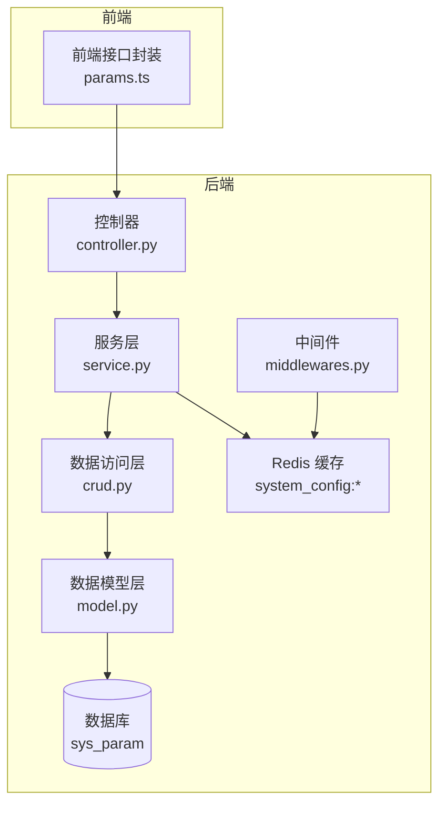
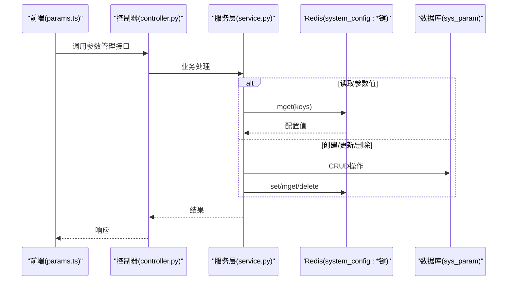
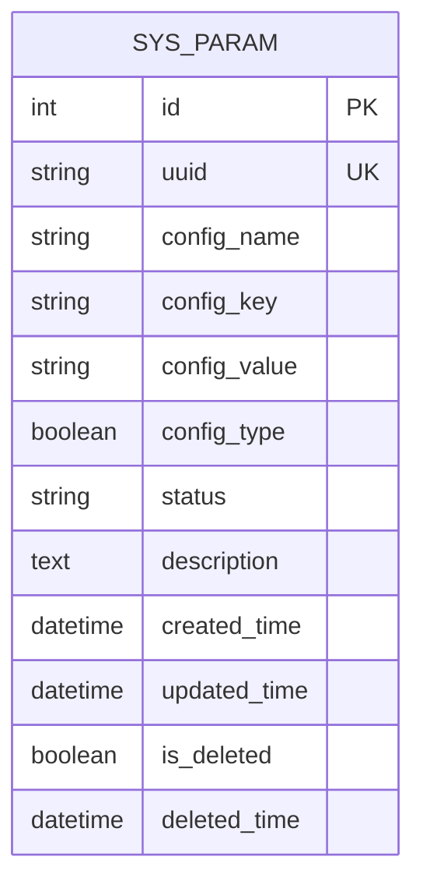
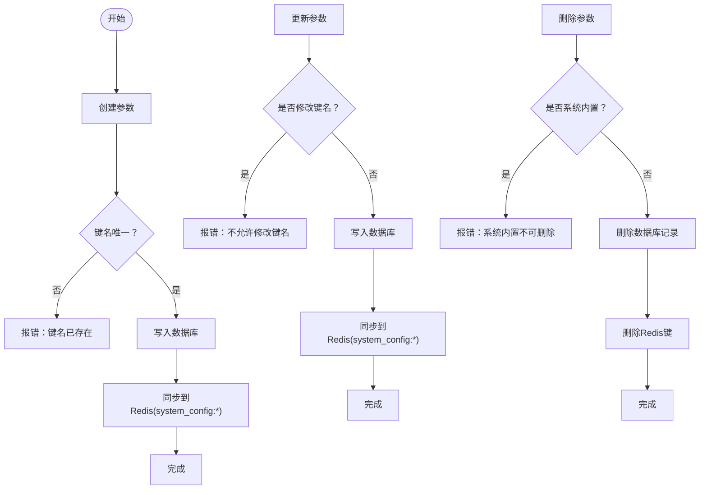
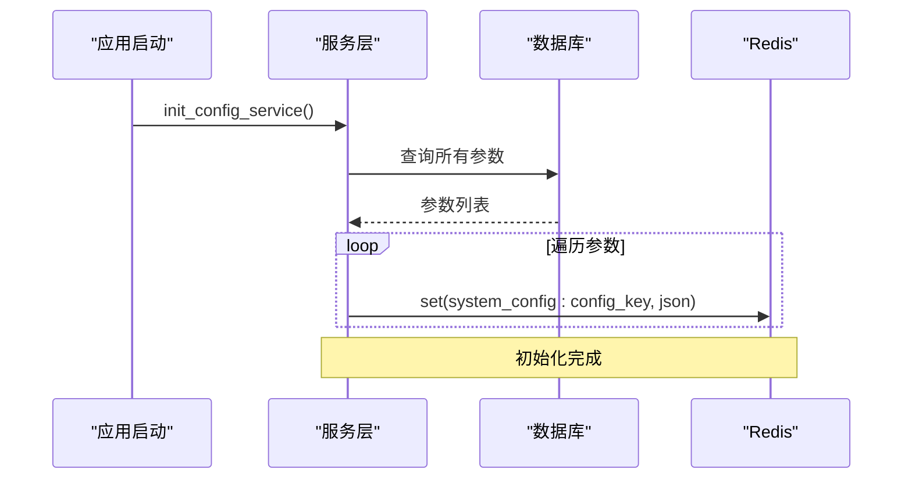
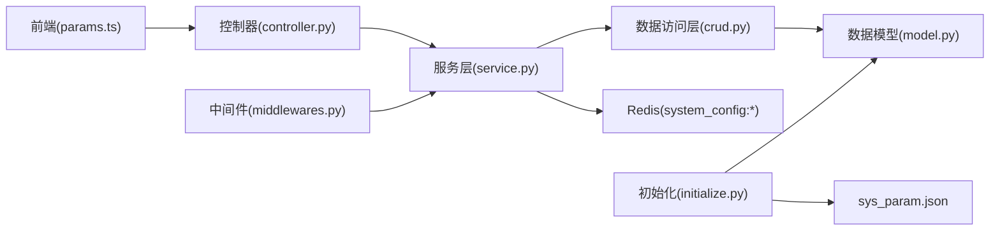

# 参数表设计

<cite>
**本文引用的文件**
- [backend/app/api/v1/module_system/params/model.py](file://backend/app/api/v1/module_system/params/model.py)
- [backend/app/api/v1/module_system/params/schema.py](file://backend/app/api/v1/module_system/params/schema.py)
- [backend/app/api/v1/module_system/params/crud.py](file://backend/app/api/v1/module_system/params/crud.py)
- [backend/app/api/v1/module_system/params/service.py](file://backend/app/api/v1/module_system/params/service.py)
- [backend/app/api/v1/module_system/params/controller.py](file://backend/app/api/v1/module_system/params/controller.py)
- [backend/app/scripts/data/sys_param.json](file://backend/app/scripts/data/sys_param.json)
- [backend/sql/mysql/fastapiadmin_2026-04-19_223353.sql](file://backend/sql/mysql/fastapiadmin_2026-04-19_223353.sql)
- [backend/sql/postgres/fastapiadmin_2026-04-19_224727.sql](file://backend/sql/postgres/fastapiadmin_2026-04-19_224727.sql)
- [backend/app/common/enums.py](file://backend/app/common/enums.py)
- [backend/app/core/middlewares.py](file://backend/app/core/middlewares.py)
- [frontend/web/src/api/module_system/params.ts](file://frontend/web/src/api/module_system/params.ts)
- [backend/app/scripts/initialize.py](file://backend/app/scripts/initialize.py)
</cite>

## 目录
1. [简介](#简介)
2. [项目结构](#项目结构)
3. [核心组件](#核心组件)
4. [架构总览](#架构总览)
5. [详细组件分析](#详细组件分析)
6. [依赖分析](#依赖分析)
7. [性能考量](#性能考量)
8. [故障排查指南](#故障排查指南)
9. [结论](#结论)
10. [附录](#附录)

## 简介
本文件围绕 FastapiAdmin 的系统参数表（sys_param）进行系统化设计与实现说明，覆盖字段设计、分类管理、配置管理、读取与缓存策略、热更新与通知机制、以及安全与权限控制策略。目标是帮助开发者与运维人员快速理解参数表的设计理念与使用方式，并提供可落地的实施建议。

## 项目结构
参数表相关代码采用典型的分层架构组织：
- 数据模型层：定义 sys_param 的字段与约束
- 数据访问层：封装 CRUD 操作
- 服务层：提供业务逻辑、缓存同步、初始化与中间件配置读取
- 控制器层：暴露 REST API，负责鉴权与响应
- 前端接口：提供参数管理的前端调用封装
- 初始化脚本：在首次启动时导入系统参数初始化数据
- 中间件：在运行时从缓存读取关键参数，实现安全与访问控制

图表来源
- [backend/app/api/v1/module_system/params/controller.py:1-288](file://backend/app/api/v1/module_system/params/controller.py#L1-L288)
- [backend/app/api/v1/module_system/params/service.py:1-457](file://backend/app/api/v1/module_system/params/service.py#L1-L457)
- [backend/app/api/v1/module_system/params/crud.py:1-109](file://backend/app/api/v1/module_system/params/crud.py#L1-L109)
- [backend/app/api/v1/module_system/params/model.py:1-25](file://backend/app/api/v1/module_system/params/model.py#L1-L25)
- [backend/app/core/middlewares.py:1-215](file://backend/app/core/middlewares.py#L1-L215)
- [frontend/web/src/api/module_system/params.ts:1-98](file://frontend/web/src/api/module_system/params.ts#L1-L98)

章节来源
- [backend/app/api/v1/module_system/params/controller.py:1-288](file://backend/app/api/v1/module_system/params/controller.py#L1-L288)
- [backend/app/api/v1/module_system/params/service.py:1-457](file://backend/app/api/v1/module_system/params/service.py#L1-L457)
- [backend/app/api/v1/module_system/params/crud.py:1-109](file://backend/app/api/v1/module_system/params/crud.py#L1-L109)
- [backend/app/api/v1/module_system/params/model.py:1-25](file://backend/app/api/v1/module_system/params/model.py#L1-L25)
- [backend/app/core/middlewares.py:1-215](file://backend/app/core/middlewares.py#L1-L215)
- [frontend/web/src/api/module_system/params.ts:1-98](file://frontend/web/src/api/module_system/params.ts#L1-L98)

## 核心组件
- 数据模型（ParamsModel）：定义 sys_param 的字段与注释，明确参数名称、键名、键值、系统内置标记等
- 数据访问（ParamsCRUD）：封装按 ID/键名查询、列表查询、分页、创建、更新、删除等操作
- 服务层（ParamsService）：提供参数值读取、列表/分页查询、创建/更新/删除、导出、上传、初始化缓存、中间件所需配置读取
- 控制器（ParamsRouter）：暴露 REST API，包含参数详情、按键名查询、按键名取值、列表、创建、更新、删除、导出、上传、初始化缓存等接口
- 前端封装（params.ts）：统一调用后端参数管理接口，支持分页、详情、创建、更新、删除、导出、上传、初始化参数获取
- 初始化脚本（initialize.py）：在首次启动时导入 sys_param.json 中的初始化参数
- 中间件（middlewares.py）：在运行时从 Redis 读取演示模式、IP 白名单、API 白名单、IP 黑名单等关键配置，实现访问控制

章节来源
- [backend/app/api/v1/module_system/params/model.py:1-25](file://backend/app/api/v1/module_system/params/model.py#L1-L25)
- [backend/app/api/v1/module_system/params/crud.py:1-109](file://backend/app/api/v1/module_system/params/crud.py#L1-L109)
- [backend/app/api/v1/module_system/params/service.py:1-457](file://backend/app/api/v1/module_system/params/service.py#L1-L457)
- [backend/app/api/v1/module_system/params/controller.py:1-288](file://backend/app/api/v1/module_system/params/controller.py#L1-L288)
- [frontend/web/src/api/module_system/params.ts:1-98](file://frontend/web/src/api/module_system/params.ts#L1-L98)
- [backend/app/scripts/initialize.py:1-199](file://backend/app/scripts/initialize.py#L1-L199)
- [backend/app/core/middlewares.py:1-215](file://backend/app/core/middlewares.py#L1-L215)

## 架构总览
参数表在系统中的职责与交互如下：
- 字段设计：参数名称、参数键名、参数键值、系统内置标记、状态、描述、时间戳、软删等
- 分类管理：通过 config_type 标记区分系统内置参数与业务参数；系统内置参数在删除时受限制
- 配置管理：提供创建、更新、删除、导出、上传等能力；变更同步至 Redis 缓存
- 运行时使用：中间件从 Redis 读取演示模式、白名单、黑名单等配置，实现安全控制
- 前端集成：提供参数管理页面的完整 API 能力

图表来源
- [frontend/web/src/api/module_system/params.ts:1-98](file://frontend/web/src/api/module_system/params.ts#L1-L98)
- [backend/app/api/v1/module_system/params/controller.py:1-288](file://backend/app/api/v1/module_system/params/controller.py#L1-L288)
- [backend/app/api/v1/module_system/params/service.py:1-457](file://backend/app/api/v1/module_system/params/service.py#L1-L457)

## 详细组件分析

### 数据模型与字段设计
- 表名与注释：sys_param，表注释“系统参数表”
- 关键字段
  - config_name：参数名称，字符串，非空，最大长度 64
  - config_key：参数键名，字符串，非空，最大长度 500，作为唯一索引键
  - config_value：参数键值，字符串，最大长度 500，可为空
  - config_type：系统内置标记，布尔值，默认空，注释“系统内置(True:是 False:否)”
  - status：状态，字符串，枚举“0:正常 1:禁用”，用于启用/停用
  - description：描述，文本，最大长度 500
  - 时间戳与软删：created_time、updated_time、is_deleted、deleted_time
  - 全局唯一标识：uuid，唯一索引
- 索引与约束：主键 id、uuid 唯一索引、常用查询字段索引（状态、更新时间、创建时间、删除时间）

图表来源
- [backend/sql/mysql/fastapiadmin_2026-04-19_223353.sql:590-614](file://backend/sql/mysql/fastapiadmin_2026-04-19_223353.sql#L590-L614)
- [backend/sql/postgres/fastapiadmin_2026-04-19_224727.sql:2144-2237](file://backend/sql/postgres/fastapiadmin_2026-04-19_224727.sql#L2144-L2237)

章节来源
- [backend/app/api/v1/module_system/params/model.py:1-25](file://backend/app/api/v1/module_system/params/model.py#L1-L25)
- [backend/sql/mysql/fastapiadmin_2026-04-19_223353.sql:590-614](file://backend/sql/mysql/fastapiadmin_2026-04-19_223353.sql#L590-L614)
- [backend/sql/postgres/fastapiadmin_2026-04-19_224727.sql:2144-2237](file://backend/sql/postgres/fastapiadmin_2026-04-19_224727.sql#L2144-L2237)

### 分类管理机制：系统内置与业务参数
- 系统内置参数（config_type=True）
  - 设计目的：系统启动与运行必需的基础配置，如演示模式开关、IP 白名单、API 白名单、IP 黑名单等
  - 管理限制：删除时校验，若为系统内置参数则禁止删除，防止破坏系统运行
- 业务参数（config_type=False 或未设置）
  - 设计目的：面向业务场景的可配置项，如网站标题、描述、Logo、版权、帮助文档、隐私政策、用户协议、源码仓库、版本号等
  - 管理策略：可自由创建、更新、删除

章节来源
- [backend/app/api/v1/module_system/params/service.py:223-263](file://backend/app/api/v1/module_system/params/service.py#L223-L263)
- [backend/app/scripts/data/sys_param.json:1-130](file://backend/app/scripts/data/sys_param.json#L1-L130)

### 配置管理：创建、更新、删除、导出、上传
- 创建参数
  - 校验 config_key 唯一性
  - 成功后同步到 Redis，键前缀为 system_config:config_key
- 更新参数
  - 不允许修改 config_key
  - 成功后同步到 Redis
- 删除参数
  - 若为系统内置参数则拒绝删除
  - 成功后同步删除 Redis 中对应键
- 导出参数
  - 将参数列表导出为 Excel 文件
- 上传文件
  - 支持文件上传并返回文件路径与 URL

图表来源
- [backend/app/api/v1/module_system/params/service.py:137-263](file://backend/app/api/v1/module_system/params/service.py#L137-L263)

章节来源
- [backend/app/api/v1/module_system/params/service.py:137-263](file://backend/app/api/v1/module_system/params/service.py#L137-L263)

### 读取机制与缓存策略
- 初始化缓存
  - 应用启动时，从数据库读取所有参数，批量写入 Redis，键格式 system_config:config_key
- 运行时读取
  - 前端在登录前无需 Token 即可拉取初始化参数（/system/param/info），避免因 JWT 过期导致无法展示底部备案等信息
  - 中间件在每次请求时从 Redis 读取演示模式、IP 白名单、API 白名单、IP 黑名单等关键配置，实现访问控制
- 键命名规范
  - Redis 键前缀由枚举 RedisInitKeyConfig.SYSTEM_CONFIG 提供，统一管理

图表来源
- [backend/app/api/v1/module_system/params/service.py:322-359](file://backend/app/api/v1/module_system/params/service.py#L322-L359)
- [backend/app/common/enums.py:42-74](file://backend/app/common/enums.py#L42-L74)

章节来源
- [backend/app/api/v1/module_system/params/service.py:322-359](file://backend/app/api/v1/module_system/params/service.py#L322-L359)
- [backend/app/common/enums.py:42-74](file://backend/app/common/enums.py#L42-L74)

### 热更新机制与通知
- 现状
  - 参数变更后通过服务层同步到 Redis，中间件与前端通过轮询或主动拉取获取最新值
- 建议
  - 引入消息队列或发布订阅机制，在参数更新后推送变更事件，前端与中间件订阅并即时刷新本地缓存
  - 对于关键配置（演示模式、白名单、黑名单），可在变更后触发一次性的全量广播，确保各节点一致

章节来源
- [backend/app/api/v1/module_system/params/service.py:159-219](file://backend/app/api/v1/module_system/params/service.py#L159-L219)
- [backend/app/core/middlewares.py:133-186](file://backend/app/core/middlewares.py#L133-L186)

### 安全考虑与权限控制
- 权限点
  - 控制器对各接口设置了权限点，如 module_system:param:detail、module_system:param:query、module_system:param:create、module_system:param:update、module_system:param:delete、module_system:param:export、module_system:param:upload
- 中间件安全
  - 中间件从 Redis 读取演示模式、IP 白名单、API 白名单、IP 黑名单，实现访问控制
  - 非 GET 请求在演示模式下需满足 IP 白名单或 API 路径白名单才放行
- 数据安全
  - 系统内置参数禁止删除，防止误删影响系统运行
  - 参数键名遵循严格正则校验，仅允许小写字母/数字/_.-，且以小写字母开头

章节来源
- [backend/app/api/v1/module_system/params/controller.py:1-288](file://backend/app/api/v1/module_system/params/controller.py#L1-L288)
- [backend/app/api/v1/module_system/params/schema.py:19-27](file://backend/app/api/v1/module_system/params/schema.py#L19-L27)
- [backend/app/core/middlewares.py:133-186](file://backend/app/core/middlewares.py#L133-L186)
- [backend/app/api/v1/module_system/params/service.py:223-263](file://backend/app/api/v1/module_system/params/service.py#L223-L263)

### 初始化与前端集成
- 初始化数据
  - sys_param.json 提供系统初始化参数，包含网站标题、描述、Logo、版权、帮助文档、隐私政策、用户协议、源码仓库、版本号、演示模式开关、IP 白名单、API 白名单、IP 黑名单等
  - 初始化脚本在首次启动时导入这些数据
- 前端调用
  - params.ts 提供参数管理的完整 API 封装，包括分页列表、详情、创建、更新、删除、导出、上传、初始化参数获取

章节来源
- [backend/app/scripts/data/sys_param.json:1-130](file://backend/app/scripts/data/sys_param.json#L1-L130)
- [backend/app/scripts/initialize.py:185-199](file://backend/app/scripts/initialize.py#L185-L199)
- [frontend/web/src/api/module_system/params.ts:1-98](file://frontend/web/src/api/module_system/params.ts#L1-L98)

## 依赖分析
- 控制器依赖服务层，服务层依赖数据访问层与 Redis
- 中间件依赖服务层以从 Redis 读取关键配置
- 前端依赖控制器提供的 API
- 初始化脚本依赖模型与数据文件

图表来源
- [frontend/web/src/api/module_system/params.ts:1-98](file://frontend/web/src/api/module_system/params.ts#L1-L98)
- [backend/app/api/v1/module_system/params/controller.py:1-288](file://backend/app/api/v1/module_system/params/controller.py#L1-L288)
- [backend/app/api/v1/module_system/params/service.py:1-457](file://backend/app/api/v1/module_system/params/service.py#L1-L457)
- [backend/app/api/v1/module_system/params/crud.py:1-109](file://backend/app/api/v1/module_system/params/crud.py#L1-L109)
- [backend/app/api/v1/module_system/params/model.py:1-25](file://backend/app/api/v1/module_system/params/model.py#L1-L25)
- [backend/app/core/middlewares.py:1-215](file://backend/app/core/middlewares.py#L1-L215)
- [backend/app/scripts/initialize.py:1-199](file://backend/app/scripts/initialize.py#L1-L199)
- [backend/app/scripts/data/sys_param.json:1-130](file://backend/app/scripts/data/sys_param.json#L1-L130)

章节来源
- [backend/app/api/v1/module_system/params/controller.py:1-288](file://backend/app/api/v1/module_system/params/controller.py#L1-L288)
- [backend/app/api/v1/module_system/params/service.py:1-457](file://backend/app/api/v1/module_system/params/service.py#L1-L457)
- [backend/app/api/v1/module_system/params/crud.py:1-109](file://backend/app/api/v1/module_system/params/crud.py#L1-L109)
- [backend/app/api/v1/module_system/params/model.py:1-25](file://backend/app/api/v1/module_system/params/model.py#L1-L25)
- [backend/app/core/middlewares.py:1-215](file://backend/app/core/middlewares.py#L1-L215)
- [frontend/web/src/api/module_system/params.ts:1-98](file://frontend/web/src/api/module_system/params.ts#L1-L98)
- [backend/app/scripts/initialize.py:1-199](file://backend/app/scripts/initialize.py#L1-L199)
- [backend/app/scripts/data/sys_param.json:1-130](file://backend/app/scripts/data/sys_param.json#L1-L130)

## 性能考量
- Redis 缓存命中率
  - 将系统参数集中存储于 Redis，键前缀统一，便于批量读取与更新
  - 中间件与前端均从 Redis 读取，减少数据库压力
- 批量操作
  - 初始化时批量写入 Redis，避免逐条写入带来的网络开销
- 查询优化
  - 数据库层面为常用查询字段建立索引，提升分页与筛选效率
- 建议
  - 对热点参数（演示模式、白名单、黑名单）可考虑设置短 TTL 并配合热更新机制
  - 对大体量参数值（如 JSON 配置）建议压缩存储或拆分为多键，降低单键体积

## 故障排查指南
- 参数键名校验失败
  - 现象：创建/更新时报错“参数键名必须以小写字母开头，仅包含小写字母/数字/_.-”
  - 处理：修正 config_key，确保符合正则要求
- 键名重复
  - 现象：创建时报错“该配置key已存在”
  - 处理：更换唯一键名
- 系统内置参数删除失败
  - 现象：删除时报错“系统初始化配置不可以删除”
  - 处理：确认参数是否为系统内置；如需调整请通过更新而非删除
- Redis 同步失败
  - 现象：创建/更新/删除后日志提示“同步配置到缓存失败”或“删除字典类型失败”
  - 处理：检查 Redis 连接状态与权限；重试操作或手动同步
- 中间件读取配置失败
  - 现象：日志出现“获取系统配置失败”，演示模式未生效
  - 处理：确认 Redis 是否可用；检查 system_config:* 键是否存在；必要时重新初始化缓存

章节来源
- [backend/app/api/v1/module_system/params/schema.py:19-27](file://backend/app/api/v1/module_system/params/schema.py#L19-L27)
- [backend/app/api/v1/module_system/params/service.py:152-173](file://backend/app/api/v1/module_system/params/service.py#L152-L173)
- [backend/app/api/v1/module_system/params/service.py:242-262](file://backend/app/api/v1/module_system/params/service.py#L242-L262)
- [backend/app/api/v1/module_system/params/service.py:340-358](file://backend/app/api/v1/module_system/params/service.py#L340-L358)
- [backend/app/core/middlewares.py:133-149](file://backend/app/core/middlewares.py#L133-L149)

## 结论
参数表（sys_param）通过清晰的字段设计、严格的权限控制与完善的缓存策略，实现了系统配置与业务配置的统一管理。结合中间件的实时读取与前端的便捷调用，形成了从初始化、运行到安全控制的完整闭环。建议在现有基础上引入热更新与通知机制，进一步提升参数变更的实时性与一致性。

## 附录
- 关键接口一览
  - 获取参数详情：GET /system/param/detail/{id}
  - 根据键名获取参数详情：GET /system/param/key/{config_key}
  - 根据键名获取参数值：GET /system/param/value/{config_key}
  - 获取参数列表：GET /system/param/list
  - 创建参数：POST /system/param/create
  - 修改参数：PUT /system/param/update/{id}
  - 删除参数：DELETE /system/param/delete
  - 导出参数：POST /system/param/export
  - 上传文件：POST /system/param/upload
  - 获取初始化缓存参数：GET /system/param/info

章节来源
- [frontend/web/src/api/module_system/params.ts:1-98](file://frontend/web/src/api/module_system/params.ts#L1-L98)
- [backend/app/api/v1/module_system/params/controller.py:1-288](file://backend/app/api/v1/module_system/params/controller.py#L1-L288)