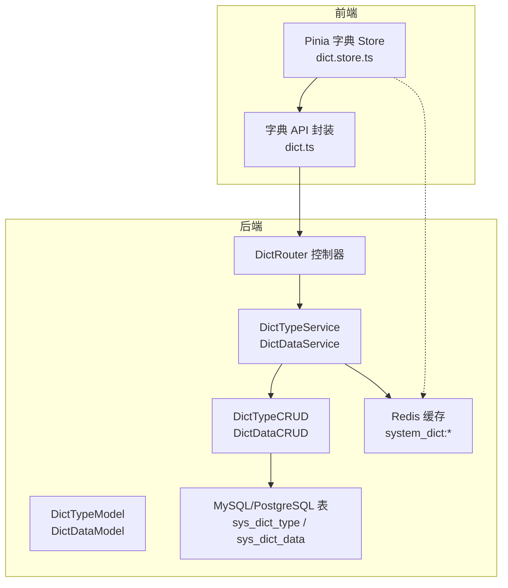
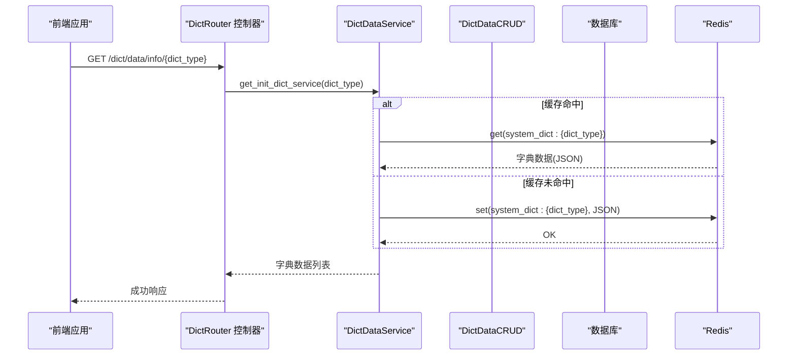
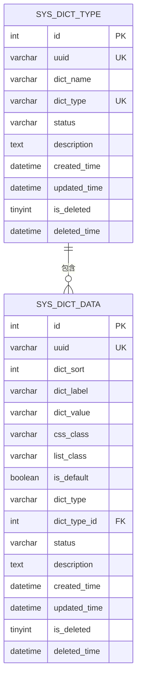
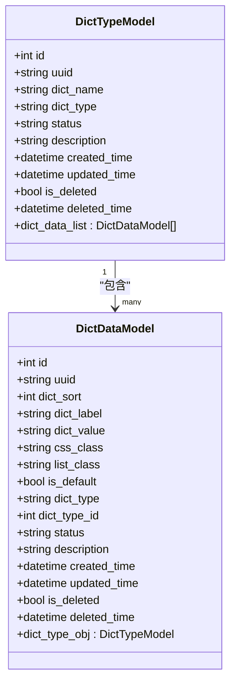
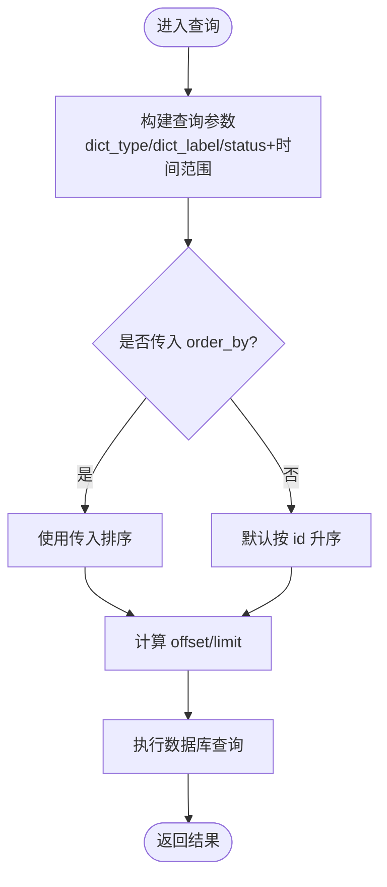
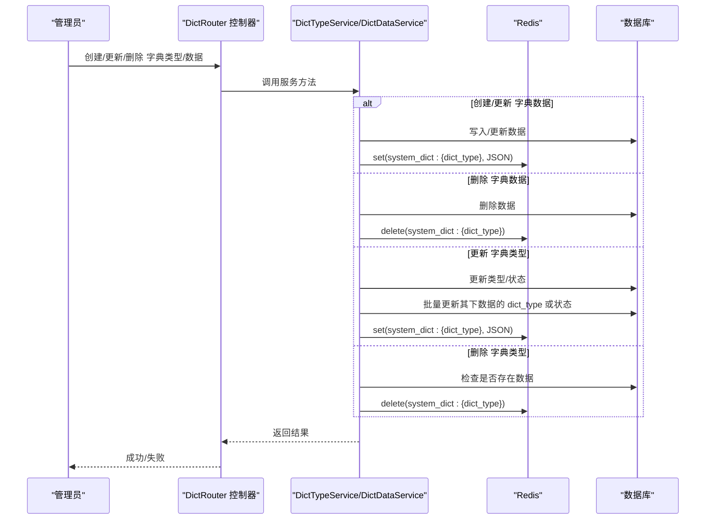
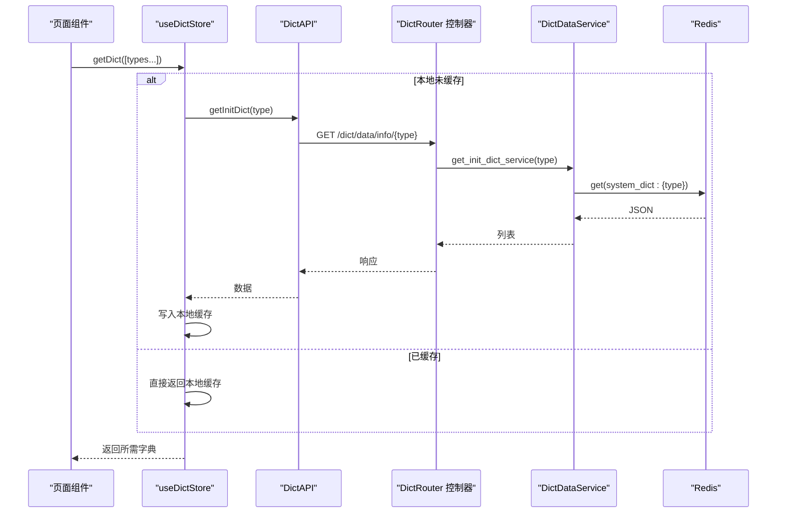
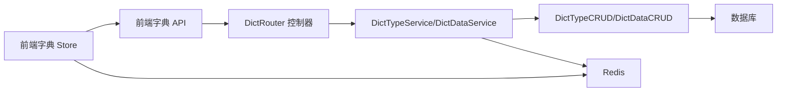

# 字典表设计

<cite>
**本文引用的文件**
- [model.py](file://backend/app/api/v1/module_system/dict/model.py)
- [schema.py](file://backend/app/api/v1/module_system/dict/schema.py)
- [controller.py](file://backend/app/api/v1/module_system/dict/controller.py)
- [service.py](file://backend/app/api/v1/module_system/dict/service.py)
- [crud.py](file://backend/app/api/v1/module_system/dict/crud.py)
- [sys_dict_type.json](file://backend/app/scripts/data/sys_dict_type.json)
- [sys_dict_data.json](file://backend/app/scripts/data/sys_dict_data.json)
- [fastapiadmin_2026-04-19_223353.sql](file://backend/sql/mysql/fastapiadmin_2026-04-19_223353.sql)
- [enums.py](file://backend/app/common/enums.py)
- [dict.store.ts](file://frontend/web/src/store/modules/dict.store.ts)
- [dict.ts](file://frontend/web/src/api/module_system/dict.ts)
</cite>

## 目录
1. [引言](#引言)
2. [项目结构](#项目结构)
3. [核心组件](#核心组件)
4. [架构总览](#架构总览)
5. [详细组件分析](#详细组件分析)
6. [依赖分析](#依赖分析)
7. [性能考虑](#性能考虑)
8. [故障排查指南](#故障排查指南)
9. [结论](#结论)
10. [附录](#附录)

## 引言
本文件面向 FastapiAdmin 的“字典表”设计，围绕系统级“字典类型表(sys_dict_type)”与“字典数据表(sys_dict_data)”展开，系统性阐述其数据结构、两级关联关系、排序与分类管理、查询优化、缓存与变更传播策略，以及在系统中的关键作用（枚举值管理、业务参数配置、国际化支持等），并提供管理策略与性能优化建议。

## 项目结构
字典模块位于后端模块系统下，采用标准的 MVC 分层：模型(model)、模式(schema)、控制器(controller)、服务(service)、数据访问(curd)。前端通过 Pinia Store 管理字典缓存，按需从后端接口获取字典数据。

**图表来源**
- [controller.py:28](file://backend/app/api/v1/module_system/dict/controller.py#L28)
- [service.py:27](file://backend/app/api/v1/module_system/dict/service.py#L27)
- [crud.py:14](file://backend/app/api/v1/module_system/dict/crud.py#L14)
- [model.py:7](file://backend/app/api/v1/module_system/dict/model.py#L7)
- [enums.py:42](file://backend/app/common/enums.py#L42)
- [dict.store.ts:41](file://frontend/web/src/store/modules/dict.store.ts#L41)
- [dict.ts:133](file://frontend/web/src/api/module_system/dict.ts#L133)

**章节来源**
- [controller.py:28](file://backend/app/api/v1/module_system/dict/controller.py#L28)
- [service.py:27](file://backend/app/api/v1/module_system/dict/service.py#L27)
- [crud.py:14](file://backend/app/api/v1/module_system/dict/crud.py#L14)
- [model.py:7](file://backend/app/api/v1/module_system/dict/model.py#L7)
- [enums.py:42](file://backend/app/common/enums.py#L42)
- [dict.store.ts:41](file://frontend/web/src/store/modules/dict.store.ts#L41)
- [dict.ts:133](file://frontend/web/src/api/module_system/dict.ts#L133)

## 核心组件
- 字典类型表(sys_dict_type)
  - 唯一标识：自增主键 id；字典类型 dict_type 唯一约束
  - 关键字段：dict_name 名称、status 状态、description 描述
  - 关系：一对多，包含多个字典数据项
- 字典数据表(sys_dict_data)
  - 关键字段：dict_sort 排序、dict_label 标签、dict_value 键值、css_class 样式、list_class 列表样式、is_default 默认标记、dict_type 类型标识、dict_type_id 外键
  - 关系：多对一，归属某个字典类型
- 模式与校验
  - Pydantic 模型对输入进行严格校验，如 dict_type 格式、必填字段、范围限制等
- 控制器与服务
  - 提供 CRUD、分页、导出、状态批量设置、初始化缓存、按类型获取等能力
- 前端存储
  - Pinia Store 缓存字典数据，按需加载，支持批量获取与标签查找

**章节来源**
- [model.py:7](file://backend/app/api/v1/module_system/dict/model.py#L7-L66)
- [schema.py:17](file://backend/app/api/v1/module_system/dict/schema.py#L17-L155)
- [controller.py:31](file://backend/app/api/v1/module_system/dict/controller.py#L31-L529)
- [service.py:27](file://backend/app/api/v1/module_system/dict/service.py#L27-L723)
- [crud.py:14](file://backend/app/api/v1/module_system/dict/crud.py#L14-L286)
- [dict.store.ts:41](file://frontend/web/src/store/modules/dict.store.ts#L41-L152)

## 架构总览
字典模块遵循“控制器-服务-数据访问-模型-数据库”的分层架构，配合 Redis 缓存实现高性能读取与变更传播。

**图表来源**
- [controller.py:501](file://backend/app/api/v1/module_system/dict/controller.py#L501-L529)
- [service.py:424](file://backend/app/api/v1/module_system/dict/service.py#L424-L466)
- [enums.py:42](file://backend/app/common/enums.py#L42)

**章节来源**
- [controller.py:501](file://backend/app/api/v1/module_system/dict/controller.py#L501-L529)
- [service.py:424](file://backend/app/api/v1/module_system/dict/service.py#L424-L466)
- [enums.py:42](file://backend/app/common/enums.py#L42)

## 详细组件分析

### 数据模型与表结构
- 字典类型表(sys_dict_type)
  - 唯一索引：dict_type
  - 字段：dict_name、dict_type、status、description、时间戳等
- 字典数据表(sys_dict_data)
  - 外键：dict_type_id → sys_dict_type.id（级联删除）
  - 索引：dict_type_id、状态、时间、删除标记等
  - 字段：dict_sort、dict_label、dict_value、css_class、list_class、is_default、dict_type、status、description 等

**图表来源**
- [fastapiadmin_2026-04-19_223353.sql:354](file://backend/sql/mysql/fastapiadmin_2026-04-19_223353.sql#L354-L422)
- [model.py:7](file://backend/app/api/v1/module_system/dict/model.py#L7-L66)

**章节来源**
- [fastapiadmin_2026-04-19_223353.sql:354](file://backend/sql/mysql/fastapiadmin_2026-04-19_223353.sql#L354-L422)
- [model.py:7](file://backend/app/api/v1/module_system/dict/model.py#L7-L66)

### 两级结构设计原理
- 字典类型作为“类别”，字典数据作为“键值对”
- 通过 dict_type_id 与 dict_type 字段维持一致性，既便于 ORM 关系维护，也便于业务侧直接按类型查询
- 级联删除保证类型删除时自动清理其下数据，避免脏数据

**图表来源**
- [model.py:7](file://backend/app/api/v1/module_system/dict/model.py#L7-L66)

**章节来源**
- [model.py:7](file://backend/app/api/v1/module_system/dict/model.py#L7-L66)

### 查询与排序规则
- 字典类型查询
  - 支持模糊匹配 dict_name、精确匹配 dict_type/status、时间范围 created_time/updated_time
- 字典数据查询
  - 支持模糊匹配 dict_label、精确匹配 dict_type/dict_type_id/status，时间范围查询
- 排序
  - 字典数据默认按 id 升序；控制器可接收 order_by 参数覆盖
- 分页
  - 基于 offset/limit 的分页查询

**图表来源**
- [schema.py:77](file://backend/app/api/v1/module_system/dict/schema.py#L77-L201)
- [controller.py:304](file://backend/app/api/v1/module_system/dict/controller.py#L304-L340)
- [service.py:344](file://backend/app/api/v1/module_system/dict/service.py#L344-L373)

**章节来源**
- [schema.py:77](file://backend/app/api/v1/module_system/dict/schema.py#L77-L201)
- [controller.py:304](file://backend/app/api/v1/module_system/dict/controller.py#L304-L340)
- [service.py:344](file://backend/app/api/v1/module_system/dict/service.py#L344-L373)

### 缓存机制与变更传播
- 初始化缓存
  - 应用启动或手动触发时，遍历所有字典类型，按类型拉取数据并写入 Redis，键名 pattern 为 system_dict:{dict_type}
- 读取缓存
  - 按类型从 Redis 读取，若不存在或格式异常则重新初始化
- 变更传播
  - 创建/更新/删除字典数据后，刷新对应 dict_type 的缓存键
  - 更新字典类型时，若 dict_type 或状态变更，联动更新其下数据的 dict_type 或状态，并刷新缓存
  - 删除字典类型前检查是否存在数据，存在则禁止删除；删除后清理对应缓存键

**图表来源**
- [service.py:102](file://backend/app/api/v1/module_system/dict/service.py#L102-L214)
- [service.py:469](file://backend/app/api/v1/module_system/dict/service.py#L469-L611)
- [enums.py:42](file://backend/app/common/enums.py#L42)

**章节来源**
- [service.py:102](file://backend/app/api/v1/module_system/dict/service.py#L102-L214)
- [service.py:469](file://backend/app/api/v1/module_system/dict/service.py#L469-L611)
- [enums.py:42](file://backend/app/common/enums.py#L42)

### 前端字典缓存与使用
- Pinia Store
  - 按需加载：首次访问某类型字典时才发起请求
  - 自动去重：过滤无效项，统一输出 {dict_value, dict_label}
  - 持久化：开启持久化，减少重复请求
- API 封装
  - 提供按类型获取字典数据的接口调用封装

**图表来源**
- [dict.store.ts:71](file://frontend/web/src/store/modules/dict.store.ts#L71-L95)
- [dict.ts:133](file://frontend/web/src/api/module_system/dict.ts#L133-L182)
- [controller.py:501](file://backend/app/api/v1/module_system/dict/controller.py#L501-L529)
- [service.py:424](file://backend/app/api/v1/module_system/dict/service.py#L424-L466)

**章节来源**
- [dict.store.ts:71](file://frontend/web/src/store/modules/dict.store.ts#L71-L95)
- [dict.ts:133](file://frontend/web/src/api/module_system/dict.ts#L133-L182)
- [controller.py:501](file://backend/app/api/v1/module_system/dict/controller.py#L501-L529)
- [service.py:424](file://backend/app/api/v1/module_system/dict/service.py#L424-L466)

### 管理策略与最佳实践
- 增删改查
  - 字典类型：支持创建、更新（名称不可变）、删除（需无子项）、批量状态设置、导出
  - 字典数据：支持创建（同类型下 label/value 唯一）、更新（同类型下 label/value 唯一）、删除（系统默认不可删）、批量状态设置、导出
- 排序与分类
  - 通过 dict_sort 控制展示顺序；通过 dict_type 进行分类；通过 is_default 标记默认项
- 缓存策略
  - 读路径：优先 Redis；未命中则回源数据库并回填缓存
  - 写路径：写入数据库后立即刷新对应类型缓存
- 变更传播
  - 类型变更时，联动更新其下数据的 dict_type 或状态，并刷新缓存
- 导入导出
  - 提供 Excel 导出能力，字段映射清晰，便于人工核对与二次处理

**章节来源**
- [controller.py:31](file://backend/app/api/v1/module_system/dict/controller.py#L31-L529)
- [service.py:264](file://backend/app/api/v1/module_system/dict/service.py#L264-L298)
- [service.py:682](file://backend/app/api/v1/module_system/dict/service.py#L682-L722)

## 依赖分析
- 后端依赖
  - Redis：缓存系统字典数据
  - SQLAlchemy：ORM 映射与关系定义
  - Pydantic：请求/响应模型与字段校验
  - ExcelUtil：导出 Excel
- 前端依赖
  - Pinia：状态管理与持久化
  - Axios：HTTP 请求封装

**图表来源**
- [controller.py:26](file://backend/app/api/v1/module_system/dict/controller.py#L26)
- [service.py:14](file://backend/app/api/v1/module_system/dict/service.py#L14)
- [crud.py:11](file://backend/app/api/v1/module_system/dict/crud.py#L11)
- [dict.store.ts:36](file://frontend/web/src/store/modules/dict.store.ts#L36)
- [dict.ts:133](file://frontend/web/src/api/module_system/dict.ts#L133)

**章节来源**
- [controller.py:26](file://backend/app/api/v1/module_system/dict/controller.py#L26)
- [service.py:14](file://backend/app/api/v1/module_system/dict/service.py#L14)
- [crud.py:11](file://backend/app/api/v1/module_system/dict/crud.py#L11)
- [dict.store.ts:36](file://frontend/web/src/store/modules/dict.store.ts#L36)
- [dict.ts:133](file://frontend/web/src/api/module_system/dict.ts#L133)

## 性能考虑
- 索引优化
  - sys_dict_data.dict_type_id 建有索引，保障按类型查询效率
  - 多字段组合索引（状态、时间、删除标记）提升筛选与排序性能
- 缓存命中率
  - Redis 缓存 system_dict:{type}，显著降低数据库压力
  - 初始化时批量写入，避免热点击穿
- 写路径优化
  - 写入数据库后即时刷新缓存，避免读到陈旧数据
  - 批量更新类型时，一次性刷新其下数据缓存
- 分页与排序
  - 明确 order_by 与分页参数，避免全表扫描
- 前端缓存
  - Pinia Store 按需加载与持久化，减少重复请求

[本节为通用指导，无需特定文件引用]

## 故障排查指南
- 缓存异常
  - 现象：前端无法获取字典或显示为空
  - 排查：确认 Redis 中 system_dict:{type} 是否存在；若不存在，触发初始化或检查服务端异常日志
- 写入失败
  - 现象：创建/更新字典数据报唯一性冲突
  - 排查：检查同类型下 dict_label 或 dict_value 是否重复；确认 dict_type_id 是否正确
- 删除受限
  - 现象：删除字典类型提示存在子项
  - 排查：确认该类型下是否存在数据；系统默认数据不可删除
- 导出异常
  - 现象：导出 Excel 失败或内容异常
  - 排查：检查字段映射与状态转换逻辑；确认 ExcelUtil 正常

**章节来源**
- [service.py:424](file://backend/app/api/v1/module_system/dict/service.py#L424-L466)
- [service.py:469](file://backend/app/api/v1/module_system/dict/service.py#L469-L611)
- [service.py:264](file://backend/app/api/v1/module_system/dict/service.py#L264-L298)
- [service.py:682](file://backend/app/api/v1/module_system/dict/service.py#L682-L722)

## 结论
字典表通过“类型-数据”的两级结构实现了灵活的枚举与配置管理，结合 Redis 缓存与严格的变更传播策略，兼顾了易用性与性能。前端 Pinia Store 的按需缓存进一步降低了网络与数据库压力。建议在生产环境中持续监控缓存命中率与数据库慢查询，定期评估索引与排序策略，确保系统稳定高效运行。

## 附录
- 示例数据
  - 字典类型示例：用户性别、系统是否、系统状态、通知类型、操作类型、任务存储器、任务执行器、任务函数、任务触发器、表格回显样式
  - 字典数据示例：性别男/女/未知；是/否；启用/停用；通知/公告；各类操作类型；任务存储器/执行器/触发器；表格样式等
- 关键字段说明
  - dict_sort：控制展示顺序
  - is_default：标记默认项
  - dict_type/dict_type_id：类型标识与外键
  - css_class/list_class：前端样式扩展

**章节来源**
- [sys_dict_type.json:1](file://backend/app/scripts/data/sys_dict_type.json#L1-L63)
- [sys_dict_data.json:1](file://backend/app/scripts/data/sys_dict_data.json#L1-L410)