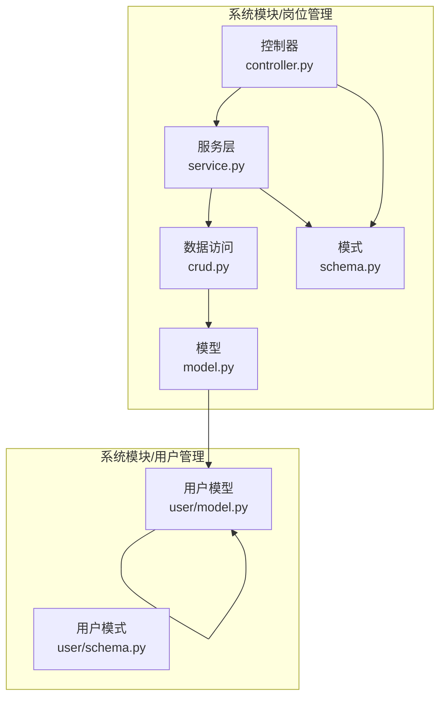
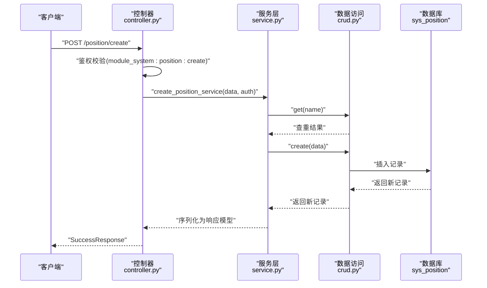
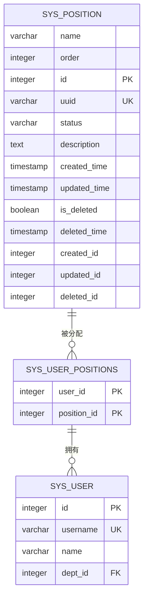
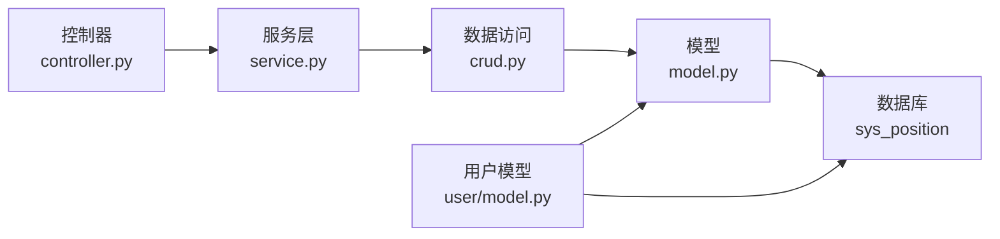

# 岗位表设计

<cite>
**本文档引用的文件**
- [model.py](file://backend/app/api/v1/module_system/position/model.py)
- [schema.py](file://backend/app/api/v1/module_system/position/schema.py)
- [controller.py](file://backend/app/api/v1/module_system/position/controller.py)
- [service.py](file://backend/app/api/v1/module_system/position/service.py)
- [crud.py](file://backend/app/api/v1/module_system/position/crud.py)
- [user/model.py](file://backend/app/api/v1/module_system/user/model.py)
- [user/schema.py](file://backend/app/api/v1/module_system/user/schema.py)
- [fastapiadmin_2026-04-19_224727.sql](file://backend/sql/postgres/fastapiadmin_2026-04-19_224727.sql)
</cite>

## 目录
1. [简介](#简介)
2. [项目结构](#项目结构)
3. [核心组件](#核心组件)
4. [架构总览](#架构总览)
5. [详细组件分析](#详细组件分析)
6. [依赖关系分析](#依赖关系分析)
7. [性能考虑](#性能考虑)
8. [故障排查指南](#故障排查指南)
9. [结论](#结论)
10. [附录](#附录)

## 简介
本文件围绕 FastapiAdmin 中的岗位表（sys_position）进行系统化设计说明，覆盖字段语义、业务含义、与用户的关联关系、在人员管理与权限控制中的作用、典型业务场景支撑能力、管理策略（创建/调整/合并等）、以及性能优化与查询优化策略。目标是帮助产品、研发与运维人员准确理解岗位表的设计与使用方式。

## 项目结构
岗位表位于系统模块的“系统管理”子模块下，采用标准的分层架构：控制器（Controller）负责接口路由与鉴权校验，服务（Service）封装业务流程，数据访问（CRUD）封装数据库操作，模型（Model）映射 SQLAlchemy ORM，模式（Schema）定义输入输出结构。用户与岗位通过中间表（sys_user_positions）建立多对多关系。



图示来源
- [controller.py:23-222](file://backend/app/api/v1/module_system/position/controller.py#L23-L222)
- [service.py:15-201](file://backend/app/api/v1/module_system/position/service.py#L15-L201)
- [crud.py:11-90](file://backend/app/api/v1/module_system/position/crud.py#L11-L90)
- [model.py:12-29](file://backend/app/api/v1/module_system/position/model.py#L12-L29)
- [schema.py:9-77](file://backend/app/api/v1/module_system/position/schema.py#L9-L77)
- [user/model.py:40-131](file://backend/app/api/v1/module_system/user/model.py#L40-L131)

章节来源
- [controller.py:23-222](file://backend/app/api/v1/module_system/position/controller.py#L23-L222)
- [service.py:15-201](file://backend/app/api/v1/module_system/position/service.py#L15-L201)
- [crud.py:11-90](file://backend/app/api/v1/module_system/position/crud.py#L11-L90)
- [model.py:12-29](file://backend/app/api/v1/module_system/position/model.py#L12-L29)
- [schema.py:9-77](file://backend/app/api/v1/module_system/position/schema.py#L9-L77)
- [user/model.py:40-131](file://backend/app/api/v1/module_system/user/model.py#L40-L131)

## 核心组件
- 岗位模型（PositionModel）
  - 表名：sys_position
  - 核心字段：name（岗位名称）、order（显示排序）
  - 关系：与用户通过中间表 sys_user_positions 建立多对多关系
- 岗位模式（Schema）
  - 输入：创建/更新/查询参数
  - 输出：响应模型，包含基础审计字段与创建/更新人信息
- 控制器（Controller）
  - 提供列表、详情、创建、更新、删除、批量状态变更、导出等接口
  - 使用权限依赖进行鉴权
- 服务（Service）
  - 封装业务逻辑：去重校验、分页查询、导出映射、状态切换
- CRUD（数据访问）
  - 统一封装查询、分页、批量状态设置、按ID列表取名称等

章节来源
- [model.py:12-29](file://backend/app/api/v1/module_system/position/model.py#L12-L29)
- [schema.py:9-77](file://backend/app/api/v1/module_system/position/schema.py#L9-L77)
- [controller.py:26-222](file://backend/app/api/v1/module_system/position/controller.py#L26-L222)
- [service.py:15-201](file://backend/app/api/v1/module_system/position/service.py#L15-L201)
- [crud.py:11-90](file://backend/app/api/v1/module_system/position/crud.py#L11-L90)

## 架构总览
岗位管理的端到端调用链如下：



图示来源
- [controller.py:87-110](file://backend/app/api/v1/module_system/position/controller.py#L87-L110)
- [service.py:90-106](file://backend/app/api/v1/module_system/position/service.py#L90-L106)
- [crud.py:11-26](file://backend/app/api/v1/module_system/position/crud.py#L11-L26)

## 详细组件分析

### 数据模型与字段设计
- 表：sys_position
  - 名称：name（varchar(64)，必填，注释：岗位名称）
  - 显示排序：order（integer，必填，默认1，注释：显示排序）
  - 状态：status（varchar(10)，注释：0正常 1禁用）
  - 描述：description（text，注释：备注/描述）
  - 审计字段：created_time、updated_time、deleted_time
  - 关联字段：created_id、updated_id、deleted_id
  - 主键：id（自增序列）
  - 唯一标识：uuid（唯一索引）

- 关系设计
  - 岗位与用户：多对多，通过中间表 sys_user_positions 维护
  - 用户模型中包含 positions 关系，用于反向回溯岗位集合



图示来源
- [fastapiadmin_2026-04-19_224727.sql:2263-2277](file://backend/sql/postgres/fastapiadmin_2026-04-19_224727.sql#L2263-L2277)
- [user/model.py:40-61](file://backend/app/api/v1/module_system/user/model.py#L40-L61)
- [model.py:17-29](file://backend/app/api/v1/module_system/position/model.py#L17-L29)

章节来源
- [fastapiadmin_2026-04-19_224727.sql:2263-2377](file://backend/sql/postgres/fastapiadmin_2026-04-19_224727.sql#L2263-L2377)
- [user/model.py:40-61](file://backend/app/api/v1/module_system/user/model.py#L40-L61)
- [model.py:12-29](file://backend/app/api/v1/module_system/position/model.py#L12-L29)

### 字段业务含义与约束
- 岗位名称（name）
  - 业务含义：岗位的正式名称，用于展示与识别
  - 约束：必填且长度限制；创建/更新时进行非空校验
- 显示排序（order）
  - 业务含义：用于界面排序与展示优先级
  - 约束：必填，最小值≥1
- 状态（status）
  - 业务含义：岗位启用/禁用状态
  - 约束：枚举值（0正常 1禁用），支持批量设置
- 描述（description）
  - 业务含义：岗位职责说明或备注
  - 约束：最大长度限制
- 审计字段
  - 用于追踪创建、更新、删除的时间与责任人

章节来源
- [schema.py:9-24](file://backend/app/api/v1/module_system/position/schema.py#L9-L24)
- [schema.py:36-77](file://backend/app/api/v1/module_system/position/schema.py#L36-L77)
- [fastapiadmin_2026-04-19_224727.sql:2290-2328](file://backend/sql/postgres/fastapiadmin_2026-04-19_224727.sql#L2290-L2328)

### 与用户的关联关系
- 多对多关系
  - 一个岗位可分配给多个用户；一个用户可拥有多个岗位
  - 关联表：sys_user_positions（user_id、position_id）
- 用户模型中的 positions 关系
  - 支持在查询用户时预加载其岗位集合，减少 N+1 查询风险
- 在用户创建/更新时，可通过 position_ids 字段维护岗位分配

```mermaid
classDiagram
class PositionModel {
+name : str
+order : int
+users : list<UserModel>
}
class UserModel {
+username : str
+positions : list<PositionModel>
}
class UserPositionsModel {
+user_id : int
+position_id : int
}
PositionModel "1" --o{ UserPositionsModel : "通过中间表关联"
UserModel "1" --o{ UserPositionsModel : "通过中间表关联"
```

图示来源
- [model.py:24-29](file://backend/app/api/v1/module_system/position/model.py#L24-L29)
- [user/model.py:129-131](file://backend/app/api/v1/module_system/user/model.py#L129-L131)
- [user/model.py:40-61](file://backend/app/api/v1/module_system/user/model.py#L40-L61)

章节来源
- [model.py:24-29](file://backend/app/api/v1/module_system/position/model.py#L24-L29)
- [user/model.py:129-131](file://backend/app/api/v1/module_system/user/model.py#L129-L131)
- [user/model.py:40-61](file://backend/app/api/v1/module_system/user/model.py#L40-L61)

### 业务应用场景
- 人员岗位分配
  - 通过用户创建/更新接口传入 position_ids，完成岗位分配
  - 支持批量导入/导出岗位与用户对应关系
- 薪资管理
  - 岗位作为薪酬体系的基础维度之一，可用于薪资套档、补贴系数等配置
- 绩效考核
  - 岗位作为评价主体维度，结合 KPI/OKR 等指标进行评估
- 权限控制
  - 岗位可作为权限矩阵的一部分，配合角色/部门形成复合权限模型
- 报表统计
  - 按岗位维度统计人员分布、离职率、晋升趋势等

章节来源
- [user/schema.py:229-230](file://backend/app/api/v1/module_system/user/schema.py#L229-L230)
- [controller.py:189-222](file://backend/app/api/v1/module_system/position/controller.py#L189-L222)

### 管理策略
- 创建
  - 校验名称唯一性；失败抛出自定义异常
- 调整
  - 更新时校验名称唯一性（排除自身ID）
- 合并
  - 建议通过“批量删除+重新分配”的方式实现，避免直接改名导致历史数据错配
- 状态管理
  - 支持批量启用/停用；状态变更不影响已分配用户
- 导出
  - 支持导出岗位列表，包含状态、创建/更新时间、创建者等字段

章节来源
- [service.py:90-130](file://backend/app/api/v1/module_system/position/service.py#L90-L130)
- [service.py:151-166](file://backend/app/api/v1/module_system/position/service.py#L151-L166)
- [controller.py:189-222](file://backend/app/api/v1/module_system/position/controller.py#L189-L222)

### 查询与排序逻辑
- 默认排序：按显示排序（order）升序
- 支持自定义排序：前端可传入 order_by 参数
- 查询参数：名称模糊匹配、状态精确匹配、时间范围匹配、创建/更新人过滤

章节来源
- [controller.py:48-59](file://backend/app/api/v1/module_system/position/controller.py#L48-L59)
- [schema.py:36-77](file://backend/app/api/v1/module_system/position/schema.py#L36-L77)

## 依赖关系分析
- 控制器依赖服务层进行业务处理，并使用权限依赖进行鉴权
- 服务层依赖 CRUD 进行数据访问
- CRUD 基于通用基类封装常用操作
- 模型依赖 SQLAlchemy ORM 映射数据库表
- 用户模型与岗位模型通过中间表建立多对多关系



图示来源
- [controller.py:15-21](file://backend/app/api/v1/module_system/position/controller.py#L15-L21)
- [service.py:1-12](file://backend/app/api/v1/module_system/position/service.py#L1-L12)
- [crud.py:1-8](file://backend/app/api/v1/module_system/position/crud.py#L1-L8)
- [model.py:1-6](file://backend/app/api/v1/module_system/position/model.py#L1-L6)
- [user/model.py:1-14](file://backend/app/api/v1/module_system/user/model.py#L1-L14)

章节来源
- [controller.py:15-21](file://backend/app/api/v1/module_system/position/controller.py#L15-L21)
- [service.py:1-12](file://backend/app/api/v1/module_system/position/service.py#L1-L12)
- [crud.py:1-8](file://backend/app/api/v1/module_system/position/crud.py#L1-L8)
- [model.py:1-6](file://backend/app/api/v1/module_system/position/model.py#L1-L6)
- [user/model.py:1-14](file://backend/app/api/v1/module_system/user/model.py#L1-L14)

## 性能考虑
- 索引建议
  - 已有索引：id、uuid（唯一）、status、created_id、updated_id、created_time、updated_time、deleted_id、deleted_time、is_deleted
  - 建议：如频繁按 name 模糊查询，可考虑在 name 上建立索引或使用全文检索；按 order 排序已具备索引支持
- 查询优化
  - 使用 selectin 加载策略预加载关联关系，减少 N+1 查询
  - 分页查询使用 OFFSET/LIMIT，建议结合复合索引（如 status + created_time）优化大表分页
- 写入优化
  - 批量状态变更使用单次事务执行，减少往返开销
- 缓存策略
  - 对热点岗位名称/排序结果可做轻量缓存，降低高频读取压力

章节来源
- [fastapiadmin_2026-04-19_224727.sql:5650-5716](file://backend/sql/postgres/fastapiadmin_2026-04-19_224727.sql#L5650-L5716)
- [model.py:19-29](file://backend/app/api/v1/module_system/position/model.py#L19-L29)
- [service.py:58-87](file://backend/app/api/v1/module_system/position/service.py#L58-L87)

## 故障排查指南
- 创建失败：岗位名称重复
  - 现象：抛出自定义异常
  - 处理：检查是否存在同名岗位，必要时调整名称
- 更新失败：岗位不存在或名称冲突
  - 现象：抛出自定义异常
  - 处理：确认ID存在性；若修改名称，确保不与其他岗位重复
- 删除失败：ID不存在
  - 现象：抛出自定义异常
  - 处理：核对传入ID列表
- 导出异常：无数据或状态映射问题
  - 现象：导出内容为空或状态显示异常
  - 处理：检查查询参数与状态值映射逻辑

章节来源
- [service.py:101-105](file://backend/app/api/v1/module_system/position/service.py#L101-L105)
- [service.py:122-129](file://backend/app/api/v1/module_system/position/service.py#L122-L129)
- [service.py:143-149](file://backend/app/api/v1/module_system/position/service.py#L143-L149)
- [service.py:168-201](file://backend/app/api/v1/module_system/position/service.py#L168-L201)

## 结论
sys_position 表设计简洁明确，字段覆盖岗位管理核心需求，配合中间表实现了与用户的灵活多对多关系。通过统一的分层架构与完善的校验逻辑，保障了业务正确性与可维护性。建议在实际使用中关注索引与分页性能，结合业务场景完善缓存与监控策略，持续优化用户体验与系统稳定性。

## 附录
- 数据库脚本关键片段（字段与索引）
  - sys_position 表结构与注释
  - sys_user_positions 外键约束
  - sys_position 索引集合

章节来源
- [fastapiadmin_2026-04-19_224727.sql:2263-2377](file://backend/sql/postgres/fastapiadmin_2026-04-19_224727.sql#L2263-L2377)
- [fastapiadmin_2026-04-19_224727.sql:5650-5716](file://backend/sql/postgres/fastapiadmin_2026-04-19_224727.sql#L5650-L5716)
- [fastapiadmin_2026-04-19_224727.sql:6449-6461](file://backend/sql/postgres/fastapiadmin_2026-04-19_224727.sql#L6449-L6461)