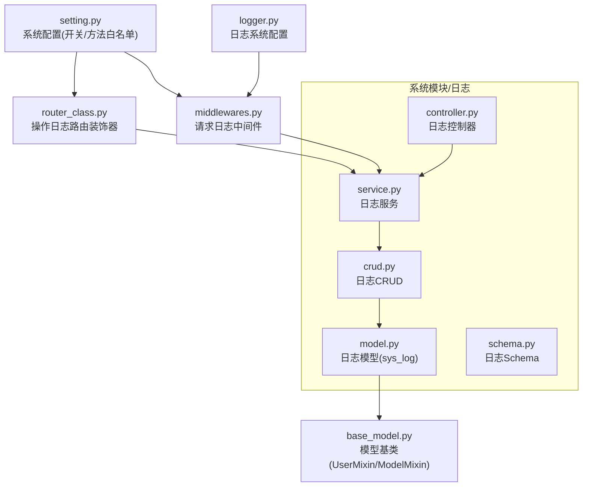
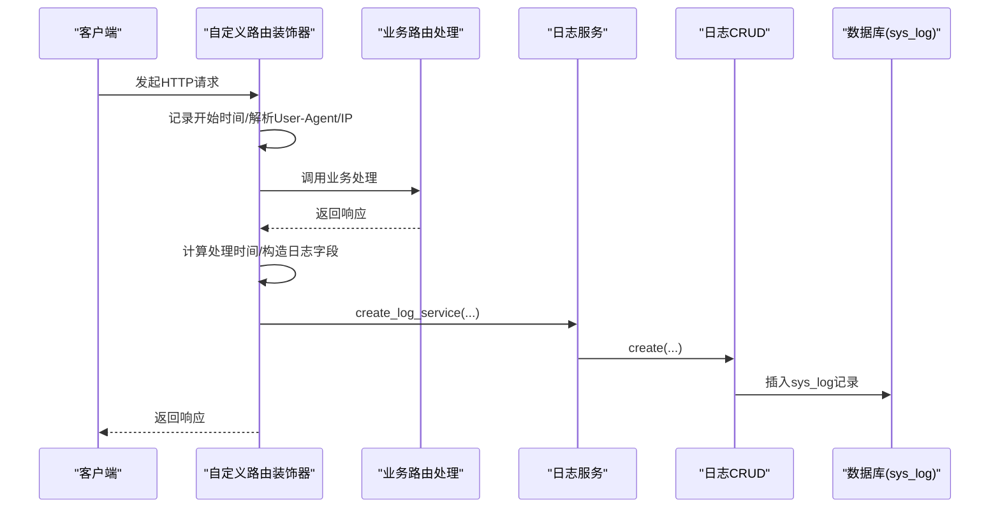
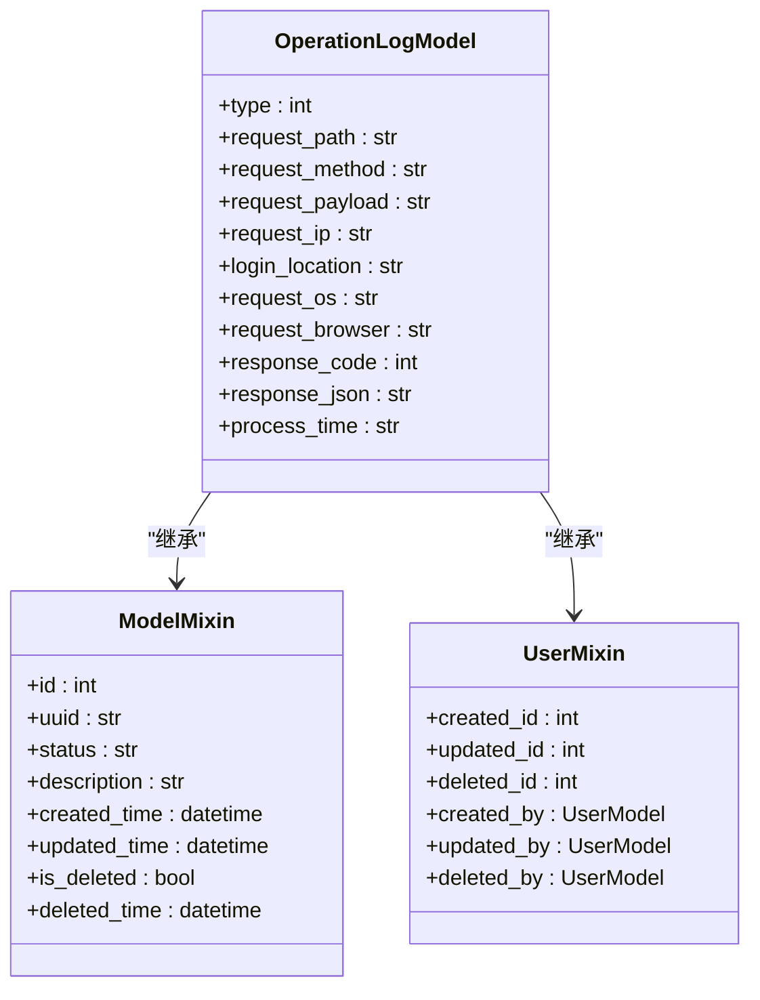
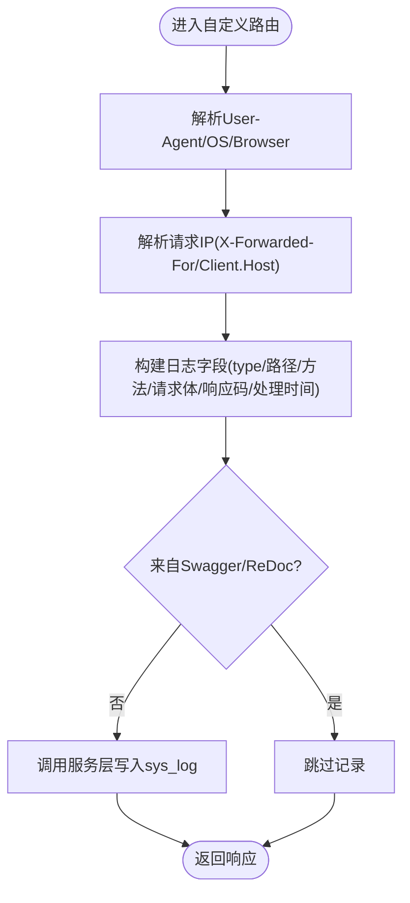
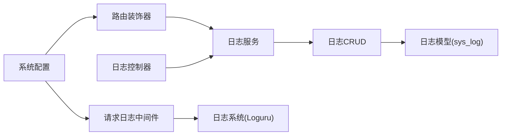

# 日志表设计

<cite>
**本文引用的文件**   
- [backend/app/api/v1/module_system/log/model.py](file://backend/app/api/v1/module_system/log/model.py)
- [backend/app/api/v1/module_system/log/schema.py](file://backend/app/api/v1/module_system/log/schema.py)
- [backend/app/api/v1/module_system/log/controller.py](file://backend/app/api/v1/module_system/log/controller.py)
- [backend/app/api/v1/module_system/log/service.py](file://backend/app/api/v1/module_system/log/service.py)
- [backend/app/api/v1/module_system/log/crud.py](file://backend/app/api/v1/module_system/log/crud.py)
- [backend/app/core/router_class.py](file://backend/app/core/router_class.py)
- [backend/app/core/middlewares.py](file://backend/app/core/middlewares.py)
- [backend/app/core/logger.py](file://backend/app/core/logger.py)
- [backend/app/core/base_model.py](file://backend/app/core/base_model.py)
- [backend/app/config/setting.py](file://backend/app/config/setting.py)
- [backend/app/common/enums.py](file://backend/app/common/enums.py)
</cite>

## 目录
1. [引言](#引言)
2. [项目结构](#项目结构)
3. [核心组件](#核心组件)
4. [架构总览](#架构总览)
5. [详细组件分析](#详细组件分析)
6. [依赖分析](#依赖分析)
7. [性能考量](#性能考量)
8. [故障排查指南](#故障排查指南)
9. [结论](#结论)
10. [附录](#附录)

## 引言
本文件围绕 FastapiAdmin 的系统日志表（sys_log）进行系统化设计说明，涵盖字段设计、分类管理、采集与存储策略、系统监控与审计价值、管理策略（生命周期、存储与查询优化、分析工具集成）、性能优化与数据安全考虑。目标是帮助开发者与运维人员准确理解日志表的结构与使用方式，并据此制定合理的日志治理与运维策略。

## 项目结构
日志相关能力主要分布在后端模块的“系统模块/日志”子模块，配合路由装饰器、中间件与通用模型基类共同完成日志的采集、持久化与查询展示。

图示来源
- [backend/app/api/v1/module_system/log/model.py:30-53](file://backend/app/api/v1/module_system/log/model.py#L30-L53)
- [backend/app/api/v1/module_system/log/schema.py:11-29](file://backend/app/api/v1/module_system/log/schema.py#L11-L29)
- [backend/app/api/v1/module_system/log/controller.py:17-137](file://backend/app/api/v1/module_system/log/controller.py#L17-L137)
- [backend/app/api/v1/module_system/log/service.py:13-168](file://backend/app/api/v1/module_system/log/service.py#L13-L168)
- [backend/app/api/v1/module_system/log/crud.py:10-75](file://backend/app/api/v1/module_system/log/crud.py#L10-L75)
- [backend/app/core/router_class.py:24-164](file://backend/app/core/router_class.py#L24-L164)
- [backend/app/core/middlewares.py:36-204](file://backend/app/core/middlewares.py#L36-L204)
- [backend/app/core/logger.py:71-147](file://backend/app/core/logger.py#L71-L147)
- [backend/app/core/base_model.py:40-228](file://backend/app/core/base_model.py#L40-L228)
- [backend/app/config/setting.py:153-162](file://backend/app/config/setting.py#L153-L162)

章节来源
- [backend/app/api/v1/module_system/log/model.py:30-53](file://backend/app/api/v1/module_system/log/model.py#L30-L53)
- [backend/app/api/v1/module_system/log/schema.py:11-29](file://backend/app/api/v1/module_system/log/schema.py#L11-L29)
- [backend/app/api/v1/module_system/log/controller.py:17-137](file://backend/app/api/v1/module_system/log/controller.py#L17-L137)
- [backend/app/api/v1/module_system/log/service.py:13-168](file://backend/app/api/v1/module_system/log/service.py#L13-L168)
- [backend/app/api/v1/module_system/log/crud.py:10-75](file://backend/app/api/v1/module_system/log/crud.py#L10-L75)
- [backend/app/core/router_class.py:24-164](file://backend/app/core/router_class.py#L24-L164)
- [backend/app/core/middlewares.py:36-204](file://backend/app/core/middlewares.py#L36-L204)
- [backend/app/core/logger.py:71-147](file://backend/app/core/logger.py#L71-L147)
- [backend/app/core/base_model.py:40-228](file://backend/app/core/base_model.py#L40-L228)
- [backend/app/config/setting.py:153-162](file://backend/app/config/setting.py#L153-L162)

## 核心组件
- 日志模型（sys_log）：定义日志表结构，包含日志类型、请求路径、方法、请求体、响应状态码、处理时间、IP、登录位置、操作系统、浏览器等字段，并继承通用审计字段。
- Schema：定义创建与查询参数的校验规则，如日志类型仅允许1/2、请求方法白名单、IP格式校验等。
- 控制器：提供日志列表查询、详情查询、删除、导出等接口。
- 服务层：封装分页、列表、详情、创建、删除、导出等业务逻辑。
- CRUD：基于通用CRUDBase实现日志的增删改查。
- 路由装饰器：在路由处理前后统一采集请求/响应信息并写入日志。
- 中间件：记录请求/响应日志、处理时间、拦截演示模式下的非GET请求等。
- 日志系统：基于Loguru的统一日志配置，支持控制台与文件输出、轮转与保留策略。
- 配置：系统配置中包含是否记录操作日志、忽略记录的方法、需要记录的请求方法等。

章节来源
- [backend/app/api/v1/module_system/log/model.py:30-53](file://backend/app/api/v1/module_system/log/model.py#L30-L53)
- [backend/app/api/v1/module_system/log/schema.py:11-29](file://backend/app/api/v1/module_system/log/schema.py#L11-L29)
- [backend/app/api/v1/module_system/log/controller.py:17-137](file://backend/app/api/v1/module_system/log/controller.py#L17-L137)
- [backend/app/api/v1/module_system/log/service.py:13-168](file://backend/app/api/v1/module_system/log/service.py#L13-L168)
- [backend/app/api/v1/module_system/log/crud.py:10-75](file://backend/app/api/v1/module_system/log/crud.py#L10-L75)
- [backend/app/core/router_class.py:24-164](file://backend/app/core/router_class.py#L24-L164)
- [backend/app/core/middlewares.py:36-204](file://backend/app/core/middlewares.py#L36-L204)
- [backend/app/core/logger.py:71-147](file://backend/app/core/logger.py#L71-L147)
- [backend/app/config/setting.py:153-162](file://backend/app/config/setting.py#L153-L162)

## 架构总览
日志采集与落库的整体流程如下：

图示来源
- [backend/app/core/router_class.py:27-164](file://backend/app/core/router_class.py#L27-L164)
- [backend/app/api/v1/module_system/log/service.py:91-104](file://backend/app/api/v1/module_system/log/service.py#L91-L104)
- [backend/app/api/v1/module_system/log/crud.py:30-40](file://backend/app/api/v1/module_system/log/crud.py#L30-L40)
- [backend/app/api/v1/module_system/log/model.py:30-53](file://backend/app/api/v1/module_system/log/model.py#L30-L53)

## 详细组件分析

### 日志表字段设计与作用说明
- 表名与注释：sys_log，表注释为“系统日志表”，用于统一记录登录与操作两类日志。
- 字段说明（核心字段与设计考虑）：
  - 类型（type）：整型，1表示登录日志，2表示操作日志。用于区分日志类别，便于分类统计与展示。
  - 请求路径（request_path）：字符串，记录请求的具体路径，便于定位接口与行为轨迹。
  - 请求方法（request_method）：字符串，记录HTTP方法（GET/POST/PUT/DELETE等），用于审计请求类型。
  - 请求体（request_payload）：根据数据库类型选择列类型（MySQL使用LONGTEXT，PostgreSQL使用TEXT，其他回退为Text），用于记录请求参数，注意敏感信息脱敏。
  - 请求IP（request_ip）：字符串，记录客户端IP，优先取X-Forwarded-For首段，其次取request.client.host。
  - 登录位置（login_location）：字符串，通过IP归属地解析得到，便于可视化展示登录来源。
  - 操作系统（request_os）：字符串，解析User-Agent得到，辅助分析设备/系统分布。
  - 浏览器（request_browser）：字符串，解析User-Agent得到，辅助分析浏览器分布。
  - 响应状态码（response_code）：整型，记录HTTP状态码，用于快速识别成功/失败。
  - 响应体（response_json）：与请求体类似，记录响应JSON，注意敏感信息脱敏。
  - 处理时间（process_time）：字符串，记录路由处理耗时，便于性能分析。
  - 审计字段：继承自UserMixin与ModelMixin，包含创建人、更新人、创建时间、更新时间、软删除等，便于审计与权限控制。

章节来源
- [backend/app/api/v1/module_system/log/model.py:30-53](file://backend/app/api/v1/module_system/log/model.py#L30-L53)
- [backend/app/core/base_model.py:40-228](file://backend/app/core/base_model.py#L40-L228)

### 日志分类管理机制
- 登录日志（type=1）与操作日志（type=2）：
  - 登录日志：当请求来自登录接口时，type=1；否则根据是否存在user_id判定为操作日志（type=2）。
  - 路由装饰器在处理请求前后自动判断日志类型，并填充相应字段。
- 收集与存储策略：
  - 路由装饰器在请求完成后计算处理时间、解析User-Agent与IP、调用服务层写入sys_log。
  - 中间件负责记录请求/响应日志与拦截演示模式下的非GET请求，作为系统安全审计的一部分。
  - 配置中可通过开关与方法白名单控制是否记录操作日志与需要记录的方法集合。

章节来源
- [backend/app/core/router_class.py:108-160](file://backend/app/core/router_class.py#L108-L160)
- [backend/app/config/setting.py:153-162](file://backend/app/config/setting.py#L153-L162)
- [backend/app/core/middlewares.py:150-185](file://backend/app/core/middlewares.py#L150-L185)

### 日志查询与导出
- 控制器提供：
  - 列表查询：支持分页、排序、多字段查询（类型、请求路径、方法、IP、状态码、描述、时间范围、创建/更新人等）。
  - 详情查询：按ID查询单条日志。
  - 删除：批量删除日志。
  - 导出：将查询结果导出为Excel。
- 服务层与CRUD：
  - 服务层封装分页、列表、详情、创建、删除、导出等逻辑。
  - CRUD基于通用CRUDBase实现，支持搜索、排序、预加载等。

章节来源
- [backend/app/api/v1/module_system/log/controller.py:20-137](file://backend/app/api/v1/module_system/log/controller.py#L20-L137)
- [backend/app/api/v1/module_system/log/schema.py:67-118](file://backend/app/api/v1/module_system/log/schema.py#L67-L118)
- [backend/app/api/v1/module_system/log/service.py:13-168](file://backend/app/api/v1/module_system/log/service.py#L13-L168)
- [backend/app/api/v1/module_system/log/crud.py:10-75](file://backend/app/api/v1/module_system/log/crud.py#L10-L75)

### 日志模型类图

图示来源
- [backend/app/api/v1/module_system/log/model.py:30-53](file://backend/app/api/v1/module_system/log/model.py#L30-L53)
- [backend/app/core/base_model.py:40-228](file://backend/app/core/base_model.py#L40-L228)

### 日志采集流程（路由装饰器）

图示来源
- [backend/app/core/router_class.py:128-160](file://backend/app/core/router_class.py#L128-L160)

### 日志查询参数与校验
- 查询参数支持：
  - 精确匹配：类型、请求方法、请求IP、响应状态码、状态、创建/更新人ID。
  - 模糊匹配：请求路径、描述。
  - 时间范围：创建时间、更新时间。
- 校验规则：
  - 日志类型仅允许1或2。
  - 请求方法必须在白名单集合内。
  - IP需符合IPv4或IPv6格式。

章节来源
- [backend/app/api/v1/module_system/log/schema.py:67-118](file://backend/app/api/v1/module_system/log/schema.py#L67-L118)
- [backend/app/api/v1/module_system/log/schema.py:30-58](file://backend/app/api/v1/module_system/log/schema.py#L30-L58)
- [backend/app/common/enums.py:94-109](file://backend/app/common/enums.py#L94-L109)

## 依赖分析
- 组件耦合：
  - 路由装饰器依赖服务层进行日志写入，服务层依赖CRUD，CRUD依赖模型与数据库会话。
  - 控制器依赖服务层与权限依赖注入，服务层依赖CRUD与Excel导出工具。
  - 中间件与日志系统相互独立但共同服务于系统可观测性。
- 外部依赖：
  - 数据库类型影响请求/响应体字段的列类型选择（MySQL/PostgreSQL/其他）。
  - 配置开关决定是否启用操作日志记录与哪些方法需要记录。
  - IP归属地解析依赖外部HTTP请求（可在配置中开启/关闭）。

图示来源
- [backend/app/core/router_class.py:24-164](file://backend/app/core/router_class.py#L24-L164)
- [backend/app/api/v1/module_system/log/service.py:13-168](file://backend/app/api/v1/module_system/log/service.py#L13-L168)
- [backend/app/api/v1/module_system/log/crud.py:10-75](file://backend/app/api/v1/module_system/log/crud.py#L10-L75)
- [backend/app/api/v1/module_system/log/model.py:30-53](file://backend/app/api/v1/module_system/log/model.py#L30-L53)
- [backend/app/api/v1/module_system/log/controller.py:17-137](file://backend/app/api/v1/module_system/log/controller.py#L17-L137)
- [backend/app/core/middlewares.py:36-204](file://backend/app/core/middlewares.py#L36-L204)
- [backend/app/core/logger.py:71-147](file://backend/app/core/logger.py#L71-L147)
- [backend/app/config/setting.py:153-162](file://backend/app/config/setting.py#L153-L162)

章节来源
- [backend/app/core/router_class.py:24-164](file://backend/app/core/router_class.py#L24-L164)
- [backend/app/api/v1/module_system/log/service.py:13-168](file://backend/app/api/v1/module_system/log/service.py#L13-L168)
- [backend/app/api/v1/module_system/log/crud.py:10-75](file://backend/app/api/v1/module_system/log/crud.py#L10-L75)
- [backend/app/api/v1/module_system/log/model.py:30-53](file://backend/app/api/v1/module_system/log/model.py#L30-L53)
- [backend/app/api/v1/module_system/log/controller.py:17-137](file://backend/app/api/v1/module_system/log/controller.py#L17-L137)
- [backend/app/core/middlewares.py:36-204](file://backend/app/core/middlewares.py#L36-L204)
- [backend/app/core/logger.py:71-147](file://backend/app/core/logger.py#L71-L147)
- [backend/app/config/setting.py:153-162](file://backend/app/config/setting.py#L153-L162)

## 性能考量
- 写入性能：
  - 使用异步数据库会话与事务包裹日志写入，减少IO阻塞。
  - 建议对sys_log建立必要索引（如：created_time、type、request_method、request_ip、response_code）以提升查询效率。
- 存储优化：
  - 请求/响应体采用数据库类型适配的大文本类型，避免过大JSON导致存储膨胀；建议对敏感字段脱敏。
  - 结合配置中的日志轮转与保留策略，定期清理历史日志。
- 查询优化：
  - 列表查询支持分页与多字段精确/模糊/范围查询，建议结合索引与合理分页大小。
  - 导出功能建议限制导出时间范围与条数，避免大表导出造成内存压力。
- 处理时间：
  - 路由装饰器与中间件均计算处理时间并写入响应头，便于前端与监控系统观测。

章节来源
- [backend/app/core/router_class.py:105-106](file://backend/app/core/router_class.py#L105-L106)
- [backend/app/core/middlewares.py:189-192](file://backend/app/core/middlewares.py#L189-L192)
- [backend/app/config/setting.py:153-162](file://backend/app/config/setting.py#L153-L162)

## 故障排查指南
- 日志未入库：
  - 检查系统配置中的开关与方法白名单，确认是否启用了操作日志记录。
  - 确认路由装饰器是否生效（Route class是否正确设置）。
- IP/位置信息为空：
  - 检查X-Forwarded-For头是否正确传递；确认IP归属地解析服务可用。
- 导出异常：
  - 检查导出时间范围与条数限制；确认Excel导出工具可用。
- 中间件拦截：
  - 检查演示模式配置与白名单/黑名单设置，确认拦截原因。

章节来源
- [backend/app/config/setting.py:153-162](file://backend/app/config/setting.py#L153-L162)
- [backend/app/core/router_class.py:137-160](file://backend/app/core/router_class.py#L137-L160)
- [backend/app/core/middlewares.py:150-185](file://backend/app/core/middlewares.py#L150-L185)

## 结论
sys_log日志表通过路由装饰器与中间件实现了对登录与操作两类日志的自动化采集，结合服务层与CRUD层提供了完善的查询、导出与删除能力。在系统监控与审计方面，该表能够支撑用户行为追踪、性能监控与安全审计等关键场景。建议配合索引、脱敏与轮转策略，持续优化日志的存储与查询性能，并完善日志分析工具的集成以提升可观测性。

## 附录

### 字段清单与类型映射（依据模型与配置）
- 类型（type）：整型，1/2分别代表登录/操作日志。
- 请求路径（request_path）：字符串，最大长度255。
- 请求方法（request_method）：字符串，最大长度10。
- 请求体（request_payload）：根据数据库类型选择列类型（MySQL: LONGTEXT；PostgreSQL: TEXT；其他: Text）。
- 请求IP（request_ip）：字符串，最大长度50。
- 登录位置（login_location）：字符串，最大长度255。
- 操作系统（request_os）：字符串，最大长度64。
- 浏览器（request_browser）：字符串，最大长度64。
- 响应状态码（response_code）：整型。
- 响应体（response_json）：与请求体相同的大文本类型。
- 处理时间（process_time）：字符串，最大长度20。
- 审计字段：继承自UserMixin与ModelMixin，包含创建/更新/删除的用户与时间戳。

章节来源
- [backend/app/api/v1/module_system/log/model.py:8-28](file://backend/app/api/v1/module_system/log/model.py#L8-L28)
- [backend/app/api/v1/module_system/log/model.py:42-52](file://backend/app/api/v1/module_system/log/model.py#L42-L52)
- [backend/app/core/base_model.py:70-126](file://backend/app/core/base_model.py#L70-L126)