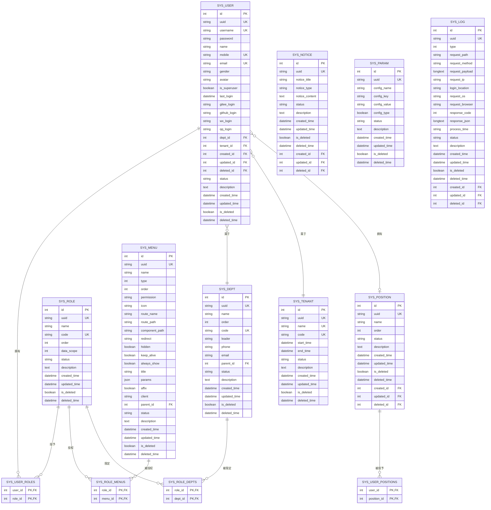
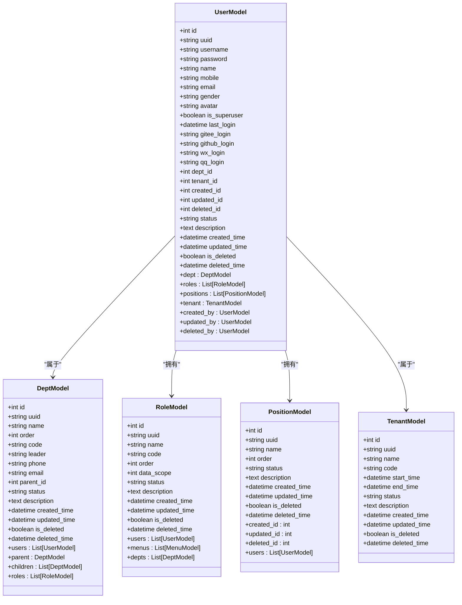
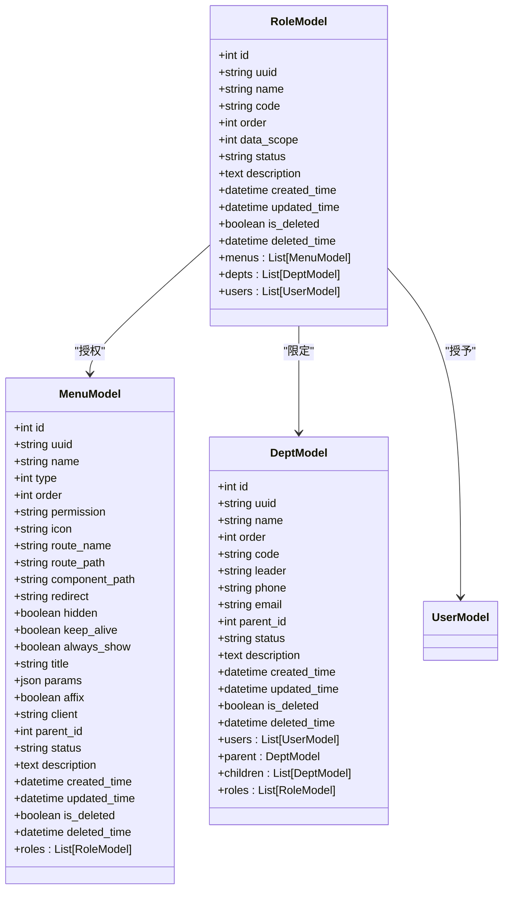
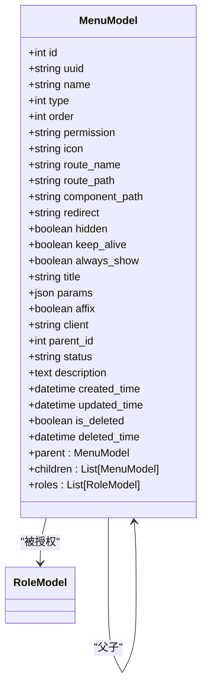
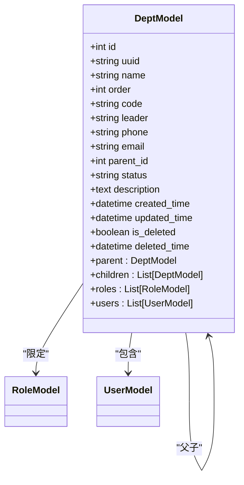
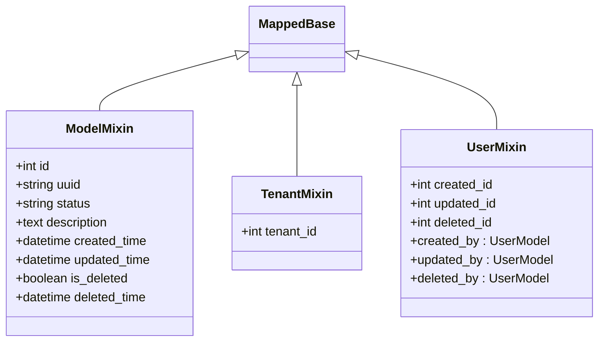
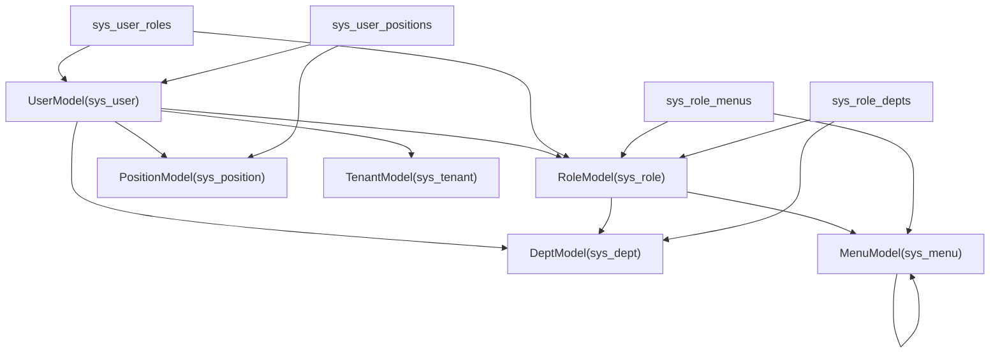

# 核心数据表设计

<cite>
**本文档引用的文件**
- [backend/app/api/v1/module_system/user/model.py](file://backend/app/api/v1/module_system/user/model.py)
- [backend/app/api/v1/module_system/role/model.py](file://backend/app/api/v1/module_system/role/model.py)
- [backend/app/api/v1/module_system/menu/model.py](file://backend/app/api/v1/module_system/menu/model.py)
- [backend/app/api/v1/module_system/dept/model.py](file://backend/app/api/v1/module_system/dept/model.py)
- [backend/app/core/base_model.py](file://backend/app/core/base_model.py)
- [backend/app/common/enums.py](file://backend/app/common/enums.py)
- [backend/sql/mysql/fastapiadmin_2026-04-19_223353.sql](file://backend/sql/mysql/fastapiadmin_2026-04-19_223353.sql)
</cite>

## 目录
1. [简介](#简介)
2. [项目结构](#项目结构)
3. [核心组件](#核心组件)
4. [架构总览](#架构总览)
5. [详细组件分析](#详细组件分析)
6. [依赖分析](#依赖分析)
7. [性能考虑](#性能考虑)
8. [故障排查指南](#故障排查指南)
9. [结论](#结论)

## 简介
本文件为 FastapiAdmin 的核心数据表设计文档，聚焦系统管理相关的关键实体：用户表、角色表、菜单表、部门表。文档从字段定义、数据类型选择、业务含义、表间关联关系、索引策略、软删除与审计字段等方面进行系统化梳理，并提供 ER 图与实体关系图，帮助开发者与运维人员快速理解并正确使用该数据模型。

## 项目结构
本项目采用模块化的后端架构，系统管理模块位于 `backend/app/api/v1/module_system/` 下，核心模型定义在各模块的 `model.py` 文件中；通用的基类与混入类位于 `backend/app/core/base_model.py`；权限过滤策略枚举位于 `backend/app/common/enums.py`；数据库初始化脚本位于 `backend/sql/mysql/`。

```mermaid
graph TB
subgraph "核心模型"
UserModel["UserModel(sys_user)"]
RoleModel["RoleModel(sys_role)"]
MenuModel["MenuModel(sys_menu)"]
DeptModel["DeptModel(sys_dept)"]
end
subgraph "关联表"
UserRoles["sys_user_roles"]
RoleMenus["sys_role_menus"]
RoleDepts["sys_role_depts"]
UserPositions["sys_user_positions"]
end
subgraph "通用基类"
BaseMixins["ModelMixin/TenantMixin/UserMixin"]
end
UserModel --> UserRoles
RoleModel <- --> RoleMenus
DeptModel <- --> RoleDepts
UserModel --> UserPositions
UserModel --> DeptModel
RoleModel --> MenuModel
MenuModel --> MenuModel
UserModel --> BaseMixins
RoleModel --> BaseMixins
MenuModel --> BaseMixins
DeptModel --> BaseMixins
```

**图表来源**
- [backend/app/api/v1/module_system/user/model.py:64-151](file://backend/app/api/v1/module_system/user/model.py#L64-L151)
- [backend/app/api/v1/module_system/role/model.py:64-100](file://backend/app/api/v1/module_system/role/model.py#L64-L100)
- [backend/app/api/v1/module_system/menu/model.py:13-103](file://backend/app/api/v1/module_system/menu/model.py#L13-L103)
- [backend/app/api/v1/module_system/dept/model.py:14-59](file://backend/app/api/v1/module_system/dept/model.py#L14-L59)
- [backend/app/core/base_model.py:40-228](file://backend/app/core/base_model.py#L40-L228)

**章节来源**
- [backend/app/api/v1/module_system/user/model.py:1-151](file://backend/app/api/v1/module_system/user/model.py#L1-151)
- [backend/app/api/v1/module_system/role/model.py:1-100](file://backend/app/api/v1/module_system/role/model.py#L1-100)
- [backend/app/api/v1/module_system/menu/model.py:1-103](file://backend/app/api/v1/module_system/menu/model.py#L1-103)
- [backend/app/api/v1/module_system/dept/model.py:1-59](file://backend/app/api/v1/module_system/dept/model.py#L1-59)
- [backend/app/core/base_model.py:1-228](file://backend/app/core/base_model.py#L1-228)
- [backend/app/common/enums.py:111-122](file://backend/app/common/enums.py#L111-L122)
- [backend/sql/mysql/fastapiadmin_2026-04-19_223353.sql:306-854](file://backend/sql/mysql/fastapiadmin_2026-04-19_223353.sql#L306-L854)

## 核心组件

### 用户表 sys_user
- 主要字段与含义
  - 用户名/登录账号：唯一索引，确保登录唯一性
  - 密码哈希：安全存储，长度适配 bcrypt
  - 昵称：展示用名称
  - 手机号/邮箱：唯一索引，便于找回密码与联系
  - 性别：枚举值（0:男 1:女 2:未知）
  - 头像URL：用户头像地址
  - 是否超管：超级管理员标识
  - 最后登录时间：登录审计
  - 第三方登录标识：Gitee/GitHub/微信/QQ
  - 部门ID：外键关联 sys_dept，支持空值（SET NULL）
  - 租户ID：外键关联 sys_tenant，租户隔离（RESTRICT）
  - 审计字段：created_id/updated_id/deleted_id 自引用外键，均支持空值（SET NULL）
- 约束与索引
  - 主键：id
  - 唯一索引：username、mobile、email、uuid
  - 普通索引：dept_id、tenant_id、created_id、updated_id、deleted_id、updated_time、created_time、is_deleted、status
  - 外键：dept_id → sys_dept(id)（SET NULL）、tenant_id → sys_tenant(id)（RESTRICT）
  - 审计外键：created_id/updated_id/deleted_id → sys_user(id)（SET NULL）

**章节来源**
- [backend/app/api/v1/module_system/user/model.py:64-151](file://backend/app/api/v1/module_system/user/model.py#L64-L151)
- [backend/sql/mysql/fastapiadmin_2026-04-19_223353.sql:806-854](file://backend/sql/mysql/fastapiadmin_2026-04-19_223353.sql#L806-L854)

### 角色表 sys_role
- 主要字段与含义
  - 角色名称：展示名称
  - 角色编码：唯一索引，用于程序识别
  - 显示排序：界面排序
  - 数据权限范围：枚举（1:仅本人 2:本部门 3:本部门及以下 4:全部 5:自定义）
- 约束与索引
  - 主键：id
  - 唯一索引：code、uuid
  - 普通索引：updated_time、created_time、is_deleted、status、deleted_time
- 关联关系
  - 与菜单：多对多（sys_role_menus）
  - 与部门：多对多（sys_role_depts），仅当 data_scope=5 时生效
  - 与用户：多对多（sys_user_roles）

**章节来源**
- [backend/app/api/v1/module_system/role/model.py:64-100](file://backend/app/api/v1/module_system/role/model.py#L64-L100)
- [backend/sql/mysql/fastapiadmin_2026-04-19_223353.sql:677-708](file://backend/sql/mysql/fastapiadmin_2026-04-19_223353.sql#L677-L708)

### 菜单表 sys_menu
- 主要字段与含义
  - 菜单名称、类型（1:目录 2:菜单 3:按钮/权限 4:链接）、排序
  - 权限标识：用于前端与后端权限控制
  - 图标、路由名称/路径、组件路径、重定向
  - 隐藏/缓存/始终显示/标题/路由参数/固定标签页/客户端类型
  - 父菜单ID：自关联树形结构
- 约束与索引
  - 主键：id
  - 唯一索引：uuid
  - 普通索引：parent_id、updated_time、created_time、is_deleted、status、deleted_time
  - 外键：parent_id → sys_menu(id)（SET NULL）
- 关联关系
  - 与角色：多对多（sys_role_menus）

**章节来源**
- [backend/app/api/v1/module_system/menu/model.py:13-103](file://backend/app/api/v1/module_system/menu/model.py#L13-L103)
- [backend/sql/mysql/fastapiadmin_2026-04-19_223353.sql:494-529](file://backend/sql/mysql/fastapiadmin_2026-04-19_223353.sql#L494-L529)

### 部门表 sys_dept
- 主要字段与含义
  - 部门名称、排序、编码（唯一索引）
  - 负责人、电话、邮箱
  - 父部门ID：自关联树形结构
- 约束与索引
  - 主键：id
  - 唯一索引：code、uuid
  - 普通索引：parent_id、updated_time、created_time、is_deleted、status、deleted_time
  - 外键：parent_id → sys_dept(id)（SET NULL）
- 关联关系
  - 与用户：一对多（dept.users）
  - 与角色：多对多（sys_role_depts），用于数据权限控制

**章节来源**
- [backend/app/api/v1/module_system/dept/model.py:14-59](file://backend/app/api/v1/module_system/dept/model.py#L14-L59)
- [backend/sql/mysql/fastapiadmin_2026-04-19_223353.sql:312-339](file://backend/sql/mysql/fastapiadmin_2026-04-19_223353.sql#L312-L339)

### 关联表设计
- 用户-角色：sys_user_roles（user_id, role_id，联合主键）
- 角色-菜单：sys_role_menus（role_id, menu_id，联合主键）
- 角色-部门：sys_role_depts（role_id, dept_id，联合主键）
- 用户-岗位：sys_user_positions（user_id, position_id，联合主键）

**章节来源**
- [backend/app/api/v1/module_system/user/model.py:16-62](file://backend/app/api/v1/module_system/user/model.py#L16-L62)
- [backend/app/api/v1/module_system/role/model.py:15-62](file://backend/app/api/v1/module_system/role/model.py#L15-L62)
- [backend/sql/mysql/fastapiadmin_2026-04-19_223353.sql:896-903](file://backend/sql/mysql/fastapiadmin_2026-04-19_223353.sql#L896-L903)

## 架构总览



**图表来源**
- [backend/sql/mysql/fastapiadmin_2026-04-19_223353.sql:306-1130](file://backend/sql/mysql/fastapiadmin_2026-04-19_223353.sql#L306-L1130)

## 详细组件分析

### 用户模型（UserModel）
- 字段设计要点
  - 登录凭据：username/password/email/mobile 均具备唯一性约束，保障登录入口唯一性
  - 个人资料：name/gender/avatar 等增强用户体验
  - 超级管理员：is_superuser 用于平台级权限判定
  - 第三方登录：支持多平台登录标识，便于统一认证
  - 部门关联：dept_id 外键，支持空值（SET NULL），便于用户未分配部门场景
  - 租户隔离：tenant_id 外键（RESTRICT），确保跨租户数据隔离
  - 审计字段：created_id/updated_id/deleted_id 自引用外键，均支持空值（SET NULL）
- 关系映射
  - 与部门：一对多（back_populates="users"）
  - 与角色/岗位：多对多（通过中间表 sys_user_roles/sys_user_positions）
  - 与租户：多对一（viewonly=True，避免级联）
  - 与自身：created_by/updated_by/deleted_by（viewonly=True，防止误操作）



**图表来源**
- [backend/app/api/v1/module_system/user/model.py:64-151](file://backend/app/api/v1/module_system/user/model.py#L64-L151)
- [backend/app/api/v1/module_system/dept/model.py:14-59](file://backend/app/api/v1/module_system/dept/model.py#L14-L59)
- [backend/app/api/v1/module_system/role/model.py:64-100](file://backend/app/api/v1/module_system/role/model.py#L64-L100)

**章节来源**
- [backend/app/api/v1/module_system/user/model.py:64-151](file://backend/app/api/v1/module_system/user/model.py#L64-L151)

### 角色模型（RoleModel）
- 字段设计要点
  - data_scope 决定数据权限范围，配合 sys_role_depts 在“自定义”场景下精确控制
  - 菜单授权通过 sys_role_menus 实现 RBAC 控制
- 关系映射
  - 与菜单：多对多（back_populates="roles"）
  - 与部门：多对多（仅当 data_scope=5 时生效）
  - 与用户：多对多（back_populates="roles"）



**图表来源**
- [backend/app/api/v1/module_system/role/model.py:64-100](file://backend/app/api/v1/module_system/role/model.py#L64-L100)
- [backend/app/api/v1/module_system/menu/model.py:13-103](file://backend/app/api/v1/module_system/menu/model.py#L13-L103)
- [backend/app/api/v1/module_system/dept/model.py:14-59](file://backend/app/api/v1/module_system/dept/model.py#L14-L59)

**章节来源**
- [backend/app/api/v1/module_system/role/model.py:64-100](file://backend/app/api/v1/module_system/role/model.py#L64-L100)

### 菜单模型（MenuModel）
- 字段设计要点
  - 类型字段区分目录/菜单/按钮/外部链接，支撑前端路由与权限控制
  - 权限标识 permission 用于细粒度权限校验
  - 支持树形结构 parent_id，形成父子层级关系
- 关系映射
  - 与角色：多对多（back_populates="menus"）



**图表来源**
- [backend/app/api/v1/module_system/menu/model.py:13-103](file://backend/app/api/v1/module_system/menu/model.py#L13-L103)

**章节来源**
- [backend/app/api/v1/module_system/menu/model.py:13-103](file://backend/app/api/v1/module_system/menu/model.py#L13-L103)

### 部门模型（DeptModel）
- 字段设计要点
  - 编码 code 唯一，便于跨系统识别与集成
  - 树形结构 parent_id，支持无限层级组织架构
- 关系映射
  - 与用户：一对多（back_populates="dept"）
  - 与角色：多对多（用于数据权限控制）



**图表来源**
- [backend/app/api/v1/module_system/dept/model.py:14-59](file://backend/app/api/v1/module_system/dept/model.py#L14-L59)

**章节来源**
- [backend/app/api/v1/module_system/dept/model.py:14-59](file://backend/app/api/v1/module_system/dept/model.py#L14-L59)

### 通用基类与混入（ModelMixin/TenantMixin/UserMixin）
- ModelMixin 提供标准字段：id/uuid/status/description/时间戳/is_deleted/deleted_time
- TenantMixin 提供 tenant_id 外键，实现租户级数据隔离（RESTRICT）
- UserMixin 提供 created_id/updated_id/deleted_id 外键，以及 created_by/updated_by/deleted_by 关系，用于审计与数据权限控制



**图表来源**
- [backend/app/core/base_model.py:21-228](file://backend/app/core/base_model.py#L21-L228)

**章节来源**
- [backend/app/core/base_model.py:40-228](file://backend/app/core/base_model.py#L40-L228)

## 依赖分析



**图表来源**
- [backend/app/api/v1/module_system/user/model.py:64-151](file://backend/app/api/v1/module_system/user/model.py#L64-L151)
- [backend/app/api/v1/module_system/role/model.py:64-100](file://backend/app/api/v1/module_system/role/model.py#L64-L100)
- [backend/app/api/v1/module_system/menu/model.py:13-103](file://backend/app/api/v1/module_system/menu/model.py#L13-L103)
- [backend/app/api/v1/module_system/dept/model.py:14-59](file://backend/app/api/v1/module_system/dept/model.py#L14-L59)

**章节来源**
- [backend/app/api/v1/module_system/user/model.py:16-151](file://backend/app/api/v1/module_system/user/model.py#L16-L151)
- [backend/app/api/v1/module_system/role/model.py:15-100](file://backend/app/api/v1/module_system/role/model.py#L15-L100)
- [backend/app/api/v1/module_system/menu/model.py:13-103](file://backend/app/api/v1/module_system/menu/model.py#L13-L103)
- [backend/app/api/v1/module_system/dept/model.py:14-59](file://backend/app/api/v1/module_system/dept/model.py#L14-L59)

## 性能考虑
- 索引策略
  - 主键索引：所有表的 id 均为主键，保证行定位效率
  - 唯一索引：username/mobile/email/code/uuid 等用于去重与快速查找
  - 普通索引：dept_id、tenant_id、parent_id、created_id/updated_id/deleted_id、updated_time、created_time、is_deleted、status 等，覆盖常见查询与排序场景
- 外键约束
  - 用户部门：SET NULL，避免删除部门导致用户数据丢失
  - 用户租户：RESTRICT，防止误删租户造成数据隔离失效
  - 关联表：CASCADE，保持多对多关系一致性
- 查询优化建议
  - 在高频查询字段上建立合适索引（如 username、dept_id、tenant_id）
  - 对树形结构 parent_id 建立索引，提升层级查询性能
  - 合理使用分页与条件过滤，避免全表扫描

[本节为通用指导，无需特定文件引用]

## 故障排查指南
- 常见问题与定位
  - 唯一约束冲突：检查 username/mobile/email/code/uuid 是否重复
  - 外键约束失败：确认被引用记录是否存在（如 dept_id、role_id、menu_id、tenant_id）
  - 软删除影响：is_deleted 字段为真时需排除查询或使用专门的恢复流程
  - 审计字段异常：created_id/updated_id/deleted_id 为空可能表示未正确设置或用户已被删除
- 排查步骤
  - 核对字段类型与长度是否符合预期
  - 检查索引是否存在且有效
  - 确认外键约束与级联策略是否满足业务需求
  - 查看 created_time/updated_time 等时间字段是否正确更新

**章节来源**
- [backend/app/core/base_model.py:112-126](file://backend/app/core/base_model.py#L112-L126)
- [backend/sql/mysql/fastapiadmin_2026-04-19_223353.sql:834-849](file://backend/sql/mysql/fastapiadmin_2026-04-19_223353.sql#L834-L849)

## 结论
本设计以用户、角色、菜单、部门为核心，结合通用基类与混入类，构建了完善的系统管理数据模型。通过唯一索引、普通索引与外键约束，实现了高可用的数据完整性与可维护性；通过软删除与审计字段，满足合规与追踪需求；通过树形结构与多对多关联，灵活支撑组织架构与权限体系。建议在实际部署中根据业务规模与访问特征，持续优化索引与查询策略，确保系统稳定高效运行。