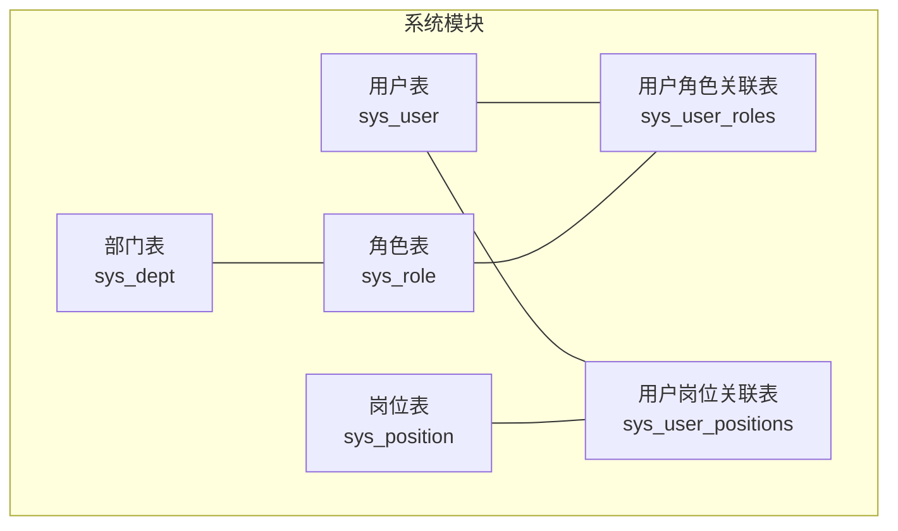
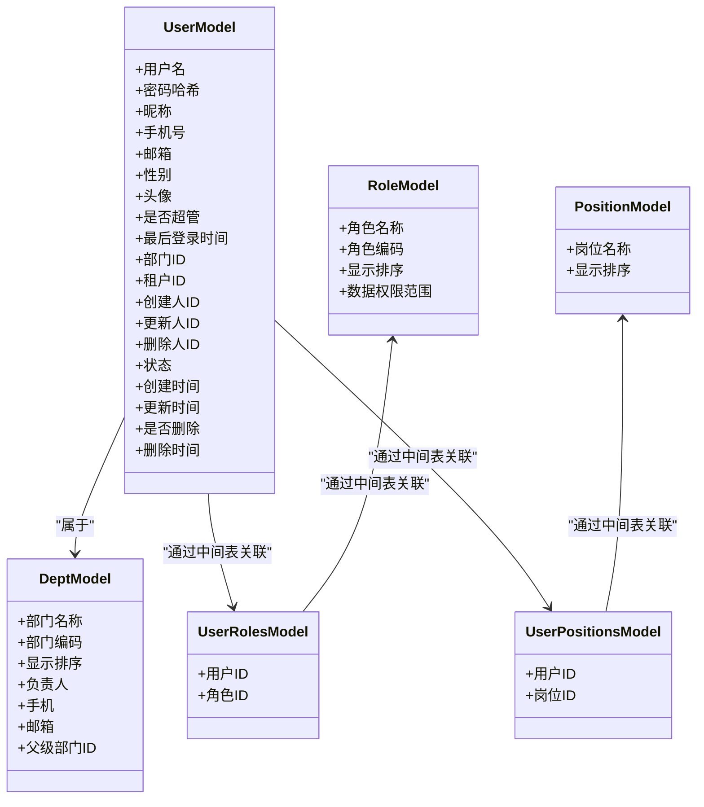
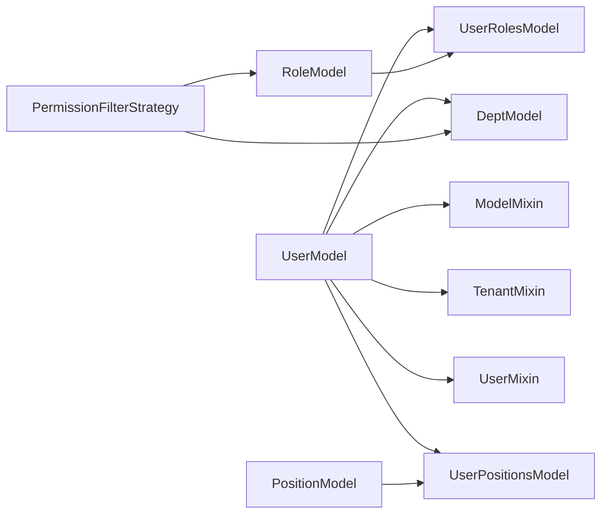

# 用户表设计

<cite>
**本文引用的文件**
- [backend/app/api/v1/module_system/user/model.py](file://backend/app/api/v1/module_system/user/model.py)
- [backend/app/api/v1/module_system/user/schema.py](file://backend/app/api/v1/module_system/user/schema.py)
- [backend/app/core/base_model.py](file://backend/app/core/base_model.py)
- [backend/app/common/enums.py](file://backend/app/common/enums.py)
- [backend/app/core/validator.py](file://backend/app/core/validator.py)
- [backend/app/api/v1/module_system/role/model.py](file://backend/app/api/v1/module_system/role/model.py)
- [backend/app/api/v1/module_system/dept/model.py](file://backend/app/api/v1/module_system/dept/model.py)
- [backend/app/api/v1/module_system/position/model.py](file://backend/app/api/v1/module_system/position/model.py)
- [backend/sql/mysql/fastapiadmin_2026-04-19_223353.sql](file://backend/sql/mysql/fastapiadmin_2026-04-19_223353.sql)
- [backend/app/scripts/data/sys_user.json](file://backend/app/scripts/data/sys_user.json)
</cite>

## 目录
1. [简介](#简介)
2. [项目结构](#项目结构)
3. [核心组件](#核心组件)
4. [架构总览](#架构总览)
5. [详细组件分析](#详细组件分析)
6. [依赖分析](#依赖分析)
7. [性能考虑](#性能考虑)
8. [故障排查指南](#故障排查指南)
9. [结论](#结论)
10. [附录](#附录)

## 简介
本文件围绕 FastapiAdmin 中的用户表（sys_user）进行系统化设计说明，涵盖字段定义、安全与审计、与角色/部门/岗位的多对多关联、权限控制策略（数据范围与业务权限）、索引与查询优化、业务规则与验证、以及软删除与审计日志的实现要点。目标是帮助开发者与运维人员准确理解并高效维护用户表及其周边逻辑。

## 项目结构
用户表位于系统模块的 user 子模块中，配合通用的模型混入类与权限/审计枚举，形成统一的数据建模与权限控制框架。同时，用户与角色、部门、岗位之间通过中间表建立多对多关系，支撑灵活的权限与组织管理。

图示来源
- [backend/app/api/v1/module_system/user/model.py:16-62](file://backend/app/api/v1/module_system/user/model.py#L16-L62)
- [backend/app/api/v1/module_system/role/model.py:15-36](file://backend/app/api/v1/module_system/role/model.py#L15-L36)
- [backend/app/api/v1/module_system/position/model.py:12-29](file://backend/app/api/v1/module_system/position/model.py#L12-L29)
- [backend/app/api/v1/module_system/dept/model.py:14-58](file://backend/app/api/v1/module_system/dept/model.py#L14-L58)

章节来源
- [backend/app/api/v1/module_system/user/model.py:64-151](file://backend/app/api/v1/module_system/user/model.py#L64-L151)
- [backend/app/api/v1/module_system/role/model.py:64-99](file://backend/app/api/v1/module_system/role/model.py#L64-L99)
- [backend/app/api/v1/module_system/dept/model.py:14-58](file://backend/app/api/v1/module_system/dept/model.py#L14-L58)
- [backend/app/api/v1/module_system/position/model.py:12-29](file://backend/app/api/v1/module_system/position/model.py#L12-L29)

## 核心组件
- 用户模型（UserModel）：承载用户基本信息、安全字段、状态与审计字段，并定义与租户、部门、角色、岗位的关联关系。
- 用户角色中间表（sys_user_roles）：维护用户与角色的多对多关系。
- 用户岗位中间表（sys_user_positions）：维护用户与岗位的多对多关系。
- 权限过滤策略枚举：定义“基于数据范围”“基于角色”“基于部门”等策略，用于控制数据可见性。
- 审计与租户混入：统一提供 created_id/updated_id/deleted_id、tenant_id、软删除与时间戳等字段。
- 输入校验器：提供手机号、邮箱等字段的格式校验与长度限制。

章节来源
- [backend/app/api/v1/module_system/user/model.py:64-151](file://backend/app/api/v1/module_system/user/model.py#L64-L151)
- [backend/app/common/enums.py:111-122](file://backend/app/common/enums.py#L111-L122)
- [backend/app/core/base_model.py:40-228](file://backend/app/core/base_model.py#L40-L228)
- [backend/app/core/validator.py:129-177](file://backend/app/core/validator.py#L129-L177)

## 架构总览
用户表通过中间表与角色、岗位建立多对多关系，同时与部门建立一对一/多对一关系；租户字段实现多租户隔离；审计字段与软删除字段确保数据可追溯与可恢复；权限策略决定查询与操作时的数据范围。

图示来源
- [backend/app/api/v1/module_system/user/model.py:64-151](file://backend/app/api/v1/module_system/user/model.py#L64-L151)
- [backend/app/api/v1/module_system/role/model.py:64-99](file://backend/app/api/v1/module_system/role/model.py#L64-L99)
- [backend/app/api/v1/module_system/dept/model.py:14-58](file://backend/app/api/v1/module_system/dept/model.py#L14-L58)
- [backend/app/api/v1/module_system/position/model.py:12-29](file://backend/app/api/v1/module_system/position/model.py#L12-L29)

## 详细组件分析

### 用户表字段定义与设计理念
- 基本信息字段
  - 用户名：唯一、非空，作为登录账号，便于快速检索与去重。
  - 昵称：用户展示名称，长度限制。
  - 手机号/邮箱：唯一性约束，便于找回密码与二次认证。
  - 性别：枚举化存储，兼容多场景。
  - 头像：URL 地址，支持 HTTP/HTTPS 校验。
- 安全字段
  - 密码哈希：存储不可逆哈希，保障账户安全。
  - 是否超管：平台级权限标识，影响部分操作的过滤策略。
  - 最后登录时间：审计与风控参考。
  - 第三方登录字段：Gitee/Github/微信/QQ 登录标识，便于多源账号打通。
- 状态与审计
  - 状态字段：0 正常/1 禁用，配合查询与业务开关。
  - 软删除字段：是否删除/删除时间，支持逻辑删除与审计追踪。
  - 审计字段：创建/更新时间，以及创建人/更新人/删除人 ID，形成完整生命周期轨迹。
- 关联字段
  - 部门 ID：外键关联部门表，支持按组织维度的权限与统计。
  - 租户 ID：外键关联租户表，实现多租户隔离。

章节来源
- [backend/app/api/v1/module_system/user/model.py:81-125](file://backend/app/api/v1/module_system/user/model.py#L81-L125)
- [backend/app/core/base_model.py:70-126](file://backend/app/core/base_model.py#L70-L126)
- [backend/app/core/base_model.py:128-145](file://backend/app/core/base_model.py#L128-L145)
- [backend/app/core/base_model.py:148-183](file://backend/app/core/base_model.py#L148-L183)

### 与角色/部门/岗位的多对多关联机制
- 用户与角色
  - 通过中间表 sys_user_roles 维护多对多关系，支持用户拥有多个角色，角色也可分配给多个用户。
  - 关系定义采用 secondary 指向中间表，ORM 层自动处理关联查询与懒加载。
- 用户与岗位
  - 通过中间表 sys_user_positions 维护多对多关系，支持用户拥有多个岗位，岗位也可绑定多个用户。
- 用户与部门
  - 用户模型中 dept_id 作为外键指向部门表，用户与部门为多对一关系；部门模型 users 反向关联用户集合。
- 关系加载策略
  - 使用 selectin 预加载，减少 N+1 查询问题，提升列表与详情接口性能。

章节来源
- [backend/app/api/v1/module_system/user/model.py:16-62](file://backend/app/api/v1/module_system/user/model.py#L16-L62)
- [backend/app/api/v1/module_system/user/model.py:126-131](file://backend/app/api/v1/module_system/user/model.py#L126-L131)
- [backend/app/api/v1/module_system/dept/model.py:54-58](file://backend/app/api/v1/module_system/dept/model.py#L54-L58)

### 权限控制策略：数据范围权限与业务权限
- 数据范围权限
  - 通过角色模型的 data_scope 字段定义数据范围（仅本人、本部门、本部门及以下、全部、自定义），结合中间表 sys_role_depts 实现“自定义数据权限”的细粒度控制。
  - 用户模型继承的混入类提供 created_id/updated_id 等字段，配合 data_scope 实现“仅本人数据权限”等策略。
- 业务权限
  - 业务权限通常由菜单与角色关联表（sys_role_menus）控制，用户通过角色获得菜单与操作权限。
- 策略枚举
  - 提供多种权限过滤策略枚举，便于在不同模块中选择合适的数据可见性策略。

章节来源
- [backend/app/api/v1/module_system/role/model.py:64-99](file://backend/app/api/v1/module_system/role/model.py#L64-L99)
- [backend/app/api/v1/module_system/role/model.py:39-61](file://backend/app/api/v1/module_system/role/model.py#L39-L61)
- [backend/app/common/enums.py:111-122](file://backend/app/common/enums.py#L111-L122)
- [backend/app/core/base_model.py:40-66](file://backend/app/core/base_model.py#L40-L66)

### 索引设计策略与查询优化
- 唯一性约束
  - 用户名、手机号、邮箱均设置唯一性约束，防止重复注册与登录冲突。
- 性能优化索引
  - 主键与 UUID：天然唯一，适合高并发场景下的定位与幂等。
  - 状态、创建/更新时间、是否删除：常用过滤与排序字段，建立索引提升查询效率。
  - 部门 ID：用户按部门聚合统计与权限判断时高频使用，建立索引。
  - 租户 ID：多租户隔离的关键字段，建议建立索引。
  - 审计字段（created_id/updated_id/deleted_id）：用于“仅本人数据权限”等策略，建议建立索引。
- 查询优化建议
  - 列表查询优先使用 selectin 预加载关联（角色、岗位、部门、租户），避免 N+1。
  - 对高频条件（如用户名模糊匹配、状态过滤、时间范围）建立复合索引或合理使用现有索引。
  - 分页查询时尽量使用基于索引的排序字段，避免回表与临时表。

章节来源
- [backend/app/api/v1/module_system/user/model.py:81-125](file://backend/app/api/v1/module_system/user/model.py#L81-L125)
- [backend/app/core/base_model.py:70-126](file://backend/app/core/base_model.py#L70-L126)
- [backend/app/core/base_model.py:128-183](file://backend/app/core/base_model.py#L128-L183)

### 业务规则与数据验证机制
- 输入校验
  - 手机号：长度与格式校验，确保 11 位数字与运营商号段匹配。
  - 邮箱：正则校验，确保符合邮箱格式。
  - 头像 URL：需为有效 HTTP/HTTPS URL。
  - 用户名：字母开头，长度 3-32，仅允许字母/数字/下划线/点/横杠。
  - 名称、账号、备注、密码长度限制，防止异常数据入库。
- 模型级校验
  - 使用 Pydantic 的 field_validator 与 model_validator 进行字段级与模型级校验，保证数据一致性与安全性。
- 数据隔离
  - 租户 ID 默认值与外键约束，确保跨租户数据隔离；平台超级管理员（is_superuser 且 tenant_id=1）不受租户过滤限制。

章节来源
- [backend/app/core/validator.py:129-177](file://backend/app/core/validator.py#L129-L177)
- [backend/app/api/v1/module_system/user/schema.py:20-101](file://backend/app/api/v1/module_system/user/schema.py#L20-L101)
- [backend/app/api/v1/module_system/user/schema.py:103-176](file://backend/app/api/v1/module_system/user/schema.py#L103-L176)
- [backend/app/core/base_model.py:128-145](file://backend/app/core/base_model.py#L128-L145)

### 软删除与审计日志
- 软删除
  - is_deleted 字段与 deleted_time 字段配合使用，删除时仅标记删除状态而不物理移除数据，便于审计与恢复。
- 审计日志
  - created_time/updated_time 记录变更时间；created_id/updated_id/deleted_id 记录操作人，形成完整的审计轨迹。
- 与权限策略的协同
  - 在“仅本人数据权限”等策略中，可通过 created_id 精准限定可见范围；在多租户场景中，结合 tenant_id 与 is_superuser 控制可见性。

章节来源
- [backend/app/core/base_model.py:112-126](file://backend/app/core/base_model.py#L112-L126)
- [backend/app/core/base_model.py:158-183](file://backend/app/core/base_model.py#L158-L183)

### 示例数据与导入参考
- 示例数据包含用户名、密码哈希、昵称、头像、部门 ID、状态、描述等字段，可用于初始化与回归测试。
- 导入流程建议先准备基础数据（租户、部门、角色、岗位），再导入用户与用户-角色/岗位关联数据，确保外键一致。

章节来源
- [backend/app/scripts/data/sys_user.json:1-65](file://backend/app/scripts/data/sys_user.json#L1-L65)

## 依赖分析
- 用户模型依赖
  - 基础混入类：提供通用字段与软删除能力。
  - 租户混入类：提供 tenant_id 字段与外键约束。
  - 用户混入类：提供 created_id/updated_id/deleted_id 与关联关系。
- 关联依赖
  - 与部门表：一对一/多对一关系，支持组织维度权限。
  - 与角色/岗位：多对多关系，通过中间表维护。
- 权限策略依赖
  - 权限过滤策略枚举用于模块间统一策略选择。

图示来源
- [backend/app/api/v1/module_system/user/model.py:64-151](file://backend/app/api/v1/module_system/user/model.py#L64-L151)
- [backend/app/core/base_model.py:40-228](file://backend/app/core/base_model.py#L40-L228)
- [backend/app/api/v1/module_system/role/model.py:64-99](file://backend/app/api/v1/module_system/role/model.py#L64-L99)
- [backend/app/api/v1/module_system/dept/model.py:14-58](file://backend/app/api/v1/module_system/dept/model.py#L14-L58)
- [backend/app/api/v1/module_system/position/model.py:12-29](file://backend/app/api/v1/module_system/position/model.py#L12-L29)
- [backend/app/common/enums.py:111-122](file://backend/app/common/enums.py#L111-L122)

章节来源
- [backend/app/api/v1/module_system/user/model.py:64-151](file://backend/app/api/v1/module_system/user/model.py#L64-L151)
- [backend/app/core/base_model.py:40-228](file://backend/app/core/base_model.py#L40-L228)
- [backend/app/common/enums.py:111-122](file://backend/app/common/enums.py#L111-L122)

## 性能考虑
- 索引策略
  - 为高频过滤字段（用户名、手机号、邮箱、状态、部门 ID、租户 ID、created_id 等）建立索引。
  - 合理使用复合索引，避免过多冗余索引导致写入性能下降。
- 查询优化
  - 使用 selectin 预加载关联关系，减少多次往返数据库。
  - 列表分页时使用基于索引的排序字段，避免排序开销过大。
- 写入优化
  - 批量插入与更新时，控制事务大小，避免长时间锁表。
  - 密码哈希计算在服务端完成，避免数据库侧重复计算。

## 故障排查指南
- 常见问题
  - 唯一约束冲突：用户名/手机号/邮箱重复导致插入失败，检查唯一索引与输入校验。
  - 外键约束失败：部门/租户/角色/岗位不存在或被删除，检查中间表与关联表数据一致性。
  - 权限可见性异常：确认角色 data_scope 与用户 created_id 是否符合预期。
  - 软删除数据误删：确认 is_deleted 与 deleted_time 字段，必要时执行恢复流程。
- 定位方法
  - 查看审计字段（created_time/updated_time/created_id/updated_id/deleted_id）确定变更轨迹。
  - 结合索引与 EXPLAIN 分析慢查询，优化 WHERE 与 ORDER BY 子句。
  - 使用示例数据进行最小复现，逐步排除业务逻辑干扰。

章节来源
- [backend/app/api/v1/module_system/user/model.py:81-125](file://backend/app/api/v1/module_system/user/model.py#L81-L125)
- [backend/app/core/base_model.py:112-126](file://backend/app/core/base_model.py#L112-L126)

## 结论
用户表（sys_user）在 FastapiAdmin 中通过统一的模型混入类与权限/审计枚举，实现了跨模块的一致性与可扩展性。借助中间表与多对多关系，用户能够灵活绑定角色与岗位，同时与部门形成清晰的组织关系。配合完善的索引、校验与软删除机制，用户表在保证数据安全与可追溯的同时，兼顾了查询与写入性能。建议在实际部署中根据业务规模与查询特征持续优化索引与查询策略，并严格遵循输入校验与权限策略，确保系统的稳定性与安全性。

## 附录
- 数据库脚本参考：可从 SQL 文件中核对表结构、索引与约束，确保与模型定义一致。
- 示例数据：可用于初始化与回归测试，导入顺序建议先基础表再用户与关联表。

章节来源
- [backend/sql/mysql/fastapiadmin_2026-04-19_223353.sql:1-300](file://backend/sql/mysql/fastapiadmin_2026-04-19_223353.sql#L1-L300)
- [backend/app/scripts/data/sys_user.json:1-65](file://backend/app/scripts/data/sys_user.json#L1-L65)