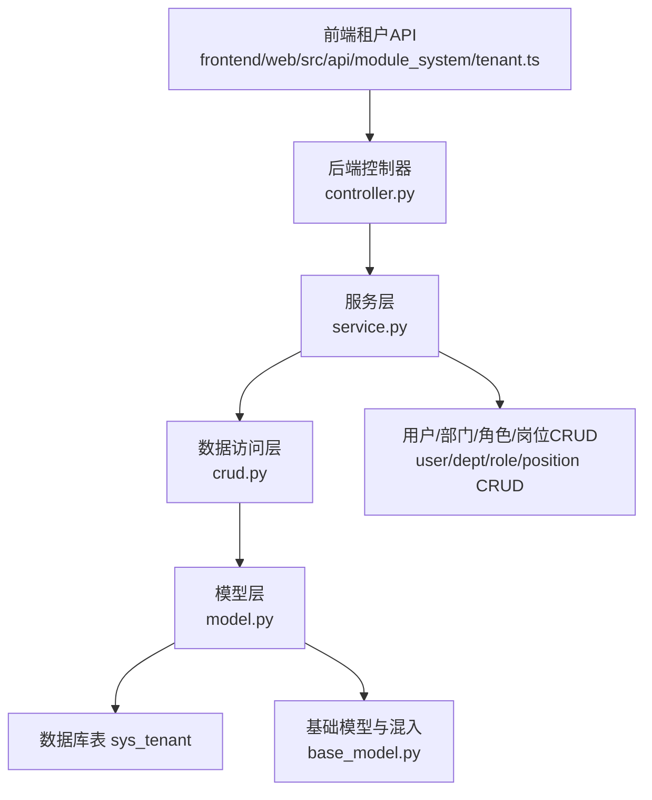
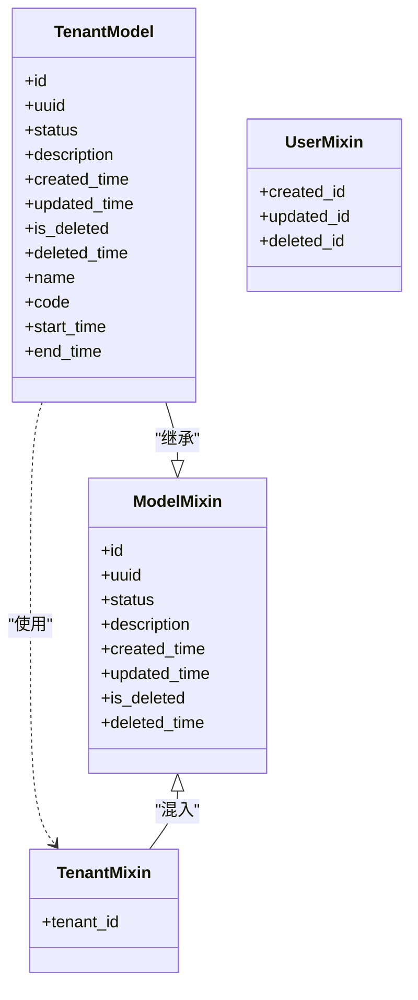
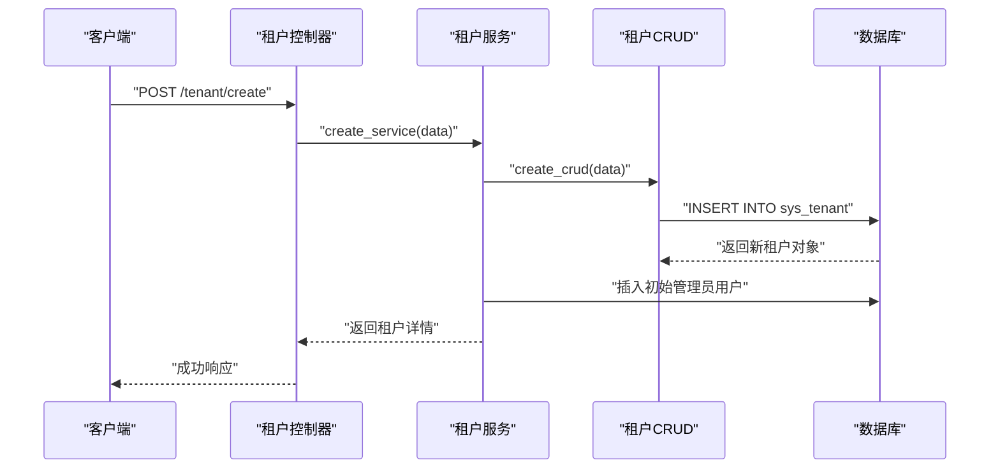
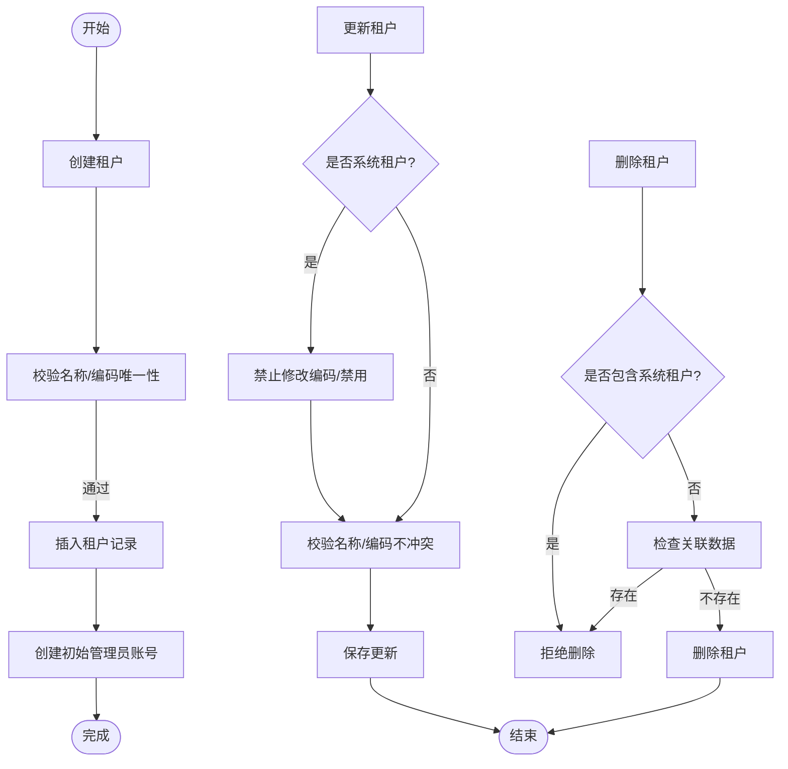
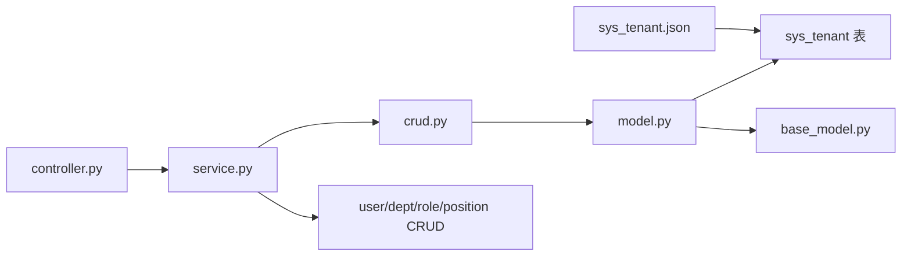

# 租户表设计

<cite>
**本文档引用的文件**
- [backend/app/api/v1/module_system/tenant/model.py](file://backend/app/api/v1/module_system/tenant/model.py)
- [backend/app/api/v1/module_system/tenant/schema.py](file://backend/app/api/v1/module_system/tenant/schema.py)
- [backend/app/api/v1/module_system/tenant/crud.py](file://backend/app/api/v1/module_system/tenant/crud.py)
- [backend/app/api/v1/module_system/tenant/service.py](file://backend/app/api/v1/module_system/tenant/service.py)
- [backend/app/api/v1/module_system/tenant/controller.py](file://backend/app/api/v1/module_system/tenant/controller.py)
- [backend/app/core/base_model.py](file://backend/app/core/base_model.py)
- [backend/app/common/enums.py](file://backend/app/common/enums.py)
- [backend/app/core/permission.py](file://backend/app/core/permission.py)
- [backend/app/scripts/data/sys_tenant.json](file://backend/app/scripts/data/sys_tenant.json)
- [backend/app/api/v1/module_system/user/model.py](file://backend/app/api/v1/module_system/user/model.py)
- [frontend/web/src/api/module_system/tenant.ts](file://frontend/web/src/api/module_system/tenant.ts)
</cite>

## 目录
1. [简介](#简介)
2. [项目结构](#项目结构)
3. [核心组件](#核心组件)
4. [架构总览](#架构总览)
5. [详细组件分析](#详细组件分析)
6. [依赖分析](#依赖分析)
7. [性能考虑](#性能考虑)
8. [故障排查指南](#故障排查指南)
9. [结论](#结论)
10. [附录](#附录)

## 简介
本文件针对 FastapiAdmin 中的租户表（sys_tenant）进行全面的数据表设计说明，涵盖字段设计、多租户隔离机制、数据安全策略、生命周期管理、性能优化与安全考虑，并结合前后端实现展示完整的租户管理流程。

## 项目结构
租户相关代码采用“模块化+分层”的组织方式：
- 后端按功能模块划分，租户功能位于系统模块下
- 采用经典的 MVC 分层：Model（ORM 映射）、Schema（请求/响应校验）、CRUD（数据访问）、Service（业务逻辑）、Controller（接口路由）
- 前端通过 API 文件与后端交互

图表来源
- [backend/app/api/v1/module_system/tenant/controller.py:17](file://backend/app/api/v1/module_system/tenant/controller.py#L17)
- [backend/app/api/v1/module_system/tenant/service.py:18](file://backend/app/api/v1/module_system/tenant/service.py#L18)
- [backend/app/api/v1/module_system/tenant/crud.py:11](file://backend/app/api/v1/module_system/tenant/crud.py#L11)
- [backend/app/api/v1/module_system/tenant/model.py:10](file://backend/app/api/v1/module_system/tenant/model.py#L10)
- [backend/app/core/base_model.py:40](file://backend/app/core/base_model.py#L40)

章节来源
- [backend/app/api/v1/module_system/tenant/controller.py:1-117](file://backend/app/api/v1/module_system/tenant/controller.py#L1-L117)
- [backend/app/api/v1/module_system/tenant/service.py:1-149](file://backend/app/api/v1/module_system/tenant/service.py#L1-L149)
- [backend/app/api/v1/module_system/tenant/crud.py:1-60](file://backend/app/api/v1/module_system/tenant/crud.py#L1-L60)
- [backend/app/api/v1/module_system/tenant/model.py:1-40](file://backend/app/api/v1/module_system/tenant/model.py#L1-L40)
- [backend/app/core/base_model.py:128-146](file://backend/app/core/base_model.py#L128-L146)

## 核心组件
- 租户模型（Model）：定义 sys_tenant 表结构与字段约束，包含名称、编码、时间范围等字段，以及字段验证规则
- 租户 Schema：定义新增/更新/查询/输出的参数与校验逻辑
- 租户 CRUD：封装通用的增删改查与分页能力
- 租户 Service：实现业务规则，如创建租户时自动创建初始管理员账号、更新/删除/启用/禁用的限制
- 租户 Controller：对外暴露 REST 接口，负责鉴权与日志
- 基础模型与混入：提供通用字段（状态、时间戳、软删除）与租户隔离字段（tenant_id）

章节来源
- [backend/app/api/v1/module_system/tenant/model.py:10-40](file://backend/app/api/v1/module_system/tenant/model.py#L10-L40)
- [backend/app/api/v1/module_system/tenant/schema.py:9-99](file://backend/app/api/v1/module_system/tenant/schema.py#L9-L99)
- [backend/app/api/v1/module_system/tenant/crud.py:11-60](file://backend/app/api/v1/module_system/tenant/crud.py#L11-L60)
- [backend/app/api/v1/module_system/tenant/service.py:18-149](file://backend/app/api/v1/module_system/tenant/service.py#L18-L149)
- [backend/app/api/v1/module_system/tenant/controller.py:17-117](file://backend/app/api/v1/module_system/tenant/controller.py#L17-L117)
- [backend/app/core/base_model.py:40-146](file://backend/app/core/base_model.py#L40-L146)

## 架构总览
多租户架构基于“行级隔离”实现：
- 业务表通过外键 tenant_id 关联 sys_tenant，实现数据隔离
- 平台超级管理员（tenant_id=1 且 is_superuser=true）在数据层不受租户过滤限制
- 权限过滤策略通过统一的权限过滤器在查询阶段自动注入过滤条件

图表来源
- [backend/app/api/v1/module_system/tenant/model.py:10-40](file://backend/app/api/v1/module_system/tenant/model.py#L10-L40)
- [backend/app/core/base_model.py:40-146](file://backend/app/core/base_model.py#L40-L146)

章节来源
- [backend/app/api/v1/module_system/tenant/model.py:10-40](file://backend/app/api/v1/module_system/tenant/model.py#L10-L40)
- [backend/app/core/base_model.py:40-146](file://backend/app/core/base_model.py#L40-L146)

## 详细组件分析

### 字段设计与约束
- 主键与通用字段：id、uuid、status、description、created_time、updated_time、is_deleted、deleted_time
- 核心业务字段：
  - name：租户名称，必填且唯一
  - code：租户编码，必填且唯一，仅允许字母数字
  - start_time/end_time：时间范围，结束时间不得早于开始时间
- 字段验证：
  - 名称与编码的非空与格式校验
  - 时间范围的合法性校验

章节来源
- [backend/app/api/v1/module_system/tenant/model.py:22-40](file://backend/app/api/v1/module_system/tenant/model.py#L22-L40)
- [backend/app/api/v1/module_system/tenant/schema.py:19-42](file://backend/app/api/v1/module_system/tenant/schema.py#L19-L42)
- [backend/app/api/v1/module_system/tenant/schema.py:54-68](file://backend/app/api/v1/module_system/tenant/schema.py#L54-L68)

### 多租户隔离机制与数据安全
- 行级隔离：业务表通过 tenant_id 外键与 sys_tenant 关联，实现跨表数据隔离
- 超级管理员豁免：平台超级管理员（tenant_id=1 且 is_superuser=true）在数据层不按租户过滤
- 权限过滤策略：通过统一的权限过滤器在查询阶段注入过滤条件，确保用户只能访问其权限范围内的数据

图表来源
- [backend/app/api/v1/module_system/tenant/controller.py:66-72](file://backend/app/api/v1/module_system/tenant/controller.py#L66-L72)
- [backend/app/api/v1/module_system/tenant/service.py:46-91](file://backend/app/api/v1/module_system/tenant/service.py#L46-L91)
- [backend/app/api/v1/module_system/tenant/crud.py:49-50](file://backend/app/api/v1/module_system/tenant/crud.py#L49-L50)

章节来源
- [backend/app/core/base_model.py:128-146](file://backend/app/core/base_model.py#L128-L146)
- [backend/app/core/permission.py:72-86](file://backend/app/core/permission.py#L72-L86)
- [backend/app/core/permission.py:183-234](file://backend/app/core/permission.py#L183-L234)

### 租户生命周期管理
- 创建：校验名称/编码唯一性，创建成功后自动创建初始管理员账号（用户名为 {code}_admin，密码随机生成并记录日志）
- 查询：支持分页、排序、模糊查询（名称/编码）、状态过滤、创建时间范围过滤
- 更新：系统租户（id=1）禁止修改编码与禁用；普通租户更新需保证名称/编码不冲突
- 删除：系统租户不可删除；删除前检查是否存在用户/部门/角色/岗位等关联数据，存在则拒绝删除
- 启用/禁用：支持批量设置状态；系统租户不可禁用

图表来源
- [backend/app/api/v1/module_system/tenant/service.py:46-91](file://backend/app/api/v1/module_system/tenant/service.py#L46-L91)
- [backend/app/api/v1/module_system/tenant/service.py:92-117](file://backend/app/api/v1/module_system/tenant/service.py#L92-L117)
- [backend/app/api/v1/module_system/tenant/service.py:118-142](file://backend/app/api/v1/module_system/tenant/service.py#L118-L142)

章节来源
- [backend/app/api/v1/module_system/tenant/service.py:46-149](file://backend/app/api/v1/module_system/tenant/service.py#L46-L149)
- [backend/app/api/v1/module_system/tenant/schema.py:77-99](file://backend/app/api/v1/module_system/tenant/schema.py#L77-L99)

### 租户表在系统中的作用
- 多租户支持：通过 sys_tenant 与业务表的 tenant_id 外键关联，实现跨表数据隔离
- 资源隔离：不同租户的数据在数据库层面相互隔离，避免交叉访问
- 计费管理：可通过租户的状态、时间范围等字段配合业务逻辑实现计费与配额控制
- 平台管理：系统租户（id=1）用于平台级管理，超级管理员不受租户过滤限制

章节来源
- [backend/app/api/v1/module_system/tenant/model.py:14-16](file://backend/app/api/v1/module_system/tenant/model.py#L14-L16)
- [backend/app/core/base_model.py:128-146](file://backend/app/core/base_model.py#L128-L146)

### 管理策略与操作机制
- 创建：接口路径 /tenant/create，鉴权要求 module_system:tenant:create
- 查询：接口路径 /tenant/list，支持分页与多维查询参数
- 更新：接口路径 /tenant/update/{id}，鉴权要求 module_system:tenant:update
- 删除：接口路径 /tenant/delete，鉴权要求 module_system:tenant:delete
- 批量启停：接口路径 /tenant/available/setting，鉴权要求 module_system:tenant:patch

章节来源
- [backend/app/api/v1/module_system/tenant/controller.py:20-117](file://backend/app/api/v1/module_system/tenant/controller.py#L20-L117)
- [frontend/web/src/api/module_system/tenant.ts:1-54](file://frontend/web/src/api/module_system/tenant.ts#L1-L54)

## 依赖分析
- 模块内依赖：Controller -> Service -> CRUD -> Model -> 数据库
- 权限过滤：统一通过权限过滤器注入过滤条件，策略可配置
- 初始化数据：系统租户（id=1）在初始化脚本中固定存在

图表来源
- [backend/app/api/v1/module_system/tenant/controller.py:14-15](file://backend/app/api/v1/module_system/tenant/controller.py#L14-L15)
- [backend/app/api/v1/module_system/tenant/service.py:14-15](file://backend/app/api/v1/module_system/tenant/service.py#L14-L15)
- [backend/app/api/v1/module_system/tenant/crud.py:7-8](file://backend/app/api/v1/module_system/tenant/crud.py#L7-L8)
- [backend/app/api/v1/module_system/tenant/model.py:18-19](file://backend/app/api/v1/module_system/tenant/model.py#L18-L19)
- [backend/app/core/base_model.py:40-146](file://backend/app/core/base_model.py#L40-L146)
- [backend/app/scripts/data/sys_tenant.json:1-11](file://backend/app/scripts/data/sys_tenant.json#L1-L11)

章节来源
- [backend/app/api/v1/module_system/tenant/controller.py:1-117](file://backend/app/api/v1/module_system/tenant/controller.py#L1-L117)
- [backend/app/api/v1/module_system/tenant/service.py:1-149](file://backend/app/api/v1/module_system/tenant/service.py#L1-L149)
- [backend/app/api/v1/module_system/tenant/crud.py:1-60](file://backend/app/api/v1/module_system/tenant/crud.py#L1-L60)
- [backend/app/api/v1/module_system/tenant/model.py:1-40](file://backend/app/api/v1/module_system/tenant/model.py#L1-L40)
- [backend/app/core/base_model.py:1-228](file://backend/app/core/base_model.py#L1-L228)
- [backend/app/scripts/data/sys_tenant.json:1-11](file://backend/app/scripts/data/sys_tenant.json#L1-L11)

## 性能考虑
- 索引优化：通用字段（id、uuid、status、created_time、updated_time、is_deleted）均建立索引，提升查询与排序效率
- 外键约束：tenant_id 外键约束确保数据一致性，同时建议在业务表上为 tenant_id 建立索引以加速过滤
- 分页与排序：列表接口支持分页与排序，建议在高频查询字段上建立复合索引
- 权限过滤：权限过滤器在查询阶段注入过滤条件，避免在应用层二次过滤带来的性能损耗
- 批量操作：删除与启停采用批量接口，减少网络往返与事务开销

章节来源
- [backend/app/core/base_model.py:71-125](file://backend/app/core/base_model.py#L71-L125)
- [backend/app/api/v1/module_system/tenant/controller.py:35-57](file://backend/app/api/v1/module_system/tenant/controller.py#L35-L57)
- [backend/app/core/permission.py:72-86](file://backend/app/core/permission.py#L72-L86)

## 故障排查指南
- 创建失败（名称/编码重复）：检查租户名称与编码是否唯一
- 更新失败（系统租户限制）：系统租户（id=1）不可修改编码或禁用
- 删除失败（存在关联数据）：删除前需清理用户/部门/角色/岗位等关联数据
- 权限不足：确认调用接口所需的权限点是否已授权
- 时间范围错误：开始时间不得晚于结束时间

章节来源
- [backend/app/api/v1/module_system/tenant/service.py:47-50](file://backend/app/api/v1/module_system/tenant/service.py#L47-L50)
- [backend/app/api/v1/module_system/tenant/service.py:98-102](file://backend/app/api/v1/module_system/tenant/service.py#L98-L102)
- [backend/app/api/v1/module_system/tenant/service.py:138-141](file://backend/app/api/v1/module_system/tenant/service.py#L138-L141)
- [backend/app/api/v1/module_system/tenant/schema.py:38-41](file://backend/app/api/v1/module_system/tenant/schema.py#L38-L41)

## 结论
sys_tenant 表通过明确的字段设计与严格的业务规则，结合行级隔离与统一权限过滤机制，实现了稳定可靠的多租户架构。系统租户（id=1）作为平台管理入口，既保障了平台级管理能力，又通过权限豁免策略确保安全可控。前后端接口完整覆盖租户全生命周期管理，配合初始化数据与批量操作接口，满足实际业务需求。

## 附录
- 初始化数据示例：系统租户（id=1）固定存在，便于平台初始化与管理
- 前端 API：提供列表、详情、创建、更新、删除、批量启停等接口

章节来源
- [backend/app/scripts/data/sys_tenant.json:1-11](file://backend/app/scripts/data/sys_tenant.json#L1-L11)
- [frontend/web/src/api/module_system/tenant.ts:1-54](file://frontend/web/src/api/module_system/tenant.ts#L1-L54)