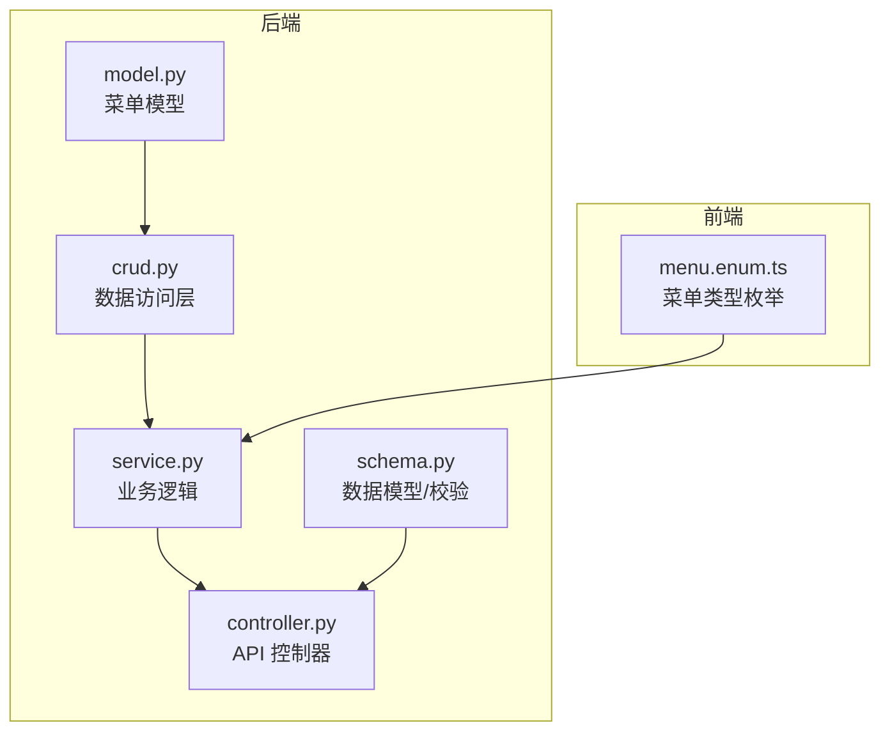
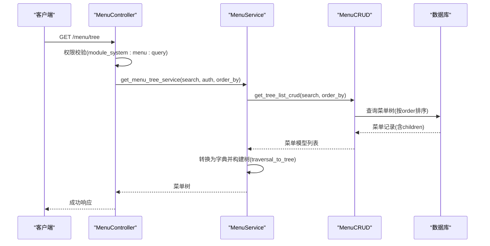
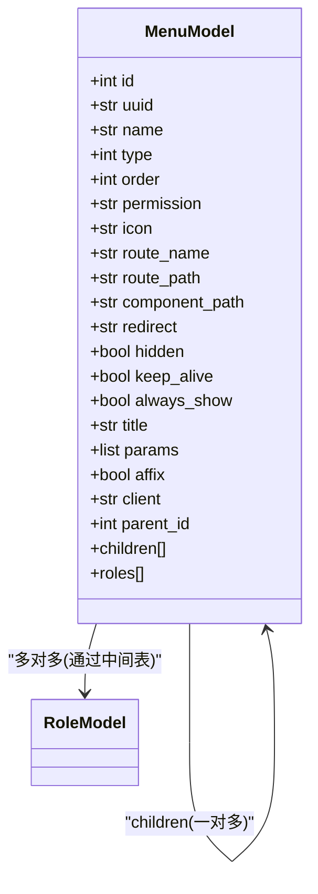
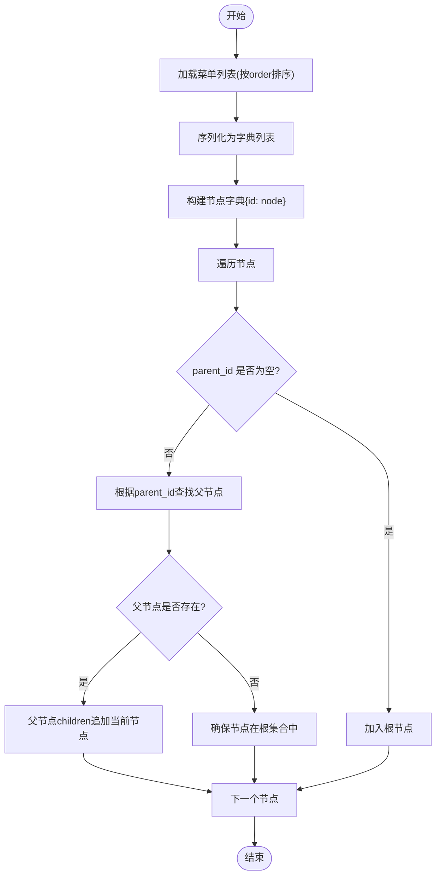
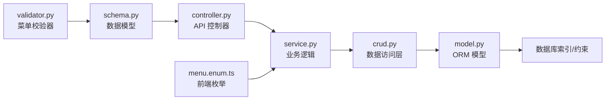

# 菜单表设计

<cite>
**本文档引用的文件**
- [backend/app/api/v1/module_system/menu/model.py](file://backend/app/api/v1/module_system/menu/model.py)
- [backend/app/api/v1/module_system/menu/controller.py](file://backend/app/api/v1/module_system/menu/controller.py)
- [backend/app/api/v1/module_system/menu/crud.py](file://backend/app/api/v1/module_system/menu/crud.py)
- [backend/app/api/v1/module_system/menu/schema.py](file://backend/app/api/v1/module_system/menu/schema.py)
- [backend/app/api/v1/module_system/menu/service.py](file://backend/app/api/v1/module_system/menu/service.py)
- [backend/app/utils/common_util.py](file://backend/app/utils/common_util.py)
- [backend/app/core/validator.py](file://backend/app/core/validator.py)
- [backend/sql/postgres/fastapiadmin_2026-04-19_224727.sql](file://backend/sql/postgres/fastapiadmin_2026-04-19_224727.sql)
- [backend/sql/mysql/fastapiadmin_2026-04-19_223353.sql](file://backend/sql/mysql/fastapiadmin_2026-04-19_223353.sql)
- [backend/app/scripts/data/sys_menu.json](file://backend/app/scripts/data/sys_menu.json)
- [frontend/web/src/enums/system/menu.enum.ts](file://frontend/web/src/enums/system/menu.enum.ts)
</cite>

## 目录
1. [简介](#简介)
2. [项目结构](#项目结构)
3. [核心组件](#核心组件)
4. [架构概览](#架构概览)
5. [详细组件分析](#详细组件分析)
6. [依赖分析](#依赖分析)
7. [性能考虑](#性能考虑)
8. [故障排除指南](#故障排除指南)
9. [结论](#结论)
10. [附录](#附录)

## 简介
本文件为 FastapiAdmin 菜单表（sys_menu）的详细数据表设计文档，覆盖字段语义、层级结构、权限标识与控制机制、前端路由生成、性能优化策略以及业务规则与数据验证机制。目标读者包括后端开发、前端开发、测试工程师与运维人员。

## 项目结构
菜单相关代码位于后端模块 system 的 menu 子模块，采用标准的 MVC 分层：
- model.py 定义数据库模型与关系
- schema.py 定义请求/响应数据模型与校验
- crud.py 提供数据访问层能力
- service.py 实现业务逻辑与树形处理
- controller.py 提供 API 控制器
- 前端枚举与类型定义位于前端工程

图表来源
- [backend/app/api/v1/module_system/menu/model.py:13-103](file://backend/app/api/v1/module_system/menu/model.py#L13-L103)
- [backend/app/api/v1/module_system/menu/schema.py:11-168](file://backend/app/api/v1/module_system/menu/schema.py#L11-L168)
- [backend/app/api/v1/module_system/menu/crud.py:10-97](file://backend/app/api/v1/module_system/menu/crud.py#L10-L97)
- [backend/app/api/v1/module_system/menu/service.py:23-245](file://backend/app/api/v1/module_system/menu/service.py#L23-L245)
- [backend/app/api/v1/module_system/menu/controller.py:16-166](file://backend/app/api/v1/module_system/menu/controller.py#L16-L166)
- [frontend/web/src/enums/system/menu.enum.ts:1-14](file://frontend/web/src/enums/system/menu.enum.ts#L1-L14)

章节来源
- [backend/app/api/v1/module_system/menu/model.py:13-103](file://backend/app/api/v1/module_system/menu/model.py#L13-L103)
- [backend/app/api/v1/module_system/menu/controller.py:16-166](file://backend/app/api/v1/module_system/menu/controller.py#L16-L166)

## 核心组件
- 数据模型（MenuModel）：定义 sys_menu 表的字段、注释、索引与树形关系
- 数据访问层（MenuCRUD）：封装查询、树形列表、批量状态设置
- 业务服务（MenuService）：菜单树构建、父子类型与终端一致性校验、批量状态传播
- 控制器（MenuController）：提供菜单树、详情、创建、更新、删除、批量状态设置接口
- 数据模型与校验（Schema）：请求/响应模型、字段长度与格式约束、菜单专用校验器
- 前端枚举：菜单类型与终端枚举与后端保持一致

章节来源
- [backend/app/api/v1/module_system/menu/model.py:13-103](file://backend/app/api/v1/module_system/menu/model.py#L13-L103)
- [backend/app/api/v1/module_system/menu/crud.py:10-97](file://backend/app/api/v1/module_system/menu/crud.py#L10-L97)
- [backend/app/api/v1/module_system/menu/service.py:23-245](file://backend/app/api/v1/module_system/menu/service.py#L23-L245)
- [backend/app/api/v1/module_system/menu/controller.py:16-166](file://backend/app/api/v1/module_system/menu/controller.py#L16-L166)
- [backend/app/api/v1/module_system/menu/schema.py:11-168](file://backend/app/api/v1/module_system/menu/schema.py#L11-L168)
- [frontend/web/src/enums/system/menu.enum.ts:1-14](file://frontend/web/src/enums/system/menu.enum.ts#L1-L14)

## 架构概览
菜单模块遵循 FastapiAdmin 的通用分层架构，控制器负责鉴权与参数解析，服务层执行业务规则，CRUD 层与 ORM 交互，模型定义表结构与关系。

图表来源
- [backend/app/api/v1/module_system/menu/controller.py:19-44](file://backend/app/api/v1/module_system/menu/controller.py#L19-L44)
- [backend/app/api/v1/module_system/menu/service.py:90-114](file://backend/app/api/v1/module_system/menu/service.py#L90-L114)
- [backend/app/api/v1/module_system/menu/crud.py:61-83](file://backend/app/api/v1/module_system/menu/crud.py#L61-L83)
- [backend/app/utils/common_util.py:168-200](file://backend/app/utils/common_util.py#L168-L200)

## 详细组件分析

### 数据表字段与语义
sys_menu 表字段设计围绕“菜单类型、路由配置、权限标识、显示控制、层级关系、元数据”展开，具体如下：

- 基础标识
  - id：主键
  - uuid：全局唯一标识
  - status：状态（0 正常，1 禁用）
  - is_deleted / deleted_time：软删除标记与删除时间
  - created_time / updated_time：创建与更新时间

- 菜单基础信息
  - name：菜单名称
  - title：菜单标题
  - icon：菜单图标
  - description：备注/描述

- 菜单类型与层级
  - type：菜单类型（1 目录，2 菜单，3 按钮/权限，4 外链）
  - parent_id：父菜单 ID（自关联，SET NULL）
  - order：显示排序（数值越小越靠前）

- 路由与前端渲染
  - route_name：路由名称
  - route_path：路由路径（需以 / 开头）
  - component_path：组件路径（不可以 / 开头）
  - redirect：重定向地址（目录类型必填）
  - params：路由参数（JSON 对象）
  - affix：是否固定标签页（True/False）

- 显示控制
  - hidden：是否隐藏（True/False）
  - keep_alive：是否缓存（True/False）
  - always_show：是否始终显示（True/False）
  - client：终端（pc 管理端桌面，app 移动端）

- 关系
  - roles：与角色多对多关系（通过中间表 sys_role_menus）

章节来源
- [backend/app/api/v1/module_system/menu/model.py:29-102](file://backend/app/api/v1/module_system/menu/model.py#L29-L102)
- [backend/sql/postgres/fastapiadmin_2026-04-19_224727.sql:1787-1948](file://backend/sql/postgres/fastapiadmin_2026-04-19_224727.sql#L1787-L1948)
- [backend/sql/mysql/fastapiadmin_2026-04-19_223353.sql:511-529](file://backend/sql/mysql/fastapiadmin_2026-04-19_223353.sql#L511-L529)

### 菜单类型与路由配置
- 目录（type=1）：必须提供 route_name、route_path、redirect；用于聚合子菜单
- 菜单（type=2）：必须提供 route_name、route_path、component_path；对应页面路由
- 按钮/权限（type=3）：用于细粒度权限控制，通常无路由配置
- 外链（type=4）：可配置外链地址，路由配置可为空

章节来源
- [backend/app/core/validator.py:227-264](file://backend/app/core/validator.py#L227-L264)
- [backend/app/api/v1/module_system/menu/schema.py:14-38](file://backend/app/api/v1/module_system/menu/schema.py#L14-L38)

### 权限标识与权限控制机制
- 权限标识（permission）：采用冒号分隔的层级命名，如 module_system:menu:query，便于统一管理与前端指令式权限控制
- 按钮级权限 vs 菜单级权限
  - 按钮级权限：type=3 的菜单，通常用于 CRUD 操作按钮的显隐控制
  - 菜单级权限：type=2 的菜单，用于页面访问控制
- 前端枚举与后端保持一致，确保类型安全

章节来源
- [backend/app/scripts/data/sys_menu.json:22-159](file://backend/app/scripts/data/sys_menu.json#L22-L159)
- [frontend/web/src/enums/system/menu.enum.ts:1-14](file://frontend/web/src/enums/system/menu.enum.ts#L1-L14)

### 层级结构设计与无限级分类
- 父子关系：通过 parent_id 自关联实现，支持无限级分类
- 排序：children 关系按 order 升序排列
- 树形构建：服务层将扁平列表转换为树形结构，使用 traversal_to_tree 算法
- 索引：为 parent_id、status、is_deleted、updated_time 等建立索引，提升查询性能

图表来源
- [backend/app/api/v1/module_system/menu/model.py:13-103](file://backend/app/api/v1/module_system/menu/model.py#L13-L103)

章节来源
- [backend/app/api/v1/module_system/menu/model.py:79-102](file://backend/app/api/v1/module_system/menu/model.py#L79-L102)
- [backend/app/utils/common_util.py:90-200](file://backend/app/utils/common_util.py#L90-L200)
- [backend/sql/postgres/fastapiadmin_2026-04-19_224727.sql:5488-5527](file://backend/sql/postgres/fastapiadmin_2026-04-19_224727.sql#L5488-L5527)

### 菜单树构建算法
- 服务层获取树形列表后，将其序列化为字典列表
- 使用 traversal_to_tree 构建树：基于 parent_id 将节点挂载到父节点 children 下
- 确保每个节点都有 children 字段，避免前端渲染分支缺失

图表来源
- [backend/app/api/v1/module_system/menu/service.py:90-114](file://backend/app/api/v1/module_system/menu/service.py#L90-L114)
- [backend/app/utils/common_util.py:168-200](file://backend/app/utils/common_util.py#L168-L200)

### 权限检查与父子类型约束
- 父子类型约束：目录仅允许目录/菜单/外链；菜单仅允许按钮；按钮/外链不可挂子级
- 终端一致性：子菜单终端须与父菜单一致（pc/app）
- 菜单标题唯一性：同父级下标题唯一

章节来源
- [backend/app/api/v1/module_system/menu/service.py:29-66](file://backend/app/api/v1/module_system/menu/service.py#L29-L66)
- [backend/app/api/v1/module_system/menu/service.py:117-179](file://backend/app/api/v1/module_system/menu/service.py#L117-L179)

### 批量状态传播与删除
- 批量状态设置：激活时递归启用所有父级；禁用时递归禁用所有子级
- 删除：递归收集待删除菜单（含所有子孙），一次性删除

章节来源
- [backend/app/api/v1/module_system/menu/service.py:181-245](file://backend/app/api/v1/module_system/menu/service.py#L181-L245)
- [backend/app/utils/common_util.py:127-165](file://backend/app/utils/common_util.py#L127-L165)

### 前端路由生成与展示控制
- 路由生成：后端提供 route_name、route_path、component_path、redirect 等字段，前端据此生成路由
- 展示控制：hidden、keep_alive、always_show、affix 等字段控制前端菜单与标签页行为
- 终端区分：client 字段区分 pc/app，前端按枚举过滤

章节来源
- [backend/app/api/v1/module_system/menu/schema.py:14-38](file://backend/app/api/v1/module_system/menu/schema.py#L14-L38)
- [frontend/web/src/enums/system/menu.enum.ts:1-14](file://frontend/web/src/enums/system/menu.enum.ts#L1-L14)

## 依赖分析
- 后端依赖
  - SQLAlchemy ORM：模型定义、关系映射、索引
  - Pydantic：数据模型与校验
  - 自定义工具：树形遍历、父子映射、递归
- 前端依赖
  - 菜单类型枚举：与后端保持一致

图表来源
- [backend/app/core/validator.py:227-264](file://backend/app/core/validator.py#L227-L264)
- [backend/app/api/v1/module_system/menu/schema.py:11-168](file://backend/app/api/v1/module_system/menu/schema.py#L11-L168)
- [backend/app/api/v1/module_system/menu/controller.py:16-166](file://backend/app/api/v1/module_system/menu/controller.py#L16-L166)
- [backend/app/api/v1/module_system/menu/service.py:23-245](file://backend/app/api/v1/module_system/menu/service.py#L23-L245)
- [backend/app/api/v1/module_system/menu/crud.py:10-97](file://backend/app/api/v1/module_system/menu/crud.py#L10-L97)
- [backend/app/api/v1/module_system/menu/model.py:13-103](file://backend/app/api/v1/module_system/menu/model.py#L13-L103)
- [frontend/web/src/enums/system/menu.enum.ts:1-14](file://frontend/web/src/enums/system/menu.enum.ts#L1-L14)

## 性能考虑
- 索引优化
  - parent_id：加速树形查询与父子关系定位
  - status：加速启用/禁用筛选
  - is_deleted：加速软删除筛选
  - updated_time：加速变更时间范围查询
- 查询优化
  - 使用 tree_list 预加载 children 关系，减少 N+1 查询
  - 按 order 排序，避免前端二次排序
- 写入优化
  - 批量状态设置时，先构建父/子映射再一次性更新
  - 删除时一次性收集所有子孙 ID 并批量删除
- 前端渲染
  - keep_alive 控制页面缓存，减少重复渲染
  - hidden/always_show 控制菜单显隐，降低 DOM 数量

章节来源
- [backend/sql/postgres/fastapiadmin_2026-04-19_224727.sql:5488-5527](file://backend/sql/postgres/fastapiadmin_2026-04-19_224727.sql#L5488-L5527)
- [backend/app/api/v1/module_system/menu/crud.py:78-83](file://backend/app/api/v1/module_system/menu/crud.py#L78-L83)
- [backend/app/api/v1/module_system/menu/service.py:217-245](file://backend/app/api/v1/module_system/menu/service.py#L217-L245)

## 故障排除指南
- 菜单类型错误
  - 现象：创建/更新时报类型非法
  - 处理：确认 type 在 1-4 范围内，并满足类型约束（目录/菜单/外链需提供路由信息）
- 路由配置错误
  - 现象：目录/菜单缺少必要字段导致校验失败
  - 处理：目录需提供 redirect；菜单需提供 route_name、route_path、component_path
- 路径格式错误
  - 现象：route_path 不以 / 开头或 component_path 以 / 开头
  - 处理：严格遵守路径规范
- 父子关系冲突
  - 现象：按钮/外链下新增子菜单或目录下新增按钮
  - 处理：调整父级类型或子级类型
- 终端不一致
  - 现象：子菜单与父菜单终端不同
  - 处理：统一终端为 pc 或 app
- 标题重复
  - 现象：同父级下菜单标题重复
  - 处理：修改标题或父级
- 删除异常
  - 现象：删除报错或未删除子级
  - 处理：确认传入 ID 正确，服务层会自动递归删除

章节来源
- [backend/app/core/validator.py:227-264](file://backend/app/core/validator.py#L227-L264)
- [backend/app/api/v1/module_system/menu/service.py:29-66](file://backend/app/api/v1/module_system/menu/service.py#L29-L66)
- [backend/app/api/v1/module_system/menu/service.py:117-179](file://backend/app/api/v1/module_system/menu/service.py#L117-L179)
- [backend/app/api/v1/module_system/menu/service.py:181-245](file://backend/app/api/v1/module_system/menu/service.py#L181-L245)

## 结论
sys_menu 表通过清晰的字段语义、严格的类型与路由约束、完善的树形结构与索引设计，实现了灵活的菜单管理与高效的前端路由生成。配合服务层的父子类型校验、批量状态传播与递归删除，保证了系统的可维护性与一致性。建议在实际部署中结合业务场景合理使用 keep_alive、hidden、always_show 等字段，以优化前端体验与性能。

## 附录
- 示例数据：sys_menu.json 展示了完整的菜单层级与权限标识组织方式
- 前端枚举：menu.enum.ts 与后端类型保持一致，便于前后端协作

章节来源
- [backend/app/scripts/data/sys_menu.json:1-800](file://backend/app/scripts/data/sys_menu.json#L1-L800)
- [frontend/web/src/enums/system/menu.enum.ts:1-14](file://frontend/web/src/enums/system/menu.enum.ts#L1-L14)