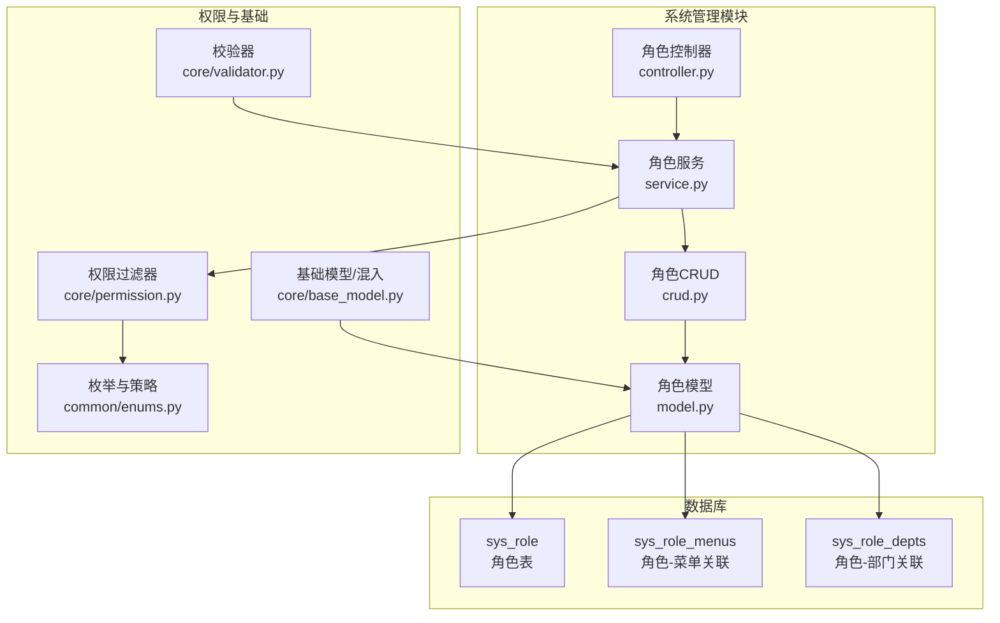
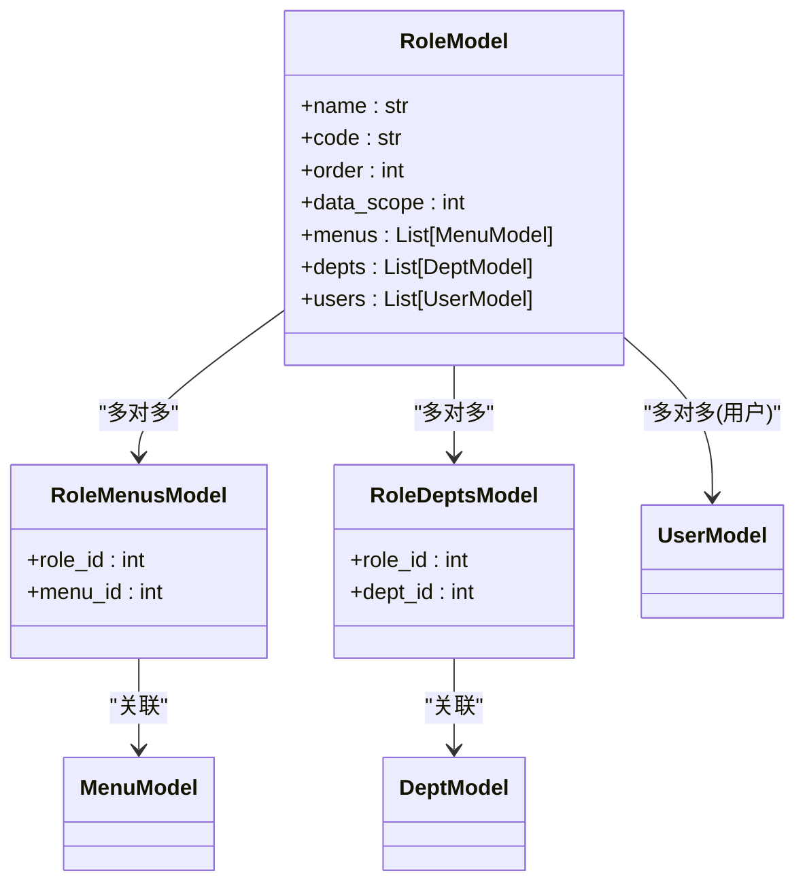
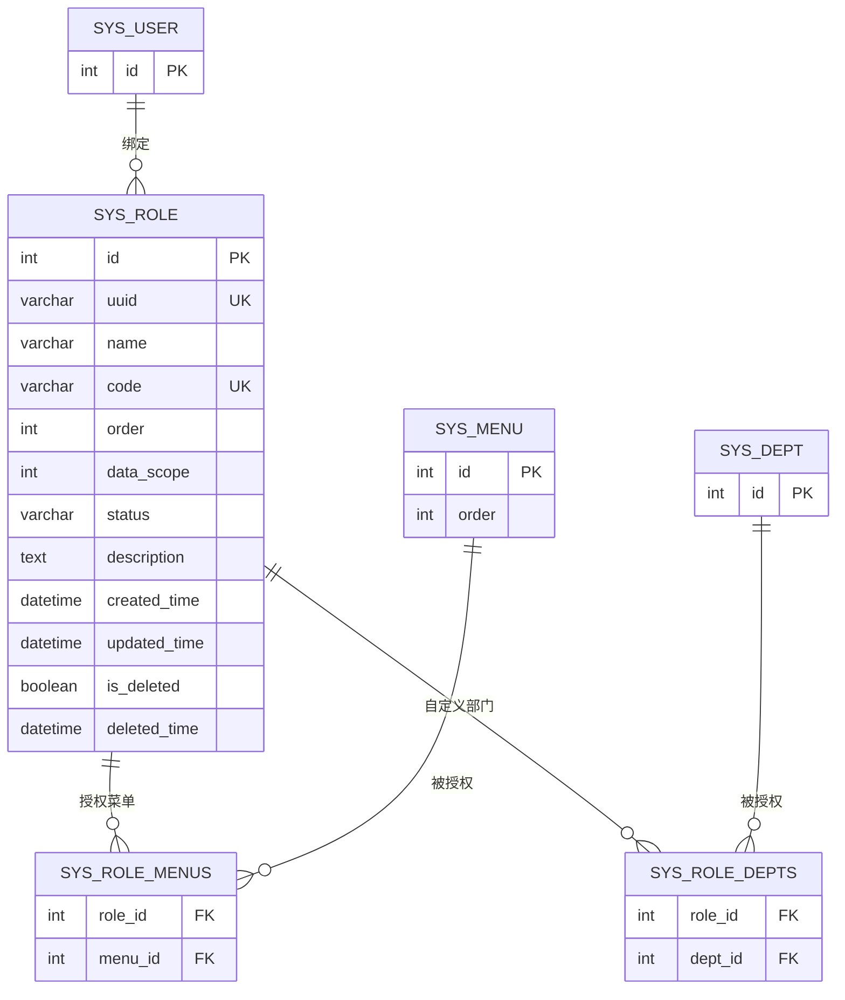
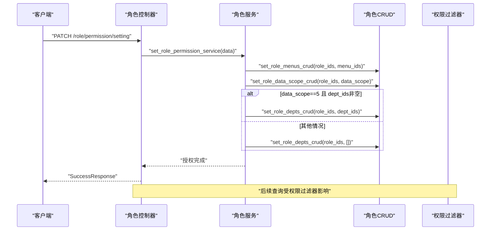
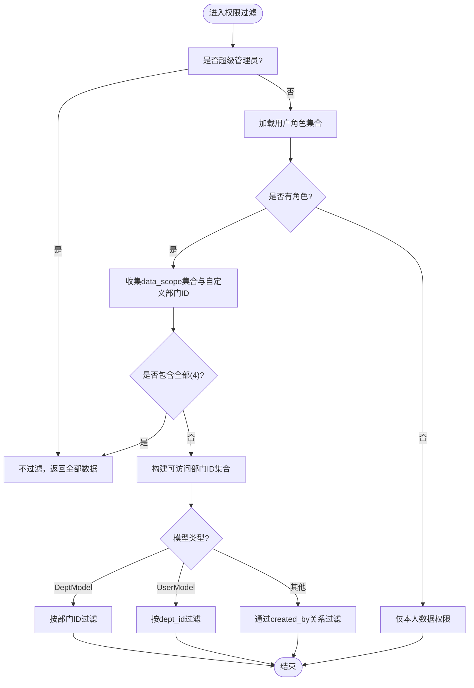
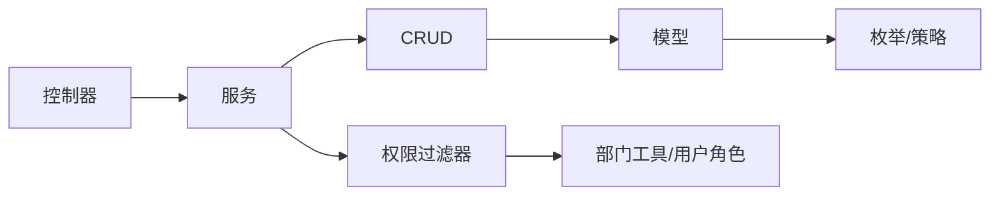

# 角色表设计

<cite>
**本文引用的文件**
- [backend/app/api/v1/module_system/role/model.py](file://backend/app/api/v1/module_system/role/model.py)
- [backend/app/api/v1/module_system/role/schema.py](file://backend/app/api/v1/module_system/role/schema.py)
- [backend/app/api/v1/module_system/role/crud.py](file://backend/app/api/v1/module_system/role/crud.py)
- [backend/app/api/v1/module_system/role/service.py](file://backend/app/api/v1/module_system/role/service.py)
- [backend/app/api/v1/module_system/role/controller.py](file://backend/app/api/v1/module_system/role/controller.py)
- [backend/app/core/permission.py](file://backend/app/core/permission.py)
- [backend/app/common/enums.py](file://backend/app/common/enums.py)
- [backend/app/core/base_model.py](file://backend/app/core/base_model.py)
- [backend/app/core/validator.py](file://backend/app/core/validator.py)
- [backend/sql/postgres/fastapiadmin_2026-04-19_224727.sql](file://backend/sql/postgres/fastapiadmin_2026-04-19_224727.sql)
</cite>

## 目录
1. [简介](#简介)
2. [项目结构](#项目结构)
3. [核心组件](#核心组件)
4. [架构总览](#架构总览)
5. [详细组件分析](#详细组件分析)
6. [依赖分析](#依赖分析)
7. [性能考虑](#性能考虑)
8. [故障排查指南](#故障排查指南)
9. [结论](#结论)

## 简介
本文件围绕 FastapiAdmin 的角色表（sys_role）进行系统化设计说明，涵盖核心字段设计意图、数据权限范围五种模式的实现机制与使用场景、角色与菜单/部门的多对多关联关系、业务规则（如角色编码唯一性、状态管理）、以及性能优化与查询建议。文档同时给出基于源码的架构图与流程图，帮助读者快速理解并落地实施。

## 项目结构
角色模块位于系统管理模块之下，采用“控制器-服务-数据访问-模型”的分层组织，配合权限过滤器实现数据权限控制。数据库层面通过三张表完成角色的完整生命周期与权限关联：sys_role（角色主表）、sys_role_menus（角色-菜单关联）、sys_role_depts（角色-部门关联）。

图表来源
- [backend/app/api/v1/module_system/role/controller.py:24-244](file://backend/app/api/v1/module_system/role/controller.py#L24-L244)
- [backend/app/api/v1/module_system/role/service.py:18-242](file://backend/app/api/v1/module_system/role/service.py#L18-L242)
- [backend/app/api/v1/module_system/role/crud.py:12-135](file://backend/app/api/v1/module_system/role/crud.py#L12-L135)
- [backend/app/api/v1/module_system/role/model.py:64-100](file://backend/app/api/v1/module_system/role/model.py#L64-L100)
- [backend/app/core/permission.py:13-311](file://backend/app/core/permission.py#L13-L311)
- [backend/app/common/enums.py:111-122](file://backend/app/common/enums.py#L111-L122)
- [backend/app/core/base_model.py:40-228](file://backend/app/core/base_model.py#L40-L228)
- [backend/app/core/validator.py:180-297](file://backend/app/core/validator.py#L180-L297)

章节来源
- [backend/app/api/v1/module_system/role/controller.py:24-244](file://backend/app/api/v1/module_system/role/controller.py#L24-L244)
- [backend/app/api/v1/module_system/role/service.py:18-242](file://backend/app/api/v1/module_system/role/service.py#L18-L242)
- [backend/app/api/v1/module_system/role/crud.py:12-135](file://backend/app/api/v1/module_system/role/crud.py#L12-L135)
- [backend/app/api/v1/module_system/role/model.py:64-100](file://backend/app/api/v1/module_system/role/model.py#L64-L100)
- [backend/app/core/permission.py:13-311](file://backend/app/core/permission.py#L13-L311)
- [backend/app/common/enums.py:111-122](file://backend/app/common/enums.py#L111-L122)
- [backend/app/core/base_model.py:40-228](file://backend/app/core/base_model.py#L40-L228)
- [backend/app/core/validator.py:180-297](file://backend/app/core/validator.py#L180-L297)

## 核心组件
- 角色模型（RoleModel）：定义角色表字段、多对多关系、权限过滤策略与加载策略。
- 角色关联模型：sys_role_menus（角色-菜单）、sys_role_depts（角色-部门）。
- 角色服务（RoleService）：封装角色的增删改查、权限设置、导出等业务逻辑。
- 角色CRUD（RoleCRUD）：封装角色的查询、批量设置菜单/数据范围/部门等数据访问。
- 权限过滤器（Permission）：基于角色数据权限范围实现数据隔离。
- 枚举与策略（PermissionFilterStrategy）：统一权限过滤策略入口。
- 基础模型（ModelMixin）：提供通用审计字段与加载策略说明。
- 校验器（role_permission_request_validator、validate_required_code）：保障角色权限配置与编码规范。

章节来源
- [backend/app/api/v1/module_system/role/model.py:64-100](file://backend/app/api/v1/module_system/role/model.py#L64-L100)
- [backend/app/api/v1/module_system/role/schema.py:21-126](file://backend/app/api/v1/module_system/role/schema.py#L21-L126)
- [backend/app/api/v1/module_system/role/crud.py:12-135](file://backend/app/api/v1/module_system/role/crud.py#L12-L135)
- [backend/app/api/v1/module_system/role/service.py:18-242](file://backend/app/api/v1/module_system/role/service.py#L18-L242)
- [backend/app/core/permission.py:13-311](file://backend/app/core/permission.py#L13-L311)
- [backend/app/common/enums.py:111-122](file://backend/app/common/enums.py#L111-L122)
- [backend/app/core/base_model.py:40-228](file://backend/app/core/base_model.py#L40-L228)
- [backend/app/core/validator.py:180-297](file://backend/app/core/validator.py#L180-L297)

## 架构总览
角色表与菜单、部门的多对多关系通过中间表维护；权限过滤器依据角色的 data_scope 字段与用户角色集合动态生成查询条件，实现“仅本人”、“本部门”、“本部门及以下”、“全部”、“自定义”五种数据权限范围。

图表来源
- [backend/app/api/v1/module_system/role/model.py:15-100](file://backend/app/api/v1/module_system/role/model.py#L15-L100)

章节来源
- [backend/app/api/v1/module_system/role/model.py:15-100](file://backend/app/api/v1/module_system/role/model.py#L15-L100)

## 详细组件分析

### 角色表核心字段设计
- 角色名称（name）：角色展示名称，最大长度限制，用于界面与日志识别。
- 角色编码（code）：全局唯一编码，具备严格格式校验（字母开头、允许字母/数字/下划线、长度2-16），保证系统内角色标识的规范性与一致性。
- 显示排序（order）：整型排序字段，默认值为较大数值，便于在界面中进行排序展示。
- 数据权限范围（data_scope）：整型枚举，取值1~5分别代表“仅本人”、“本部门”、“本部门及以下”、“全部”、“自定义”。该字段是权限过滤器的核心判断依据。
- 状态（status）：字符型状态字段，0表示正常、1表示禁用，配合服务层的状态变更接口使用。
- 描述（description）：文本描述字段，用于补充说明。
- 审计字段：id、uuid、created_time、updated_time、is_deleted、deleted_time，遵循统一的审计与软删除策略。
- 关系字段：
  - menus：通过 sys_role_menus 与菜单表建立多对多关系，并按菜单排序字段排序。
  - depts：通过 sys_role_depts 与部门表建立多对多关系，仅在 data_scope=5（自定义）时生效。
  - users：通过 sys_user_roles 与用户表建立多对多关系，用于用户绑定角色。

章节来源
- [backend/app/api/v1/module_system/role/model.py:64-100](file://backend/app/api/v1/module_system/role/model.py#L64-L100)
- [backend/app/api/v1/module_system/role/schema.py:21-91](file://backend/app/api/v1/module_system/role/schema.py#L21-L91)
- [backend/app/core/base_model.py:70-126](file://backend/app/core/base_model.py#L70-L126)
- [backend/sql/postgres/fastapiadmin_2026-04-19_224727.sql:2406-2419](file://backend/sql/postgres/fastapiadmin_2026-04-19_224727.sql#L2406-L2419)

### 数据权限范围五种模式的实现机制与使用场景
- 仅本人（1）：过滤条件为业务模型的创建人字段等于当前用户ID。适合个人工作台、个人报表等场景。
- 本部门（2）：过滤条件为业务模型的创建人所在部门ID等于当前用户所在部门ID。适合部门内部数据隔离。
- 本部门及以下（3）：通过部门树递归计算当前用户所在部门及其子部门集合，再据此过滤。适合需要跨层级部门协作但限制在组织架构内的场景。
- 全部（4）：不过滤，返回全部数据。适合超级管理员或特定高权限角色。
- 自定义（5）：结合 sys_role_depts 表，仅允许当前角色关联的部门集合参与过滤。适合复杂组织或矩阵式管理场景。

权限过滤器根据用户角色集合与 data_scope 组合生成最终过滤条件，若任一角色具有“全部”权限，则整体不过滤；否则按部门集合与“仅本人”策略组合判定。

章节来源
- [backend/app/core/permission.py:20-311](file://backend/app/core/permission.py#L20-L311)
- [backend/app/common/enums.py:111-122](file://backend/app/common/enums.py#L111-L122)
- [backend/app/api/v1/module_system/role/model.py:81-86](file://backend/app/api/v1/module_system/role/model.py#L81-L86)

### 角色与菜单、部门的多对多关联关系
- sys_role_menus：维护角色与菜单的授权关系，支持按菜单排序字段排序，便于前端菜单渲染。
- sys_role_depts：维护角色与部门的自定义数据权限关系，仅在 data_scope=5 时使用。
- 关系加载策略：采用 selectin 预加载，减少 N+1 查询，提升列表与详情加载性能。

图表来源
- [backend/sql/postgres/fastapiadmin_2026-04-19_224727.sql:2406-2419](file://backend/sql/postgres/fastapiadmin_2026-04-19_224727.sql#L2406-L2419)
- [backend/sql/postgres/fastapiadmin_2026-04-19_224727.sql:2519-2522](file://backend/sql/postgres/fastapiadmin_2026-04-19_224727.sql#L2519-L2522)
- [backend/sql/postgres/fastapiadmin_2026-04-19_224727.sql:2519-2522](file://backend/sql/postgres/fastapiadmin_2026-04-19_224727.sql#L2519-L2522)

章节来源
- [backend/app/api/v1/module_system/role/model.py:88-99](file://backend/app/api/v1/module_system/role/model.py#L88-L99)
- [backend/sql/postgres/fastapiadmin_2026-04-19_224727.sql:2406-2419](file://backend/sql/postgres/fastapiadmin_2026-04-19_224727.sql#L2406-L2419)

### 业务规则与约束
- 角色编码唯一性：数据库层与服务层双重约束，确保 code 全局唯一。
- 角色状态管理：支持批量启用/停用，状态字段为字符型，0表示正常、1表示禁用。
- 角色继承与权限传递：通过用户绑定的角色集合与 data_scope 组合，形成“角色-权限”的叠加效果；若任一角色为“全部”，则整体不过滤。
- 编码校验：角色编码需满足字母开头、仅字母/数字/下划线、长度2-16的要求。
- 权限配置校验：角色授权时需校验 data_scope 合法性与角色列表非空。

章节来源
- [backend/app/api/v1/module_system/role/model.py:76-86](file://backend/app/api/v1/module_system/role/model.py#L76-L86)
- [backend/app/api/v1/module_system/role/schema.py:21-78](file://backend/app/api/v1/module_system/role/schema.py#L21-L78)
- [backend/app/core/validator.py:180-297](file://backend/app/core/validator.py#L180-L297)
- [backend/app/api/v1/module_system/role/service.py:109-132](file://backend/app/api/v1/module_system/role/service.py#L109-L132)

### 角色授权流程（设置菜单/数据范围/部门）

图表来源
- [backend/app/api/v1/module_system/role/controller.py:190-213](file://backend/app/api/v1/module_system/role/controller.py#L190-L213)
- [backend/app/api/v1/module_system/role/service.py:155-181](file://backend/app/api/v1/module_system/role/service.py#L155-L181)
- [backend/app/api/v1/module_system/role/crud.py:60-122](file://backend/app/api/v1/module_system/role/crud.py#L60-L122)
- [backend/app/core/permission.py:41-86](file://backend/app/core/permission.py#L41-L86)

章节来源
- [backend/app/api/v1/module_system/role/controller.py:190-213](file://backend/app/api/v1/module_system/role/controller.py#L190-L213)
- [backend/app/api/v1/module_system/role/service.py:155-181](file://backend/app/api/v1/module_system/role/service.py#L155-L181)
- [backend/app/api/v1/module_system/role/crud.py:60-122](file://backend/app/api/v1/module_system/role/crud.py#L60-L122)

### 数据权限范围算法流程

图表来源
- [backend/app/core/permission.py:183-311](file://backend/app/core/permission.py#L183-L311)

章节来源
- [backend/app/core/permission.py:183-311](file://backend/app/core/permission.py#L183-L311)

## 依赖分析
- 控制器依赖服务层暴露的接口，负责路由与鉴权。
- 服务层依赖CRUD层进行数据访问，并调用权限过滤器进行数据隔离。
- 模型层定义实体关系与加载策略，依赖枚举与基础混入类。
- 权限过滤器依赖用户角色集合与部门工具函数，实现部门树递归与ID集合构建。

图表来源
- [backend/app/api/v1/module_system/role/controller.py:24-244](file://backend/app/api/v1/module_system/role/controller.py#L24-L244)
- [backend/app/api/v1/module_system/role/service.py:18-242](file://backend/app/api/v1/module_system/role/service.py#L18-L242)
- [backend/app/api/v1/module_system/role/crud.py:12-135](file://backend/app/api/v1/module_system/role/crud.py#L12-L135)
- [backend/app/api/v1/module_system/role/model.py:64-100](file://backend/app/api/v1/module_system/role/model.py#L64-L100)
- [backend/app/common/enums.py:111-122](file://backend/app/common/enums.py#L111-L122)
- [backend/app/core/permission.py:13-311](file://backend/app/core/permission.py#L13-L311)

章节来源
- [backend/app/api/v1/module_system/role/controller.py:24-244](file://backend/app/api/v1/module_system/role/controller.py#L24-L244)
- [backend/app/api/v1/module_system/role/service.py:18-242](file://backend/app/api/v1/module_system/role/service.py#L18-L242)
- [backend/app/api/v1/module_system/role/crud.py:12-135](file://backend/app/api/v1/module_system/role/crud.py#L12-L135)
- [backend/app/api/v1/module_system/role/model.py:64-100](file://backend/app/api/v1/module_system/role/model.py#L64-L100)
- [backend/app/common/enums.py:111-122](file://backend/app/common/enums.py#L111-L122)
- [backend/app/core/permission.py:13-311](file://backend/app/core/permission.py#L13-L311)

## 性能考虑
- 预加载策略：角色模型对 menus、depts、users 使用 selectin 预加载，降低 N+1 查询开销。
- 索引设计：角色表对常用查询字段（id、uuid、status、is_deleted、created_time、updated_time、deleted_time）建立索引，提升查询与软删除场景的效率。
- 权限过滤成本：部门树递归计算可能带来额外查询，建议在高频场景缓存部门树或使用物化路径/邻接列表优化。
- 批量操作：授权设置采用批量清空与扩展的方式，减少多次往返；前端传参时尽量避免不必要的空数组导致的全量查询。
- 导出性能：导出前先拉取列表，再进行内存映射导出，适合中小规模数据；大规模导出建议分页流式输出。

章节来源
- [backend/app/api/v1/module_system/role/model.py:91-99](file://backend/app/api/v1/module_system/role/model.py#L91-L99)
- [backend/sql/postgres/fastapiadmin_2026-04-19_224727.sql:5719-5765](file://backend/sql/postgres/fastapiadmin_2026-04-19_224727.sql#L5719-L5765)
- [backend/app/api/v1/module_system/role/crud.py:70-83](file://backend/app/api/v1/module_system/role/crud.py#L70-L83)

## 故障排查指南
- 角色编码冲突：创建/更新时若提示编码已存在，检查 code 是否重复或格式不符合要求（validate_required_code）。
- 角色名称冲突：更新时若提示名称重复，检查是否存在同名角色且非当前ID。
- 权限设置异常：data_scope 非法或角色列表为空会导致校验失败；确认请求体中 data_scope 在1~5范围内且 role_ids 非空。
- 数据权限不生效：确认用户角色集合与 data_scope 设置；若任一角色为“全部”，将不过滤；否则检查部门树递归与自定义部门ID集合是否正确。
- 导出内容异常：导出时会将状态与数据权限映射为中文，若显示异常，检查导出映射字典与数据结构。

章节来源
- [backend/app/api/v1/module_system/role/service.py:109-132](file://backend/app/api/v1/module_system/role/service.py#L109-L132)
- [backend/app/api/v1/module_system/role/schema.py:21-78](file://backend/app/api/v1/module_system/role/schema.py#L21-L78)
- [backend/app/core/validator.py:267-297](file://backend/app/core/validator.py#L267-L297)
- [backend/app/core/permission.py:249-285](file://backend/app/core/permission.py#L249-L285)

## 结论
角色表（sys_role）通过明确的字段设计、严格的编码与状态约束、以及灵活的数据权限范围机制，实现了从“角色-菜单-部门”到“数据隔离”的完整闭环。配合合理的预加载策略与索引设计，可在保证安全性的前提下获得良好的查询与授权性能。实际部署中建议结合业务场景选择合适的数据权限模式，并对部门树与批量授权流程进行监控与优化。