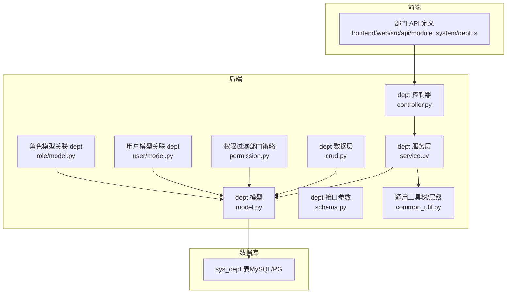
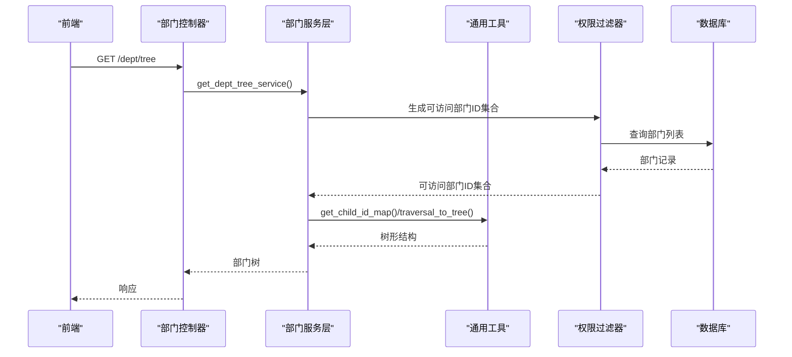
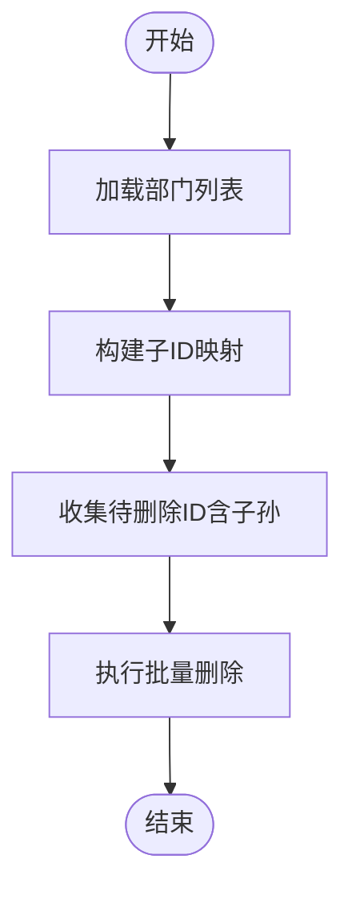
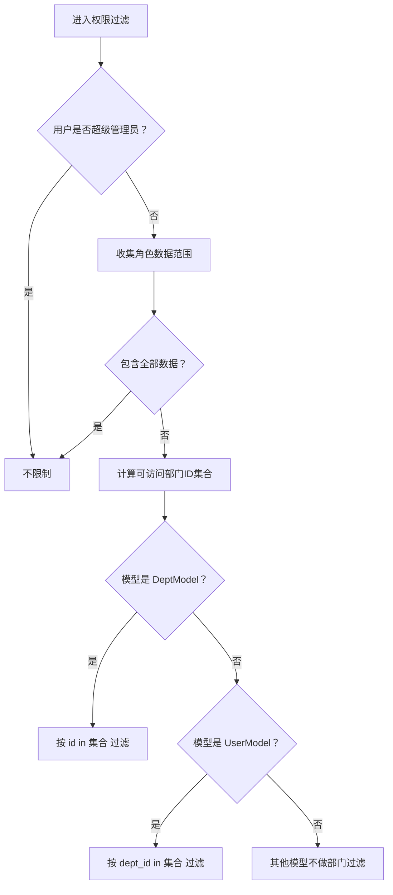
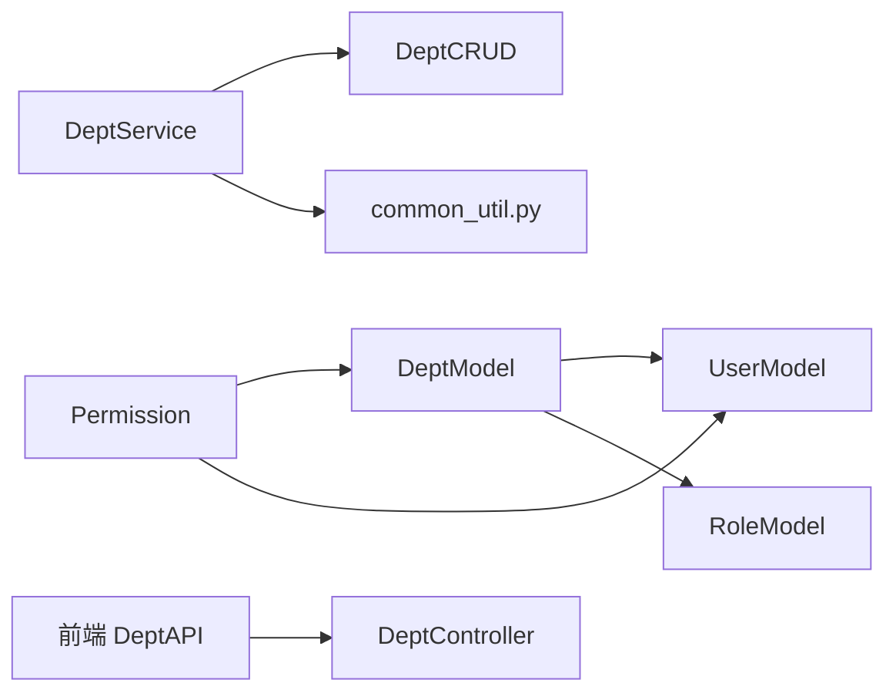

# 部门表设计

<cite>
**本文档引用的文件**
- [sys_dept 表结构定义（MySQL）](file://backend/sql/mysql/fastapiadmin_2026-04-19_223353.sql)
- [sys_dept 表结构定义（PostgreSQL）](file://backend/sql/postgres/fastapiadmin_2026-04-19_224727.sql)
- [部门模型定义](file://backend/app/api/v1/module_system/dept/model.py)
- [部门接口参数与校验](file://backend/app/api/v1/module_system/dept/schema.py)
- [部门控制器](file://backend/app/api/v1/module_system/dept/controller.py)
- [部门服务层](file://backend/app/api/v1/module_system/dept/service.py)
- [部门数据访问层](file://backend/app/api/v1/module_system/dept/crud.py)
- [通用工具函数（树与层级算法）](file://backend/app/utils/common_util.py)
- [权限过滤器（基于部门）](file://backend/app/core/permission.py)
- [用户模型（部门关联）](file://backend/app/api/v1/module_system/user/model.py)
- [角色模型（部门关联）](file://backend/app/api/v1/module_system/role/model.py)
- [初始化脚本（部门数据）](file://backend/app/scripts/initialize.py)
- [前端部门接口定义](file://frontend/web/src/api/module_system/dept.ts)
- [部门示例数据](file://backend/app/scripts/data/sys_dept.json)
</cite>

## 目录
1. [引言](#引言)
2. [项目结构](#项目结构)
3. [核心组件](#核心组件)
4. [架构总览](#架构总览)
5. [详细组件分析](#详细组件分析)
6. [依赖分析](#依赖分析)
7. [性能考量](#性能考量)
8. [故障排查指南](#故障排查指南)
9. [结论](#结论)
10. [附录](#附录)

## 引言
本文件面向 FastapiAdmin 的部门表（sys_dept），提供从数据库表结构到后端模型、服务、权限过滤、前端交互的全链路设计文档。重点覆盖：
- 核心字段设计与约束
- 层级结构与组织树维护
- 与用户表、角色表的关联关系
- 数据权限控制策略
- 业务规则与性能优化建议

## 项目结构
部门相关代码分布于后端模块 system 的 dept 子模块，并与通用工具、权限过滤、用户/角色模型协同工作；前端通过统一 API 调用部门树与 CRUD。

图表来源
- [部门模型定义:14-59](file://backend/app/api/v1/module_system/dept/model.py#L14-L59)
- [部门接口参数与校验:9-102](file://backend/app/api/v1/module_system/dept/schema.py#L9-L102)
- [部门控制器:16-190](file://backend/app/api/v1/module_system/dept/controller.py#L16-L190)
- [部门服务层:21-190](file://backend/app/api/v1/module_system/dept/service.py#L21-L190)
- [部门数据访问层:10-110](file://backend/app/api/v1/module_system/dept/crud.py#L10-L110)
- [通用工具函数（树与层级算法）:90-200](file://backend/app/utils/common_util.py#L90-L200)
- [权限过滤器（基于部门）:13-311](file://backend/app/core/permission.py#L13-L311)
- [用户模型（部门关联）:110-128](file://backend/app/api/v1/module_system/user/model.py#L110-L128)
- [角色模型（部门关联）:50-99](file://backend/app/api/v1/module_system/role/model.py#L50-L99)
- [sys_dept 表结构定义（MySQL）:312-339](file://backend/sql/mysql/fastapiadmin_2026-04-19_223353.sql#L312-L339)
- [sys_dept 表结构定义（PostgreSQL）:1139-1216](file://backend/sql/postgres/fastapiadmin_2026-04-19_224727.sql#L1139-L1216)
- [前端部门接口定义:1-83](file://frontend/web/src/api/module_system/dept.ts#L1-L83)

章节来源
- [sys_dept 表结构定义（MySQL）:309-352](file://backend/sql/mysql/fastapiadmin_2026-04-19_223353.sql#L309-L352)
- [sys_dept 表结构定义（PostgreSQL）:1135-1216](file://backend/sql/postgres/fastapiadmin_2026-04-19_224727.sql#L1135-L1216)
- [部门模型定义:14-59](file://backend/app/api/v1/module_system/dept/model.py#L14-L59)
- [部门接口参数与校验:9-102](file://backend/app/api/v1/module_system/dept/schema.py#L9-L102)
- [部门控制器:16-190](file://backend/app/api/v1/module_system/dept/controller.py#L16-L190)
- [部门服务层:21-190](file://backend/app/api/v1/module_system/dept/service.py#L21-L190)
- [部门数据访问层:10-110](file://backend/app/api/v1/module_system/dept/crud.py#L10-L110)
- [通用工具函数（树与层级算法）:90-200](file://backend/app/utils/common_util.py#L90-L200)
- [权限过滤器（基于部门）:13-311](file://backend/app/core/permission.py#L13-L311)
- [用户模型（部门关联）:110-128](file://backend/app/api/v1/module_system/user/model.py#L110-L128)
- [角色模型（部门关联）:50-99](file://backend/app/api/v1/module_system/role/model.py#L50-L99)
- [前端部门接口定义:1-83](file://frontend/web/src/api/module_system/dept.ts#L1-L83)

## 核心组件
- 数据库表 sys_dept：包含部门名称、编码、排序、负责人、联系方式、层级父 ID、状态、描述、时间戳与软删标记等字段，并建立唯一索引与外键约束。
- 模型 DeptModel：定义 ORM 字段、树形关系（父子）、与用户/角色的多对多关联。
- 服务层 DeptService：封装树查询、详情查询、创建/更新/删除、批量启停等业务逻辑。
- 工具函数：提供父子 ID 映射、递归收集、树形组装等算法支持。
- 权限过滤：基于部门策略的权限隔离，结合角色数据范围动态生成可访问部门集合。

章节来源
- [sys_dept 表结构定义（MySQL）:312-339](file://backend/sql/mysql/fastapiadmin_2026-04-19_223353.sql#L312-L339)
- [sys_dept 表结构定义（PostgreSQL）:1139-1216](file://backend/sql/postgres/fastapiadmin_2026-04-19_224727.sql#L1139-L1216)
- [部门模型定义:14-59](file://backend/app/api/v1/module_system/dept/model.py#L14-L59)
- [部门服务层:21-190](file://backend/app/api/v1/module_system/dept/service.py#L21-L190)
- [通用工具函数（树与层级算法）:90-200](file://backend/app/utils/common_util.py#L90-L200)
- [权限过滤器（基于部门）:134-311](file://backend/app/core/permission.py#L134-L311)

## 架构总览
部门模块遵循“控制器-服务-数据层-模型”的分层设计，配合通用工具与权限过滤器，形成完整的组织架构管理闭环。

图表来源
- [部门控制器:19-48](file://backend/app/api/v1/module_system/dept/controller.py#L19-L48)
- [部门服务层:47-72](file://backend/app/api/v1/module_system/dept/service.py#L47-L72)
- [权限过滤器（基于部门）:134-172](file://backend/app/core/permission.py#L134-L172)
- [通用工具函数（树与层级算法）:127-200](file://backend/app/utils/common_util.py#L127-L200)

## 详细组件分析

### 数据表设计（sys_dept）
- 字段要点
  - 名称、编码、排序：用于展示与唯一性约束
  - 负责人、手机、邮箱：联系信息
  - 父级部门 parent_id：自引用外键，支持层级树
  - 状态、描述、时间戳、软删：生命周期与审计
- 约束与索引
  - 唯一约束：编码唯一
  - 外键约束：parent_id 引用自身 id，ON DELETE SET NULL，ON UPDATE CASCADE
  - 复合索引：按 id、parent_id、状态、is_deleted、updated_time 等维度建立
- 设计考虑
  - 编码唯一确保业务唯一性
  - 父子外键支持灵活的组织树
  - 软删字段便于审计与恢复

章节来源
- [sys_dept 表结构定义（MySQL）:312-339](file://backend/sql/mysql/fastapiadmin_2026-04-19_223353.sql#L312-L339)
- [sys_dept 表结构定义（PostgreSQL）:1139-1216](file://backend/sql/postgres/fastapiadmin_2026-04-19_224727.sql#L1139-L1216)

### 模型与关系（DeptModel）
- 核心字段与注释来自表结构
- 树形关系
  - parent：一对一回溯父节点
  - children：一对多展开子节点
- 关联关系
  - 与用户：一对多（用户属于部门）
  - 与角色：多对多（角色绑定部门）
- 权限策略
  - __permission_strategy__ 设为 DEPT_BASED，启用基于部门的数据权限过滤

章节来源
- [部门模型定义:14-59](file://backend/app/api/v1/module_system/dept/model.py#L14-L59)
- [用户模型（部门关联）:110-128](file://backend/app/api/v1/module_system/user/model.py#L110-L128)
- [角色模型（部门关联）:50-99](file://backend/app/api/v1/module_system/role/model.py#L50-L99)

### 服务层（DeptService）
- 树查询：先按树形加载，再用 traversal_to_tree 组装
- 详情查询：补充父部门名称
- 创建/更新：名称与编码唯一性校验
- 删除：支持批量删除，自动递归收集子部门
- 批量启停：根据状态切换，联动影响父/子部门

图表来源
- [部门服务层:125-162](file://backend/app/api/v1/module_system/dept/service.py#L125-L162)
- [通用工具函数（树与层级算法）:127-166](file://backend/app/utils/common_util.py#L127-L166)

章节来源
- [部门服务层:21-190](file://backend/app/api/v1/module_system/dept/service.py#L21-L190)
- [通用工具函数（树与层级算法）:90-200](file://backend/app/utils/common_util.py#L90-L200)

### 权限过滤（基于部门）
- 策略选择：DeptModel 的 __permission_strategy__ 为 DEPT_BASED
- 过滤逻辑
  - 若用户无角色：仅能查看自身部门
  - 否则汇总角色数据范围，生成可访问部门集合
  - 对 DeptModel：直接以 id 在集合内过滤
  - 对 UserModel：以 dept_id 在集合内过滤
- 与层级联动
  - 当数据范围包含“本部门及以下”时，通过 get_child_id_map 与 get_child_recursion 计算包含子孙的完整集合

图表来源
- [权限过滤器（基于部门）:134-311](file://backend/app/core/permission.py#L134-L311)
- [通用工具函数（树与层级算法）:127-166](file://backend/app/utils/common_util.py#L127-L166)

章节来源
- [权限过滤器（基于部门）:13-311](file://backend/app/core/permission.py#L13-L311)
- [通用工具函数（树与层级算法）:90-200](file://backend/app/utils/common_util.py#L90-L200)

### 前端交互
- API 路由
  - GET /system/dept/tree：获取部门树
  - GET /system/dept/detail/{id}：获取部门详情
  - POST /system/dept/create：创建部门
  - PUT /system/dept/update/{id}：更新部门
  - DELETE /system/dept/delete：批量删除
  - PATCH /system/dept/available/setting：批量启停
- 类型定义
  - DeptTable：包含 name、order、code、leader、phone、email、parent_id、parent_name、children 等
  - DeptForm：创建/更新表单字段

章节来源
- [前端部门接口定义:1-83](file://frontend/web/src/api/module_system/dept.ts#L1-L83)

### 初始化与示例数据
- 初始化脚本中包含 sys_dept 的初始化逻辑
- 示例数据包含根部门“集团总公司”，parent_id 为 null

章节来源
- [初始化脚本（部门数据）:87-89](file://backend/app/scripts/initialize.py#L87-L89)
- [部门示例数据:1-15](file://backend/app/scripts/data/sys_dept.json#L1-L15)

## 依赖分析
- 模型依赖
  - DeptModel 依赖 BaseModel（ModelMixin）
  - DeptModel 与 UserModel、RoleModel 通过外键与中间表建立关联
- 服务依赖
  - DeptService 依赖 DeptCRUD、通用工具函数（树/层级）
- 权限依赖
  - Permission 依赖 DeptModel、UserModel、通用工具函数
- 前端依赖
  - 前端通过 DeptAPI 调用后端路由

图表来源
- [部门模型定义:14-59](file://backend/app/api/v1/module_system/dept/model.py#L14-L59)
- [用户模型（部门关联）:110-128](file://backend/app/api/v1/module_system/user/model.py#L110-L128)
- [角色模型（部门关联）:50-99](file://backend/app/api/v1/module_system/role/model.py#L50-L99)
- [部门服务层:21-190](file://backend/app/api/v1/module_system/dept/service.py#L21-L190)
- [部门数据访问层:10-110](file://backend/app/api/v1/module_system/dept/crud.py#L10-L110)
- [通用工具函数（树与层级算法）:90-200](file://backend/app/utils/common_util.py#L90-L200)
- [权限过滤器（基于部门）:13-311](file://backend/app/core/permission.py#L13-L311)
- [前端部门接口定义:1-83](file://frontend/web/src/api/module_system/dept.ts#L1-L83)

## 性能考量
- 层级查询优化
  - 使用 get_child_id_map 与 get_child_recursion 一次性构建子映射，避免 N+1 查询
  - 树形组装 traversal_to_tree 采用哈希查找，时间复杂度 O(n)
- 权限计算优化
  - 角色数据范围聚合后一次性计算可访问部门集合
  - DeptModel/UserModel 过滤直接使用 IN 子句，减少 JOIN
- 组织架构变更
  - 删除/启停批量操作前先收集全量 ID，避免逐条查询
  - 父子状态联动时，利用 get_parent_id_map 与 get_parent_recursion 计算受影响范围
- 索引与约束
  - 建议在 parent_id、status、is_deleted、updated_time 等常用过滤字段上保持索引
  - 编码唯一索引保障业务唯一性，减少冲突检测成本

章节来源
- [部门服务层:125-190](file://backend/app/api/v1/module_system/dept/service.py#L125-L190)
- [通用工具函数（树与层级算法）:90-200](file://backend/app/utils/common_util.py#L90-L200)
- [权限过滤器（基于部门）:134-311](file://backend/app/core/permission.py#L134-L311)
- [sys_dept 表结构定义（MySQL）:328-339](file://backend/sql/mysql/fastapiadmin_2026-04-19_223353.sql#L328-L339)
- [sys_dept 表结构定义（PostgreSQL）:5264-5299](file://backend/sql/postgres/fastapiadmin_2026-04-19_224727.sql#L5264-L5299)

## 故障排查指南
- 自引用错误
  - 现象：递归获取父级/子级时报错
  - 原因：树结构中出现循环引用
  - 处理：检查 parent_id 是否指向自身或形成环
- 删除失败
  - 现象：批量删除后仍有残留
  - 原因：未正确收集子孙节点
  - 处理：确认 get_child_id_map 与 get_child_recursion 的调用路径
- 权限越权
  - 现象：能看到非本部门数据
  - 原因：角色数据范围未正确配置或权限过滤未生效
  - 处理：核对角色数据范围与 DeptModel 的 DEPT_BASED 策略
- 唯一性冲突
  - 现象：创建/更新时报编码或名称重复
  - 处理：检查编码唯一索引与服务层校验逻辑

章节来源
- [通用工具函数（树与层级算法）:103-124](file://backend/app/utils/common_util.py#L103-L124)
- [部门服务层:88-123](file://backend/app/api/v1/module_system/dept/service.py#L88-L123)
- [权限过滤器（基于部门）:134-172](file://backend/app/core/permission.py#L134-L172)

## 结论
sys_dept 表通过简洁而完备的字段设计与外键约束，支撑起灵活的组织树结构；后端以服务层为核心，结合通用工具与权限过滤器，实现了高效的树查询、批量变更与数据权限控制；前端通过标准化 API 实现组织架构的可视化与管理。整体设计在可扩展性、可维护性与性能之间取得良好平衡。

## 附录

### 字段与业务规则对照
- 字段与含义
  - name：部门名称（长度上限、必填）
  - code：部门编码（唯一、必填）
  - order：显示排序（整数、必填）
  - leader/phone/email：负责人与联系方式（可选）
  - parent_id：父部门 ID（自引用外键，可空）
  - status：状态（0 正常，1 禁用）
  - description：备注/描述（可选）
  - 时间戳与软删：created_time、updated_time、is_deleted、deleted_time
- 业务规则
  - 编码唯一性：数据库唯一约束 + 服务层校验
  - 名称唯一性：服务层校验
  - 层级限制：通过 parent_id 与外键约束保证树形结构
  - 合并与拆分：通过批量删除与状态切换实现，内部自动递归处理

章节来源
- [sys_dept 表结构定义（MySQL）:312-339](file://backend/sql/mysql/fastapiadmin_2026-04-19_223353.sql#L312-L339)
- [sys_dept 表结构定义（PostgreSQL）:1139-1216](file://backend/sql/postgres/fastapiadmin_2026-04-19_224727.sql#L1139-L1216)
- [部门接口参数与校验:9-58](file://backend/app/api/v1/module_system/dept/schema.py#L9-L58)
- [部门服务层:88-123](file://backend/app/api/v1/module_system/dept/service.py#L88-L123)